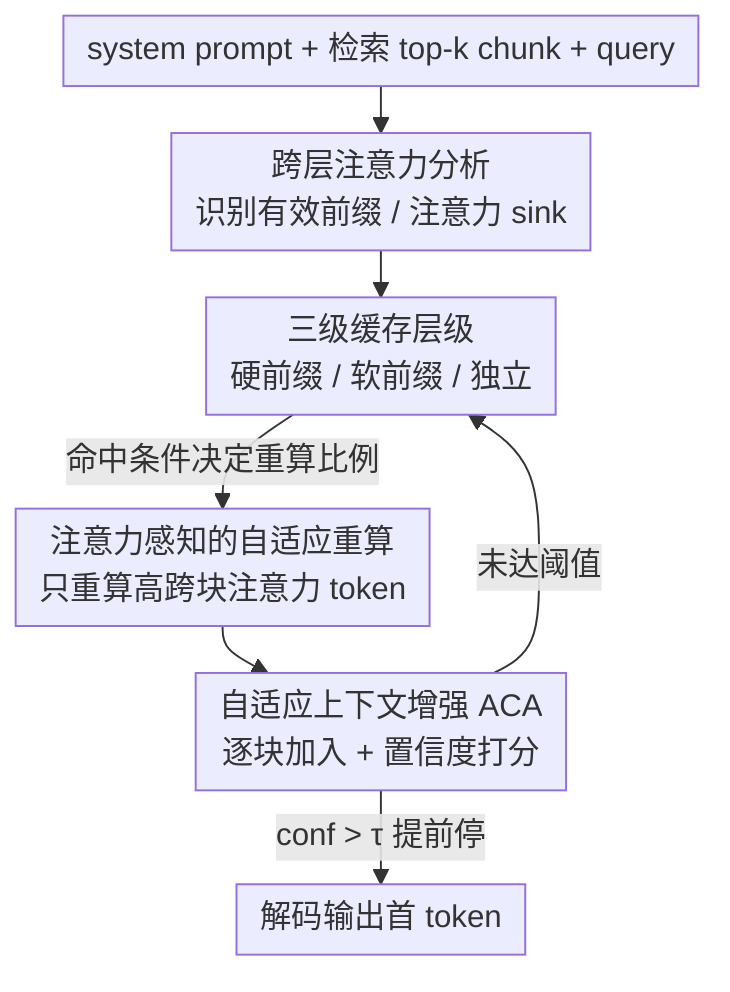

# AdaCache: Adaptive Caching and Context Augmentation for Efficient LLM Serving

**会议**: ICLR 2026  
**OpenReview**: [https://openreview.net/forum?id=Bmvx8ybDzo](https://openreview.net/forum?id=Bmvx8ybDzo)  
**代码**: 待确认  
**领域**: LLM效率 / RAG / KV缓存 / 推理加速  
**关键词**: RAG 服务、KV 缓存复用、选择性重算、自适应上下文、TTFT

## 一句话总结
AdaCache 针对 RAG 推理的两类浪费——同一文本块被反复重算、以及不分难度地塞满 top-k 上下文——提出"分层缓存 + 注意力感知的选择性重算"与"置信度驱动的自适应上下文扩展"两套机制，在六个数据集、三个模型上把首 token 延迟（TTFT）相比最强 RAG 缓存系统降低 1.4×∼5.0×，且生成质量基本不掉。

## 研究背景与动机
**领域现状**：RAG 通过把检索到的外部文本块（chunk）拼进 prompt 来缓解大模型的幻觉和知识陈旧问题，已经成为让通用 LLM 处理专业问题的主流范式。但拼接会让序列急剧变长：一个原始 query 通常不到 200 token，拼上检索上下文后能轻松超过 2000 token，带来 10× 以上的计算和显存开销，prefill 阶段因此主导了服务延迟，直接拖垮 TTFT 和吞吐。

**现有痛点**：作者观测到当前 RAG 系统有两个根本性的低效。其一是**跨 query 的上下文重叠**——同一批热门 chunk 被不同 query 反复检索、反复重算。作者在 MMLU 上看到 chunk 访问呈幂律分布：最热门的 10% chunk 满足了 80% 的 top-1 检索请求，意味着大量重复计算。其二是**单 query 内的上下文过度供给**——不管问题难易都统一塞满 top-k。但准确率对检索深度是边际效益递减的：超过 60% 的 query 只需要极少上下文就能答对，只有约 3% 真正需要 top-8。静态深检索在简单 query 上白白烧算力，还可能因为引入噪声反而掉点。

**核心矛盾**：要同时拿到 RAG 的质量收益和推理效率，本质上要在"缓存复用率"和"生成保真度"之间、以及"上下文充分性"和"计算开销"之间各做一次权衡。已有缓存方案都卡在某一端：前缀缓存（vLLM、SGLang、RAGCache）要求**精确前缀匹配**，长上下文下命中率极低；独立块缓存里 PromptCache 命中率高但**完全丢掉跨块注意力**导致掉准确率；CacheBlend 用选择性重算部分恢复跨块注意力，却对所有 chunk **用统一的重算比例**，无视不同 chunk 注意力特性的异质性。而且所有前作都假设 static top-k，错失了按 query 自适应的优化空间。

**核心 idea**：用"分层缓存 + 按匹配条件自适应的选择性重算"解决跨 query 重算冗余，同时用"置信度驱动、逐块递增的上下文扩展"解决上下文过度供给，两套机制正交互补，可叠加在已有缓存策略之上。

## 方法详解

### 整体框架
AdaCache 是一个加在 RAG prefill 阶段的缓存框架，输入是 system prompt + 检索到的 top-k 文本块 + query，输出是答案的 KV 状态与首 token，目标是在保证生成质量的前提下尽量少算 token。它由两个互补模块组成：上半部分 **Cache-aware Selective Recomputation** 维护一套三级缓存空间（硬前缀 / 软前缀 / 独立），来块时按匹配条件分层命中、只重算少量"注意力关键 token"；下半部分 **Adaptive Context Augmentation (ACA)** 不再一次性拼满 top-k，而是每次只加一个 chunk、加完用轻量置信度打分，够了就提前停。两个模块的衔接点是：ACA 每轮新加的 chunk 由前一个模块负责高效地算/复用 KV，并把结果存进硬前缀缓存供后续轮次直接复用。

### 关键设计

**1. 跨层注意力分析：从注意力模式里挖出"哪些 chunk 才是有效前缀"**

独立块缓存最大的问题是丢掉了跨块注意力，但作者发现：恢复全部跨块依赖其实没必要。把增广 prompt 切成 `[system prompt, chunk 1, …, chunk k, query]` 后按 chunk 粒度聚合每层注意力，可以看到清晰的深度分层规律——浅层（如 Qwen3-8B 的 1–18 层）是**局部注意力**，每个 chunk 主要只盯着它的前一个 chunk；深层（19–36 层）则出现**注意力 sink**，某个特定 chunk 吸走了后续 chunk 的大部分注意力。这意味着只有一小撮 chunk 真正充当"有效前缀"（前半层是 predecessor chunk，后半层是 sink chunk + predecessor chunk）。这一观察是后面所有缓存设计的依据：与其精确匹配整条前缀，不如只对这些关键 chunk 做"部分前缀匹配"，就能保住大部分跨块依赖。作者在 Llama3-8B、Qwen3-4B/8B × 三个数据集上验证了规律一致（只是具体 sink 位置随上下文变化）。

**2. 三级缓存层级：用逐级放宽的匹配条件换更高命中率**

针对前缀缓存"要么精确匹配、要么不命中"的二元困境，AdaCache 建了一个三层缓存空间，沿"保真度↓、命中率↑"方向递进。**硬前缀缓存（Hard Prefix Cache）**要求精确前缀序列匹配——由于自回归的因果注意力掩码，精确前缀命中在数学上等价于全量重算，能完美保质，但匹配条件最苛刻、利用率最低。**软前缀缓存（Soft Prefix Cache）**把匹配条件放宽到"有效前缀匹配"：只要 sink chunk 或 predecessor chunk 对上就允许复用，命中时需要重算 $\alpha$ 比例的 token 来恢复全局跨块注意力；注意软前缀 chunk 只作为缓存 key 标识、不单独存 KV。**独立缓存（Independent Cache）**是兜底：每个 chunk 独立预算、独立存，命中率最高，但跨块依赖全靠推理时重建，保质风险最大，命中时需要重算更高比例 $\beta$ 的 token（$\beta > \alpha$）。来一个 chunk 时按"硬 → 软 → 独立"顺序逐级查询，匹配条件越松、重算越多。

**3. 注意力感知的自适应重算：只重算少数关键 token，且重算比例随匹配条件而变**

恢复跨块注意力如果对整块所有 token 都重算就太贵。作者沿用 CacheBlend 的观察并强化：每个 chunk 里只有一小撮 token 有显著跨块注意力、其 KV 状态偏差最大，而且这种稀疏模式**跨层一致**——某 token 在第一层 KV 偏差最大，后续层大概率也最大。于是只需在**首层**分析每个 token 的跨块注意力占比，挑出占比最高的那批 token，把这一选择套用到所有层做重算即可。和 CacheBlend 对所有 chunk 用统一比例不同，AdaCache 的重算比例由命中层级决定：硬前缀命中则路径上的 chunk 直接复用、零重算；软前缀命中重算 $\alpha$；落到独立缓存才重算 $\beta$。这样就在"精确 / 部分 / 缺失"三种前缀匹配条件下，自适应地取到效率—精度的最优折中。

**4. 自适应上下文增强（ACA）：用轻量置信度决定每个 query 该看多少上下文**

针对"不分难度塞满 top-k"的浪费，ACA 不再一次性拼全部 chunk，而是**逐块递增**：从 1 个 chunk 开始，每加一个就评估一次置信度，达到阈值 $\tau$ 或加到第 k 个就停（Algorithm 1）。关键是这不增加额外开销——top-k 检索每个 query 只跑一次，扩展循环只在 prefill 内部对已检索的 chunk 操作；而且每轮只重算新加 chunk 的 KV、存进硬前缀缓存，之前所有 chunk 都缓存命中。置信度用一个复合指标：

$$\mathrm{conf} = \lambda \cdot \widehat{\mathrm{KL}}(O_{1..l-1}, O_l) + (1-\lambda)\cdot \widehat{H}(O_l)$$

第一项是最后 $l$ 层 logits 与最终层 logits 的**平均 KL 散度** $\mathrm{KL} = \tfrac{1}{k}\sum D_{\mathrm{KL}}(L_i \| L_j)$，刻画跨层推理一致性——如果模型已经能从当前上下文推出答案，各层 logit 分布会很早收敛；第二项是最终 token 分布的**熵** $H = -\sum p_i \log p_i$，刻画输出不确定性。两项都归一化到 $[0,1]$，权重 $\lambda$ 在验证集上调出。这个指标极轻：实际只对**最后 4 层**和**最后一个 token** 算 logits，开销小于 prefill 的 1%。给定 $k$ 个长度 $l_c$ 的 chunk、长度 $l_q$ 的 query，若在第 $t$ 步提前停，ACA 最多处理 $t\cdot(l_c+l_q)$ token，而静态扩展要处理 $k\cdot l_c + l_q$——论文举例 top-6、期望 $t=2$ 时算约 2.5× 的计算节省。

### 损失函数 / 训练策略
本方法无需训练，是纯推理期的缓存与调度机制。唯一需要"学"的是置信度复合指标里的权重 $\lambda$ 与阈值 $\tau$，通过在验证集上优化确定；重算比例 $\alpha, \beta$ 是按缓存层级设定的超参。

## 实验关键数据

### 主实验
模型用 Llama-3-8B-Instruct、Qwen3-4B、Qwen3-8B；知识库为 Wikipedia（512 token 切块，e5-base-v2 编码，FAISS IVF 索引，默认 top-6）；数据集涵盖 MMLU、MMLU-Pro、SuperGPQA、TriviaQA、2WikiMultihopQA、HotpotQA。指标为 EM（准确率）与 TTFT（首 token 延迟）。硬件为单张 RTX 6000 Ada（48 GB）。

| 对比基线 | 平均 TTFT 加速 | 最高加速 | 生成质量 |
|----------|----------------|----------|----------|
| Full Recomputation | 3.12× | 6.02× | 基本持平，偶尔反超 |
| Prefix Caching（SGLang，含 RAM/SSD 加载乐观假设） | 2.69× | 5.0× | 持平 |
| CacheBlend（选择性重算） | 1.32× | 2.34× | 略优 |

AdaCache 偶尔在准确率上反超全量重算，因为过多上下文会引入噪声、干扰推理，而置信度引导保证只用"最小充分上下文"。

### 消融实验
四组配置对比（Fig. 6，Qwen3-4B/8B）：Prefix Caching + ACA、CacheBlend + ACA、AdaCache w/o ACA、完整 AdaCache。

| 配置 | 相对效果 | 说明 |
|------|---------|------|
| ACA 叠加到 Prefix Caching | 平均 1.65× | ACA 可即插到任意缓存机制上降 TTFT |
| ACA 叠加到 CacheBlend | 平均 1.22× | 同上 |
| 完整 AdaCache vs Prefix Caching+ACA | 平均 1.76× | 分层缓存额外贡献 |
| 完整 AdaCache vs CacheBlend+ACA | 平均 1.23× | 软前缀缓存额外贡献 |

### 关键发现
- **两套机制都有效且正交**：ACA 单独叠加到任意缓存策略都能降 TTFT；分层缓存（尤其软前缀）相比 CacheBlend 的统一重算又额外提速。有时仅 cache-aware 选择性重算就能超过 ACA 增强的基线。
- **上下文长度分布解释了收益来源**：ACA 实测出的上下文长度高度"头重尾轻"——多数 query 只需极少上下文。分布越偏斜的数据集收益越大：MMLU、TriviaQA（更偏斜）上相对 CacheBlend 达 1.95× / 1.62×，而 MMLU-Pro、SuperGPQA（更分散）仅 1.25× / 1.14×。
- **上下文可扩展性是核心优势**：随 top-k 增大，Prefix Caching 因精确匹配急剧退化（top-2 的 1.76× 跌到 top-8 的 1.13×），而 AdaCache 反而从 2.93× 升到 4.67×，长上下文场景下优势越拉越大。

## 亮点与洞察
- **把"恢复跨块注意力"从全有/全无变成可调旋钮**：通过跨层注意力分析发现只有"有效前缀"（sink/predecessor chunk）真正重要，于是软前缀缓存只需部分匹配 + 少量重算就能保住大部分依赖——这是它能同时拿到高命中率和高保真的关键。
- **稀疏模式跨层一致这个观察很实用**：只在首层选一次"注意力关键 token"就能套用到所有层，把选择性重算的额外开销压到几乎可忽略，是个可迁移到其他 KV 复用场景的 trick。
- **置信度提前停"省算力还可能涨点"**：边际效益递减 + 噪声干扰意味着"少看一点反而更准"，ACA 用 <1% 开销的双指标（跨层 KL 收敛 + 输出熵）把这件事工程化，且完全不增加检索次数。
- **正交可叠加**：ACA 能即插到 Prefix Caching / CacheBlend 上，意味着这套自适应上下文思路可以直接给现有 RAG 服务系统打补丁。

## 局限与展望
- **置信度指标依赖验证集调参**：权重 $\lambda$ 和阈值 $\tau$ 需在验证集上优化，跨域/跨任务迁移时是否稳定、阈值如何自适应未充分讨论。
- **多轮 prefill 的代价**：ACA 用多次前向换上下文精简，虽然靠缓存把每轮重算压到只算新 chunk，但在尾部"难 query"（一路低置信度直到塞满 top-6）上会退化为接近静态扩展，且实测分布里确实存在 max length 的尖峰。
- **sink 位置随上下文漂移**：作者承认具体充当 attention sink 的 chunk 位置在不同上下文下会变，软前缀匹配靠在过渡层分析注意力矩阵来定位，这部分启发式的鲁棒性和额外开销值得进一步量化。
- **评测对前缀缓存做了乐观假设**：Prefix Caching 基线假设 RAM/SSD→GPU 加载零延迟，真实部署下基线会更慢、AdaCache 相对优势可能被高估或低估，需要端到端实测佐证。

## 相关工作与启发
- **vs Prefix Caching（SGLang / RAGCache）**：它们靠精确前缀匹配保质，但长上下文 / chunk 位置变化时命中率崩塌；AdaCache 用三级缓存放宽匹配条件，换来随上下文增长不退反升的可扩展性。
- **vs PromptCache**：它独立缓存块、命中率高但完全丢跨块注意力导致掉准确率；AdaCache 通过软前缀 + 选择性重算把丢掉的跨块依赖按需补回来。
- **vs CacheBlend**：同样做选择性重算，但 CacheBlend 对所有 chunk 用统一重算比例、且仍是 static top-k；AdaCache 按缓存层级自适应重算比例（$\alpha$/$\beta$），并叠加 ACA 做 query 级上下文裁剪，故在长上下文与简单 query 上都更省。
- **vs 通用推理系统（vLLM / Orca / DistServe / FlexGen）**：它们把 prompt 当作单体序列优化调度与显存，未针对 RAG 检索引入的冗余；AdaCache 正是补上"块级冗余"这一刀。

## 评分
- 新颖性: ⭐⭐⭐⭐ 把注意力分析洞察转成可调的分层缓存 + 置信度驱动上下文裁剪，两点都不算颠覆但组合扎实、问题切得准。
- 实验充分度: ⭐⭐⭐⭐ 三模型六数据集、含消融与 top-k 扩展性分析，但缺端到端吞吐与真实部署延迟。
- 写作质量: ⭐⭐⭐⭐ 动机用幂律分布和边际效益两组观测撑得很实，方法叙述清晰，图示信息密度略高。
- 价值: ⭐⭐⭐⭐ RAG 服务降 TTFT 是真实工程痛点，方法可即插到现有缓存系统，落地性强。

<!-- RELATED:START -->

## 相关论文

- [\[ICLR 2026\] Beyond RAG vs. Long-Context: Learning Distraction-Aware Retrieval for Efficient Knowledge Grounding](beyond_rag_vs_long-context_learning_distraction-aware_retrieval_for_efficient_kn.md)
- [\[ICLR 2026\] Embedding-Based Context-Aware Reranker](embedding-based_context-aware_reranker.md)
- [\[ICLR 2026\] RAEE: A Robust Retrieval-Augmented Early Exit Framework for Efficient Inference](raee_a_robust_retrieval-augmented_early_exit_framework_for_efficient_inference.md)
- [\[ICLR 2026\] HiPRAG: Hierarchical Process Rewards for Efficient Agentic Retrieval Augmented Generation](hiprag_hierarchical_process_rewards_for_efficient_agentic_retrieval_augmented_ge.md)
- [\[ICLR 2026\] ELViS: Efficient Visual Similarity from Local Descriptors that Generalizes Across Domains](elvis_efficient_visual_similarity_from_local_descriptors_that_generalizes_across.md)

<!-- RELATED:END -->
