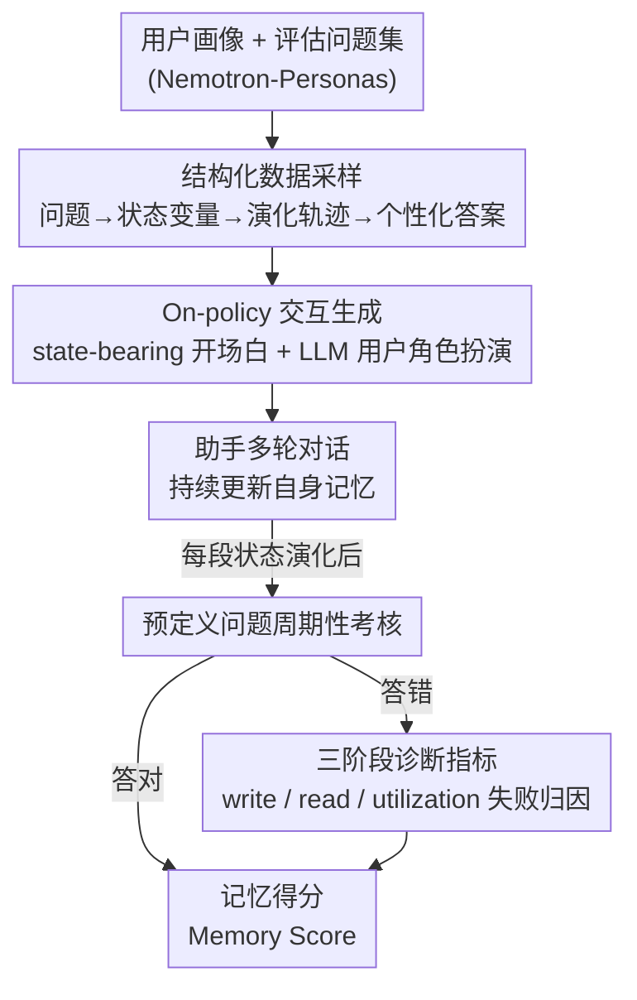

# AMemGym: Interactive Memory Benchmarking for Assistants in Long-Horizon Conversations

**会议**: ICLR 2026  
**arXiv**: [2603.01966](https://arxiv.org/abs/2603.01966)  
**代码**: [https://agi-eval-official.github.io/amemgym/](https://agi-eval-official.github.io/amemgym/)  
**领域**: 信息检索  
**关键词**: 对话记忆评测, on-policy评估, 用户状态追踪, 记忆诊断, 模拟用户  

## 一句话总结
提出AMemGym——首个支持on-policy交互式评估的长程对话记忆基准环境，通过结构化数据采样（用户画像→状态演化→个性化问答）驱动LLM模拟用户进行角色扮演，揭示了off-policy评估的排名偏差问题，并系统诊断了RAG/长上下文/Agent记忆系统的write/read/utilization三阶段失败模式。

## 研究背景与动机

**领域现状**：LLM助手需要在长程对话中管理记忆以实现个性化服务，但现有记忆基准（MSC, LongMemEval, PersonaMem等）全部依赖静态off-policy数据评估。

**现有痛点**：(a) off-policy评估无法反映助手自身对话行为的后果——记忆操作与交互模式紧密耦合；(b) 人工策划测试场景成本高且不可扩展；(c) 评估指标多为端到端QA准确率，缺乏对记忆失败原因的诊断。

**核心矛盾**：agent的记忆效果高度依赖其自身的交互模式（on-policy），但评估使用的是其他模型产生的对话历史（off-policy），导致评估结论与真实部署效果不一致。

**本文目标**：搭建一个可扩展的交互式环境，支持on-policy评估、多粒度诊断和记忆策略优化。

**切入角度**：用结构化数据作为"骨架"（用户状态schema→状态演化轨迹→状态依赖问答），LLM角色扮演生成自然对话作为"血肉"——结构保证可评估性，交互保证真实性。

**核心 idea**：从评估问题反向推导用户状态变量和演化轨迹，用结构化数据驱动模拟用户进行on-policy交互，既可靠又可扩展。

## 方法详解

### 整体框架
AMemGym 要解决的问题是：现有记忆基准都用别的模型预先生成好的静态对话来考助手，可助手记得好不好恰恰取决于它自己怎么对话——这种 off-policy 评估测不出真实部署效果。它的思路是搭一个让助手"亲自下场聊"的交互环境，同时用结构化数据保证聊出来的内容能被自动打分。整条流水线分三块：先用**结构化数据采样**逆向生成评估骨架（从评估问题倒推用户状态变量 → 状态演化轨迹 → 状态依赖的个性化答案 + 预生成的开场白）；再用 **On-policy 交互生成**让一个 LLM 扮演用户、按预设状态和助手做多轮对话，期间助手不断更新自身记忆，并每经过一段状态演化就用预定义问题考一次；最后用**三阶段诊断指标**把答错的题按 write / read / utilization 做失败归因。结构化数据是"骨架"保证可评估，自由对话是"血肉"保证真实，二者缺一不可。

### 关键设计

**1. 结构化数据采样：从评估目标反向构建模拟数据**

要让一个交互式环境支持自动打分，难点在于每道题必须有明确的 ground truth，否则 on-policy 聊出来的对话无从评判。AMemGym 的办法是反向工程：先采样一个用户画像 $p$，由它生成评估问题集 $\mathcal{Q}_p$，再从问题倒推出回答所需的状态变量 $\Sigma = \{(s_j, V_j)\}_{j=1}^M$（每个变量 $s_j$ 有一组离散取值 $V_j$）；接着生成一条状态演化轨迹 $\mathcal{T}_\sigma = (\sigma_0, \dots, \sigma_{N_p})$，每次状态转变都由一个叙事事件 $e_t$ 触发，让变化有合理的来由；最后为每个 (问题, 状态组合) 生成对应的个性化答案 $r_{i,\nu}$ 并通过反射（reflection）二次验证。这样每个评估问题都绑定了明确的状态依赖关系，助手答得对不对可以机器自动判定。这套生成流水线本身也经过元评估：状态暴露质量 99.1%（200 样本）、对话状态一致性 99.2%（748 标注）、ground truth 判断与人类标注者一致率 0.94–0.96，说明"骨架"足够可靠。

**2. On-policy 交互生成：让助手的回应真正影响后续对话**

光有结构化骨架还不够，关键状态信息得自然地出现在对话里，且对话要真正反映助手自己的行为。AMemGym 用预生成的 state-bearing 话语作为每个会话的开场白，确保该轮要考的状态信息一定进入对话；之后由 LLM 用户基于用户画像、当前状态和已有对话历史自由角色扮演。固定开场白保证了不同助手面对的是同一套基准条件，自由角色扮演又让后续对话保持自然。最本质的区别在于：助手这一轮怎么回应，会实际改变用户接下来说什么——记忆操作和交互模式是耦合的，这正是用现成静态对话的 off-policy 方法无法捕捉的。

**3. 三阶段诊断指标：把"答错了"拆成"哪一步错了"**

端到端 QA 准确率只能告诉你助手失败了，却说不清是没记住、读不出还是用不好。AMemGym 对每个答错的问题做一次溯源归因：先检查助手当下是否"知道"所有相关状态值——若知道却答错，归为 **utilization failure**（信息都在但用不好）；若不知道，就回查该状态最近一次的写入点——如果写入时助手就不知道该信息，归为 **write failure**（压根没记住）；如果写入时知道、但评估时又不知道了，归为 **read failure**（记了却读不出来）。这条决策链把端到端的"失败"精确定位到记忆系统的某一阶段，让设计者能直接看到瓶颈卡在写、读还是用上。

## 实验关键数据

### 主实验——On-policy vs Off-policy

| 记忆配置 | On-policy↑ | Off-policy↑ | 排名变化 |
|---------|-----------|------------|---------|
| AWE-(2,4,30) | .291 | .253 | ▼3 |
| AWE-(2,4,10) | .275 | .273 | ▲2 |
| RAG-(2,4,30) | .227 | .241 | ▲2 |
| LLM (原始) | .203 | .198 | ▼1 |

**排名显著不同**——off-policy评估会给出错误的配置选择建议。

### Native LLMs评估

| 模型 | Memory Score (Period 1→10) |
|------|--------------------------|
| claude-sonnet-4 | .336（最佳） |
| gemini-2.5-flash | .327 |
| gpt-4.1 | .244 |
| deepseek-v3 | .152 |

所有模型的upper bound >0.8但随交互增长性能骤降，多数最终跌至随机水平。

### 诊断分析

| 策略 | Write↓ | Read↓ | Util.↓ |
|------|--------|-------|--------|
| LLM | .301 | .087 | .244 |
| RAG | .377 | .172 | .067 |
| AWE | .338 | .159 | .074 |
| AWI | .286 | .245 | .122 |

### 关键发现
- **RAG/AWE降低utilization failure但增加write/read failure**——外部存储减轻长上下文问题但引入信息丢失
- **AWI最低write failure但最高read failure**——压缩到上下文中方便写但难以检索
- **更新频率↓ → read failure↑**——保留太多本地消息导致多记忆源混淆
- **检索数量对read/utilization影响小但对write有非单调效果**——太多检索噪声影响写入判断

## 亮点与洞察
- **on-policy vs off-policy的实证对比**是本文最有价值的贡献——直接证明了off-policy评估的排名偏差问题，这对所有记忆研究都有警示意义
- **三阶段诊断**（write/read/utilization）提供了极有操作性的分析框架——让每种记忆方案的优劣清晰到可以指导工程决策
- 结构化数据驱动+自由对话的双层设计很聪明——既保证了评估可靠性（有ground truth）又保证了交互真实性（on-policy）
- 展示了agent自我进化的概念验证——用环境反馈自主改进记忆策略

## 局限与展望
- 模拟用户仍基于LLM角色扮演，与真实用户行为的差距未充分讨论
- 状态变量采用离散值集合，无法表达连续演化或模糊偏好
- 评估主要聚焦个性化QA——对话中的其他记忆需求（如任务追踪、知识累积）未覆盖
- 生成成本仍然较高（使用gpt-4.1做数据生成和用户模拟）
- base配置需128K上下文、extra需512K，限制了可用模型范围

## 相关工作与启发
- **vs LongMemEval/PersonaMem**: 这些都是static off-policy基准；AMemGym首次实现on-policy交互式评估
- **vs CollabLLM**: CollabLLM用模拟用户训练协作模型；AMemGym聚焦评估而非训练
- **vs Mem0/A-Mem**: 这些是被评估的记忆系统，AMemGym提供了评估它们的环境

## 评分
- 新颖性: ⭐⭐⭐⭐⭐ on-policy记忆评估+结构化数据驱动的交互环境是全新设计
- 实验充分度: ⭐⭐⭐⭐⭐ 多种记忆系统+多种LLM+配置消融+诊断分析+元评估，极其全面
- 写作质量: ⭐⭐⭐⭐⭐ 问题动机清晰，框架图示直观，诊断分析有深度
- 价值: ⭐⭐⭐⭐⭐ 对LLM记忆系统研究定义了新的评估范式

<!-- RELATED:START -->

## 相关论文

- [\[ACL 2026\] HyperMem: Hypergraph Memory for Long-Term Conversations](../../ACL2026/information_retrieval/hypermem_hypergraph_memory_for_long-term_conversations.md)
- [\[ICLR 2026\] Fathom-DeepResearch: Unlocking Long Horizon Information Retrieval and Synthesis for SLMs](fathom-deepresearch_unlocking_long_horizon_information_retrieval_and_synthesis_f.md)
- [\[AAAI 2026\] Mem-PAL: Towards Memory-based Personalized Dialogue Assistants for Long-term User-Agent Interaction](../../AAAI2026/information_retrieval/mem-pal_towards_memory-based_personalized_dialogue_assistants_for_long-term_user.md)
- [\[ICLR 2026\] MLP Memory: A Retriever-Pretrained Memory for Large Language Models](mlp_memory_a_retriever-pretrained_memory_for_large_language_models.md)
- [\[ICLR 2026\] Robust Test-Time Video-Text Retrieval: Benchmarking and Adapting for Query Shifts](robust_test-time_video-text_retrieval_benchmarking_and_adapting_for_query_shifts.md)

<!-- RELATED:END -->
