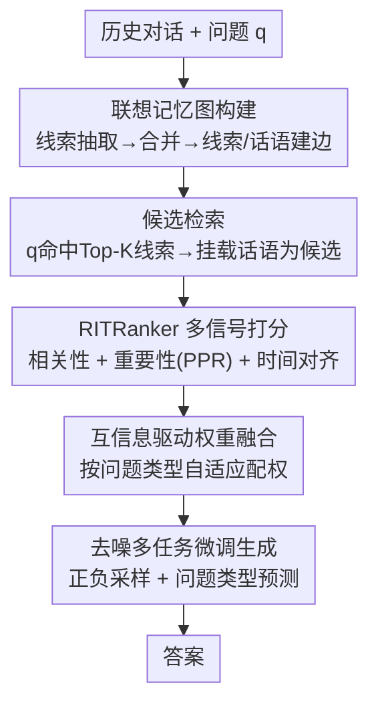

# AssoMem: Scalable Memory QA with Multi-Signal Associative Retrieval

**会议**: ICLR2026  
**OpenReview**: [https://openreview.net/forum?id=ZCjWUBwCwE](https://openreview.net/forum?id=ZCjWUBwCwE)  
**代码**: 待确认  
**领域**: 信息检索 / 记忆问答 / RAG  
**关键词**: 记忆问答, 联想记忆图, 多信号检索, 个性化PageRank, 互信息融合

## 一句话总结
AssoMem 为大规模个人记忆问答构建了一张"线索—话语"联想记忆图，并把相关性、重要性、时间对齐三路信号用互信息自适应融合做排序，在多个 benchmark 上检索与生成都显著超过只靠语义相似度的 SOTA。

## 研究背景与动机
**领域现状**：把 LLM 助手做成"第二大脑"，需要它持续存下用户的会议纪要、对话记录，并能回答"上周和 Sarah 开会的要点是什么"这类记忆召回问题。当前主流是 RAG 范式：把历史记忆组织好（长短期分段、主题/摘要层级过滤、实体关系知识图），再按与 query 的语义相似度检索证据生成答案。

**现有痛点**：这些方法几乎全部以"相关性"（语义距离）为唯一检索依据。但记忆库会随时间不断膨胀，里面塞满高度相似的条目——重复的会议主题、彼此重叠的对话片段。当相似项扎堆时，单纯比相似度根本分不清"哪条才是真正相关"，检索性能随记忆规模增大而崩塌（论文 Figure 1）。

**核心矛盾**：人类记忆不是孤立条目，也不是简单的时间流，而是**联想式**组织的——通过实体、地点、事件、主题等"线索"把信息串起来；并且人对**重要**的线索记得更清、回想更频繁。相似度检索丢掉了"重要性"和"时间约束"这两个维度。比如"我平时在工作上抱怨什么、给点建议"这种偏好类问题，需要的是对用户最重要的线索，而不是与 query 字面最像的句子。

**本文目标**：在大规模、相似度密集的记忆库上做准确的记忆召回 QA，需要解决三个子问题——(1) 如何组织记忆才能既快又能感知重要性；(2) 如何在相关性之外引入重要性与时间信号；(3) 不同问题类型该如何动态分配各信号的权重。

**切入角度**：模仿人脑联想记忆，把每条记忆"话语"锚定到自动抽取的线索上，形成一张图；在图上用图挖掘算法量化重要性，再叠加显式的时间匹配。

**核心 idea**：用"联想记忆图 + 多信号（相关性/重要性/时间）互信息自适应融合"代替"单一相似度检索"，解决相似度密集场景下的记忆召回退化。

## 方法详解

### 整体框架
AssoMem 在运行时分两步回答记忆问题：**记忆检索**和**答案生成**。给定记忆库 $M=\{(S_i,d_i)\}$（每个会话 $S_i$ 含若干话语 $u$、带时间戳 $d_i$）和问题 $q$，检索步先从记忆库里选出一组最能支撑回答的话语证据 $E^*$，生成步再用微调后的模型产出答案 $\hat a=\text{LLM}^*(q,E^*)$。

检索这一步是全文核心。它先离线构建一张**联想记忆图**：用 LLM 给每个会话抽一个代表性"线索"（如某个项目名、某类事件），把线索节点和话语节点连起来，并在高相似度的同类节点间加边。在线检索时分两段：先用 query 命中 Top-K 线索、把它们挂的话语收为候选集；再用 **RITRanker** 给每个候选话语打分排序。打分把相关性、重要性、时间对齐三路信号用互信息驱动的权重自适应融合，最后取分数最高的 $K$ 条作为 $E^*$。生成侧再对小模型做去噪多任务微调，让它更会用检索到的噪声上下文。

### 关键设计

**1. 联想记忆图：把抽象线索锚回原始话语，让重要性可被排序**

针对"相似条目扎堆、相似度分不清"的痛点，AssoMem 不再把记忆当孤立条目，而是建一张图 $G=(V,E)$。节点有两类：**线索节点**（LLM 为每个会话抽的代表性线索，且对嵌入相似度超过阈值 $\delta$ 的线索做合并去冗余）和**话语节点**（每条具体话语，用 BGE 等预训练模型编码成文本嵌入）。边也有两类：**归属边**把话语 $u\in S_i$ 连到它的线索 $c_i'$；**相似边**在相似度超阈值 $\gamma$ 的同类节点间相连，即 $\text{sim}(v_i,v_j)>\gamma$。

它和已有记忆图的根本区别在于：现有图（如 Mem0、知识图谱方法）建在**抽象概念**上、脱离原始历史数据，而这张图支持"抽象线索↔精确话语"的双向联想连接。正因为有了这层结构，才能在图上跑图挖掘算法去量化"重要性"——这是后面三路信号里最关键的那一路得以存在的基础。

**2. RITRanker 三维信号：在相关性之外补上重要性与时间约束**

这是检索打分的主体，针对"单一相似度无法回答偏好类、时间类问题"。对每条候选话语 $u$，它融合三个维度：

- **相关性** $s^{(rel)}_u=\text{sim}(e_q,e_u)$，query 嵌入与话语嵌入的余弦相似度，保证内容对齐，这是已被验证的必要条件。
- **重要性**：在联想记忆图上跑**个性化 PageRank（PPR）**，$r^{(k+1)}=dMr^{(k)}+(1-d)t$，其中 $M$ 是图邻接矩阵、$d$ 是阻尼系数、$t$ 是个性化传送向量。关键设置是：$t$ 中话语对应位填"query 与该话语的相似度"、线索对应位填 0，并令 $r_0=t$，收敛后 $s^{(imp)}_u=r_u$。用 PPR 而非全局 PageRank（$r_0=\{1/N\}$）是为了避免抬高与问题无关记忆的重要性——本质是一个"相关性条件下的重要性先验"。
- **时间对齐**：显式三步做时间匹配——先从问题里抽时间 token 判断是否需要时间推理，再用 TimeLlaMA 对时间 token 做时间嵌入，最后算 $s^{(temp)}_u=\text{sim}(e^{(temp)}_q,e^{(temp)}_u)$。之所以不用常见的"近因衰减"，是因为衰减满足不了"显式指定的时间约束"（如"昨天那场会"）。

三路各自捕捉相似度盖不住的盲区：偏好类问题靠重要性，时间类问题靠时间对齐。

**3. 互信息驱动的自适应权重融合：按问题类型动态配权**

针对"不同问题类型该信任不同信号"，AssoMem 不用固定权重，而用**条件互信息（CMI）**来度量"某一维信号对判断这条话语是否有用"的信息量。做法是先把每维原始分 $\tilde s^{(d)}_u$ 离散成 low/medium/high 三档，收集"分数档—有用性标签 $y_\lambda$"的配对，按问题类型 $q$ 估计概率后计算

$$\text{CMI}_d(q)=I(\tilde s^{(d)(b)}_u;\lambda\mid q)=\sum_{\tilde s^{(d)(b)}_u}\sum_\lambda p(\tilde s^{(d)(b)}_u,y_\lambda)\log\frac{p(\tilde s^{(d)(b)}_u,y_\lambda\mid q)}{p(\tilde s^{(d)(b)}_u\mid q)\,p(y_\lambda\mid q)}$$

权重再做温度 softmax：$w^{(d)}(q)=\dfrac{\exp(\text{CMI}_d(q)/T)}{\sum_{d'}\exp(\text{CMI}_{d'}(q)/T)}$，最终分数

$$\text{Score}(q,u)=w^{(rel)}(q)\,\tilde s^{(rel)}_u+w^{(imp)}(q)\,\tilde s^{(imp)}_u+w^{(temp)}(q)\,\tilde s^{(temp)}_u$$

这样一来，对偏好类问题自动加重"重要性"权重、对时间类问题自动加重"时间"权重，温度 $T$ 调节分布锐度。它把"该信哪一路"从人工调参变成了由数据互信息决定的自适应过程。

**4. 去噪多任务微调：让生成模型学会用带噪检索上下文**

针对"召回好不等于生成好——Top-K 里混着噪声会拖垮答案"，AssoMem 对生成模型做去噪微调 $\text{LLM}^*=\text{FineTune}(\text{LLM},D_{QA+Mem})$。构造去噪 QA 数据集时用两种采样策略：(1) 正负记忆上下文混合，逼模型学会辨别证据；(2) 纯负上下文，提升鲁棒性、防止过度依赖支撑证据。同时做**多任务联合训练**——问题类型预测 + 答案生成一起学，让模型先识别问题意图再针对性利用记忆。注意大模型（70B/120B）不微调，只对 3B/32B 这类较小模型微调以压低生成噪声。

## 实验关键数据

### 主实验
数据集：LongMemEval（small/medium/large 三档，l 档每数据点对话从 m 的 500 轮增到 2,500 轮）+ 自建 **MeetingQA**（多说话人会议合成数据，带有用性标签）。检索指标 Recall@k / nDCG@k，生成指标 LLM-as-Judge 准确率、BERTScore、Faithfulness。

LongMemEval medium 上检索结果（节选）：

| 方法 | R@6 | R@10 | nDCG@10 | Acc@6 |
|------|------|------|---------|-------|
| Utterance-flat | 64.25 | 70.18 | 68.04 | 48.66 |
| Session-utterance（多粒度混合） | 70.17 | 78.97 | 76.50 | 55.85 |
| Topic grouping（前 SOTA） | 76.47 | 79.14 | 78.86 | 59.95 |
| **AssoMem** | **80.87** | **84.96** | **82.93** | **64.01** |

AssoMem 相比前 SOTA（topic grouping）在 m 上提升 5.82%，在 l 上提升 7.04%、MeetingQA 上提升 3.81%；论文报告平均超 baseline **24.93%**。生成侧 Acc@6 从 flat 的 48.66 → 多粒度 55.85 → AssoMem 64.01，BERTScore 51.71→60.06→67.56，检索质量直接转化为生成质量。

不同 base model 用 AssoMem recall@10 上下文的生成结果（Table 2）：微调后 LlaMA3.2-3B 的 Acc 从 26.91→33.43、Qwen2.5-32B 从 64.72→73.88（Acc@10 分别增 6.52%、9.16%）；不微调的 70B/120B 也很强（Gpt-Oss-120B Acc 76.49）。

### 消融实验
LongMemEval m 上逐项移除（Table 3）：

| 配置 | R@6 | R@10 | Acc@6 | 说明 |
|------|------|------|-------|------|
| **AssoMem（完整）** | 80.87 | 84.96 | 64.01 | — |
| w/o Temporal | 73.39 | 78.37 | 57.88 | 去时间维，时间类问题掉最多 |
| w/o Importance | 75.81 | 79.62 | 59.55 | 去重要性维，偏好类问题受损 |
| w/o Weight Assignment | 76.79 | 81.80 | 60.38 | 改固定权重，R@6 掉 4.08% |
| w/o Clue nodes | 79.75 | 84.80 | 63.06 | 去线索节点，R@6 掉 1.12% |

### 关键发现
- **互信息权重融合贡献最大**：换成固定加权 R@6 掉 4.08%，比去掉线索节点（掉 1.12%）影响大得多，说明"按问题类型自适应配权"是核心增益来源。
- **维度与问题类型强耦合**：去掉时间维只伤时间推理类问题、去掉重要性维只伤单用户偏好类问题（雷达图 Figure 3b），印证了"不同问题需要不同维度信号"的核心论点。
- **强鲁棒性**：记忆从 500 轮涨到 2,500 轮（m→l），AssoMem 对 topic grouping 的 R@6/R@10 提升反而扩大到 6.39%/7.04%，生成准确率提升 4.06%，相似度方法随规模崩塌而它不崩。
- **召回—生成存在 gap**：m 上 recall@6 达 80.87% 但 Acc@6 只 64.01%，Top-K 噪声确实拖累生成，这正是去噪微调要补的环节。

## 亮点与洞察
- **把认知科学的"联想 + 重要性"翻译成可计算的图信号**：用 PPR 的个性化传送向量编码 query 相关性、再让图传播出"重要性"，巧妙之处在于把"哪条记忆对用户更重要"这种主观概念落成了图上平稳分布。
- **互信息当"信号路由器"**：用 CMI 度量每路信号对不同问题类型的判别贡献、再 softmax 成权重，避免了"对所有问题用同一套权重"的僵化，这套思路可迁移到任何多信号检索/重排场景。
- **检索与生成分开优化但闭环**：检索端做多信号融合、生成端做去噪微调，针对的是"召回好≠答得好"这一公认 gap，组合拳比单点优化更扎实。
- **MeetingQA 数据集**：补上了大规模、多说话人、带有用性标签的会议记忆 QA 评测，对该方向是有价值的公共资产。

## 局限与展望
- **依赖 LLM 抽线索的质量**：线索由 LLM agent 自动生成、再按阈值 $\delta/\gamma$ 合并建边，线索抽得不好或阈值不当会直接污染整张图，论文未深入分析其敏感性与失败模式。
- **MeetingQA 是合成数据**：用合成会议验证泛化性有说服力上限，真实多说话人、跨会话噪声下的表现仍待检验。
- **重要性靠 PPR 近似"对用户的重要程度"**：图结构上的中心性未必等同于用户主观重视，这是一个建模假设而非保证。
- **CMI 权重需要"有用性标签"来估计概率**：依赖标注数据统计分布，标签稀缺或分布漂移的新场景下权重估计可能不准。
- **改进方向**：引入对话元数据（人物、地点）与 ConceptNet 等外部知识丰富图结构（论文已提及可扩展但未充分实验），以及把线索抽取与检索端到端联合优化。

## 相关工作与启发
- **vs 长短期记忆分段（LST Memory 等）**：他们按时间把历史切成长/短期来增强召回，本文不靠时间分段而靠联想图 + 多信号，区别在于显式建模"重要性"维度；偏好/时间类问题上 AssoMem 优势明显。
- **vs 层级过滤 / Topic grouping（前 SOTA）**：他们用主题/摘要层级缩小检索空间，本文也用"线索→话语"两段混合检索，但额外叠加 PPR 重要性与显式时间匹配，并自适应配权，故在三个数据集上稳定超出。
- **vs 知识图谱式记忆图（Mem0 等）**：他们的图建在抽象概念上、脱离原始数据，本文图支持"抽象线索↔精确话语"双向锚定，因而能做重要性感知排序。
- **vs 纯相关性重排 / 多粒度检索**：他们仍以语义相似为主，本文的核心论点正是"相似度密集场景下单靠相关性不够"，用多维信号融合补盲区。

## 评分
- 新颖性: ⭐⭐⭐⭐ 把联想记忆图 + PPR 重要性 + 互信息自适应融合组合到记忆 QA，角度新颖且自洽
- 实验充分度: ⭐⭐⭐⭐ 三 benchmark + 自建数据集、多 base model、维度/组件双消融、规模与问题类型鲁棒性都覆盖
- 写作质量: ⭐⭐⭐⭐ 动机—方法—实验逻辑清晰，公式与 RQ 组织得当
- 价值: ⭐⭐⭐⭐ 直击大规模个人记忆助手的核心检索瓶颈，方法与 MeetingQA 都有复用价值

<!-- RELATED:START -->

## 相关论文

- [\[ICLR 2026\] BrowseNet: Graph-Based Associative Memory for Contextual Information Retrieval](browsenet_graph-based_associative_memory_for_contextual_information_retrieval.md)
- [\[ICLR 2026\] ZeroGR: A Generalizable and Scalable Framework for Zero-Shot Generative Retrieval](zerogr_a_generalizable_and_scalable_framework_for_zero-shot_generative_retrieval.md)
- [\[ICLR 2026\] Summaries as Centroids for Interpretable and Scalable Text Clustering](summaries_as_centroids_for_interpretable_and_scalable_text_clustering.md)
- [\[ICLR 2026\] MLP Memory: A Retriever-Pretrained Memory for Large Language Models](mlp_memory_a_retriever-pretrained_memory_for_large_language_models.md)
- [\[ACL 2025\] Mitigating Lost-in-Retrieval Problems in RAG Multi-Hop QA](../../ACL2025/information_retrieval/mitigating_lost-in-retrieval_problems_in_retrieval_augmented_multi-hop_question_.md)

<!-- RELATED:END -->
