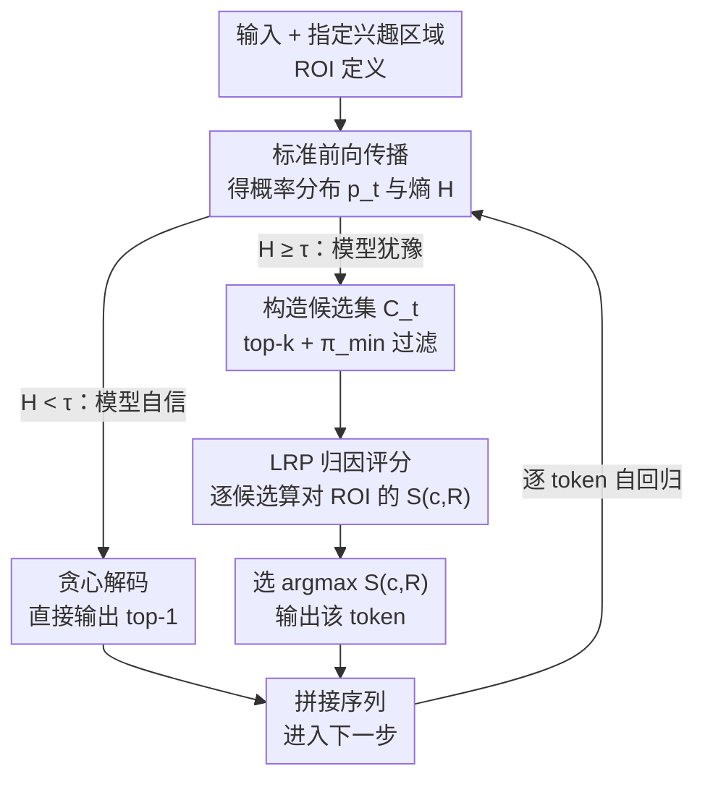

# Attribution-Guided Decoding

**会议**: ICLR 2026  
**arXiv**: [2509.26307](https://arxiv.org/abs/2509.26307)  
**代码**: [GitHub](https://github.com/piotr-komorowski/AGD)  
**领域**: 机器人  
**关键词**: attribution method, LRP, instruction following, factuality, entropy-gating, controlled decoding

## 一句话总结

提出AGD解码策略，在每步生成时从高概率候选token中选择对用户指定"兴趣区域"（ROI）归因得分最高的token，将归因方法从被动分析工具转变为主动生成引导工具，在指令遵循和事实性任务上均取得显著提升。

## 研究背景与动机

**领域现状**：LLM解码策略是控制生成质量的关键一环。标准解码方法（贪心、top-k、nucleus采样）控制的是输出的随机性，但无法直接引导生成的语义属性。为了增强指令遵循和事实准确性，研究者提出了两类方法：(1) **干预型（Interventionist）方法**，如激活工程（activation steering）直接修改模型内部表示，对比解码（CAD、DoLA）修改输出logits；(2) **后处理方法**，对输出进行过滤或重排序。

**现有痛点**：干预型方法直接修改模型的前向传播或logit分布，会将模型推入分布外状态，导致困惑度升高、重复输出、文本质量下降。这造成了一个不理想的权衡——用户必须在"更好的控制"和"更高的生成质量"之间做选择。例如，activation steering在提升指令遵循的同时会严重损害输出的流畅性和连贯性。

**核心矛盾**：如何在**不修改模型内部状态或输出分布**的前提下，引导生成朝向期望的行为（如遵循指令、减少幻觉）？需要一种既能有效控制又不破坏生成质量的机制。

**本文目标** (1) 提出一种不干预模型前向传播的解码引导方法；(2) 使该方法灵活适用于多种任务（指令遵循、事实性、上下文检索）；(3) 减少引导带来的计算开销和质量损失。

**切入角度**：作者提出将**归因方法（attribution methods）**从事后解释工具转变为前向引导工具。归因方法可以量化每个候选token对输入特定部分的"依赖程度"。如果候选token A对用户指令的归因分数高于候选token B，说明A更"听从"指令——那么选择A即可实现指令引导,而不需要修改模型的任何内部状态。

**核心 idea**：将解码过程重新定义为"在候选token中寻找对指定兴趣区域归因最大的token"，用归因方法的选择机制替代概率最大化机制。

## 方法详解

### 整体框架

AGD要解决的是"如何在不碰模型内部状态的前提下引导生成"。它的做法是把每一步的token选择从"挑概率最大的"换成"挑最听话的"。具体地，每生成一个token时：先用一次标准前向传播得到概率分布 $\mathbf{p}_t$，并用它的熵 $H(\mathbf{p}_t)$ 做一道**门控**——模型很自信（低熵）就直接贪心输出、省下归因开销，只有模型犹豫（高熵）才真正启用AGD。启用后，取top-k的高概率候选构成候选集 $\mathcal{C}_t$，并过滤掉概率低于阈值 $\pi_{\min}$ 的token——这一步保证后续选出的token始终落在模型认可的合理范围内；再针对一个预先指定的**兴趣区域（ROI）** $R$（输入里的指令片段、某些知识处理注意力头、或上下文文档的token嵌入）作为"引导目标"，对候选集里的每个token $c$ 用归因方法回溯，算出它对ROI的归因总分 $S(c, R)$；最后选归因分数最高的那个token输出。整个回路不改前向传播、不动logit值，是"选择型"而非"干预型"——这正是它能在控制生成的同时不破坏文本质量的根本原因。

### 关键设计

**1. 基于LRP的归因评分机制：把"这个token依赖输入的哪部分"量化成可比较的分数**

候选集里的token概率都不低，光看概率分不出谁更听指令，于是需要一个额外的、有原则的选择信号。AGD对候选token $c$ 的pre-softmax logit做层逐传播（LRP）反向传播，得到模型各组件 $\omega \in \Omega$ 的归因分数 $r_\omega$，再把落在ROI内的组件分数求和得到总分 $S(c, R) = \sum_{\omega \in R} r_\omega$——分数越高，说明这个token越是"由ROI里的信息决定的"。这里特意选LRP（尤其是AttnLRP变体）而非简单的梯度×输入（I×G），是因为LRP在Transformer的self-attention和layer normalization这类非线性组件上传播得更稳定、更忠实，而代价只是一次反向传播，和梯度方法相当。更关键的是归因分数是**带符号**的：正归因帮你选出依赖指令的token，负归因帮你避开违反禁止约束的token——这种正负双向的信号是纯概率方法给不出来的。

**2. 灵活的ROI定义：换一下ROI，同一套算法就能管不同任务**

AGD之所以不是某个任务的专用trick，关键在于把"控制目标"统一抽象成"模型里一组可归因的组件"。对**指令遵循**，ROI $R_I$ 就是输入中指令部分（如system prompt）对应的token嵌入集合；对**闭卷事实性**，ROI $R_P$ 换成预先识别出的参数知识（parametric knowledge）注意力头集合；对**开卷检索**，ROI既可以是上下文文档的token嵌入 $R_C$，也可以是上下文检索（in-context retrieval）注意力头 $R_{IC}$。这几种情况跑的是完全相同的AGD算法，唯一变的就是 $R$ 的指向。这种"归因组件 ↔ 控制目标"的对应让方法可以推广到任何能用归因量化的控制目标上。

**3. 基于熵的自适应门控（Entropy-Gating）：只在模型拿不准的岔路口才出手**

每一步都做归因计算要付出多次反向传播的开销，而且当模型本来就很确定时强行引导反而会把已经写好的高质量输出搞乱。门控机制用每步输出分布的Shannon熵 $H(\mathbf{p}_t)$ 来判断该不该出手：$H(\mathbf{p}_t) < \tau$ 时模型自信，直接走贪心解码；$H(\mathbf{p}_t) \geq \tau$ 时模型犹豫，才激活AGD。阈值 $\tau$ 取IHEval上token级熵的第80百分位数（$\tau = 1.734$）。这样引导只发生在真正决定生成轨迹走向的"关键分叉点"上，既省了计算，又避免了对确定性输出的无谓干扰——实验里它把"质量-遵循"的权衡改善得很明显。

### 损失函数 / 训练策略

AGD是纯推理时方法，**无需训练或微调**。固定参数：$k=5$（候选集大小）、$\pi_{\min}=0.05$（最小概率阈值）、$\tau=1.734$（熵门控阈值）。所有实验使用相同超参数，无需针对不同模型或任务调整。

## 实验关键数据

### 指令遵循实验

在3个模型（Llama 3.1 8B、Qwen 2.5 7B、Gemma 3 4B）上评测IHEval和SysBench两个基准。

| 模型 | 方法 | PLA (IHEval) | QS | PLA*QS | SSR (SysBench) |
|------|------|-------------|-----|--------|----------------|
| Llama 3.1 | Greedy | 66.0 | 81.3 | 53.7 | 26.0 |
| Llama 3.1 | CAD | 73.9 | 72.6 | 53.7 | 32.3 |
| Llama 3.1 | AGD_LRP | **79.1** | 73.2 | **57.9** | 32.2 |
| Llama 3.1 | AGD_LRP_e | 74.5 | 76.4 | 56.9 | **33.9** |
| Qwen 2.5 | Greedy | 63.2 | 74.1 | 46.8 | 27.1 |
| Qwen 2.5 | AGD_LRP_e | **70.4** | 70.6 | **49.7** | **29.9** |
| Gemma 3 | Greedy | 84.7 | 82.3 | 69.7 | 33.3 |
| Gemma 3 | AGD_LRP_e | **86.7** | 81.4 | 70.6 | **36.0** |

### 事实性与上下文检索实验 (Llama 3.1 8B)

| 设置 | 方法 | TriviaQA | NQ | HotPotQA |
|------|------|----------|-----|----------|
| 闭卷 | Greedy | 81.4 | 63.6 | 34.6 |
| 闭卷 | DoLA | 81.2 | 63.8 | 34.3 |
| 闭卷 | AGD_LRP_h | **82.4** | 63.0 | **39.6** |
| 开卷 | Greedy | 89.4 | 83.5 | 81.3 |
| 开卷 | CAD | 87.9 | 84.6 | 83.7 |
| 开卷 | AGD_LRP_c | **91.4** | **87.9** | **87.9** |

### 关键发现

- **LRP远优于I×G**：使用LRP归因的AGD在指令遵循上一致性地大幅超越使用I×G的版本。LRP在Transformer中处理self-attention的规则（AttnLRP）提供了更忠实的归因分数，这直接转化为更好的引导效果。
- **负归因信号是关键**：对于"禁止包含某些词"类型的约束，违禁候选token会在指令部分产生**负归因分数**，帮助模型主动避开这些token。这是AGD优于简单概率操控方法的独特优势。
- **熵门控显著改善质量-遵循权衡**：在Llama 3.1上，完整AGD的PLA为79.1但QS降至73.2；熵门控版本PLA降至74.5但QS恢复至76.4，综合指标PLA*QS仅差1%。在SysBench多轮对话中，熵门控版本的SSR（33.9）甚至超过完整AGD（32.2），说明只在关键点引导反而效果更好。
- **开卷QA提升显著**：在HotPotQA（含80%干扰文档）上，AGD比贪心解码提升6.6个点，说明归因机制能帮助模型在噪声上下文中锁定相关段落。

## 亮点与洞察

- **"从解释到引导"的范式转变**：将归因方法从事后分析工具转变为生成过程中的主动引导信号，这是一个深刻的视角转换。归因方法几十年来一直用于"解释模型为什么这样做"，这篇论文首次将其用于"决定模型应该怎么做"。
- **选择型 vs 干预型**：AGD不修改模型的前向传播或logit分布——它只是在模型已经认为可行的候选中做"更明智的选择"。这保证了选出的token始终处于模型的正常分布范围内，从根本上避免了activation steering等方法导致的质量退化问题。
- **ROI的统一抽象**：通过将控制目标统一抽象为"可归因组件的子集"，AGD成为一个通用框架。只要目标可以表示为输入token或注意力头的集合，就可以用AGD引导——从指令遵循到事实性到上下文检索，切换只需改ROI定义。

## 局限与展望

- **候选集限制**：AGD作为选择机制，无法生成候选集中不存在的token。如果"正确答案"不在模型的top-k候选中，AGD无法发挥作用。
- **计算开销**：每个候选token都需要一次反向传播来计算归因（虽然熵门控缓解了这一问题），对于长文本生成仍然有可观的额外延迟。
- **ROI定义依赖先验知识**：指令遵循的ROI相对自然（system prompt），但知识头、上下文检索头的识别需要预先分析，可迁移性受限。
- **仅在≤8B模型上验证**：实验模型最大为8B参数，对更大规模模型的扩展性（尤其是归因计算的内存需求）未知。

## 相关工作与启发

- **vs CAD (Context-aware Decoding)**: CAD通过对比有/无指令时的logit来修改分布，属于干预型方法。AGD不修改logit，只在概率高的候选中选择归因最高的。AGD在指令遵循上超越CAD（Llama 3.1: 79.1 vs 73.9 PLA），说明归因信号比对比logit差值更有效。
- **vs Activation Steering**: Steering直接修改内部表示，虽然控制力强但质量退化严重。AGD的"不干预"设计从根本上避免了这个问题。
- **vs DoLA**: DoLA用层间logit对比减少幻觉，也是干预型方法。AGD在闭卷HotPotQA上显著超越DoLA（39.6 vs 34.3），归因信号比层间对比更精确地捕获了知识存储位置。

## 评分

- 新颖性: ⭐⭐⭐⭐⭐ 将归因方法从解释工具转变为生成引导工具，启发性极强
- 实验充分度: ⭐⭐⭐⭐ 覆盖3种任务、3个模型、多个基准，消融和案例分析充分
- 写作质量: ⭐⭐⭐⭐⭐ 论文结构清晰，图示精美，方法动机阐述到位
- 价值: ⭐⭐⭐⭐⭐ 通用性强的免训练解码框架，对LLM可控生成方向有深远影响

<!-- RELATED:START -->

## 相关论文

- [\[ICLR 2026\] Bridging Draft Policy Misalignment: Group Tree Optimization for Speculative Decoding](bridging_draft_policy_misalignment_group_tree_optimization_for_speculative_decod.md)
- [\[ICLR 2026\] RefTool: Reference-Guided Tool Creation for Knowledge-Intensive Reasoning](reftool_reference-guided_tool_creation_for_knowledge-intensive_reasoning.md)
- [\[ACL 2026\] Context Attribution with Multi-Armed Bandit Optimization](../../ACL2026/information_retrieval/context_attribution_with_multi-armed_bandit_optimization.md)
- [\[ICLR 2026\] Attributing Response to Context: A Jensen-Shannon Divergence Driven Mechanistic Study of Context Attribution in Retrieval-Augmented Generation](attributing_response_to_context_a_jensen-shannon_divergence_driven_mechanistic_s.md)
- [\[ACL 2026\] CiteGuard: Faithful Citation Attribution for LLMs via Retrieval-Augmented Validation](../../ACL2026/information_retrieval/citeguard_faithful_citation_attribution_for_llms_via_retrieval-augmented_validat.md)

<!-- RELATED:END -->
