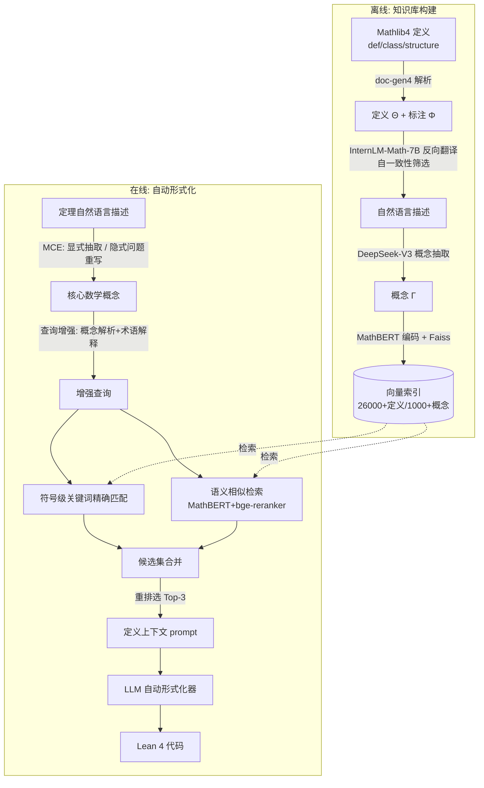

# Automated Formalization via Conceptual Retrieval-Augmented LLMs

**会议**: ICLR 2026  
**OpenReview**: [https://openreview.net/forum?id=09lmwhDqZ3](https://openreview.net/forum?id=09lmwhDqZ3)  
**代码**: [https://github.com/kahvia0526/CRAMF](https://github.com/kahvia0526/CRAMF)  
**领域**: 信息检索 / 自动形式化 / 检索增强生成  
**关键词**: 自动形式化, RAG, Lean 4, Mathlib, 数学概念检索, 概念多态  

## 一句话总结
CRAMF 把 Mathlib4 自动构建成"概念—定义"知识库，再用查询增强 + 双通道混合检索 + 重排，给 LLM 自动形式化器喂进精准的形式化定义，作为即插即用插件把翻译准确率平均相对提升 29.9%、最高 62.1%。

## 研究背景与动机
**领域现状**：自动形式化（autoformalization）要把自然语言数学定理翻译成 Lean / Coq / Isabelle 等可机器验证的形式化代码，是 LLM 连接非形式推理与形式符号逻辑的桥梁，DeepMind AlphaProof 在 2024 IMO 拿银牌正是靠这条形式化流水线。当前主流做法是用 LLM（few-shot prompting 或在 NL–FL 对上微调）直接翻译，代表系统有 Herald、Kimina-Prover。

**现有痛点**：直接用 LLM 翻译存在两个根本性失败。① **模型幻觉**——LLM 自信地生成错误形式化代码，典型表现是捏造 Mathlib 里不存在的谓词、因非形式推理误用符号、生成与最新 Mathlib 版本不兼容的过时定义，直接导致编译失败。② **语义鸿沟**——自然语言的歧义与形式语言的精确之间不匹配，最棘手的是**概念多态（conceptual polymorphism）**：同一个表述（如"邻域"在拓扑空间 vs 度量空间）在不同上下文/领域/抽象层级对应完全不同的形式化定义，模型选错抽象层级就触发类型类合成错误，在组合数学这类隐式实体多的应用领域尤其严重。

**核心矛盾**：通用 NLP 里幻觉和歧义常用 RAG 解决，但把 RAG 搬到数学形式化非平凡——Mathlib 缺乏从自然语言表述到形式定义的结构化、可查询映射；解决概念多态不只是"检索相关内容"，而要在多个上下文敏感的形式化之间消歧，标准 RAG 管线做不到；形式检索还要求极高精度。

**本文目标**：为 Lean 自动形式化设计一套领域专用的检索增强方案，同时压制幻觉和弥合语义鸿沟。

**核心 idea**：**概念驱动检索增强（concept-driven RAG）**——以"核心数学概念"为检索单元，从 Mathlib 自动构建概念—定义知识库，检索精准定义作为上下文 grounding 注入 LLM 生成过程，作为即插即用增强嫁接到任意现有自动形式化器上。

## 方法详解

### 整体框架
CRAMF 在检索增强范式下工作：给定一个定理的自然语言描述，先从结构化知识库检索相关概念的形式化定义，再把这些定义作为上下文喂给 LLM 自动形式化器，帮助模型生成语法正确、语义对齐、符合 Mathlib 规范的 Lean 4 代码。它由三大组件构成：概念—定义知识库构建、数学概念抽取（MCE）、定义检索（含双通道混合检索 DHR 与重排模块）。

### 关键设计

**1. 本体 schema + 自动化知识库填充：把 Mathlib 翻成可查询的概念—定义映射。** 检索的前提是有结构化知识库，但 Mathlib 本身只有形式定义、没有"自然语言→定义"的映射。作者先定义一个轻量本体 $O=(C,P,A,R)$，实体类型 $C=\{\Gamma,\Theta,\Phi\}$ 分别表示抽象数学概念、Mathlib 形式定义、定义的自然语言标注；关系 $R_1\subseteq\Gamma\times\mathcal{P}(\Phi)$ 是概念到定义的一对多（一个概念可对应多个 Lean 定义，正是多态的根源），$R_2:\Phi\to\Theta$ 是定义到标注的一对一。填充时用 doc-gen4 解析 Mathlib 抽出所有 `def`/`class`/`structure` 定义填充 $\Theta,\Phi$；关键在概念实体 $\Gamma$ 的构造——用 InternLM-Math-7B 对每条形式定义做**反向翻译**生成自然语言描述，并用自一致性验证（生成三个候选取与原标注语义最对齐的那个）提质量，再用 DeepSeek-V3 从中抽取底层数学概念。最终每个知识单元表示为四元组 $(\gamma_n,\theta_r,v_c,v_d)$，其中 $v_c=\text{MathBERT}(\gamma_e)$、$v_d=\text{MathBERT}(\theta_a)$ 是用数学语料预训练的 MathBERT 编码、建 Faiss 索引，覆盖 26000+ 定义、1000+ 核心概念。

**2. 概念抽取（MCE）+ 隐式问题重写：把检索单元从"句子"收窄到"核心概念"。** 直接拿整个定理描述去检索噪声大，CRAMF 先抽取核心数学概念作为查询单元。问题分两类区别对待：对显式含概念关键词的常规证明题，直接用 LLM 理解能力识别核心概念；对应用数学题（如"任意 6 人中总有 3 人互相认识或互不认识"这种隐含图论结构的组合问题），表面文本里根本没有数学概念关键词，于是引入**LLM 问题重写机制**——在概念抽取阶段先对原问题做数学建模与改写，把隐含的核心数学结构显式表达出来，再做概念抽取。消融显示这个条件触发的重写在组合数学 CombMath 上带来 8.8% 的 FAR 提升。

**3. 查询增强 + 双通道混合检索 + 重排：用符号精确 × 语义相关共同压制多态。** 概念有多个形式定义时，只拿概念本身当查询会噪声大、召回低，所以先做**查询增强**：用 LLM 在严格 prompt 下对定理做概念解析，生成融合领域信息、应用上下文、概念间依赖的术语解释，把概念与解释拼接成查询，从而在检索时匹配更丰富的语义、缓解多态。检索本身并行走两条通路——**符号级关键词匹配**：LLM 为核心概念生成检索关键词，用正则对 Mathlib 定义符号精确匹配形成基础候选集，保证形式精度；**语义相似检索**：增强查询经 MathBERT 编码与知识库概念解释算向量相似度，先召回 Top-10，再用 bge-reranker-v2-m3 重排筛 Top-5，对应定义并入候选集。最后再过一道**重排**：bge-reranker 对候选定义做细粒度语义评估，计算查询里的概念解释与候选定义标注的相似度，选语义最匹配的 Top-3 定义构成上下文 prompt。这一步是性能命门，消融去掉 DHR 平均 FAR 暴跌 15.7%。

## 实验关键数据

### 主实验表格
7 个基座模型（4 个 API LLM + 3 个开源自动形式化器）在 miniF2F / ProofNet / AdvancedMath 上，对比原版与 +CRAMF 的**形式化准确率 FAR@10**（RG 为相对增益）：

| 模型 | miniF2F Base→+CRAMF (RG) | ProofNet Base→+CRAMF (RG) | AdvancedMath Base→+CRAMF (RG) |
|---|---|---|---|
| DeepSeek-V3 | 36.9→47.1 (+27.6%) | 23.6→37.0 (+56.8%) | 19.8→32.1 (**+62.1%**) |
| GPT-4o | 49.6→60.1 (+21.2%) | 29.9→42.2 (+41.1%) | 22.8→34.7 (+52.2%) |
| Gemini 2.5 Flash | 72.1→82.0 (+13.7%) | 57.0→63.1 (+10.7%) | 43.9→50.9 (+15.9%) |
| Claude 4.1 | 83.6→92.6 (+10.8%) | 72.2→79.7 (+10.4%) | 57.2→65.9 (+15.2%) |
| Herald-7B | 49.2→63.1 (+28.3%) | 44.4→55.1 (+24.1%) | 39.3→51.4 (+30.8%) |
| Kimina-7B | 80.3→84.8 (+5.6%) | 65.0→69.3 (+6.6%) | 61.3→66.5 (+8.5%) |
| Godel-V2-8B | 88.1→95.1 (+7.9%) | 73.0→80.2 (+9.9%) | 57.8→68.2 (+18.0%) |

编译通过率 CPR@10 同样普遍提升（如 DeepSeek-V3 在 AdvancedMath 31.7%→48.2%，+52.1%）。

检索质量（ACS 贡献分 0–3 / HitRate@3）对比 6 个检索基线：

| 方法 | ACS (miniF2F/ProofNet/AdvMath) | HitRate@3 (miniF2F/ProofNet/AdvMath) |
|---|---|---|
| BM25 | 0.91 / 0.94 / 0.83 | 11.3% / 14.5% / 9.1% |
| LeanSearch | 1.58 / 1.63 / 1.56 | 36.8% / 42.3% / 35.1% |
| **CRAMF** | **2.07 / 2.14 / 1.93** | **44.2% / 50.6% / 42.9%** |

CRAMF 比最强基线 ACS 平均高 0.5+，HitRate@3 高出最多 15 个百分点。

### 消融实验表格
以 Herald-7B 为骨干，FAR@10：

| 配置 | miniF2F | ProofNet | AdvancedMath |
|---|---|---|---|
| CRAMF（完整） | 63.1 | 55.1 | 51.4 |
| w/o MCE | 58.2 | 49.8 | 44.0 |
| w/o DHR | 48.5 | 36.8 | 37.1 |
| w/o Rerank | 54.3 | 47.5 | 43.9 |

另在 241 题组合数学 CombMath 上，去掉问题重写（w/o ReWrite）FAR 从 63.1% 跌到 54.3%（-8.8%）。

### 关键发现
- **DHR 是命门**：去掉双通道混合检索平均 FAR 暴跌 15.7%，印证形式环境里必须同时抓语义相关与符号精度。
- **越弱的基座增益越大**：未做领域微调的通用 DeepSeek-V3 在 AdvancedMath 上相对提升达 62.1%，说明 CRAMF 像"即插即用的形式知识桥"，显著拉低领域入门门槛；而本就强的 Kimina/Godel 增益较小但仍正向。
- **MCE 不可或缺**：去掉概念抽取掉 6–7 个点，证明给概念补领域知识与应用上下文确实化解了定义歧义。

## 亮点与洞察
- **把"检索单元"从句子降维到核心概念**，正中自动形式化幻觉与多态的要害——错误几乎都发生在"用哪个定义"上，检索精准定义直接堵住捏造和选错抽象层级两条失败路径。
- **反向翻译自举知识库**：Mathlib 没有 NL→定义映射，作者用"形式定义→反向翻译成自然语言→抽概念"这条自动化链路凭空造出可查询知识库，规避了昂贵的人工标注。
- **即插即用**：不改基座、不微调，作为外挂对 7 个从通用 LLM 到专用形式化器的骨干一致涨点，工程落地友好。
- **符号精确 × 语义相关双通道**：纯语义检索（HyDE/LeanSearch）满足不了 Lean 的符号精度，纯关键词（BM25）抓不住语义变体，双通道并行是对形式检索特性的对症设计。

## 局限与展望
- 知识库构建严重依赖 LLM（InternLM 反向翻译、DeepSeek 抽概念），反向翻译质量与自一致性筛选的噪声会沉淀进知识库，可能引入系统性偏差。
- 与 Mathlib 版本强耦合，Mathlib 更新后需重建知识库；目前只验证 Lean 4，Coq/Isabelle 等其他 ITP 的迁移性未知。
- 多步管线（反向翻译→概念抽取→查询增强→双通道检索→两次重排）调用多个模型，在线延迟与成本较高，论文未报告效率开销。
- AdvancedMath（173 题）与 CombMath（241 题）规模偏小，且 AdvancedMath 为自建私有数据，外部可比性有限。
- 评估用 LLM（DeepSeek-V3/R1）做语义一致性判定，评测本身可能有偏。

## 相关工作与启发
- **自动形式化**：分规则法（Mizar、ForTheL、GF 等受控自然语言/语法框架）与 LLM 法（few-shot prompting 或 NL–FL 对微调），代表系统 Herald、Kimina-Prover、Godel-Formalizer。
- **检索增强生成 RAG**：通用域用 RAG 压制事实幻觉、提语义精度已成熟；本文是把 RAG 适配到数学形式化这一未被充分探索方向的代表，关键在于针对"无结构化映射 + 概念多态 + 高精度要求"做领域专用改造。
- **启发**：当任务失败集中在"符号/实体选择"而非"推理流程"时，检索精准的领域定义比换更强的生成模型更划算；把领域库自动反向翻译成可查询知识库，是给缺标注的专业领域接 RAG 的通用套路。

## 评分
- 新颖性: ⭐⭐⭐⭐ 首次系统把概念驱动 RAG 适配到 Lean 自动形式化，反向翻译自举知识库 + 双通道混合检索是对症的领域创新，但单看 RAG 各组件（混合检索、重排、查询改写）均为已有技术的组合。
- 实验充分度: ⭐⭐⭐⭐ 7 骨干 × 3 数据集 × CPR/FAR 双指标 + 6 检索基线对比 + 4 项消融，覆盖全面；扣分在新基准规模偏小且部分私有、未报告效率开销。
- 写作质量: ⭐⭐⭐⭐ 问题动机（幻觉+多态）刻画清晰，本体 schema 与检索流程描述严谨，图例直观。
- 价值: ⭐⭐⭐⭐ 即插即用、对弱基座增益巨大、开源数据集与代码，对自动定理证明/形式化社区有实用价值。

<!-- RELATED:START -->

## 相关论文

- [\[ICLR 2026\] Retro*: Optimizing LLMs for Reasoning-Intensive Document Retrieval](retro_optimizing_llms_for_reasoning-intensive_document_retrieval.md)
- [\[ACL 2026\] CiteGuard: Faithful Citation Attribution for LLMs via Retrieval-Augmented Validation](../../ACL2026/information_retrieval/citeguard_faithful_citation_attribution_for_llms_via_retrieval-augmented_validat.md)
- [\[ACL 2025\] AIR-Bench: Automated Heterogeneous Information Retrieval Benchmark](../../ACL2025/information_retrieval/air-bench_automated_heterogeneous_information_retrieval_benchmark.md)
- [\[ACL 2025\] Automatic Benchmark Generation from Scientific Papers via Retrieval-Augmented LLMs](../../ACL2025/information_retrieval/automatic_benchmark_generation_from_scientific_papers_via_retrieval-augmented_ll.md)
- [\[ICLR 2026\] Let LLMs Speak Embedding Languages: Generative Text Embeddings via Iterative Contrastive Refinement](let_llms_speak_embedding_languages_generative_text_embeddings_via_iterative_cont.md)

<!-- RELATED:END -->
