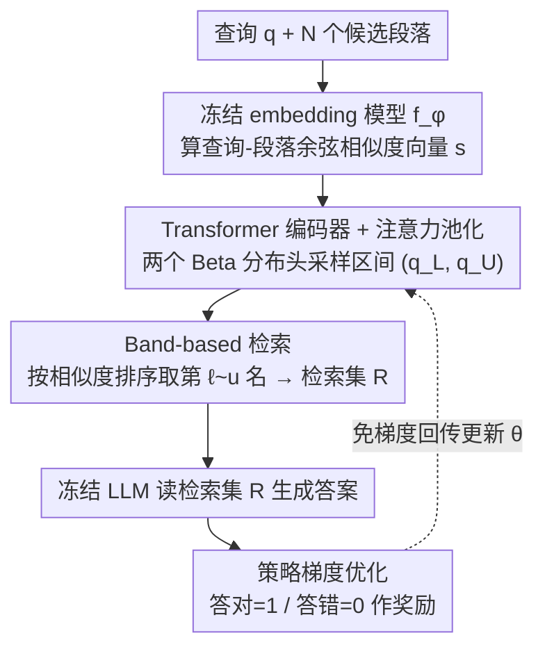

# Beyond RAG vs. Long-Context: Learning Distraction-Aware Retrieval for Efficient Knowledge Grounding

**会议**: ICLR 2026  
**arXiv**: [2509.21865](https://arxiv.org/abs/2509.21865)  
**代码**: [https://github.com/ku-dmlab/LDAR](https://github.com/ku-dmlab/LDAR)  
**领域**: LLM推理 / RAG / 信息检索  
**关键词**: RAG, 长上下文, 干扰感知检索, 自适应段落选择, 知识密集型问答

## 一句话总结
提出 LDAR（Learning Distraction-Aware Retrieval），一个轻量级自适应检索器，通过学习基于查询-段落相似度分布选择段落的连续区间（band），在平衡信息覆盖与干扰段落影响的同时，以约一半的 token 用量超越长上下文方法的性能。

## 研究背景与动机

**领域现状**：RAG 通过检索外部段落增强 LLM 生成，是解决 LLM 事实错误和知识过时的主流方案。近年来 LLM 上下文窗口扩展到 128K+，催生了直接将完整文档喂给模型的"长上下文"替代方案。

**现有痛点**：长上下文方法存在三个问题：(i) token 效率低，处理大量冗余上下文浪费计算资源；(ii) "lost in the middle"现象，模型难以回忆中间位置的信息；(iii) 对容量有限的模型产生严重干扰（distraction），最终降低输出质量。传统 RAG 的 top-k 检索虽然高效，但固定 k 值无法适配不同 LLM 的处理能力。

**核心矛盾**：检索更多段落可以增加信息覆盖（coverage），但同时引入更多干扰段落（distraction），形成倒U型性能曲线——性能先升后降。更关键的是，最优检索策略取决于 LLM 的能力（强模型容忍更多干扰）以及段落间组合交互效应（单独正确的段落联合检索可能导致错误）。

**本文目标** 如何自适应地选择段落集合，使得在给定 LLM 容量下最小化干扰段落的影响，同时保证足够的信息覆盖？

**切入角度**：作者观察到干扰效应不仅取决于单个段落的相关性，更取决于检索段落的组合——即使每个段落单独都能给出正确答案，联合起来也可能导致错误。因此不能简单地用文本信息做 reranking，需要从相似度分布的角度学习检索策略。

**核心 idea**：训练一个仅依赖查询-段落余弦相似度分布的轻量神经网络，通过 Beta 分布采样连续量化区间来选择段落，最小化对 LLM 产生的干扰。

## 方法详解

### 整体框架
LDAR 要回答的问题是：给定一个 LLM 的处理能力，到底该把多少、哪些段落喂给它，才能在"信息够用"和"别被干扰带偏"之间踩到最优点。它的做法是在检索和生成之间插一个轻量级的"裁判"。具体地，输入一个查询 $q$ 和 $N$ 个候选段落 $\{p_i\}$，先用预训练 embedding 模型 $f_\phi$ 算出查询-段落的余弦相似度向量 $s \in \mathbb{R}^N$；自适应检索器 $\pi_\theta$ 只看这个相似度向量，由 Transformer 编码器读懂分布形状后输出一对量化区间 $(q_L, q_U) \subset [0,1]$，把相似度排序后落在该区间内的段落收成检索集 $\mathcal{R}$ 交给 LLM 生成答案。整个训练过程中 LLM 和 embedding 模型都冻结，只用 LLM 答没答对作奖励、靠策略梯度更新这个检索器，所以它非常轻。

### 关键设计

**1. Band-based 检索策略：把"挑哪些段落"从指数级子集选择压成二维连续控制**

最直接的痛点是选择空间太大——要在 $N$ 个候选里挑一个子集，朴素做法是对每个段落独立做 Bernoulli 采样（检索 / 不检索），但这等于要在 $2^N$ 的组合空间里探索，泛化困难、容易收敛到次优解，实验里它干脆退化成"全都要"的长上下文方案。LDAR 换了个思路：不逐个决策，而是预测一个连续的相似度区间 $[q_L, q_U]$，只检索按余弦相似度排序后落在这段里的段落。落地时把区间映射回名次：$\ell = \max(1, \lfloor N \cdot q_L \rceil)$，$u = \max(\ell, \lfloor N \cdot q_U \rceil)$，取排序后第 $\ell$ 到第 $u$ 名。这一步把搜索空间从 $2^N$ 降到了二维连续空间，类似强化学习里的时间抽象（temporal abstraction）——用一个"段"代替逐个动作，信用分配和探索都更高效。

**2. Transformer 编码器 + 注意力池化：把变长的相似度向量编码成区间分布参数**

区间该定在哪，取决于整条相似度分布的形状（是陡峭聚集还是平缓拖尾），所以检索器要能读懂这条变长向量。每个相似度分数 $s_i$ 先经过周期性嵌入（periodic embedding）变成 token——这是处理连续值输入的常用手段；再过一个双向自注意力 Transformer，让段落之间的相对关系被捕捉；最后用注意力池化把变长序列压成一个固定维度的全局向量。这个全局向量接两个输出头，分别预测 Beta 分布参数 $(\alpha_L, \beta_L)$ 和 $(\alpha_U, \beta_U)$，再从中采样出 $q_L$ 和 $q_U$。选 Beta 分布是因为它的支撑天然就在 $[0,1]$，省去了额外的裁剪约束。

**3. 基于策略梯度的优化：用 LLM 答没答对当奖励，免梯度回传地训练检索器**

检索集是离散采样出来的，没法直接对 LLM 求导，于是 LDAR 用策略梯度绕过去。优化目标是 $\max_\theta J(\theta) = \mathbb{E}[r_\psi(q, \mathcal{R}, y)]$，其中奖励 $r_\psi = \mathbb{1}_{\text{corr}}(F_\psi(q, \mathcal{R}), y)$ 就是一个 0/1 指示——LLM 用检索集答对了给 1，答错给 0。靠 log-derivative trick，参数更新写成 $\theta_{k+1} = \theta_k + \gamma \cdot r_\psi \cdot \nabla_{\theta_k} \log \pi_{\theta_k}(\cdot|s)$。这套训练之所以轻，是因为 LLM 全程冻结、不用反传梯度，而检索器又只吃相似度分布、刻意不读段落文本，因此在大规模检索场景里也能扩展。更妙的是，奖励信号直接来自具体那个 LLM——换一个能力不同的模型，同一框架就会自然学到适配它容量的检索策略。

### 训练策略
训练里有一个需要单独处理的坑：Hallucination 任务的"正确行为"是拒绝回答，于是奖励会鼓励检索器干脆什么都不检索、走捷径拿分，学出一个退化策略。为避免这种污染，作者把 Hallucination 只当评估基准、不放进训练目标。另一个观察是，在 128K 长上下文设置下，LDAR 会自适应地检索更少的段落（token 用量比率更低），印证了输入越长、干扰风险越高这一动机。

## 实验关键数据

### 主实验
在 LaRA 基准（Location、Reasoning、Comparison、Hallucination）+ HotpotQA + NQ 共6个知识密集型基准上评估，覆盖开源（Qwen-2.5-7B、Llama-3.1-8B 等5个）和闭源（GPT-4o、Gemini-2.5-pro 等4个）LLM。

| 设置 | 方法 | 平均分 (开源) | 平均分 (闭源) | Token用量比 |
|------|------|-------------|-------------|-----------|
| 32K | LC | 58.62 | 74.00 | 1.000 |
| 32K | RAG (Top-5+Reranker) | 62.12 | 70.62 | 0.094 |
| 32K | BGM | 62.70 | 69.63 | 0.057 |
| 32K | Self-Route | 59.45 | 73.97 | 0.426 |
| 32K | **LDAR** | **70.00** | **79.42** | 0.467/0.629 |
| 128K | LC | 43.65 | 69.97 | 1.000 |
| 128K | RAG | 54.67 | 64.42 | 0.025 |
| 128K | **LDAR** | **61.55** | **76.22** | 0.250/0.517 |

### 消融实验

| 配置 | 效果 | 说明 |
|------|------|------|
| Band-based LDAR | 高分+低token用量 | 有效平衡覆盖与干扰 |
| Bernoulli-based LDAR | 退化为LC | 组合空间过大无法有效探索 |
| 开源LLM | token用量比 ~0.25-0.47 | 弱模型检索更少段落 |
| 闭源LLM | token用量比 ~0.52-0.63 | 强模型容忍更多干扰 |
| Location任务 | 用量比 0.45 | 定位信息任务聚焦高相似区 |
| Comparison任务 | 用量比 0.50 | 跨区域整合需要更多段落 |

### 零样本泛化
LDAR 在 LaRA 上训练后零样本迁移到 HELMET 基准（HotpotQA、NQ），开源模型平均分从 LC 的 44.2→60.0（HotpotQA），37.4→49.2（NQ），闭源模型也有一致提升。

### 关键发现
- Band-based 策略是成功关键——Bernoulli 版本完全失败，退化为长上下文方案
- LDAR 自适应调整：对弱模型检索更少（避免干扰），对强模型检索更多（利用其长上下文能力）
- 在 128K 上下文时，LDAR 特意检索更少段落（vs 32K），说明更长上下文干扰风险更大
- LDAR 推理效率优于 LC（开源模型 3.9s vs 15.4s）和多数 reranker 方法

## 亮点与洞察
- **band-based 检索的时间抽象思想非常巧妙**：将指数级子集选择问题压缩为二维连续控制问题，类比强化学习中的选项框架（options framework），既降低了探索难度又保留了足够的表达能力
- **仅用相似度分布做决策的极简设计**：不读段落文本、不微调 LLM、不微调 embedding 模型，只训练一个轻量网络，却能显著超越需要读文本的 BGM 和 reranker 方法。说明相似度分布本身包含了足够的检索决策信息
- **自适应适配 LLM 能力的涌现行为**：同一框架在不同 LLM 上训练后自然学到不同的检索策略（开源少检索、闭源多检索），无需手工调参

## 局限与展望
- Hallucination 任务需要特殊处理（不能用于训练），说明框架对"正确策略是不检索"的场景适配不好
- Band-based 策略假设最优段落集是相似度排序后的连续区间，但实际中可能存在不连续的最优子集
- 每个 LLM 需要单独训练一个检索器，跨模型迁移能力有待验证
- 固定 embedding 模型可能限制上界——如果 embedding 质量差，相似度分布本身缺乏信息量

## 相关工作与启发
- **vs RAG**：传统 RAG 用固定 top-k，LDAR 用学习的动态区间；RAG 不考虑 LLM 容量，LDAR 天然适配
- **vs 长上下文**：LC 提供全部信息但引入大量干扰，LDAR 在覆盖和干扰间找到最优平衡点
- **vs BGM**：BGM 在 top-5 文本候选中做子集选择（组合空间受限但需读文本），LDAR 在全部段落中做区间选择（搜索空间更大但更高效）
- **vs Self-Route**：Self-Route 用 LLM 自评估做二选一（RAG 或 LC），LDAR 直接学习连续策略

## 评分
- 新颖性: ⭐⭐⭐⭐ band-based 检索策略视角新颖，将检索问题转化为连续控制问题
- 实验充分度: ⭐⭐⭐⭐⭐ 6个基准、9个LLM、8+对比方法，开源/闭源分开评估，非常全面
- 写作质量: ⭐⭐⭐⭐ 动机推导清晰，图示直观，Motivation 章节的分析有说服力
- 价值: ⭐⭐⭐⭐ 为 RAG vs LC 争论提供了实用的中间方案，成本效益比高

<!-- RELATED:START -->

## 相关论文

- [\[ICLR 2026\] Q-RAG: Long Context Multi‑Step Retrieval via Value‑Based Embedder Training](q-rag_long_context_multistep_retrieval_via_valuebased_embedder_training.md)
- [\[ICLR 2026\] Embedding-Based Context-Aware Reranker](embedding-based_context-aware_reranker.md)
- [\[ICLR 2026\] AdaCache: Adaptive Caching and Context Augmentation for Efficient LLM Serving](adacache_adaptive_caching_and_context_augmentation_for_efficient_llm_serving.md)
- [\[ICLR 2026\] Query-Aware Flow Diffusion for Graph-Based RAG with Retrieval Guarantees](query-aware_flow_diffusion_for_graph-based_rag_with_retrieval_guarantees.md)
- [\[ACL 2025\] Hierarchical Document Refinement for Long-context Retrieval-augmented Generation](../../ACL2025/information_retrieval/hierarchical_document_refinement_for_long-context_retrieval-augmented_generation.md)

<!-- RELATED:END -->
