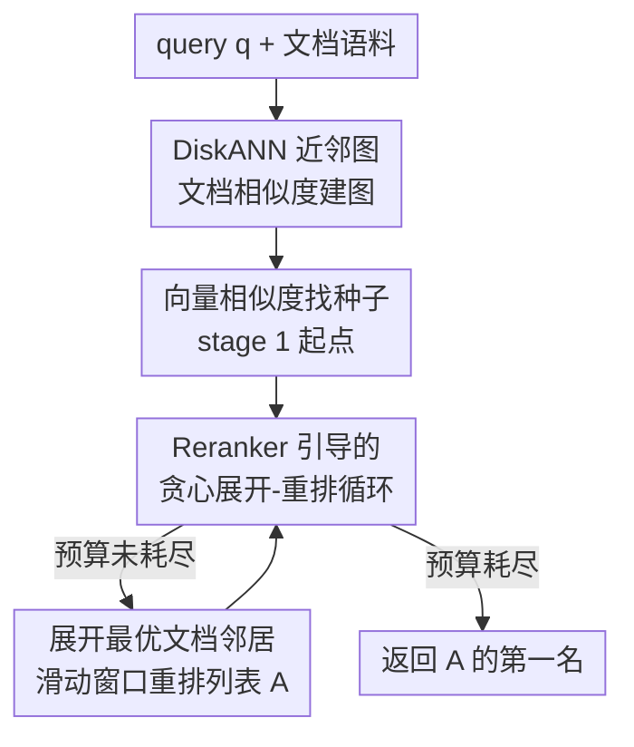

# Beyond Sequential Reranking: Reranker-Guided Search Improves Reasoning Intensive Retrieval

**会议**: ICLR2026  
**OpenReview**: [https://openreview.net/forum?id=Fjw3OqdjTj](https://openreview.net/forum?id=Fjw3OqdjTj)  
**代码**: https://github.com/xuhaike/Reranker-Guided-Search  
**领域**: 信息检索 / 重排 / 推理密集型检索  
**关键词**: reranker、近邻图搜索、bi-metric、推理密集型检索、reranker 预算

## 一句话总结
本文把"检索-重排"管线里那条死板的"top-k 顺序扫描"换成在文档相似度近邻图上的贪心搜索（Reranker-Guided-Search, RGS），让 reranker 优先去看那些"邻居已被判高分"的有潜力文档，从而在每个 query 只允许调用 reranker 100 次的预算下，在 BRIGHT/FollowIR/M-BEIR 三个推理密集型检索基准上分别比顺序重排提升 3.5/2.9/5.1 个 NDCG@10。

## 研究背景与动机
**领域现状**：当复杂检索任务（科学推理、指令跟随、多模态）超出 embedding 的语义匹配能力时，主流补救方案是 **retrieve-and-rerank**：先用 embedding 模型把语料粗排出 top-k，再用一个昂贵但强大的 reranker（如今多是 LLM-based listwise reranker）对这 k 个候选逐窗口精排。

**现有痛点**：这条管线有两个被卡死的瓶颈。其一，最终精度被**第一阶段召回**封顶——如果正确答案根本没进 top-k，reranker 再强也救不回来；论文实测在 BRIGHT 上只有 31% 的 ground-truth 落在 embedding 排序的前 100 名内。其二，LLM reranker 算力昂贵，**能扫描的文档数量极其有限**，于是大家默认"顺序扫前 k 个"，这是一种把宝贵预算平均撒在 top-k 上的浪费。

**核心矛盾**：reranker 预算是稀缺资源，而顺序扫描完全没有利用"哪些文档更值得看"的信息——它对第 1 个候选和第 100 个候选一视同仁地花同样的预算，哪怕第 100 个所在的语义簇早就被证明是噪声。

**本文目标**：在 reranker 调用次数固定（如每个 query 最多 100 次）的前提下，**怎么挑选送进 reranker 的文档，才能最大化最终精度**？这要求一个能"边重排边决定下一步看哪里"的自适应策略，而不是预先定好的固定候选集。

**切入角度**：作者借用了两个旧观察。一是**聚类假设**（clustering hypothesis）：相似的文档对同一 query 往往有相似的相关性——所以一旦某文档被 reranker 判为相关，它的邻居就值得优先看。二是 ANN 社区的 **bi-metric 框架**（Xu et al. 2024）：可以用一种距离（文档 embedding 相似度）建好的近邻图，去搜索另一种距离（reranker 偏好）下的最近邻。两者一拼，就得到"用文档图引导 reranker 去探索"的思路。

**核心 idea**：把 reranker 当成"真实距离度量"，在 embedding 建好的近邻图（proximity graph）上跑一遍贪心 beam search——从离 query 最近的种子出发，不断展开"当前最有潜力文档"的邻居并重排，把预算花在有希望的区域、跳过低分簇，从而触达顺序扫描永远够不到的深处文档。

## 方法详解

### 整体框架
RGS 的输入是一个 query $q$、一个文档语料 $C=\{d_1,\dots,d_n\}$、一个 embedding 模型 $E(\cdot)$ 和一个 listwise reranker $D$；输出是 reranker 预算耗尽时它认为最相关的文档。整条流程分**离线建图**和**在线两阶段搜索**两部分。离线阶段在文档 embedding 上跑 DiskANN 建一张近邻图 $G$，每个节点 $v$ 至多有 $R$ 个出邻居 $N_{out}(v)$。在线阶段：先用向量相似度找到离 query 最近的种子文档作为起点（stage 1），再以这个起点为入口、在图上跑一轮"由 reranker 引导的贪心展开-重排循环"（stage 2），维护一个按 reranker 偏好实时排序的候选列表 $A$，每次挑列表里最靠前且尚未展开的文档去探索它的邻居，把新邻居加进来再用滑动窗口重排，直到预算用光，返回 $A$ 的第一名。

关键的区别在于：传统 retrieve-and-rerank 是"先冻结一个 top-k 候选集，再顺序扫"；RGS 是"候选集随着 reranker 的反馈动态生长"——reranker 不仅在打分，还在决定搜索往哪个方向走。

### 关键设计

**1. Reranker 引导的图上贪心搜索：把"顺序扫描"换成"由相关性反馈带路的 beam search"**

这是全文的核心，直接针对"顺序扫描浪费预算、够不到深处文档"的痛点。RGS 维护一个有序列表 $A$，初始只含种子文档 $s$；每一步取出 $A$ 中第一个未展开的文档 $v$，把它在图上的出邻居 $N_{out}(v)$（至多 $R$ 个、去掉已在 $A$ 中的）追加到列表末尾，然后用 listwise reranker 以步长 $w/2$ 的滑动窗口从末尾向前对新加入段做重排序，让真正相关的新文档冒到前面；若 $|A|$ 超过搜索列表长度 $L$ 就截断到前 $L$ 个。这个"展开 + 重排"循环一直跑到 reranker 调用预算耗尽，返回 $A[0]$（见 Algorithm 1）。其精髓是：列表顺序始终反映 reranker 的最新偏好，于是搜索总是从"当前最被看好的文档"继续往外探——这正是图近邻搜索里 beam search 的行为，只不过这里的"距离"是 reranker 分数而非向量内积。正因为它顺着高分文档的邻居走、不去碰低分簇的邻居，才能在论文图 1 的 TheoremQA-T 例子里找到那个在 embedding 空间里排第 2812 名、顺序重排永远扫不到的正确文档 D3。

**2. Bi-metric 近邻图复用：用 embedding 距离建的图，去搜 reranker 距离下的最近邻**

针对"reranker 太贵、无法对全库打分"的现实约束。RGS 不为 reranker 单独建图（那不可能，reranker 没有可索引的向量），而是直接复用 DiskANN 在**文档 embedding** 上建好的那张近邻图来当搜索骨架。理论依据来自 Xu et al. (2024) 的 bi-metric 框架（论文引其 Theorem 1.1）：只要向量相似度能在常数因子内**近似** reranker 分数，在 embedding 图上跑贪心搜索就能找到 reranker 意义下的最相关文档。这把昂贵度量（reranker）的搜索成本，转嫁给了廉价度量（embedding）预先建好的图结构，是"用 embedding 当导航、用 reranker 当裁判"分工的根基。运行时间瓶颈在 reranker 调用，论文估计 RGS 的 reranker 调用数约为 $O(L^2/w)$，而 retrieve-and-rerank 与 SlideGAR 为 $O(Q/w)$（$Q$ 为预算、$w$ 为窗口）。

**3. 与 SlideGAR 的关键差别：维护完整的 reranker 排序，而非丢弃图前沿的剩余文档**

这一点解释了 RGS 为什么比同样走图前沿的 SlideGAR 强。SlideGAR 每轮只从图前沿里**按向量相似度**挑前 $w/2$ 个文档进来、丢掉其余——意味着即便一个相关文档出现在前沿，只要它的 embedding 离 query 不近，就可能永远轮不到被重排，所以作者把 SlideGAR 看成"加了图邻居的增强版线性重排"。RGS 则把展开出来的**所有**邻居都插入有序列表、由 reranker 来决定它们的去留和顺序，真正模拟标准的 beam search。这个差别在 embedding 与 query 相关性弱（推理密集任务）时尤其重要：RGS 不依赖"邻居的 embedding 离 query 近"，只依赖"邻居被 reranker 判得高"。

**4. Reranker@k 评测协议：把"reranker 预算"作为一等公民显式约束**

针对过去这类方法只在经典 TREC 上比、没有统一公平口径的问题。作者提出一个少被讨论的评测设置 **Reranker@k**——限制 reranker 在整个检索过程中最多扫描 $k$ 个文档（实验取 $k=100/300/500$），在此约束下测 NDCG@10。注意它允许同一文档被 listwise reranker 多次重排（滑动窗口会重复看）。这个协议把"用多少 reranker 预算换多少精度"这件事摆到台面上，让 RR / SlideGAR / RGS 在同一预算下可比，也正是本文"固定预算最大化精度"目标的度量载体。

### 一个完整示例
以论文图 1 的 TheoremQA-T query Q 为例走一遍。Q 与文档 C1、D1 都有表面相似（Q 和 D1 都提到 sine 函数，Q 和 C1 都提到 amplitude），所以第一阶段向量检索把 C1、D1 排在前面。但 reranker 给 C1 较低分——它虽然话题相关却没给出正确的数学关系，于是 RGS **不去展开 C1 的邻居**（省下预算）。reranker 看好 D1，RGS 就展开 D1 得到 D2；D2 虽然和 Q 几乎没有词面重叠，但包含解题所需的正确方法，被 reranker 捕捉到高分；再展开 D2 得到正确答案 D3。整个过程重排不到 500 个文档，就找到了在 embedding 空间里排第 2812 名的 D3——顺序重排在 100 甚至 500 预算下都不可能触达。这个例子把"跳过低分簇、顺着高分文档深挖"的机制具象化了。

## 实验关键数据

### 主实验
三个基准：BRIGHT（推理密集，12 域）、FollowIR（指令跟随，3 个 TREC 子集）、M-BEIR（多模态，8 类 query-corpus 子任务）。embedding 用 BGE-Large（M-BEIR 用 CLIP ViT-B/32），reranker 用 Gemini-2.0-Flash。下表为 Reranker@100 预算下的平均 NDCG@10：

| 基准 | 无 reranker | RR（顺序重排） | SlideGAR | RGS（本文） | RGS vs RR |
|------|------------|---------------|----------|------------|-----------|
| BRIGHT | 13.7 | 25.3 | 25.4 | **28.8** | +3.5 (+14%) |
| FollowIR | 49.9 | 60.4 | 62.5 | **63.3** | +2.9 (+5%) |
| M-BEIR | 15.3 | 25.9 | 28.6 | **31.0** | +5.1 (+20%) |

预算放大到 Reranker@500 时优势进一步拉开：BRIGHT 上 RGS 达 33.0（RR 27.7、SlideGAR 26.9），M-BEIR 达 38.3（RR 30.1、SlideGAR 29.9）。值得注意的是 SlideGAR 在 FollowIR 上随预算增大反而从 62.5 掉到 59.8，而 RGS 保持稳定提升。

### 消融实验
作者用扰动实验拆解 embedding 两种作用（文档间相似度 vs query-文档相关性）的角色，下表为 BRIGHT-Psychology 上不同扰动下的 NDCG@10：

| 配置 | RR | SlideGAR | RGS | 说明 |
|------|------|----------|-----|------|
| 无扰动（w=0） | 40.4 | 36.2 | 49.2 | 原始 embedding |
| query 扰动 w=1 | 1.8 | 13.2 | 40.4 | query embedding 完全失效 |
| 文档扰动 w=1 | 0.8 | 1.6 | 1.1 | 文档相似结构也被破坏 |

关键发现：当**只扰动 query** embedding 到完全无信息（w=1）时，RR 几乎归零、SlideGAR 掉到 13.2，而 **RGS 仅从 49.2 微降到 40.4**——因为 query embedding 在 RGS 里只用来定第二阶段搜索的起点，随机起点只是放慢搜索、不改变最终结果。但当**文档** embedding 被破坏时三种方法都崩，说明 RGS 真正依赖的是文档间相似度结构（图的质量），而非 query-文档相似度。

### 关键发现
- **embedding 容量在高预算下不重要**：用 4 个不同规模 embedding（SFR-Mistral 7B 到 BGE-Micro 17M）做 RR 时强弱差距明显，但 RGS 在 Reranker@500 下全部收敛到相近精度——embedding 只决定"达到某精度需要多少次 reranker 调用"，最终上限由 reranker 能力决定。
- **天花板来自 reranker 与标注的错位**：误差分析把 ground-truth 分为"已返回/已见到未被选/从未见到"三类，发现随预算增大"已见到"比例持续上升、但"已返回"比例不升反略降——说明 RGS 已经把对的文档搜出来了，瓶颈是 reranker 偏好与人工标注不完全对齐。
- **增益与任务难度强相关**：RGS 在科学推理类提升最大；在 AoPS、LeetCode 这类需要密集推理才能重排的任务上，所有重排方法都几乎无改进。M-BEIR 任务 6（embedding 编码长文档能力弱）上 RGS 把分数从 <5 拉到 30.7，是优势最戏剧化的场景。

## 亮点与洞察
- **把搜索算法引入重排**：最"啊哈"的点是它不再把 reranker 当成一个被动打分器，而是让 reranker 的反馈实时驱动图上的 beam search 方向——重排和检索从两个串行阶段融成了一个闭环。这套思路本质是"用昂贵度量在廉价度量建好的图上做最近邻搜索"，可迁移到任何"有一个贵但准的相关性函数 + 一个便宜的相似度结构"的场景（如工具检索、agent 记忆检索）。
- **对 query embedding 几乎免疫**：RGS 只用 query embedding 选起点，因此在推理密集型任务（query 与答案词面/语义都不像）里格外稳——这恰好戳中传统 dense retrieval 最弱的软肋。
- **Reranker@k 协议本身有价值**：把"reranker 预算"显式当作约束去比方法，是这个子领域过去缺失的公平口径，可复用为后续工作的标准评测设置。

## 局限与展望
- **依赖文档图质量**：消融显示一旦文档 embedding 失真，RGS 与基线一起崩——它把"文档相似簇结构"当成可靠骨架，在 embedding 对文档区分度差的语料上会失效。
- **天花板卡在 reranker**：误差分析坦承最终精度受限于 reranker 偏好与真值标注的错位，再多预算也救不回"搜到了却没被选中"的答案；改进空间在 reranker 本身而非搜索算法。
- **复杂度对 $L$ 敏感**：reranker 调用数约 $O(L^2/w)$，搜索列表 $L$ 增大时开销二次增长，需按预算调参（$L_s=20/30/50$ 对应 $k=100/300/500$）。
- **理论保证有缺口**：贪心图搜索本身缺乏最坏情况理论保证（Indyk & Xu 2023），bi-metric 的精度保证也依赖"向量相似度常数因子近似 reranker 分"这一较强假设，在推理密集任务上未必严格成立。

## 相关工作与启发
- **vs GAR / RAR / SlideGAR**: 这三者都在文档图前沿上做重排以绕过顺序瓶颈，但只在经典 TREC 上验证、且（如 SlideGAR）按向量相似度挑前沿子集、丢弃其余。RGS 维护由 reranker 偏好实时排序的完整列表、模拟标准 beam search，并在 BRIGHT/M-BEIR 等真正复杂的现代检索任务上验证，优势更明显。
- **vs Retrieve-and-Rerank（顺序重排）**: 二者用同一对 embedding+reranker，但 RR 先冻结 top-k 再顺序扫，精度被第一阶段召回封顶；RGS 让候选集随 reranker 反馈动态生长，能触达 embedding 排名极靠后的正确文档。
- **vs 图 ANN（DiskANN/HNSW/NSG）**: RGS 直接复用 DiskANN 建好的近邻图当搜索骨架，但把搜索的目标度量从"向量内积"换成"reranker 分数"，是 bi-metric 框架（Xu et al. 2024）在重排场景的落地。

## 评分
- 新颖性: ⭐⭐⭐⭐⭐ 把图 ANN 的 beam search 思路嫁接到 reranker 选择，角度新颖且自洽。
- 实验充分度: ⭐⭐⭐⭐ 三基准 + 多 embedding/reranker + 扰动与误差分析扎实，但 M-BEIR 只采样 100 query 略弱。
- 写作质量: ⭐⭐⭐⭐⭐ 动机-方法-分析逻辑清晰，图 1 例子和误差分析把机制讲透。
- 价值: ⭐⭐⭐⭐ 在固定 reranker 预算下稳定涨点，对推理密集型检索和 LLM reranker 落地有直接实用价值。

<!-- RELATED:START -->

## 相关论文

- [\[ICLR 2026\] Frustratingly Simple Retrieval Improves Challenging, Reasoning-Intensive Benchmarks](frustratingly_simple_retrieval_improves_challenging_reasoning-intensive_benchmar.md)
- [\[ICLR 2026\] Hybrid Deep Searcher: Scalable Parallel and Sequential Search Reasoning](hybrid_deep_searcher_scalable_parallel_and_sequential_search_reasoning.md)
- [\[ICLR 2026\] RefTool: Reference-Guided Tool Creation for Knowledge-Intensive Reasoning](reftool_reference-guided_tool_creation_for_knowledge-intensive_reasoning.md)
- [\[ACL 2026\] A Survey of Reasoning-Intensive Retrieval: Progress and Challenges](../../ACL2026/information_retrieval/a_survey_of_reasoning-intensive_retrieval_progress_and_challenges.md)
- [\[ICLR 2026\] Retro*: Optimizing LLMs for Reasoning-Intensive Document Retrieval](retro_optimizing_llms_for_reasoning-intensive_document_retrieval.md)

<!-- RELATED:END -->
