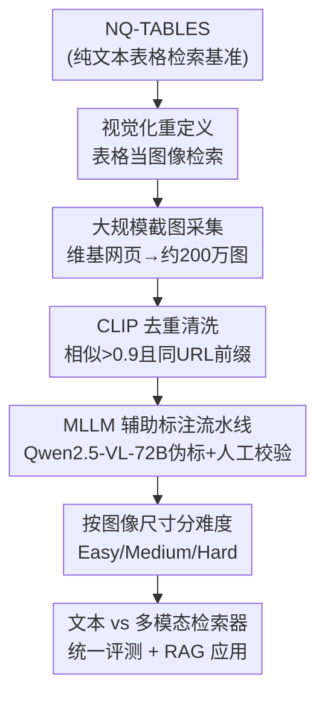

# Beyond Text-Only: Towards Multimodal Table Retrieval in Open-World

**会议**: ICLR2026  
**OpenReview**: [https://openreview.net/forum?id=4QPgqdQmYn](https://openreview.net/forum?id=4QPgqdQmYn)  
**代码**: https://github.com/Trustworthy-Information-Access/Tab-ViR  
**领域**: 信息检索 / 多模态  
**关键词**: 表格检索, 多模态检索, 图像表格, 基准数据集, RAG

## 一句话总结
这篇论文指出"把表格序列化成文本再检索"会丢掉表格的结构和图像信息，于是把开放域表格检索重新定义成"以表格截图为单位的多模态检索"，并据此构建了首个图像化表格检索基准 TaR-ViR；实验证明多模态检索器在召回率上能追平甚至超过文本检索器，且省掉了易出错的表格转文本环节。

## 研究背景与动机

**领域现状**：开放域表格检索要从海量语料里找出与自然语言查询相关的结构化表格——大约 27% 的网络搜索查询隐式或显式地指向表格数据，因此这是信息系统里的关键功能。但相比纯文本检索，表格检索研究得少很多，主流做法（TAPAS、DTR、UTP、THYME、ECAT 等）几乎都把它当作"文本检索的一个变种"：先把表格按行或按列拍平成线性文本序列，再丢给文本编码器。

**现有痛点**：这种"序列化成文本"的范式有两个硬伤。其一，**表格的结构语义在拍平时被丢掉**——合并单元格、多级表头、不规则对齐这些复杂版式，一旦展成一维文本就还原不了表头与单元格之间的层级关系和空间排布；科学论文里常用合并单元格表达逻辑分组，序列化后这层信息直接没了。其二，**纯文本表示装不下多模态内容**——现实表格里嵌的图像、视觉标记、配色这些信息根本无法用文本存储。而真实世界的表格散落在电子表格、数据库、PDF、网页里，文本化既费力又有损。

**核心矛盾**：表格本质上是一种"二维视觉对象"，但现有检索范式硬要把它压成一维文本流，于是结构信息和视觉内容在这一步就被牺牲掉了，检索性能也随之受损。

**本文目标**：找一种"格式无关、且同时保留结构与内容"的表格表示方式，绕开文本序列化的损失；并为这个新方向补上缺失的标准评测基准。

**切入角度**：作者的关键观察是——**表格的视觉呈现天然就是格式无关的，而且同时保留了结构信息和内容信息**。把一张表格直接当成一张图来编码，合并单元格、层级表头、嵌入图片这些"文本装不下"的东西全都原封不动地留在像素里。既然多模态检索（CLIP/BLIP 这一脉一直到 VLM2Vec、GME 这类统一多模态嵌入）已经成熟，把它迁到表格上就顺理成章。

**核心 idea**：用"表格图像 + 多模态检索器"代替"表格序列化文本 + 文本检索器"，从根上避开易出错的转文本步骤；并构建首个图像化表格检索基准 TaR-ViR 来验证这条路走得通。

## 方法详解

这篇论文的"方法"主体是**基准构建**而非提出新模型——它要回答的是"怎么造出一个高质量的图像化表格检索数据集，并公平地比较文本检索器与多模态检索器"。所以下面的方法详解围绕 TaR-ViR 的数据流水线和评测设计展开。

### 整体框架

TaR-ViR 在已有的纯文本表格检索基准 **NQ-TABLES** 之上改造而来。整条流水线是：先把 NQ-TABLES 里每张表格对应的维基百科网页**截图**爬下来（约 200 万张图像），把"表格"从文本变成图像；再做**去重**清洗冗余截图；然后用 MLLM 做**自动伪标注**、配人工**校验**修正因网页随时间更新而漂移的查询-表格相关性；最后按**图像尺寸分难度**做分层统计，并在此基础上系统比较文本检索器与多模态检索器。形式上，数据集 $D=\{(q, T^{+})\}$，查询 $q$ 对应一组相关表格 $T^{+}=\{t^{+}\}$，每张表格 $t$ 由一张**图像**加一个**文本标题**组成；目标是训练能识别 $q$ 与 $T^{+}$ 之间相关模式的检索器。

### 关键设计

**1. 视觉化重定义：把表格检索从"序列化文本匹配"变成"图像-查询匹配"**

这是全文的立足点，针对的正是"文本序列化丢结构、丢多模态内容"这个根本痛点。作者不再把表格按行/列展平成文本，而是直接把整张表格作为**图像**纳入检索语料：一张图天然保留了合并单元格、多级表头、不规则对齐这些空间结构，也保留了表格里嵌的照片、配色、字体强调等视觉线索，而且**格式无关**——无论原表格来自网页、PDF 还是电子表格，截成图后都是统一的像素表示。这样做的直接收益是省掉了"表格→文本"这个既费力又有损的预处理：多模态检索器可以直接吃图像，大规模采集和利用开放世界表格时不再被"先抽取、再标准化结构数据"卡住。这一步不是工程细节，而是范式层面的转换——它把表格检索从 NLP 问题搬到了多模态检索问题，后续所有设计都服务于验证这个转换是否成立。

**2. 大规模截图采集 + CLIP 去重：用网页截图重建图像语料并清洗冗余**

要让"图像化检索"可评测，先得有图像语料。作者系统性地把 NQ-TABLES 中每张表格所嵌的维基百科网页截图爬下来，得到约 200 万张图像。但原始截图有两类冗余：多个 URL 指向同一网页内容，以及同一张表格出现在不同网页上。作者用 **CLIP** 做视觉相似度过滤——当两张图相似度超过 $0.9$ **且** 共享相同 URL 前缀时判为重复，每组重复只保留一个代表实例，并相应合并标注以保持数据一致性；对一张 NQ-TABLES 表格关联的多张图，排序后取 Top-1 作为该表格的图像表示。这一步把杂乱的原始爬取结果收敛成干净、表格与图像一一对应的语料，是后续标注和评测的地基。

**3. MLLM 辅助标注流水线：用大模型伪标 + 人工轻校验，低成本修正时序漂移**

维基百科是动态持续更新的，爬到的表格图像可能已经和 NQ-TABLES 里的原始表格对不上，查询与表格的相关性会随时间退化——直接复用旧标签会引入噪声。全量人工重标又太贵。作者的折中方案是：用 **Qwen2.5-VL-72B** 自动生成伪相关标注，再让人工做"精简的验证与修正"。人工部分只做两件事——**相关性标注**（判断模型给的伪相关结果对不对）和**答案标注**（对判为相关的查询-表格对，进一步核对答案是否与问题和表格图像吻合）。为控制成本，**人工只覆盖测试集**；训练集则只保留被 Qwen2.5-VL-72B 标为相关的样本，靠自动过滤保证质量。作者用 1,550 个查询-表格对做人工评估，其中 1,249 个（约 $80\%$）被验证为正确，说明自动标注本身就有约 80% 的准确率——这个数字也是"自动伪标 + 人工抽检"这套流水线可行性的直接证据。

**4. 按图像尺寸分难度：用"相对浏览器窗口大小"把表格分成 Easy/Medium/Hard**

为了能细粒度地分析"多模态检索到底在什么场景下占优"，作者按表格图像相对浏览器窗口的覆盖面积分三档：**Easy**（< 25% 窗口）、**Medium**（25%–100%）、**Hard**（超过一个窗口）。这个划分对应着对 MLLM 递增的视觉理解难度——表格越大，越需要强空间推理和对复杂版式的适应能力。它不是随手的统计维度，而是后续"信息量分析"的实验抓手：正是靠这套分层，作者才能观察到"小表格上 OCR 文本检索更好、大/难表格上图像检索反超"这一关键趋势（见实验 Table 5）。

### 一个完整示例

以测试集里的查询 *"Who sings I want to be a rockstar?"* 为例走一遍图像检索的好处（论文 Case Study）：相关表格是 Nickelback 单曲 *Rockstar* 的信息框，里面既有文字（B-side、Released、Genre、Length 等字段），也有照片、配色和版式强调。把它交给两种 Qwen2-VL-2B 检索器：基于 OCR 文本的检索器把这张表排到了**第 18 名**，而直接吃图像的多模态检索器把它排到了**第 4 名**。差距来自图像里那些 OCR 抹掉的视觉线索——照片、颜色、布局对关键信息的强调，让多模态检索器更容易识别并优先排序对的表格。这个例子具象地说明了"为什么图像表示能在排序质量上赢"。

## 实验关键数据

### 主实验

评测在 TaR-ViR 上对比两类检索器：**文本检索器**（把表格图像先用 Qwen2.5-VL-7B 转成 HTML，再展开成行序列文本）与**多模态检索器**（直接吃文本+图像）。指标用 Recall、NDCG、MRR（cutoff 取 50）。

| 检索器 | 输入模态 | 参数量 | R@10 | N@5 | M@5 |
|--------|----------|--------|------|------|------|
| BM25 | 标题文本+OCR文本 | – | 20.50 | 21.70 | 19.79 |
| BGE | 标题文本+OCR文本 | 109M | **92.15** | **72.82** | **68.18** |
| Qwen3-Embedding | 标题文本+OCR文本 | 4.05B | 89.30 | 71.93 | 68.04 |
| GME | 标题文本+内容图像 | 2.21B | 59.80 | 43.68 | 40.15 |
| VLM2Vec | 标题文本+内容图像 | 7.07B | 94.23 | 70.56 | 64.80 |
| UniME | 标题文本+内容图像 | 7.57B | 93.38 | **75.62** | **71.44** |
| ColPali | 仅内容图像 | 2.21B | 63.59 | 48.93 | 46.15 |

关键观察：在文本检索器里，**BGE（109M）反而打过更大的 GTE 和 Qwen3-Embedding**——文本嵌入更看重预训练目标和数据质量而非参数规模；但在多模态检索器里**性能随参数规模单调提升**，说明视觉-文本联合表示学习需要强基础能力，大参数不可或缺。带标题+内容图像的多模态检索器（UniME、VLM2Vec）甚至超过基于 OCR 的文本检索器：UniME 在 NDCG/MRR 上显著超过 SOTA 文本检索器 BGE，代价是更高的模型复杂度。

### 表格格式对比与信息量分析

控制基座统一为 Qwen2-VL-2B、只改输入格式（消除训练差异），比较不同表格表示：

| 输入格式 | R@10 | N@5 | M@5 |
|----------|------|------|------|
| 标题文本 + OCR 内容 | 89.00 | 65.91 | 61.46 |
| 标题文本 + 网页原文内容 | 90.30 | 65.20 | 60.64 |
| 标题文本 + 内容图像 | **91.69** | **67.42** | **62.19** |
| 标题图像 + 内容图像 | 82.30 | 58.09 | 53.32 |

按难度分层（Table 5）的结论更有意思：**小表格（Easy）上 OCR 文本检索最好**；但表格在结构复杂度和物理尺寸上变大后，MLLM 难以把图里所有文字准确抽全，**图像检索在 Medium/Hard 上逐步反超**——大表格里图像保留了完整信息，匹配更精准。

### 关键发现
- **标题信息影响巨大**：无论 OCR 还是图像，带表格标题的检索器性能都明显更好；但现实采集时标题常缺失或抽不准，缺标题时多模态检索器只能发挥约 70% 的完整性能。
- **OCR 文本在排序指标上反而占优（小表格场景）**：MLLM 对"被颜色对比、字体变化等排版手段视觉强调过"的信息有系统性偏好，类似人类找信息的模式，于是 OCR 输入在 NDCG/MRR 这类排序指标上更强；但这个优势随表格信息量增大而消失。
- **两种范式各有取舍**：一是"MLLM 抽文本 → 小文本检索器（如 BGE）"，OCR 内容可通过 API 调 MLLM 获取、使用更灵活；二是"直接用 MLLM 多模态检索器"，省掉转文本步骤、更简洁高效。实际部署要在资源和效率间权衡。

### RAG 应用
TaR-ViR 还标了答案，可评测 RAG。用 Qwen2-VL-2B 的文本/多模态检索器配不同生成器（Mistral-7B、Llama3.1-8B、Qwen3-8B、LLaVA-OneVision、Qwen2.5-VL-7B），Qwen3-8B 生成器表现最好（n=5 时准确率约 58%）；Qwen2.5-VL 在表格以图像输入时表现更好，但总体上**文本 LLM 的上界更高**——回答图像表格的问题需要 MLLM 同时具备精确视觉解析、结构化语义理解和符号推理，而当前 MLLM 尚未完全打通这几项能力。

## 亮点与洞察
- **范式转换的视角很干净**：把"表格存成什么格式"这件被默认为文本的事重新审视，指出图像才是"格式无关 + 同时保结构和内容"的最自然载体——这个 reframing 本身就是论文最大的价值，比任何具体模型改进都更有启发。
- **"OCR 在排序上更好、图像在召回/大表上更好"是非平凡的发现**：它揭示了 MLLM 对视觉强调信息的系统性偏好，也解释了为什么不能简单宣称"图像一定优于文本"——结论是场景依赖的，这对实际系统选型很有指导意义。
- **低成本标注流水线可复用**：用强 MLLM（Qwen2.5-VL-72B）做伪标 + 人工只抽检测试集、训练集靠自动过滤，把维基"时序漂移"这个数据质量难题用约 80% 自动准确率兜住——这套"造图像化检索基准"的方法论可迁移到 PDF、电子表格等其他表格来源。
- **难度分层是分析利器**：用"相对浏览器窗口大小"定义 Easy/Medium/Hard，简单但有效地把"多模态何时占优"量化了出来。

## 局限与展望
- **本质是基准 + 实证研究，没有提出新检索模型**：所有多模态检索器都是现成的（VLM2Vec、UniME 等），论文贡献在数据和发现，专门为图像化表格检索设计的检索器仍是空白。
- **训练集未经人工精修**：训练集只靠 Qwen2.5-VL-72B 自动过滤，约 80% 的自动标注准确率意味着训练数据里仍残留约 20% 噪声，对下游训练的影响没有充分剖析。
- **多模态优势依赖大参数**：小参数多模态检索器整合跨模态信息能力弱、明显落后，意味着图像化范式的部署成本目前偏高。
- **依赖维基百科单一来源**：截图全来自维基，版式和领域多样性受限；真实开放世界里 PDF、报表、数据库截图的版式更杂，泛化性待验证。
- **标题缺失是硬约束**：缺标题时性能掉到约 70%，而现实采集中标题恰恰常常缺失或抽不准——如何在无标题条件下补上这部分性能是关键改进方向。

## 相关工作与启发
- **vs 文本表格检索（TAPAS / DTR / UTP / THYME / ECAT）**：它们都在"文本序列化"框架内优化——加行/列嵌入表达结构、改训练流程、做实体匹配；本文直接换掉序列化这一步，用图像绕开结构丢失和多模态内容丢失，区别是范式层面的而非技巧层面的。
- **vs 通用多模态检索（CLIP / BLIP / UniIR / MagicLens / VLM2Vec / GME）**：这些方法学的是通用图文统一嵌入，本文把它们迁移并系统评测到"表格图像"这个特定且结构性极强的场景，并发现它们在大/复杂表格上的独特优势与在小表格上的劣势。
- **vs 已有图像化表格基准（ComTQA / TabFQuAD）**：在图像化表格基准里，TaR-ViR 规模最大，且同时支持检索与 QA 两类评测，填补了"标准图像化表格检索评测缺失"的空白。

## 评分
- 新颖性: ⭐⭐⭐⭐ 把表格检索重定义为图像检索的 reframing 干净有力，但用的是现成多模态检索器、未提新模型。
- 实验充分度: ⭐⭐⭐⭐ 覆盖文本/多模态多类检索器、格式对比、难度分层、RAG 四个维度，结论扎实；训练集噪声与单一数据源分析略浅。
- 写作质量: ⭐⭐⭐⭐ 动机推导清晰、发现陈述到位，case study 直观；部分小节细节偏简。
- 价值: ⭐⭐⭐⭐ 首个大规模图像化表格检索基准 + 一组非平凡的范式对比发现，对表格检索方向有明确推动作用。

<!-- RELATED:START -->

## 相关论文

- [\[ACL 2026\] Retrieve Only Relevant Tables Whether Few or Many: Adaptive Table Retrieval Method](../../ACL2026/information_retrieval/retrieve_only_relevant_tables_whether_few_or_many_adaptive_table_retrieval_metho.md)
- [\[ICLR 2026\] MRMR: A Realistic and Expert-Level Multidisciplinary Benchmark for Reasoning-Intensive Multimodal Retrieval](mrmr_a_realistic_and_expert-level_multidisciplinary_benchmark_for_reasoning-inte.md)
- [\[ICLR 2026\] Beyond Sequential Reranking: Reranker-Guided Search Improves Reasoning Intensive Retrieval](beyond_sequential_reranking_reranker-guided_search_improves_reasoning_intensive_.md)
- [\[ICLR 2026\] Supervised Fine-Tuning or Contrastive Learning? Towards Better Multimodal LLM Reranking](supervised_fine-tuning_or_contrastive_learning_towards_better_multimodal_llm_rer.md)
- [\[ICLR 2026\] Beyond RAG vs. Long-Context: Learning Distraction-Aware Retrieval for Efficient Knowledge Grounding](beyond_rag_vs_long-context_learning_distraction-aware_retrieval_for_efficient_kn.md)

<!-- RELATED:END -->
