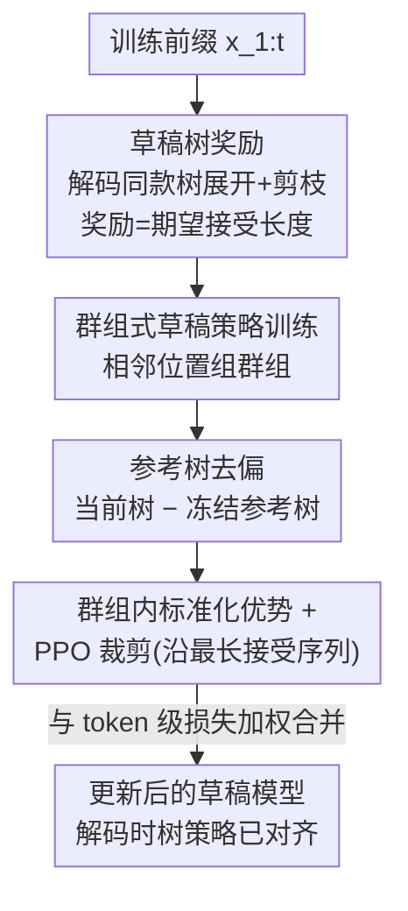

# Bridging Draft Policy Misalignment: Group Tree Optimization for Speculative Decoding

**会议**: ICLR2026  
**OpenReview**: [https://openreview.net/forum?id=dwPdYFqVWO](https://openreview.net/forum?id=dwPdYFqVWO)  
**代码**: https://github.com/hsj576/GTO  
**领域**: LLM效率 / 投机解码  
**关键词**: 投机解码, 草稿策略错配, 树形草稿, 群组优化, 接受长度

## 一句话总结
投机解码训练时只优化一条贪心草稿路径、解码时却用整棵草稿树做重排和验证，二者错配限制了加速；本文提出 Group Tree Optimization（GTO），用「草稿树奖励 + 群组式草稿策略训练」直接对齐解码时的树策略，在多个 LLM 上把接受长度平均提升 7.4%、相对 EAGLE-3 再提速 7.7%。

## 研究背景与动机
**领域现状**：投机解码（speculative decoding）是当下加速 LLM 推理的主流手段——用一个轻量级草稿模型一次提议多个 token，再让目标大模型并行验证，从而把"每步一个 token 的自回归"变成"每步接受多个 token"。近期工作（HASS、GRIFFIN、EAGLE-3）都在改进草稿模型的训练：让草稿模型的隐状态/token 更贴近目标模型。

**现有痛点**：这些方法有一个被忽视的根本问题——**草稿策略错配（draft policy misalignment）**。训练时，草稿模型被优化成"给定上下文，逐步选概率最高的 token，拼成一条贪心草稿序列"，本质是单路径序列预测；但**解码时实际用的是树形草稿（tree drafting）**：草稿模型展开一棵含多条分支的草稿树，按置信度重排（re-rank）后选 top-g，交给目标模型验证。训练优化的对象和解码真正使用的对象不是一回事。

**核心矛盾**：这种错配带来两类典型失败。其一是**贪心路径被剪枝**——由于解码时按整条路径置信度重排再做 top-g 选择，训练时的最优贪心路径可能因兄弟分支整体置信度更高而被剪掉（例如贪心序列 "It is a"（置信度 0.36）输给兄弟 "It has to"（0.38））。其二是**验证错配**——即便贪心路径活到了验证阶段，目标模型也可能接受另一条兄弟分支（例如接受 "It is the" 而非贪心的 "It is a"）。两种情况下，花在贪心路径上的训练努力都白费了。作者用 EAGLE-3 在 LLaMA-3.1-8B 上实测：草稿树构建时有 19–34% 的贪心路径被剪掉，最终接受路径与贪心路径只有 36–49% 重合；即便贪心路径被接受，平均也只有 3–4 个 token，远短于整棵树的 5–6 个。

**本文目标**：让草稿模型的训练目标直接对准"解码时整棵草稿树的表现"，而不是一条贪心路径。

**切入角度**：决定投机解码效率的唯一指标是**接受长度（acceptance length）**——目标模型接受的草稿序列越长，需要的验证步越少，加速越大。既然如此，训练就应该直接把"草稿树的期望接受长度"当作奖励来最大化，而不是去优化"下一个 token 预测对不对"这种代理目标。

**核心 idea**：用"草稿树的期望接受长度"作为训练奖励、用群组式 PPO 风格优化来稳定地最大化它，从而把训练目标和解码时的树策略对齐——这就是 Group Tree Optimization（GTO）。

## 方法详解

### 整体框架
GTO 是一个套在已有草稿模型之上的**训练框架**：它不改变解码流程，而是把草稿模型的训练目标从"token 级对齐"换成"树级对齐"。整体分两大块。第一块是**草稿树奖励（Draft Tree Reward）**：训练时就用解码时同款的树展开+剪枝策略（EAGLE-2 风格的多分支扩展、重排、选择）构造一棵草稿树，再定义一个**无需采样**的奖励——它等于这棵树在目标模型下的期望接受长度，直接度量解码性能。第二块是**群组式草稿策略训练（Group-based Draft Policy Training）**：因为这个奖励稀疏、与位置强相关且方差大，直接优化不稳定，GTO 借鉴 GRPO 的群组思想，对同一序列中相邻位置组成的"群组"分别构造草稿树，用"当前草稿模型 vs 冻结参考草稿模型"的对比做去偏，再在群组内标准化优势，最后沿"最长被接受序列"施加 PPO 风格的裁剪目标做稳健更新。两块合起来，把"解码忠实的树奖励"转化成"稳定可学的训练信号"。作者还证明了一个理论保证：提升草稿树奖励能可证地提升期望接受长度（因而提升加速比）。

### 关键设计

**1. 草稿树奖励：让训练目标等于"这棵树能被接受多长"**

针对"训练优化贪心路径、解码却看整棵树"的错配，GTO 把奖励直接定义在整棵草稿树上。给定前缀 $x_{1:t}$，先按解码策略 $G$ 构造一棵深度为 $d$ 的草稿树 $\mathcal{T}_t = G(M, x_{1:t})$：分两阶段生长——**逐层扩展**时对每个候选边算"全局接受分数"，在整层范围内选 top-k 扩展（让有前途的兄弟节点能击败局部贪心的选择，避免过早押注单条路径）；到最大深度后做**全局剪枝与重排**，按全局接受分数保留 top-g 个叶子。树里含 $N$ 条候选序列 $S_{t,i}$，每条序列的期望接受长度定义为各位置被目标模型接受概率的累加：$L_{t,i}=\sum_{j=1}^{l_i} P(\bar x_{t+j,i}\mid x_{1:t},\bar x_{t+1:t+j-1,i})$，其中接受概率是目标模型逐 token 概率的连乘。这个定义是**无采样的**（直接用概率算期望），却又直接挂钩解码性能。

整棵树的奖励再用 log-sum-exp（平滑 max）聚合各分支：$r_t=R(\mathcal{T}_t;\eta)=\frac{1}{\eta}\log\sum_{i=1}^{N}\exp(\eta L_{t,i})$。温度 $\eta>0$ 在"取最大分支"（$\eta\to\infty$）和"取平均"（$\eta\to 0$）之间插值，实验取 $\eta=1$。之所以不直接平均、也不直接取 max，是因为解码效用取决于"哪些分支能活过剪枝"——平滑 max 既可微，又把注意力聚焦到最强的几条分支上。作者进一步证明（Theorem 1）：对任意目标采样温度 $T\ge 0$，提升 $r_t$ 都能让期望接受长度 $\mathbb{E}[L^{\text{dec}}_T(\mathcal{T}_t)]$ 增大——这把"接受长度"坐实为连接训练与解码的桥梁。

**2. 群组式优势构造：用相邻前缀互相做参照，压住奖励方差**

直接优化树奖励很难，因为不同前缀的难度天然不同——以复杂数学表达式或罕见 token 结尾的前缀，无论草稿质量如何接受率都低，这种**系统性难度偏置**会污染学习信号，让模型回避难上下文而非改进它。GTO 的解法是把同一训练序列 $x_{1:s}$ 切成若干**不重叠、相邻索引**的群组 $G(k)=\{t_k,\dots,t_k+m-1\}$（群组大小 $m\in[4,8]$）。同群组内的前缀最多只差 $m-1$ 个尾部 token、共享很长的公共上下文，因此组内比较奖励相当于"在近乎相同的上下文下比草稿质量"，能有效降方差、改善 credit assignment。

去偏靠一个冻结的参考草稿模型 $M_0$：对每个位置同时构造当前树和参考树 $\bar{\mathcal{T}}_i=G(M_0,x_{1:i})$，用差值 $R_i=R(\mathcal{T}_i)-R(\bar{\mathcal{T}}_i)$ 抵消"这个前缀本身好不好续"的位置难度。再在群组内标准化成优势 $A_i=\frac{R_i-\text{mean}(\{R_j\})}{\text{std}(\{R_j\})+\delta}$。消融（Table 5）显示：去掉去偏后，梯度幅度方差过大导致训练不稳、解码性能变差。

**3. 沿最长接受序列的 PPO 裁剪更新：把树级奖励落到一条可优化的序列上**

有了优势还需要一个稳健的更新目标。GTO 取树 $\mathcal{T}_i$ 中**最长被接受的序列** $\hat S_i$（长度 $l_i$），在它上面定义当前模型与参考模型的逐 token 似然比（几何平均）$s_i=\exp\!\big(\frac{\log M(\hat S_i\mid x_{1:i})-\log M_0(\hat S_i\mid x_{1:i})}{\max(l_i,1)}\big)$，再优化 PPO 风格的裁剪代理目标 $L_{\text{GTO}}=-\frac{1}{m}\sum_{i\in G(k)}\min\big(s_i A_i,\ \text{clip}(s_i,1-\epsilon,1+\epsilon)A_i\big)$。把更新锚定在"最长接受序列"上，是因为它正是决定解码效率、最值得被强化的那条路径；裁剪则限制单步更新幅度、保证稳定。

**4. 两阶段训练与联合损失：复用现成草稿模型当 Phase I，再做群组优化**

GTO 采用类比 LLM"预训练+微调"的两阶段流程。**Phase I（草稿模型预热）**用 EAGLE-3 / GRIFFIN 那套 token 级目标训练出参考草稿模型 $M_0$，给后续群组更新提供稳定基线——若已有足够强的草稿模型（如训练好的 EAGLE-3/GRIFFIN/HASS），这一阶段可直接跳过、拿来当参考模型。**Phase II** 才是上面三个设计的群组式树奖励优化。最终训练目标把群组树目标和 token 级损失加权合并：$L=L_{\text{token}}+\omega\cdot L_{\text{GTO}}$，其中 $L_{\text{token}}$ 就是 EAGLE-3 里让草稿模型对齐目标模型的交叉熵损失。这样既保留了 token 级对齐的稳定性，又叠加了树级对齐带来的解码增益。

## 实验关键数据

### 主实验
在 LLaMA-3.1-8B、LLaMA-3.3-70B、Vicuna-1.3-13B、DeepSeek-R1-Distill-LLaMA-8B、Qwen3-8B 上，于 MT-Bench（对话）、HumanEval（代码）、GSM8K（数学）三个基准测速，对比 EAGLE/EAGLE-2/GRIFFIN/EAGLE-3 等。指标为加速比 SR 和接受长度 τ（均越大越好）。

| 模型 (T=0) | 方法 | 平均 SR↑ | 平均 τ↑ |
|--------|------|------|------|
| LLaMA-3.1-8B | EAGLE-3 | 3.46 | 6.07 |
| LLaMA-3.1-8B | **GTO** | **3.73** | **6.52** |
| Vicuna-1.3-13B | EAGLE-3 | 5.11 | 6.80 |
| Vicuna-1.3-13B | **GTO** | **5.61** | **7.29** |

总体上，GTO 相对此前 SOTA EAGLE-3 把接受长度平均提升 **7.4%**、带来额外 **7.7%** 的加速。增益在 T=0 和 T=1 两种采样温度下都成立。

### 消融实验

| 配置 | 影响 | 说明 |
|------|---------|------|
| 平滑 max 聚合 (η=1) | 最优 | 优于"全平均"或"取最大"（Table 3） |
| w/o 参考树去偏 | 训练不稳、解码变差 | 梯度幅度方差过大（Table 5） |
| 跳过 Phase I 预热 | 可行 | 直接拿 EAGLE-3/GRIFFIN 草稿模型当参考即可 |

### 关键发现
- **去偏是稳定性的关键**：参考树去偏 $R_i=R(\mathcal{T}_i)-R(\bar{\mathcal{T}}_i)$ 去掉后训练发散，说明位置难度偏置是树奖励优化的主要噪声源。
- **聚合方式有讲究**：log-sum-exp 平滑 max 优于硬平均/硬 max——既要可微，又要聚焦能活过剪枝的强分支。
- **错配确实存在且可量化**：实测 19–34% 贪心路径被剪、贪心路径只有 36–49% 与最终接受路径重合，直接佐证了动机。

## 亮点与洞察
- **把"训练目标错了"这件事说清楚并量化**：很多投机解码工作都在打磨草稿模型，却没意识到"训练优化单路径、解码用整棵树"这个结构性错配；本文用一组干净的统计（剪枝率、重合率、接受长度）把问题坐实，比单纯刷点更有说服力。
- **无采样的树奖励很巧**：期望接受长度直接用目标模型逐 token 概率连乘算出，避免了 RL 里昂贵又高方差的采样 rollout，同时还有理论保证它能提升真实解码效率。
- **群组用"相邻位置"而非"同状态多次采样"**：由于树展开在给定策略下是确定性的，传统从同一状态多次 rollout 的 RL 方差缩减失效；改用"相邻前缀共享长上下文"组群组做组内对比，是针对确定性 rollout 的聪明改造，这个思路可迁移到其他确定性生成的 RL 微调场景。
- **即插即用**：GTO 不改解码流程、可复用现成 EAGLE-3/GRIFFIN 草稿模型当 Phase I，落地成本低。

## 局限与展望
- 增益相对 EAGLE-3 约 7–8%，属于稳健但不颠覆性的提升；树奖励/群组优化引入了额外训练开销（构造当前树+参考树）。
- 群组大小 $m\in[4,8]$、温度 $\eta$、权重 $\omega$ 等超参的最优值可能依赖模型/任务，论文给的是经验设定。
- 期望接受长度的计算依赖目标模型逐 token 概率，对需要更复杂验证规则（如多样采样、长程依赖）的解码策略是否同样紧致，值得进一步验证。
- 训练时反复调用目标模型算接受概率，对超大目标模型（如 70B）的训练成本仍需关注。

## 相关工作与启发
- **vs EAGLE-3**：EAGLE-3 用训练时 rollout 来更像解码，但训练目标仍是 token 级单路径对齐；GTO 直接把整棵草稿树的期望接受长度当奖励，从根上对齐解码时的树策略，因此在同样草稿模型上还能再提速。
- **vs HASS / GRIFFIN**：它们分别解决隐状态不一致和 token 级错配，仍停留在"让单路径草稿更准"；GTO 指出真正该对齐的是"树策略"，并把它们训练好的草稿模型当作自己的参考/预热模型，属互补关系。
- **vs GRPO 等群组 RL**：GTO 借用群组优势估计的思想，但针对"草稿树生成在给定策略下确定性"这一特点，把群组从"同状态多 rollout"改造为"相邻前缀"，并加入参考树去偏，是对群组 RL 在确定性生成场景的定制。

## 评分
- 新颖性: ⭐⭐⭐⭐⭐ 首次把投机解码的训练-解码错配形式化为"草稿策略错配"并用树级奖励对齐，角度新
- 实验充分度: ⭐⭐⭐⭐ 覆盖 5 个 LLM、3 类任务、两种温度，消融到位；主要相对 EAGLE-3 比较
- 写作质量: ⭐⭐⭐⭐⭐ 动机用统计量化、方法层层递进、有理论保证，逻辑清晰
- 价值: ⭐⭐⭐⭐ 即插即用、复用现成草稿模型，对实际 LLM 推理加速有直接落地价值

<!-- RELATED:START -->

## 相关论文

- [\[ACL 2026\] Enhancing LLM-based Search Agents via Contribution Weighted Group Relative Policy Optimization](../../ACL2026/information_retrieval/enhancing_llm-based_search_agents_via_contribution_weighted_group_relative_polic.md)
- [\[ICML 2025\] RAPID: Long-Context Inference with Retrieval-Augmented Speculative Decoding](../../ICML2025/information_retrieval/rapid_long-context_inference_with_retrieval-augmented_speculative_decoding.md)
- [\[ICLR 2026\] Attribution-Guided Decoding](attribution-guided_decoding.md)
- [\[ICLR 2026\] CFT-RAG: An Entity Tree Based Retrieval Augmented Generation Algorithm With Cuckoo Filter](cft-rag_an_entity_tree_based_retrieval_augmented_generation_algorithm_with_cucko.md)
- [\[ACL 2026\] End-to-End Optimization of LLM-Driven Multi-Agent Search Systems via Heterogeneous-Group-Based Reinforcement Learning](../../ACL2026/information_retrieval/end-to-end_optimization_of_llm-driven_multi-agent_search_systems_via_heterogeneo.md)

<!-- RELATED:END -->
