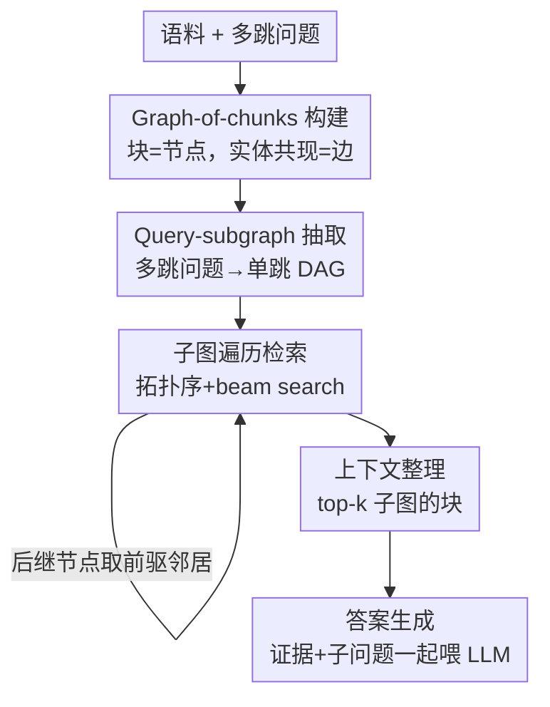

# BrowseNet: Graph-Based Associative Memory for Contextual Information Retrieval

**会议**: ICLR2026  
**OpenReview**: [https://openreview.net/forum?id=2q5CugVPoK](https://openreview.net/forum?id=2q5CugVPoK)  
**代码**: https://github.com/bisect-group/BrowseNet  
**领域**: 信息检索 / RAG / 多跳问答  
**关键词**: 关联记忆, graph-of-chunks, 多跳问答, 子图遍历, 检索增强生成

## 一句话总结
BrowseNet 把语料组织成"以命名实体为边、以文本块为节点"的 graph-of-chunks，再把多跳问题拆成有向无环的 query-subgraph，沿图做类 beam search 的子图遍历来检索证据，从而只用一次 LLM 调用就在 HotpotQA / 2WikiMQA / MuSiQue 三个多跳 QA 上取得 SOTA 的精确匹配与召回。

## 研究背景与动机
**领域现状**：检索增强生成（RAG）通过把"知识存储"和"模型推理"解耦，让 LLM 不必重训就能接入可更新的外部知识库。标准 RAG 三段式——索引（把文档切块编码进向量库）、检索（取相似块）、生成（拼进 prompt 让 LLM 作答）——已经是事实标准。

**现有痛点**：常规 RAG 只按"字面/语义相似度"取孤立的文本块，忽略了块与块之间的关联关系。对于多跳问答（MHQA）这类需要把分散在多篇文档里的线索串起来的问题，单纯取 top-k 相似块往往取不全证据链。为弥补这点，已有方法走两条路：一是 iterative prompting（思维链、ReAct 式多轮交互），但这会反复调用 LLM，推理延迟和成本陡增；二是图增强 RAG（GraphRAG、RAPTOR、LightRAG）在索引阶段用 LLM 构建/扩展知识图谱，但重度依赖 LLM 生成文本，既贵又会引入噪声。脑启发的 HippoRAG / HippoRAG-2 是当前 MHQA 的 SOTA，但它构图需要同时做命名实体识别（NER）**和**关系抽取（RE），pipeline 更重。

**核心矛盾**：检索质量（要捕捉跨文档的关联）和检索成本（少调 LLM、少引噪声）之间存在张力——想抓住关联就得建图、调 LLM，调得越多越贵越脏。

**本文目标**：在不靠反复 LLM 交互、不做昂贵关系抽取的前提下，把"块间关联"显式建模进检索过程，让多跳证据能被结构化地一次性捞出来。

**切入角度**：作者把人类的联想记忆类比成"内容可寻址记忆"——查询不该只看表面相似，而该顺着实体把相关上下文"联想"出来。于是把语料建成一张以实体共现为边的图，再把多跳问题本身也建成一张依赖图，让检索变成"在大图上按小图的结构去遍历"。

**核心 idea**：用 query-specific 的子图遍历替代 top-k 相似检索——构造 graph-of-chunks，把多跳问题拆成 DAG 形式的 query-subgraph，沿块图做带剪枝的子图搜索，只用一次 LLM 调用（查询分解）就完成多跳证据收集。

## 方法详解

### 整体框架
BrowseNet 的输入是一个文档语料和一条多跳问题，输出是该问题的答案及推理过程。整条流水线分三相：**离线索引**把语料构造成 graph-of-chunks（块图）；**在线检索**先把问题分解成 query-subgraph（问题依赖图），再沿块图做拓扑序的子图遍历取出证据；**生成**把证据连同分解出的子问题一起喂给 LLM 作答。

关键在于"两张图"的配合：块图刻画语料里"谁和谁相关"（结构信息），query-subgraph 刻画问题里"先答哪步、后答哪步"（推理依赖）。检索就是用问题图的结构去驱动在块图上的游走——初始节点先在全图里做语义召回，后继节点则只在前驱命中块的**邻居**里找，从而把"多跳"落实成"沿边走"。整个过程对每条多跳问题只调一次 LLM（用于查询分解），最好的配置下索引阶段完全不用 LLM。

### 关键设计

**1. Graph-of-chunks 构建：用实体共现把语料织成可遍历的关联图**

针对"常规 RAG 取孤立块、丢掉块间关系"的痛点，BrowseNet 把语料 $D$ 建成图 $G=(V,E)$：节点 $c\in V$ 是一个文档块（带唯一索引、原文+标题、以及语义向量 $M(c)$，用 NV-Embed-v2 编码）；边 $e_{ij}$ 当且仅当两块共享一个相同或同义的命名实体时存在，从而把"提到同一实体"的段落连起来。构图只需两步：先用 GLiNER（一个 BERT 系零样本 NER 模型）按一组通用标签（person / location / organization / date / work_of_art…）抽实体；再用 ColBERTv2 算实体两两相似度，余弦 $>0.9$ 视为同义（如"TV host"与"TV presenter"），把含等价实体的块连边（数字和日期因信息量低被排除）。

这一步的巧妙在于：相比 HippoRAG 要 NER **加** 关系抽取，BrowseNet 只要 NER，pipeline 更轻；而且最佳配置下构图完全不调生成式 LLM，既省钱又避免 LLM 生成文本带来的噪声。图的质量直接由"能否覆盖 gold 推理路径上的边"来评估，2WikiMQA 上边覆盖率接近 99.86%。

**2. Query-subgraph 抽取：把多跳问题建成有向无环的依赖图**

针对"多跳问题内部其实有先后依赖、但检索时被当成一句平铺的话"的痛点，作者把一条多跳问题 $Q_{orig}$ 分解成一串单跳子问题，每个子问题依赖前一个的答案，整体建成有向图 $Q=(V_q,E_q)$：节点是单跳子问题，有向边表示"后者要用到前者的中间答案"。这张图被强制为 DAG（可含多个连通分量），因为循环依赖意味着某子问题需要自己的答案作前提，会导致推理不终止；而标准 benchmark（HotpotQA / 2WikiMQA / MuSiQue）的金标准分解本身就是无环的。分解由 GPT-4o 一次性生成（消融里也试了 DeepSeek Reasoner、GPT-4o-mini、Claude-3.7）。作者还定义了 **isomorphic accuracy（同构准确率）** 来评估生成子图的质量——用 NetworkX 的 VF2 算法判定生成子图与金标准推理图是否同构（子图最多四节点，精确判同构在算力上可行）。

**3. 子图遍历检索：拓扑序 + 类 beam search 把多跳证据沿边捞出来**

这是方法的核心。拿到 query-subgraph 后，按连通分量分别处理，分量内对子问题做拓扑排序（初始节点=无入边，终端节点=无出边），然后对初始节点和后继节点用两套策略：

- **初始节点**：把块图里所有块当语料，取相似度最高的 top-k 块。相似度 $SS_{c_i}$ 取"块嵌入"分别与"原始多跳问题"和"对应单跳问题"的余弦相似度的**最大值**：

$$SS_{c_i}=\max\big(\cos(M(c_i),M(Q_{orig})),\ \cos(M(c_i),M(V_q^j))\big)$$

取 max 是为了抗查询分解的噪声——若单跳问题拆得准，块会更像它；若 LLM 把单跳问题拆坏了，原始多跳问题仍能兜底召回正确块。问题无法分解时，就退化成"在全语料上做一次语义检索"的单初始节点情形。

- **后继节点**：设某后继节点有 $p$ 个前驱，每个前驱已有 $k$ 个候选块。枚举"每个前驱各选一块"的所有组合（共 $k^p$ 种），每个组合的候选块定义为这些被选块在块图里的**邻居并集**——这正是"沿边走一跳"。再对每个组合内的邻居块打分（取它与当前单跳问题、与拼接了组合块的 modified query、与原始多跳问题三者余弦的最大值），各取 top-k，得到 $k^{(p+1)}$ 个子图。每个子图用按拓扑深度加权的平均分打分：

$$weight_{SG}=\sum_i \frac{SS_{c_i}}{depth_{c_i}}$$

其中 $depth_{c_i}$ 是该子问题到初始节点的最小深度。越靠前的节点权重越大，因为初始节点检索错会导致后面邻居全错、整条链崩掉。每步只保留 top-k 子图——这等价于在子图空间上做 beam search，把组合爆炸（理论 $k^{p+1}$，实际 $p\le 4$、$k=5$ 时上界 $5^5=3125$）剪到可行规模。最终把保留下来的 top-k 子图（$k$ 即超参 `n_subgraphs`）里的块作为上下文。

**4. 答案生成：证据 + 子问题一起喂，逼出可解释的中间推理**

把检索到的上下文连同**分解出的子问题**一起放进 prompt 喂给 LLM（默认 gpt-4o-mini），指令要求模型顺着子问题逐步推理、给出答案并附推理过程。把子问题塞进 prompt 的好处是让模型显式走中间步骤、减少歧义——消融显示这正是 EM/F1 提升的来源之一，同时让回答可解释、可追溯。

### 一个完整示例
以一条两跳问题为例：query-subgraph 含两个连通分量、四个单跳节点（$Q_1,Q_3$ 是初始节点，$Q_2,Q_4$ 是终端节点）。检索先对 $Q_1$、$Q_3$ 在全图做语义召回，各拿 $k$ 个候选块；轮到终端节点 $Q_2$（依赖 $Q_1$）时，不再全图搜，而是取 $Q_1$ 命中块在块图里的邻居作候选，按上面三向 max 相似度打分，结合 modified query 再选 top-k；两条分量各自走完后，按 $weight_{SG}$ 给所有子图打分，留下 top-`n_subgraphs` 个子图的块作为最终证据。这样"问题里的依赖结构"就被一比一映射成了"在块图上的游走路径"。

## 实验关键数据

### 主实验
在 HotpotQA、2WikiMQA、MuSiQue 三个多跳 QA 上各随机抽 1000 题，并把其他问题的所有段落作为干扰项加入语料（分别 9221 / 6119 / 11656 段），模拟真实大语料检索。所有 baseline 统一用 gpt-4o-mini 保证公平。

检索召回（R@2 / R@5，三库平均）：

| 检索器 | R@2 | R@5 |
|--------|------|------|
| BM25 | 46.50 | 58.43 |
| NV-Embed-v2 (7B) | 68.77 | 80.74 |
| HippoRAG | 57.44 | 73.11 |
| HippoRAG-2（前 SOTA） | 69.97 | 86.87 |
| **BrowseNet** | **71.91** | **87.87** |

答案生成（EM / F1，三库平均）：

| 方法 | EM | F1 |
|------|------|------|
| NV-Embed-v2 (7B) | 49.73 | 62.63 |
| GraphRAG | 41.37 | 56.87 |
| HippoRAG-2 | 51.60 | 65.30 |
| **BrowseNet** | **55.90** | **68.76** |

BrowseNet 在两个表上都拿到最优平均分，且相对次优方法的提升通过 paired bootstrap test 验证显著（$p<0.05$）。在最难的 MuSiQue（子图可达四跳）上优势尤其明显，因为它同时利用关键词链接和语义邻近，而纯语义的 NV-Embed-v2 只靠相似度。

### 消融实验

| 配置 | R@2(avg) | R@5(avg) | 说明 |
|------|---------|---------|------|
| BrowseNet（NV-Embed-v2） | 71.91 | 87.87 | 完整模型 |
| 同义阈值 0.8 / 0.7 | 71.79 / 71.85 | 87.71 / 87.72 | 几乎无变化，对阈值鲁棒 |
| 关键词模型换 GPT-4o | 71.72 | 87.61 | 对 NER 模型选择鲁棒 |
| 子问题分解器换 Claude-3.7 | 70.20 | 86.37 | 略降，对分解器较鲁棒 |
| 编码器换 GTE-Qwen2 (7B) | 65.78 | 81.90 | **大幅下降**，编码器最关键 |
| 编码器换 Granite-125M | 65.70 | 81.39 | 同上 |

### 关键发现
- **编码器选择是命门**：换掉 NV-Embed-v2 后 R@2 从 71.91 掉到 ~65.7，是所有消融里掉得最狠的；而同义阈值、NER 模型、子问题分解器、`n_subgraphs` 的改动都只带来零点几个点的波动。
- **图带来的增益是实打实的**：相比不用 graph-of-chunks 的 BrowseNet，Recall@5 提升约 5%，同时计算时间降到约 1/1.5。
- **成本优势巨大**：从索引到问答的全流程 LLM 成本，HippoRAG-2 是 BrowseNet 的 33 倍；BrowseNet 延迟仅比 HippoRAG-2 高约 0.49 秒，被召回提升完全覆盖。
- **图质量高**：块图在 2WikiMQA 上边覆盖率达 99.86%，MuSiQue 上 91.03%（MuSiQue 对同义阈值更敏感，阈值越小图越密、噪声边越多）。

## 亮点与洞察
- **"两张图对齐"的检索范式**：把语料和问题都建成图，让检索从"打分排序"变成"按问题图的结构在语料图上游走"，把多跳推理结构性地嵌进检索本身——这是比单纯加图索引更深的一层思路。
- **只用 NER、不做关系抽取**就逼近甚至超过需要 NER+RE 的 HippoRAG-2，说明"实体共现边"已经能撑起大部分关联结构，pipeline 因此显著变轻、变便宜。
- **三向 max 相似度抗噪**很巧：同时和原始多跳问题、单跳问题（、modified query）比，谁拆得好就靠谁，把 LLM 查询分解的不稳定性兜住了，这个 trick 可迁移到任何"先分解再检索"的系统。
- **子图 beam search** 把理论 $k^{p+1}$ 的组合爆炸剪到可行，且用拓扑深度加权强调早期节点，符合"早错全错"的多跳直觉。

## 局限与展望
- **强依赖编码器**：消融显示换弱编码器掉点严重，说明语义召回仍是性能地基，图结构是增益而非替代——在没有强 embedding 模型的场景可能退化明显。
- **依赖查询可分解为 DAG**：方法建立在"多跳问题能被干净拆成无环单跳链"的假设上，对分解失败或本身带循环/模糊依赖的问题，只能退化成全语料语义搜索。
- **边只靠实体共现**：用实体共现+同义判定建边，对"语义相关但不共享显式实体"的关联可能漏边；MuSiQue 上对同义阈值敏感也暗示构图鲁棒性还有空间。
- **延迟略高于 HippoRAG-2**：虽然只多约 0.49 秒，但子图组合枚举在更深的查询（$p>4$）上仍有放大风险。

## 相关工作与启发
- **vs HippoRAG-2**：两者都做脑启发的关联记忆检索且都是 MHQA SOTA 级；HippoRAG-2 需 NER+RE 构建 KG、LLM 成本是 BrowseNet 的 33 倍，BrowseNet 只用 NER+实体共现建块图、最佳配置索引零 LLM，召回与 EM/F1 反而更高，代价是延迟略增 ~0.49s。
- **vs GraphRAG / RAPTOR / LightRAG**：它们在索引阶段重度调 LLM 来构建/扩展知识图谱或层次摘要，既贵又引噪；BrowseNet 把 LLM 用量压到只剩"查询分解"一次调用，且把图用在"按问题结构遍历"而非"生成图谱"。
- **vs 纯 dense retriever（NV-Embed-v2）**：dense retriever 只靠语义相似度取孤立块，在 HotpotQA 这种弱多跳库上甚至 R@2 略胜；但在需要真正多跳串联的 MuSiQue / 2WikiMQA 上，BrowseNet 的"关键词链接 + 语义"混合策略明显更强。

## 评分
- 新颖性: ⭐⭐⭐⭐ "两张图对齐 + 子图 beam search"是对图增强 RAG 的实质性重构，但仍在 graph-RAG 大框架内。
- 实验充分度: ⭐⭐⭐⭐⭐ 三个标准多跳 QA、覆盖简单/dense/graph 三类十余个 baseline，含显著性检验、成本/延迟、多维消融。
- 写作质量: ⭐⭐⭐⭐ 方法逻辑清晰、图文配合好；个别公式与符号（如 $weight_{SG}$ 的下标）表述略紧需对照原文。
- 价值: ⭐⭐⭐⭐⭐ 在 SOTA 召回/EM 之外把 LLM 成本压到 1/33，对实际 RAG 系统落地极具吸引力，且代码与数据开源。

<!-- RELATED:START -->

## 相关论文

- [\[ICLR 2026\] AssoMem: Scalable Memory QA with Multi-Signal Associative Retrieval](assomem_scalable_memory_qa_with_multi-signal_associative_retrieval.md)
- [\[ICLR 2026\] MLP Memory: A Retriever-Pretrained Memory for Large Language Models](mlp_memory_a_retriever-pretrained_memory_for_large_language_models.md)
- [\[ICLR 2026\] Query-Aware Flow Diffusion for Graph-Based RAG with Retrieval Guarantees](query-aware_flow_diffusion_for_graph-based_rag_with_retrieval_guarantees.md)
- [\[ACL 2026\] Optimizing User Profiles via Contextual Bandits for Retrieval-Augmented LLM Personalization](../../ACL2026/information_retrieval/optimizing_user_profiles_via_contextual_bandits_for_retrieval-augmented_llm_pers.md)
- [\[ICLR 2026\] LinearRAG: Linear Graph Retrieval Augmented Generation on Large-scale Corpora](linearrag_linear_graph_retrieval_augmented_generation_on_large-scale_corpora.md)

<!-- RELATED:END -->
