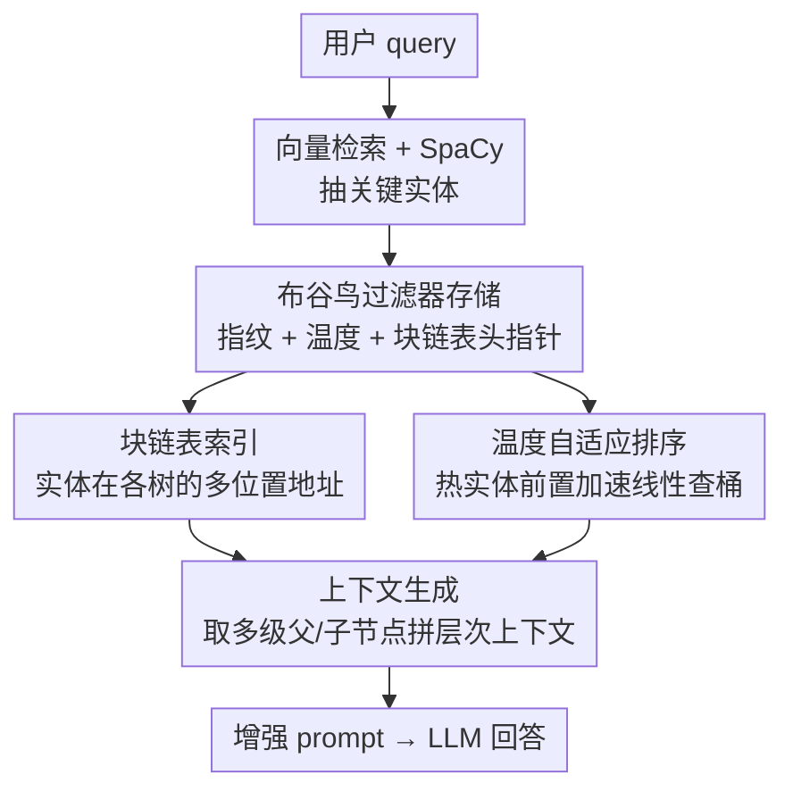

# CFT-RAG: An Entity Tree Based Retrieval Augmented Generation Algorithm With Cuckoo Filter

**会议**: ICLR2026  
**OpenReview**: [https://openreview.net/forum?id=4y25Ifytn8](https://openreview.net/forum?id=4y25Ifytn8)  
**代码**: https://github.com/TUPYP7180/CFT-RAG-2025  
**领域**: 信息检索 / RAG  
**关键词**: Tree-RAG、布谷鸟过滤器、实体树、检索加速、温度排序

## 一句话总结
CFT-RAG 把布谷鸟过滤器（Cuckoo Filter）塞进 Tree-RAG 的实体定位环节，用指纹 + 块链表 + 温度排序把"在森林里查实体"从 $O(n)$ 的广度优先搜索降到近似 $O(1)$，在 DART 上比朴素 Tree-RAG 检索快 800%+，且生成准确率不降反升。

## 研究背景与动机
**领域现状**：RAG（检索增强生成）通过外接知识库缓解大模型"知识固化"的问题，而 Tree-RAG（T-RAG）在普通 RAG 之上引入层次化实体树，把实体按"父子从属"组织成森林，检索时能顺着层级把一个实体的多级父节点、子节点一并取出，从而给生成模型更丰富、更有结构的上下文，回答的准确性和连贯性都更好。

**现有痛点**：Tree-RAG 的检索是性能瓶颈。论文实测（Table 1）显示检索时间占整个响应时间的 10%~72%，朴素 Tree-RAG 用广度优先搜索（BFS）在森林里逐个比对实体，随着数据集变大、树变深，定位一个实体所有出现位置的耗时急剧上升，可扩展性很差。

**核心矛盾**：Tree-RAG 要"结构丰富"就得维护庞大的实体森林，但森林越大、查实体越慢——结构表达力和检索效率之间存在直接冲突。BFS 这种线性遍历方式根本没有针对"成员查询"做任何优化。

**本文目标**：在不牺牲生成质量的前提下，把 Tree-RAG 的实体检索效率大幅拉高。具体拆成两个子问题：(1) 怎么把"查某实体在不在、在哪"做到接近常数时间；(2) 怎么在海量动态更新的实体上同时省内存、支持增删。

**切入角度**：作者注意到"实体定位"本质是一个**集合成员查询 + 多位置地址检索**问题，而布谷鸟过滤器（Cuckoo Filter）正是为快速成员查询设计的数据结构——它支持 $O(1)$ 查询、支持删除、用 12-bit 指纹存储省内存，比 Bloom Filter 更灵活。把它接到实体定位环节，正好对症。

**核心 idea**：用"改进版布谷鸟过滤器"替代 BFS 来定位实体——指纹做成员查询、块链表存实体在各棵树中的地址、温度变量按访问热度给桶内实体重排序，三招叠加把检索从遍历降为查表。

## 方法详解

### 整体框架
CFT-RAG 的输入是用户 query，输出是被增强上下文喂饱的 LLM 回答。整条流水线在朴素 Tree-RAG 之上只动了"实体定位"这一环：query 先做向量检索召回相关文档，再用 SpaCy 抽出关键实体；关键变化在于，系统不再在实体森林里 BFS 查每个实体，而是去一个**额外维护的布谷鸟过滤器**里查实体指纹，命中就顺着块链表拿到该实体在各棵树中的所有地址，进而取出多级父/子节点拼成层次上下文；最后把上下文 + 系统提示 + query 合成 prompt 交给 LLM 生成。

数据预处理阶段（建库时一次性完成）负责把原始数据变成实体森林：SpaCy 做实体识别，依存解析模型（GPT-4 + 开源 NLP 库）抽"从属/包含/依赖"类关系，再过滤掉传递关系、环、自环、重复边以保证是合法树结构。这部分是脚手架，真正的创新在过滤器侧。

### 关键设计

**1. 布谷鸟过滤器做实体定位：把 BFS 换成 $O(1)$ 查表**

朴素 Tree-RAG 用 BFS 在森林里找实体所有位置，时间随实体数线性增长，这是最大瓶颈。CFT-RAG 在实体树之外额外建一个布谷鸟过滤器，把每个实体以 12-bit **指纹**（fingerprint）形式存进固定大小的桶里，查询复杂度降到 $O(1)$。相比 Bloom Filter，布谷鸟过滤器既支持成员查询又支持删除，适合知识库频繁增删的动态场景；用指纹而非原文存储大幅省内存。当负载因子超过预设阈值时，过滤器按 2 的幂**翻倍扩容**并重哈希迁移，让负载率维持在"高但不过高"的区间（实验中 >70%），既省内存又把哈希冲突压到极低——实测在上千实体、1024 桶下查错的实体数仅 0~1 个，错误率近似为 0。

**2. 块链表存多位置地址：一个指纹串起实体在所有树中的落点**

同一个实体可能出现在森林的多棵树、多个位置，过滤器查到指纹只是"知道它存在"，还得拿到它的全部地址才能取层次上下文。作者让过滤器桶内每个条目存三样东西：实体指纹、温度变量、以及指向该实体**块链表**（block linked list）头节点的指针。块链表把该实体在不同树中各处节点的地址串起来——之所以用块链表而非普通链表，是因为它空间利用率高、支持较高效的随机访问、还能减少链表节点数，在时间和空间复杂度之间取得平衡，尤其利于大规模数据。查到指纹后顺着头指针遍历块链表，就能逐个访问该实体在各树中的节点，进而取出它的多级父节点 $H_{up}=\{h_1,\dots,h_n\}$ 和子节点 $H_{down}=\{h_1',\dots,h_n'\}$ 拼成上下文。

**3. 温度自适应排序：用访问热度把"热实体"挪到桶前端**

布谷鸟过滤器在桶内是**线性**查找指纹的，如果热门实体排在桶尾，每次都要扫到底。作者给每个块链表头节点挂一个**温度变量**（temperature）记录该实体被访问的频率：每次命中某实体，就把它的温度 +1；当某个桶空闲（本轮未被检索）时，按温度对桶内的指纹和块链表头指针重新排序，温度高的前置。这样后续 query 里的高频实体能更快被线性扫描命中，利用了用户提问中实体的局部性。这招的好处是**不占额外空间**（温度复用块链表头节点存储），却能在用户 query 含大量实体时显著缩短检索时间——消融实验（Figure 5）显示第一轮之后的检索时间明显短于第一轮，正是因为每轮按温度重排让热实体越查越快。

### 一个完整示例
设 query 命中实体 $x$。系统先算 $f(x)=\text{fingerprint}(x)$，到候选桶 $bucket[i_1]$、$bucket[i_2]$ 里线性比对：若命中，则该实体温度 +1，返回其块链表头指针 `head`；从 `head` 出发遍历块链表，对每个落点 `loc` 取出该位置在树中的前 $n$ 个向上父节点 $H_{up}$ 和向下子节点 $H_{down}$，逐对 $(h_i, h_i')$ 存进 context；遍历完所有块后，把这些层次关系与 query 融合成增强上下文。若所有桶都没命中指纹，则返回空指针。整个过程把"遍历森林找位置"换成了"查指纹 + 顺链表取地址"。

### 损失函数 / 训练策略
本方法是数据结构层面的检索加速，不涉及模型训练或损失函数。核心 RAG 架构用 Python 实现，布谷鸟过滤器等关键数据结构用 C++ 优化以提速。

## 实验关键数据

### 主实验
在 MedQA（大规模）、AESLC、DART（两个中等规模）三个数据集上各选 1000 个问题，用 LangSmith（打分模型换成豆包 Doubao）评准确率，每个算法跑 108 次取平均。硬件为 H100 + 22 核 CPU + 220 GiB 内存。

| 数据集 | 方法 | 检索时间(s) | 时间占比(%) | 准确率(%) |
|--------|------|------|----------|------|
| MedQA | Naive T-RAG | 19.45 | 58 | 65 ± 5 |
| MedQA | ANN T-RAG | 7.65 | 25 | 67 ± 4 |
| MedQA | ANN G-RAG | 8.78 | 26 | 61 ± 6 |
| MedQA | **CFT-RAG** | **5.24** | **16** | **69 ± 4** |
| AESLC | Naive T-RAG | 12.87 | 62 | 55 ± 5 |
| AESLC | ANN T-RAG | 2.52 | 13 | 56 ± 6 |
| AESLC | **CFT-RAG** | **0.97** | **5** | **57 ± 5** |
| DART | Naive T-RAG | 16.03 | 74 | 65 ± 5 |
| DART | ANN T-RAG | 3.28 | 15 | 66 ± 5 |
| DART | **CFT-RAG** | **1.81** | **9** | **68 ± 5** |

CFT-RAG 在三个数据集上检索时间都最低：DART 上从 16.03s 降到 1.81s，约为朴素 Tree-RAG 的 1/9（即快 800%+，与摘要一致）；同时准确率不降反升（MedQA 69 vs Naive 65）。即便对比已用 ANN 加速的 T-RAG / G-RAG，CFT-RAG 仍更快。作者还指出：当问题涉及多跳、对实体关系精度要求高时，CFT-RAG 优势更明显。

### 消融实验

| 配置 | 关键现象 | 说明 |
|------|---------|------|
| 含温度排序 | 第一轮后检索时间显著下降 | 每轮按访问热度重排，热实体前置 |
| 无温度排序 | 各轮检索时间无明显逐轮加速 | 桶内线性查找无法利用局部性 |

### 关键发现
- **温度排序是"免费午餐"**：不占额外空间（复用块链表头节点），却能在 query 含大量实体、多轮访问时持续加速；Figure 5 显示首轮之后耗时明显缩短。
- **错误率近似为 0**：负载因子 >70% 但未过高，加上 2 的幂翻倍扩容控制哈希冲突，上千实体 / 1024 桶下查错实体仅 0~1 个。
- **多跳复杂问题收益最大**：需要精确实体关系时，结构化定位 + 快速成员查询的组合优势最突出。

## 亮点与洞察
- **把经典数据结构精准嫁接到 RAG 痛点**：布谷鸟过滤器原本用于网络/数据流的成员查询，作者识别出 Tree-RAG 的"实体定位"本质就是成员查询 + 多地址检索，嫁接得很自然——这种"用对的数据结构换掉笨算法"的思路可复用到任何带结构化检索的 RAG。
- **三层叠加各司其职**：指纹解决"在不在"、块链表解决"在哪些位置"、温度排序解决"线性查桶的常数项"，把一个 $O(n)$ 问题逐层削成近似 $O(1)$，分工清晰。
- **温度排序借鉴缓存局部性**：把"热实体前置"这种 LRU/缓存思想用到过滤器桶内排序，零额外空间换持续加速，trick 很巧，可迁移到其他线性扫描的索引结构。

## 局限与展望
- **依赖实体森林构建质量**：整套加速建立在 SpaCy 实体识别 + 依存解析建树之上，若实体抽取或关系过滤出错，检索再快也是错的；论文对建树质量的鲁棒性着墨不多。
- **温度排序的收益场景有限**：只有在多轮查询、query 含大量重复热实体时才明显，单轮冷启动或实体分布均匀时增益有限（首轮即无加速）。
- **评测规模与指标偏单一**：准确率由 LangSmith + 豆包打分，未给人工评估或更多生成质量维度；数据集只三个，且主打"检索时间"，对端到端生成质量的提升论证较弱。
- **未与最新结构化 RAG 充分对比**：baseline 是 Naive/ANN 系，未对比 RAPTOR、GraphRAG 等更强的层次/图检索方法在同等设置下的速度-质量权衡。作者提出未来可扩展到不同知识结构与多模态任务。

## 相关工作与启发
- **vs 朴素 Tree-RAG（Fatehkia et al., 2024）**：T-RAG 用 BFS 遍历森林定位实体，$O(n)$ 且随树深/数据量恶化；CFT-RAG 用布谷鸟过滤器把定位降到 $O(1)$，是对同一框架检索环节的直接替换式加速。
- **vs ANN Tree-RAG / ANN Graph-RAG**：ANN（FAISS/HNSW）走近似最近邻加速召回，CFT-RAG 走精确成员查询 + 结构化地址检索，实验中后者更快且准确率持平或更高。
- **vs RAPTOR（Sarthi et al., 2024）**：RAPTOR 靠递归嵌入-聚类-摘要构建树、强在语义理解，但未针对检索效率优化；CFT-RAG 互补地专攻"查得快"。
- **vs Graph-RAG / EMG-RAG（Wang et al., 2024）**：图结构表达关系强但构建维护成本高、计算开销大；CFT-RAG 用树 + 过滤器在效率上更轻量。

## 评分
- 新颖性: ⭐⭐⭐⭐ 把布谷鸟过滤器 + 块链表 + 温度排序精准嫁接到 Tree-RAG 检索瓶颈，组合新颖务实
- 实验充分度: ⭐⭐⭐ 三数据集证明 800%+ 加速且准确率不降，但 baseline 偏弱、消融较单薄
- 写作质量: ⭐⭐⭐⭐ 动机-数据结构-算法链条清晰，图表和伪代码到位
- 价值: ⭐⭐⭐⭐ 检索效率是 RAG 落地的真实瓶颈，方法轻量易接入、工程价值明确

<!-- RELATED:START -->

## 相关论文

- [\[ICML 2026\] Hierarchical Abstract Tree for Cross-Document Retrieval-Augmented Generation](../../ICML2026/information_retrieval/hierarchical_abstract_tree_for_cross-document_retrieval-augmented_generation.md)
- [\[ACL 2026\] Retrieval-Augmented Tutoring for Algorithm Tracing and Problem-Solving in AI Education](../../ACL2026/information_retrieval/retrieval-augmented_tutoring_for_algorithm_tracing_and_problem-solving_in_ai_edu.md)
- [\[ICLR 2026\] Bridging Draft Policy Misalignment: Group Tree Optimization for Speculative Decoding](bridging_draft_policy_misalignment_group_tree_optimization_for_speculative_decod.md)
- [\[ACL 2026\] Disco-RAG: Discourse-Aware Retrieval-Augmented Generation](../../ACL2026/information_retrieval/disco-rag_discourse-aware_retrieval-augmented_generation.md)
- [\[ICLR 2026\] GRO-RAG: Gradient-aware Re-rank Optimization for Multi-source Retrieval-Augmented Generation](gro-rag_gradient-aware_re-rank_optimization_for_multi-source_retrieval-augmented.md)

<!-- RELATED:END -->
