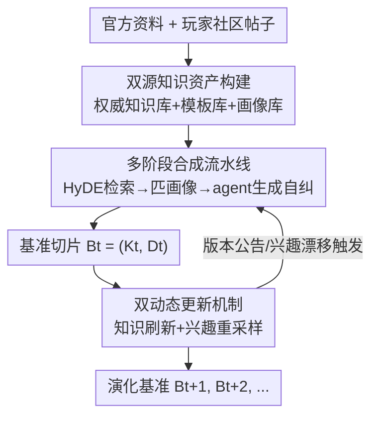

# ChronoPlay: A Framework for Modeling Dual Dynamics and Authenticity in Game RAG Benchmarks

**会议**: ICLR2026  
**OpenReview**: [https://openreview.net/forum?id=NLFxQedK9y](https://openreview.net/forum?id=NLFxQedK9y)
**代码**: https://github.com/hly1998/ChronoPlay  
**领域**: RAG评测 / 动态基准 / 游戏  
**关键词**: 游戏RAG、动态基准、知识演化、兴趣漂移、自动合成

## 一句话总结
ChronoPlay 是首个面向游戏领域的 RAG 评测基准生成框架：它用"双源合成引擎"（官方知识保证事实正确 + 玩家社区模板保证问题真实）自动造题，再用"双动态更新机制"（按版本更新刷新知识、按 JS 散度检测兴趣漂移重采样题目分布），让基准能随游戏版本和玩家关注点持续演化，从而暴露出静态基准测不出来的 RAG 系统性能波动。

## 研究背景与动机
**领域现状**：RAG（检索增强生成）的进步很大程度上靠基准推动，从 NQ、HotpotQA 这类静态问答基准，到 HOH、GrowOVER 这类按月快照演化的动态基准，评测方式一直在往"跟上真实世界信息时效"的方向走。在线游戏是 RAG 落地的一个高价值场景（智能助手、自动客服机器人），但目前**整个游戏领域没有任何 RAG 基准**，这一块应用处于无标准评测的状态。

**现有痛点**：游戏生态由两个不断演化的实体组成——游戏本身和玩家社区，作者把由此产生的核心挑战称为**双动态（Dual Dynamics）**。一方面是**知识演化（Knowledge Evolution）**：补丁和版本更新让游戏内容、规则频繁变动，静态基准很快过时（live-service 游戏尤其明显）；另一方面是**用户兴趣漂移（User Interest Drift）**：玩家关注点会系统性迁移，从新手入门问题逐渐转向后期内容和高阶攻略。现有动态基准（HOH、GrowOVER、EvolvingQA、REALTIMEQA 等）只盯着第一个维度——知识更新，完全忽略了兴趣漂移。

**核心矛盾**：双动态速度太快，人工维护一个长期保鲜的基准几乎不可能，加上游戏种类繁多，所以**自动合成是唯一可行路径**。但现有自动合成方法在追求知识时效时，丢掉了一个对用户中心领域致命的东西——**真实性（authenticity）**：一个塞满了"语法正确但没有真实玩家会问"的问题的基准，本质上是无效的。

**本文目标**：造一个能（1）持续自动更新、（2）同时追踪知识演化和兴趣漂移、（3）保证问题像真实玩家提问的游戏 RAG 基准。

**切入角度**：把"真实性"显式拆成两个可挖掘的资产——官方知识负责事实正确，玩家社区负责问题模板和提问偏好；把"动态"拆成两条独立的更新通路——实体级别的知识刷新 + 分布级别的兴趣重采样。

**核心 idea**：用"双源合成 + 双动态更新"把游戏 RAG 评测从静态快照变成一个能随游戏生命周期持续演化、且贴着真实玩家提问分布走的活基准。

## 方法详解

### 整体框架
ChronoPlay 要生成的不是一个固定数据集，而是一个**随时间演化的基准序列** $B = \{B_1, B_2, ..., B_t, ...\}$。每个时间切片 $B_t = (K_t, D_t)$ 由检索语料库 $K_t$ 和评测集 $D_t$ 组成；评测集里的每条样本是一个六元组 $d = (Q, A, C_{ref}, \theta, \tau, \sigma)$，分别是问题、答案、参考知识片段、问题主题、时间戳、涉及的游戏内实体。

整个框架由两大块咬合在一起：**双源数据合成流水线**负责"造出一批真实且事实正确的题"，**双动态更新机制**负责"让这批题随游戏和玩家一起演化"。合成阶段先把官方资料和社区资料分别加工成"权威知识库 + 问题模板库 + 用户画像库"三个资产，再由一个数据合成 agent 把它们串成带质量自检的题；更新阶段则用 NER 识别版本公告影响的实体来刷新过时题，用加权 JS 散度检测兴趣分布偏移来重采样题目主题分布。

### 关键设计

**1. 双源知识资产构建：把"事实正确"和"提问真实"拆给两个来源**

痛点在于：直接抓社区原始问题噪声太大、且无法保证答案正确；而只用官方知识又造不出像真实玩家口吻的问题。ChronoPlay 把这两件事彻底解耦成三个可复用资产。**权威知识库** $K_{auth}$ 来自游戏 wiki 和官方补丁说明，每个知识片段形式化为 $(k_c, k_\tau, k_\sigma)$（内容、时间戳、实体）；原始 HTML 和表格经 DOM 树分析 + LLM 格式化成统一可检索片段 $k_c$，官方数据精确抽取发布时间作为 $k_\tau$，再用基于 Self-ICL 的 NER 函数 $E(\cdot)$ 抽出实体 $k_\sigma = E(k_c)$——这些实体是后面做知识更新定位的关键。**问题模板库** $T_{comm}$ 和**用户画像库** $U_{comm}$ 则来自社区：专家先基于大量真实玩家问题搭一套层级主题分类 $\Theta$（6 大类 21 子类，覆盖技术问题到游戏内容到购买咨询），再让 LLM 从社区帖子里解耦出两类可复用元素——带主题 $\theta\in\Theta$ 的问题模板 $p$（构成 $(p,\theta)$ 对），以及用户画像 $u$。把模板和画像做成"游戏无关"的可复用件，是这个设计能跨不同游戏迁移、规模化的关键；两个库还都用向量去重 + 专家终审来控质量。

**2. 多阶段合成流水线：HyDE 检索 + 画像匹配 + agent 自纠生成一条龙**

光有资产还不够，得把它们有机地组合成一条具体的题。痛点是：怎么让"玩家口吻的模板"精准地落到"正确的知识片段"上，还要适配玩家的语境身份。流水线先把 $K_{auth}$ 的片段向量化建索引。借鉴 HyDE 的思路，从 $T_{comm}$ 采一个 $(p,\theta)$ 让 LLM 先生成一个**假设性问答对** $(Q_{hypo}, A_{hypo})$——内容是虚构的，但它的 embedding 比原始模板更能在 $K_{auth}$ 向量空间里定位到相关片段 $C_{ref}=\{k_1,...,k_n\}$。接着把用户画像库 $U_{comm}$ 也向量化，用这个假设对去查最匹配的画像，只有相似度超过阈值 $\lambda_p$ 的才作候选并取 top-1，否则这次生成就不带画像。最后由一个**数据合成 agent** 收尾：它先从预定义集合里采一个问题类型 $q_t$（抽取式、比较式等），再把模板对 $(p,\theta)$、检索片段 $C_{ref}$、画像 $u$、问题类型 $q_t$ 一起喂给生成器产出候选六元组；其中实体 $\sigma$ 和时间戳 $\tau$ 从 $C_{ref}$ 推出，$\tau = \max(\{k_\tau | k \in C_{ref}\})$（取最新时间戳，若都无时间戳则 $\tau$ 不定义）。agent 自带**质量控制自纠环**：每生成一条候选立刻用 LLM-as-Judge 多维度打分，不达阈值就丢弃，然后**换同一主题 $\theta$ 下的另一个模板重试**，直到产出合格题——而不是直接终止，保证每个主题都能稳定出题。

**3. 双动态更新机制：实体级刷知识 + 分布级追兴趣**

这是 ChronoPlay 让基准"活下去"的核心，对应两条互相独立的更新通路。**知识演化通路**响应离散事件（如官方公告 $A_{new}$）：监控模块检测到更新后，用 NER 函数 $E(\cdot)$ 识别受影响实体 $\sigma_{update}=E(A_{new})$，再圈出实体集与之相交的**过时子集**

$$D_{stale} = \{d \in D_t \mid \sigma(d) \cap \sigma_{update} \neq \emptyset\}$$

剩下的 $D_{valid} = D_t \setminus D_{stale}$ 保留，把过时题的主题重新丢回合成流水线生成 $D_{new}$，于是 $D_{t+1} = D_{valid} \cup D_{new}$、$K_{t+1} = K_t \cup A_{new}$。**兴趣漂移通路**则盯着分布：在大小为 $W$ 的滑动窗口里持续监控社区问题的主题分布，比较当前窗口分布 $P_c$ 和参考期分布 $P_r$，当二者之间的**主题加权 JS 散度**超过阈值 $\lambda_{JSD}$ 就判定发生集体兴趣漂移。这里把标准 JSD 改造了：以混合分布 $M=\frac{1}{2}(P_c+P_r)$ 为基础，给每个主题 $\theta$ 一个权重 $w_\theta = M(\theta)^\gamma / \sum_{\theta'\in\Theta} M(\theta')^\gamma$（$\gamma$ 是超参），让检测聚焦在显著趋势上、对低频主题噪声更鲁棒。检测到漂移就触发重采样：下采样兴趣减退的主题、为新兴主题合成新题，直到 $B_{t+1}$ 的主题分布对齐当前活跃玩家社区的 $P_c$。两条通路一个改"题的内容是否正确"、一个改"题的主题分布是否当下"，互不替代。

### 一个完整示例
以"屠龙之刃"这把武器为例走一遍。合成阶段：从模板库采到一个"在哪获取某物品"的模板 + GAME_MECHANICS 主题，LLM 先生成假设对（虚构地问剑在哪），用它的 embedding 在权威库里检到真实片段"屠龙之刃由最终 Boss 深渊骑士在沉没神庙必掉"；再匹配到"想速刷 BiS 装备的 DPS 玩家"画像，agent 综合生成真实口吻的问题"我看攻略说屠龙之刃是我 DPS build 的 BiS，最高效的刷取方式是什么？"，答案、实体 {屠龙之刃, 深渊骑士}、参考片段、时间戳一并产出，过质检通过。更新阶段：游戏出了公告"屠龙之刃不再 Boss 直掉，改为用 Boss 掉落的深渊碎片兑换"，NER 识别出实体"屠龙之刃"命中这条题，于是它进 $D_{stale}$ 被重新合成，新答案反映兑换机制——这条题就被知识演化通路无缝刷新了。

## 实验关键数据

实验在三款风格各异的游戏上实例化基准：Dying Light 2（DL2）、Dune: Awakening（Dune）、PUBG Mobile（PUBG），分别合成 2000 / 3000 / 1400 道题，按用户兴趣的显著迁移把时间线切成 5 / 6 / 7 个阶段。检索侧测了 BM25、BGE-M3、Qwen3-Embedding、text-embedding-3 四个检索器（Recall@K / F1@K / NDCG@K），生成侧测了 GPT-4o、Qwen3-14B、LLaMA-4、Gemini-2.5-Flash、Claude-3.5-Sonnet、DeepSeek-V3 六个生成器（LLM-as-Judge 评 correctness / faithfulness）。

### 主实验：检索器随阶段剧烈波动（K=3，Recall@3 节选）

| 游戏/阶段 | BM25 | Qwen3-Emb | BGE-M3 | text-emb-3 |
|-----------|------|-----------|--------|------------|
| DL2 Phase 3 | 0.403 | 0.338 | 0.367 | **0.551** |
| DL2 Phase 4 | 0.323 | 0.273 | 0.309 | **0.419** |
| Dune Phase 3 | 0.314 | 0.341 | 0.038 | **0.381** |
| PUBG Phase 1 | 0.415 | 0.515 | 0.482 | **0.528** |
| PUBG Phase 4 | 0.237 | 0.332 | 0.308 | **0.338** |

关键现象：① **没有任何检索器在所有阶段都最好**（text-emb-3 多数最佳，但 PUBG 某些阶段 Qwen3-Embedding 反超）；② 所有检索器性能**跨阶段大幅波动**——DL2 Phase 4 集体掉点，正是因为 GAMEPLAY_MECHANICS 类问题从 Phase 3 的 17.64% 飙到 31.25%，这类问题更复杂更难检；③ BGE-M3 在 Dune 上崩盘（Recall 低至 0.028），疑因 Dune 是 2025 年 6 月新游、专有名词多（如 terrarium of muad'dib），严重考验泛化。

### RQ2：拆解双动态的影响（PUBG，text-emb-3 + GPT-4o）

| 基准变体 | Correctness 波动性（标准差） |
|----------|------------------------------|
| Dual Dynamic（完整） | **0.0687** |
| Interest-Only | 0.0470 |
| Knowledge-Only | 0.0345 |

只追踪单一维度都会带来评测偏差：Knowledge-Only 漏掉了 Phase 4、Phase 7 的性能变化（这两阶段没有知识更新、纯兴趣驱动），Interest-Only 则漏掉知识更新引起的变化——证明必须同时追踪两者。

### 消融实验：合成模块对"真实性"的贡献（胜率 %，LLM 平均 / 人工）

| 配置 | LLM 平均胜率 | 人工评估胜率 |
|------|--------------|--------------|
| Full Pipeline | **33.3** | **32.7** |
| w/o Hypothesis Q&A | 24.8 | 28.0 |
| w/o User Persona | 22.0 | 22.0 |
| w/o Question Template | **19.9（最差）** | **17.3（最差）** |

评测用竞争式：LLM 评委（GPT-4o / Gemini-2.5-Pro / DeepSeek-R1）和人类专家从四种设置里选"最像真实玩家写的那一条"。

### 关键发现
- **Question Template 是真实性的命脉**：去掉它掉得最狠（胜率从 33.3% 跌到 19.9%），因为社区挖掘的模板是真实玩家措辞和意图的主要来源，没了它问题就变得通用、失去真实感。
- **检索好≠生成对**：PUBG Phase 3 检索略优于 Phase 1，但所有生成器的 correctness 反而显著更低——说明 Phase 3 的问题虽可用文档回答，却需要更复杂的推理。
- **更新机制高效且双因独立**：RQ4 显示多数阶段大部分题目是"继承"的（无需全量重构），且变化主因差异极大——PUBG Phase 3 更新主要由知识驱动（34.4%）、Phase 4 完全由兴趣驱动（48.2%），印证知识与兴趣是两股独立且都关键的力量。

## 亮点与洞察
- **把"动态"分层成两个正交维度**是这篇最 "啊哈" 的地方：以往动态基准只盯知识时效，ChronoPlay 指出"玩家关注什么"和"游戏更新了什么"是两件独立的事，必须分别建模——这个视角可直接迁移到电商、社交媒体等"知识库 + 活跃用户社区"双演化的领域。
- **用 HyDE 当"语义桥"造题**很巧妙：先让 LLM 生成虚构问答对，用它的 embedding 而非原始模板去检索，能更精准地把玩家口吻的模板落到正确知识片段上——把检索增强反向用在了"数据合成"上。
- **加权 JSD 检测兴趣漂移**是个可复用的轻量工具：用主题显著性 $M(\theta)^\gamma$ 加权，让漂移检测聚焦主流趋势、抗低频噪声，比裸 JSD 更适合做"是否该刷新基准"的触发器。
- **三资产解耦带来跨游戏可复用性**：模板和画像做成游戏无关件，换个游戏只需替换权威知识库，框架本身可平移——这是它敢号称"持续自动生成"的工程基础。

## 局限与展望
- **作者承认的方向**：当前画像库是静态的群体画像，未来想扩展成**个性化用户历史 + 动态用户状态模块**，支撑有状态（stateful）的 RAG 架构。
- **真实性评测依赖 LLM-as-Judge**：虽然有人类专家交叉验证，但"哪条更像真实玩家提问"本身主观性强，胜率差距（如 33% vs 28%）的统计显著性和评委偏好一致性值得更细的分析。
- **阶段划分依赖兴趣迁移的人工判定**：把时间线切成 phase 用的是"用户兴趣显著迁移"，这个切分标准本身带主观性，可能影响波动性结论的可比性。
- **只覆盖三款游戏**：虽风格各异，但都偏动作/竞技类，对策略、卡牌、MMO 等品类的泛化未验证；且评测主要在英文社区数据上。

## 相关工作与启发
- **vs 静态 QA 基准（NQ / HotpotQA / PopQA / CRAG）**：它们提供封闭静态知识世界里的检索+推理评测，但无法评估系统对真实世界持续演化知识的适应性；ChronoPlay 把评测本身变成随时间演化的序列。
- **vs 知识驱动的动态基准（HOH / GrowOVER / EvolvingQA / DynaQuest / DRAGON）**：这类按周期或事实触发更新，但**只追踪知识演化**、忽略用户兴趣漂移；ChronoPlay 的核心增量正是补上"兴趣漂移"这条独立通路，并显式引入"真实性"约束。
- **vs 低延迟事实驱动方法（REALTIMEQA / LIVEXIV）**：它们靠实时新闻/新预印本触发更新，追求时效但同样停留在单一知识维度，也不为用户中心场景保证提问真实性。

## 评分
- 新颖性: ⭐⭐⭐⭐⭐ 首个游戏 RAG 基准，且把"双动态 + 真实性"显式建模，视角新颖、可迁移性强
- 实验充分度: ⭐⭐⭐⭐ 三游戏 × 多阶段 × 4 检索器 6 生成器，RQ1-RQ4 拆解清晰；但游戏品类偏窄、真实性评测主观
- 写作质量: ⭐⭐⭐⭐⭐ 问题定义（双动态）清晰，框架图和公式到位，动机一路推导很顺
- 价值: ⭐⭐⭐⭐ 给游戏 RAG 落地提供首个标准评测，方法论可平移到电商/社媒等双演化领域

<!-- RELATED:START -->

## 相关论文

- [\[ACL 2026\] MTR-Suite: A Framework for Evaluating and Synthesizing Conversational Retrieval Benchmarks](../../ACL2026/information_retrieval/mtr-suite_a_framework_for_evaluating_and_synthesizing_conversational_retrieval_b.md)
- [\[ICLR 2026\] Revela: Dense Retriever Learning via Language Modeling](revela_dense_retriever_learning_via_language_modeling.md)
- [\[AAAI 2026\] Cog-RAG: Cognitive-Inspired Dual-Hypergraph with Theme Alignment Retrieval-Augmented Generation](../../AAAI2026/information_retrieval/cog-rag_cognitive-inspired_dual-hypergraph_with_theme_alignment_retrieval-augmen.md)
- [\[ICLR 2026\] Frustratingly Simple Retrieval Improves Challenging, Reasoning-Intensive Benchmarks](frustratingly_simple_retrieval_improves_challenging_reasoning-intensive_benchmar.md)
- [\[ACL 2026\] Domain-Specific Data Generation Framework for RAG Adaptation](../../ACL2026/information_retrieval/domain-specific_data_generation_framework_for_rag_adaptation.md)

<!-- RELATED:END -->
