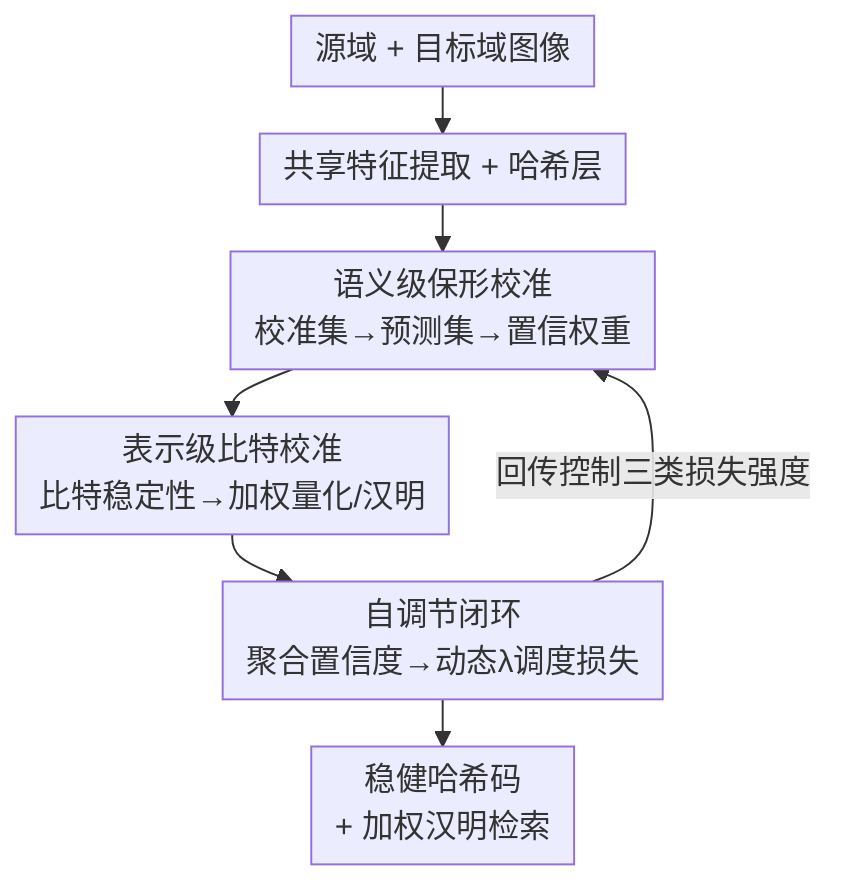

# Conformalized Hierarchical Calibration for Uncertainty-Aware Adaptive Hashing

**会议**: ICLR2026  
**OpenReview**: [https://openreview.net/forum?id=fBmRLVAw4T](https://openreview.net/forum?id=fBmRLVAw4T)  
**代码**: 待确认  
**领域**: 信息检索 / 跨域哈希  
**关键词**: 深度哈希, 无监督域自适应, 保形预测, 不确定性量化, 近似最近邻检索

## 一句话总结
针对无监督域自适应哈希（UDAH）里伪标签噪声和盲目域对齐两大顽疾，COLA 用一套"分层保形校准"框架——语义层用保形预测集的大小量化样本可靠度、表示层预测每个哈希比特的稳定性——把不确定性从启发式阈值升级成带统计保证的连续权重，并用一个自调节闭环让这些权重反过来动态调度多目标损失，在 Office-Home / Office-31 / Digits 上把跨域检索 mAP 平均刷到新 SOTA。

## 研究背景与动机
**领域现状**：深度哈希把浮点距离换成比特位运算，是大规模近似最近邻（ANN）检索的关键技术，被广泛用于推荐、视觉搜索、RAG 等场景。但真实部署一定会遇到域偏移（成像设备、风格、背景分布变化），训练好的哈希模型在目标域上会出现语义混淆和过自信。无监督域自适应哈希（UDAH）就是为弥合这个鸿沟而生——把有标签源域的知识迁移到无标签目标域，主流走两条路：**伪标签**（模型用自己的预测给目标数据造监督信号）和**域对齐**（用对抗或分布匹配缩小源/目标特征差异）。

**现有痛点**：这两条路的性能都被"对模型不确定性的不可靠、启发式处理"卡住。论文点出三个具体毛病：① 依赖 softmax 阈值这类简单启发式来筛伪标签，但 softmax 分数根本不是正确性的可靠指标，神经网络对分布外样本特别容易"自信地犯错"；② 缺乏对不确定性的可验证刻画，启发式方法没有理论保证、对人工阈值极度敏感；③ 把不确定性当成铁板一块，把"语义层的判断不确定性"和"比特层的表示稳定性不确定性"混为一谈，没有针对性策略。

**核心矛盾**：检索质量同时取决于"学什么"（伪标签是否可信）和"怎么编码"（哈希码是否稳健），而现有方法用一个粗糙的标量置信度去同时管这两件事，既不可靠也不分层。

**本文目标**：把 UDAH 从"脆弱的启发式置信度"升级为"带严格统计保证的多层不确定性量化框架"，并让量化出来的不确定性既能筛样本、又能调损失。

**切入角度**：作者引入保形预测（conformal prediction）这一**分布无关**框架——它能为任意新样本构造一个预测集，使真标签以至少 $1-\alpha$ 的概率落在集合里，而**预测集的大小天然就是一个有理论支撑的不确定性度量**。把这个思想从语义层延伸到比特层，就能分别校准"判断"和"表示"。

**核心 idea**：用"保形预测集大小 + 比特稳定性"两级校准取代单点伪标签和均匀域对齐，再用一个自调节闭环把这些不确定性当成内生控制信号去动态平衡多目标优化。

## 方法详解

### 整体框架
COLA（Conformal Hierarchical Calibration Adaptive Hashing）要解决的是"在域偏移下，既不被噪声伪标签带偏、又不让脆弱比特毁掉检索"。整条管线是：源域+目标域图像先过共享特征提取器拿到特征，进入**语义级保形校准**——挑选贴近目标域的源样本组成校准集，算出每个目标样本的保形预测集，集合越小说明越可靠，倒数即语义置信度，用它给伪标签学习和域对齐加权；接着进入**表示级比特校准**——一个轻量比特头预测每个哈希位的稳定性，比特置信度既加权量化损失、又在检索时构造"不确定性感知加权汉明距离"；最后由**自调节闭环**把整批的平均语义置信度和平均比特置信度聚合成控制信号，动态调节伪监督、对齐、量化三类损失的强度。三级协同，输出稳健哈希码并支持加权汉明检索。

### 关键设计

**1. 语义级保形校准：把单点伪标签换成带覆盖保证的预测集**

这一级针对的痛点是"softmax 阈值筛伪标签不可靠、对阈值敏感"。COLA 的做法是先**构造一个贴近目标域的校准集**：提取源域和目标域全部特征，算出目标域特征质心，再对每个源样本计算它到该质心的欧氏距离，取距离最小的 $r_{cal}\%$（默认 20%）源样本组成校准集 $D_{cal}$，其余源样本作训练集——这样校准就发生在"最像目标域"的源数据上，覆盖估计才靠谱。定义符合度分数 $s(x,y)=1-\hat p(y\mid x)$ 衡量样本与标签的兼容度，分数越低代表模型越自信。对任意目标样本 $x_t$，其预测集为

$$C(x_t) = \{y\in\mathcal{Y}\mid s(x_t,y)\le \hat q_W\},$$

其中 $\hat q_W$ 是把校准集分数升序排列后取第 $\lceil(n_{cal}+1)(1-\alpha_t)\rceil$ 个值得到的加权分位阈值。关键的工程巧思是 $\alpha_t$ **不是定值而是动态的**：训练早期模型弱，固定的严格 $\alpha$ 会产出空预测集；后期又太松识别不出不确定性。于是 COLA 让 $\alpha_t$ 随源域验证精度线性变化，并用 EMA 平滑防抖。预测集大小直接转成语义置信权重 $w^{sem}_t=1/|C(x_t)|$，再配一个只在集合内归一化的软标签 $\tilde y_t(c)=\dfrac{\hat p(c\mid x_t)\,\mathbb{I}\{c\in C(x_t)\}}{\sum_{j\in C(x_t)}\hat p(j\mid x_t)}$。两者合成"语义加权伪监督损失"，实现**样本间**（用 $w^{sem}_t$ 压住高不确定样本）与**样本内**（用软标签避免对模糊样本下绝对监督）的双重保护。

论文还给了理论背书（Theorem 3.1）：标准保形预测要求校准数据和测试数据可交换，而域偏移恰恰破坏了这一点。作者证明覆盖保证不会彻底失效，而是优雅退化——目标域覆盖率下界为 $1-\alpha_t-d_{TV}\big(s(X_{train},Y_{train}),s(X_{test},Y_{test})\big)$，误差项正是源/目标符合度分布的全变差距离。这反过来揭示了**域对齐的真正作用**：缩小特征分布差异 = 隐式缩小这个全变差误差项，让目标域的不确定性量化更准。基于此，置信度还被用来**引导域对齐**：先算目标批的平均语义置信度 $\bar w^{sem}_{B_t}$，把它当作对齐损失（MMD 形式）的权重——批整体置信度低就调低对齐强度、避免被边界模糊样本带偏，置信度高就加强对齐，从而优先对齐两域中语义清晰的核心流形。

**2. 表示级比特校准：预测每个哈希位的稳定性**

语义级管的是"学什么"，这一级管"怎么编码"——核心观察是一个不可靠比特翻转就能让汉明距离剧变、毁掉检索精度。COLA 设计了一个**自监督代理任务**来量化每位的可靠度：稳健的比特在输入轻微扰动下应保持符号稳定。具体地，对源域样本特征 $f_i$ 加高斯噪声得到 $f'_i$，两者过哈希层得到连续预哈希向量 $h_i,h'_i$，按位生成稳定性标签 $v_{i,k}=\mathbb{I}\{\text{sign}(h_{i,k})=\text{sign}(h'_{i,k})\}$。一个与主干并行的轻量比特头 $G_{bit}(\cdot)$ 直接从图像特征预测 $L$ 维比特置信向量 $w^{bit}\in[0,1]^L$，用二元交叉熵去拟合 $v$，置信度自然向 $\{0,1\}$ 两极分化、无需显式阈值。之所以用一个预测头而非推理时实时扰动，是为了保住哈希 $O(1)$ 单次前向的速度优势（实时扰动要多次前向、严重增延迟）。

比特置信度在训练和检索两端都发力。训练时构造**加权量化损失**：传统量化项 $\|h-\text{sign}(h)\|$ 对所有偏离 $\pm1$ 的比特一视同仁，COLA 改成 $L_{quant}=\frac{1}{|B|L}\sum_x\sum_k \text{stop\_grad}(w^{bit}_{x,k})\cdot\max(0,1-|h_{x,k}|)$——对可信比特施加更强约束，对不稳定比特放宽容忍、允许它们在连续空间充分探索；`stop_grad` 防止模型靠操纵 $w^{bit}$ 来逃避量化。检索时构造**不确定性感知加权汉明距离（UWHD）**：用查询样本自己的比特置信度 $w^{bit}_q$ 当权重，$d_{UWHD}(x_q,x_d)=\sum_k w_{q,k}\cdot\frac12(1-b_{q,k}b_{d,k})$，让查询自身不确定的比特位贡献更低，天然抑制不可靠翻转的噪声。为了大规模检索效率，可把 $w_{q,k}$ 四舍五入二值化成 $\{0,1\}$，UWHD 退化成掩码汉明距离、仍可用比特运算高效计算。

**3. 自调节闭环：让不确定性反过来调度多目标优化**

多目标优化里手工平衡各损失权重一直是老大难。COLA 把前两级量化出的实时不确定性当成内生控制信号，组成闭环。每个批次聚合平均语义置信度 $\bar w^{sem}_{B_t}$ 和平均比特置信度 $\bar w^{bit}_{B_t}$，经线性缩放函数得到动态权重 $\lambda_{target}(B_t)=f_{sem}(\text{stop\_grad}(\bar w^{sem}_{B_t}))$、$\lambda_{quant}(B_t)=f_{quant}(\text{stop\_grad}(\bar w^{bit}_{B_t}))$（同样 `stop_grad` 保证训练稳定）。逻辑很自然：训练早期不确定性高 → $\lambda_{target}$、$\lambda_{align}$ 小 → 模型谨慎对待伪标签和对齐、不在没看懂目标域前激进自适应，相当于一个**自动 warm-up**；随着学习推进不确定性下降、目标自适应逐步接入。整个适应过程由模型自身的"认知状态"掌舵，显著降低了超参敏感度。

### 损失函数 / 训练策略
总目标把所有模块经自调节机制动态融合：

$$L_{total} = L_{source} + L_{bit\_head} + \lambda_{target}L_{target} + \lambda_{align}L_{align} + \lambda_{quant}L_{quant}.$$

其中 $L_{source}$ 是源域有监督损失，$L_{bit\_head}$ 训练比特置信头，$L_{target}/L_{align}/L_{quant}$ 分别是语义加权伪监督、置信引导域对齐、加权量化，三者权重由闭环动态调度。校准阶段只需一次排序加权分位估计，复杂度 $O(n_{cal}\log n_{cal})$，可用分位草图算法近似到线性。

## 实验关键数据

### 主实验
在 Office-Home / Office-31 跨域检索（mAP%）上，COLA 全面超越 13 个无监督/域自适应哈希基线（节选对比）：

| 数据集/任务 | 指标 | COLA | COUPLE(次优) | IDEA |
|------|------|------|------|------|
| Office-Home Pr→Re | mAP% | **67.04** | 63.94 | 59.18 |
| Office-Home Ar→Re | mAP% | **57.35** | 54.14 | 51.19 |
| Office-31 We→Ds | mAP% | **87.28** | 85.26 | 84.97 |
| 12 任务平均 | mAP% | **62.59** | 60.29 | 57.03 |

在 Digits（MNIST↔USPS，16~128 比特）上平均 mAP 也从 COUPLE 的 68.53 提升到 **70.40**，且在长比特位（96/128）增益更明显。

### 消融实验
Table 3（Office-Home，64 比特，平均 mAP%）。SC=语义级校准，RC=比特级校准，SR=自调节：

| 配置 | SC | RC | SR | 平均 mAP% | 说明 |
|------|----|----|----|------|------|
| COLA(None) | | | | 49.14 | 裸 backbone |
| COLA-SC | ✓ | | | 49.43 | 仅语义校准 |
| COLA-RC | | ✓ | | 51.76 | 仅比特校准 |
| COLA-SR | | | ✓ | 51.55 | 仅自调节 |
| w/o SC | | ✓ | ✓ | 54.53 | 去语义校准 |
| w/o RC | ✓ | | ✓ | 55.21 | 去比特校准 |
| w/o SR | ✓ | ✓ | | 54.74 | 去自调节 |
| COLA(Full) | ✓ | ✓ | ✓ | **57.31** | 完整模型 |

### 关键发现
- 三个模块单独加都有正收益，**比特级校准（RC，+2.62）和自调节（SR，+2.41）单独贡献比语义校准（SC，+0.29）大**——说明在哈希检索里，"表示稳定性"和"动态损失调度"比单纯改伪标签更解渴。
- 但 SC 不是没用：去掉 SC（w/o SC，54.53）比去掉 RC（w/o RC，55.21）掉得更多，且只有三者齐备才到 57.31，验证三级是**协同**而非可替代关系。
- 校准集比例 $r_{cal}$ 取 20% 较优；动态 $\alpha_t$ 随训练自适应演化（论文图 3/图 4 展示了 $\alpha$ 和平均比特置信度的训练曲线），印证了"固定阈值会失配"的动机。

## 亮点与洞察
- **把"预测集大小"当不确定性度量**：相比 softmax 标量，预测集大小是带 $1-\alpha$ 覆盖保证的、分布无关的可靠度信号，且无需采样——这是把保形预测引入 UDAH 的核心巧思，可迁移到任何需要筛伪标签的半监督/域自适应任务。
- **理论把"域对齐"重新解释为"缩小覆盖误差项"**：Theorem 3.1 不只是凑理论，它把域对齐从"启发式拉近特征"升格为"主动压低保形覆盖的全变差误差"，让对齐和不确定性量化在同一个数学框架里互相支撑——这种"用理论反推模块为什么该存在"的写法很有说服力。
- **比特级稳定性代理任务**：用"加噪后符号是否翻转"造自监督标签训练一个轻量比特头，单次前向预测每位可靠度，既不牺牲哈希速度又能在检索端构造加权汉明距离——把"不确定性感知"贯穿训练到检索全生命周期，这个思路对任何二值/离散编码检索都有借鉴价值。
- **自调节闭环天然实现 warm-up**：用模型自身置信度当损失调度信号，早期高不确定→低权重，自动避免过拟合噪声伪标签，省掉了手调 loss 权重和 warm-up schedule。

## 局限与展望
- 理论覆盖保证的紧致度依赖全变差误差项 $d_{TV}$，**域偏移极大时该误差项会很大、覆盖下界变松**，论文只论证了"优雅退化"但未给出极端偏移下的实测崩溃边界。
- 比特稳定性代理任务用高斯噪声扰动特征来定义"稳定"，这个扰动假设是否能代表真实域偏移下的比特翻转模式，缺乏更细致的验证；不同扰动强度对 $w^{bit}$ 的影响也未充分扫描。
- 校准集靠"到目标域质心的欧氏距离"挑选源样本，依赖特征空间的几何假设，**当源/目标在特征空间高度纠缠时这种挑选可能失效**；$r_{cal}$、动态 $\alpha$ 的线性调度等仍有若干需调的设计选择。
- 实验集中在经典中小规模跨域检索基准（Office-Home/31、Digits），缺少十亿级真实检索系统上的延迟/吞吐与 UWHD 二值化后精度损失的工程评测。

## 相关工作与启发
- **vs 启发式置信度筛选（如 FixMatch 式 softmax 阈值）**：它们用单点 softmax 分数+人工阈值筛伪标签，对阈值敏感且无理论保证；COLA 用预测集大小作连续可靠度、带覆盖保证，且阈值 $\alpha_t$ 自适应。
- **vs 传统 UDAH（PEACE/DANCE/IDEA/COUPLE 等域对齐+自学习方法）**：它们均匀对齐、把不确定性当铁板一块；COLA 分层校准（语义+比特）并用置信度加权对齐，理论上把对齐重释为压低覆盖误差，平均 mAP 比次优 COUPLE 高 2.3 个点。
- **vs 检索中的不确定性建模（贝叶斯度量学习、生成式哈希不确定性估计）**：这些是基于模型/采样的方法，需多次前向；COLA 用分布无关的保形预测，无需昂贵采样即给出覆盖保证，并在语义+表示两级分层校准。

## 评分
- 新颖性: ⭐⭐⭐⭐⭐ 首个把保形预测分层（语义+比特）引入域自适应哈希，并用理论把域对齐与覆盖保证统一起来。
- 实验充分度: ⭐⭐⭐⭐ 三大基准、13 个基线、完整三模块消融，但缺大规模工程与极端偏移的压力测试。
- 写作质量: ⭐⭐⭐⭐⭐ 动机—理论—模块—实验逻辑闭环，Take Away 与图示清晰。
- 价值: ⭐⭐⭐⭐ 为"带统计保证的不确定性量化"在检索/哈希落地提供了可复用范式，思路可迁移到更广的半监督/域自适应场景。

<!-- RELATED:START -->

## 相关论文

- [\[NeurIPS 2025\] AcuRank: Uncertainty-Aware Adaptive Computation for Listwise Reranking](../../NeurIPS2025/information_retrieval/acurank_uncertainty-aware_adaptive_computation_for_listwise_reranking.md)
- [\[ICLR 2026\] Hierarchical Encoding Tree with Modality Mixup for Cross-modal Hashing](hierarchical_encoding_tree_with_modality_mixup_for_cross-modal_hashing.md)
- [\[ICLR 2026\] Query-Level Uncertainty in Large Language Models](query-level_uncertainty_in_large_language_models.md)
- [\[ICLR 2026\] Hierarchical Concept-based Interpretable Models](hierarchical_concept-based_interpretable_models.md)
- [\[ICLR 2026\] Deep Global-sense Hard-negative Discriminative Generation Hashing for Cross-modal Retrieval](deep_global-sense_hard-negative_discriminative_generation_hashing_for_cross-moda.md)

<!-- RELATED:END -->
