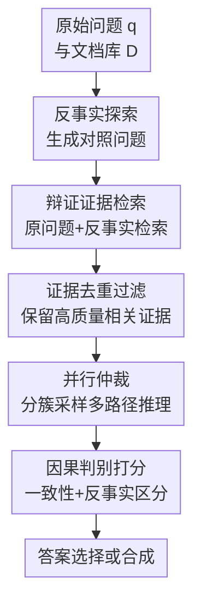

# Counterfactual Reasoning for Retrieval-Augmented Generation

**会议**: ICLR2026  
**OpenReview**: [https://openreview.net/forum?id=9U51rOnGko](https://openreview.net/forum?id=9U51rOnGko)  
**代码**: https://github.com/CF-RAG/CF-RAG  
**领域**: 信息检索 / RAG  
**关键词**: 反事实推理, 检索增强生成, 证据仲裁, 相关性陷阱, 鲁棒问答  

## 一句话总结
CF-RAG 把反事实查询生成、辩证式证据检索和并行证据仲裁嵌入 RAG 推理过程，用“证据是否只支持原问题而不支持相近反事实问题”来区分真正决定答案的证据和只是高度相关的干扰证据，从而显著提升 RAG 在多跳问答、长尾实体和噪声检索场景下的鲁棒性。

## 研究背景与动机
**领域现状**：RAG 的基本范式是先根据用户问题检索一批语义相关文档，再把这些文档交给 LLM 生成答案。这个范式已经成为开放域问答、事实核查和知识密集型对话系统里的常用基础设施，后续工作也围绕“何时检索、检索什么、如何压缩或过滤上下文、如何自我反思”做了大量改进。

**现有痛点**：作者指出，很多 RAG 系统虽然能找到相关文档，却不擅长判断哪些证据真正决定答案。论文把这种失败称为 Correlation Trap：模型会被大量“看起来很相关”的证据淹没，而忽略少量但更有判别力的证据。比如问《The Dark Knight》的 lead actor 时，检索结果里可能有大量赞美 Heath Ledger 小丑表演的影评；这些文档和电影高度相关，也频繁提到“star”“performance”等词，但它们并不能回答“谁是主角/主演”这个关系问题。标准 RAG 很容易把强相关信号当成答案支持，最后答成 Heath Ledger，而不是 Christian Bale。

**核心矛盾**：问题不只是检索噪声多，而是“相关性”和“因果判别性”被混在了一起。传统检索分数倾向于奖励同主题、同实体、同关键词的文档；可是正确答案常常依赖一个更细的概念边界，例如主角 vs 反派、导演 vs 演员、当前年份 vs 过去年份。若系统只问“这段证据和原问题像不像”，它无法判断证据是否也同样支持一个相近但答案不同的问题。

**本文目标**：论文希望让 RAG 在推理时显式做反事实检验：先构造与原问题同主题但答案应不同的反事实问题，再检查候选证据是否能把原问题和这些反事实问题区分开。这样系统不仅要找到支持答案的文本，还要验证这些文本是否“只支持这个答案”，而不是泛泛支持一组相关但不同的问题。

**切入角度**：作者没有走形式化因果图或因果效应估计路线，而是把“反事实”理解为一种证据判别测试。若一段证据真正决定了答案，它应该对原问题有高支持度，对反事实问题有低支持度；若一段证据只是主题相关，它往往会同时支持原问题和反事实问题。这个判别信号可以直接接到 RAG 的检索、采样、生成和重排序流程中。

**核心 idea**：用反事实查询把检索空间改造成“原问题证据 + 对照问题证据”的辩证证据空间，再用并行仲裁选择既与证据一致、又能通过反事实判别的答案。

## 方法详解

### 整体框架
CF-RAG 的输入是原始问题 $q$ 和文档库 $D$，输出是最终答案及其理由。整体流程分两大阶段：Counterfactual Exploration 负责从原问题生成多个相近但答案不同的反事实问题，并对原问题与反事实问题一起检索，构造能暴露冲突的证据空间；Parallel Arbitration 负责把过滤后的证据分成多个主题簇，采样出多条并行推理路径，分别生成候选答案，再用内部一致性和因果判别性联合打分。

这篇论文的方法更像一个推理时框架，而不是训练一个新模型。默认设置中，系统生成 $N=3$ 个反事实查询，把证据聚成 $K=4$ 个主题簇，生成 $M=3$ 个并行草稿，并用 $\lambda=0.4$ 平衡普通证据一致性和反事实因果判别分数。最后，如果多条候选答案高度一致，就直接选择最高分答案；如果候选之间冲突较大，则综合 top-3 候选做答案合成。

### 关键设计
**1. 反事实探索：用相近但答案不同的问题暴露伪相关证据**

标准 RAG 只围绕原问题 $q$ 检索，这会形成一个单向的“相关性回音室”：只要文档和主题高度相关，它就可能被当成有用证据。CF-RAG 先生成一组反事实问题 $Q_{cf}$，每个问题都和原问题保持主题一致，但在角色、时间、实体、类别或范围上做受控改变。例如“Who is the lead actor in The Dark Knight?” 可以变成“Who played the main villain in The Dark Knight?”、“Who directed The Dark Knight?” 或 “Who is the lead actor in Batman Begins?”。这些问题不是随机改写，而是专门用来检查某段证据到底支持哪个关系。

论文把这个过程形式化为语义变换函数 $\tau_i: Q \rightarrow Q$。候选反事实问题需要通过验证函数 $V(q,q')$：一方面 $sim_{sem}(q,q') > \theta_{sim}$，保证它仍然和原问题在同一主题附近；另一方面 $L(q) \neq L(q')$，保证它追问的是不同答案。作者还设计了信息量分数 $Info(q,q') = \alpha Div_{sem}(q,q') + \beta Div_{ans}(q,q') + \gamma Rel_{dom}(q,q')$，优先选择既有语义差异、答案空间又不同、同时仍属于同一领域的反事实查询。这样构造出来的反事实问题能成为“压力测试”：真正回答 lead actor 的证据应当支持原问题，而不是同样支持 villain 或 director 问题。

**2. 辩证证据检索：把检索结果从相关文档集合改成对照证据空间**

有了反事实问题后，CF-RAG 不再只检索 $R(q,D)$，而是检索 $R(q,D) \cup \bigcup_{q' \in Q_{cf}} R(q',D)$。这一步的目的不是把更多文档简单堆给模型，而是主动引入可能互相冲突的视角。若某些 Heath Ledger 影评既被原问题检出，也被“谁演反派”这类反事实问题检出，它们就会在后续判别中显示出低区分度；相反，明确说 Christian Bale 扮演 Bruce Wayne/Batman 主角的文档会更集中地支持原问题。

为了避免证据空间膨胀，论文先用 embedding 相似度去掉近重复文档，即当 $sim_{emb}(e,e') > \theta_{dedup}$ 时只保留代表性证据；再根据文本质量 $Q(e)$ 和最大相关性 $\max_{q' \in \{q\} \cup Q_{cf}} s(q',e)$ 做过滤。这个过滤顺序很关键：CF-RAG 不要求每段证据都只支持原问题，因为反事实证据本来就应该进入系统；它要求进入系统的证据足够清晰、可靠，并且至少和原问题或某个反事实问题相关。真正的“是否支持原问题”留到后面的因果判别分数里解决。

**3. 并行仲裁：让冲突证据分路推理，避免强相关信号互相污染**

如果把所有证据一次性塞进 LLM，强势但错误的相关证据可能压过少量关键证据；如果完全分开处理，又会失去比较上下文。CF-RAG 的折中做法是先对过滤后的证据做主题聚类，再从各簇进行分层采样，构造多条并行证据子集 $E_j$。论文使用谱聚类：根据文档 embedding 构造 affinity matrix $W_{ij}=\exp(-\|e_i-e_j\|^2 / 2\sigma^2)$，再从归一化 Laplacian 的前 $M$ 个特征向量中做 K-means 聚类。

每条推理路径都从不同主题簇采样一部分证据，生成一个候选答案和理由 $(a_j,r_j)=H(q,E_j)$。采样不是简单均匀抽取，而是用带温度的随机权重 $w_{jm}$ 控制每个簇在不同路径中的占比，让多条路径既覆盖所有主题，又能保留差异。这样 Heath Ledger 影评、Christian Bale 角色说明、导演访谈和完整 cast list 可能分别以不同组合进入候选路径，系统可以观察不同证据视角会导向哪些答案。

**4. 因果判别打分：奖励“只支持原问题”的证据，而不是奖励证据数量**

CF-RAG 的仲裁分数不只看候选答案和证据是否语义一致。内部一致性分数 $\phi_{coh}$ 衡量答案 $a_j$ 是否和证据 $E_j$ 对得上，包括答案与文档 embedding 的相似度、查询相关性以及答案是否在文档中显式出现。但论文认为这还不够，因为错误答案也可能有大量一致证据。例如 Heath Ledger 的影评确实高度一致地支持“他表演很突出”，只是这不等于“他是 lead actor”。

关键是因果判别分数 $\phi_{causal}$：

$$
\phi_{causal}(E_j,q,Q_{cf}) = \frac{1}{|E_j|}\sum_{e\in E_j}\left[s(q,e)-\max_{q'\in Q_{cf}}s(q',e)\right]
$$

这个分数问的是：证据对原问题的支持度，是否显著高于它对最强反事实问题的支持度。若一段证据同样支持“谁演反派”，它对 lead actor 问题的因果判别贡献就低；若它明确把 Christian Bale 和 Batman 主角身份绑定起来，同时不支持导演或反派问题，它就有高贡献。最终基础仲裁分数是 $\Psi_j=(1-\lambda)\phi_{coh}+\lambda\phi_{causal}$，扩展版还加入生成置信度和答案 specificity。这个设计让系统不会因为某类干扰证据数量更多就被拖走，论文的理论分析也围绕“判别分数对伪相关证据数量缩放不敏感”展开。

### 一个完整示例
以论文反复使用的例子为例，用户问：“Who is the lead actor in The Dark Knight?” 标准 RAG 可能检索到 5 段文档，其中 4 段都在夸 Heath Ledger 的 Joker 表演，只有 1 段 Wikipedia 或访谈提到 Christian Bale 扮演 Bruce Wayne/Batman。若直接合并上下文，模型很可能被“scene-stealing”“Oscar-winning”“star”这类强相关表述诱导，答成 Heath Ledger。

CF-RAG 会先生成三个对照问题：谁演 main villain、谁导演这部电影、谁是 Batman Begins 的 lead actor。随后它把原问题和这些对照问题的检索结果合并。此时 Heath Ledger 相关影评会对 villain 问题也非常相关，所以它们的 $s(q,e)-\max_{q'\in Q_{cf}}s(q',e)$ 可能接近 0 甚至为负；Christian Bale 作为 Bruce Wayne/Batman 的证据则更集中地支持 lead actor 问题。

在并行仲裁阶段，一条路径可能生成“Christian Bale”并给出 protagonist / Batman 身份理由，另一条路径可能生成“Heath Ledger”并引用表演影评。后者的内部一致性可能很高，因为影评确实支持 Ledger 表演突出；但它的因果判别分数低，因为这些证据也强烈支持“谁演反派”。最终 CF-RAG 会选择 Christian Bale，理由是多个高判别路径都指向他，而 Ledger 路径虽然语义一致，却不能区分原问题和反事实问题。

### 损失函数 / 训练策略
CF-RAG 主要是推理时框架，不需要对基础 LLM 额外微调。论文实验中使用 Llama-3-8B-Instruct 和 Llama-2-7B-chat 作为生成骨干，使用 BAAI/bge-reranker-large 计算细粒度相关性分数 $s(q,e)$，使用 all-MiniLM-L6-v2 和 FAISS 做 dense retrieval。默认超参数为 $N=3$ 个反事实查询、$K=4$ 个证据簇、$M=3$ 个并行假设、$\lambda=0.4$ 的因果权重。

如果从实现角度看，训练策略更准确地说是 prompt + scoring pipeline：反事实生成用零样本 prompt 约束“主题一致但答案不同”，候选假设生成也用 prompt 要求直接回答、给出理由、指出关键支持证据并评估冲突信息。最后通过评分函数选择或合成答案。论文强调性能提升来自框架结构和仲裁机制，而不是额外监督训练。

## 实验关键数据

### 主实验
论文在 HotpotQA、TriviaQA、PopQA、MusiQue 和 PubHealth 五个数据集上评估，指标主要是 Exact Match。最显著的结果来自多跳问答：HotpotQA 和 MusiQue 中，CF-RAG 的提升远大于普通单跳数据集，说明反事实判别特别适合处理“有很多相关但不决定答案的证据”的场景。

| 方法 | HotpotQA | TriviaQA | PopQA | MusiQue | PubHealth | 平均 |
|------|----------|----------|-------|---------|-----------|------|
| Standard RAG (Llama-3-8B) | 36.04 | 31.12 | 42.46 | 21.41 | 48.58 | 35.92 |
| Self-RAG (Llama-2-7B) | 28.49 | 64.39 | 53.97 | 20.58 | 73.19 | 48.12 |
| Speculative-RAG (Mistral-7B) | 49.00 | 74.24 | 57.54 | 31.57 | 76.60 | 57.79 |
| CF-RAG (Llama-2-7B) | 79.29 | 76.15 | 67.22 | 48.78 | 78.24 | 69.94 |
| CF-RAG (Llama-3-8B) | 88.58 | 81.02 | 73.57 | 54.59 | 83.36 | 76.22 |

从表中可以看到，CF-RAG (Llama-3-8B) 在 HotpotQA 上达到 88.58，比最强 baseline Speculative-RAG 的 49.00 高出很多；在 MusiQue 上也从 31.57 提到 54.59。TriviaQA 和 PubHealth 的提升相对温和，但仍超过主流 advanced RAG。这个分布很符合方法预期：当任务需要跨文档连接证据、识别干扰关系时，反事实证据判别最有用。

### 消融实验
| 配置 | HotpotQA | PopQA | 说明 |
|------|----------|-------|------|
| Full CF-RAG | 88.58 | 73.57 | 完整系统 |
| w/o Counterfactual | 78.52 (↓11.36%) | 69.03 (↓6.17%) | 去掉反事实探索后，系统缺少对照问题，难以发现伪相关证据 |
| w/o Evidence Division | 84.29 (↓4.84%) | 67.29 (↓8.54%) | 去掉证据分路后，冲突证据更容易互相干扰 |
| w/o Causal Verification | 73.19 (↓17.37%) | 63.47 (↓13.73%) | 去掉因果判别分数后退化最严重，是核心组件 |

消融结果说明，CF-RAG 的关键不是“多检索几个 query”这么简单。最重要的是 Causal Verification：没有 $\phi_{causal}$，系统仍可能生成多个候选，但缺少判断“哪个候选证据更能区分原问题与反事实问题”的准绳。Counterfactual Exploration 的作用也很直接，没有反事实问题就没有可比较的对照空间。Evidence Division 单独看贡献小一些，但在 PopQA 上下降 8.54%，说明长尾实体场景里分路处理能减少噪声互相覆盖。

### 关键发现
- 默认超参数存在较清晰的准确率-效率折中：$N=3,K=4,M=3$ 时 HotpotQA EM 达到 88.58，继续增加反事实查询或证据簇并不会持续提升，反而带来延迟和噪声。
- 因果权重 $\lambda$ 的最优点在 0.4，纯一致性选择 $\lambda=0$ 和纯因果选择 $\lambda=1.0$ 都更差。这说明普通语义一致性仍然必要，反事实判别是纠偏而不是完全替代相关性。
- 在 adversarial distractor 实验中，当注入 16 个高相似但无事实相关性的干扰文档时，Standard RAG 只剩 8.55 EM，Speculative-RAG 为 20.64，而 CF-RAG 仍有 60.57，说明它对“干扰证据数量增加”更稳定。
- 失败模式分析里，CF-RAG 将 Spurious Correlation 错误率从 56.7% 降到 13.3%，将 Scattered Synthesis 从 63.3% 降到 16.7%。这两个类别都与“证据看似相关但不够判别”密切相关。
- 效率方面，CF-RAG 在 HotpotQA 上平均延迟 2.92 秒，约为 Standard RAG 的 1.4 倍，但明显低于 Self-RAG 的 4.72 秒。额外成本主要来自并行假设生成，而不是反事实检索本身。

## 亮点与洞察
- 这篇论文最好的地方是把“因果”落在了一个可操作的证据判别标准上，而不是泛泛说 RAG 需要 causal reasoning。$s(q,e)-\max_{q'}s(q',e)$ 这个分数很直观：若证据也同样支持相邻问题，它就不是这道题的决定性证据。
- Counterfactual Exploration 的设计抓住了 RAG 的一个常见盲点：检索相关性通常只问“像不像”，不问“能不能排除别的解释”。反事实查询恰好把排除别的解释变成了可计算的对照过程。
- Parallel Arbitration 对实际系统有迁移价值。很多 RAG 失败不是因为没有正确文档，而是正确文档被更响亮的干扰文档压住；先分簇、再多路径生成、最后仲裁，比一次性长上下文拼接更适合处理冲突证据。
- 理论分析虽然不是完整因果模型，但给出了一个有用直觉：如果伪相关证据对原问题和反事实问题的支持差不多，那么重复多少遍都不应该让它变成决定性证据。这对设计鲁棒 reranker 和 context selector 很有启发。
- 论文主动澄清 CF-RAG 不是 Pearl SCM，也不做 $do(\cdot)$ 干预估计，这一点反而让方法边界更清楚。它的“因果”是检索证据层面的 discriminative causality，更适合开放域文本系统。

## 局限与展望
- 反事实查询质量是系统上限之一。若生成的反事实问题只是原问题改写，或者答案并没有真正变化，$\phi_{causal}$ 就会失去判别力；若反事实问题偏离主题太远，又会检索到无关证据，降低仲裁稳定性。
- 论文主要评估英文 QA 和事实核查场景，对多语言、跨语言和更主观的生成任务覆盖不足。对于中文 RAG、法律问答、医疗解释等场景，什么样的反事实变换最有效还需要重新验证。
- 相关性分数 $s(q,e)$ 由 reranker / cross-encoder 提供，因此因果判别的可靠性仍受基础打分模型影响。如果 reranker 本身就对某类偏见或模板高度敏感，反事实差分不一定能完全修正。
- CF-RAG 增加了多次检索和并行生成，虽然论文显示延迟可控，但在高并发生产系统里仍需要缓存、批处理或轻量化配置。对很多在线 RAG 产品来说，$N=3,M=3$ 可能已经是明显成本。
- 方法假设存在可构造的“相近但答案不同”反事实问题。对于开放式创作、价值判断、主观摘要等任务，答案边界不清晰，反事实判别分数可能不如事实型问答自然。
- 未来可以把反事实生成和查询理解结合得更紧，例如根据问题类型自适应选择 role / temporal / entity / categorical / scope 变换，也可以把因果判别分数用于训练专门的 evidence reranker。

## 相关工作与启发
- **vs Standard RAG**: Standard RAG 依赖原问题检索到的 top-k 文档，再让 LLM 在这些文档上生成答案。CF-RAG 的区别是主动引入反事实问题并检索对照证据，因此它评估的是证据对原问题的独特支持，而不只是主题相关性。
- **vs Self-RAG**: Self-RAG 通过 reflection token 学习何时检索、如何批判检索内容，重点是让模型自我评价生成和证据。CF-RAG 不训练反思 token，而是在推理时构造外部反事实对照，用显式 scoring 约束证据选择。
- **vs CRAG / Self-CRAG**: CRAG 类方法会评估检索质量并纠正低质量上下文，但它主要判断文档是否相关、是否可靠。CF-RAG 更进一步追问“这段可靠相关文档是否能排除相近错误答案”，因此更适合处理高相关干扰。
- **vs Speculative-RAG**: Speculative-RAG 也有并行草稿和验证思想，偏向效率与多文档推理。CF-RAG 的并行路径服务于因果仲裁：不同证据视角生成候选后，要用反事实判别分数决定哪个候选更有决定性支持。
- **vs 传统反事实 NLP**: 许多反事实方法用于解释模型预测或做训练数据增强，通常是离线资源。CF-RAG 把反事实生成放进 RAG inference pipeline，让每个查询都临时生成对照问题并参与证据判别，这是它和数据增强式反事实工作的主要区别。

## 评分
- 新颖性: ⭐⭐⭐⭐☆ 把反事实判别引入 RAG 证据仲裁很有辨识度，但核心仍是组合式推理时框架，不是全新的检索模型。
- 实验充分度: ⭐⭐⭐⭐☆ 五个主数据集、消融、参数敏感性、鲁棒性和效率分析都比较完整，但多语言和主观任务仍缺位。
- 写作质量: ⭐⭐⭐⭐☆ 论文主线清楚，例子好懂，附录对“不是 SCM”的澄清很有帮助；部分实验提升幅度很大，读者会希望看到更多复现实证细节。
- 价值: ⭐⭐⭐⭐⭐ 对 RAG 系统非常实用，尤其适合问答、事实核查、长尾实体和多跳推理中“相关但误导”的检索失败场景。

<!-- RELATED:START -->

## 相关论文

- [\[ACL 2025\] Toward Structured Knowledge Reasoning: Contrastive Retrieval-Augmented Generation on Experience](../../ACL2025/information_retrieval/toward_structured_knowledge_reasoning_contrastive_retrieval-augmented_generation.md)
- [\[ICLR 2026\] CFT-RAG: An Entity Tree Based Retrieval Augmented Generation Algorithm With Cuckoo Filter](cft-rag_an_entity_tree_based_retrieval_augmented_generation_algorithm_with_cucko.md)
- [\[ICLR 2026\] When to use Graphs in RAG: A Comprehensive Analysis for Graph Retrieval-Augmented Generation](when_to_use_graphs_in_rag_a_comprehensive_analysis_for_graph_retrieval-augmented.md)
- [\[ACL 2026\] ChatR1: Reinforcement Learning for Conversational Reasoning and Retrieval Augmented Question Answering](../../ACL2026/information_retrieval/chatr1_reinforcement_learning_for_conversational_reasoning_and_retrieval_augment.md)
- [\[ICLR 2026\] Youtu-GraphRAG: Vertically Unified Agents for Graph Retrieval-Augmented Complex Reasoning](youtu-graphrag_vertically_unified_agents_for_graph_retrieval-augmented_complex_r.md)

<!-- RELATED:END -->
