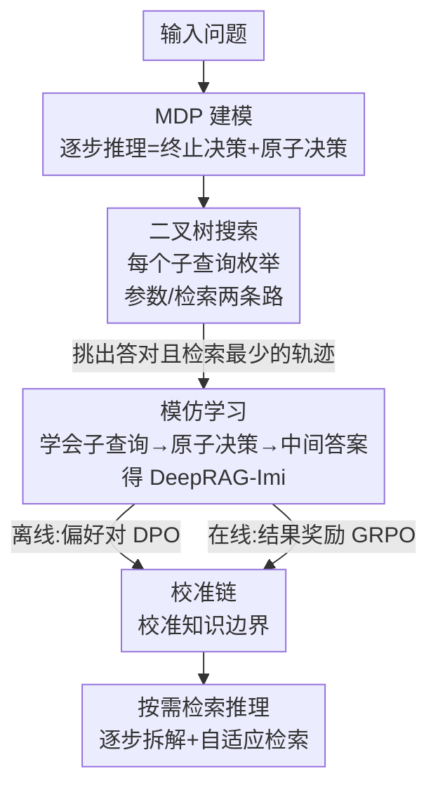

# DeepRAG: Thinking to Retrieve Step by Step for Large Language Models

**会议**: ICLR2026  
**OpenReview**: [https://openreview.net/forum?id=VI2YaggHIF](https://openreview.net/forum?id=VI2YaggHIF)  
**代码**: https://github.com/icip-cas/DeepRAG  
**领域**: 信息检索 / 检索增强生成（RAG） / LLM 推理  
**关键词**: 自适应检索、检索增强生成、知识边界、马尔可夫决策过程、强化学习

## 一句话总结
DeepRAG 把"边推理边检索"建模成一个马尔可夫决策过程（MDP），让 LLM 在逐步拆解问题的同时，对每个子问题自主决定"用自己脑子里的知识答 还是 去外部检索"，通过二叉树搜索合成数据 + 模仿学习 + 校准训练三步走，在五个 QA 数据集上把答案准确率相对提升 25.41%，同时显著降低检索次数。

## 研究背景与动机
**领域现状**：检索增强生成（RAG）通过给 LLM 喂外部知识来缓解事实性幻觉，已经成为知识密集型任务的主流范式。近期工作进一步往里加"推理"：把复杂问题拆成多个子问题、迭代检索、逐步逼近答案。

**现有痛点**：现有"推理 + 检索"方案有两个老毛病。其一是**任务分解不到位**——LLM 经常生成不够精确、不够原子化的子查询，导致检索抓回一堆噪声；其二是**冗余检索**——很多子问题其实模型自己就能答（比如"《指环王》三部曲是哪三部"这种常识），却仍然无脑去检索，引入无关文档反而把回答质量拉低。

**核心矛盾**：根子在于 LLM **不知道自己的知识边界**。要做到"该检索时检索、不该检索时别检索"，模型必须能准确判断"这个子问题我到底会不会"。但现有自适应 RAG 要么靠额外训练的分类器（classifier-based）、要么靠阈值敏感的置信度指标（confidence-based）、要么直接让 LLM 自己拍板（LLM-based）——前两者笨重且脆弱，后者因为模型对知识边界认知不准而不可靠。

**本文目标**：让任意 LLM 学会"按需检索"——边拆解问题边在每一步动态决定知识来源，既要答得对、又要检索得少。

**切入角度**：作者从人类上网查资料的方式获得灵感——人不会每个念头都去搜一下，而是先用脑子里已有的知识推进，遇到确实不知道的事实才去查。把这个过程形式化，就能用一个统一的决策框架同时优化"拆解、检索时机、回答"。

**核心 idea**：把检索增强推理建模成 MDP，每一步同时做"是否终止"和"检索 vs 参数知识"两个原子决策，再用以检索成本为代价的奖励来训练模型校准知识边界，从而实现"想清楚再决定要不要检索"。

## 方法详解

### 整体框架
DeepRAG 要解决的是"如何让 LLM 在多步推理中，对每个子问题自主、准确地决定用内部参数知识还是去外部检索"。整体上，它先把这个逐步推理-检索过程形式化为一个 MDP，然后用三步流水线把这套决策能力训练进任意 LLM：第一步用**二叉树搜索**为训练问题穷举"每个子查询用参数知识还是检索"的所有组合路径，并挑出"答对且检索最少"的最优轨迹；第二步把这些最优轨迹喂给模型做**模仿学习**，让它学会"子查询生成 → 原子决策 → 中间答案"的基本模式，得到 DeepRAG-Imi；第三步做**校准链（Chain of Calibration）**，专门强化模型对自身知识边界的认知——离线变体用偏好数据做 DPO，在线变体用结果奖励做 GRPO，分别得到 DeepRAG-RLoff 和 DeepRAG-RLon。

推理时，模型拿到问题后逐步生成子查询；对每个子查询先做终止决策（要不要继续拆）、再做原子决策（检索还是不检索），如此循环直到给出最终答案。

### 关键设计

**1. MDP 建模：把"边推理边检索"变成可优化的决策序列**

现有方法把"拆解、检索时机、回答"当成彼此割裂的环节各自启发式处理，无法端到端优化"少检索且答对"这个联合目标。DeepRAG 把整个逐步推理过程形式化为四元组 $(S, A, P, R)$。**状态** $s_t = (x, (q_1, r_1), \dots, (q_t, r_t))$ 记录原问题 $x$ 和已生成的子查询-中间答案对。**动作** $a_{t+1} = (\sigma_{t+1}, \delta_{t+1})$ 由两个子决策组成：终止决策 $\sigma_{t+1} \in \{\text{continue}, \text{terminate}\}$ 决定要不要继续拆下一个子查询，原子决策 $\delta_{t+1} \in \{\text{retrieve}, \text{parametric}\}$ 决定这个子查询是去检索文档还是直接用参数知识答。**奖励**只在生成最终答案后结算：$R = -C(o) \times T(s_t)$，其中 $C(o)$ 表示正确性（答对为 1，答错为 $\infty$），$T(s_t)$ 是累计检索成本。这个奖励的妙处在于——答错时 $C(o)=\infty$ 直接把奖励压到最低，所以**先保正确**；在都答对的前提下，检索次数越少奖励越高，于是**再省检索**。把问题装进 MDP 后，"该不该检索"不再是孤立的启发式判断，而是服务于一个全局可优化的目标。

**2. 二叉树搜索：为每个子查询枚举"参数 vs 检索"，挖出最省检索的正确路径**

要训练模型做好原子决策，得先有"什么时候该检索、什么时候不该"的监督信号，但人工标注成本极高。DeepRAG 用二叉树搜索自动合成这种信号：给定一个训练问题，模型迭代生成子查询，对每个子查询展开两个分支——蓝色节点（直接用参数知识答）和绿色节点（检索外部文档再答），于是每个子查询都长出一棵二叉树。搜索时用一个**按检索次数排序的优先队列**（Alg. 1）来探索：每次取出检索成本最低的轨迹继续扩展，一旦走到答对的终止状态就立即返回这条路径；若穷举所有选项仍答不对，就丢弃该样本。因为优先队列总是优先扩展检索最少的分支，找到的第一条正确轨迹天然就是"答对且检索成本最小"的最优路径——这正好对应 MDP 里奖励最高的轨迹。这样无需人工标注，就能为每个子查询拿到"此处到底该不该检索"的金标准。

**3. 模仿学习：把最优轨迹蒸馏进模型，并屏蔽检索文档的损失**

有了最优轨迹，第一阶段就是让模型模仿它，学会"子查询生成 → 原子决策 → 中间答案"这套基本流程，得到 DeepRAG-Imi。这里有个关键细节：训练时对检索回来的文档 $d_i$ 施加 **masked loss**，即损失只算在子查询和中间答案的 token 上、不算在检索文档上。损失形如

$$L = -\sum_{1 \le i \le n} \log \left[ \Pr(q_i \mid s_{i-1}) + \Pr(a_i \mid s_{i-1}, q_i, d_i) \right]$$

其中无检索步时 $d_i$ 为空。屏蔽文档损失是为了防止模型去死记硬背那些可能无关或带噪的检索文本（背了反而污染参数知识、损害泛化），让训练聚焦在"如何拆子查询、如何基于已有信息作答"这两件真正要学的本事上。

**4. 校准链：专门校准知识边界的离线 / 在线两条路**

模仿学习让模型学会了流程，但四个可优化点里——终止决策、原子决策、子查询分解、中间答案生成——唯独**原子决策**要求模型认清自己的知识边界，这是最难也最关键的一环。校准链针对它再训一轮，提供两个变体。**离线校准（DeepRAG-RLoff）**：用 Stage I 的模型在 Alg.1 上重新找最优路径，得到每个子查询"该不该检索"的最优选择，据此构造偏好对（最优路径选参数知识就偏好参数答案、选检索就偏好检索），再用 DPO 风格目标微调：

$$L = -\log \sigma\left( \beta \log \frac{\pi_\theta(y_w \mid s_i, q_i)}{\pi_{\text{ref}}(y_w \mid s_i, q_i)} - \beta \log \frac{\pi_\theta(y_l \mid s_i, q_i)}{\pi_{\text{ref}}(y_l \mid s_i, q_i)} \right)$$

这里 $y_w / y_l$ 是偏好 / 非偏好的片段（"Intermediate Answer:" 对应直接答，"Let's search..." 对应检索）。**在线校准（DeepRAG-RLon）**：用结果奖励做自我探索式 GRPO，借鉴"over-long reward shaping"提出 **over-retrieve reward shaping**——设一个最大检索预算 $T$，奖励为

$$R = \begin{cases} 0, & \text{格式不合规} \\ \text{score}_{\text{format}}, & \text{答错但格式合规} \\ 1 - \alpha \times \min(T, T(s_{t+1})), & \text{答对} \end{cases}$$

它优先保证正确，其次奖励格式合规，最后对超额检索施加上限为 $T$ 的惩罚，从而把模型推向"既准又省"。离线靠过程监督做细粒度优化、在线靠结果奖励做自主探索，两条路都直指同一个目标：让模型更准地知道"什么我会、什么我不会"。

### 一个完整示例
以论文里的问题"《指环王》全部电影的总时长是多少"为例：
- **Step 1**——子查询"《指环王》有哪几部电影？"。这是广为人知的常识，原子决策选 **parametric**，模型直接答出三部曲（护戒使者、双塔奇兵、王者无敌），不浪费一次检索。
- **Step 2/3/4**——分别问每部电影的时长。这些精确数字超出模型参数知识，原子决策选 **retrieve**，去维基百科查到 178 / 179 / 201 分钟。
- **Step 5**——子查询"总时长是多少？"。这一步只需对前面信息做加法 $178+179+201=558$，原子决策选 **parametric**，模型自己算出 558 分钟。
- 终止决策在 Step 5 后判定 terminate，给出最终答案 558 分钟。

整个过程只在真正需要外部事实的 3 步检索，常识和计算都靠模型自己——这就是 DeepRAG"按需检索"的直观体现。

### 损失函数 / 训练策略
三阶段对应三套目标：二叉树搜索阶段无梯度，只做数据合成（每个数据集随机采 4000 例做模仿学习、额外 1000 例做校准链）；模仿学习用带文档掩码的交叉熵（式 1）；校准链离线用 DPO 目标（式 2）、在线用 GRPO + over-retrieve reward（式 3，超参 $\text{score}_{\text{format}}=0.1, \alpha=0.1, T=5$）。数据合成时用 Qwen-2.5-72B 生成查询分解和检索答案节点，用目标模型生成参数知识节点。

## 实验关键数据

### 主实验
在 HotpotQA、2WikiMultihopQA（域内）和 PopQA、WebQuestions、MuSiQue（域外）五个开放域 QA 数据集上评测，指标为 EM / F1。下表为 Llama-3-8B 上的平均分（Avg）对比：

| 方法 | 类型 | 平均分 |
|------|------|--------|
| CoT-Retrieve | 推理基线 | 34.90 |
| Search-R1 | RL 检索 | 36.54 |
| R1-Searcher++ | 当前最强基线 | 40.85 |
| DeepRAG-Imi | 本文（模仿学习） | 39.78 |
| DeepRAG-RLoff | 本文（离线校准） | 41.47 |
| **DeepRAG-RLon** | **本文（在线校准）** | **42.36** |

DeepRAG-RLon 在 Llama-3-8B 上以 42.36 的平均分超过最强基线 R1-Searcher++（40.85）；在 Qwen-2.5-32B 上 DeepRAG-RLon 也达 41.05、领先所有基线。摘要中"准确率相对提升 25.41%"即相对部分基线的整体增益。

### 检索效率与知识边界

| 方法 | EM | 平均检索次数 | 耗时(s/题) |
|------|-----|------------|-----------|
| Auto-RAG | 17.40 | 4.52 | 0.71 |
| Search-R1 | 27.70 | 0.51 | 0.64 |
| DeepRAG-Imi | 30.00 | 0.43 | 0.67 |
| DeepRAG-RLoff | 32.70 | 0.28 | 0.50 |
| DeepRAG-RLon | 30.00 | **0.14** | **0.40** |

（WebQuestions 上的检索频率，Table 2。DeepRAG 在更高准确率下检索次数远少于迭代检索类方法。）

知识边界对齐（2WikiMultihopQA，Table 3）：DeepRAG-RLon 在衡量"检索决策是否与参数知识匹配"的 MCC 上达 0.543、平衡准确率 0.801，均显著高于 FLARE（MCC≈0）、TAARE（0.078）和 R1-Searcher++（0.458），说明它最能准确识别"哪些该检索、哪些不该"。

### 消融实验

| 配置 | 平均分 | 平均检索 | 说明 |
|------|--------|---------|------|
| 模仿学习：最省检索路径（默认） | 44.6 | 0.98 | 既准又省 |
| 模仿学习：最多检索路径（most） | 41.12 | 2.11 | 多检索反而掉点 |
| 模仿学习：随机路径（random） | 40.56 | 1.81 | 最差 |
| 校准链：最优路径节点（默认） | 47.67 | 1.37 | 完整 |
| 校准链：全节点偏好（all-node） | 45.3 | 1.56 | 噪声更多 |
| 校准链：句级偏好（sentence-wise） | 21.14 | 0.57 | 严重退化 |

### 关键发现
- **少检索 ≠ 弱性能**：模仿学习选"最省检索"路径反而比"最多检索"路径平均分更高（44.6 vs 41.12），印证了过度检索会因长上下文/无关知识而损害回答。
- **自适应胜过两个极端**：纯参数知识（25.32）和纯检索（45.39）都不如 DeepRAG 自适应（47.67），且 DeepRAG 检索次数（1.37）远少于纯检索（2.77）。
- **在线校准泛化更强**：DeepRAG-RLon 在三个域外数据集上平均增益 2.85，而 DeepRAG-RLoff 仅 0.91。
- **拆解更干净**：DeepRAG 拆出的子查询里代词和连词更少，分解更原子化；多数问题 3-5 步分解、检索集中在 0-2 轮。

## 亮点与洞察
- **奖励函数把"先对、后省"写进数学**：$R = -C(o) \times T(s_t)$ 用 $C(o)=\infty$ 巧妙地让"答错"在乘法下直接压垮检索成本项，无需手调权重就实现了"正确性优先于效率"的严格偏序，这个设计很干净。
- **二叉树搜索 + 优先队列 = 自动金标准**：把"该不该检索"的标注问题转成"找答对且检索最少的路径"的搜索问题，用优先队列保证第一个正确解即最优解，省掉人工标注还天然对齐 MDP 奖励，可迁移到任何"动作有代价、结果可验证"的决策标注场景。
- **masked loss 防止背噪声**：对检索文档屏蔽损失这个细节，体现了"让模型学决策、别学死记"的思路，可直接借鉴到其他需要喂外部上下文又怕模型背噪的训练里。
- **离线/在线双变体覆盖不同算力**：离线 DPO 适合无在线 rollout 条件、在线 GRPO 泛化更强，给落地留了选择空间。

## 局限与展望
- **依赖问题可被精确分解**：方法建立在"复杂问题能拆成原子子查询"的假设上，对难以分解的开放式/创造性问题可能水土不服。
- **正确性判定依赖 EM 类匹配**：奖励里的 $C(o)$ 用精确匹配判对错，对长答案、需要语义等价判断的任务可能失真，限制了向生成式任务的扩展。
- **训练数据局限于多跳 QA**：模仿与校准都在 HotpotQA / 2WikiMultihopQA 上合成，迁移到知识结构很不同的领域时是否还能保持知识边界校准的优势，需要更多验证。
- **二叉树搜索的合成开销**：为每个训练问题穷举二叉树路径有一定计算成本，大规模数据合成时的可扩展性值得关注。

## 相关工作与启发
- **vs 分类器/置信度类自适应 RAG（UAR / FLARE / DRAGIN）**：它们要么训练额外分类头、要么依赖阈值敏感的不确定性指标判断何时检索；DeepRAG 直接用 LLM 自身的生成能力探索知识边界，不加额外参数、不依赖脆弱阈值，在 MCC/平衡准确率上明显更对齐参数知识。
- **vs LLM-based 自适应（Self-RAG / TAARE）**：它们让模型自己决定检索时机，但因知识边界认知不准而不可靠；DeepRAG 通过校准链专门强化这一认知，从而把"何时检索"的判断变得可信。
- **vs RL 检索类（Search-R1 / R1-Searcher++）**：这类方法用 RL 优化检索质量，但奖励里通常忽略检索效率；DeepRAG 的 over-retrieve reward shaping 显式把检索成本写进奖励，在准确率领先的同时检索次数大幅更少。
- **vs 迭代检索（IterDRAG / Auto-RAG）**：它们倾向于持续检索、容易陷入"找不到相关信息就反复检索"的死循环；DeepRAG 用原子决策按需触发检索，避免了冗余检索的噪声与开销。

## 评分
- 新颖性: ⭐⭐⭐⭐ 把"边推理边检索"统一进 MDP 并用二叉树搜索自动合成知识边界监督，框架完整且角度新颖
- 实验充分度: ⭐⭐⭐⭐⭐ 两种 backbone、五个域内外数据集、检索效率 / 知识边界对齐 / 三组消融俱全
- 写作质量: ⭐⭐⭐⭐ 动机与方法叙述清晰，图示（人类思维对照、框架图）很有助于理解
- 价值: ⭐⭐⭐⭐⭐ 端到端、可套任意 LLM、显著降检索成本，对 RAG 落地有直接实用价值

<!-- RELATED:START -->

## 相关论文

- [\[ICLR 2026\] Q-RAG: Long Context Multi‑Step Retrieval via Value‑Based Embedder Training](q-rag_long_context_multistep_retrieval_via_valuebased_embedder_training.md)
- [\[ICLR 2026\] Query-Level Uncertainty in Large Language Models](query-level_uncertainty_in_large_language_models.md)
- [\[ICLR 2026\] TokMem: One-Token Procedural Memory for Large Language Models](tokmem_one-token_procedural_memory_for_large_language_models.md)
- [\[ICLR 2026\] MLP Memory: A Retriever-Pretrained Memory for Large Language Models](mlp_memory_a_retriever-pretrained_memory_for_large_language_models.md)
- [\[ICLR 2026\] Expert Heads: Robust Evidence Identification for Large Language Models](expert_heads_robust_evidence_identification_for_large_language_models.md)

<!-- RELATED:END -->
