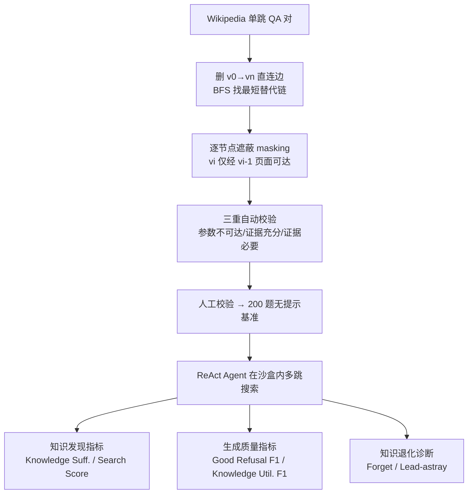

# Demystifying Deep Search: A Holistic Evaluation with Hint-free Multi-Hop Questions and Factorised Metrics

**会议**: ICLR 2026  
**OpenReview**: [https://openreview.net/forum?id=x4zQDewgHr](https://openreview.net/forum?id=x4zQDewgHr)  
**代码**: 待确认  
**领域**: 信息检索 / Deep Search Agent 评测  
**关键词**: 多跳问答, RAG 评测, Web Agent, 无提示问题, 因子化指标, 拒答校准  

## 一句话总结
针对当前 deep search 评测"问题里泄露推理路径 + 只看一个 pass rate"两大顽疾，本文构建了**无提示（hint-free）多跳问答基准 WebDetective**（受控 Wikipedia 沙盒 + 全程可追溯）和一套把「搜索充分度 / 知识利用 / 拒答行为」拆开的因子化指标，评测 25 个前沿模型后揭示：今天的系统擅长**执行**给定推理路径，却普遍无法**自主发现**推理路径，且证据充足时合成能力差、证据缺失时几乎不会恰当拒答。

## 研究背景与动机
- **领域现状**：RAG 系统与 Web Agent 越来越多地在多跳 deep search 任务上被评测——要求模型多步探索、生成假设、聚合证据并合成答案，应对"我找不到"这一搜索者常见障碍。
- **现有痛点一（问题泄露路径）**：多数基准在题面里嵌入了推理线索。经典多跳 QA（如 HotpotQA）属于 **Path-Hinting（PH）**，把推理链直接写进问题（"Kane Cornes 的哥哥的继母的丈夫是谁？"），任务退化为"按图执行"；较新的基准（BrowseComp、WebShaper）属于 **Specification-Hinting（SH）**，用一堆独特属性指认目标实体，本质变成约束过滤而非探索式搜索。两类提示都给了现实中罕见的脚手架，无法考察真正的自主性。
- **现有痛点二（只报 pass rate）**：单一通过率把截然不同的失败模式压成一个数——"搜得好但合成不出"、"过早放弃"、"过度依赖参数化知识"、"该继续却拒答"被混为一谈，无法定位问题根源。
- **核心矛盾**：评测要测的是 **path discovery（发现推理路径）**，但现有基准实际只测了 **path execution（执行推理路径）**；要诊断失败模式，但单一指标把模式都掩盖了。
- **本文目标**：造一个既无提示、又能受控追溯、还能分模式诊断的基准与指标体系，把 deep search agent 的能力短板"解构"出来。
- **核心 idea**：**问题去提示 + 环境共同设计（co-design）**——光把问题写得无提示还不够，开放语料里仍可走捷径（伪共现、直接搜中间实体），所以配套一个**逐节点遮蔽（masking）的 Wikipedia 沙盒**强制"只有访问前驱页面才能发现后继实体"；再把评测**因子化**为知识发现 / 生成质量 / 知识退化三组指标。

## 方法详解

### 整体框架
WebDetective 由三部分构成：**(1) 无提示多跳问题** + **(2) 受控可追溯的 Wikipedia 沙盒（共同设计原则）** + **(3) 超越 pass rate 的因子化诊断指标**；并额外给出一个由诊断结论反推设计的 agent 基线 **EvidenceLoop**。整条评测管线让 25 个前沿模型在 200 道 2–4 跳问题上以 ReAct 方式交错"推理-搜索-观察"，逐页追踪其访问轨迹，从而精确区分"没搜到 / 搜到没用好 / 该拒答没拒答"。

### 关键设计

**1. 无提示多跳问题（Hint-Free QA）：把信息需求还原为最朴素的一句话。** 给定问题 $q$ 与语料 $C$，agent 需自主发现并组合一串原子证据 $E=\{e_1,\dots,e_n\}$，每个 $e_i$ 位于实体 $v_i$ 的页面上并链接到 $v_{i+1}$，形成推理链 $v_0\!\to\!v_1\!\to\!\cdots\!\to\!v_n$，再经推理函数 $R_{func}:E\to a^*$ 合成答案。论文把题面中任何泄露 $R_{func}$ 或指认 $v_n$ 的信息定义为提示 $h$：PH 满足 $h_{PH}=\text{Encode}(R_{func})$（直接编码推理链），SH 满足 $h_{SH}=\{s_1,\dots,s_k\}$（一组约束把搜索空间缩成唯一实体）。本文要求 $h=\varnothing$——例如把"…的继母的丈夫是谁"改写成朴素的"Kane Cornes 的父亲是谁？"，逼模型自己发现证据链 $E$ 与推理函数 $R_{func}$，这才是"把简单信息需求转化为自构推理结构"的核心能力。

**2. 共同设计原则与节点遮蔽（Co-design Masking）：用环境堵死捷径，让答案只能"老老实实多跳"。** 仅靠问题去提示并不够：开放语料里 "Kane" 与答案实体可能在无关上下文里共现，或中间实体能被直接搜到，agent 就能绕过预期推理链，且无法判断它是真发现还是走了捷径。为此沙盒强制约束
$$v_i \text{ 可发现} \iff \text{agent 访问了 } page(v_{i-1}),$$
即沿参考链遮蔽每个实体提及，下一跳实体只有访问其前驱页面才能触达，从而消除基于语料的伪捷径，同时仍允许多种有效推理策略。该方法不绑定 Wikipedia，凡满足"有事实语料 + 实体级链接图 + 可沿路径遮蔽实体提及"三条件的领域（新闻档案、科研库、企业知识库等）都能套用同一管线。

**3. 因子化诊断指标：把"对/错"拆成"有没有证据"与"会不会用证据"两层。** 知识发现层用 **Knowledge Sufficiency**（证据是否齐备，缺的证据再用定向探针 "Kane Cornes has brother ___?" 查模型参数化知识）和 **Search Score**（检索有效性，并给"用更少跳数+参数知识高效得到答案"额外加分，同时承认参考链外的等价替代路径）。生成质量层在知识充分（S）/不充分（I）、尝试（A）/拒答（N）的交叉分类下定义 **Good Refusal F1**（证据不足时该不该拒答）与 **Knowledge Utilisation F1**（证据齐备时能否正确合成），并合成统一的
$$\text{GenScore}=\frac{F1_{GR}+F1_{KU}}{2}\cdot \text{KnowledgeScore},$$
用知识充分率加权，防止"一律拒答"刷分——只有既拿到证据又恰当处理（正确合成或合理拒答）才得分。

**4. 知识退化诊断（Forget vs Lead-astray）：解释"证据都在手上为什么还答错"。** 即使达到知识充分（$KS(d)=1$），模型仍常合成失败。**Knowledge Forget** 捕捉"独立探针能答对、放进完整上下文却用不上参数化知识"的遗忘型失败；**Lead-astray** 捕捉"被无关页面/失败尝试/探索杂讯带偏，本可从干净证据答出却答错"的干扰型失败。二者把笼统的失败进一步定位为"搜索不足 / 过度自信幻觉 / 合成薄弱 / 噪声下推理退化"。

**5. EvidenceLoop 基线：由诊断结论反推的 agent 工作流。** 针对基准暴露的合成瓶颈，设计三大机制：**迭代精炼+回退**（每轮 $N$ 个 solver 并行探索不同路径，经抽取 agent 提炼、聚合 agent 合成上下文 $C_{r+1}$，$R_{max}$ 轮后若无定论则 fallback 仅做合成，从而区分"探索不足"与"合成不力"）；**证据记忆系统**（每条证据分配唯一 EID，agent 既看摘要又可按需 retrieve 全文，避免被长文档淹没又不丢证据链）；**验证回路**（答案拆成原子声明并各挂 EID，验证 agent 检查声明是否被来源蕴含、是否共同支撑答案、是否切题，拒绝则带反馈让 solver 在剩余预算内修复，通过则立即终止——把拒答显式绑定到"证据不完整→拒答"）。

## 实验关键数据

### 主实验（25 个前沿模型，200 题 2–4 跳，限 40 次工具调用 / 32K 上下文）

| 模型 | Knowledge Suff.(%) | Search(%) | Generation(%) | Good Refusal F1(%) | Knowledge Util. F1(%) | Pass@1(%) |
|------|------:|------:|------:|------:|------:|------:|
| o3-Pro | 71.0 | 78.0 | 20.86 | 9.37 | 49.40 | **56.0** |
| GPT-5 | 79.0 | **80.0** | 23.21 | 8.89 | 49.58 | 50.5 |
| Grok-4 | 74.0 | 77.5 | **34.71** | 37.63 | **56.19** | 50.5 |
| o3 | 70.0 | 76.0 | 18.29 | 3.29 | 48.97 | 53.5 |
| Claude-Opus-4.1 | 74.0 | 76.5 | 28.53 | 28.57 | 48.54 | 44.5 |
| Qwen3-235B-Think | 72.5 | 72.0 | 11.15 | 6.56 | 24.19 | 21.5 |
| Doubao-1.6-Flash | 54.5 | 57.5 | 20.00 | **53.95** | 19.46 | 13.5 |
| DeepSeek-R1（基座） | 61.5 | 65.5 | 10.57 | 18.81 | 15.55 | 20.0 |
| **EvidenceLoop（本文，基座 DeepSeek-R1）** | 61.5 | 62.5 | 12.61 | 17.98 | 23.79 | 25.0 |

- **前沿模型远未饱和**：最强的 o3-Pro 也只有 56.0% Pass@1，GPT-5/Grok-4 均 50.5%，多数低于 40%。
- **搜索、生成、最终准确率三者解耦**：GPT-5 搜索 80.0% 但生成仅 23.21%；Qwen3-235B 搜索 72.0% 而生成仅 11.15%——合成（而非检索）是关键瓶颈。
- **拒答能力普遍欠发达**：最佳 Good Refusal F1 仅 53.95%（Doubao-1.6-Flash），GPT-5（8.89%）、o3-Pro（9.37%）等顶级模型严重偏低，证据不足时几乎不会恰当拒答。

### 消融 / 行为画像与退化分析

| 行为画像 | 知识/拒答/利用 | Pass@1 | 代表模型 | 失败模式 |
|------|------|------:|------|------|
| 强但过度自信 | 高/低/高 | 50–56% | GPT-5, o3-Pro, o3 | 过度自信→幻觉 |
| 校准良好的精英 | 高/中/高 | 44–51% | Grok-4, Claude-Opus-4.1 | 偶尔过度谨慎 |
| 合成瓶颈 | 高/低/低 | 18–22% | Qwen3-235B, Tongyi-DR | 有证据却拼不出多跳链 |
| 保守中庸 | 中/中/中 | 29–39% | Claude-Sonnet-4, GLM-4.5 | 能答却拒答，能力未充分利用 |
| 弱且糊涂 | 中/低/低 | 20–22% | o4-Mini, DeepSeek-R1 | 合成差 + 校准差 |
| 自知其弱 | 低/高/低 | 13–18% | Doubao, Gemini-Flash | 全面不能（但拒答恰当） |

- **EvidenceLoop 的定向增益**：相对基座 DeepSeek-R1，Pass@1 20.0→25.0（+25% 相对），Generation 10.57→12.61（+19%），Knowledge Utilisation F1 15.55→23.79（**+53% 相对**）——证据缓冲+验证回路确实直击合成瓶颈。
- **遗忘压过误导**：所有模型平均 $Forget - Lead\text{-}astray = +10.35$ 个百分点，说明达到知识充分后的失败更多源于"合成时没用上已有证据"，而非"被干扰带偏"。
- **对测试时扩展（TTS）稳健**：Claude-Opus-4.1 上下文从 8K 扩到 32K 后 Generation 在约 34%、Pass@1 在约 50% 处饱和；EvidenceLoop 在不同 breadth–iteration 下也稳定——再次印证瓶颈在合成而非搜索。

### 关键发现
1. **没有任何模型在"知识充分 / 恰当拒答 / 高利用"三项上同时拿高分**——当前架构似乎被迫在"能力强"与"认知谦逊"之间二选一。
2. **三类失败并存**：搜索失败（顶级模型仍占 21–46%）、合成失败（利用率峰值仅 56%）、校准失败（强模型系统性过度自信、弱模型缺校准信号）。
3. **稳定的证据保持力（而非原始检索能力）才是 deep search 表现的决定因素**。

## 亮点与洞察
- **"co-design"是点睛之笔**：把"问题去提示"和"环境遮蔽防捷径"绑在一起，第一次让"是否真的自主发现推理链"变得可验证、可追溯，而不是靠开放网络上无法判定的间接信号。
- **因子化指标比 pass rate 信息量大一个量级**：把"对/错"拆成知识充分度 × 生成质量，再用 Forget/Lead-astray 二次细分，直接给出"该改搜索还是改合成还是改校准"的可执行诊断。
- **GenScore 的充分率加权很巧**：用 KnowledgeScore 做乘子，从机制上堵死"全部拒答刷高 refusal"的 gaming。
- **诊断驱动设计闭环**：EvidenceLoop 不是另起炉灶的 SOTA，而是用基准暴露的瓶颈反推架构，证明了"基准能指导具体架构改进"这条价值链。

## 局限与展望
- **绝对增益有限**：EvidenceLoop 各项虽相对提升明显，但绝对值仍很低（Pass@1 仅 25%），离实用还有距离，更多是"概念验证"。
- **基准规模偏小**：仅 200 题、2–4 跳，且当前实例化绑定 Wikipedia；虽声称方法可迁移到新闻/科研/企业库，但未给出其他语料的实证。
- **遮蔽假设的现实差距**：真实 Web 搜索没有"逐节点遮蔽"，沙盒虽利于可控诊断，但与开放网络的噪声/冗余路径分布存在 gap。
- **合成瓶颈未真正解决**：论文精准地把问题定位到"证据齐备却合成不出"，但 EvidenceLoop 的验证回路只是缓解，更深层的多跳合成与校准机制仍是开放问题。
- **展望**：把 co-design 管线推广到多语料/多模态、扩大题量与跳数、并探索"高合成 + 高拒答校准"不再二选一的架构。

## 相关工作与启发
- **多跳 QA 基准谱系**：从 HotpotQA（PH）到 BrowseComp / WebShaper（SH），本文把"提示"概念化为 $h$ 并显式去除，是对这一谱系"难度其实来自脚手架"的批判性回应。
- **Web Agent / Deep Research**：与 Tongyi-DeepResearch、各家 ReAct 风格 agent 互补——它们关注"怎么搜得更好"，本文关注"怎么测出搜与合成的真实差距"。
- **拒答与校准**：把"恰当拒答（good refusal）"纳入主指标，与 LLM 不确定性/弃权研究呼应，提醒社区"会说我不知道"和"会答对"同等重要。
- **启发**：任何想评测 agent 自主性的工作，都应警惕题面/环境中的隐性脚手架；而把单一成功率拆成因子化诊断，是定位 agent 失败根因的通用范式。

## 评分
- **新颖性**: ⭐⭐⭐⭐⭐ — "提示"形式化（PH/SH/HF）+ 环境共同设计遮蔽 + 因子化诊断指标三者结合，对 deep search 评测是范式级的重新审视。
- **实验充分度**: ⭐⭐⭐⭐ — 25 个前沿模型、6 大指标、行为画像聚类、TTS 稳健性、退化分析齐全；扣分在基准仅 200 题且只实例化于 Wikipedia。
- **写作质量**: ⭐⭐⭐⭐⭐ — 问题定义清晰、贯穿 Kane Cornes 跑例直观、指标推导与发现层层递进，可读性极高。
- **价值**: ⭐⭐⭐⭐⭐ — 既给出可追溯诊断基准，又用 EvidenceLoop 闭环证明"诊断能指导架构改进"，对构建真正自主的推理 agent 有持续工具价值。

<!-- RELATED:START -->

## 相关论文

- [\[ICLR 2026\] FrugalRAG: Less is More in RL Finetuning for Multi-hop Question Answering](frugalrag_less_is_more_in_rl_finetuning_for_multi-hop_question_answering.md)
- [\[ICLR 2026\] Hybrid Deep Searcher: Scalable Parallel and Sequential Search Reasoning](hybrid_deep_searcher_scalable_parallel_and_sequential_search_reasoning.md)
- [\[AAAI 2026\] Magnitude Matters: A Superior Class of Similarity Metrics for Holistic Semantic Understanding](../../AAAI2026/information_retrieval/magnitude_matters_a_superior_class_of_similarity_metrics_for_holistic_semantic_u.md)
- [\[AAAI 2026\] REAP: Enhancing RAG with Recursive Evaluation and Adaptive Planning for Multi-Hop Question Answering](../../AAAI2026/information_retrieval/reap_enhancing_rag_with_recursive_evaluation_and_adaptive_planning_for_multi-hop.md)
- [\[ICLR 2026\] MergePRAG: Orthogonal Merging of Passage-experts for Multi-hop Parametric RAG](mergeprag_orthogonal_merging_of_passage-experts_for_multi-hop_parametric_rag.md)

<!-- RELATED:END -->
