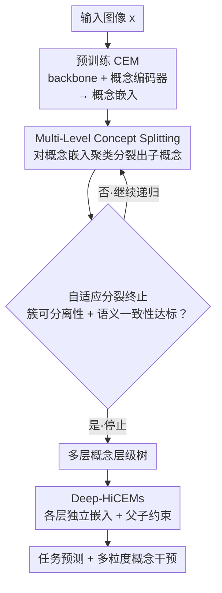

# Digging Deeper: Learning Multi-Level Concept Hierarchies

**会议**: ICLR 2026 Workshop on Principled Design for Trustworthy AI  
**arXiv**: [2603.10084](https://arxiv.org/abs/2603.10084)  
**代码**: 无  
**领域**: 可解释AI / 概念模型  
**关键词**: 多层概念层次, 概念嵌入模型, 概念分裂, 子概念发现, 测试时干预

## 一句话总结
本文提出 Multi-Level Concept Splitting（MLCS）将概念分裂过程从单层递归扩展到多层，仅用顶层概念标注就能自动发现任意深度的概念层级树，并设计 Deep-HiCEMs 架构来表示和利用这些深层层级，实现多粒度的测试时概念干预。

## 研究背景与动机

**领域现状**：基于概念的可解释模型（Concept-based Models）是当前可解释 AI 的核心方向之一。Concept Bottleneck Models（CBMs）和 Concept Embedding Models（CEMs）通过强制模型先预测人类可理解的中间概念，再从概念预测最终任务标签，从而提供结构化的解释路径。CEMs 特别引入了概念嵌入空间的设计，允许每个概念用高维向量表示而非简单的二值预测，在保持可解释性的同时提升了准确率。

**现有痛点**：标准的 CBMs 和 CEMs 有两个关键问题——
(1) 它们将概念视为"扁平且独立"的实体，完全忽视概念之间的层次关系。比如"翅膀颜色"和"飞行能力"在语义上有因果关联，但模型将它们视为互不相关的维度。
(2) 如果想获得细粒度的概念解释，就必须在训练时提供详尽的多粒度标注（如不仅标注"有翅膀"，还要标注"翅膀是条纹的"、"翅膀是尖形的"等），标注成本极高。

**核心矛盾**：同组先前工作 HiCEMs（ICLR 2026 主会论文）已经解决了第一个问题——用层次结构显式建模概念关系，并提出 Concept Splitting 从预训练 CEM 的嵌入空间中自动发现子概念，无需额外标注。但 HiCEMs 和 Concept Splitting 都被限制在**浅层层次**（即只能从父概念分裂出一层子概念），无法捕获现实中更深的多层概念树。例如"动物 → 鸟类 → 水鸟 → 鹈鹕"这样的四层结构是无法被表达的。

**本文目标** 两个子问题：
(1) 如何将单层 Concept Splitting 扩展为可递归的多层版本，从顶层标注自动构建深层概念树？
(2) 如何设计模型架构来表示和利用多层概念层级，并支持在任意抽象层次上进行概念干预？

**切入角度**：作者观察到，Concept Splitting 的本质是在 CEM 的概念嵌入空间中做聚类。如果一个概念的嵌入向量在不同样本上呈现多个自然簇结构，那么每个簇就对应一个有意义的子概念。这个操作可以递归：子概念的嵌入空间中同样可能存在进一步可分的簇结构。

**核心 idea**：递归地在概念嵌入空间中执行分裂操作，构建多层概念树（MLCS），然后用 Deep-HiCEMs 架构表示和利用这些深层层级。

## 方法详解

### 整体框架
整个方法建立在 CEM（Concept Embedding Models）之上，目标是在不增加任何标注的前提下，把一个预训练 CEM 里"扁平、独立"的概念，挖成一棵可以任意深的概念层级树并加以利用。整体分两个阶段：第一阶段照常训练一个标准 CEM——输入图像 $x$ 经共享 backbone（如 ResNet）提取特征，概念编码器把特征映射到概念嵌入空间，每个概念 $c_i$ 对应一个高维嵌入向量 $\mathbf{e}_i$（不仅编码概念存在与否，还编码细粒度属性），任务预测器再从这些嵌入出分类结果。第二阶段冻结这个 CEM，在它的嵌入空间上做后处理：用 **MLCS** 对每个概念的嵌入反复聚类、递归分裂出子概念，由**自适应分裂终止**逐分支判断"还该不该继续分"，最终长出一棵深度不均的概念树；再用 **Deep-HiCEMs** 把这棵树编码进模型，使其在推理时支持任意粒度的概念干预。

### 关键设计

**1. Multi-Level Concept Splitting（MLCS）：把单层分裂改成可递归，零额外标注挖出深层概念树**

单层 Concept Splitting 只能从父概念劈出直接子概念，遗漏了更深的语义结构（"鸟类 → 水鸟 → 鹈鹕"这种链条断在第一层）。MLCS 的做法是把分裂操作本身变成可递归的：给定父概念 $c$ 在不同训练样本上的嵌入向量集合 $\{\mathbf{e}_c^{(1)}, \mathbf{e}_c^{(2)}, \ldots\}$，在这个高维空间里跑聚类（k-means 或高斯混合模型），自然形成的每个簇就定义为一个子概念 $c_i$。关键在于这一步可以对**每个子概念**再来一遍——收集落在该子概念里的样本嵌入，再次聚类、再次分裂，直到某层的嵌入不再呈现有意义的多簇结构为止。最终长出的是一棵深度不均的概念层级树，简单概念可能只有一层、复杂概念可能有三四层。

整个递归之所以不需要任何额外标注，是因为所有分裂都发生在同一个预训练好的 CEM 嵌入空间里：它不重新训练模型、不收集新标签，只是把嵌入空间中本就存在的潜在簇结构显式地挖出来。例如从"翅膀颜色"先分出"暗色翅膀 / 亮色翅膀"，再从"暗色翅膀"分出"黑色 / 深棕色"——这条链上的每一层都只是对上一层样本嵌入的再聚类。

**2. 自适应分裂终止：让每个概念自己决定该分多深**

如果 MLCS 一味递归下去，就会强制所有概念长成相同深度的树，这并不合理——"颜色"可能分成"暖色 / 冷色"两个子概念就够了，而"形状"可能要一路分到"几何形状 → 多边形 → 正多边形 → 正六边形"四层。自适应分裂终止就是 MLCS 递归循环里的那道闸门（对应框架图中 MLCS 与终止判断之间的回环）：每做一次分裂，都评估它的质量——用子概念簇的可分离性（如 silhouette score）衡量它们是否真的分得开，再看语义一致性（分出来的簇是否对应有意义的视觉属性）。一旦分裂质量掉到阈值以下就停手。这样每个分支的层级深度就和它本身的语义复杂度对齐，概念树的形状由数据自己的结构决定，而非人工指定。

**3. Deep-HiCEMs 架构：让模型显式表示任意层数的概念层级，并支持多粒度干预**

原始 HiCEMs 只能表示父概念 + 子概念两层，干预时也只能在单一粒度上操作。Deep-HiCEMs 把它扩展成可以容纳 MLCS 长出的任意层数：架构中每一层概念都配独立的嵌入表示和预测头，层与层之间用父-子约束绑定——子概念的预测必须与父概念保持逻辑一致（父概念"有翅膀"若为假，子概念"翅膀是条纹的"也必须为假）。最终的任务预测器同时吃下所有层的概念嵌入，于是粗粒度和细粒度信息一起参与分类。

这种多层表示直接解锁了按需选择干预粒度的能力：领域专家可以在非常细的子概念上动手（如"翅膀羽毛的条纹密度"），而普通用户可以停在较粗的层次（如"有翅膀"），各取所需，而不是被迫在同一刀切的粒度上修正。

### 损失函数 / 训练策略
训练流程分为两个独立阶段。**阶段一**：正常训练一个标准 CEM，使用概念预测损失（二元交叉熵）和任务预测损失（交叉熵）的加权和，得到高质量的概念嵌入空间。**阶段二**：冻结 CEM 的参数，在其嵌入空间上执行 MLCS 递归分裂，得到多层概念树；然后使用这些层级结构训练 Deep-HiCEMs，训练目标包括：(1) 各层概念预测的准确性；(2) 最终任务预测的准确性；(3) 层级一致性约束——确保子概念激活与父概念激活逻辑一致。

## 实验关键数据

### 主实验：Deep-HiCEMs vs 标准 CEM 及 HiCEMs

| 模型 | 概念层级深度 | 任务准确率 | 概念可解释性 | 干预支持粒度 |
|------|------------|-----------|------------|------------|
| 标准 CEM | 无层级（扁平） | 基线准确率 | 单层概念解释 | 单粒度干预 |
| HiCEMs（单层分裂） | 2 层 | ≈ CEM 准确率 | 父+子两级解释 | 两级干预 |
| **Deep-HiCEMs（MLCS）** | **多层（≥3 层）** | **保持高准确率** | **多级细粒度解释** | **任意粒度干预** |
| Sparse Autoencoder | 无层级 | 取决于稀疏度 | 稀疏激活解释 | 不支持干预 |

### 干预效果对比

| 干预策略 | 干预粒度 | 任务准确率提升 | 说明 |
|---------|---------|-------------|------|
| 无干预 | — | 基线 | 模型原始预测 |
| 顶层概念干预 | 粗粒度 | 适度提升 | 修正父概念（如"有翅膀"） |
| 单层子概念干预 | 中粒度 | 较好提升 | 修正第一层子概念 |
| 多层深度干预（MLCS） | 细粒度 | **最大提升** | 在最相关的细粒度层级修正 |
| 随机层级干预 | 混合 | 不稳定 | 说明粒度选择影响干预效果 |

### 关键发现
- **MLCS 发现的子概念是人类可理解的**：通过人类评估实验验证，自动发现的多层子概念可以被人类评估者赋予有意义的语义标签。例如，从"翅膀颜色"概念自动分裂出"暗色翅膀"和"亮色翅膀"子概念，进一步从"暗色翅膀"分裂出"黑色"和"深棕色"。
- **Deep-HiCEMs 保持高任务准确率**：增加概念层级深度不会显著牺牲预测性能，证明了层级结构是对原始表示能力的补充而非替代。
- **多层干预优于单层干预**：在测试时，于更精细的概念层级进行干预比粗粒度干预更有针对性。这是因为细粒度子概念对应的语义更精确，修正一个细粒度概念的影响范围更小、更可控。
- **不同数据集呈现不同的自然层级深度**：CUB（鸟类细粒度分类）数据集上的概念树普遍比 MNIST-ADD（数字加法）更深，反映了鸟类视觉属性的语义复杂度更高。
- **与 Sparse Autoencoder 方法的关联**：论文还将概念分裂与稀疏自编码器（Sparse Autoencoder）进行类比——两者都试图发现更细粒度的特征，但概念分裂保持了树状层级结构，而 SAE 生成的是扁平的稀疏特征集合。

## 亮点与洞察
- **零额外标注的深层概念发现**：这是本文最核心的贡献。将 Concept Splitting 从单层推广到递归多层，整个过程完全不需要额外标注——所有子概念都是从 CEM 的嵌入空间中"挖掘"出来的。这个设计之所以巧妙，是因为它利用了训练好的 CEM 嵌入空间本身就包含了丰富的语义结构这一事实，只需要恰当的聚类算法就能把这些潜在结构显式化。
- **多粒度干预的实用价值**：传统 CBMs 的概念干预是"一刀切"的——所有概念在同一粒度。Deep-HiCEMs 允许用户根据自己的专业水平和具体场景选择合适的干预粒度，这在实际部署中非常有价值。比如在医学影像领域，放射科专家可以在非常细的子概念（如"结节边缘毛糙程度"）上干预，而普通医生可以在粗概念（如"有结节"）上干预。
- **概念层级与 SAE 的桥接**：论文将 Concept Splitting 和 Sparse Autoencoder 联系起来，暗示可解释 AI 中的"特征分解"和"概念层级"可能是同一问题的不同视角。这为两个社区的方法融合提供了思路。

## 局限与展望
- **Workshop 论文的实验规模有限**：作为 4-6 页的 workshop 论文，实验主要在小规模数据集（MNIST-ADD、CUB 等）上进行，缺少 ImageNet 级别的大规模验证，难以评估方法在真实复杂场景下的可扩展性。
- **分裂质量依赖基础 CEM 的嵌入质量**：如果初始 CEM 的概念嵌入空间质量不高（比如概念间严重纠缠），MLCS 的递归分裂可能产生无意义的子概念。作为后处理方法，其上限受限于基础模型。
- **计算开销随深度增长**：递归分裂的每一层都需要对所有样本的嵌入执行聚类，层数越多计算成本越高。对于大规模数据集和很深的层级树，这可能成为瓶颈。
- **缺少层级结构的跨任务迁移**：当前方法为每个任务独立发现概念层级，未探讨已发现的层级是否可以迁移到相关但不同的任务。
- **与基于注意力的可解释方法缺乏对比**：论文主要在 concept-based model 体系内比较，缺少与 attention mechanism、Grad-CAM、SHAP 等主流可解释方法的系统对比。

## 相关工作与启发
- **vs HiCEMs (ICLR 2026 主会)**：同组同期工作。HiCEMs 是本文的基础——提出了层级概念嵌入和单层 Concept Splitting 的核心思想。本文的贡献是将其从浅层推广到多层，这看起来是增量但技术上需要解决递归分裂质量控制和 Deep-HiCEMs 架构设计两个关键问题。
- **vs Concept Bottleneck Models (CBMs)**：CBMs 是 concept-based model 的开山之作，将概念作为瓶颈层，但概念是扁平、独立的。本文在表达能力上对 CBMs 是质的超越——从扁平列表到多层树。
- **vs Concept Embedding Models (CEMs)**：CEMs 提出了用高维嵌入表示概念（而非二值标量），为 Concept Splitting 提供了必要的语义丰富的嵌入空间。本文直接建立在 CEM 的嵌入空间之上。
- **vs Sparse Autoencoders (SAEs)**：近期在 LLM 可解释性中大热的 SAE 也在做"特征分解"，但产出的是扁平特征字典。本文的概念层级提供了结构化的组织方式，两种方法互补。
- **启发**：概念层级的自动发现思路可以迁移到其他模态——比如在 NLP 中从 token-level 概念递归分裂出 sub-token 语义特征，或在多模态模型中构建跨模态的概念对齐层级。

## 评分
- 新颖性: ⭐⭐⭐⭐ 核心 idea（递归多层分裂）是 HiCEMs 的自然且重要扩展，增量但有价值
- 实验充分度: ⭐⭐⭐ Workshop 论文篇幅限制，实验规模偏小，缺少定量消融和大规模验证
- 写作质量: ⭐⭐⭐⭐ 问题定义清晰，方法描述紧凑，与主会论文 HiCEMs 的关系交代得当
- 价值: ⭐⭐⭐⭐ 多层概念层级是概念模型从"可用"到"好用"的关键一步，面向实际部署场景有意义

<!-- RELATED:START -->

## 相关论文

- [\[ICLR 2026\] Hierarchical Concept-based Interpretable Models](hierarchical_concept-based_interpretable_models.md)
- [\[ICLR 2026\] Query-Level Uncertainty in Large Language Models](query-level_uncertainty_in_large_language_models.md)
- [\[CVPR 2026\] MuCo: Multi-turn Contrastive Learning for Multimodal Embedding Model](../../CVPR2026/information_retrieval/muco_multi-turn_contrastive_learning_for_multimodal_embedding_model.md)
- [\[NeurIPS 2025\] Deep Research Brings Deeper Harm](../../NeurIPS2025/information_retrieval/deep_research_brings_deeper_harm.md)
- [\[ECCV 2024\] Multi-Label Cluster Discrimination for Visual Representation Learning](../../ECCV2024/information_retrieval/multi-label_cluster_discrimination_for_visual_representation_learning.md)

<!-- RELATED:END -->
