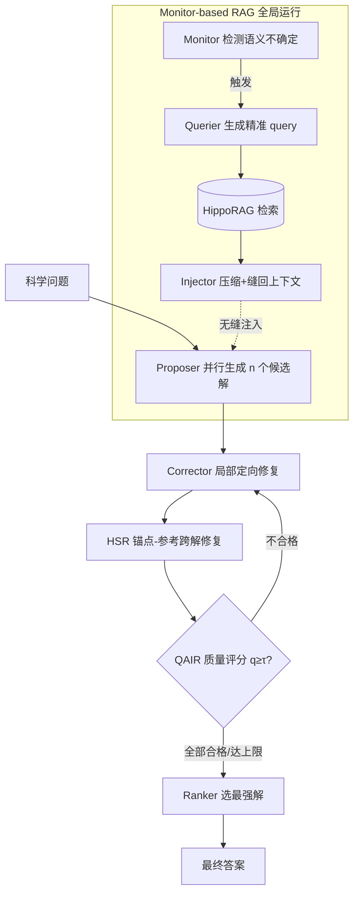

# Eigen-Agent: Adaptive Multi-Agent Scientific Reasoning with Monitor-Based RAG

**会议**: ICLR 2026  
**OpenReview**: [https://openreview.net/forum?id=bGtmGTbmaz](https://openreview.net/forum?id=bGtmGTbmaz)  
**代码**: [https://github.com/tangxiangru/Eigen-1](https://github.com/tangxiangru/Eigen-1)  
**领域**: 信息检索 / 多智能体科学推理  
**关键词**: Monitor-based RAG, 隐式检索, 多智能体, 科学推理, 分层求解精修, 质量感知迭代  

## 一句话总结
Eigen-Agent 用「token 级监控的隐式检索 + 锚点-参考式分层求解精修 + 质量感知迭代」三件套，消掉显式 RAG 打断推理的"工具税"、并避免多智能体把强解平均成弱解，在 HLE Bio/Chem Gold 上拿到 48.3% 的当前最高准确率，同时把 token 用量降 53.5%、agent 步数降 43.7%。

## 研究背景与动机
**领域现状**：LLM 在 MMLU、GPQA 等通用与中等难度推理基准上已表现不错，但一旦进入 Humanity's Last Exam（HLE）这种专家级生物/化学题，准确率断崖式下跌——这类题既要深度领域知识、又要复杂多步推理，恰好踩中现有系统的两个结构性短板。

**现有痛点**：作者在 149 道 HLE Bio/Chem 题上做错误归因，发现两类架构性失败。其一是**显式检索把推理切碎**：现有 RAG（单轮、迭代、reasoning-aware）都要"暂停推理→构造 query→处理结果→重建上下文"，每次检索都打断逻辑流。解一道群体遗传学的 Watterson 估计题要 8-10 次这种打断，agent 步数翻倍、连贯性下降——作者称之为"工具税（tool tax）"。其二是**民主式多智能体稀释强解**：主流多智能体走"生成-批评-综合-选择"的对称流水线，对所有候选一视同仁地平均，把高质量解和低质量解搅在一起，既浪费算力又拉低上限。错误分析进一步显示 92.8% 失败涉及推理错误、88.7% 涉及知识缺口，两者高度重叠——说明知识与推理的失败是纠缠在一起的。

**核心矛盾**：知识注入要"无缝不打断推理"，但显式工具调用天然就是打断；多智能体要"博采众长"，但对称平均反而把好解拖下水。

**本文目标**：在不牺牲推理连贯性的前提下注入外部知识，同时用结构化（而非民主平均）的协作把多个候选解精修成一个高质量解。

**核心 idea**：
- **隐式检索（Monitor-based RAG）**：检索不再是 agent 主动调用的工具，而是一个在 token 级持续盯着推理流、检测到语义不确定时才悄悄注入证据的"哨兵"，从根上消掉工具税。
- **分层而非平均的协作（HSR + QAIR）**：把候选解组织成"锚点-参考"结构做定向修复，再用质量评分驱动的迭代只对不合格解返工，模仿专家协作里"主线想法 + 支撑修补"的层级结构。

## 方法详解

### 整体框架
Eigen-Agent 把全局检索、角色化推理、高层精修统一进一条流水线。底座是 **Monitor-based RAG**：在推理过程中全局运行，Monitor 检测推理流里的知识不足、Querier 把不确定片段转成精准 query、Injector 把检索证据压缩后无缝缝回上下文。在这个底座之上，Proposer 先并行生成多个候选解，Corrector 对每个解做不看其他解的局部定向修复；接着 HSR 引入跨解修复（锚点-参考交互），QAIR 评估整体质量、必要时再唤起 Corrector，最后 Ranker 选出最强解作为答案。Monitor-based RAG 本身与模型无关，原则上可嵌入其他推理系统而无需改架构。

### 关键设计

**1. Monitor-based RAG：把检索从"主动调用"降为"被动注入"，消掉工具税。** 整套隐式检索由三个组件接力。Monitor 像哨兵一样周期性扫描推理轨迹，输出一个二值决策 $\text{Monitor}(\text{context}) \in \{0,1\}$，只在判定"知识不足"时才触发检索；为兼顾时效与开销，它以 512 字符为窗口、128 字符重叠的流式方式滑动检查，保证跨边界的不确定标记不被漏掉又不拉高延迟。一旦触发，Querier 把不确定片段转成一到多个 query $[\text{query}_1,\dots,\text{query}_n]=\text{Querier}(\text{context})$，关键是抽取最小关键词集合来精准刻画不确定点——query 的数量与粒度直接决定召回/精度的权衡，越细粒度越能避免搜索空间膨胀。最后 Injector 先把原始检索结果过滤压缩成"去冗余、聚焦效用"的短证据，再改写并融进 Proposer 的推理上下文 $\text{additional context}=\text{Injector}(\text{context},\text{RAG results})$，保证证据提升准确率却不破坏推理叙事的连贯。以群体遗传学题为例，基线要么自信地记错公式（$\theta=2N_e\mu$）、要么显式检索到正确公式（$\theta=4N_e\mu$）却接不回原推理链；Monitor-based RAG 则检测到不确定后直接把正确公式注入推理流，让求解一路走到正确答案。

**2. Hierarchical Solution Refinement（HSR）：用锚点-参考替代民主平均，做定向跨解修复。** HSR 挑战"所有解应等权贡献"的假设。设候选解 $S=\{s_1,\dots,s_n\}$，每次把其中一个解指定为锚点 $s_i$，其余 $R=S\setminus\{s_i\}$ 充当参考；锚点轮转保证每个解都能被同伴修复，避免过早收敛到单一轨迹。形式化为 $s_i'=\text{Refine}(s_i,R)$，其中 $\text{Refine}(\cdot)$ 是 LLM 驱动的多维修复：逻辑补全（填上缺失的推理步或隐含假设）、数值纠正（修算术错误）、方法替换（用更强策略换掉弱策略）、表达精修（在不改实质的前提下提升清晰度）。这样既系统性地修掉锚点弱点，又保住它原有的强处——相比把矛盾候选直接平均（常常传播错误或丢失关键中间步），HSR 把碎片化贡献整合成一致解。

**3. Quality-Aware Iterative Reasoning（QAIR）：质量评分门控的选择性返工，保证收敛。** QAIR 在 HSR 之后引入评估驱动的控制。对每个精修后的解 $s'$，LLM 评估器在逻辑、答案、解释三个维度各打 0-5 分并给出文字改进建议，合成质量分 $q(s')=0.2\cdot q_{\text{logic}}(s')+0.6\cdot q_{\text{answer}}(s')+0.2\cdot q_{\text{explanation}}(s')$——答案维度权重最高，强调最终答案正确性。达到阈值 $\tau=3$ 的解保留，未达标的标记为不合格并送回 Corrector 带建议返工 $\tilde{s}=\text{Corrector}(s',\text{suggestion}(s'))$。设第 $t$ 轮失败解集为 $F_t$，则下一轮只在失败子集上迭代 $E_{t+1}=\{\tilde{s}\mid s'\in F_t\}$，直到全部通过或达到最大轮数 $T_{\max}$。由于不重评已验证的解、只对失败解定向修复，QAIR 在保持逻辑/答案/解释质量的同时高效收敛、避免冗余循环。

## 实验关键数据

### 主实验表格
HLE Bio/Chem（149 题，o3-mini 评判）、SuperGPQA Biology（hard split）、TRQA Literature：

| 模型 | HLE Bio/Chem | SuperGPQA Hard | TRQA |
|---|---|---|---|
| GPT-5 | 22.82 | 61.96 | 50.58 |
| Grok-4 | 30.20 | 66.30 | 46.51 |
| SciMaster (DeepSeek V3.1) | 34.92 | 66.30 | 51.74 |
| **Eigen-Agent (Pass@1)** | **48.30** | **69.57** | **54.65** |
| Eigen-Agent (Pass@5) | 61.74 | 78.26 | 79.07 |

HLE 上 Pass@1 比最强 agent 基线 SciMaster 高 +13.4 分、比最强前沿 LLM（Grok-4）高约 +18 分；三个异质基准（生物/化学/医学）全面领先。

### 消融实验表格
HLE Bio/Chem 全集（149 题）增量搭建（基线为 5 个 Proposer + web 搜索，无 paper RAG）：

| 配置 | 准确率(%) | Tokens(K) | Steps |
|---|---|---|---|
| Baseline（无外部知识 & 无 RAG） | 25.3 | 483.6 | 43.4 |
| + Papers（显式 RAG） | 41.4 | 470.6 | 94.8 |
| + Monitor only | 34.5 | 218.4 | 51.3 |
| + Monitor + Querier | 36.8 | 213.0 | 51.7 |
| + Monitor + Querier + Injector | 40.3 | 229.5 | 53.1 |
| + … + HSR | 43.7 | 214.0 | 52.9 |
| + … + HSR + QAIR（完整） | **48.3** | 218.9 | 53.4 |

对照"组件移除"消融：移除 (Monitor,Querier,Injector) 准确率几乎不变（48.5%）但 token 飙到 461.3K、步数 95.3——说明 Monitor 的价值主要在**省算力**；移除 HSR 降到 44.8%、移除 QAIR 降到 43.7%——说明这两者主要在**提精度**。

### 关键发现
- **工具税量化**：显式 RAG 把准确率从 25.3% 拉到 41.4%，但 agent 步数从 43.4 暴涨到 94.8、token 仍居高；Monitor-based RAG 在同等知识增益下把 token 砍半（470.6K→218.4K）、步数砍半（94.8→51.3）。
- **瓶颈在融合而非查询**：Querier 单加只带来 36.8% 的小幅提升，说明主要瓶颈不在 query 形成，而在证据整合（由 Injector 解决，提到 40.3%）。
- **检索后端**：在 Vanilla / Vanna / HippoRAG / LightRAG 四种后端里，HippoRAG 因细粒度检索 + 图结构索引最契合不确定检测，被选为默认。
- **多样性二分**：检索类任务受益于解的多样性，推理类任务偏好共识——一致性分数与准确率呈强正相关（信息检索类 r=0.881，推理类 r=0.840）。
- **错误纠缠**：错误日志中推理过程错误 92.8%、知识应用错误 88.7%，大量重叠，印证知识与推理失败是一体两面。

## 亮点与洞察
- **"工具税"这个提法很到位**：把显式 RAG 打断推理这一直觉成本，量化成可测的 token / step 开销，并用消融把"省算力"与"提精度"的功劳拆得很清楚（Monitor 省钱、HSR+QAIR 涨分）。
- **隐式检索范式**：token 级监控 + 不确定触发 + 无缝注入，是对 ReAct/IRCoT 这类"显式工具调用"范式的一次干净反向——检索从前台动作降为后台服务。
- **锚点轮转的设计**：HSR 用"每个解轮流当锚点被同伴修"避免了民主平均的稀释，又避免了只精修单一解的过早收敛，是个轻巧但有效的结构化协作机制。
- **数据驱动的协作策略**：用"检索任务要多样、推理任务要共识"的相关性分析反过来指导聚合策略，而非拍脑袋设定，方法论上扎实。

## 局限与展望
- **领域偏窄**：实验集中在生物/化学/医学科学推理，论文也坦承"是否能推广到其他领域"留作展望，跨域泛化尚未验证。
- **依赖强基座与外部组件**：基于 DeepSeek-V3.1（64K 上下文）+ HippoRAG + Serp API，Monitor/Querier/Injector/评估器都是 LLM 驱动，整体对基座能力和外部检索库质量较敏感。
- **Monitor 的触发可靠性**：512/128 字符滑窗的不确定检测是启发式的，漏检或误触发的代价（错过关键知识 vs 多余检索）未做系统鲁棒性分析。
- **QAIR 评分主观**：质量分由 LLM 评估器打，权重（0.2/0.6/0.2）与阈值 $\tau=3$ 为经验设定，评估器自身偏差可能传导到收敛判定。

## 相关工作与启发
- **RAG 演化三范式**：单轮（REALM、RAG、REPLUG）高效但不自适应、迭代（ITER-RETGEN、Self-RAG、FLARE、DRAGIN）改善 grounding 但 API 调用涨 3-5 倍、reasoning-aware（Chain-of-Note、RAT、IRCoT、ReAct）耦合更紧但仍靠显式调用——本文用 token 级隐式注入补上"连续性 + 效率"两格。
- **多智能体推理**：民主协作（SciMaster、LLM-Debate、MetaGPT、CAMEL）等权对待候选、易在弱解上浪费算力；结构化推理（ToT、GoT、Everything-of-Thoughts）富表达但缺质量感知；HSR/QAIR 用锚点-参考 + 质量门控填补"分层 + 自适应深度"的空白。
- **声明式 vs 过程式**：相比 DSPy 在编译期把任务编成 prompt program（stage 级自适应），本文是运行期的过程式控制（Monitor/Querier/Injector 推理时动态调整），换来更细粒度的自适应与无缝知识注入。
- **启发**：把"工具调用"重新设计成"后台服务"的思路，可迁移到任何需要边推理边补知识的 agent 系统；"按任务类型切换多样性/共识聚合策略"也值得在通用多智能体框架里复用。

## 评分
- **新颖性**: ⭐⭐⭐⭐ — Monitor-based 隐式 RAG 把检索从前台工具调用反转为后台 token 级注入，"工具税"概念 + 锚点轮转的 HSR 都有清晰的范式新意。
- **实验充分度**: ⭐⭐⭐⭐ — 三个异质基准 + 增量/移除双向消融 + token/step 量化 + 检索后端对比 + 多样性相关性分析，把每个组件的功劳拆得很清楚；扣分在领域局限于科学推理。
- **写作质量**: ⭐⭐⭐⭐ — 动机用真实错误案例驱动、图表（框架图/案例图/错误分布）信息量大、消融解读到位，逻辑顺畅。
- **价值**: ⭐⭐⭐⭐ — HLE Bio/Chem 上 48.3% 创纪录且 token 砍半，对"高效科学推理 agent"有直接落地价值，代码开源；跨域泛化待验证。

<!-- RELATED:START -->

## 相关论文

- [\[ACL 2026\] MASS-RAG: Multi-Agent Synthesis Retrieval-Augmented Generation](../../ACL2026/information_retrieval/mass-rag_multi-agent_synthesis_retrieval-augmented_generation.md)
- [\[ACL 2025\] MAIN-RAG: Multi-Agent Filtering Retrieval-Augmented Generation](../../ACL2025/information_retrieval/main-rag_multi-agent_filtering_retrieval-augmented_generation.md)
- [\[ACL 2026\] End-to-End Optimization of LLM-Driven Multi-Agent Search Systems via Heterogeneous-Group-Based Reinforcement Learning](../../ACL2026/information_retrieval/end-to-end_optimization_of_llm-driven_multi-agent_search_systems_via_heterogeneo.md)
- [\[AAAI 2026\] Mem-PAL: Towards Memory-based Personalized Dialogue Assistants for Long-term User-Agent Interaction](../../AAAI2026/information_retrieval/mem-pal_towards_memory-based_personalized_dialogue_assistants_for_long-term_user.md)
- [\[ICLR 2026\] MergePRAG: Orthogonal Merging of Passage-experts for Multi-hop Parametric RAG](mergeprag_orthogonal_merging_of_passage-experts_for_multi-hop_parametric_rag.md)

<!-- RELATED:END -->
