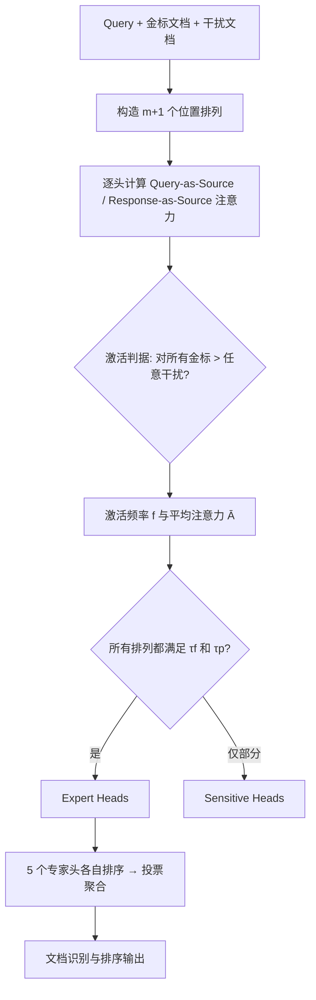

# Expert Heads: Robust Evidence Identification for Large Language Models

**会议**: ICLR 2026  
**OpenReview**: [https://openreview.net/forum?id=rdKL5Uxyim](https://openreview.net/forum?id=rdKL5Uxyim)  
**代码**: [Xuan-Van/ExpertHead](https://github.com/Xuan-Van/ExpertHead)  
**领域**: 信息检索 / 注意力可解释性  
**关键词**: 注意力头、证据识别、位置敏感、文档排序、幻觉检测  

## 一句话总结
通过在文档排列扰动下统计注意力分布，作者发现一小撮"专家头（Expert Heads）"无论金标文档放在哪里都稳定地把注意力压在它身上，并把这些头的投票用作零训练的文档检索与排序信号，在 HotpotQA / 2Wiki / MuSiQue 上大幅超过稠密检索器。

## 研究背景与动机
**领域现状**：LLM 在多文档推理（RAG、多跳 QA）上能力很强，但一个臭名昭著的毛病是"位置敏感"——同样的证据放在上下文开头/结尾就被注意到，塞进中间就被忽略（即 lost-in-the-middle）。已有工作多停留在现象观察或外部重排，缺乏对"模型内部到底哪个部件在负责找证据"的机理刻画。

**现有痛点**：作者把位置敏感的根子追到注意力机制本身——大量注意力头过度关注序列边界，对上下文中段的关键内容关注不足。如果整体注意力都被位置偏置污染，那么基于"哪个 token 注意力最高"的朴素证据定位就不可靠。

**核心矛盾**：注意力是位置敏感的，但模型有时又确实能正确推理。这说明并非所有头都被位置带偏——**一定存在某些头对位置免疫、专注于任务相关证据**。问题在于能否可靠地把它们从几百上千个头里挑出来，并加以利用。

**本文目标**：形式化定义并稳定识别这批"抗位置扰动、专注金标文档"的注意力头，刻画它们在不同架构里的分层规律，并验证它们能否作为可解释、低开销的证据识别与排序信号。

**核心 idea**：（1）**用排列扰动做探针**——把金标文档插到不同位置，统计每个头的激活；（2）**严格激活判据**——要求一个头对"所有"金标的注意力都高于"任意"干扰项，而非简单取 top-attention，从而剔除位置假象；（3）**跨排列稳定性筛选**——只有在所有排列下都满足判据的头才晋升为 Expert Head。

## 方法详解

### 整体框架
给定一个 query、若干干扰文档和金标文档，作者只改变金标文档相对干扰项的插入位置，构造 $m+1$ 个排列；对每个排列、每个注意力头，分别从"问句视角（Query-as-Source）"和"回答视角（Response-as-Source）"计算它对各文档的平均注意力，判断是否"激活"；再用激活频率与平均注意力两项统计量在所有排列上做稳定性筛选，得到 Sensitive Heads（至少一个排列满足）与 Expert Heads（所有排列都满足）。最后让选出的 5 个 Expert Head 各自对候选文档按注意力打分排序，投票聚合成最终文档排名。

### 关键设计

**1. 双视角注意力源：把"看重什么"和"用到什么"分开** 作者意识到证据识别在"理解阶段"和"生成阶段"行为不同，于是对任意文档 $D$ 定义两类注意力源。Query-as-Source 度量 query token 对文档的平均注意力 $A^{(l,h)}_{Q\to D}=\frac{1}{|Q||D|}\sum_{q\in Q}\sum_{d\in D}A^{(l,h)}_{q,d}$，反映模型在理解上下文时"认为哪些内容重要"；Response-as-Source 则把求和主体换成生成的回答 token $R$，捕捉"生成答案时实际用到了哪些证据"。实测发现 Query 视角激活的头更少但更集中，Response 视角参与的头更多但更分散——前者像聚光灯，后者像泛光灯，两者合起来给出从理解到生成的完整画像。

**2. 严格激活判据：用"全压制"而非"取最高"剔除位置假象** 朴素做法是看哪个头注意力最高，但这极易被边界位置的位置偏置骗到。作者改用一个更苛刻的二元判据：一个头 $(l,h)$ 在排列 $\pi$ 下被判为激活，当且仅当它对"每一个"金标文档的注意力都严格大于"任意一个"干扰文档，即 $A^{(l,h)}_{\text{src}\to G_j}>A^{(l,h)}_{\text{src}\to D_i},\ \forall j,\forall i$。这个"对所有金标都赢、对所有干扰都赢"的条件天然排除了那些只是因为文档恰好在边界而注意力虚高的头，保证激活反映的是真正的任务相关性。

**3. 频率 × 强度双统计量加跨排列稳定性筛选** 在激活判据之上，作者用两个互补统计量量化一个头的可靠性与专注度：激活频率 $f^{(l,h)}_\pi=\frac{1}{|S|}\sum_{s\in S}\text{Activated}(l,h)^{\pi,s}_{\text{src}}$ 衡量它在多少样本上被激活（一致性），平均注意力 $\bar{A}^{(l,h)}_\pi$ 衡量它在激活样本上压给金标文档的注意力均值（专注度）。设阈值 $\tau_f=0.6$（激活率 >60%）与 $\tau_p=0.9$（注意力进入 top 10% 分位）。只要某一个排列同时过两关就是 Sensitive Head；**只有在所有排列下都过两关**才晋升 Expert Head——正是"所有排列都成立"这一全称量词把抗位置扰动作为硬约束写进了定义，从而筛出真正对位置免疫的稳定头。

**4. 专家头投票：把可解释信号直接变成零训练检索器** 识别出来的 Expert Head 不只是分析对象，还能直接干活。固定每个设置选 5 个专家头，给定 query 和候选文档，每个专家头按它从 query 到各候选文档的注意力分数独立产生一个排名，再对 5 个排名做投票聚合得到最终文档排序。整个过程不更新任何参数、不训练额外模型，开销极小，却把"哪些头最可靠"这一可解释性发现转化为一个即插即用的证据识别与排序模块。

## 实验关键数据

### 主实验表格
三个多跳 QA 数据集上的文档识别与排序（每条 query 含 2 金标 + 8 干扰，指标 P@2 / NDCG@2 / MAP），节选 LLaMA-3-8B 与代表性 baseline：

| 方法 | HotpotQA P@2 | HotpotQA NDCG@2 | 2Wiki P@2 | MuSiQue P@2 |
|---|---|---|---|---|
| BM25 | 57.47 | 50.23 | 52.77 | 49.30 |
| BGE（最强稠密检索 baseline） | 75.23 | 69.45 | 77.12 | 70.25 |
| LLM Rank（LLaMA 直接排序） | 66.31 | 70.06 | 76.49 | 69.63 |
| **Expert Heads (Q)** | 88.23 | 89.97 | 73.47 | 82.18 |
| **Expert Heads (R)** | **90.72** | **91.98** | 77.30 | 83.57 |

Response 视角的专家头在 HotpotQA 上把 P@2 从最强 baseline BGE 的 75.23 拉到 90.72，全面碾压稠密检索器与 LLM 直接排序；Mistral、Qwen 上呈现同样趋势（Response 视角普遍优于 Question 视角）。

### 消融实验表格
在 LLaMA-3-8B / HotpotQA 上做层级与阈值消融：

| 消融维度 | 发现 |
|---|---|
| 逐层（把某层所有头当专家头） | 中间层贡献最大，低层作用有限，**最后一层反而显著掉点**（模型已转向准备生成下一 token） |
| 阈值敏感性 | 阈值越严，选出的专家头越少，但性能不降反升——更严的筛选过滤掉低信息头，留下更专业的子集 |
| 专家头数量 | 即使只用很小一撮专家头也能拿到稳健增益 |

### 关键发现
- **架构特异的分层规律**：LLaMA / Mistral 的专家头集中在中间层（负责语义整合），Qwen 的专家头集中在更深层（专注证据选择）。
- **激活强度 ↔ 答案正确性**：答对时专家头激活更频繁、注意力更集中；答错时激活减弱、注意力发散，导致证据整合不足与幻觉——这为实时幻觉检测提供了诊断信号。
- **理解 vs 生成的功能漂移**：Query 视角专家头是 Response 视角的更聚焦子集，说明生成阶段会调动更大一群头做证据整合，但核心专家头始终保持锐利聚焦。

## 亮点与洞察
- **把"位置敏感"从黑盒现象做成了可定位部件**：用排列扰动 + 全称量词稳定性筛选，给出"抗位置免疫头"的可操作定义，机理刻画扎实。
- **可解释性直接变现为零训练检索器**：5 个头投票就超过 BGE、ColBERTv2 等专门训练的稠密检索器，且无需任何额外训练，开销几乎为零。
- **一份信号多处复用**：专家头激活强度同时是检索排序信号、幻觉检测信号，还能指导上下文剪枝、蒸馏与 RLHF reward 设计，外延广。
- **严格判据的工程智慧**："对所有金标赢、对所有干扰赢"这一苛刻条件，巧妙地把位置假象从激活统计里剔除，比朴素 top-attention 干净得多。

## 局限与展望
- **金标监督依赖**：专家头的识别需要已知金标/干扰标注（来自 HotpotQA 训练集），在没有标注的真实 RAG 场景如何无监督定位专家头尚未解决。
- **任务与文档规模有限**：实验固定为 2 金标 + 8 干扰的多跳 QA 设定，专家头是否在更长上下文、更多金标、非 QA 任务上同样稳定有待验证。
- **只评检索/排序、未端到端验证下游收益**：作者刻意避开 QA accuracy 以隔离注意力贡献，但专家头投票重排后对最终生成质量、幻觉率的端到端提升只在 Discussion 中展望，未给硬实验。
- **专家头数量与阈值需按模型手调**：每个模型的层级分布不同，迁移到新架构需重新做排列扰动分析。

## 相关工作与启发
- **Lost-in-the-middle / 位置敏感**（Liu et al. 2023 等）：本文是对该现象的机理级回答——不是模型整体失效，而是大多数头被位置带偏、少数头免疫。
- **注意力头功能解剖**（induction heads、retrieval heads 等机理可解释性脉络）：Expert Heads 可视为"证据检索头"的严格化、可量化版本，并首次系统比较了 LLaMA/Mistral/Qwen 的分层差异。
- **检索与重排**（BM25、DPR、Contriever、ColBERTv2、BGE）：本文提供了一条"不训练、用模型自身注意力做检索"的新路径，对长上下文剪枝与 RAG 重排有直接启发。
- **幻觉检测**：用内部注意力激活作为 factuality 诊断信号，呼应了"基于内部状态检测幻觉"的研究方向，且信号更细粒度（精确到具体头）。

## 评分
- 新颖性: ⭐⭐⭐⭐ — "排列扰动 + 全称量词稳定性"定义专家头、并把可解释发现直接当零训练检索器用，角度新且自洽。
- 实验充分度: ⭐⭐⭐⭐ — 三模型 × 三数据集主实验 + 层级/阈值/数量消融较完整，但缺端到端下游 QA 验证、文档规模偏小。
- 写作质量: ⭐⭐⭐⭐ — 现象→定义→分析→应用层层递进，图表清晰，公式与判据交代到位。
- 价值: ⭐⭐⭐⭐ — 同一信号横跨检索、幻觉检测、上下文剪枝、蒸馏与 RLHF，机理与实用性兼具，外延价值高。

<!-- RELATED:START -->

## 相关论文

- [\[ICLR 2026\] MLP Memory: A Retriever-Pretrained Memory for Large Language Models](mlp_memory_a_retriever-pretrained_memory_for_large_language_models.md)
- [\[ICLR 2026\] TokMem: One-Token Procedural Memory for Large Language Models](tokmem_one-token_procedural_memory_for_large_language_models.md)
- [\[ICLR 2026\] Query-Level Uncertainty in Large Language Models](query-level_uncertainty_in_large_language_models.md)
- [\[ICLR 2026\] DeepRAG: Thinking to Retrieve Step by Step for Large Language Models](deeprag_thinking_to_retrieve_step_by_step_for_large_language_models.md)
- [\[ACL 2026\] How Large Language Models Balance Internal Knowledge with User and Document Assertions](../../ACL2026/information_retrieval/how_large_language_models_balance_internal_knowledge_with_user_and_document_asse.md)

<!-- RELATED:END -->
