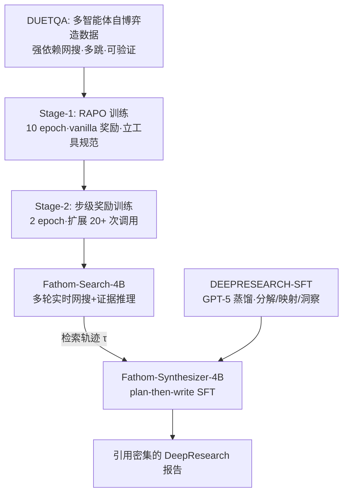

# Fathom-DeepResearch: Unlocking Long Horizon Information Retrieval and Synthesis for SLMs

**会议**: ICLR 2026  
**OpenReview**: [https://openreview.net/forum?id=FS1KoskTtD](https://openreview.net/forum?id=FS1KoskTtD)  
**代码**: [https://github.com/FractalAIResearchLabs/Fathom-DeepResearch](https://github.com/FractalAIResearchLabs/Fathom-DeepResearch)  
**领域**: information retrieval / agentic RL  
**关键词**: DeepResearch、工具增强 RL、多轮检索、GRPO、步级奖励、报告合成  

## 一句话总结
用两个 4B 小模型搭出一套开源 DeepResearch 系统——Fathom-Search-4B 负责多轮实时网搜与证据推理（可稳定超过 20 次工具调用），Fathom-Synthesizer-4B 负责把检索轨迹合成为引用密集的研究报告——靠 DUETQA 数据集、RAPO 优化算法和可操控的步级奖励，把开源 DeepSearch 推到逼近闭源系统的水平。

## 研究背景与动机
- **领域现状**：工具集成推理（tool-integrated reasoning）让 LLM 能自主调用搜索、浏览网页，DeepResearch Agent 在开放式信息检索任务上展现超人表现，但 OpenAI/Gemini DeepResearch 等强者都是闭源的。
- **现有痛点**：开源框架与闭源之间存在巨大鸿沟，集中在四点——(1) **GRPO 在多轮工具交互中训练不稳定**：外部工具返回的文本会让策略分布漂移、解码崩坏，组内相对优势饱和导致梯度爆炸；(2) **奖励黑客与低效工具调用**：只用末端正确性稀疏奖励时，agent 会塌缩成重复刷同样的工具调用，且 RL 只是放大 SFT 先验、对认知行为缺乏可控性；(3) **训练数据信息不确定性低**：TriviaQA/HotpotQA 这类数据用模型参数知识或少量查询就能答，暴露不出真实网络噪声检索难度，现有合成方案又昂贵脆弱；(4) **开放式查询难处理**：现有工作偏闭式问答，缺乏对无标准答案、需多视角综合的信息合成能力。
- **核心矛盾**：要让小模型（SLM）在长时序、高不确定性的信息检索上既"敢用工具"又"用得高效"，但稀疏奖励 + GRPO 既不稳又会诱发刷工具，且缺乏既要检索深度又要合成质量的端到端方案。
- **本文目标**：构建端到端开源 DeepSearch+合成系统，稳定地把工具调用扩展到 20+ 次，并可显式操控探索/验证行为，同时补齐开放式报告合成能力。
- **核心 idea**：**「数据 + 算法 + 奖励 + 合成」四件套**——用多智能体自博弈造强依赖网搜的数据（DUETQA），用零开销改造的 RAPO 稳住多轮 RL，用可操控步级奖励治理奖励黑客并调控检索广度/深度/时长，再用 plan-then-write 的合成器把轨迹变成带引用的报告。

## 方法详解

### 整体框架
系统由两个从 Qwen3-4B 训练出的专用模型组成：**Fathom-Search-4B**（DeepSearch，靠实时网搜做证据推理）+ **Fathom-Synthesizer-4B**（把多轮检索轨迹合成为引用密集的报告）。Search 模型的训练串联三项进展：DUETQA 数据集 → RAPO 稳定多轮 RLVR → 步级奖励两阶段塑形；Synthesizer 模型则用 DEEPRESEARCH-SFT 语料按 plan-then-write 协议蒸馏。

### 关键设计

**1. DUETQA：多智能体自博弈造"必须联网才能答"的数据。** 现有数据集要么靠参数知识就能答，要么少量查询即可短路多跳推理。DUETQA 用三模型分工生成可验证 QA 对：M1(O3)、M2(O4-mini) 作为带搜索的代理爬虫负责出题与独立验证，M3(GPT-4o) 作为无搜索模型负责改写混淆与做基线验证器。两种生成模式——Mixture of Themes（从 200+ 主题分类里采 $k\in[5,7]$ 个主题、各自检索近期/冷门事实再串成多跳链）和 Seeded Question（基于 100 题种子库改写）——并强制至少一跳引用 2024 年之后的信息，保证 $P(a\mid q, M_{\text{no-search}})\ll P(a\mid q, M_{\text{search}})$。再做混淆 pass（粗化日期、把精确数值降为定性、把命名实体换成间接描述）抹掉表面线索，最后只保留"两个带搜索模型答案一致且无搜索基线失败"的样本，确保网搜不可或缺。最终开源 4,889 条高质量样本。

**2. RAPO：零开销改造 GRPO，治多轮训练崩溃。** GRPO 里组内奖励标准差 $\sigma_R$ 决定优势信号强度，当一组 rollout 全成功（饱和）或全失败（级联错误）时 $\sigma_R=0$，优势消失、梯度范数收缩、更新失稳。RAPO 在不增加任何 rollout 成本的前提下叠三招：**数据集剪枝**——按 $\text{SolveRate}(q)=\frac{1}{G}\sum_i \mathbb{1}[R_i>0]$，对 $\ge 0.9$ 的题在 epoch 末丢弃，隐式形成"越练越难"的课程；**优势缩放**——当一个 batch 里只有少数组有信息时，把 Good 组的 token 级优势按频率反向放大 $\tilde A_{i,t}=\frac{G}{G_{\text{good}}}\hat A_{i,t}$，避免梯度被稀释又不像 DAPO 那样要昂贵重采样；**回放缓冲**——每题维护一个存最近成功轨迹（$R(q,o^\star)>0.5$）的 buffer，若当前 epoch 全失败则随机替入 $o^\star$，重新注入方差、恢复组相对优势并锚定到高质量低熵参考、抑制轨迹无序膨胀。

**3. 可操控步级奖励：治奖励黑客 + 调控检索行为。** vanilla 奖励 $r_i=0.1\cdot R_i^{\text{format}}+0.9\cdot R_i^{\text{answer}}$ 只看末端正确性，会诱导刷重复工具调用。本文让正确性分支依赖每次调用的"认知行为 + 边际效用"标签（由 GPT-4.1 判官给每个工具调用分类）：搜索调用分 UNIQUESEARCH / REDUNDANTSEARCH，网页查询分 EXPLORATION / VERIFICATION（每条声明限 $B_v$ 次交叉验证）/ REDUNDANTQUERY。据此定义冗余率 $\rho=\frac{n_{\text{redS}}+n_{\text{redQ}}}{T}$ 与新颖增量 $\Delta_S=n_{\text{uniqS}}-n_{\text{redS}}$、$\Delta_Q=n_{\text{uniqQ}}-n_{\text{redQ}}$，奖励为：答对时 $r_i=0.1 R_i^{\text{format}}+\max((1-\rho),0.5)$（即便答对也罚冗余、逼效率）；答错时 $r_i=0.1 R_i^{\text{format}}+c_1\min(1,\frac{\Delta_S}{C_S})+c_2\min(1,\frac{\Delta_Q}{C_Q})$（给真正非冗余的探索行为补偿信用）。取 $c_1=c_2=0.2$ 保证错的 $\le 0.5$、对的 $\ge 0.5$（**单调性**：错的奖励永不超过对的）；$C_S,C_Q$ 控新颖性饱和阈值、$B_v$ 控验证深度，三个旋钮可显式调检索的广度、深度与时长（实验取 $C_S=8,C_Q=16,B_v=1$）。

**4. Fathom-Synthesizer-4B：plan-then-write 合成引用密集报告。** 在 Qwen3-4B 上用 SFT，把 Search 模型的多跳轨迹转成决策级、引用密集的报告。先在私有 `<think>` 块里做规划 $\pi=(\pi_{\text{decomp}},\pi_{\text{map}},\pi_{\text{insight}})$——问题分解为有序子问题作报告骨架、把每条证据（URL/引文/表/图）映射到对应章节、指定洞察分析策略，再生成公开报告 $r$（Executive Summary + 按子问题组织的正文 + 去重的 Sources 列表），引用严格只来自 Search 阶段探索过的 URL，章节级引用还受 $\pi_{\text{map}}$ 约束以提升引用准确性。训练语料 DEEPRESEARCH-SFT 由 GPT-5 蒸馏 2,500 条开放式问题；因检索轨迹超出 Qwen3-4B 原生 40,960 token 窗口，用 YaRN RoPE 缩放（factor=2.0）把有效窗口扩到 65,536 token。

## 实验关键数据

### 主实验表格
Fathom-Search-4B 在 5 个 DeepSearch 基准 + 4 个通用推理基准上的准确率（%）：

| 模型 | SimpleQA | FRAMES | WebWalker | Seal0 | Musique | DS 均值 | HLE | AIME-25 | GPQA-D | MedQA | GR 均值 |
|---|---|---|---|---|---|---|---|---|---|---|---|
| o3 (with search, 闭源) | 96.0 | 86.8 | 57.0 | 49.5 | 51.2 | **68.1** | 27.4 | 88.9 | 85.4 | 95.4 | 74.3 |
| GPT-4o (with search, 闭源) | 84.4 | 63.7 | 31.6 | 15.3 | 37.5 | 46.5 | 4.3 | 71.0 | 53.0 | 88.2 | 54.1 |
| WebSailor-3B | 87.1 | 44.4 | 52.2 | 9.0 | 27.4 | 44.0 | 7.4 | 40.0 | 45.5 | 51.3 | 36.0 |
| II-Search-4B | 88.2 | 58.7 | 40.8 | 17.1 | 31.8 | 47.3 | 7.4 | 60.0 | 51.5 | 72.1 | 47.8 |
| **Fathom-Search-4B (Stage-1)** | 88.1 | 57.2 | 39.0 | 19.8 | 31.3 | 47.1 | 6.7 | 60.0 | 55.6 | 75.4 | 49.4 |
| **Fathom-Search-4B (Stage-2)** | **90.0** | **64.8** | **50.0** | **22.5** | **33.2** | **52.1** | 9.5 | 70.0 | 60.1 | 75.4 | **53.8** |

DeepResearch-Bench 报告生成（开放式）：Fathom-DeepResearch Overall 45.47，超过 Perplexity-DeepResearch(42.25)、Grok Deeper Search(40.24) 等多数闭源系统，Depth 45.14 仅次于 Gemini-2.5-Pro DeepResearch。

### 消融实验表格
RAPO vs GRPO（Stage-1）与 步级奖励 vs vanilla（Stage-2）：

| 配置 | SimpleQA | FRAMES | WebWalker | Seal0 | Avg. Tokens |
|---|---|---|---|---|---|
| GRPO | 87.8 | 55.2 | 33.8 | 14.4 | 9,000 |
| **RAPO** | 88.1 | 57.2 | 39.0 | **19.8** | **5,000** |
| Vanilla Reward (Stage-2) | 88.2 | 58.2 | 43.2 | 21.6 | 5,500 |
| **步级奖励 (Stage-2)** | **90.0** | **64.8** | **50.0** | **22.5** | 14,500 |

### 关键发现
- **RAPO 又准又省**：相比 GRPO，Seal0 提升 5.4 个点且平均 token 从 9,000 降到 5,000——GRPO 把响应越练越长但只是刷冗余工具调用，准确率不涨；RAPO 更稳更高效。
- **步级奖励换深度**：Stage-2 用步级奖励后 token 从 5,500 涨到 14,500，但换来 WebWalker +6.8、FRAMES +6.6 的实质提升，是"受控的长时序检索"而非冗余膨胀。
- **小模型逼近闭源**：两个 4B 模型组成的系统在开源类别 SOTA，多项指标逼近甚至超过 GPT-4o(with search)。

## 亮点与洞察
- **把"奖励黑客"显式拆成可标注的认知行为**：UNIQUE/REDUNDANT × SEARCH/QUERY 四类标签，让"是否真在探索"变成可计分量，从根上区分"有效检索"与"刷工具"。
- **RAPO 全部零额外 rollout 成本**：剪枝/缩放/回放都在已有 rollout 上做文章，工程上极易嫁接到任何 GRPO 流水线。
- **三旋钮可操控检索**：$C_S,C_Q,B_v$ 让研究者能显式调检索的广度、深度、验证强度，把"长时序工具使用"从黑盒变成可控变量。
- **合成与检索解耦**：Search 出轨迹、Synthesizer 出报告，plan-then-write 把引用严格锚到探索过的 URL，兼顾事实性与可读性。

## 局限与展望
- **RAPO 测试时扩展有限**：回放缓冲靠轨迹替换锚定低熵轨迹，虽防崩溃但也阻碍向更长推理时长适配——Stage-2 若没有步级奖励，vanilla 奖励在 6,000 token 前就饱和。
- **同步训练流水线脆弱**：当前依赖同步训练，规模化时效率低、鲁棒性差，作者指出转向异步框架是自然的下一步。
- **判官依赖强模型**：步级奖励标签由 GPT-4.1 判官打、数据由 O3/O4-mini/GPT-5 造，蒸馏质量受教师模型上限约束。

## 相关工作与启发
- **DeepResearch 系**：OpenAI/Gemini DeepResearch（闭源标杆）、Kimi-Researcher、Doubao-DeepResearch、LangChain Open-DeepResearch——本文是开源端少有的"检索+合成"端到端方案。
- **工具 RL / RLVR**：GRPO(Shao et al.)、DAPO(Yu et al.)、RECALL（训练框架基座）；本文把 GRPO 在多轮工具场景的失稳问题正面解决。
- **DeepSearch 数据合成**：WebSailor 的 SailorFog-QA、SimpleDeepResearcher，本文 DUETQA 用多智能体自博弈 + 时间约束 + 跨模型一致性验证，强制网搜依赖。
- **启发**：奖励设计可以"行为级"而非只"结果级"——把中间步骤的边际效用显式标注计分，是治理长时序 agent 奖励黑客的通用思路。

## 评分
- 新颖性: ⭐⭐⭐⭐ RAPO 的三招零开销组合与"认知行为+边际效用"步级奖励都很有针对性，DUETQA 的自博弈+时间约束造数据也巧。
- 实验充分度: ⭐⭐⭐⭐ 9 个基准 + DeepResearch-Bench，RAPO/步级奖励双消融清晰，token 效率对比有说服力。
- 写作质量: ⭐⭐⭐⭐ 痛点→方法→实验逻辑顺畅，公式与符号定义到位；部分细节（判官分类规则）稍密。
- 价值: ⭐⭐⭐⭐ 全套开源（模型+数据+算法），把开源 DeepResearch 推到逼近闭源，复现与落地价值高。

<!-- RELATED:START -->

## 相关论文

- [\[ICLR 2026\] Long-Document QA with Chain-of-Structured-Thought and Fine-Tuned SLMs](long-document_qa_with_chain-of-structured-thought_and_fine-tuned_slms.md)
- [\[ICLR 2026\] AMemGym: Interactive Memory Benchmarking for Assistants in Long-Horizon Conversations](amemgym_interactive_memory_benchmarking_for_assistants_in_long-horizon_conversat.md)
- [\[ICLR 2026\] Improving Semantic Proximity in Information Retrieval through Cross-Lingual Alignment](improving_semantic_proximity_in_information_retrieval_through_cross-lingual_alig.md)
- [\[ACL 2026\] BRIEF-Pro: Universal Context Compression with Short-to-Long Synthesis for Fast and Accurate Multi-Hop Reasoning](../../ACL2026/information_retrieval/brief-pro_universal_context_compression_with_short-to-long_synthesis_for_fast_an.md)
- [\[ICLR 2026\] Beyond RAG vs. Long-Context: Learning Distraction-Aware Retrieval for Efficient Knowledge Grounding](beyond_rag_vs_long-context_learning_distraction-aware_retrieval_for_efficient_kn.md)

<!-- RELATED:END -->
