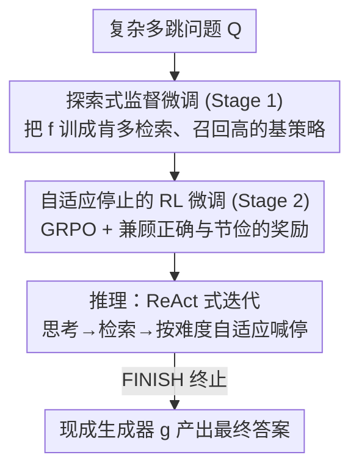

# FrugalRAG: Less is More in RL Finetuning for Multi-hop Question Answering

**会议**: ICLR 2026  
**OpenReview**: [https://openreview.net/forum?id=uQKtwdJN0o](https://openreview.net/forum?id=uQKtwdJN0o)  
**代码**: 待确认  
**领域**: 信息检索 / RAG / 多跳问答  
**关键词**: 检索增强生成、多跳问答、强化学习微调、自适应检索、测试时计算

## 一句话总结
FrugalRAG 提出一个"先探索、后节俭"的两阶段微调框架：第一阶段用监督微调把小模型训成一个肯多发检索查询、把证据召回拉满的探索型策略，第二阶段用 GRPO 强化学习让它学会"按问题难度决定什么时候停手"，结果在 HotPotQA 等多跳问答上只用 1000 条训练样本就把检索次数砍掉近一半、还保住甚至提升了答案准确率。

## 研究背景与动机
**领域现状**：多跳问答（multi-hop QA）的主流范式是检索增强生成（RAG）——语言模型把复杂问题拆成一连串子查询（sub-query），每发一次子查询就检索一批文档、再据此推理出下一个子查询，如此迭代直到能回答原问题。近期 DeepSeek-R1 等工作把强化学习（RL）用在数学、代码这类重推理任务上取得了大进展，自然有人想把同一套"以最终答案为奖励"的 RL 搬到 RAG 上。

**现有痛点**：作者发现这条路在多跳问答上收效甚微。一个朴素的 ReAct 策略（让模型最多发 10 条子查询）在 HotPotQA 上的文档召回（63%）反而高于 Search-R1 这类 SOTA RL 方法。也就是说，多跳问答的瓶颈根本不是"推理步数不够"，而是"检索步数没用在刀刃上"——大多数问题理想情况下 2-3 次检索就够，可现有 RL 方法要么死板地用固定预算、要么一味多检索拉长延迟。更麻烦的是数据成本：SelfRAG、CoRAG、Search-R1 这些方法动辄要 90k–100k 条带标注的问答样本，而真实业务场景（私有文档库）里根本拿不到这么多"问题→正确答案"的标注。

**核心矛盾**：覆盖（recall，多检索几次总能召回更多证据）与效率（少检索几次、低延迟）之间存在直接的 trade-off；而现有 RL 把两件事糅在一个目标里端到端优化，训练极不稳定——模型要么过度检索、要么过早停手。

**本文目标**：(1) 训一个能"按需检索、用尽量少的检索次数答对题"的模型；(2) 只用 1000 条训练样本（比现有工作少一个数量级）；(3) 不依赖最终答案标注，只用真值文档（ground-truth documents）做监督。

**切入角度**：作者的关键观察是——"覆盖"和"何时停"应该用不同手段学。覆盖只要让基模型反复发高质量查询（ReAct 框架）就能自然拿到，不需要 RL；而"何时停"涉及对不同 rollout 长度的比较与权衡，这正是 RL 信号最擅长的事。

**核心 idea**：把 RAG 拆成"探索阶段"和"答案生成"两条线，用 RL 不去增加推理步数、而是去优化推理步数——先监督微调出一个肯探索、召回高的基策略，再用 RL 在其上学会自适应剪掉冗余检索深度。

## 方法详解

### 整体框架
FrugalRAG 的运行主体是一个"推理器（reasoner）"语言模型 $f$。给定复杂问题 $Q$，在第 $h$ 跳（$1 \le h \le B$，$B$ 是最大跳数预算），$f$ 看着当前上下文产出一个 "思考–动作–查询" 三元组 $(T_h, A_h, S_h)$：查询 $S_h$ 被送进检索器 $R(\cdot)$ 返回文档 $D_h = R(S_h)$；上下文不断累积 $\{Q\} \cup \{(D_h, T_h, A_h, S_h)\}$，直到 $f$ 输出特殊的 FINISH 动作在第 $h_{\text{term}}$ 跳终止（或撞到预算 $B$）。终止后，另一个**现成的、不参与训练的**生成器 $g$ 根据问题 $Q$ 和累积上下文产出最终答案。把检索/推理（$f$）与答案生成（$g$）解耦，是为了证明效果来自检索策略本身、而非偷偷训练生成器。

整个训练分两阶段串行：**Stage 1（探索）** 用监督微调把 $f$ 训成一个尽量多发查询、最大化证据覆盖的基策略 $f_S$；**Stage 2（节俭）** 在 $f_S$ 之上用 GRPO 强化学习，让它学会"证据够了就喊停"，从而按问题难度自适应分配检索次数。训练全程只需真值文档 $Y$（用来算召回作为反馈），不需要最终答案标注。

### 关键设计

**1. 两阶段「探索→节俭」解耦：把"覆盖"和"何时停"分开学**

作者把多跳 RAG 拆成两件性质不同的事，并断言它们要用不同手段学，硬塞进单一 RL 目标里只会训崩（实验里观测到模型不是过度检索就是过早停手）。"覆盖"是个偏确定性的目标——基模型本身只要被允许反复发查询，召回就能上去，因此用监督微调就够；"何时停"则需要在"再多检索一次的成本"和"当前证据的置信度"之间反复权衡、比较不同 rollout 的优劣，这种带比较、带长期回报的决策天然适合 RL。先 SFT 建一个高召回的基策略，再 RL 在其上做"减法"，既稳定又能把两个目标各自优化到位——这正是标题 "Less is More" 的含义：不是用 RL 加推理步数，而是用 RL 优化（裁剪）推理步数。

**2. Stage 1 探索式监督微调：训出一个肯探索、召回拉满的基策略**

针对"现成模型过度自信、不充分探索就抢答"的痛点，Stage 1 不追求效率，专门把召回顶上去。数据构造很轻量：以 ReAct 风格做 rollout，每一跳用 $n$ 个 bootstrapped prompt 采样 $n$ 个候选三元组 $(T_h^i, A_h^i, S_h^i)$，各自检索、丢掉已在上下文里的重复文档，再拿真值标签算召回，把召回最高的那个候选加进下一跳上下文——纯并行、好扩展。关键技巧在于做**两套 run**：一套允许模型自己生成 FINISH 提前结束，另一套禁止 FINISH、必须把预算 $B$ 用满。后者召回更高（因为检索更多），但若直接拿"无 FINISH"策略去做 RL 又没法学"何时停"（因为它从不产生带 FINISH 的轨迹）。于是微调时按 **90% 无 FINISH + 10% 有 FINISH** 的比例混采轨迹，用标准交叉熵训练得到基策略 $f_S$——既把探索/召回的分布拉满，又保证 FINISH 动作仍留在生成分布里供下一阶段调用。整个 Stage 1 只用 1000 条样本。

**3. Stage 2 自适应停止的 RL 奖励：用偏离最优停步点的距离来奖惩**

这是全文最核心的设计，解决"该在第几跳停"。作者先定义**最优停步点** $h^*$：在用 $f_S$ 生成完整 rollout 后，拿真值证据 $Y$ 算文档召回 $c$，$h^*$ 是召回首次达到阈值 $\tau$ 的最小跳数（即"再检索也不涨召回"的拐点）。然后定义归一化偏离

$$\Delta = \frac{|h_{\text{term}} - h^*|}{B}$$

奖励按三种情形分段（Eq. 1）：召回达标（$c \ge \tau$）但停晚了（$\Delta > 0$，late stop）按 $\log\frac{1-\Delta}{\Delta}$ 给惩罚并裁到 $[-R_{\max}, R_{\max}]$；恰好停在 $h^*$（$\Delta = 0$，perfect stop）给 $R_{\max} + \alpha \cdot \frac{h^*}{B}$ 的奖励——这个 bonus 正比于 $h^*/B$，意味着越难（需要越多跳）的问题答对停准时奖励越高；召回没达标（$c < \tau$，early stop）则置 $h_{\text{term}} = B$ 鼓励继续探索而非过早终止。奖励随 $|\Delta|$ 单调下降、在 $h_{\text{term}} = h^*$ 时最大。此外还有一个**格式奖励** $R_f$：输出格式不合规导致检索失败给 $-0.5$、检索成功给 $+0.5$，逐跳平均后与主奖励 $R$ 取均值。优化用 **GRPO**（内存友好），每跳采样 $v$ 个三元组、检索去重文档，按 Eq. 1 算累积奖励回传到 rollout 上的每个 logit。这套奖励的妙处在于：它不奖励"答对"本身（那需要答案标注），而是奖励"在召回够用的前提下停得准"，把效率显式建模成了可优化目标。

**4. 极致数据高效与生成器解耦：只要 1000 样本 + 真值文档**

得益于上面"用召回当反馈、不碰最终答案"的设计，FrugalRAG 全程不需要"问题→答案"标注，只要真值文档 $Y$，且两阶段加起来只用 1000 条样本——比 SelfRAG（150k）、CoRAG/Search-R1（>100k）少两个数量级。再加上答案生成器 $g$ 用现成模型、不参与训练，使得 FrugalRAG 的收益可以干净地归因到"自适应检索策略"上，而不像端到端方法那样可能靠训练生成器刷分。实验也显示换生成器（Qwen2.5-7B→32B→CoRAG）能直接抬高分数，印证了模块化与可迁移性。

### 一个完整示例
以 HotPotQA 上一个问题为例走一遍：推理器 $f_S$ 先发若干子查询广撒网检索，在 Stage 1 训出的探索倾向下平均会发到约 6 次（FrugalRAG-Explore 在 ColBERTv2 上 Searches≈5.99），召回很高（86.4%）但延迟大。经过 Stage 2 的 RL，模型学会在召回达到阈值 $\tau$ 的那一跳（$h^*$ 附近）就输出 FINISH——同一问题平均检索次数压到约 2.05 次，召回小幅回落到 82.8% 但 MBE 反而从 67.70 微升到 68.47。对更难的问题（如 MuSiQue 中需要 4 跳的题），奖励里 $\frac{h^*}{B}$ 的 bonus 会鼓励它多发查询、停得更晚；对 2 跳的简单题则早停。最终在整个开发集上，检索次数与问题难度呈强正相关（2Wiki 上 $r=0.82$，MuSiQue 上 $r=0.95$）。

### 损失函数 / 训练策略
- **Stage 1**：标准交叉熵预测下一个 $(T_h, A_h, S_h)$ 三元组；全参数微调 1 个 epoch，学习率 $2\times10^{-5}$，weight decay 0.01，最大序列长 4096，1000 样本。
- **Stage 2**：GRPO，奖励 = 主奖励 $R$（Eq. 1，含 $R_{\max}$、$\alpha$、阈值 $\tau$）与格式奖励 $R_f$ 的均值，总奖励范围 $[-R_{\max}-0.5,\, R_{\max}+\alpha+0.5]$。
- 基模型 Qwen2.5-7B-Instruct；用 TRL 库，prompt bootstrapping 基于 DsPy。

## 实验关键数据

### 主实验
ColBERTv2 检索器、Qwen2.5-7B-Instruct 作答案生成器下，Stage 2 的 RL 把检索次数砍掉约一半、还略升 MBE：

| 方法 | 数据集 | MBE | Recall | 平均检索次数 |
|------|--------|------|--------|--------------|
| Zero-Shot RAG | HotPotQA | 51.00 | 59.05 | 1 |
| ReAct + DsPy | HotPotQA | 64.20 | 79.60 | 2.76 |
| FrugalRAG-Explore 7B | HotPotQA | 67.70 | 86.40 | 5.99 |
| **FrugalRAG 7B** | HotPotQA | **68.47** | 82.80 | **2.05** |
| FrugalRAG-Explore 7B | 2Wiki | 47.60 | 68.90 | 5.99 |
| **FrugalRAG 7B** | 2Wiki | **48.93** | 63.50 | **2.95** |
| FrugalRAG-Explore 7B | MuSiQue | 30.10 | 59.10 | 5.93 |
| **FrugalRAG 7B** | MuSiQue | **33.72** | 54.00 | **3.02** |

E5-base-v2、与 14 个 SOTA 比较（HotPotQA）：FrugalRAG 仅 1000 样本即与用 8k–100k+ 样本的方法打平甚至更优：

| 方法 | #训练样本 | MBE | Recall | 检索次数 |
|------|-----------|------|--------|----------|
| R1-Searcher | 8k | 57.66 | 69.10 | 2.22 |
| Search-R1 | >100k | 46.20 | 48.20 | 1.28 |
| CoRAG | >100k | 58.20 | 64.30 | 4.00（固定） |
| **FrugalRAG-7B + Qwen2.5-7B** | **1000** | 58.5 | **70.40** | 2.89 |
| **FrugalRAG-7B + Qwen2.5-32B** | **1000** | **61.4** | **70.40** | 2.89 |

### 消融实验
用效率指标 Efficiency Tradeoff $\text{Eff} = (\text{MBE}+\text{Recall})/(2\times\text{Searches})$ 比较两阶段各自的贡献（ColBERTv2）：

| 配置 | HotPotQA Eff | 2Wiki Eff | MuSiQue Eff | 说明 |
|------|--------------|-----------|-------------|------|
| SFT (with FINISH) | 35.65 | 17.93 | 12.54 | 只学自发停手、无 Stage 2 RL |
| FrugalRAG-Explore | 12.87 | 9.73 | 7.52 | 只探索、不停手，检索次数爆炸 |
| **FrugalRAG（完整）** | **36.90** | **19.05** | **14.52** | 两阶段齐全，效率最优 |

### 关键发现
- **Stage 2 的 RL 是效率主力**：去掉它（FrugalRAG-Explore）检索次数飙到 ~6 次、Eff 暴跌；但只 SFT 学自发停手（SFT with FINISH）效率虽不差，完整版仍在三个数据集上一致更优——说明"先探索拉满召回、再 RL 学停"缺一不可。
- **自适应性可量化**：检索次数与问题真实难度强正相关（2Wiki $r=0.82$、MuSiQue $r=0.95$），证明模型确实在按难度分配算力而非一刀切。
- **零样本泛化到深度检索**：在更难的 BrowseComp-Plus 上，HotPotQA 训出的 FrugalRAG-7B 拿到 20.46% 准确率，**超过 600B 的 DeepSeek-R1（16.39%）和 Search-R1-32B（11.08%）**；且它会主动把查询数从训练时的 6 提到 7–10，而 Search-R1 等不会自适应放大——这是其奖励设计鼓励"难题多检索"的直接体现。

## 亮点与洞察
- **"用 RL 优化步数而非增加步数"的视角转换很犀利**：先指出多跳 QA 瓶颈在检索效率而非推理深度（ReAct 召回就已超 SOTA RL），再把 RL 的角色从"加步数"反转成"减步数"，一举把效率做成可优化目标。
- **覆盖用 SFT、停手用 RL 的分工**：把一个会训崩的联合目标拆成两个性质相宜的子问题，各用最合适的工具——这个"按任务性质选学习信号"的思路可迁移到任何"探索+决策何时停"的 agentic 任务。
- **不用答案标注、只用真值文档当反馈**：把奖励建在召回阈值 $\tau$ 和最优停步 $h^*$ 上，绕开了昂贵的答案标注，对私有域 RAG 落地极有吸引力；1000 样本 vs 100k+ 的对比堪称"数据节俭"的范本。
- **生成器解耦带来干净归因**：现成 $g$ 不训练，证明收益来自检索策略而非偷偷刷生成器，这种实验诚实度值得借鉴。

## 局限与展望
- **奖励依赖真值文档与召回阈值**：$h^*$、$\tau$ 都靠真值证据 $Y$ 和召回算出，若某些域连真值文档都难标注，这套反馈就失效；且 $\tau$ 由基策略 $f_S$ 的表现决定，存在一定循环依赖。
- **召回略有牺牲**：Stage 2 在压检索次数的同时召回普遍小幅下降（如 HotPotQA 86.4→82.8），靠 MBE 不降甚至微升来兜底；在召回比答案更关键的场景下这种取舍未必划算。
- **横向比较需谨慎**：不同方法的检索器、答案生成器、训练样本量都不同，表中 MBE/Recall/Searches 不宜直接比大小（如 CoRAG 用 >100k 样本 + 固定预算，与 1000 样本 + 自适应的 FrugalRAG 不在同一约束下）。
- **可改进方向**：把奖励从"召回阈值"换成更直接的答案效用、或在无真值文档时用弱监督/自一致性信号估计 $h^*$，有望进一步降低标注依赖。

## 相关工作与启发
- **vs Search-R1 / R1-Searcher（端到端 RL）**：它们只用最终答案奖励端到端训 RL、倾向于让模型多发查询以提升准确率，却不管延迟、也不会按难度自适应；FrugalRAG 反其道把 RL 用于"学何时停"，且训练样本少两个数量级（1000 vs 8k–100k+）。
- **vs CoRAG（拒绝采样 + 固定预算）**：CoRAG 用 100k+ 样本、联合训练答案生成器、推理时固定检索预算，对简单题浪费、对难题不灵活；FrugalRAG 自适应分配检索次数、生成器解耦，仅 1000 样本就接近其精度。
- **vs LeReT（偏好优化的检索 RL）**：LeReT 用上十万真值文档做偏好优化、推理时每条样本固定算力、难泛化到变跳数；FrugalRAG 先探索后 RL 停手，能随问题难度伸缩检索深度。
- **vs SelfRAG / RQRAG（强监督蒸馏 SLM）**：它们靠 100k+ 标注或更强模型蒸馏教 SLM 何时检索；FrugalRAG 用更轻的"探索 SFT + 节俭 RL"两阶段，且不要答案标注。

## 评分
- 新颖性: ⭐⭐⭐⭐⭐ "用 RL 减步数而非加步数"+"覆盖用 SFT、停手用 RL"的拆解视角新颖且切中要害。
- 实验充分度: ⭐⭐⭐⭐☆ 三数据集 + 14 baseline + 三检索器 + 深度检索泛化 + 自适应性相关分析，较全面；召回轻微下降的取舍可再深挖。
- 写作质量: ⭐⭐⭐⭐☆ 动机推导清晰、奖励公式给得完整；分段奖励的符号略密需对照读。
- 价值: ⭐⭐⭐⭐⭐ 1000 样本 + 无答案标注 + 检索砍半的组合对私有域 RAG 落地价值很高。

<!-- RELATED:START -->

## 相关论文

- [\[AAAI 2026\] REAP: Enhancing RAG with Recursive Evaluation and Adaptive Planning for Multi-Hop Question Answering](../../AAAI2026/information_retrieval/reap_enhancing_rag_with_recursive_evaluation_and_adaptive_planning_for_multi-hop.md)
- [\[ICML 2026\] Less Is More: Elevating RAG via Performance-Driven Context Compression](../../ICML2026/information_retrieval/less_is_more_elevating_rag_via_performance-driven_context_compression.md)
- [\[ICLR 2026\] Demystifying Deep Search: A Holistic Evaluation with Hint-free Multi-Hop Questions and Factorised Metrics](demystifying_deep_search_a_holistic_evaluation_with_hint-free_multi-hop_question.md)
- [\[ICLR 2026\] MergePRAG: Orthogonal Merging of Passage-experts for Multi-hop Parametric RAG](mergeprag_orthogonal_merging_of_passage-experts_for_multi-hop_parametric_rag.md)
- [\[ACL 2026\] ChatR1: Reinforcement Learning for Conversational Reasoning and Retrieval Augmented Question Answering](../../ACL2026/information_retrieval/chatr1_reinforcement_learning_for_conversational_reasoning_and_retrieval_augment.md)

<!-- RELATED:END -->
