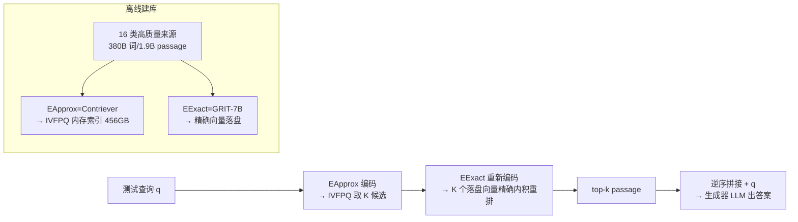

# Frustratingly Simple Retrieval Improves Challenging, Reasoning-Intensive Benchmarks

**会议**: ICLR 2026  
**OpenReview**: [https://openreview.net/forum?id=9lPq01iKOV](https://openreview.net/forum?id=9lPq01iKOV)  
**代码**: [CompactDS-102GB / compactds-retrieval](https://huggingface.co/datasets/alrope/CompactDS-102GB)  
**领域**: 信息检索 / 检索增强生成（RAG）  
**关键词**: 检索增强生成、推理密集型基准、Web 规模数据存储、两阶段稠密检索、ANN+精确搜索  

## 一句话总结
作者构建了一个 380B 词、可在单机 456GB 内存下亚秒级检索的高质量数据存储 COMPACTDS，证明一个"朴素到令人沮丧"的最小 RAG 流程就能在 MMLU、MMLU Pro、GPQA、MATH 等推理密集型基准上稳定大涨（最高相对提升 33%），并媲美甚至超过 Google 搜索和复杂的 agentic RAG 系统。

## 研究背景与动机
**领域现状**：检索增强生成（RAG）在事实型问答（factoid QA）上极为成功——给定一个信息查询，从 Wikipedia 这类高度精选的知识库里捞出确切事实喂给模型即可。但绝大多数 RAG 基准（Natural Questions、TriviaQA 等）都围绕"查事实"设计，且常以搜索引擎为 oracle 构建。

**现有痛点**：一旦超出事实型问答，检索的价值就成了悬案。多项前作（BehnamGhader 2022、Geng 2024）甚至报告检索对推理密集型任务"无益乃至有害"。为弥补这一缺口，近期工作转向 agentic RAG——要么依赖商业搜索引擎（成本高、不可复现、不稳定），要么困在 Wikipedia 数据存储里（覆盖面太窄）。

**核心矛盾**：作者把症结归到一个被忽视的环节——**缺少一个可用的、与预训练数据广度对齐的 web 规模数据存储**。前人的数据存储要么太窄（Wikipedia 覆盖不了 MMLU/GPQA 这类通用基准），要么太大而不可用（MASSIVEDS 需要 12TB 内存、多分钟延迟，学术机构根本部署不起）。换句话说，不是检索没用，而是没人给推理任务配过一个"既广又能跑得动"的库。

**本文目标**：在不引入任何花哨 agentic 机制的前提下（只做"稠密检索 + 生成"这一最小流程），把推理密集型基准的性能推到多高？

**核心 idea**：**① 激进过滤 web 文本**——大部分 web 内容可以被滤掉而不损失覆盖度，一个紧凑高质量子集就够；**② 两阶段检索**——内存里跑近似最近邻（ANN）拿候选，磁盘上跑精确内积搜索重排，兼顾速度与召回。二者合起来得到第一个真正可单机部署的 web 规模数据存储 COMPACTDS。

## 方法详解

### 整体框架
COMPACTDS 围绕"数据怎么选"和"怎么检索得快又准"两条主线展开。离线阶段把 16 类来源的文档切成 256 词的 passage（共 1.9B 条），分别用轻量编码器 EApprox 建 IVFPQ 内存索引、用强编码器 EExact 把精确向量落盘。在线阶段查询先用 EApprox 编码、从 IVFPQ 拿 K 个候选，再用 EExact 重新编码、在落盘的 K 个精确向量上做内积排序得最终 top-k，逆序拼接到查询前喂给生成器 LLM。整套就是教科书式的稠密检索，唯一"创新"是数据配方和这套 ANN→精确的两段式工程，所以标题自嘲"frustratingly simple"。

### 关键设计

**1. 紧凑而多样的数据配方：用过滤把 web 压瘦、用多源把覆盖撑广**　数据存储的第一性问题是"放什么进去"。作者从占 MASSIVEDS 70% 的 Common Crawl 出发，但认定其中大量内容低质且检索无用，于是层层过滤：先取 C4 与已做过大量人工/模型筛选的 DCLM-Baseline 的并集，再用 FineWeb-Edu 分类器以 4.0 阈值按"教育价值"二次筛，把 894B 词的 CC 压到 172B 词。光有 web 不够，他们又系统性补齐预训练语料里公认的高价值来源：Wikipedia（DPR 版 + RedPajama 版）、书籍、教育文本、数学（OpenWebMath + NaturalProofs）、学术论文（PeS2o/PubMed/ArXiv）、代码（GitHub）、问答社区（StackExchange/Reddit）。最终 COMPACTDS 含 380.5B 词、6.39 亿文档、19 亿 passage。消融实验是这条设计的灵魂——**没有任何单一来源够用**，哪怕只删掉最弱的 ArXiv/Books/GitHub/Reddit 四源也会掉点（GPQA 掉 1.8%），说明长尾多样性真的在起作用；而教育文本（web 爬虫里常缺）和数学这类专家内容贡献最大，最常用的 DPR Wikipedia 反而平均几乎无益甚至有害。

**2. ANN→精确的两阶段稠密检索：把"装不下"的精确搜索拆成内存+磁盘**　web 规模检索的工程死结在内存：1.9B passage × 768 维 × 4 字节就要 5.4TB 向量数据，纯精确最近邻根本塞不进单机。作者用 **IVFPQ（倒排文件 + 乘积量化）** 把向量空间分簇并量化，把索引压进 456GB 内存、做到亚秒延迟——但量化是有损的，会掉点。于是第二阶段补一刀**精确内积搜索**：ANN 先召回 $K$ 个候选（$K \gg k$，如 $100\le K\le 1000$），再用未量化的原始向量对这 $K$ 个重排出最终 $k$ 个，候选数适中时精确向量可落盘按需读取。形式化地，检索目标是 $\arg\mathrm{Top}k_{1\le i\le N}\, q^\top p_i$，两阶段把它近似为"先 IVFPQ 粗筛、再精排"。点睛之笔是**两个阶段可以用不同编码器**：ANN 用便宜的 CONTRIEVER-MSMARCO（EApprox），精确重排换成更强但难以整库索引的 GRITLM-7B（EExact）。消融证明性能提升主要来自"换更强的模型"而非"再算一次精确内积"——用同一个 Contriever 做精确搜索几乎不涨，换成 GRIT 才把 MMLU Pro 的相对增益从 26% 推到 33%、MATH 从 14% 推到 19%。这套设计灵感来自 DiskANN 的"内存 ANN + 磁盘精确"范式。

**3. 极简增强与 oracle 上界探测：把检索结果用对，并量化"还能涨多少"**　拿到 top-k passage 后，增强策略刻意保持朴素：按相关度**逆序拼接**（最相关的离查询最近），接上查询本身喂给生成器，外加一个可选的 LLM 重排。为了回答"这套数据存储的天花板在哪"，作者定义了 **oracle 重排**作为诊断工具：给定查询与真值答案 $a$，从 COMPACTDS-ANN 召回的 $K$ 个候选里，按"把某 passage 拼到查询后、模型对 $a$ 的似然提升多少"给每条打分，取分最高的若干条进生成。这不是要部署，而是为了暴露"检索内容本身已经够好、是生成器没用好"——结果显示 oracle 把 8B 模型的平均增益从 8.0 推到 16.2、甚至超过 70B 无检索基线，说明瓶颈在生成器能否在 100 个候选里不被干扰项带偏，而非检索召回不行。

## 实验关键数据

### 主实验表格（Llama 3.1 8B Instruct，k=3 除非标注，相对 No Retrieval 的提升）

| 方法 | MMLU STEM | MMLU Pro | AGI Eval | MATH | GPQA Phys | AVG |
|---|---|---|---|---|---|---|
| No Retrieval | 60.2 | 39.8 | 56.2 | 46.9 | 26.7 | 48.3 |
| 最佳单一来源 | 63.5（Math） | 47.4（Edu） | 58.0 | 52.7 | 35.3 | ~51.6 |
| COMPACTDS-ANN only | 64.6 | 47.7 | 58.9 | 50.3 | 26.7 | 52.2 |
| COMPACTDS（ANN→ES） | 64.4 | 49.1 | 60.2 | 55.1 | 33.2 | 54.1 |
| COMPACTDS（k=10） | **66.8** | **53.1** | 58.9 | **55.9** | 29.4 | **55.1** |

相对增益：MMLU 约 +10%、**MMLU Pro +33.4%**、MATH +19.2%、GPQA Physics +36.2%。

### 消融实验表格

| 对比 | 结果 | 结论 |
|---|---|---|
| COMPACTDS vs MASSIVEDS（MMLU） | 75.3 vs 73.6，**0.5TB vs 12.4TB 内存** | 仅用 4% 内存即超越，首个可部署 web 规模库 |
| ES 用 Contriever vs ES 用 GRIT | 53.6 vs 55.1（AVG） | 涨点主要来自"换更强编码器"，非精确搜索本身 |
| 删 4 个最弱来源 | GPQA 掉 1.8% | 长尾多样性有真实贡献 |
| Oracle 重排（k=3，pool=100） | AVG 增益 8.0 → 16.2，超 70B 无检索 | 检索内容上界很高，瓶颈在生成器 |

### 关键发现
- **跨模型规模与家族稳定有效**：70B（Llama 3.3）上 MMLU STEM +5%、MMLU Pro +13%、MATH +7%；Mistral 7B、Qwen3 8B 上 MMLU Pro 分别 +10.2%、+11.2%。例外是 GPQA 在 70B 上无提升（无检索基线已大幅变强，CoT 能力饱和）。
- **媲美/超过搜索引擎**：COMPACTDS 平均相对增益 14%，而 Google 搜索仅 6%，且在 MMLU Pro 上差距明显（54.6 vs 44.0）。这是前人用"以搜索引擎为 oracle"的 RAG 基准上观察不到的。
- **媲美/超过 agentic RAG**：用 QwQ 32B 在 GPQA-Diamond / MATH-500 上，最小 RAG + COMPACTDS（自包含）匹配或超过依赖 web 搜索的 Search-o1 复杂系统。
- **增益非来自数据污染**：用 GPT-5-mini 做更严格的事后去污后性能仅微降，主结论不变。

## 亮点与洞察
- **"朴素胜复杂"的有力反例**：在 agentic RAG 大行其道之际，本文用最朴素的"检索+拼接"打平甚至打赢复杂 agent 系统，提醒社区——很多收益其实来自数据存储质量，而非链路花哨。这给未来 agentic RAG 研究立了一个更强、可复现的基线。
- **数据配方 > 检索算法**：消融把"哪类数据涨哪类任务"拆得很清（教育文本助 MMLU/GPQA、数学助 MATH、PeS2o 助 GPQA 化学），且证明 DPR Wikipedia 这个 RAG 默认库在通用推理基准上几乎无用，是对领域惯例的有价值纠偏。
- **工程上的可达性**：把 12.4TB 压到 0.5TB、单机亚秒延迟，是把 web 规模检索从"只有大厂能玩"拉回学术桌面的实在贡献，并开源了库与流程。
- **oracle 诊断很聪明**：用"似然提升"定义检索上界，干净地把"检索召回不够"和"生成器用不好"两个瓶颈分离，指明后续应优化生成端而非一味堆库。

## 局限与展望
- **生成端是新瓶颈**：oracle 与实际相差悬殊（8B 上 16.2 vs 8.0），说明模型在多 passage 下易被干扰项误导，需要面向检索后训练（reranking-aware / CoT-aware）。
- **强模型上增益收窄**：70B 与 QwQ 上部分基准（尤其 GPQA）增益消失或变小，CoT 能力饱和后检索的边际价值下降，如何让检索与强推理互补仍未解。
- **仍是静态、单跳检索**：未与多跳、迭代式 agentic 检索结合；作者明确把"集成进 agentic 流程、用检索做训练"留作未来工作。
- **数据存储构建依赖现成过滤器/语料**：FineWeb-Edu 阈值、源集合的选择带有经验性，迁移到非英语或新领域时配方需重调。

## 相关工作与启发
- **RAG 评测的范式问题**：本文延续 MassiveDS（Shao 2024）的 web 规模数据存储思路，但直指其"不可部署"软肋；同时与并行工作 ReasonIR（改 embedding 模型）正交——后者优化编码器，本文优化数据存储与最近邻搜索，二者可叠加。
- **对 agentic RAG 的再审视**：相对 Search-o1（Li 2025b）等 prompt-based 与 RL-based agentic 方法，本文主张"最小 RAG 是一切检索系统的基石"，先把基线做扎实再谈 agent。
- **工程谱系**：两阶段检索直接借鉴 DiskANN 的"内存 ANN + 磁盘精确"，IVFPQ 来自 Jégou 2010，编码器组合 Contriever + GRITLM 体现了"廉价粗筛 + 昂贵精排"的通用工程智慧，可迁移到其他大规模向量检索场景。
- **启发**：做检索增强时，与其纠结更复杂的 agent 链路，不如先问"我的数据存储是否既广又跑得动、是否被低质数据稀释"；以及把"检索质量上界"和"生成器利用率"分开诊断，能更快定位真正的瓶颈。

## 评分
- **新颖性**: ⭐⭐⭐⭐ — 方法本身刻意"朴素"，但"激进过滤 web + ANN→精确两阶段"组合出第一个可单机部署的 web 规模库，并系统性推翻"检索对推理无益"的成见，视角与结论都有新意。
- **实验充分度**: ⭐⭐⭐⭐⭐ — 5 个推理密集型基准 × 5 个模型（8B–70B、跨家族）、单源消融、两阶段消融、oracle 上界、与搜索引擎及 Search-o1 对比、双重去污验证，覆盖极全。
- **写作质量**: ⭐⭐⭐⭐ — 动机—诊断—方法—验证逻辑清晰，表格信息密度高；个别工程细节（落盘 I/O、索引压缩）压在附录，正文略显紧凑。
- **价值**: ⭐⭐⭐⭐⭐ — 开源可复现的 web 规模数据存储 + 强基线，对 RAG 与 agentic RAG 研究都有直接、持久的实用价值。

<!-- RELATED:START -->

## 相关论文

- [\[ICLR 2026\] Beyond Sequential Reranking: Reranker-Guided Search Improves Reasoning Intensive Retrieval](beyond_sequential_reranking_reranker-guided_search_improves_reasoning_intensive_.md)
- [\[ACL 2026\] VisRet: Visualization Improves Knowledge-Intensive Text-to-Image Retrieval](../../ACL2026/information_retrieval/visret_visualization_improves_knowledge-intensive_text-to-image_retrieval.md)
- [\[ICLR 2026\] Retro*: Optimizing LLMs for Reasoning-Intensive Document Retrieval](retro_optimizing_llms_for_reasoning-intensive_document_retrieval.md)
- [\[ICLR 2026\] RefTool: Reference-Guided Tool Creation for Knowledge-Intensive Reasoning](reftool_reference-guided_tool_creation_for_knowledge-intensive_reasoning.md)
- [\[ICLR 2026\] MRMR: A Realistic and Expert-Level Multidisciplinary Benchmark for Reasoning-Intensive Multimodal Retrieval](mrmr_a_realistic_and_expert-level_multidisciplinary_benchmark_for_reasoning-inte.md)

<!-- RELATED:END -->
