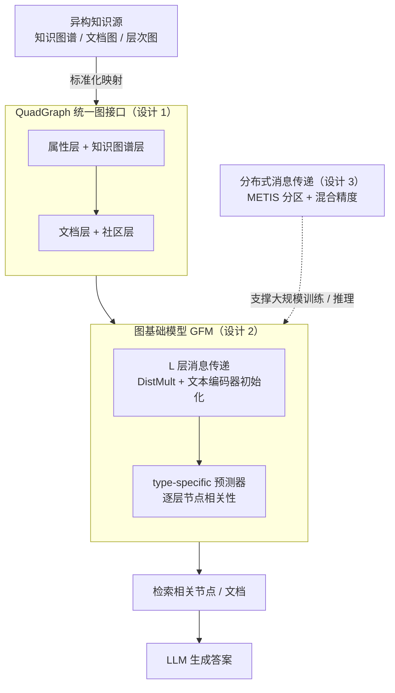

# G-reasoner: Foundation Models for Unified Reasoning over Graph-structured Knowledge

**会议**: ICLR 2026  
**arXiv**: [2509.24276](https://arxiv.org/abs/2509.24276)  
**代码**: [项目页面](https://rmanluo.github.io/gfm-rag/)  
**领域**: 自监督学习 / 图基础模型 / RAG  
**关键词**: graph foundation model, RAG, knowledge graph, GNN, LLM reasoning

## 一句话总结
提出 G-reasoner，通过 QuadGraph 四层统一图接口将异构知识源标准化，训练 34M 参数的 GNN 图基础模型联合推理图拓扑和文本语义，配合 LLM 在 6 个基准上全面超越 SOTA GraphRAG 方法。

## 研究背景与动机

**领域现状**：LLM 擅长推理但受限于静态参数知识，RAG 通过外部知识增强 LLM。图可以自然建模知识间关系（知识图谱、文档图、层次图等），GraphRAG 试图结合两者。

**现有痛点**：现有 GraphRAG 方法依赖特定图结构设计（知识图谱/文档图/层次图各不相同）、启发式搜索（PageRank）或昂贵的 Agent 管道（多次调用 LLM），泛化性差且效率低。

**核心矛盾**：不同知识源需要不同图结构，但没有统一框架能适配各种图结构并高效推理。

**本文目标** 设计统一的图表示和推理框架，适配多种知识图结构、高效且可泛化。

**切入角度**：定义四层标准化图结构 QuadGraph，用 GNN 图基础模型做统一推理。

**核心 idea**：将异构图统一为 QuadGraph（属性层+知识图谱层+文档层+社区层），训练 GFM 联合推理拓扑和语义，增强 LLM。

## 方法详解

### 整体框架
G-reasoner 要解决的是：不同知识源（知识图谱、文档图、层次图）各有各的图结构，过去的 GraphRAG 方法只能为某一种结构定制管道，换个图就得重写。它的思路是把"图结构"和"图推理"彻底解耦——先用一个统一接口 QuadGraph 把任意异构知识源压成同一种四层格式，再训练一个图基础模型（GFM）在这种标准格式上做推理。整条链路是：原始知识源 → QuadGraph 标准化 → 34M 参数 GNN 一次前向传播给出各节点相关性 → 把检索到的相关节点/文档喂给 LLM 生成答案。关键在于 GFM 只需在标准化接口上训练一次，就能迁移到任何能映射成 QuadGraph 的新知识源，而推理只是单次前向、不再依赖 PageRank 启发式或多轮 LLM 调用。

### 关键设计

**1. QuadGraph 统一图接口：用四层标准格式消除图结构依赖**

痛点是不同知识源的图结构互不兼容，导致方法无法跨图泛化。QuadGraph 把任意知识源映射到固定的四层：属性层（节点的公共属性）、知识图谱层（实体与关系三元组）、文档层（非结构化文本）、社区层（对语义/结构做聚类得到的全局信息）。知识图谱、文档图、层次图都能落进这套四层结构里——比如纯知识图谱主要落在知识图谱层，文档集合主要落在文档层与社区层。这样下游模型面对的永远是同一种接口，图结构的差异在标准化阶段就被吸收掉，GFM 不必为每种图重新设计。

**2. GNN 图基础模型（GFM）：在标准接口上联合推理拓扑与文本语义**

只有拓扑不够、只有文本也不够，GFM 要把两者一起算。它是一个查询依赖的 GNN，消息函数采用 DistMult，节点嵌入用预训练文本编码器初始化，从而一开始就携带文本语义；经过 $L$ 层消息传递后，再用类型特异（type-specific）的预测器对四层里各类节点分别预测与查询的相关性。训练上的难点是图推理任务缺少标注，于是采用弱监督蒸馏：把预训练文本编码器当"教师"，让它对节点相关性给出伪标签，再用 KL 散度把这种判断蒸馏进 GFM。这样即便人工标注稀缺，GFM 也能从教师的语义判断里学到监督信号，而不必依赖大规模人工标签。

**3. 分布式消息传递：让 GFM 能在大规模图上训练和推理**

知识源对应的图可能很大，单卡放不下。这里用 METIS 算法把图分区后分配到多张 GPU，每个设备只存自己那块子图；做消息传递时先在本地聚合，再跨设备交换边界节点的信息，从而把通信量压到最低。配合混合精度训练，吞吐量提升 2.1 倍、GPU 内存下降 17.5%，使得在标准化后的大图上做端到端训练与单次前向推理变得可行。

### 损失函数 / 训练策略
训练目标是标注节点的对数似然，加上 $\lambda$ 倍的教师伪标签 KL 蒸馏损失，在大规模、多数据集上做弱监督训练，使 GFM 同时受益于有限的真实标注和教师提供的密集语义信号。

## 实验关键数据

### 主实验：多跳 QA + G-bench

| 方法 | HotpotQA F1 | MuSiQue F1 | 2Wiki F1 |
|------|------|------|------|
| BM25 | 63.4 | 28.8 | 51.2 |
| HippoRAG 2 | 71.1 | 49.3 | 69.7 |
| GFM-RAG | 69.5 | 49.2 | 77.7 |
| **G-reasoner** | **76.0** | **52.5** | **82.1** |

### 消融实验

| 配置 | 效果 |
|------|------|
| 无文本语义融合 | 显著下降，拓扑不够 |
| 无弱监督蒸馏 | 下降，标注数据不足 |
| 单一图类型训练 | 泛化差 |
| 完整 G-reasoner | 最佳 |

### 关键发现
- 在所有 6 个基准上全面 SOTA，包括多跳 QA 和 G-bench
- 比 Agent 方法（ToG, KAG）高效得多——单次前向传播 vs 多次 LLM 调用
- 跨图类型泛化能力强——在未见过的图结构上仍表现良好

## 亮点与洞察
- QuadGraph 的四层设计巧妙统一了知识图谱、文档图、层次图，有很好的抽象能力
- 弱监督蒸馏策略解决了图推理中标注稀缺的实际问题
- 34M 参数的高效 GFM 相比 Agent 方法大幅降低推理成本

## 局限与展望
- QuadGraph 的四层结构是否覆盖所有知识类型？时序知识、多模态知识可能需要扩展
- GFM 依赖预训练文本编码器的质量
- 仅验证了文本领域，多模态推理待探索

## 相关工作与启发
- **vs GFM-RAG**: 前身工作，仅限知识图谱，G-reasoner 扩展到任意图结构
- **vs GraphRAG (MS)**: 依赖特定层次图+LLM 摘要，泛化差
- **vs HippoRAG**: 用 PageRank 搜索，未充分利用基础模型能力

## 评分
- 新颖性: ⭐⭐⭐⭐ QuadGraph 统一接口 + GFM 联合推理是有意义的系统贡献
- 实验充分度: ⭐⭐⭐⭐⭐ 6 个基准、消融、效率分析、泛化测试全面
- 写作质量: ⭐⭐⭐⭐ 框架清晰，图示好
- 价值: ⭐⭐⭐⭐ 为 GraphRAG 提供可扩展的统一解决方案

<!-- RELATED:START -->

## 相关论文

- [\[ICLR 2026\] Youtu-GraphRAG: Vertically Unified Agents for Graph Retrieval-Augmented Complex Reasoning](youtu-graphrag_vertically_unified_agents_for_graph_retrieval-augmented_complex_r.md)
- [\[ICLR 2026\] SynthWorlds: Controlled Parallel Worlds for Disentangling Reasoning and Knowledge in Language Models](synthworlds_controlled_parallel_worlds_for_disentangling_reasoning_and_knowledge.md)
- [\[ICLR 2026\] RefTool: Reference-Guided Tool Creation for Knowledge-Intensive Reasoning](reftool_reference-guided_tool_creation_for_knowledge-intensive_reasoning.md)
- [\[ICLR 2026\] Graph-based Nearest Neighbors with Dynamic Updates via Random Walks](graph-based_nearest_neighbors_with_dynamic_updates_via_random_walks.md)
- [\[ACL 2025\] Toward Structured Knowledge Reasoning: Contrastive Retrieval-Augmented Generation on Experience](../../ACL2025/information_retrieval/toward_structured_knowledge_reasoning_contrastive_retrieval-augmented_generation.md)

<!-- RELATED:END -->
