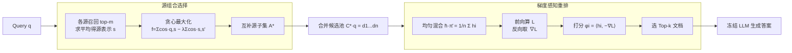

# GRO-RAG: Gradient-aware Re-rank Optimization for Multi-source Retrieval-Augmented Generation

**会议**: ICLR 2026  
**OpenReview**: [https://openreview.net/forum?id=5zdubHFutd](https://openreview.net/forum?id=5zdubHFutd)  
**代码**: 待确认  
**领域**: 信息检索 / 检索增强生成（RAG）  
**关键词**: 多源 RAG, 梯度感知重排, 训练无关, 源组合选择, 子模优化, 生成损失对齐  

## 一句话总结
GRO-RAG 提出一个完全训练无关的多源 RAG 框架：先用「相关性—冗余度」子模目标贪心挑选互补的检索源，再让冻结 LLM 通过一次前向—反向传播，用生成损失对每篇文档的梯度内积来重排，从而把"检索什么"直接对齐到"生成目标真正需要什么"。

## 研究背景与动机
**领域现状**：检索增强生成（RAG）已成为给 LLM 注入外部知识、缓解幻觉的主流范式。在开放域和多跳问答中，证据往往散落在百科、网页、论坛等异构源里，于是衍生出多源 RAG（MS-RAG），既要判断哪些文档相关，还要决定信任、组合还是忽略哪些源。ReAct、UniMS-RAG、PrefRAG 等近期工作都在尝试动态调度多源。

**现有痛点**：多数系统在源层面处理得很粗糙——要么把所有源一视同仁地全量聚合，要么静态固定单一源，忽视了源之间的语义互补与冗余。在文档层面，重排模型（如 BM25、交叉编码器）只用 query-文档相似度这类检索级信号打分，**完全不看文档对下游生成目标的实际贡献**。

**核心矛盾**：检索打分的标准（相关性/相似度）和真正决定答案质量的标准（对生成损失的贡献）不一致。一篇与 query 字面高度相似的文档，未必能帮模型答对题；而真正有用的证据可能因相似度不高被排在后面。这就造成"检索到的"和"生成真正需要的"之间的错配。

**本文目标**：构造一个无需训练、不引入额外参数、对冻结 LLM 即插即用的框架，同时解决"从哪些源组合里取"和"用哪些文档当上下文"两个决策，并让两者都服务于最终生成目标。

**核心 idea**：**让 LLM 自己投票**——通过单次反向传播读取生成损失对文档表示的梯度，用「文档隐表示·(−损失梯度)」的内积估计每篇文档对降低生成损失的贡献，以此重排，而非靠启发式相似度；源层面则用子模优化平衡相关性与冗余度挑选互补源组合。

## 方法详解

### 整体框架
GRO-RAG 是一条两级筛选流水线：**源组合选择** → **梯度感知重排**。给定 query，先对每个源召回 top-m 候选并求平均得到源表示，用「相关性−λ·冗余度」的子模打分贪心挑出互补源子集；再把这些源的候选文档合并成混合候选池，让冻结 LLM 对均匀混合表示做一次前向算生成损失、一次反向取梯度，按梯度内积分数选 Top-k 文档拼进 prompt。整个过程只需一次前向—反向传播，不训练、不加参数。

### 关键设计

**1. 源组合选择：把"选源"写成相关性—冗余度的子模优化，贪心求解带近似保证**。直觉上，一个地理问题可能在新闻、维基、旅游博客里都能找到答案，全量合并会读到大量关于多瑙河的重复句子、浪费上下文预算，而只留维基又会丢掉旅游博客里对追问有用的独特细节。作者把这一权衡形式化为子集打分函数 $f(A;\lambda)=\sum_{s\in A}\cos(q,s)-\lambda\sum_{s,s'\in A,s<s'}\cos(s,s')$，第一项奖励与 query 语义对齐的源，第二项惩罚彼此高度相似的源，可读作"奖励边际新信息、惩罚已覆盖内容"。其中源表示 $s=\frac{1}{m}\sum_j \mathbf{d}_{s,j}$ 由该源 top-m 候选的冻结句向量（sentence-BERT）平均得到。第一项是模块函数，冗余项在余弦相似下随源增多而递增、构成子模结构，故当 λ 较小时整体 $f$ 子模；于是用贪心算法逐步加入边际增益最大的源即可享有经典 $(1-1/e)$ 近似保证，避免枚举所有子集。最终选中源的候选并集 $C^\star(q)=\bigcup_{s\in A_{greedy}}C_s(q)$ 进入重排阶段，既保留互补证据又大幅削减跨源冗余。

**2. 梯度感知重排：把离散 Top-k 松弛成软权重，用一阶泰勒展开导出梯度内积打分**。冻结 LLM 上下文有限，只能容纳 k 篇文档。作者不训交叉编码器、也不复用相似度，而是把"留/弃"的二元选择松弛为单纯形上的非负软权重 $\pi\in\Delta_n$（$\|\pi\|_1=1$），构造混合表示 $\bar h(\pi)=\sum_i\pi_i h_i$，再以软提示 $\langle q,\bar h(\pi)\rangle$ 对参考答案算生成损失 $\mathcal L(\pi)$。由于生成器非线性、损失非凸不可解析，作者在均匀混合 $\bar\pi=(1/n,\dots,1/n)$ 处做一阶泰勒展开：$\mathcal L(\pi)\approx\mathcal L(\bar\pi)+\sum_i\pi_i\langle\nabla_{\bar h}\mathcal L,h_i\rangle$。于是最小化损失近似等价于最小化文档得分的线性加权和，在 k-稀疏单纯形约束下，最优解就是挑出内积 $\langle h_i,-\nabla_{\bar h}\mathcal L\rangle$ 最大的 k 篇。据此定义排序分 $\phi_i=\langle h_i,-\nabla_{\bar h}\mathcal L\rangle$——它度量生成损失对文档 i 在场与否的敏感度，$\phi_i$ 越大说明给该文档加权越能让损失骤降。只需一次前向—反向就能对全部候选排序，无需训练，直接利用 LLM 内部梯度估计文档对真实生成目标的效用。

**3. 理论保证：梯度内积上界 leave-one-out 损失，且可扩展成线性收敛的迭代优化**。要真正衡量某文档 $d_i$ 的贡献，最直接的办法是把它从上下文移除、重跑模型看损失涨多少，即 leave-one-out 损失 $\mathcal L_{loo}(d_i)=\mathcal L(\bar\pi)-\mathcal L(\bar\pi-\frac{1}{n}e_i)$，但这要 $n{+}1$ 次前向、太慢。命题 3.1 证明：在 $\ell_i(t)=\mathcal L(\bar\pi+te_i)$ 局部凸的条件下，有 $\mathcal L_{loo}(d_i)\le-\phi_i$，即梯度分 $\phi_i$ 是真实边际效用的上界，按 $\phi$ 排序能优先保留"缺席最伤损失"的文档，是一个安全的代理信号。进一步，单步打分可推广为多步迭代：每轮以当前 $\pi^t$ 形成上下文、前向反向得下降方向 $g^t$，梯度下降更新后投影回 k-稀疏单纯形，反复细化文档混合。命题 3.2 在 μ-强凸、L-光滑假设下证明该迭代以因子 $(1-\eta\mu)$ 线性收敛，每多迭代一步只会改善而不会变差，且全程冻结、不加参数。

## 实验关键数据

### 主实验表格
在 HotpotQA、2WikiMQA、MuSiQue 三个多跳 QA 基准上，分别用 Llama3.1-8B 与 GLM-4 作生成器（F1/EM，%）：

| 生成器 | 方法 | HotpotQA F1 | HotpotQA EM | 2WikiMQA F1 | 2WikiMQA EM | MuSiQue F1 | MuSiQue EM |
|---|---|---|---|---|---|---|---|
| Llama3.1-8B | w/o Retrieval | 27.8 | 23.1 | 19.7 | 13.9 | 8.4 | 3.5 |
| | Vanilla RAG (Both) | 36.0 | 29.7 | 27.3 | 21.8 | 15.9 | 9.2 |
| | FLARE | 34.5 | 28.6 | 28.5 | 23.0 | 17.3 | 10.7 |
| | CRAG | 34.2 | 25.5 | 22.6 | 17.9 | 16.2 | 9.2 |
| | **GRO-RAG** | **39.1** | **30.9** | **28.9** | 22.8 | **18.6** | 10.3 |
| GLM-4 | w/o Retrieval | 29.4 | 23.6 | 18.6 | 13.5 | 10.3 | 4.1 |
| | Vanilla RAG (Both) | 39.3 | 31.5 | 28.2 | 22.4 | 16.5 | 9.6 |
| | FLARE | 38.6 | 30.7 | 29.7 | 23.8 | 20.2 | 11.6 |
| | CRAG | 38.1 | 30.3 | 24.8 | 20.4 | 17.4 | 9.6 |
| | **GRO-RAG** | **42.8** | **33.6** | **30.3** | 23.7 | **21.1** | **12.4** |

GRO-RAG 在两种 LLM 下几乎全面拿下 F1 最优，EM 多数最优；在文档熵更高、推理更难的 MuSiQue 上优势尤为明显。

检索层面（仅用本地语料，NDCG@10）GRO-RAG 不作监督训练也能逼近甚至在 MuSiQue 上超过 BGE-M3：

| 重排器 | HotpotQA | 2WikiMQA | MuSiQue | 平均 |
|---|---|---|---|---|
| BM25 | 0.6237 | 0.5760 | 0.3453 | 0.5150 |
| BGE-M3 | 0.6892 | 0.6273 | 0.3922 | 0.5696 |
| E5-base | 0.7013 | 0.6749 | 0.4180 | 0.5981 |
| GRO-RAG (GLM-4) | 0.6538 | 0.6382 | 0.4156 | 0.5692 |

### 消融实验表格
去掉源组合选择（SCS）或梯度重排（GR）均掉点，GR 是更关键的组件（F1/EM）：

| 生成器 | 方法 | HotpotQA F1 | HotpotQA EM | 2WikiMQA F1 | 2WikiMQA EM | MuSiQue F1 | MuSiQue EM |
|---|---|---|---|---|---|---|---|
| Llama3.1-8B | GRO-RAG | 39.1 | 30.9 | 28.9 | 22.8 | 18.6 | 10.3 |
| | w/o SCS | 38.0 | 30.6 | 26.4 | 21.3 | 17.0 | 10.2 |
| | w/o GR | 37.5 | 30.2 | 23.3 | 19.6 | 16.2 | 9.3 |
| GLM-4 | GRO-RAG | 42.8 | 33.6 | 30.3 | 23.7 | 21.1 | 12.4 |
| | w/o SCS | 40.1 | 31.4 | 28.6 | 22.5 | 20.0 | 11.5 |
| | w/o GR | 37.6 | 28.7 | 25.3 | 20.9 | 16.8 | 9.4 |

### 关键发现
- **梯度重排比源选择更吃重**：去掉 GR 的掉幅（如 GLM-4 在 2WikiMQA F1 30.3→25.3）远大于去掉 SCS，说明"按生成损失重排"是核心收益来源。
- **训练无关却逼近监督检索器**：不做任何检索监督，NDCG 与 E5/BGE-M3 同档，最难的 MuSiQue 上甚至超过 BGE-M3，证明生成目标的梯度信号能捕捉静态嵌入抓不住的细粒度相关性。
- **跨模型稳定**：从 GLM-4 换到更小的 Llama3.1-8B，许多 baseline 大幅掉点，而 GRO-RAG 的相对增益保持一致，体现模型无关的鲁棒性。
- **多步迭代/Top-k 敏感性**：迭代步数增加时 NDCG@10 稳步上升，Top-k 取 10 在多数数据集上效果与稳定性较佳。

## 亮点与洞察
- **把"检索效用"重新定义为"对生成损失的贡献"**：用一次反向传播的梯度内积当排序信号，巧妙地把检索阶段直接对齐到生成目标，绕开了相似度与有用性错配这一长期痛点。
- **理论与工程都干净**：源选择借子模性拿到 $(1-1/e)$ 贪心保证，重排用一阶泰勒+单纯形约束严谨导出 Top-k 准则，还给出梯度分上界 LOO 损失、迭代线性收敛两条命题；同时全程冻结、零额外参数、单次前向反向，落地成本极低。
- **"让 LLM 投票"的视角**：把文档选择交给生成器自身的梯度反馈，而非外部启发式，这一思路可迁移到上下文压缩、demonstration 选择等更广的场景。

## 局限与展望
- **数据集口径略含糊**：正文 4.1 同时提到"四个基准"却只列出 HotpotQA/2WikiMQA/MuSiQue 三个，主表也只有三个，覆盖范围偏窄，缺少开放域生成（如 NQ、TriviaQA）和真实多源混检的更大规模验证。
- **梯度需要参考答案**：打分依赖对参考答案 $a^*$ 算生成损失，训练/离线评测时可行，但在线推理时没有 gold answer，如何用伪标签或自一致性替代 $a^*$ 未充分讨论。
- **泰勒展开的局部性**：单步打分只在均匀混合 $\bar\pi$ 邻域线性化，候选池噪声大或文档间强非线性交互时近似可能失真；虽有多步迭代缓解，但代价是多次前向反向，未给出精度—开销的系统权衡。
- **理论假设偏强**：命题 3.1 需局部凸、命题 3.2 需强凸+光滑，这些在真实 LLM 损失面上难以验证，更多是直觉性保证。

## 相关工作与启发
- **多源 RAG 调度**（ReAct、UniMS-RAG、PrefRAG、CRAG）：前作多靠动作 token、自反思或 fallback 规则做源选择，GRO-RAG 用子模优化把它变成可证近似的组合优化问题。
- **生成感知检索/重排**（RankRAG、Self-RAG、FLARE）：这些方法或靠反射 token、或靠自生成 query，但都不显式建模生成损失；GRO-RAG 的梯度内积提供了一条"直接读生成目标"的更紧路径。
- **启发**：梯度作为效用代理这一招，与影响函数、数据归因（data attribution）一脉相承，可启发把训练数据筛选、in-context 示例选择都统一到"对损失梯度对齐"的框架下。

## 评分
- 新颖性: ⭐⭐⭐⭐ 把生成损失梯度内积作为训练无关重排信号，并配子模源选择+理论上界，视角新颖、组合干净。
- 实验充分度: ⭐⭐⭐ 三个多跳 QA + 两种 LLM + 消融/检索/迭代分析较完整，但数据集口径含糊、缺开放域生成与更大规模真实多源验证。
- 写作质量: ⭐⭐⭐⭐ 动机清晰、公式推导与图示到位，从"让 LLM 投票"的直觉切入易懂。
- 价值: ⭐⭐⭐⭐ 零训练、单次前向反向、即插即用，对实际 RAG 部署有较强吸引力。

<!-- RELATED:START -->

## 相关论文

- [\[ACL 2026\] Disco-RAG: Discourse-Aware Retrieval-Augmented Generation](../../ACL2026/information_retrieval/disco-rag_discourse-aware_retrieval-augmented_generation.md)
- [\[ICLR 2026\] Query-Aware Flow Diffusion for Graph-Based RAG with Retrieval Guarantees](query-aware_flow_diffusion_for_graph-based_rag_with_retrieval_guarantees.md)
- [\[ACL 2026\] MASS-RAG: Multi-Agent Synthesis Retrieval-Augmented Generation](../../ACL2026/information_retrieval/mass-rag_multi-agent_synthesis_retrieval-augmented_generation.md)
- [\[ACL 2025\] VISA: Retrieval Augmented Generation with Visual Source Attribution](../../ACL2025/information_retrieval/visa_retrieval_augmented_generation_with_visual_source_attribution.md)
- [\[ACL 2026\] IF-GEO: Conflict-Aware Instruction Fusion for Multi-Query Generative Engine Optimization](../../ACL2026/information_retrieval/if-geo_conflict-aware_instruction_fusion_for_multi-query_generative_engine_optim.md)

<!-- RELATED:END -->
