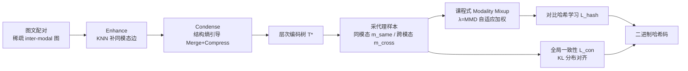

# Hierarchical Encoding Tree with Modality Mixup for Cross-modal Hashing

**会议**: ICLR 2026  
**OpenReview**: [https://openreview.net/forum?id=Gq7mjFEoDm](https://openreview.net/forum?id=Gq7mjFEoDm)  
**代码**: 待确认  
**领域**: 信息检索 / 跨模态哈希  
**关键词**: 跨模态检索, 无监督哈希, 编码树, 结构熵, 模态 Mixup, 课程学习  

## 一句话总结
HINT 用结构熵把稀疏的图文配对关系压成一棵层次"编码树"，挖出多粒度语义社区，再从树上为每个样本采同模态/跨模态代理样本、用 MMD 驱动的课程式 Mixup 渐进对齐两个模态，实现更鲁棒的无监督跨模态哈希检索。

## 研究背景与动机
- **领域现状**：跨模态检索把图、文映射进统一空间算相似度，而哈希方法把高维向量压成二进制码、用 Hamming 距离做近似最近邻搜索，存储和检索都极快，是大规模图文检索的主流方案。因标注昂贵，无监督跨模态哈希（仅用图文配对、配合对比/对抗学习）成为研究热点。
- **现有痛点**：① **缺层次语义结构**——没有类别标签时，已有方法只能拿"图-文配对"这种**扁平且稀疏**的监督信号，所有样本被当作同一层级，无法挖掘真实数据中天然存在的多级语义社区（社区内语义相近、社区间差异大），导致哈希码泛化性差。② **异质模态对齐难**——图、文在结构和语义上天然异质，现有方法直接把两个编码器往同一目标硬拉，学习难度高、效果次优。
- **核心矛盾**：可用监督是**扁平、稀疏**的配对信号，而真实语义却是**层次、稠密**的社区结构；同时模态间的鸿沟又让"一步到位"的直接对齐变得困难。
- **本文目标**：在无监督设定下，恢复跨模态数据的层次语义结构、挖掘局部社区，并以**渐进**而非直接的方式弥合模态鸿沟，学到判别性更强、更鲁棒的哈希码。
- **核心 idea**：**【从扁平到层次】** 用结构熵把稀疏配对图压成一棵编码树（社区内稠密、社区间稀疏）；**【从直接到渐进】** 从树上采代理样本，用数据驱动的课程式 Mixup 把对齐从"同模态内"平滑过渡到"跨模态"。

## 方法详解

### 整体框架
HINT（Hierarchical encodIng tree with modality mixup）在测试时只用哈希模型出码，训练时围绕一棵编码树展开三件事：先用"增强-压缩"流程从稀疏配对图构造层次编码树 $T^*$；再从树上为每个样本采同模态与跨模态代理样本，用 MMD 驱动的课程式 Mixup 生成混合哈希码做对比学习；最后用代理样本做全局视角的分布一致性对齐。整体损失为 $\mathcal{L}=\mathcal{L}_{hash}+\gamma\mathcal{L}_{con}$。

### 关键设计

**1. 结构熵引导的层次编码树构造：把扁平稀疏图压成多粒度社区树。** 这是 HINT 的地基。先**增强（Enhance）**：原始跨模态图 $G_{inter}$ 只有图文配对边，太稀疏，于是在每个模态内部用余弦相似度 $S^*_{(i,j)}=\cos(f^*_i,f^*_j)$ 跑 KNN（$k{=}3$）补上同模态边，形成紧致的底层社区，再与配对边合并得 $G_{cross}$。选余弦而非 L1/L2，是因为它归一化向量模长、只看语义方向，更适合跨模态比较。再**压缩（Condense）**：用**结构熵**作为目标把图收成编码树。一维结构熵 $E_1(G)=-\sum_{v}\frac{d_v}{\mathrm{vol}(G)}\log\frac{d_v}{\mathrm{vol}(G)}$ 度量整体随机游走的不确定性；层次结构熵把它推广到树：

$$\mathcal{E}^T(G)=-\sum_{\alpha\in T}\underbrace{\frac{g_\alpha}{\mathrm{vol}(G)}}_{\text{信息泄漏}}\log\underbrace{\frac{V_\alpha}{V_{\alpha^-}}}_{\text{编码效率}}$$

其中 $g_\alpha$ 是子树 $T_\alpha$ 跨出的边数（社区"泄漏"程度），$V_\alpha,V_{\alpha^-}$ 是子树及其父子树的度数和。算法以贪心+BFS 遍历，反复尝试两类操作并在能降低结构熵时执行：**Merge** 把同父节点合并成二叉树、**Compress** 把子树上移到祖父节点以构造局部簇，最终 $T^*=\arg\min \mathcal{E}^T(G)$。结果是一棵上层为粗类、中层为细概念、叶子为实例的树，社区内连接稠密、社区间稀疏——天然适合判别性哈希学习。

**2. 课程式 Modality Mixup：用 MMD 把对齐从同模态渐进推向跨模态。** 有了树，就为每个样本 $f^*_i$ 在树上采两组邻居：同模态邻居 $\mathcal{N}^+$ 聚合出同模态代理 $m^{same}_i=\frac{1}{|\mathcal{N}^+|}\sum_{j}\phi^*(f^*_j)$，跨模态邻居 $\mathcal{N}^-$ 聚合出跨模态代理 $m^{cross}_i$（邻居数由树结构自然决定）。这些代理是"语义提纯"后的中介，比单样本鲁棒。混合哈希码为：

$$b^{mix}_i=\mathrm{sign}\Big(\tfrac{\lambda}{1+\lambda}m^{same}_i+\tfrac{1}{1+\lambda}m^{cross}_i\Big),\quad \lambda=\widehat{\mathrm{MMD}}\big(\rho(m^{same},B),\rho(m^{cross},B)\big)$$

关键在 $\lambda$ **不是手调超参**，而是用高斯核 MMD 在 mini-batch 上实测两个模态分布的差距：训练初期模态鸿沟大、$\lambda$ 大，混合偏向同模态代理（先学好对齐的同模态）；随训练推进鸿沟缩小、$\lambda$ 下降，权重平滑转向跨模态代理——这正是一条数据驱动的**课程学习**轨迹（论文 Fig.5 经验验证 $\lambda$ 单调下降）。混合码用 InfoNCE 式对比损失 $\mathcal{L}_{hash}$ 学习，batch 内其它样本作负例。论文还给出 Lemma 4.1：在局部社区一致性假设下混合代理是社区原型的低方差无偏估计，当社区间间隔 $\|\mu_{c(i)}-\mu_{c(k)}\|^2$ 超过代理方差 $r_i^2$ 时即产生正的检索 margin。

**3. 基于代理的全局一致性学习：从分布层面再对齐一次。** Mixup 是样本级的局部对齐，HINT 再加一层全局视角约束：把样本的语义表示成它与 batch 内对侧模态样本的相似度分布 $p(f^*_i)=\{\rho(f^*_i,f^*_j)\mid f^*_j\in B^-\}$，并要求原样本与其跨模态代理的分布一致，最小化 KL 散度 $\mathcal{L}_{con}=\sum_i D_{KL}\big(p(f^*_i)\,\|\,p(m^{cross}_i)\big)$。由于代理样本语义更稳定，这条全局对齐能进一步缩小模态鸿沟、提升泛化。训练时用 $\tanh$ 替代不可导的 $\mathrm{sign}$；测试时丢掉树和代理，直接用哈希模型出码，推理开销极小。

## 实验关键数据

### 主实验（MAP %，节选 64/128 bit）
三个数据集 MIRFlickr-25K / NUS-WIDE / MS-COCO，对比 15 个基线（含 VTM-UCH、DEMO、UDDH 等最新 SOTA），16–128 bit 全面领先。

| Image→Text | MIRF 64 | MIRF 128 | NUS 64 | NUS 128 | COCO 64 | COCO 128 |
|---|---|---|---|---|---|---|
| UCCH | 72.8 | 73.2 | 64.0 | 64.5 | 56.6 | 57.4 |
| UDDH | 74.0 | 74.6 | 65.1 | 65.9 | 59.0 | 59.9 |
| DEMO | 73.4 | 74.3 | 66.2 | 66.4 | 58.6 | 60.5 |
| VTM-UCH | 73.9 | 74.5 | 66.0 | 66.6 | 58.8 | 60.3 |
| **HINT** | **75.1** | **75.5** | **66.5** | **67.3** | **60.4** | **61.1** |

Text→Image 方向同样全面领先（MIRF-128 达 74.6，COCO-128 达 60.8），且论文指出 Text→Image 这种更难的子任务上提升更明显——因为文本特征更稀疏、初始质量更低，层次结构 + 代理邻域聚合带来的收益更大。

### 消融实验（MAP %，I→T / T→I）
组件依次为 KNN（同模态增强）、Tree（层次编码树）、Curr（课程式 Mixup）、Con（一致性学习）。

| 变体 | KNN | Tree | Curr | Con | MIRF | NUS | COCO |
|---|---|---|---|---|---|---|---|
| V1 | | | | | 73.2/72.0 | 64.0/65.1 | 57.9/58.5 |
| V2 | ✓ | | | | 73.8/72.8 | 65.2/65.7 | 59.1/58.9 |
| V3 | ✓ | ✓ | | | 74.2/73.6 | 65.9/66.4 | 60.0/59.5 |
| V4 | ✓ | ✓ | ✓ | | 75.1/74.1 | 67.0/67.3 | 60.7/60.2 |
| **HINT** | ✓ | ✓ | ✓ | ✓ | **75.5/74.6** | **67.3/67.8** | **61.1/60.8** |

### 关键发现
- 每个组件都有正贡献，**层次编码树（V3）与课程式渐进对齐（V4）贡献最大**——印证"层次结构 + 渐进对齐"是核心。
- **超参鲁棒**：$k$ 从 1→3 提升、到 5 引入噪声反降，故取 $k{=}3$；$\tau$ 在 0.1–0.5 波动内性能浮动 <2%，取 0.3。
- **稳定性强**：5 个随机种子下各码长标准差 <1%；含 10% 噪声配对仍保持优势。
- t-SNE 显示 HINT 把图、文映射进统一哈希空间的对齐度优于 UCCH/DEMO；静态建树比迭代更新树有更好的效率-性能权衡。

## 亮点与洞察
- **把"结构熵 + 编码树"这套图无监督工具接到跨模态哈希上**，给"无标签如何造层次监督"提供了一个原理清晰的答案：用结构熵客观地压出社区，而非靠预设粒度或外部工具。
- **$\lambda$ 用 MMD 实测模态差距来驱动课程**，把"先易后难"的对齐顺序变成数据自适应、零手调，且有 Mixup 流形正则的理论支撑——这是比固定权重退火更优雅的设计。
- **训练重、推理轻**：树和代理只在训练用，测试时直接出码，保住了哈希检索"快"的根本卖点。
- 有 Lemma 把"低方差代理 + 社区间隔 ⇒ 正检索 margin"讲清楚，给经验提升配了可解释的理论叙事。

## 局限与展望
- **静态建树**：论文承认迭代更新树效果反而不如静态，说明当前树与表示是"先建后用"的解耦，表示在训练中演化时树不再更新，可能错过更好的社区划分；动态/可微建树是潜在方向。
- **贪心构造无全局最优保证**：BFS + 贪心降熵只能收敛到稳定结构，并非全局最小结构熵。
- **依赖预训练编码器特征**：底层 KNN 社区质量受初始 $f^v,f^t$ 质量影响，弱编码器下层次结构可能失真。
- **仅图文双模态、检索任务**：未验证三模态及以上或非检索下游；社区一致性假设在长尾/噪声极端场景下的成立程度也待考察。

## 相关工作与启发
- **无监督跨模态哈希**（UCCH、DGCPN、DEMO、VTM-UCH 等）：多依赖稀疏图文关系做对比/对抗学习，缺局部社区挖掘；HINT 的区别是显式恢复层次结构。
- **结构熵与编码树**（Li et al. 2018；Zou et al. 2023）：原用于图的无监督社区发现，本文首次系统地把它当作跨模态哈希的层次监督来源。
- **Mixup / 流形正则**（Verma et al. 2019 等）：HINT 把 Mixup 从数据增强改造成"代理样本间的课程式渐进对齐"，并用 MMD 自动定权。
- **启发**：在任何"监督稀疏但数据天然有层次"的无监督场景（如无标注推荐、图谱对齐），"结构熵造层次 + 代理渐进对齐"是一套可迁移的范式；用分布距离（MMD）驱动课程而非手调退火，值得借鉴。

## 评分
- **新颖性**: ⭐⭐⭐⭐ 把结构熵编码树引入无监督跨模态哈希、并用 MMD 驱动课程式 Mixup，组合新颖且动机扎实，虽各组件多为已有工具的巧妙嫁接。
- **实验充分度**: ⭐⭐⭐⭐ 三数据集 × 四码长 × 15 基线，含消融、超参、稳定性、噪声鲁棒、t-SNE，证据链完整。
- **写作质量**: ⭐⭐⭐⭐ 三组件逻辑清晰，配 Lemma 与多张示意图；公式较密但叙事连贯。
- **价值**: ⭐⭐⭐⭐ 检索性能稳定 SOTA 且保持哈希推理高效，"层次监督 + 渐进对齐"范式对无监督多模态学习有迁移价值。

<!-- RELATED:START -->

## 相关论文

- [\[ICLR 2026\] Deep Global-sense Hard-negative Discriminative Generation Hashing for Cross-modal Retrieval](deep_global-sense_hard-negative_discriminative_generation_hashing_for_cross-moda.md)
- [\[ICML 2026\] Hierarchical Abstract Tree for Cross-Document Retrieval-Augmented Generation](../../ICML2026/information_retrieval/hierarchical_abstract_tree_for_cross-document_retrieval-augmented_generation.md)
- [\[ICLR 2026\] Conformalized Hierarchical Calibration for Uncertainty-Aware Adaptive Hashing](conformalized_hierarchical_calibration_for_uncertainty-aware_adaptive_hashing.md)
- [\[ICLR 2026\] Hierarchical Concept-based Interpretable Models](hierarchical_concept-based_interpretable_models.md)
- [\[ICLR 2026\] Bayesian Attention Mechanism: A Probabilistic Framework for Positional Encoding and Context Length Extrapolation](bayesian_attention_mechanism_a_probabilistic_framework_for_positional_encoding_a.md)

<!-- RELATED:END -->
