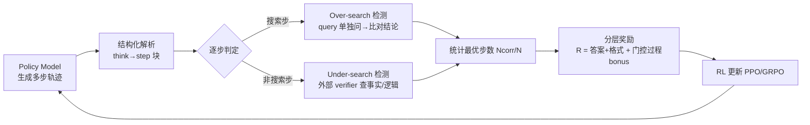

# HiPRAG: Hierarchical Process Rewards for Efficient Agentic Retrieval Augmented Generation

**会议**: ICLR 2026  
**OpenReview**: [https://openreview.net/forum?id=Gt4v9WBPzm](https://openreview.net/forum?id=Gt4v9WBPzm)  
**代码**: [https://github.com/qualidea1217/HiPRAG](https://github.com/qualidea1217/HiPRAG)  
**领域**: 信息检索 / Agentic RAG / 强化学习  
**关键词**: Agentic RAG, 过程奖励, 强化学习, over-search, under-search, 搜索效率  

## 一句话总结
HiPRAG 把 agentic RAG 的推理轨迹拆成可解析的离散步骤，对每一步搜索决策在线判定"该不该搜"，再用一个门控的分层过程奖励喂给 RL，让模型在准确率涨点的同时把过度搜索率从 27% 压到 2.3%。

## 研究背景与动机
- **领域现状**：LLM + 检索已经演化成 agentic RAG——模型自己决定何时搜、搜什么，并交错进行多步推理。近期主流做法（Search-R1、R1-Searcher 等）用 RL 训练这种"搜索智能体"，靠 outcome reward（最终答对没答对）来调策略。
- **现有痛点**：智能体普遍存在两类低效搜索行为——**over-search**（已经知道答案还去检索，浪费算力、引入噪声）和 **under-search**（该搜的时候不搜，靠参数记忆硬答，导致幻觉）。论文实测此前 baseline 的过度搜索率超过 27%。
- **核心矛盾**：现有的纠偏手段都不到位。基于长度/检索次数的惩罚会"用力过猛"，让模型干脆不搜从而加剧 under-search；基于置信度阈值或知识分类器的过程奖励只是粗糙代理，会误判搜索时机；学出来的 process reward model 又可能带偏差、和真实步骤质量弱相关。**没有一种方法能对每一次检索决策给出明确的、步骤级的反馈**。
- **本文目标**：在 RL 里注入细粒度、知识可验证的过程信号，同时优化"答得对"和"搜得省"，又不能因为压搜索把基本检索能力压没。
- **核心 idea**：**结构化输出 + 在线步骤判定 + 分层门控奖励**。先逼模型产出规则可解析的逐步轨迹，再对每一步直接判定是不是冗余搜索/漏搜，最后只在格式和答案都对时才把"最优步骤比例"作为额外 bonus 加进去。

## 方法详解

### 整体框架
HiPRAG 由三块串起来：(1) 重新设计输出格式，把推理轨迹拆成可被规则解析的 `<step>` 块；(2) 在 RL rollout 中对每一步在线检测 over-search / under-search；(3) 用一个分层奖励函数，先保格式与答案正确，再按最优步骤比例发过程奖励。整套机制嵌进标准 RL 循环（PPO/GRPO），检测靠直接 prompt 外部 LLM 完成，无需单独训练奖励模型。

### 关键设计

**1. 把推理轨迹拆成可解析的离散步骤：让"逐步评估"在工程上变得可行。** Search-R1 这类框架把推理塞在一连串 `<think>` 块里，导致两个问题——步骤边界模糊（一个 think 块既收尾上一步又规划下一步），以及非搜索步隐式（靠参数知识的步骤没有显式标签，混在散文里）。这使得逐步评估只能事后调大模型解释，又慢又错。HiPRAG 改成把整条轨迹包在一个 `<think>` 里，内部是一串离散的 `<step>` 块，每步要么是搜索步、含 `<search>` 与 `<context>`，要么是非搜索步。形式化地，轨迹 $T=\{s_1,\dots,s_n,a\}$，搜索步是四元组 $s_i^R=(r_i,q_i,c_i,o_i)$，非搜索步是 $s_i^{NR}=(r_i,o_i)$，其中 $r_i$ 是推理规划、$q_i$ 是查询、$c_i$ 是检索内容、$o_i$ 是该步结论。格式靠"系统 prompt 给 few-shot 示例 + RL 给正确输出正奖励"双管齐下来保证。

**2. 在线检测 over-search / under-search：用直接 prompt 取代昂贵的重生成管线。** 对每个搜索步，HiPRAG 取出它的查询 $q_i$，把它当成一个独立问题直接喂给策略模型自己，得到一个不带检索的答案 $o_i'$；再让外部 LLM judge 判断 $o_i'$ 和原步骤结论 $o_i$ 是否语义等价——等价就说明这次检索是多余的，标为 over-search。这比此前"删掉 context 再附加指令重新生成整条轨迹"既快又稳，因为它只隔离出查询所需的核心知识，不会破坏原推理流。对每个非搜索步，则用外部 verifier 判断其推理 $r_i$ 和结论 $o_i$ 的事实与逻辑正确性，错了就标为 under-search（本该搜却没搜）。论文刻意不惩罚"局部正确但不完整"的步骤，因为完整性依赖全局多步规划、在步骤级难客观判定，硬惩罚反而会把模型推向 over-search。两个检测可并行，over-search 的重生成还能在 rollout 时批量先跑，加速训练。

**3. 分层门控过程奖励：先学会答对，再学会搜省。** 直接惩罚搜索容易把检索能力压没，所以奖励需要"动态聚焦"——训练早期先把格式与答案学对，等基本搜索能力建立后再把重心移向效率。设 $A(T)\in\{0,1\}$ 表示答案正确（用 Cover Exact Match）、$F(T)\in\{0,1\}$ 表示格式合规、$N(T)$ 为总步数、$N_{corr}(T)$ 为既不 over 也不 under 的最优步数，奖励定义为：
$$R(T) = A(T)\,(1-\lambda_f) + \lambda_f F(T) + \lambda_p A(T) F(T) \frac{N_{corr}(T)}{N(T)}$$
其中 $\lambda_f\in[0,1]$ 是格式权重、$\lambda_p\ge 0$ 是过程 bonus 系数。当 $\lambda_p=0$ 时它退化成 Search-R1 的 outcome+format 奖励；过程 bonus 被 $A(T)F(T)$ 门控——只有答案和格式都对时才生效，此时 $R(T)=1+\lambda_p\frac{N_{corr}(T)}{N(T)}$，bonus 随最优步骤比例线性增长。这种分层结构保证模型不会因为某步走偏就被过度惩罚（避免损害推理能力），又能在答对的前提下被持续激励去厘清自己的知识边界。主实验取 $\lambda_f=0.2$、$\lambda_p=0.4$。

## 实验关键数据

### 主实验表格
七个 QA 基准上的 Cover Exact Match（%，越高越好）：

| 方法 | NQ | TriviaQA | PopQA | HotpotQA | 2Wiki | MuSiQue | Bamboogle | Avg. |
|---|---|---|---|---|---|---|---|---|
| Direct Inference | 27.0 | 26.8 | 40.1 | 58.7 | 16.0 | 7.9 | 15.9 | 31.8 |
| Standard RAG | 51.2 | 54.7 | 65.7 | 56.9 | 21.6 | 18.5 | 18.6 | 45.3 |
| Search-R1 | 61.2 | 73.6 | 56.5 | 54.0 | 63.6 | 24.8 | 48.4 | 60.3 |
| R1-Searcher++ | 61.0 | 73.5 | 59.0 | 64.2 | 63.2 | 32.3 | 58.7 | 62.1 |
| β-GRPO | 65.0 | 75.0 | 60.0 | 53.0 | 66.0 | 24.0 | 52.0 | 62.5 |
| **HiPRAG-3B** | 68.7 | 75.5 | 66.3 | 57.4 | 67.4 | 24.1 | 41.6 | **65.4** |
| **HiPRAG-7B** | 71.2 | 76.3 | 63.2 | 62.4 | 71.7 | 34.1 | 52.8 | **67.2** |

HiPRAG-7B 的平均 CEM 67.2% 超过次优 baseline R1-Searcher++（62.1%）5.1 个点；HiPRAG-3B 65.4% 也超过所有 7B baseline。

### 消融实验表格
不同配置下平均 CEM / OSR（过度搜索率）/ USR（漏搜率），均为 %（Qwen2.5-3B-Instruct + PPO，baseline = $\lambda_p=0$）：

| 配置 | Avg. CEM↑ | Avg. OSR↓ | Avg. USR↓ |
|---|---|---|---|
| baseline (λp=0) | 59.3 | 6.1 | 47.5 |
| HiPRAG (完整) | 64.1 | 4.9 | 38.1 |
| HiPRAG (仅 over-search) | 58.8 | 4.9 | 52.7 |
| HiPRAG (仅 under-search) | 63.3 | 6.6 | 16.9 |
| HiPRAG (λp=0.2) | 59.6 | 5.5 | 44.5 |
| HiPRAG (λp=0.6) | 62.5 | 5.2 | 39.0 |

只开 over-search 检测会把 USR 抬高（模型为省搜索而漏搜），只开 under-search 则 USR 暴降到 16.9% 但 OSR 反升——两者联合才能在准确率和双向效率上取得平衡。最佳效率出现在 Qwen2.5-7B-Instruct + GRPO：67.2% CEM、2.3% OSR、32.6% USR。

### 关键发现
- **效率突破**：过度搜索率从此前 baseline 的 >27% 压到 **2.3%**，同时 under-search 率也下降；平均每问检索次数从 Search-R1 的 2.45、β-GRPO 的 2.15 降到 1.75（分别省 29% / 19%）。
- **小模型逆袭**：HiPRAG-3B+GRPO（64.4%）不仅超过外部 7B baseline R1-Searcher++（62.1%），还超过用普通奖励训练的 7B 版本（61.2%），说明优化推理过程比单纯堆模型尺寸更有效。
- **强泛化性**：跨模型族（Qwen2.5 / Llama-3.2）、RL 算法（PPO / GRPO）、尺寸（3B / 7B）、类型（base / instruct）都稳定有效。GRPO 收敛更快、终点更高，PPO 训练更稳。

## 亮点与洞察
- **"该不该搜"被做成了可在线计算的硬信号**：over-search 用"把 query 单独问一遍看结论是否变"来判冗余，under-search 用外部 verifier 查事实正确性，绕开了置信度阈值/学习型 PRM 这些不可靠代理，给出真正步骤级的反馈。
- **门控设计是点睛之笔**：过程 bonus 被答案与格式正确性 gate 住，既避免"为了省搜索把答案搞砸"，又让奖励自然地从"先学会用工具"过渡到"再学会省着用"。
- **不惩罚"局部不完整"步骤**这一克制决策，揭示了过程奖励的一个陷阱——盲目追求每步完美会把智能体推向过度搜索。

## 局限与展望
- **依赖外部 LLM judge**：over-search 用 GPT-4.1 mini、under-search 用 GPT-5 mini 在线判定，训练成本与可复现性受限于这些专有模型，judge 本身的误判会污染奖励。
- **格式强约束**：方法建立在严格的 `<step>` XML schema 上，迁移到自由形式推理或非 QA 任务需要重新设计解析逻辑。
- **USR 仍偏高**：即便最好配置 under-search 率仍在 29%~33%，漏搜问题没有被彻底解决；语义等价/事实正确判定本身的主观性也是潜在噪声源。
- 当前只在 Wikipedia + 单跳/多跳 QA 上验证，扩展到开放网络检索、工具组合调用等更复杂 agentic 场景有待探索。

## 相关工作与启发
- **Agentic RAG 与 RL 训练**：承接 ReAct、Search-R1、R1-Searcher(++)、β-GRPO 一脉，把 RL 从"只奖励最终结果"推进到"奖励检索过程本身"。
- **高效工具使用**：与 SMART、SMARTCAL、OTC、ToolRL 等"减少工具滥用"工作同源，但 HiPRAG 用的是直接在线的步骤必要性判定，而非置信度代理或单独训练的奖励模型；与 ReARTeR 的 process reward model 形成对照。
- **启发**：把"过程奖励"落地的关键不在于训练更强的 PRM，而在于设计**廉价、直接、可验证**的步骤级判据，并用门控结构把它安全地接到 outcome 奖励之上——这套思路可迁移到任何"需要节制调用昂贵动作"的 agent 训练。

## 评分
- **新颖性**: ⭐⭐⭐⭐ — over-search 的"query 单独重问"判据和门控分层奖励都很巧，是对 agentic RAG 过程奖励的实质推进，但整体仍在 Search-R1 的奖励框架内做加法。
- **实验充分度**: ⭐⭐⭐⭐ — 七基准 + 跨模型族/算法/尺寸/类型的泛化验证 + 完整消融，证据扎实；唯独依赖专有 judge、USR 仍高是短板。
- **写作质量**: ⭐⭐⭐⭐ — 动机—方法—奖励公式—实验逻辑清晰，图 1 工作流和符号定义到位。
- **价值**: ⭐⭐⭐⭐ — 把过度搜索从 27% 压到 2.3% 且准确率涨点，对成本敏感的 RAG 部署有直接实用价值，方法可迁移性强。

<!-- RELATED:START -->

## 相关论文

- [\[ICML 2026\] Hierarchical Abstract Tree for Cross-Document Retrieval-Augmented Generation](../../ICML2026/information_retrieval/hierarchical_abstract_tree_for_cross-document_retrieval-augmented_generation.md)
- [\[ICLR 2026\] RAEE: A Robust Retrieval-Augmented Early Exit Framework for Efficient Inference](raee_a_robust_retrieval-augmented_early_exit_framework_for_efficient_inference.md)
- [\[ICML 2026\] LazyAttention: Efficient Retrieval-Augmented Generation with Deferred Positional Encoding](../../ICML2026/information_retrieval/lazyattention_efficient_retrieval-augmented_generation_with_deferred_positional_.md)
- [\[ICLR 2026\] Hierarchical Concept-based Interpretable Models](hierarchical_concept-based_interpretable_models.md)
- [\[ACL 2025\] Hierarchical Document Refinement for Long-context Retrieval-augmented Generation](../../ACL2025/information_retrieval/hierarchical_document_refinement_for_long-context_retrieval-augmented_generation.md)

<!-- RELATED:END -->
