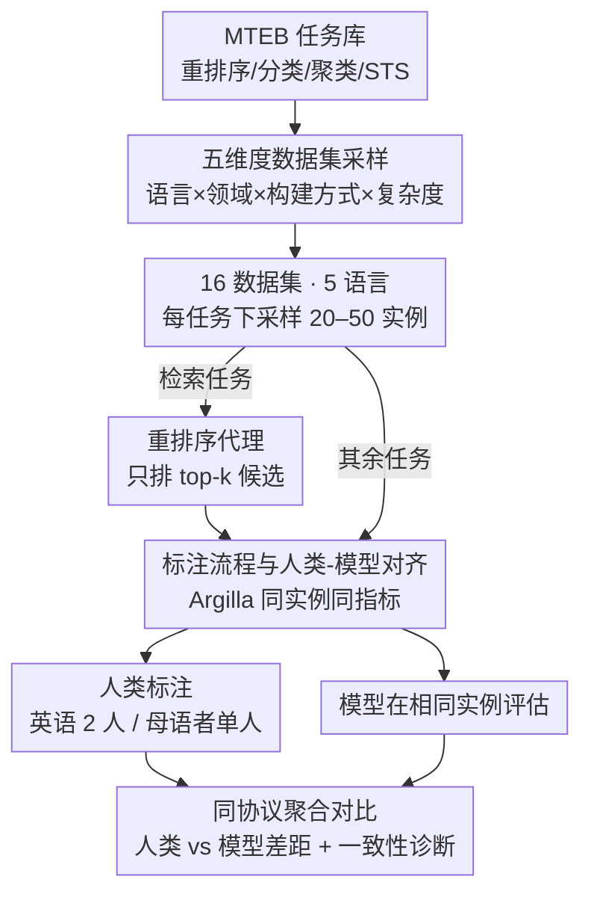

# HUME: Measuring the Human-Model Performance Gap in Text Embedding Tasks

**会议**: ICLR 2026  
**arXiv**: [2510.10062](https://arxiv.org/abs/2510.10062)  
**代码**: [GitHub](https://github.com/embeddings-benchmark/mteb)  
**领域**: 信息检索  
**关键词**: text embedding, human baseline, MTEB, evaluation framework, multilingual

## 一句话总结

提出 HUME 人类评估框架，在 MTEB 的 16 个数据集（重排序/分类/聚类/STS）上系统测量人类表现，发现人类总体排名第 4（77.6 vs 模型最佳 80.1），揭示模型"超人"表现多出现在人类一致性最低的任务上，并评估 9 个 LLM 作为标注代理的可行性。

## 研究背景与动机

**领域现状**：嵌入模型是搜索、推荐、语义分析的核心，MTEB 提供了最全面的模型评估套件，涵盖数十种任务和数百个数据集。然而 MTEB 评分的解释性严重受限——一个模型在重排序任务上取得 MAP=0.85，究竟是好还是差？没有人类性能参考就无从判断。**现有痛点**：当前评估以理论最大值（如 MAP=1.0）为参照，但 NLP 任务固有歧义和标注者分歧（plank-2022-problem），使得完美分数既不现实也无意义。这导致"盲目优化"风险：模型可能在复制标注伪影而非实现真正的语义进步。**核心矛盾**：生成式 NLP 任务（翻译、摘要、对话）已有成熟的人类评估传统，但嵌入任务的人类基线几乎空白——GLUE/SuperGLUE 有人类基线但仅针对分类/推理，STS 报告标注者一致性但未转化为可比较的性能分数。**本文目标** 为 MTEB 建立系统化、可复现的人类性能基线，将人类表现作为诊断信号（非上界）来理解任务本身的质量。**切入角度**：跨 4 类任务、5 种语言（含低资源）、16 个数据集进行多标注者实验，并额外评估 9 个 LLM 能否替代人类标注。**核心 idea**：用标准化框架测量人类在嵌入任务上的表现，揭示模型"超人"往往是数据集质量问题而非模型真正优越。

## 方法详解

### 整体框架

HUME 要解决的问题是：MTEB 给出的嵌入模型分数缺一把"人类标尺"，一个 MAP=0.85 到底算好算差无从判断。它的做法是建立一条可复现的人类测量流水线，让人类和模型在**完全相同的实例、相同的指标和协议**下同台比较。整条流水线从 MTEB 任务库出发，先经**五维度数据集采样**挑出有代表性的 16 个数据集；其中检索类任务无法让人从上千文档里逐一筛选，于是用**重排序代理**把它转成人类可操作的排序判断；接着所有任务进入基于 Argilla 的**标注流程与人类-模型对齐**，人类标注与模型评估各跑一遍同一批下采样实例；最后用同一套指标和协议聚合对比，输出人类-模型差距，并用标注者一致性诊断任务本身的质量。

### 关键设计

**1. 五维度数据集采样：让结论不被「英语高资源」绑架**

如果随手挑几个英语数据集，测出来的人类-模型差距只对英语高资源场景成立，结论会被绑架。HUME 因此沿五个维度有原则地采样：语言多样性（英、阿、俄、挪、丹，覆盖资源等级 1–5 级，含低资源语言）、领域多样性（新闻 / 社交 / 百科 / 科学 / 论坛）、数据构建方式（人工标注 + 合成）、任务相关性，以及复杂度变化。最终落到 4 类任务、5 种语言、16 个数据集，确保任何「人类强 / 模型强」的结论都不是单一语言或单一领域的产物——后面"人类在阿拉伯语 STS 上 +26.6 分"这类发现正是靠这套采样才测得出来。

**2. 重排序代理：让信息检索任务对人类可做**

检索任务要求标注者从数千候选文档里逐一找出相关项，对人类完全不现实，直接做就只能把 IR 排除在人类基线之外。HUME 改用重排序（只评估 top-k 候选的排序质量）作为语义等价的代理：它保留了「判断哪个文档更相关」这一核心语义挑战，又把工作量压到人类可操作的规模。代理只作用在检索任务上（分类 / 聚类 / STS 维持原形式），让 IR 也能进入后续的同实例对齐评估。

**3. 标注流程与人类-模型对齐：把「可比性」做实**

人类和模型若用不同的实例、不同的指令评估，比出来的分数毫无意义。HUME 用 Argilla 搭建任务特定的标注界面（重排序判二元相关、分类用类别标签、聚类自由分配簇 ID、STS 打 0–5 分），对每个任务下采样 20–50 个实例，让人类与模型在完全相同的这批实例上、用完全相同的指标和协议（重排序 MAP、分类 Accuracy、聚类 V-Measure、STS Spearman）评估。标注指令严格复刻原始任务定义——相同的标签集、相同的量表，从根上消除「指令差异导致不可比」。其中英语任务配 2 位标注者以便计算标注者一致性，多语言任务则交给母语者单人标注，保证低资源语言上的判断质量。

### 损失函数 / 训练策略

作为评估框架，HUME 不训练模型。统计显著性按指标类型计算 95% 置信区间：分类准确率用 Wilson Score Intervals，相关性指标（STS / 重排序）用 Fisher $z$ 变换。据此判定模型是否真正偏离人类——模型在 14/26 任务-语言对上落在人类置信区间之外 ($p<0.05$)。

## 实验关键数据

### 主实验

**人类 vs 13 个嵌入模型**（16 数据集，4 类任务 × 5 语言，26 个任务-语言对）：

| 评估对象 | 分类(eng) | 聚类(eng) | 重排序(eng) | STS(eng) | Overall |
|---------|----------|----------|-----------|---------|---------|
| 人类 | 70.3 | 67.4 | 87.2 | 83.1 | **77.6** |
| jasper (最佳) | 87.1 | 83.2 | 95.8 | 88.1 | **80.1** |
| e5-mistral-7b | 70.0 | 82.7 | 96.4 | 85.9 | 78.2 |
| SFR-Embedding | 69.8 | 85.1 | 96.3 | 86.4 | 78.3 |
| gte-Qwen2-1.5B | 76.5 | 75.9 | 95.3 | 84.0 | 77.5 |

人类总体排名第 4（77.6），在 5/14 聚合任务-语言对中得分最高。人类跨语言优势明显：阿拉伯语情感 95.0 vs 77.5（+17.5），俄语情感 92.5 vs 81.2，阿拉伯语 STS 67.5 vs 40.9（+26.6）。

### 消融实验

**LLM-as-Annotator** 评估（9 个 LLM，19 个任务-语言对，排除聚类）：

| 类别 | 人类 | GPT-5 | GPT-4.1-mini | Mistral-Small | Qwen3-32B | Best Emb. |
|-----|------|-------|-------------|--------------|----------|-----------|
| 分类 | 79.1 | 78.9 | 76.1 | 73.8 | 73.0 | 80.3 |
| 重排序 | 88.3 | 75.1 | 77.2 | 78.0 | 74.8 | 94.8 |
| STS | 76.5 | 73.0 | 74.9 | 75.0 | 68.6 | 77.1 |
| **平均** | **81.2** | 75.8 | **76.1** | 75.5 | 72.2 | — |

人类与 LLM 难度排序中等正相关（$\rho=0.52, p<0.05$），但重排序任务差距最大（88.3 vs 78.0），而重排序恰好是人类一致性最高的任务（$\rho=0.64$–$0.85$）。

### 关键发现

1. **模型"超人"常信号数据集质量问题**：情绪分类人类仅 45.8%（$\kappa=0.39$），但最佳模型达 87.1%；ArXiv 聚类人类 49.2%（ARI=-0.001）vs 模型 84.6%——这些"超人"表现发生在人类一致性最差的任务上
2. **高质量基准识别**：重排序（$\rho=0.64$-$0.85$）和毒性分类（$\kappa=0.55$）展现高人类一致性，是可靠的评估目标
3. **跨语言差距**：人类在非英语任务优势显著（胜率 29% vs 英语 0%），阿拉伯语优势最大（67% 胜率 vs best model）
4. **LLM 不能替代人类标注**：最佳 LLM（GPT-4.1-mini, 76.1%）落后人类 5.1 分，尤其在高人类一致性的重排序任务上差距最大

## 亮点与洞察

- **填补重要空白**：MTEB 首次获得系统化的人类性能基线，且已集成到 MTEB 包中
- **核心洞察——诊断信号而非上界**：人类表现变异更多反映任务质量而非人类局限性；低人类分常暗示任务设计问题（标注指南模糊、主观性），而非模型需要"超越"的目标
- **反直觉发现**：模型"超人"表现恰恰出现在人类一致性最低的任务上——这意味着模型在复制一致的标签模式而非展现真正的语义理解
- **实践建议**：benchmark 排行榜应同时报告人类一致性指标——85% 在情绪分类上（人类 45.8%，$\kappa=0.39$）与 85% 在重排序上（人类 87.2%，$\rho=0.75$）是截然不同的成就

## 局限与展望

- 每任务样本量较小（20-50 实例），优先了广度（16 个数据集）而非深度
- 标注者均为男性、20-35 岁，人口统计多样性有限
- 多数任务仅 2 个标注者，限制了一致性分析的完整性
- 未深入解释人类-模型性能差距的底层原因（如训练数据覆盖、文化偏差）
- 未系统研究任务设计特征如何影响人类一致性

## 相关工作与启发

- **vs GLUE/SuperGLUE**：报告人类基线但仅针对分类/推理任务，未覆盖嵌入任务
- **vs STS 系列**：报告标注者一致性（inter-annotator agreement），但未转化为模型可比较的性能分数
- **vs TREC**：收集人类相关性判断作为黄金标准，但不是在模型指标下的人类性能基准
- **启发**：评估基准的质量（标注一致性）与模型能力同样重要；"超人"分数可能是评估噪声的信号而非进步的标志

## 评分

| 维度 | 评分 |
|------|------|
| 理论深度 | ⭐⭐⭐ |
| 新颖性 | ⭐⭐⭐⭐ |
| 实验充分性 | ⭐⭐⭐⭐ |
| 写作质量 | ⭐⭐⭐⭐ |
| 实用价值 | ⭐⭐⭐⭐⭐ |
| 总体评价 | ⭐⭐⭐⭐ |

<!-- RELATED:START -->

## 相关论文

- [\[ACL 2026\] SkMTEB: Slovak Massive Text Embedding Benchmark and Model Adaptation](../../ACL2026/information_retrieval/skmteb_slovak_massive_text_embedding_benchmark_and_model_adaptation.md)
- [\[ACL 2026\] PL-MTEB: Polish Massive Text Embedding Benchmark](../../ACL2026/information_retrieval/pl-mteb_polish_massive_text_embedding_benchmark.md)
- [\[ICLR 2026\] Let LLMs Speak Embedding Languages: Generative Text Embeddings via Iterative Contrastive Refinement](let_llms_speak_embedding_languages_generative_text_embeddings_via_iterative_cont.md)
- [\[ACL 2026\] FLARE: Task-Agnostic Embedding Model Evaluation via Normalizing Flows](../../ACL2026/information_retrieval/flare_task-agnostic_embedding_model_evaluation_through_a_normalization_process.md)
- [\[ICLR 2026\] On the Theoretical Limitations of Embedding-Based Retrieval](on_the_theoretical_limitations_of_embedding-based_retrieval.md)

<!-- RELATED:END -->
