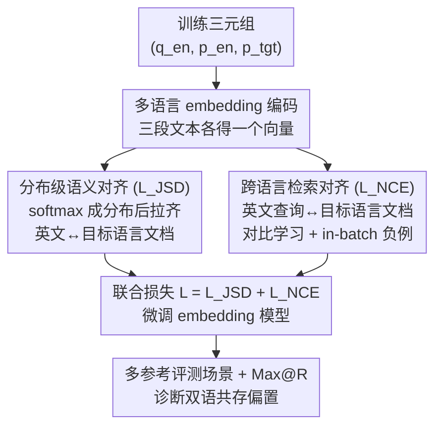

# Improving Semantic Proximity in Information Retrieval through Cross-Lingual Alignment

**会议**: ICLR 2026  
**OpenReview**: [https://openreview.net/forum?id=NvKvW5k6Kk](https://openreview.net/forum?id=NvKvW5k6Kk)  
**代码**: 待确认  
**领域**: 信息检索 / 跨语言检索 / 多语言表示  
**关键词**: 跨语言检索, 语义对齐, Jensen-Shannon 散度, 英语偏置, Max@R

## 一句话总结
针对"两种语言文档共存"的真实检索场景，本文揭示主流多语言 embedding 会盲目把无关英文文档排到目标语言相关文档前面，提出新评测场景 + Max@R 指标量化这一偏置，并用 JSD 分布级对齐 + InfoNCE 检索两项损失，仅 2.8k 样本就大幅改善跨语言对齐、压平语言间性能差距，且不损害单语检索。

## 研究背景与动机
**领域现状**：跨语言信息检索（CLIR）的常规评测假设"查询语言 ≠ 文档语言，且文档池只有单一一种语言"——查询是 A 语言，文档池全是 B 语言，衡量模型能否跨语言召回。多语言检索（MLIR）则把三种以上语言混进一个文档池里排序。两者都是多语言 embedding 模型（multilingual-e5、gte、jina、bge-m3 等）的标准考场。

**现有痛点**：这种"单一语言文档池"的设置掩盖了真实场景里最致命的问题。现实中文档池往往是**两种语言并存**——既有英文文档，也有与查询同语言的目标语言文档。作者观察到：当查询是中文、文档池里既有相关中文文档、又有不相关英文文档时，多数多语言检索器会**优先把不相关的英文文档排到前面**，把正确的中文文档压到很低的位置。

**核心矛盾**：根因是 embedding 空间里的**跨语言语义错位**和**对高资源语言（英语）的系统性偏置**。两段语义等价的文本（一段英文、一段目标语言）即使余弦相似度高达 0.99，在 embedding 各维度上的**分布**仍可能严重错位（图 1：同样 0.99 相似度，InfoNCE 训练出来的分布重叠面积 18.61，本文方法只有 7.98）。常规指标 MAP/MRR/NDCG@k 又不是为"一个查询对应多个并行 ground-truth"设计的，根本测不出这种偏置。

**本文目标**拆成两半：① 设计一个能暴露并量化"双语共存偏置"的评测场景与指标；② 提出训练策略真正修复 embedding 层面的跨语言错位。

**切入角度**：既然问题出在"相似度高但分布错位"，那就不能只优化相似度分数，而要**直接在分布层面对齐两种语言的 embedding**。

**核心 idea**：把 embedding 向量经 softmax 当成概率分布，用 Jensen-Shannon 散度（JSD）把英文文档与目标语言文档的分布拉齐（治错位），再叠加 InfoNCE 把英文查询与目标语言文档拉近（治英语偏置），两项损失联合优化。

## 方法详解

### 整体框架
方法分两条主线。**评测侧**：作者构造"多参考跨语言场景（Multi-reference）"——文档池里英文与目标语言完全并行，每个查询有两个等价 ground-truth（英文版 + 目标语言版），配新指标 Max@R 衡量"要翻到第几名才能把所有相关文档都召回"。**训练侧**：用一份三元组数据 $(q_{en}, p_{en}, p_{tgt})$（英文查询、英文正例文档、目标语言正例文档），把模型微调到同时满足两个目标——英文文档与目标语言文档的 embedding 分布对齐（$L_{JSD}$），以及英文查询与目标语言文档的检索相似度提升（$L_{NCE}$）。总损失为两者相加：

$$L = \mathbb{E}_{(q_{en},p_{en},p_{tgt})}[L_{JSD} + L_{NCE}]$$

训练数据极小（MIRACL 的 2.8k 英文 query-doc 对，目标语言文档由 GPT-4o 翻译英文正例得到），却能对 4 个主流 embedding 模型普遍生效。

### 关键设计

**1. 多参考跨语言场景 + Max@R 指标：把"英语偏置"变成可测的数字**

这是本文的诊断地基，针对"常规 CLIR 测不出双语共存偏置"这个痛点。作者把文档池设计成英文与目标语言**完全并行**，于是每个查询 $q$ 有一组并行 ground-truth $R_q = \{r_1, \dots, r_m\}$（同一内容的不同语言版本）。理想模型应当把这些等价文档**不分语言**一起排到最前。为衡量"是否全部召回"，定义检索结果排序 $D'(q)=\{d'_1, \dots, d'_n\}$，则

$$\text{Max@R} = \max(\{i \mid d'_i \in R_q\})$$

即"所有相关文档中排名最差那一个的位置"——也就是你必须翻到第几名，才能把 $R_q$ 里所有文档都拿到。Max@R 越低越好。为了跨数据集可比，还给出对数归一化版 Max@R$_{norm}$，把每个查询的最大排名映射到 0–100：$\text{Max@R}_{norm}=\frac{1}{|Q|}\sum_q [100\times\frac{\log_2|D|-\log_2(\text{Max@R})}{\log_2|D|-\log_2|R|}]$，其中 $|D|$ 是文档池大小、$|R|$ 是 ground-truth 数。这个指标一上就把隐患照出来：multilingual-e5 在中文查询下 Max@R 高达 650.95，意味着要翻几百篇才能召全——常规 CLIR 设置完全看不到这个问题。

**2. 分布级语义对齐 $L_{JSD}$：不止拉高相似度，而是把两种语言的 embedding 分布拉到同一形状**

针对"相似度 0.99 但分布仍错位"的核心矛盾。常规做法是把 query-doc 相似度建模成分布再去逼近参考分布；本文反其道，**直接把 embedding 向量本身当成维度上的概率分布来对齐**。设英文文档 embedding $z_{d_{en}}\in\mathbb{R}^{dim}$、目标语言文档 embedding $z_{d_{tgt}}\in\mathbb{R}^{dim}$，先用 softmax 把向量转成"维度上的类别分布"：$P(z)_i = \frac{\exp(z_i)}{\sum_k \exp(z_k)}$。之所以不用 KL 散度，是因为 KL 不对称（$D_{KL}(P\|Q)\neq D_{KL}(Q\|P)$）；改用 JSD，它先取中间分布 $M=\frac12(P+Q)$，再算两边到 $M$ 的平均 KL：$\text{JSD}(P\|Q)=\frac12 D_{KL}(P\|M)+\frac12 D_{KL}(Q\|M)$。损失取 JSD 的**平方根**：

$$\min L_{JSD} = \sqrt{\text{JSD}(P(z_{d_{en}})\,\|\,P(z_{d_{tgt}}))} + \epsilon$$

取平方根的理由很讲究——$\sqrt{\text{JSD}}$ 满足距离三公理（同一性、对称性、三角不等式），构成合法度量空间，因此把它当作两种语言 embedding 分布之间的严格"距离"来最小化，比单纯压相似度分数更能在维度级概率结构上把两语对齐。

**3. 跨语言检索对齐 $L_{NCE}$：用对比学习直接把英文查询拉向目标语言文档，治英语偏置**

光对齐文档分布还不够检索——查询与文档之间的可检索性要单独优化。作者用 InfoNCE 对比损失，正例对取**英文查询 $q_{en}$ 与目标语言文档 $p_{tgt}$**（而非英文查询配英文文档），负例用 in-batch 其他实例的查询：

$$\min L_{NCE} = -\frac{1}{n}\sum_i \log \frac{\exp(s(p_{tgt_i}, q^+_{en_i}))}{\exp(s(p_{tgt_i}, q^+_{en_i})) + \sum_j \exp(s(p_{tgt_i}, q^-_{en_{ij}}))}$$

其中 $s(p,q)$ 是两者表示的余弦相似度。关键在于正例**故意跨语言**：直接把"英文查询↔目标语言文档"的相似度顶上去、把无关项压下去，正面纠正"宁可选英文文档"的偏置。消融显示这一项缺了检索会崩（见下），与 $L_{JSD}$ 互补——一个管 embedding 对齐、一个管查询-文档可检索性。

### 损失函数 / 训练策略
最终目标是两损失等权相加 $L = \mathbb{E}[L_{JSD}+L_{NCE}]$，在 $(q_{en},p_{en},p_{tgt})$ 三元组上微调现成多语言 embedding 模型。训练集仅 2.8k（MIRACL 英文对，目标语言侧用 GPT-4o 翻译英文正例得到），覆盖 10 种语言（主表报告 AR/ZH/ES/TH/VI 五种）。

## 实验关键数据

### 主实验
四个 backbone（multilingual-e5-base、gte-multilingual-base、jina-embeddings-v3、bge-m3）在 XQuAD 与 Belebele 两个完全并行基准、Multi 场景下评测（Comp@10↑、Max@R↓、Max@R$_{norm}$↑）。本文方法（Ours）相对 Base 全面提升，尤其在非英文查询上：

| 模型 / 设置 | 查询 | 指标 | Base | Ours |
|------|------|------|------|------|
| multilingual-e5 · En+Zh (XQuAD) | Zh | Comp@10 | 0.50 | 55.88 |
| multilingual-e5 · En+Zh (XQuAD) | Zh | Max@R↓ | 650.95 | 23.10 |
| multilingual-e5 · En+Ar (XQuAD) | Ar | Comp@10 | 8.91 | 53.53 |
| jina-v3 · En+Es (XQuAD) | En | Comp@10 | 68.32 | 75.63 |
| gte-multilingual · En+Th (Belebele) | Th | Comp@10 | 77.11 | 78.67 |

最戏剧性的是 multilingual-e5 中文查询：Max@R 从 650.95 直降到 23.10，Comp@10 从近乎为零的 0.50 涨到 55.88。

### 消融实验
在 Belebele、Multi 场景报告 Max@R$_{norm}$（英文/目标语言查询），对比去掉单项损失以及一个"文档-文档相似度"基线 $L_{NCEpsg}$：

| 配置 | jina-v3 Th (En/Tgt) | 说明 |
|------|---------------------|------|
| Baseline | 68.03 / 64.65 | 原始模型 |
| $L_{NCEpsg}$ | 72.35 / 68.66 | 只拉英文文档↔目标语言文档相似度 |
| **Ours** | **76.69 / 69.63** | JSD + InfoNCE 联合 |
| w/o $L_{JSD}$ | 71.90 / 68.19 | 去掉分布对齐，跨语言对齐变差 |
| w/o $L_{NCE}$ | 15.47 / 14.26 | 去掉检索损失，检索几乎崩溃 |

### 关键发现
- **两项损失强互补**：去掉 $L_{JSD}$，embedding 对齐与整体检索同时下滑；去掉 $L_{NCE}$ 更致命——jina-v3 在 Th 上 Max@R$_{norm}$ 从 76.69 暴跌到 15.47，说明只对齐分布、不优化查询-文档相似度，检索能力会塌掉。两者缺一不可。
- **本文优于"文档-文档相似度"路线**：$L_{NCEpsg}$（只拉两语文档相似度）确实比 Baseline 好，但 Ours 始终明显领先——证明"直接对齐输出表示的分布"比"单纯抬高文档间相似度分数"更触及根本，对下游 query-doc 检索更有效。
- **压平语言偏置**：jina-v3（En+Zh）英文-目标语言性能差距从 6.89%p 降到 1.77%p（XQuAD）、4.45%p 降到 0.12%p（Belebele），语言公平性显著改善。
- **不伤单语检索**：Mono-Same / Mono-Cross 设置下，方法基本保持甚至略升 baseline，目标语言查询上还有小幅增益——说明对齐间接提升了单语表示质量，而非以牺牲单语换跨语言。

## 亮点与洞察
- **"高相似度 ≠ 真对齐"的诊断很犀利**：图 1 用同为 0.99 余弦相似度、却分布重叠面积差一倍的例子，一针见血指出现有训练目标的盲区——这是全文最有说服力的"啊哈"点。
- **把 embedding 当概率分布再用 JSD 对齐**，且特意取平方根使其成为合法度量空间，是个干净可复用的 trick；任何"想让两组表示在分布层面而非仅相似度层面对齐"的跨模态/跨域任务都能借用。
- **InfoNCE 正例故意跨语言（英文查询↔目标语言文档）**而非同语言配对，直接把"英语偏置"当成被纠正对象，思路简单但对症。
- **Max@R 指标**填补了"多并行 ground-truth 全召回"评测的空白，比 MAP/MRR/NDCG 更能暴露真实双语场景的隐患，可迁移到任何"一查询多等价答案"的检索评测。
- 极低成本（2.8k 样本 + GPT-4o 翻译）就能普遍改善 4 个现成模型，工程性价比高。

## 局限与展望
- 目标语言文档由 GPT-4o 翻译英文正例得到，作者在伦理声明里也承认这会引入翻译噪声、文化语义失真与数据偏置，可能对某些语种产生不准确结果；真实人工平行语料下的效果未充分验证。
- 评测严重依赖"完全并行"的基准（XQuAD、Belebele），现实文档池很少完全并行，方法在非并行、噪声更大的真实语料上的鲁棒性存疑。
- 只覆盖"英文 + 一种目标语言"的双语共存，三语及以上混合池（真正的 MLIR）下偏置如何、方法是否还成立没有展开。
- $L_{JSD}$ 与 $L_{NCE}$ 等权相加，没有探索权重调节；softmax 把 embedding 当分布的做法对 embedding 数值尺度可能敏感，缺少这方面分析。

## 相关工作与启发
- **vs 传统 CLIR 知识迁移 / 共享空间方法**（Litschko、Huang 等）：它们多假设文档池纯单语或纯多语，靠最优传输/多阶段蒸馏从高资源语言迁排序知识；本文专攻"两种语言在同一池子里共存"这一被忽略的现实场景，并指出旧方法测不出此处的偏置。
- **vs 仅优化 query-doc 相似度的对比检索**：本文论证只压相似度分数不足以达成稳健语义邻近，必须在 embedding 分布层面对齐；这是 $L_{JSD}$ 相对纯 InfoNCE 的根本区别。
- **vs 显式多语言 embedding 对齐**（Hu et al. 2020 等用平行语料做句级对齐）：那些工作偏通用表示对齐、较少考虑实际检索中的双语混合挑战，本文把对齐目标直接绑到检索场景与诊断指标上。
- **vs $L_{NCEpsg}$（文档-文档相似度）**：同样想拉近两语文档，但本文对齐的是输出表示的分布而非相似度标量，消融证明前者对下游检索更有效。

## 评分
- 新颖性: ⭐⭐⭐⭐ 双语共存场景 + Max@R 指标 + JSD 分布对齐组合新颖，问题切得准
- 实验充分度: ⭐⭐⭐⭐ 4 模型 × 2 基准 × 多场景 + 干净消融，但限于并行合成数据
- 写作质量: ⭐⭐⭐⭐ 问题定义、图 1 诊断与公式推导清晰易懂
- 价值: ⭐⭐⭐⭐ 低成本即插即用改善多语言检索公平性，诊断框架可复用

<!-- RELATED:START -->

## 相关论文

- [\[ACL 2025\] Cross-Lingual Relevance Transfer for Document Retrieval](../../ACL2025/information_retrieval/cross-lingual_relevance_transfer_for_document_retrieval.md)
- [\[ICLR 2026\] Mapping Semantic & Syntactic Relationships with Geometric Rotation](mapping_semantic_syntactic_relationships_with_geometric_rotation.md)
- [\[ICLR 2026\] Deep Global-sense Hard-negative Discriminative Generation Hashing for Cross-modal Retrieval](deep_global-sense_hard-negative_discriminative_generation_hashing_for_cross-moda.md)
- [\[ICLR 2026\] Lean Finder: Semantic Search for Mathlib That Understands User Intents](lean_finder_semantic_search_for_mathlib_that_understands_user_intents.md)
- [\[ACL 2025\] Multilingual Retrieval Augmented Generation for Culturally-Sensitive Tasks: A Benchmark for Cross-lingual Robustness](../../ACL2025/information_retrieval/multilingual_retrieval_augmented_generation_for_culturally-sensitive_tasks_a_ben.md)

<!-- RELATED:END -->
