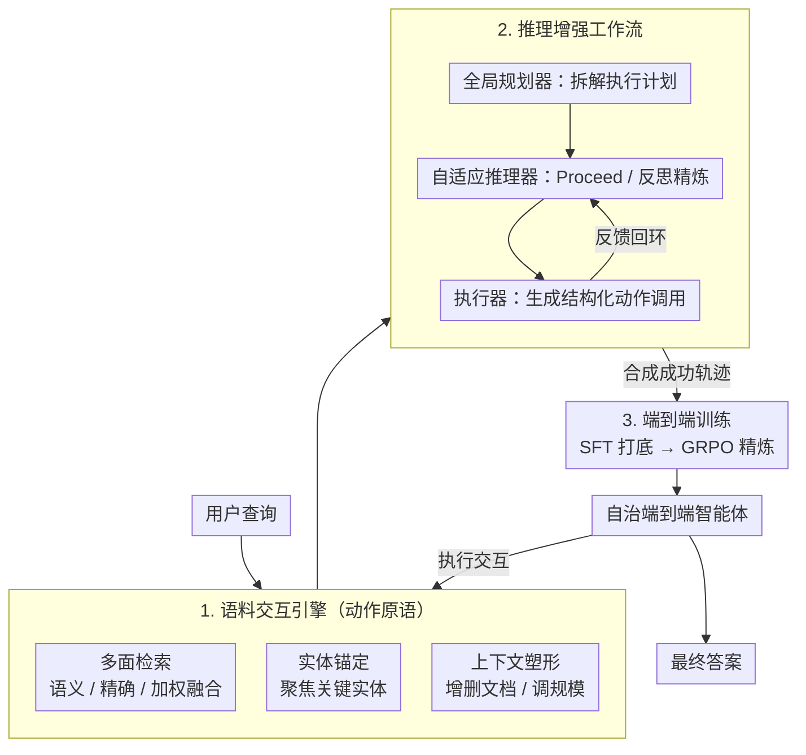

# Interact-RAG: Reason and Interact with the Corpus, Beyond Black-Box Retrieval

**会议**: ICLR 2026  
**OpenReview**: [https://openreview.net/forum?id=yHUjWb6eMe](https://openreview.net/forum?id=yHUjWb6eMe)  
**领域**: Agent / 检索增强生成（RAG）  
**关键词**: Agentic RAG, 语料交互, 细粒度检索, SFT+RL, GRPO

## 一句话总结
针对现有 agentic RAG 把检索当成"黑盒查询"、智能体只能反复换措辞的问题，本文提出 Interact-RAG，用一套"语料交互引擎"把检索过程拆开，给智能体多面检索、实体锚定、上下文塑形三类细粒度动作原语，再配合"规划-推理-执行"三模块工作流合成轨迹，经 SFT+RL 训出端到端自治智能体，在六个 RAG benchmark 上相对次优方法平均提升 22.5%。

## 研究背景与动机

**领域现状**：RAG 从单次检索的 Static RAG，发展到多步检索的 Iterative RAG，再到当下最前沿的 Agentic RAG——让一个 LLM 智能体自主决定"何时检索、查什么、如何分析检索结果"，并通过 prompt 驱动的多智能体协作或 SFT+RL 端到端训练来强化推理与适应能力。

**现有痛点**：尽管范式在进步，几乎所有 agentic RAG 都共享一个根本缺陷——把检索过程当成不透明的黑盒。智能体只能"发出一个查询、被动接收一堆文本块"，背后通常是一个基于 embedding 的语义检索器。它看不到检索内部状态，无法做细粒度干预，于是探索被困在"换个说法再查一次"的试错循环里。

**核心矛盾**：检索失败往往不是"查询语义不对"，而是证据表述方式不同（如问"发布日期"但原文写的是"是一部 1976 年的惊悚片"），或语义相近的干扰实体把检索带偏（如把"The Jaws of Death"误检到"The Hound of Death"）。这类失败靠语义相似度的同义改写根本绕不过去——黑盒检索缺的是**精确匹配、实体聚焦、噪声过滤**这种结构化操作能力，而不是更好的措辞。

**本文目标**：把智能体从"被动的查询发起者"升级为"主动的检索过程操控者"，需要解决两件事——给它细粒度的操作手段，以及教会它策略性地驾驭这套多步交互流程。

**切入角度**：作者认为应该"拆掉黑盒"，像人查资料一样让智能体直接操纵语料：既能选检索策略（语义/精确/加权融合），又能锚定实体、还能主动增删上下文文档。但光给能力不够，直接 prompt LLM 驾驭这套复杂多步流程很难，所以再设计一个分层工作流来既做 zero-shot 求解、又当数据合成器，最后把策略蒸馏进一个端到端智能体。

**核心 idea**：用"可交互的语料引擎 + 推理增强工作流 + SFT/RL 训练"三件套，把检索从"黑盒查询"变成"透明可操控的交互过程"。

## 方法详解

### 整体框架

Interact-RAG 由三个核心组件串成：(1) **语料交互引擎**——给智能体一套细粒度的交互原语，让它能多策略检索、锚定实体、塑形上下文，取代单一的语义查询；(2) **推理增强工作流**——把智能体行为拆成"全局规划器→自适应推理器→执行器"三模块，既是无需训练的 zero-shot 方案，又负责合成高质量交互轨迹；(3) **端到端训练**——用合成轨迹做 SFT 打底，再用 GRPO 强化学习精炼策略，最终得到一个**不依赖显式多模块架构**、单模型就能跑完整流程的自治智能体。

运行时，每一步智能体读入历史，输出一段"推理 thought"加一组并发动作 $A_t=\{a_{t1},a_{t2},\dots\}$（封装成结构化的 `<tool_call>` 函数调用）；交互引擎解析执行后，把聚合后的检索内容和关键元数据（文档 id、各策略相似度分数）包在 `<tool_response>` 里返还，智能体据此做策略分析、动态调整下一步动作。

### 关键设计

**1. 语料交互引擎：用三类动作原语拆掉检索黑盒**

这一组件直接针对"黑盒只能发查询"的痛点——它定义了一个语料交互动作空间 $\mathcal{A}_{CI}$，把检索拆成三类可组合的原语。**多面检索（Multi-Faceted Retrieval）**给智能体语义与词法两条腿：`semantic_search` 走 embedding 稠密检索找语义相关文档，`exact_search` 走稀疏检索按精确关键词排序、专治人名/术语/特定短语，`weighted_fusion(ws, we)` 让智能体按查询语境自定语义与精确两路的融合权重。**实体锚定（Anchored Matching）**用 `entity_match(entity)` 把搜索聚焦到某个具体实体上，专门压制"语义相近但不相关实体"带来的干扰。**上下文塑形（Context Shaping）**让智能体主动雕刻上下文：`include_docs`/`exclude_docs` 强制保留关键文档、过滤噪声文档，`adjust_scale(n)` 按子问题复杂度自适应调整检索块数量。

为什么这样有效：换措辞绕不过去的失败，本质是缺"精确匹配+实体聚焦+噪声过滤"这种结构化能力，而这三类原语正好补上。实现上也很轻——`exact_search` 和 `entity_match` 直接借关系数据库（SQLite）的全文检索（FTS）模块，多建一个文本索引但开销可忽略；上下文塑形用简单过滤器实现；即便单轮调用多个策略，引擎也不会产出多份大上下文，而是聚合成**单一整合上下文**返还，兼顾灵活与效率。

**2. 推理增强工作流：规划-推理-执行三模块，既做 zero-shot 又当数据合成器**

光给能力不够，直接 prompt 一个 LLM 去驾驭这套多步交互很难失稳。于是作者把智能体行为拆成三个协作模块。**全局规划器（Global-Planner）**先分析查询、拆出一份分步执行计划，给出高层战略路线图。**自适应推理器（Adaptive-Reasoner）**是认知核心：每步先分析当前状态（已做动作、已得信息、计划目标），再二选一发指令——若子任务进展顺利、信息充足就 **Proceed**（让执行器进下一步或收尾）；若遇阻（如信息不足）就进入 **Reflect & Refine** 反思相，诊断问题并精炼下一步交互策略（比如改用 `exact_search` 定位精确术语，或用 `exclude_docs` 滤掉误导文档），必要时还能改写原计划，避免死守初始路线。**执行器（Executor）**把策略翻译成带具体参数的结构化函数调用，所有子任务完成后生成最终答案。

这种"高层规划 / 细节推理 / 精确执行"的解耦对通用 LLM 很关键：任务边界清晰、各管一摊，输出更可靠。它带来两个好处——作为 training-free 方法直接提升 zero-shot RAG 的稳定性与逻辑连贯性；作为数据合成引擎，让 LLM 在**非推理模式**下产出干净的推理轨迹，避开原生大推理模型（LRM）那种冗长跑题的思考内容。

**3. SFT + RL 两阶段训练：把多模块策略内化进单个端到端智能体**

要的是一个不依赖显式多模块架构、单模型跑完整流程的自治智能体，于是用两阶段训练把工作流的策略蒸进去。**SFT 阶段**先教模型基本功（规划、推理、掌握交互）：用推理增强工作流基于 QA 对生成轨迹，**只保留最终答案命中 ground truth 的成功轨迹**保证数据质量，再让模型自回归地预测 thought 与 action 序列；计算损失时**屏蔽掉检索回来的信息 token**，避免学习时被干扰。**RL 阶段**用 GRPO（Group Relative Policy Optimization）通过主动探索发现更优策略，同样屏蔽检索 token：对每个问题采一组轨迹 $\{\tau_i\}_{i=1}^N$，优势 $\hat A(\tau_i)$ 由组内奖励归一化得到，鼓励向高奖励轨迹更新。

奖励是基于句法合法性与答案正确性的结果奖励：

$$R(\tau) = -1 + \mathbb{I}\{\tau_{valid}\} + \mathbb{I}\{\tau_{valid}\}\cdot\mathbb{I}\{y_{ans}\}$$

每条轨迹先吃 $-1$ 惩罚，逼模型产出格式连贯的输出；句法合法（动作序列结构、推理格式、tool call 语法都对）则 $+1$ 抵消惩罚；在合法前提下答案命中再 $+1$——正确奖励被合法性**门控**，确保只有格式良好的输出才可能拿分。作者也点明 $-1$ 这个常数项在 GRPO 的组内归一化里会被抵消、不影响实际训练，纯粹是为了直觉上的逻辑清晰。

### 损失函数 / 训练策略
GRPO 目标函数（带重要性采样比 $\rho_\theta$、裁剪 $1\pm\epsilon$、KL 正则 $\beta D_{KL}(\pi_\theta\|\pi_{ref})$）；默认主干 Qwen3-8B（另报 Qwen2.5-7B）；用 Qwen-Plus 合成 4.8K SFT 轨迹，再用 7.1K QA 对做 RL；训练集为 NQ+HotpotQA+MuSiQue 的训练划分，检索语料用 2018 Wikipedia dump，检索器 e5-base-v2、取 top-3 块。

## 实验关键数据

### 主实验

六个 benchmark（多跳：HotpotQA / 2Wiki / Musique / Bamboogle；单跳：NQ / PopQA），EM 分数对比（Qwen3-8B 主干，†表示用其官方 7B 模型）：

| 方法 | 2Wiki | Musique | Bamboogle | NQ | PopQA | AVG-EM |
|------|-------|---------|-----------|------|-------|--------|
| Std-RAG | 35.9 | 13.7 | 37.1 | 37.3 | 31.4 | 37.6 |
| MA-RAG | 45.5 | 18.0 | 34.6 | 40.2 | 35.5 | 39.3 |
| Search-R1† | 50.9 | 25.5 | 45.3 | 49.3 | 43.1 | 45.2 |
| S-DeepSearch† | 54.0 | 18.6 | 37.0 | 40.6 | 39.4 | 40.2 |
| **Interact-RAG** | **69.6** | **34.8** | **50.9** | **56.0** | **52.8** | **51.6** |

平均 EM 比次优的 Search-R1 高 9.7 分（相对提升 22.5%），且仅用 12K QA 训练数据 vs Search-R1 的 170K。多跳任务增益更明显（Musique 相对 +36.4%），单跳也稳（NQ +11.0%、PopQA +12.3%）。7B 版本同样相对提升 10.1%。

### 消融实验

整体消融（EM，Qwen3-8B）：

| 配置 | 2Wiki | Musique | PopQA | 说明 |
|------|-------|---------|-------|------|
| Interact-RAG | 69.6 | 34.8 | 56.0 | 完整模型 |
| w/o Interaction | 63.4 (-8.9%) | 30.1 (-10.9%) | 50.2 (-10.4%) | 退化为黑盒查询检索 |
| w/o SFT | 59.0 (-15.2%) | 26.4 (-21.9%) | 52.2 (-6.8%) | 去掉监督微调 |
| w/o RL | 65.2 (-6.3%) | 28.1 (-16.9%) | 45.6 (-18.6%) | 去掉强化学习 |

交互原语细粒度消融（EM）：

| 配置 | 2Wiki | Musique | PopQA |
|------|-------|---------|-------|
| Interact-RAG | 69.6 | 34.8 | 56.0 |
| w/o 多面检索 | 66.0 | 34.6 | 55.1 |
| w/o 实体锚定 | 66.3 | 34.4 | 53.4 |
| w/o 上下文塑形 | 68.8 | 33.6 | 55.2 |
| w/o 全部交互 | 63.4 | 30.1 | 50.2 |

### 关键发现
- **交互范式是地基**：去掉交互（退回黑盒查询）三个数据集全线下滑，证明细粒度检索控制是必要且有效的。
- **SFT 与 RL 各司其职**：SFT 负责建立规划/推理/迭代交互的基本功，去掉它在 Musique 上暴跌 21.9%；RL 负责发现更具策略性的策略，去掉它 PopQA 掉 18.6%——SFT 立框架、RL 优策略。
- **原语有协同效应且各擅其场**：单去一个原语只小掉，全去交互掉最多；多面检索与实体锚定对需要显式事实的 2Wiki 更关键，上下文塑形对干扰项多的 Musique 更有用。
- **训练自由场景也成立**：纯 Interact-RAG-Workflow（无训练）在 2Wiki/Musique/PopQA 上分别 60.1/24.1/43.6，全面超过 MA-RAG（45.5/18.0/40.2）；去交互或去工作流都明显掉点。
- **检索更高效**：相比只能查询的 Ours-Search 和 Search-R1，Interact-RAG 用更少的动作迭代拿到更高 EM。

## 亮点与洞察
- **"拆黑盒"这个 framing 很到位**：把"换措辞试错"的低效循环归因于缺结构化操作能力，而非措辞不够好，直接指向精确匹配/实体锚定/上下文增删这套人类查资料的直觉操作——问题诊断比方法本身更有启发性。
- **工作流既当求解器又当数据厂**：三模块工作流让通用 LLM 在非推理模式下产出干净轨迹，既给出 training-free 方案，又为 SFT 造出无 LRM 冗余思考的高质量数据，一鱼两吃。
- **并发动作 + 单一整合上下文**：允许单轮调用多个原语却只返还一份聚合上下文，避免了多份大 context 的开销，是个可复用的工程 trick。
- **损失屏蔽检索 token**：SFT 和 RL 都 mask 掉检索内容的 token，避免模型去拟合外部文本、专注学策略，值得迁移到其他工具调用类智能体训练。

## 局限与展望
- 交互原语依赖关系数据库 FTS 与额外文本索引，语料规模极大或非结构化语料下的开销与可扩展性未充分展开。
- 评测以 Wikipedia QA 为主（另有 MultiHop-RAG 域外验证），在专业领域/私有语料、长文档、多语种上的迁移性待验证。
- 训练用 Qwen-Plus 合成轨迹，数据质量与教师模型强绑定；只保留成功轨迹可能引入幸存者偏差，失败轨迹中的有用信号被丢弃。
- 奖励是纯结果型（格式+答案命中），对中间检索质量/冗余动作缺乏过程监督，可探索更细的过程奖励。

## 相关工作与启发
- **vs Search-R1（端到端 RL agent）**：两者都训端到端检索智能体，但 Search-R1 仍是黑盒查询、靠 170K QA 训练；Interact-RAG 给智能体细粒度交互原语，仅用 12K QA 就反超 9.7 EM，差距主要来自"能操控检索"而非"训练更多"。
- **vs MA-RAG（多智能体工作流）**：MA-RAG 靠多智能体协作但仍受限于黑盒检索；Interact-RAG 的 training-free workflow 在交互能力加持下全面超过它，且最终蒸成单模型免去显式多模块开销。
- **vs S-DeepSearcher / R-Search（合成数据 SFT / 多奖励 RL）**：它们优化的是查询生成或奖励信号，动作空间没变；Interact-RAG 改的是动作空间本身（拆黑盒），属于范式层的差异。

## 评分
- 新颖性: ⭐⭐⭐⭐⭐ "拆检索黑盒、给智能体细粒度交互原语"是 agentic RAG 里少见的范式级切入。
- 实验充分度: ⭐⭐⭐⭐⭐ 六 benchmark + 整体/原语/训练三套消融 + training-free 场景 + 效率分析，覆盖全面。
- 写作质量: ⭐⭐⭐⭐ 问题诊断与三组件逻辑清晰，部分图表编号有瑕疵但不影响理解。
- 价值: ⭐⭐⭐⭐⭐ 用少量数据大幅超 SOTA，且工作流可 training-free 部署，实用性强。

<!-- RELATED:START -->

## 相关论文

- [\[ACL 2026\] Beyond Black-Box Interventions: Latent Probing for Faithful Retrieval-Augmented Generation](../../ACL2026/information_retrieval/beyond_black-box_interventions_latent_probing_for_faithful_retrieval-augmented_g.md)
- [\[ICLR 2026\] Beyond RAG vs. Long-Context: Learning Distraction-Aware Retrieval for Efficient Knowledge Grounding](beyond_rag_vs_long-context_learning_distraction-aware_retrieval_for_efficient_kn.md)
- [\[ICLR 2026\] Beyond Text-Only: Towards Multimodal Table Retrieval in Open-World](beyond_text-only_towards_multimodal_table_retrieval_in_open-world.md)
- [\[ICLR 2026\] Query-Aware Flow Diffusion for Graph-Based RAG with Retrieval Guarantees](query-aware_flow_diffusion_for_graph-based_rag_with_retrieval_guarantees.md)
- [\[ICLR 2026\] Fathom-DeepResearch: Unlocking Long Horizon Information Retrieval and Synthesis for SLMs](fathom-deepresearch_unlocking_long_horizon_information_retrieval_and_synthesis_f.md)

<!-- RELATED:END -->
