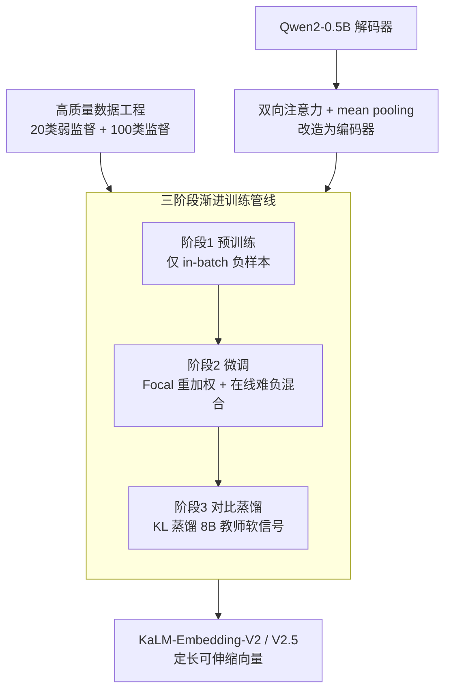

# KaLM-Embedding-V2: Superior Training Techniques and Data Inspire A Versatile Embedding Model

**会议**: ICLR 2026  
**OpenReview**: [https://openreview.net/forum?id=Y7qzhvWhcz](https://openreview.net/forum?id=Y7qzhvWhcz)  
**代码**: https://kalm-embedding.github.io/ (有)  
**领域**: 文本嵌入 / 信息检索  
**关键词**: 文本嵌入, 对比学习, 对比蒸馏, 难负样本, 多阶段训练

## 一句话总结
这篇论文把一个 0.5B 的 Qwen2 解码器改造成全双向编码器，配上「预训练→微调→对比蒸馏」三阶段管线、Focal 风格重加权、在线难负样本混合，以及覆盖 100+ 类别的高质量数据工程，让 KaLM-Embedding-V2.5 在 MTEB 中英榜上拿下 <1B 参数段的 SOTA，甚至能和 3–26 倍大的模型掰手腕。

## 研究背景与动机
**领域现状**：文本嵌入是检索、重排、分类、STS 乃至 RAG 的底层基础设施。近两年主流做法是拿 LLM（Mistral / Qwen 等）当 backbone，用对比学习把语义相近的文本拉近、相远的推开，再靠堆数据规模或合成数据来涨点。

**现有痛点**：绝大多数高性能嵌入模型来自工业界，数据私有、训练代码封闭、有商用限制、可复现性差；同时它们几乎都把精力放在「数据规模/合成」上，对**训练技巧**和**数据质量**本身的系统性探索很少——没人讲清楚架构设计、训练目标、数据策略到底该怎么协同编排，才能把 LLM 里的嵌入潜力榨干。

**核心矛盾**：实际部署最看重的是**通用性**（一个模型打通所有任务）和**紧凑性**（参数小、推理快），但现有 SOTA 要么很大（7B–13B），要么是闭源黑盒，两者难以兼得；而小模型若只靠堆数据，性能又上不去。

**本文目标**：在 0.5B 这个紧凑量级上，把开源、可商用、可复现的嵌入模型做到 <1B 段的 SOTA，并系统回答「训练技巧 + 数据质量怎么组合最有效」。

**切入角度**：作者不去无脑扩数据，而是从三个被忽视的维度同时下手——架构（去掉因果掩码、放开双向注意力）、训练目标（让优化别被海量简单样本带偏）、数据（精细分类 + 难负挖掘 + 样例式多类标注）。

**核心 idea**：用「双向架构 + 三阶段渐进训练 + 难度感知的训练目标 + 高质量数据工程」四管齐下，把 LLM 的知识系统性地灌进一个 0.5B 的嵌入模型。

## 方法详解

### 整体框架
KaLM-Embedding-V2 从 Qwen2-0.5B 出发：先做**架构改造**——去掉解码器的因果注意力掩码、改成全双向，并用简单的 mean-pooling 把变长 token 表示压成定长向量 $E \in \mathbb{R}^d$。改造后的模型沿一条**三阶段渐进管线**训练：阶段 1 在 20 多类弱监督大规模数据上预训练（只用 in-batch 负样本）学通用表示；阶段 2 在 100+ 类高质量监督数据上微调，此处接入 **Focal 重加权 + 在线难负样本混合** 这台「难样本引擎」；阶段 3 做**对比蒸馏**，从 Qwen3-Embedding-8B 教师那里蒸馏细粒度软信号。整条管线由一套覆盖检索/分类/聚类/STS/对分类的**高质量数据工程**供给。只经过预训练+微调的模型叫 V2，再加对比蒸馏的叫 V2.5。

### 关键设计

**1. 双向注意力 + mean pooling 架构改造：让解码器变成合格的编码器**

解码器 LLM 天生带因果掩码，每个 token 只能看到左边的上下文，这对「理解整句语义并压成一个向量」的表示学习是天然短板。本文直接移除因果掩码、在训练和推理时都启用全双向注意力，让每个 token 都能看到完整上下文；池化层 $P(\cdot)$ 选最简单的 mean-pooling 而非加可学习头，把 token 表示 $T_{emb}=K(T)$ 平均成单一向量 $E=P(T_{emb})$。查询侧会拼上可选的任务指令 $q_{inst} = \text{Instruct: }\{\text{task instruction}\}\text{ Query: } q$，对称任务（STS、对分类）还会把指令同时拼到 passage 上。这套改造让 0.5B 的小模型也能产出判别力强的表示，消融里去掉双向注意力会稳定掉点。

**2. 三阶段渐进训练管线：从粗到细逐级唤醒嵌入能力**

一步到位地在高质量数据上训练，既浪费了大规模弱监督数据的泛化红利，也学不到细粒度差异。本文把训练拆成由粗到细的三段：**预训练**在 470M 样本、20+ 类弱监督数据（含噪声）上用 InfoNCE 目标（式 3，仅 in-batch 负样本）打通用底子；**微调**在 6M 样本、100+ 类高质量监督数据上用带难负样本的目标（式 7），并刻意用较小 batch 缓解 in-batch 假负样本问题；**对比蒸馏**不再继续喂粗粒度硬标签，而是从更强教师蒸馏软信号。三段衔接让表示从「粗粒度泛化」平滑过渡到「细粒度判别」，这也是 V2→V2.5 涨点的来源。

**3. Focal 重加权 + 在线难负样本混合：把优化火力聚到难样本上**

标准对比损失对每个样本一视同仁，结果优化方向被海量简单样本主导。借鉴 Focal Loss，本文按难度给样本加权：正样本概率 $p_i = e^{s(q_i,p_i^+)/\tau}/Z_i$ 越高（越简单）权重越小，权重为 $w_i = (1-p_i)^\gamma$，损失变为 $\mathcal{L} = \mathbb{E}_{i\in N}[-w_i \log p_i]$，$\gamma$ 越大越偏向难样本（$\gamma=0$ 退化为均匀加权）。但还有个问题：离线挖好的难负样本训几轮后就「不难」了，传统做法每隔上千步重挖一次，代价高。于是本文提出**在线难负混合**——直接对已有难负样本特征做插值合成新难负，成对混合 $\tilde{h}_i^- = \lambda p_{i,j}^- + (1-\lambda) p_{i,k}^-$（$\lambda \sim \text{Beta}(2,2)$），或按相似度加权的列表混合 $\tilde{s}_i^- = \sum_m \lambda_m p_{i,m}^-$（$\sum_m \lambda_m = 1$），归一化后并入分母 $Z_i$ 作为额外难负。它几乎零额外开销就能持续供给「有信息量」的难负样本。消融显示去掉 Focal 重加权是所有组件里掉点最多的。

**4. 高质量数据工程：精细分类 + 难负挖掘 + 样例式多类标注**

小模型要打平大模型，数据质量是关键杠杆。本文为预训练整理 20+ 类、为微调/蒸馏整理 100+ 类数据，统一改写成「query / 正样本 / 难负样本」的检索式格式，并配套三件套保质量：**难负挖掘**——多数检索数据只有 query-正例对，于是用已训模型检索候选、从排名 50–100 位采样 7 个负例（既不太易也不太像正例）；**persona 合成**——用 Qwen2-72B-Instruct 配 Persona Hub 人设生成 55 万跨 6 类任务的合成样本以增广覆盖；**样例式多类标注**——对聚类/分类数据，不只用「标签文本」当正例，而是从同类里随机采**样例**当正例、异类采样当负例，缓解某些数据集类别太少、难负不足的问题。消融里这一招在聚类任务上提升尤为明显（中文聚类 +8.38）。

### 损失函数 / 训练策略
对比学习用 InfoNCE，分母 $Z_i$ 含正例、in-batch 负例、in-batch 难负三项，叠加在线合成难负；微调/蒸馏阶段统一带 Focal 权重 $w_i$。对比蒸馏用 KL 散度对齐师生的温度缩放相似度分布 $\mathcal{L}_{KL}=D_{KL}(P_t\|P_s)$，其中 $P_t(i)=e^{z_{t,i}/\tau}/\sum_j e^{z_{t,j}/\tau}$。此外把 Matryoshka 表示学习（MRL）同时挂到对比损失和 KL 损失上，使向量可在 256 等更低维度下仍保持性能。

## 实验关键数据

### 主实验
评测覆盖 MTEB 中文（cmn, v1）和英文（eng, v1），MTK = Mean(Task)，MTY = Mean(Type)。

| 模型 | 参数量 | cmn MTK | eng MTK | Avg MTK | Avg MTY |
|------|--------|---------|---------|---------|---------|
| Qwen3-Embedding-0.6B | 596M | 66.33 | 66.76 | 66.55 | 65.53 |
| jina-embeddings-v3 | 572M | 61.82 | 65.51 | 63.67 | 62.19 |
| gte-multilingual-base | 305M | 62.94 | 61.40 | 62.17 | 62.01 |
| KaLM-Embedding-V1 | 494M | 63.78 | 64.94 | 64.36 | 63.03 |
| **KaLM-Embedding-V2** | 494M | 68.15 | 67.47 | 67.81 | 66.71 |
| **KaLM-Embedding-V2.5** | 494M | **70.93** | **69.33** | **70.13** | **69.16** |
| Qwen3-Embedding-8B（参考） | 8B | 73.84 | – | – | – |
| NV-Embed-v2（参考） | 7B | – | 72.31 | – | – |

V2 相比 V1 在中文 +4.37 MTK、英文 +2.53 MTK；V2.5 进一步把 <1B 段刷到 70.13 avg MTK，逼近数十亿参数模型，而它只用约 6M 样本、2–4 张 GPU 微调蒸馏（Qwen3-Embedding-0.6B 用了 19M 样本）。

### 消融实验
| 配置 | cmn MTK | eng MTK | 说明 |
|------|---------|---------|------|
| KaLM-Embedding-V2.5（完整） | 70.93 | 69.33 | 完整模型 |
| w/o Focal 重加权 | 69.41 | 68.70 | 掉点最多（cmn −1.52） |
| w/o 在线难负混合 | 70.54 | 68.91 | 一致小幅下降 |
| w/o 双向注意力 | 70.50 | 68.94 | 一致小幅下降 |

| 分析项 | 关键结果 | 结论 |
|--------|---------|------|
| 样例式 vs 标签式标注 | 中文聚类 73.09 vs 64.71（+8.38） | 样例式标注对聚类增益巨大 |
| 对比蒸馏 CL+KL / only KL / only CL | cmn 70.93 / 70.72 / 68.31 | KL 是主信号，CL 辅助，组合最优 |
| 温度系数 τ（Low/Mid/High） | Mid(0.05) 最优 | 太小教师分布过尖、太大过平，都损信息量 |

### 关键发现
- **Focal 重加权贡献最大**：去掉它中英都掉得最狠，说明「优化被简单样本主导」确实是小模型涨点的主要瓶颈。
- **对比蒸馏里 KL 才是主力**：only CL 掉到 68.31，只 KL 还能保 70.72，软信号比硬标签更能教会细粒度判别。
- **样例式多类标注专治聚类**：把「标签文本当正例」换成「同类样例当正例」，聚类任务大幅起飞。
- **温度敏感**：KL 蒸馏对 τ 很敏感，过尖或过平的教师分布都会削弱学习信号。

## 亮点与洞察
- **在线难负混合是性价比之王**：用特征插值合成难负，避开了「每隔上千步重挖」的昂贵循环，几乎零开销却能持续供给有信息量的难负样本——这个思路可迁移到任何需要难负的对比训练。
- **难度感知贯穿目标设计**：Focal 重加权 + 难负混合本质都在回答「怎么让模型多盯难样本」，两者一个调权重、一个造样本，互补叠加。
- **样例式多类标注**把分类/聚类数据「检索化」的方式很巧——用同类样例而非干瘪标签当正例，天然制造了更丰富的语义对比。
- **全开源可商用**：模型、代码、数据全开放且允许商用，对学术复现和工业落地都是稀缺资源。

## 局限与展望
- **未在大规模多语种语料上训练**：虽然附录显示多语种表现尚可，但并非针对多语种优化，跨语种检索可能不及专门的多语种模型。
- **蒸馏依赖强教师**：V2.5 的提升建立在 Qwen3-Embedding-8B 这个强教师之上，没有合适教师时这一阶段的红利难复现。
- **难负混合的合成质量缺乏直接评估**：特征插值出的「合成难负」是否始终语义合理、会不会引入伪难负，论文未单独量化。
- **改进方向**：把在线难负混合与课程学习结合、动态调整 $\gamma$ 与 $\lambda$ 分布，或探索自蒸馏以摆脱对外部大教师的依赖。

## 相关工作与启发
- **vs NV-Embed / E5-Mistral 等大模型嵌入**：它们走「大 backbone + 海量数据」路线、参数 7B 起步；本文在 0.5B 上靠训练技巧 + 数据质量把性能压到接近，胜在紧凑与可复现。
- **vs Qwen3-Embedding-0.6B**：同为 <1B 段强基线，但本文用更少样本（6M vs 19M）和更少算力达到更高 MTEB 分，凸显「训练技巧 > 单纯堆数据」。
- **vs 传统离线难负挖掘**：传统做法定期重挖、代价高且滞后；本文用在线特征混合实时合成难负，效率和持续性都更好。
- **vs 仅用硬标签的对比蒸馏**：本文蒸馏的是温度缩放后的软相似度分布，能传递正负之间的细粒度差异，而非只学「谁是正例」。

## 评分
- 新颖性: ⭐⭐⭐⭐ 单点（双向、Focal、蒸馏）多有渊源，但在线难负混合 + 样例式标注 + 系统化编排有实打实的工程新意。
- 实验充分度: ⭐⭐⭐⭐⭐ MTEB 中英全面对比 18 个模型，组件级消融 + 温度/标注/蒸馏分析齐全，还有 OOD、Matryoshka、多语种附录。
- 写作质量: ⭐⭐⭐⭐ 结构清晰、公式完整，四个创新维度交代到位。
- 价值: ⭐⭐⭐⭐⭐ 全开源可商用、0.5B 段 SOTA，对学术复现和工业落地都极具实用价值。

<!-- RELATED:START -->

## 相关论文

- [\[ICLR 2026\] HUME: Measuring the Human-Model Performance Gap in Text Embedding Tasks](hume_measuring_the_human-model_performance_gap_in_text_embedding_tasks.md)
- [\[ACL 2026\] SkMTEB: Slovak Massive Text Embedding Benchmark and Model Adaptation](../../ACL2026/information_retrieval/skmteb_slovak_massive_text_embedding_benchmark_and_model_adaptation.md)
- [\[ICLR 2026\] Let LLMs Speak Embedding Languages: Generative Text Embeddings via Iterative Contrastive Refinement](let_llms_speak_embedding_languages_generative_text_embeddings_via_iterative_cont.md)
- [\[ICLR 2026\] Reusing Pre-training Data at Test Time is a Compute Multiplier](reusing_pre-training_data_at_test_time_is_a_compute_multiplier.md)
- [\[ICLR 2026\] Uncertainty-driven Embedding Convolution](uncertainty-driven_embedding_convolution.md)

<!-- RELATED:END -->
