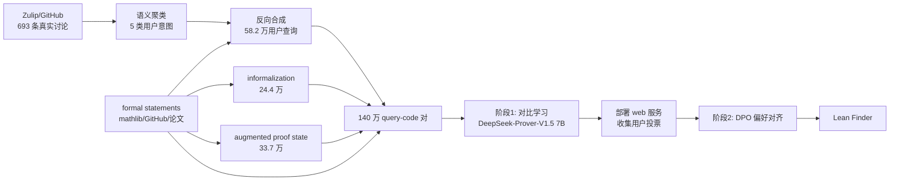

# Lean Finder: Semantic Search for Mathlib That Understands User Intents

**会议**: ICLR 2026  
**OpenReview**: [https://openreview.net/forum?id=5XNnnbEcu5](https://openreview.net/forum?id=5XNnnbEcu5)  
**代码/主页**: [https://leanfinder.github.io](https://leanfinder.github.io)  
**领域**: 信息检索 / 形式化数学 / Lean 定理证明  
**关键词**: 语义搜索, Lean/mathlib, 用户意图, 对比学习, DPO 偏好对齐, 代码检索  

## 一句话总结
针对 mathlib4 检索"只对齐机翻 informalization、却对不上真实数学家提问"的痛点，Lean Finder 用"反向合成用户查询 + 多模态对比学习 + 用户偏好 DPO 对齐"训练一个面向用户意图的 Lean 语义检索器，在真实查询上相对现有引擎和 GPT-4o 取得 30%+ 提升。

## 研究背景与动机
**领域现状**：Lean 4 与社区库 mathlib4（23 万+ 定理、11 万+ 定义）正把数学发现变成可机器验证的协作流程，LLM 定理证明器和自动形式化都在快速推进。但要写证明，第一步往往卡在"找到那条该用的引理"——库规模巨大、命名约定漂移、`#find`/Loogle 这类工具只能靠精确名字或目标状态匹配，常常失灵。

**现有痛点**：近年出现的 LLM 语义搜索引擎（Lean Search、Herald、Lean State Search 等）都把"formal statement 机翻成自然语言（informalization）"当作查询侧来训练，本质上是在对齐**机器翻译的中立表述**，而不是**真实用户怎么问**。论文用 PCA 可视化（Figure 2）证明这道鸿沟客观存在：LLM 生成的 informalization 分布只覆盖真实 Zulip/GitHub 用户查询分布的一个子空间。

**核心矛盾**：同一个数学情境，数学家会带着各自的**动机、视角、抽象层次**去问。论文给的例子很说明问题——两个查询都涉及域扩张里的代数元 $x,y$ 与极小多项式，但 Query 1 是在断言两个单扩张之间的同构、Query 2 却是想判定"$y$ 是 $x$ 极小多项式的根能否推出两者极小多项式相等"。这种"用户隐变量"无法靠纯语法的 informalization 推断出来。

**本文目标**：造一个**以用户为中心、能理解数学家意图**的 Lean/mathlib4 检索引擎。**核心 idea（反向工程合成用户查询 + 偏好对齐）**：既然真实带标注的用户查询稀缺（全网只捞到 693 条），就反过来——假设每条 formal statement 都是某个未知用户查询的答案，再按真实数学家的提问视角反向合成大规模查询数据，并用部署后收集的真实偏好把检索器对齐到用户需求。

## 方法详解

### 整体框架
Lean Finder 分三块：先从真实公开讨论里**聚类出用户意图**，再据此**反向合成大规模用户查询**并配上多种输入模态（informalization、proof state、formal statement），组成 140 万查询-代码对的训练集；然后用**两阶段训练**——对比学习建立多模态对齐，再用真实用户投票 + LLM 反馈做 DPO 偏好对齐——得到一个既强检索又对齐用户偏好的嵌入模型。

### 关键设计

**1. 反向工程式的用户查询合成：先聚意图，再从答案倒推问题。** 真实用户查询无法规模化标注——不仅总量极小（仅 693 条可答查询），而且因为很多是开放数学问题、mathlib4 又在持续演进，根本无法为每条查询追溯到确切的 formal statement 答案。论文绕开这个死结：用 Zulip API 抓取五个活跃频道（new members、lean4、mathlib4、Is there code for X、metaprogramming/tactics）的讨论，GPT-4o 过滤出"能被 Lean 语句回答"的问题并改写出核心查询；再用 OpenAI o3 迭代式聚类，归纳出五类数学家意图——**找现成代码/引理、元编程/tactic 问题、类型类/instance/公理问题、日常证明工程、库设计与大规模形式化**（Table 1）。有了意图分类后做反向合成：假设每条 formal statement 是某未知查询的答案，先让 GPT-4o 判断这条语句**适用哪几类意图**（避免硬塞进不相关的 cluster），再针对每个选中的 cluster 带上 formal/informal 语句等上下文去生成查询，最终产出 58.2 万条覆盖五类意图的合成查询。PCA 显示这些合成查询的分布显著比 informalization 更贴近真实用户簇。

**2. 最大规模的 Lean 多模态代码检索数据集：让一个检索器吃下四种输入。** 真实使用中用户的"查询侧"形态各异，所以训练集刻意混进四种模态：合成用户查询、informalization、augmented proof state、formal statement，共 140 万对。其中数据来源不止 mathlib4，还纳入研究论文关联的 GitHub 仓库与领域库，保证覆盖前沿数学；informalization 沿用 Herald 思路，喂给 GPT-4o 依赖语句/相邻语句等丰富上下文以提质量；**augmented proof state** 是亮点——在原始 proof state（子目标+上下文+目标）基础上，用 GPT-4o 合成一段"这一步打算往哪个方向推进"的自然语言描述，模拟用户搜索可用引理时的真实表述，支持更细粒度检索；formal statement 模态则只保留声明、去掉证明体，覆盖"用户只记得部分语句"的场景。

**3. 对比学习建立多模态对齐。** 以 DeepSeek-Prover-V1.5-RL 7B 为底座（因其在 Lean 4 语法与证明任务上训练充分）。decoder-only 架构下只有最后一个 token 能看到全上下文，于是取最后一层最后 token 的隐状态作为整段嵌入。训练构造大小为 $G$ 的样本组：每个查询 $q_i$ 配一个正例 $c_i^+$ 和 $G-1$ 个负例，batch 内 $B$ 个组拼成候选集 $C_b$（$|C_b|=B\cdot G$），并对查询做 token 级增强 $\tilde q_i$（模拟拼写错误/不完整回忆）提升鲁棒性。除自身正例外其余全当负例（in-batch negatives），优化温度为 $\tau$ 的对比损失：

$$\mathcal{L}_{\text{contrastive}} = -\frac{1}{B}\sum_{i=1}^{B}\log\frac{\exp\big(\mathrm{Sim}(\tilde q_i, c_i^+)/\tau\big)}{\sum_{c\in C_b}\exp\big(\mathrm{Sim}(\tilde q_i, c)/\tau\big)}$$

**4. 把 DPO 改造成检索器的偏好对齐。** 检索器部署成 web 服务后收集两个层级的偏好：单条检索结果的用户上/下投票（retrieval-level），以及 Lean Finder vs Lean Search 的盲测模型级偏好（既来自用户在线选择，也来自 GPT-4o 对 Zulip 真实查询检索结果的评判），共得 1154 条偏好三元组 $(q,c^+,c^-)$。把原 DPO 里的序列似然换成"基于 query-code 相似度算出的候选语句概率"，$\theta$ 为当前策略、$\theta_{\text{ref}}$ 为对比训练得到的参考检索器，$\beta$ 控制偏离：

$$\mathcal{L}_{\text{DPO}} = -\mathbb{E}_{(q,c^+,c^-)\sim P}\Big[\log\sigma\big(\beta\big[(\mathrm{Sim}_\theta(q,c^+)-\mathrm{Sim}_\theta(q,c^-)) - (\mathrm{Sim}_{\theta_{\text{ref}}}(q,c^+)-\mathrm{Sim}_{\theta_{\text{ref}}}(q,c^-))\big]\big)\Big]$$

为防止偏好对齐把通用检索能力带崩，这一阶段联合对比损失一起训：$\mathcal{L} = \mathcal{L}_{\text{DPO}} + \lambda\,\mathcal{L}_{\text{contrastive}}$。

## 实验关键数据

### 主实验：跨输入模态的检索性能
测试集含 1000 informalized statement、1000 formal statement、1000 合成用户查询、2224 proof state。formal statement 输入按 20% token 随机替换模拟噪声。

**Table 2（informalized / synthetic query / augmented statement，Recall@1 / R@5 / R@10 / MRR）**

| 模型 | Informalized R@1 | Synthetic Query R@1 | Augmented Stmt R@1 |
|---|---|---|---|
| **Lean Finder** | **64.2** / 88.9 / 93.3 / 0.75 | **54.4** / 84.4 / 91.4 / 0.68 | **82.7** / 97.0 / 97.7 / 0.89 |
| Lean Search | 49.2 / 76.5 / 82.5 / 0.61 | 47.1 / 77.7 / 83.7 / 0.60 | 59.2 / 81.9 / 85.5 / 0.69 |
| GPT-4o (full name) | 14.8 | 13.6 | 39.7 |
| GPT-4o (stem match) | 21.1 | 17.8 | 48.2 |

**Table 3（proof state 输入，Recall@1 / R@5 / R@10 / MRR）**

| 模型 | Augmented Proof State R@1 | Raw Proof State R@1 |
|---|---|---|
| **Lean Finder** | **24.6** / 56.8 / 67.9 / 0.40 | **8.3** / 30.1 / 40.0 / 0.19 |
| Lean State Search | 4.99 / 27.7 / 39.6 / 0.16 | 3.3 / 23.1 / 32.1 / 0.13 |
| Real Prover Search | 8.0 / 29.0 / 39.2 / 0.18 | 7.1 / 26.2 / 34.3 / 0.16 |
| GPT-4o (stem match) | 10.1 | 6.4 |

值得注意：Lean Finder 连**从未显式训练过的 raw proof state** 上也超过专门做该模态的 Lean State Search，说明意图建模带来了跨模态泛化。

### 真实用户研究（Table 4）
5 名参与者对 128 条 GitHub 真实查询做盲测排序，每模型给三条检索结果。

| 模型 | 第1名票数 | Top-3 命中率 | 归一化 Borda |
|---|---|---|---|
| **Lean Finder** | **139** | **81.6%** | **0.67** |
| Lean Search | 70 | 56.9% | 0.41 |
| GPT-4o | 71 | 54.1% | 0.40 |

最佳票数近乎是基线的两倍，Top-3 命中率 81.6% 远高于 56.9%/54.1%。

### 关键发现
- **机翻分布 ≠ 真实查询分布**：GPT-4o 即便开了 web search、用宽松 stem-match 评分仍很差，印证"会生成"不等于"能精确检索依赖语句"。
- **作为 prover 即插即用检索器**：以 RAG 方式接入 Goedel Prover、DeepSeek-Prover V1.5、REALProver，在 MiniF2F/ProofNet/PutnamBench/FATE-M 上整体与不接入持平、部分基准有小幅提升——属"无需重训的 prover-agnostic"增益，但提升有限。
- **数据集贡献**：开源迄今最大的 Lean 代码检索数据集，140 万对（58.2 万合成查询 + 24.4 万 informalization + 33.7 万 proof state + 24.4 万 formal statement）。

## 亮点与洞察
- **问题定位锋利**：明确指出整个 Lean 检索方向都在"对齐机翻而非对齐用户"，并用 PCA 把这道"分布鸿沟"量化出来，是全文最有说服力的一击。
- **反向合成数据范式可迁移**：在"答案易得、查询稀缺"的领域（代码搜索、API 检索、法律/医学问答），"假设每条文档是某查询的答案 → 按意图聚类反向生成查询"是一条很实用的造数据思路。
- **augmented proof state**：给冷冰冰的 proof state 配一段"打算往哪推进"的自然语言，把检索器的输入从语法状态升级成意图表达，是个低成本却有效的小设计。
- **闭环偏好对齐**：把 web 服务的真实投票直接回灌成 DPO 偏好数据，形成"部署→收集→对齐"的产品级闭环。

## 局限与展望
- **proof state 绝对性能仍低**：raw proof state 上 R@1 只有 8.3，说明从证明状态精确定位引理这件事远未解决，离实用还有距离。
- **合成查询的"真实性"靠 LLM 背书**：查询由 GPT-4o 生成、偏好部分也由 GPT-4o 评判，可能引入 LLM 自身偏好，且因隐私不释放真实 Zulip/GitHub 查询，外部难以完全复核分布对齐程度。
- **偏好数据规模小**：DPO 只用 1154 条三元组，相对 140 万对训练数据偏少，偏好对齐的泛化边界尚不清晰。
- **接入 prover 增益有限**：RAG 集成"整体持平、部分小升"，离"显著提升证明成功率"还有差距，检索与推理的协同方式有待深挖。
- **mathlib 演进的时效性**：库持续更新，检索库与嵌入需要定期重建，长期维护成本值得关注。

## 相关工作与启发
- **Lean 检索引擎**：Lean Search / Herald（Gao 等）、Lean State Search、Real Prover Search、Lean Explore——本文与它们的根本差异是把"用户意图"显式建模进训练数据。
- **代码搜索**：CodeSearchNet、对比式嵌入训练——本文把通用代码检索范式专门化到形式化数学。
- **偏好对齐**：DPO（Rafailov 等）原用于语言生成，本文将其迁移到检索打分，是 DPO 在 IR 场景的一次有意思的改造。
- **启发**：在任何"专业领域语义检索"里，与其堆更大的通用嵌入，不如先回答"真实用户到底怎么问"——意图聚类 + 反向合成查询 + 部署后偏好闭环，可能比单纯扩数据更有效。

## 评分
- **新颖性**: ⭐⭐⭐⭐ — "对齐机翻 vs 对齐用户"的问题切入很新，反向合成查询 + DPO 检索对齐组合扎实；单项技术（对比学习/DPO）非首创，但用法和落地角度新颖。
- **实验充分度**: ⭐⭐⭐⭐ — 覆盖五种输入模态、真实用户盲测、prover 集成三条线，并开源最大 Lean 检索数据集；proof state 绝对性能和偏好数据规模略弱。
- **写作质量**: ⭐⭐⭐⭐ — 动机讲得清楚有力，两个对比查询和 PCA 图很有说服力，pipeline 与公式表述规范。
- **价值**: ⭐⭐⭐⭐ — 直击形式化数学社区"找引理难"的真实痛点，已部署成 web 服务且可即插即用接入 prover，实用价值高。

<!-- RELATED:START -->

## 相关论文

- [\[ICLR 2026\] Mapping Semantic & Syntactic Relationships with Geometric Rotation](mapping_semantic_syntactic_relationships_with_geometric_rotation.md)
- [\[ICLR 2026\] Improving Semantic Proximity in Information Retrieval through Cross-Lingual Alignment](improving_semantic_proximity_in_information_retrieval_through_cross-lingual_alig.md)
- [\[ICLR 2026\] Welfarist Formulations for Diverse Similarity Search](welfarist_formulations_for_diverse_similarity_search.md)
- [\[ICLR 2026\] Hybrid Deep Searcher: Scalable Parallel and Sequential Search Reasoning](hybrid_deep_searcher_scalable_parallel_and_sequential_search_reasoning.md)
- [\[ACL 2026\] Optimizing User Profiles via Contextual Bandits for Retrieval-Augmented LLM Personalization](../../ACL2026/information_retrieval/optimizing_user_profiles_via_contextual_bandits_for_retrieval-augmented_llm_pers.md)

<!-- RELATED:END -->
