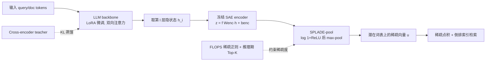

# Learning Retrieval Models with Sparse Autoencoders

**会议**: ICLR 2026  
**OpenReview**: [https://openreview.net/forum?id=TuFjICawSc](https://openreview.net/forum?id=TuFjICawSc)  
**代码**: 待确认  
**领域**: 信息检索 / 学习型稀疏检索  
**关键词**: Learned Sparse Retrieval, Sparse Autoencoder, SPLADE, Multilingual Retrieval, MMTEB, LLM Embedding  

## 一句话总结
用预训练的稀疏自编码器（SAE）替换 SPLADE 的词表投影头，把查询/文档编码成"潜在词表"空间的稀疏向量，得到的 SPLARE 模型在多语言与跨域检索上系统性超越基于词表的稀疏检索，并首次让稀疏检索在 MMTEB 上追平稠密 SOTA。

## 研究背景与动机
**领域现状**：学习型稀疏检索（LSR）以 SPLADE 为代表，把查询和文档表示成 backbone 词表空间上的稀疏加权词袋，靠倒排索引高效检索，且天然可解释——在英文 benchmark 上长期是 SOTA，泛化性也强于稠密模型。近期工作把 SPLADE 从 BERT 迁到 LLM backbone（如 Lion-SP-8B），进一步抬高了天花板。

**现有痛点**：这些 LLM 版 SPLADE 仍困在词表里。词表投影带来三重问题——分词冗余（"Indian"和"indian"占两个维度）、维度数被 backbone 词表大小写死无法扩展、最关键的是难以处理多语言/跨语言检索（词表本质偏向 Latin-script 子词，遇到泰米尔语等低资源语言只能退化成英文子词近似）。结果是在强调跨语言、跨域泛化的 MMTEB 上，稀疏检索全面落后于稠密模型，截至成文时 MMTEB 多语言榜上甚至没有一个稀疏模型。

**核心矛盾**：LSR 的效率与可解释性优势很诱人，但它的表示空间（固定词表）恰恰是泛化的瓶颈——稀疏检索想要的"语义结构化、跨语言一致"的离散维度，词表给不了。

**本文目标**：找一个比词表更好的稀疏"词汇表"，让 LSR 在保持效率和可解释性的同时，在多语言/跨域上追平甚至超过稠密 SOTA。

**核心 idea**：**用 SAE 的潜在特征当词表**。SAE 把 LLM 的稠密激活分解成稀疏的潜在特征，而这些特征已被大量可解释性工作证明具有单语义、语言无关、甚至跨模态的性质——这正是稀疏检索梦寐以求的语义空间。于是只要把 SPLADE 的 LM head 换成一个冻结的预训练 SAE encoder，就能在"潜在词表"上做稀疏检索。

## 方法详解

### 整体框架
SPLARE（SParse LAtent REtrieval）在结构上几乎是 SPLADE 的同构替换：唯一区别是把"取最后一层隐状态 → 经 LM head 投到词表"换成"取中间某层隐状态 → 经冻结 SAE encoder 投到潜在特征空间"，之后沿用 SPLADE 的 term-saturation + max-pooling 把 token 级稀疏向量聚合成序列级稀疏表示，相关度仍是稀疏点积、靠倒排索引算。训练时只用 LoRA 微调 LLM backbone，SAE 全程冻结。

### 关键设计

**1. 潜在词表替代词表投影：用冻结 SAE encoder 取中间层稀疏特征**。给定第 $l$ 层隐状态 $h_i$，用 SAE 的 encoder $z = f(W_{enc} h_i + b_{enc})$ 得到 $|W|$ 维潜在 logits（$|W| \gg d$），完全平行于 SPLADE 用 LM head 投到词表 $V$。论文只取 encoder 参数（不需要 decoder，因为目标是抽特征而非重建），且用残差流上训练的 SAE。聚合沿用 SPLADE 公式 $u_j = \max_{i} \log(1 + \mathrm{ReLU}(w_{ij}))$。这一步带来三个直接收益：潜在特征语言无关（英文训练即可泛化到 100+ 语言）、维度数解耦于词表（可随 SAE 宽度扩展）、且消除了分词冗余。一个反直觉的发现是**最优层在约 2/3 深度**（Llama-3.1-8B 取 layer 20 左右、Gemma 取 layer 16 左右）而非最后一层，既因为中间层表示对检索更丰富，又因为只跑前 2/3 层显著降低了推理延迟——这是相对 SPLADE 必须跑完所有层的额外加分。

**2. 蒸馏 + FLOPS 正则的训练目标**。不同于稠密 embedding 主流的对比学习，SPLARE 沿用 SPLADE 的训练范式：用 cross-encoder teacher 做蒸馏，优化 teacher 与 student 相关度分布的 KL 散度 $L_{KL} = \sum_i p_i(\log p_i - \log \hat p_i)$，其中 $\hat p_i = e^{s(q,d_i)/\tau}/\sum_j e^{s(q,d_j)/\tau}$。作者论证蒸馏天然回避了对比学习的假负例问题（很多 SOTA 系统其实也在用 cross-encoder 过滤负样本，本质是隐式蒸馏）。稀疏度则靠 FLOPS 正则约束，总损失 $L = L_{KL} + \lambda_q \ell^q_{\text{FLOPS}} + \lambda_d \ell^d_{\text{FLOPS}}$。此外用 Masked Next Token Prediction 预训练并开启双向注意力——这对 LSR 尤其重要，因为 pooling 发生在每个位置（不像稠密模型只取 `<EOS>`）。

**3. 推理期 Top-K pooling 解耦稀疏度调参**。LSR 的稀疏度随 backbone、SAE suite、数据集剧烈波动，要命中目标稀疏度得反复调 $\lambda$，很脆。SPLARE 的做法是训练时用固定保守的 $\lambda$ 只追求中等稀疏，然后在**推理期**额外做 Top-K pooling（默认 query 取 40、doc 取 400 维），把稀疏度控制后移成一个无需重训的可调旋钮。Top-K 是严格上界（实际激活维度可能更少）。实验显示纯靠 Top-K 取代正则效果反而更差，所以二者并用。SPLARE 对文档剪枝出奇地鲁棒：只索引 Top-100 维时性能仅掉约 2%，而 SPLADE 掉超过 6%——因为 SPLARE 的潜在空间更紧凑结构化、激活分布更均衡（几乎用满所有维度），而 LLM 版 SPLADE 倾向于过度激活少数维度、本身就难稀疏化。

### SPLARE 模型规格
基于 Llama-3.1-8B 的 Llama Scope SAE（$|W|=131k$）训练主力模型 SPLARE-7B（layer 26），另有轻量的 SPLARE-2B（layer 6）。SAE 宽度与检索效果近似 log-linear 正相关，给出了 SPLADE 固定词表无法提供的扩展机制。

## 实验关键数据

### 主实验：MTEB 各 split 平均分（Top-K=40/400）

| 模型 | English | Multilingual | Code | Medical | Law | ChemTEB |
|------|---------|--------------|------|---------|-----|---------|
| **English-only 训练** | | | | | | |
| SPLADE-v3 | 50.7 | 38.1 | 44.5 | 44.2 | 40.4 | 75.6 |
| Lion-SP-8B | 48.5 | 50.0 | 53.3 | 54.4 | 48.5 | 71.1 |
| SPLADE-Llama (baseline) | 52.9 | 54.3 | 57.3 | 61.0 | 49.0 | 75.9 |
| **SPLARE** | 52.9 | **56.3** | 55.1 | **62.9** | **51.2** | 70.0 |
| **多语言训练** | | | | | | |
| SPLADE-Llama | 58.9 | 61.7 | 64.3 | 67.6 | 60.7 | 77.4 |
| **SPLARE** | **59.3** | **62.3** | 63.0 | **67.7** | **60.8** | **78.1** |

SPLARE 在 Multilingual、Medical、Law 上稳定胜出，仅在高度领域专有的 Code 上略逊（SAE 特征对代码语义不够专精）。

### 对比 MTEB 顶级模型（多语言训练）

| 模型 | English | Multilingual | XTREME-UP |
|------|---------|--------------|-----------|
| gte-Qwen2-7B-instruct | 58.1 | 60.1 | 17.4 |
| Qwen-3-Embedding-8B | 69.4 | 70.9 | - |
| gemini-embedding-001 | 64.4 | 67.7 | 64.3 |
| **SPLARE** | 59.3 | 62.3 | 58.6 |
| **SPLARE - no-pooling** | 61.4 | 63.8 | 61.4 |
| SPLARE - Top-K=(10,100) | 50.1 | 56.0 | 46.5 |
| SPLARE-2B | 55.9 | 59.1 | 41.6 |

SPLARE 在 MMTEB(Multilingual, v2) 检索上进入 top-10、是 top-1 的稀疏模型，且不用私有/合成数据、不做 pre-finetuning。对比 NV-Embed-v2 用 4096 维稠密向量，SPLARE 只需 40/400 个激活特征即可达到高效果。

### 跨语言细分（Top-K=40/400）

| 模型 | indic | sca | deu | fra | kor | XTREME-UP | MIRACL |
|------|-------|-----|-----|-----|-----|-----------|--------|
| SPLADE-Llama | 91.9 | 70.4 | 57.3 | 65.6 | 74.8 | 56.2 | 69.9 |
| **SPLARE** | **92.3** | **70.8** | 57.1 | 64.8 | **76.0** | **58.6** | **71.7** |

跨语言任务优势最明显（XTREME-UP +2.4、MIRACL +1.8）。

### 关键发现
- **最优层在 ~2/3 深度**：Llama 取 layer 20、Gemma 取 layer 16，既效果最好又省推理延迟（无需跑完全层）。
- **SAE 宽度 log-linear 扩展**：Gemma Scope 从 16k 到 1M 宽度，检索效果随宽度近似对数线性提升，词表固定的 SPLADE 做不到。
- **激活分布更均衡**：SPLARE 几乎用满 131k 维且分布均衡；SPLADE 只用不到 100k 维且过度集中少数维度。
- **检索仅 ~5ms/query**（MS MARCO 8.8M 文档，Seismic 索引，不含模型推理）。
- **可解释性更优**：跨语言例子里 SPLARE 激活的是"历史/文化背景""军事伤亡"等语言无关概念，SPLADE 则冗余地分别激活"Indian/indian"并退化成英文子词。

## 亮点与洞察
- **把可解释性工具变成检索基建**：SAE 此前主要服务于 mechanistic interpretability，本文第一次论证它"语言无关、单语义"的特征恰好是稀疏检索缺的那块拼图，完成了两条研究线的合流。
- **极简改造、即插即用**：与 SPLADE 只差"投影头"一处，能复用 SPLADE 全套训练实践与倒排索引设施，迁移成本极低，且对不同 backbone（Llama/Gemma）都成立。
- **稀疏检索首次在 MMTEB 追平稠密**：解决了"成文时 MMTEB 多语言榜没有一个稀疏模型"的尴尬，且只需几十个激活维度对几千维稠密向量，效率与可解释性双赢。
- **推理期 Top-K 把稀疏度变成可调旋钮**：训练一次、推理时自由滑动效果-效率权衡曲线，工程上非常实用。

## 局限与展望
- **Code 检索是短板**：通用 SAE 特征对代码语义不够专精，多语言训练下仍唯独 Code split 落后 SPLADE，作者建议用代码语料专训 SAE，留作未来工作。
- **依赖高质量开源 SAE**：方法上限受限于现有 SAE suite（Llama Scope 仅 32k/131k 两档宽度），大宽度 SAE（如 14M）目前多为私有，社区可复现的宽度有限。
- **SAE 冻结的取舍**：冻结保住了可解释性和训练稳定性，但也意味着潜在特征本身不为检索任务优化，是否联合微调 SAE 能进一步提升尚未探索。
- **初始化敏感**：LSR 模型本就难训，从头训练投影头几乎不收敛，必须靠 LM head 或 SAE 提供良好初始化。

## 相关工作与启发
- **SPLADE 系列**（Formal et al. 2021/2022a, Lassance et al. 2024）：本文的直接母体，提供了 term-saturation + max-pooling + FLOPS 正则的完整范式，SPLARE 是其"换词表"版本。
- **LLM 版 SPLADE**（Lion-SP-8B, Doshi et al. 2024, Zeng et al. 2025）：把 SPLADE 迁到 LLM backbone 的努力，但困在词表里、多语言泛化弱，正是本文要超越的对象。
- **稀疏自编码器 / 机制可解释性**（Bricken et al. 2023, Huben et al. 2024, Llama Scope He et al. 2024, Gemma Scope Lieberum et al. 2024）：提供了"单语义、语言无关"特征这一关键前提与开源 SAE 资源。
- **启发**：可解释性研究产出的"语义结构化离散特征"可以反哺下游任务的表示设计；当某任务受困于某个固定离散空间（如词表）时，换一个更好的离散空间（潜在特征）可能比改架构更有效。

## 评分
- **新颖性**: ⭐⭐⭐⭐⭐ 把 SAE 潜在特征当检索"词表"是一个干净而新颖的视角，首次合流可解释性与稀疏检索两条线，并在 MMTEB 上首次让稀疏追平稠密。
- **实验充分度**: ⭐⭐⭐⭐⭐ 覆盖英文/多语言/跨域/跨语言多 benchmark，层深、SAE 宽度、稀疏度-效率、可解释性等消融完整，并有受控 SPLADE-Llama 同 backbone 对照。
- **写作质量**: ⭐⭐⭐⭐ 动机清晰、与 SPLADE 的对照叙述到位，公式与图表组织得当；细节较多需对 LSR 背景有一定了解。
- **价值**: ⭐⭐⭐⭐⭐ 既给出可落地的高效多语言稀疏检索器（7B/2B 双版本，5ms/query），又指明"用 SAE 特征做检索表示"的新研究方向，对 RAG/搜索系统实用价值高。

<!-- RELATED:START -->

## 相关论文

- [\[ICLR 2026\] MILCO: Learned Sparse Retrieval Across Languages via a Multilingual Connector](milco_learned_sparse_retrieval_across_languages_via_a_multilingual_connector.md)
- [\[ACL 2026\] Learning to Extract Rational Evidence via Reinforcement Learning for Retrieval-Augmented Generation](../../ACL2026/information_retrieval/learning_to_extract_rational_evidence_via_reinforcement_learning_for_retrieval-a.md)
- [\[ICLR 2026\] Beyond RAG vs. Long-Context: Learning Distraction-Aware Retrieval for Efficient Knowledge Grounding](beyond_rag_vs_long-context_learning_distraction-aware_retrieval_for_efficient_kn.md)
- [\[ICLR 2026\] Hierarchical Concept-based Interpretable Models](hierarchical_concept-based_interpretable_models.md)
- [\[ICLR 2026\] Supervised Fine-Tuning or Contrastive Learning? Towards Better Multimodal LLM Reranking](supervised_fine-tuning_or_contrastive_learning_towards_better_multimodal_llm_rer.md)

<!-- RELATED:END -->
