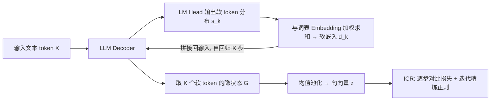

# Let LLMs Speak Embedding Languages: Generative Text Embeddings via Iterative Contrastive Refinement

**会议**: ICLR 2026  
**OpenReview**: [https://openreview.net/forum?id=okjogxO1Fu](https://openreview.net/forum?id=okjogxO1Fu)  
**代码**: [https://github.com/Roytsai27/GIRCSE](https://github.com/Roytsai27/GIRCSE)  
**领域**: 信息检索 / 文本表示学习  
**关键词**: 文本嵌入, 生成式嵌入, 对比学习, 软 token, 测试时扩展, MTEB  

## 一句话总结
GIRCSE 让 LLM 在推理时自回归地生成一串"软 token"来逐步精炼句向量，并用逐步对比损失监督每一步，从而把 LLM 的生成能力首次真正用进 embedding 里，还意外解锁了"生成越多 token、向量质量越高"的测试时扩展特性。

## 研究背景与动机
**领域现状**：用 LLM 做文本嵌入已经是 MTEB 榜单上的主流——从 E5-Mistral、LLM2Vec 到 NV-Embed，套路都是把 LLM 当成一个静态特征抽取器，单次前向后用 EOS token 或平均池化拿一个向量，再用对比学习微调。

**现有痛点**：这种 encoder-only 范式完全浪费了 LLM 最核心的本事——自回归生成与多步推理。LLM 本可以像做 CoT 一样"想一想再回答"，但在嵌入任务里它只被允许"看一眼就交卷"。各家方法的差异其实只停留在池化策略和辅助训练技巧上，生成式嵌入几乎无人深耕。

**核心矛盾**：直接让 LLM 生成文本再编码会出三个问题——(1) 预训练 LLM 生成的是流畅可读的文字，而非对语义相似度友好的 token，朴素生成反而拉低嵌入质量；(2) 嵌入任务没有明确的生成目标，不知道该让模型生成什么内容才对所有任务都有用；(3) 离散 token 采样会切断梯度，无法端到端训练。

**本文目标**：设计一个端到端框架，让 LLM 通过迭代生成逐步把语义"蒸馏"进高质量向量，同时兼顾通用检索任务与指令跟随任务，避免现有方法"通用强则指令弱、指令强则通用弱"的此消彼长。

**核心 idea**：**让 LLM 说"嵌入语言"** —— 不约束生成的 token 必须人类可读，而是通过与对比目标联合的端到端训练，让模型自己发现一串专为语义表示优化的软 token，每生成一步就把表示精炼一次。

## 方法详解

### 整体框架
GIRCSE（Generative Iterative Refinement for Contrastive Sentence Embeddings）在共享的 LLM 上做两件事：先自回归地生成 $K$ 个**软 token**（保留全词表概率分布、可微分），把这些软 token 对应的最后层隐状态池化成句向量；再用**迭代对比精炼（ICR）目标**对每一步生成都施加对比监督，强迫早期 token 就抓住有用语义、后期 token 持续改进。整个流程端到端训练，推理时生成的 token 越多向量越好。

### 关键设计

**1. 软 token 生成：用全分布的加权嵌入替代离散采样，保住梯度也保住语义。** 自回归生成的天敌是离散采样会切断梯度，让端到端对比训练无从谈起。GIRCSE 在每一步 $k$ 不取 argmax，而是让 LM head 输出一个完整的词表概率分布 $s_k=\mathrm{softmax}(W_\phi h'_{k-1}+b_\phi)\in\mathbb{R}^{|V|}$，再把它当权重对整张词表嵌入矩阵做凸组合，得到这一步的软嵌入 $d_k=\sum_{i=1}^{|V|}s_{k,i}e_i$，然后把 $d_k$ 拼回输入序列喂给 decoder 继续生成下一个。这样做有两重好处：加权求和让梯度顺畅回流，支持端到端优化；不把分布坍缩成单个 token 也保留了语义多样性——一个"困惑/挫败/纠结"的混合分布比硬选一个词携带的语义更丰富。最终把这 $K$ 个软 token 位置的最后层隐状态 $G=(h^{(L)}_{N+1},\dots,h^{(L)}_{N+K})$ 做均值池化得到句向量 $z=\frac{1}{K}\sum_i g_i$。

**2. 逐步对比损失：监督每一步而非只监督终点，防止中间步退化成噪声。** 如果只对第 $K$ 步的最终向量算对比损失，中间那些步很容易被训成无意义的过渡表示。GIRCSE 改成在每一步都施加对比监督：对第 $k$ 步，把前 $k$ 个生成 token 池化成中间向量 $z_k=P(G_{1:k})$，然后对所有步累加 InfoNCE 损失 $L_{\text{contrast}}=\sum_{k=1}^{K}L_k$，其中 $L_k=-\log\frac{\exp(\sigma(z^q_k,z^{d^+}_k)/\tau)}{\sum_{d\in B}\exp(\sigma(z^q_k,z^d_k)/\tau)}$，$\sigma$ 是余弦相似度、$B$ 是正负文档集合。这等于要求"哪怕只生成一两个 token，向量也得在对比意义上对齐"，从而让早期 token 不偏航、每一步都提供有效监督信号。

**3. 迭代精炼正则：用单调性约束逼模型每生成一步都真的变好。** 作者发现单纯多生成 token 并不保证质量上升——LLM 经常吐出高度相似的冗余 token，多步等于原地踏步。为此加一个正则项 $L_{\text{reg}}=\frac{1}{K-1}\sum_{k=1}^{K-1}\max(\log L_{k+1}-\log L_k,0)$，只惩罚"后一步损失反而比前一步大"的情况，相当于软性强制对比损失沿生成步单调下降。总目标为 $L_{\text{total}}=L_{\text{contrast}}+\lambda L_{\text{reg}}$。正是这个单调性约束让 GIRCSE 解锁了**测试时扩展**：推理时多生成 token 能稳定提升向量质量，类似推理 LLM 的 test-time compute scaling。

## 实验关键数据

### 主实验表格
在 MTEB(English, v2, 41 数据集 7 类任务)与指令跟随基准(IntentEmotion / NYTClustering)上，对比 18 个 SOTA 嵌入模型，Mistral-7B 骨干、仅用 0.2M 训练数据：

| 方法 | 骨干 | 训练量 | MTEB Avg.(Rank) | Instruct Avg.(Rank) | Overall Rank |
|---|---|---|---|---|---|
| gte-Qwen2 | QWEN2 | 800M | 70.72 (1) | 35.07 (18) | 9.5 |
| NV-Embed-v1 | Mistral | 1.1M | 68.32 (3) | 56.62 (7) | 5.0 |
| E5-Mistral | Mistral | 1.8M | 67.97 (4) | 56.95 (10) | 7.0 |
| GritLM (w/ gen.) | Mistral | 2M | 65.90 (11) | 60.83 (4) | 7.5 |
| Inbedder(端到端生成) | LLaMA2 | 0.2M | 50.32 (20) | 77.17 (1) | 10.5 |
| **GIRCSE** | Mistral | 0.2M | 67.83* (5) | 62.97 (2) | **3.5** |
| **GIRCSE** | QWEN2 | 0.2M | 67.67* (6) | 62.48 (3) | **4.5** |

GIRCSE 拿到全场最佳综合排名(3.5/4.5)：MTEB 进前 5–6、指令跟随进前 2–3，且训练数据只有 SOTA 的零头(0.2M vs 百万级)。

### 消融实验表格
Mistral-7B、50K 样本，逐步加入生成嵌入(Gen.)、逐步损失(SL)、迭代精炼(IR)：

| Gen. | SL | IR | MTEB Avg. | Instruct Avg. |
|---|---|---|---|---|
| ✗ | ✗ | ✗ | 63.84 | 47.05 |
| ✓ | ✗ | ✗ | 65.21 | 56.47 |
| ✓ | ✓ | ✗ | 65.69 | 60.13 |
| ✓ | ✓ | ✓ | **66.27** | **62.97** |

从 Causal-EOS 基线起步，光是引入生成嵌入就让指令跟随飙升 9 分(47→56)；逐步损失再补、迭代精炼收口，三者叠满拿到最强综合表现。

### 关键发现
- **打破 trade-off**：非生成式模型(如 gte-Qwen2)通用强但指令弱(rank 1→18)，纯生成式 Inbedder 反之(rank 20→1)；GIRCSE 是唯一两头都强的，且两骨干上对公平基线均显著提升(p<0.05)。
- **测试时扩展**：STS 等任务上相对提升随生成 token 数(1→20)单调上升，证明"生成更多 token=更好向量"，这是嵌入模型此前没有的扩展维度。
- **效率可控**：只需生成 5–10 个 token 就有强表现，配合 KV cache 后 FLOPs 仅约为标准嵌入模型的 1.0–1.1×。
- **可解释性**：生成的软 token 会随指令变化产生"frustrated""struggle"这类捕捉隐含情绪的语义信号，超出表层判别式嵌入的范围。

## 亮点与洞察
- **范式转变**：第一次把"嵌入"从单次前向特征抽取，重构为多步自回归精炼，给表示学习引入了和推理 LLM 同源的 test-time scaling 维度，概念上很有冲击力。
- **软 token 是点睛之笔**：用全词表概率分布的加权嵌入同时解决了"可微分"和"语义丰富"两个矛盾需求，比离散生成或硬 token(Inbedder)都更优雅。
- **逐步监督+单调正则**配合得当，把"多生成几步"从"可能没用甚至变差"变成"稳定有收益"，这是测试时扩展能成立的关键工程保障。

## 局限与展望
- 迭代生成天然比单步基线贵，虽然 KV cache 把 FLOPs 压到约 1.1×，但延迟仍随生成步数上升，超大规模检索场景需权衡。
- 因算力限制只用了 20%(0.2M)数据，未在全量数据上验证上限；MTEB 上仍略逊于用百万级数据训练的 gte-Qwen2(67.8 vs 70.7)。
- 软 token 的"嵌入语言"虽有定性可解释样例，但缺乏系统性的可解释分析与理论刻画，离散与连续语义空间的关系尚待深挖。
- 测试时扩展的收益最终会饱和，何时停、如何自适应决定生成步数是开放问题。

## 相关工作与启发
- **LLM 嵌入主流**：E5-Mistral、LLM2Vec(双向注意力+平均池化)、NV-Embed(Latent Attention 层+两阶段训练)、BGE-en-icl(保留 LLM 框架+ICL)，差异都停留在池化与训练技巧——GIRCSE 指出大家都忽略了生成本身。
- **生成式嵌入**：Inbedder 用指令微调+硬 token 生成，指令跟随强但泛化差；GIRCSE 用软 token+对比目标端到端训练补上了泛化短板。
- **测试时扩展启发**：把推理 LLM 的 test-time compute scaling 思想迁移到嵌入，提示其他"单次前向"任务(如分类头、检索重排)或许也能靠迭代生成换质量。

## 评分
- **新颖性**: ⭐⭐⭐⭐⭐ 把生成式自回归+测试时扩展真正引入文本嵌入，是范式级别的新角度，"软 token + 逐步对比 + 单调正则"组合也很巧。
- **实验充分度**: ⭐⭐⭐⭐ 对比 18 个 SOTA、覆盖 MTEB 与指令跟随、消融与测试时扩展曲线齐全；但受算力限制只用 20% 数据，未触全量上限。
- **写作质量**: ⭐⭐⭐⭐ 动机—挑战—方法链条清晰，图1把"静态 vs 迭代精炼"讲得直观，公式与算法完整。
- **价值**: ⭐⭐⭐⭐⭐ 给嵌入模型开了"测试时扩展"这条全新坐标轴，且小数据就能打平大数据 SOTA，对检索/语义搜索社区有实际推动力。

<!-- RELATED:START -->

## 相关论文

- [\[ICLR 2026\] Think Then Embed: Generative Context Improves Multimodal Embedding](think_then_embed_generative_context_improves_multimodal_embedding.md)
- [\[ICLR 2026\] HUME: Measuring the Human-Model Performance Gap in Text Embedding Tasks](hume_measuring_the_human-model_performance_gap_in_text_embedding_tasks.md)
- [\[ICLR 2026\] BTZSC: A Benchmark for Zero-Shot Text Classification Across Cross-Encoders, Embedding Models, Rerankers and LLMs](btzsc_a_benchmark_for_zero-shot_text_classification_across_cross-encoders_embedd.md)
- [\[ACL 2026\] Why Mean Pooling Works: Quantifying Second-Order Collapse in Text Embeddings](../../ACL2026/information_retrieval/why_mean_pooling_works_quantifying_second-order_collapse_in_text_embeddings.md)
- [\[ACL 2026\] SkMTEB: Slovak Massive Text Embedding Benchmark and Model Adaptation](../../ACL2026/information_retrieval/skmteb_slovak_massive_text_embedding_benchmark_and_model_adaptation.md)

<!-- RELATED:END -->
