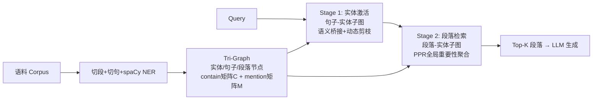

# LinearRAG: Linear Graph Retrieval Augmented Generation on Large-scale Corpora

**会议**: ICLR 2026  
**OpenReview**: [https://openreview.net/forum?id=mCtfkypdm6](https://openreview.net/forum?id=mCtfkypdm6)  
**代码**: [https://github.com/DEEP-PolyU/LinearRAG](https://github.com/DEEP-PolyU/LinearRAG)  
**领域**: Information Retrieval / Graph-based RAG  
**关键词**: GraphRAG, 关系无关图构建, 多跳检索, Personalized PageRank, 线性可扩展  

## 一句话总结
LinearRAG 指出现有 GraphRAG 的性能瓶颈来自不稳定、昂贵的关系抽取，提出"只抽实体、不抽关系"的三层图（Tri-Graph）加两阶段检索（语义桥接激活实体 + 全局重要性聚合检索段落），在零 LLM token 消耗下把索引时间砍掉 77%，并在四个基准上超过所有 SOTA。

## 研究背景与动机
**领域现状**：传统 RAG 把语料切块编码后做向量召回，简单问题够用，但面对大规模非结构化语料时，相关信息散落在异构文档中、切块又丢上下文，多跳推理力不从心。于是 GraphRAG 兴起——用知识图谱建模实体间关系，RAPTOR 做递归摘要、微软 GraphRAG 做社区检测、HippoRAG 用 Personalized PageRank 模拟海马体多跳检索，理论上能提供更完整的推理链。

**现有痛点**：作者的预研给 GraphRAG 泼了一盆冷水——在 GraphRAG-Bench 上，LightRAG、HippoRAG 这些方法虽然把证据召回率拉高了，但上下文相关性只有 36.86%~54.61%，反而**低于** Vanilla RAG 的 62.87%。根因是自动构建的知识图谱质量太差，问题出在关系抽取上：(i) **局部不准确**——"爱因斯坦没有因相对论获诺奖"会被错抽成 (Einstein, won Nobel Prize for, relativity)，事实彻底反转；(ii) **全局不一致**——逐段落抽取没有跨语料的校验机制，把"AI→无监督学习""AI→NLP""AI→CV"并列成同层子类，破坏了层级结构。这些噪声直接污染检索与生成。

**核心矛盾**：图结构能扩大召回，却同时引入了语义噪声；而所有想靠"自底向上聚类摘要""主题建模"修图的方法，都建立在错误的三元组之上，只会让误差在更高抽象层被放大。问题的源头是**关系抽取本身**——既贵又难（自然语言关系往往复合、依赖上下文，"Rachel 勉强答应和 Phoebe 去跑步"无法干净地压成一个原子三元组），而且其实**没必要**：连接跨段落信息的主锚点是对齐的实体而非关系，原文已经完整保存了关系语义，可以交给 LLM 在推理时动态解读。

**本文目标**：构建一个可靠、线性可扩展、零额外 token 的 GraphRAG，既保住图带来的多跳召回，又不被关系抽取的噪声拖累。

**核心 idea**：**[关系无关 + 实体锚定]** 把复杂关系图简化成"实体—句子—段落"的线性可索引视图，只用轻量 NER 和语义链接建图；检索时先在句子—实体子图上做语义桥接激活中间实体，再在段落—实体子图上用 PPR 做全局重要性聚合，单次前向就完成多跳检索。

## 方法详解

### 整体框架
LinearRAG 分离线、在线两段。离线端把语料切成段落、再切句子、用 spaCy 抽实体，构成"段落 / 句子 / 实体"三类节点的 **Tri-Graph**，节点间只用"包含""提及"两个二值关系连边（无任何关系三元组）；在线端两阶段检索——**Stage 1** 固定段落节点，在句子—实体子图上做语义桥接，把查询实体逐跳激活到相关中间实体；**Stage 2** 固定句子节点，把激活实体当种子，在段落—实体子图上跑 Personalized PageRank 聚合全局重要性，取 Top-k 段落喂给 LLM 生成。整条管线索引和检索都不调用 LLM，复杂度随语料线性增长。

### 关键设计

**1. 零 Token 的 Tri-Graph 构建：用"包含/提及"两个稀疏矩阵替掉关系三元组。** 给定段落集 $P$，先按标点切成句子集 $S$，再用 spaCy 这类轻量模型做 NER 得到实体集 $E$，三者分别对应段落节点 $V_p$、句子节点 $V_s$、实体节点 $V_e$。边只有两种：段落含实体连一条、句子提及实体连一条，分别记成 contain 矩阵 $C_{ij}=\mathbb{1}\{p_i \text{ contains } e_j\}$ 和 mention 矩阵 $M_{ij}=\mathbb{1}\{s_i \text{ mentions } e_j\}$。这个设计的妙处在于：新段落到来时只需对增量段落做切句、NER、连边，整体线性复杂度；NER 比 OpenIE 又准又快还不烧 LLM token；两个邻接矩阵天然稀疏，存成 sparse 格式把内存也压到线性；原文段落被完整保留为知识载体，做到信息无损。论文实测索引时间相比传统方案降低超过 77%。

**2. 语义桥接的实体激活：把"句子—查询相似度"沿二部图传播，挖出多跳中间实体。** 直接匹配查询里出现的实体会漏掉那些"桥接两跳关系"的隐藏中间实体，而它们恰恰是多跳问答的关键。LinearRAG 的做法是：先用 spaCy 从查询 $q$ 抽实体 $E_q$，给每个查询实体在图里找最相似实体并以相似度作为初始激活分 $a_q$；再算查询与每个句子的相似度分布 $\sigma_{q,i}=\text{sim}(q, s_i)$；然后迭代传播激活向量
$$a_q^t = \text{MAX}\big(M^T(\sigma_q \odot (M a_q^{t-1})),\ a_q^{t-1}\big)$$
其中 $\odot$ 是逐元素乘。直觉是：当前激活的实体先经 $M$ 映射回它所在的句子，乘上句子—查询相关度 $\sigma_q$ 做加权，再经 $M^T$ 传回邻居实体，从而沿着"与查询语义相关的句子"这条路径把激活一跳跳扩散出去——这本质上在做**隐式关系匹配**，不需要任何显式关系图。向量化形式让 $n$ 跳激活只需 $n$ 次迭代（通常 $n\le 4$），每次两个 MatMul 加一个 MAX，可用稀疏矩阵乘 SpMM 并行加速。

**3. 动态剪枝：用固定阈值 $\delta$ 把传播限制在高质量语义路径上。** 语义桥接虽然建立了初始关联，却会让搜索空间随传播深度指数膨胀——无关实体反复当新种子，会把检索拖向跑题的语义区域。LinearRAG 在每步传播后引入阈值 $\delta$：新激活实体的相关度超过 $\delta$ 才保留进入下一轮，否则剪掉；当没有新实体能过线时自动终止。这样既把扩散约束在最相关的路径上，又让迭代轮数自适应于每个查询的复杂度。消融显示固定阈值优于"不剪枝"和"随迭代衰减的动态阈值"，且把平均检索时间从 0.186s 压到 0.093s。

**4. 全局重要性聚合：在段落—实体子图上跑 PPR，并用混合初始化偏置段落节点。** 第一阶段拿到的相关实体被用来在段落—实体二部图上初始化 Personalized PageRank：
$$I(v_i) = (1-d) + d \cdot \sum_{v_j \in B(v_i)} \frac{I(v_j)}{\deg(v_j)}$$
阻尼因子 $d$ 取 0.85。实体节点的初始分直接用第一阶段的激活分 $a_q^{(i)}$；段落节点则用混合初始化
$$I(v|v\in V_p) = \Big(\lambda \cdot \text{sim}(q,v) + \ln\big(1 + \sum_{e_i \in E_a} a_q^{(i)} \cdot \ln(1+N_{e_i})/L_{e_i}\big)\Big)\cdot W_p$$
即把"段落与查询的直接相似度"和"段落内激活实体的加权重要性"（含实体出现次数 $N_{e_i}$ 与层级 $L_{e_i}$）融合。这一步让最终排序兼顾局部语义对齐和全局结构重要性，跑完 PPR 取 Top-k 段落即可，整段无任何 LLM 调用。

## 实验关键数据

### 主实验表格（四基准 Contain-Acc / GPT-Acc，%）

| 方法 | HotpotQA C/G | 2Wiki C/G | MuSiQue C/G | Medical GPT |
|---|---|---|---|---|
| Vanilla RAG (Top-5) | 55.70 / 58.60 | 48.60 / 43.00 | 26.10 / 29.60 | 61.68 |
| LightRAG | 60.30 / 59.50 | 55.20 / 39.00 | 27.40 / 28.60 | 54.36 |
| HippoRAG | 57.00 / 59.30 | 66.10 / 59.90 | 29.30 / 24.10 | 55.04 |
| GFM-RAG | 62.70 / 65.60 | 66.80 / 59.50 | 29.90 / 34.60 | 56.07 |
| HippoRAG2 | 62.90 / 64.30 | 62.70 / 55.00 | 31.00 / 35.00 | 60.77 |
| **LinearRAG (Ours)** | **64.30 / 66.50** | **70.20 / 63.70** | **33.90 / 37.00** | **63.72** |

LinearRAG 在所有数据集的两项准确率上全部第一，2Wiki 的 GPT-Acc 比次优高约 3.8 个百分点。

### 效率对比（2Wiki，时间 + token + 平均准确率）

| 方法 | 索引(s) | 检索(s) | Prompt token | Completion | Acc. |
|---|---|---|---|---|---|
| LightRAG | 4933.22 | 10.963 | 35.52M | 51.16M | 47.10 |
| G-retriever | 2745.94 | 11.487 | 6.05M | 2.26M | 36.85 |
| HippoRAG | 936.00 | 1.461 | 3.05M | 0.98M | 63.00 |
| HippoRAG2 | 1147.01 | 1.694 | 4.98M | 1.22M | 58.85 |
| **LinearRAG** | **249.78** | 0.093 | **0** | **0** | **66.95** |

索引时间最短、token 消耗为零、准确率反而最高。

### 消融实验表格

| 配置 | HotpotQA | 2Wiki | MuSiQue | Medical |
|---|---|---|---|---|
| LinearRAG (full) | 65.40 | 66.95 | 35.45 | 63.72 |
| w/o 实体激活 | 63.15 | 64.40 | 31.65 | 61.69 |
| w/o 全局重要性聚合 | 63.35 | 64.20 | 32.05 | 61.73 |

剪枝策略（2Wiki）：完整版 Acc 66.95 / 0.093s；w/o 剪枝 64.50 / 0.186s；几何衰减(×0.5) 65.15；线性衰减(−0.1) 65.35——固定阈值在准确率和速度上都最优。

### 关键发现
- **图结构有用但被噪声抵消**：GraphRAG 提升召回却拉低上下文相关性，关系抽取是元凶。
- **省 token 不等于掉性能**：HippoRAG 系列 token 远少于 LightRAG/G-Retriever 却更准，说明"复杂 prompt"是负担而非收益。
- **两阶段缺一不可**：去掉任一阶段，四个数据集平均准确率全线下滑 2~4 个百分点。

## 亮点与洞察
- **逆向工程式的问题定位**：先用预研证明"GraphRAG 不如 Vanilla RAG"这一反直觉现象，再把锅精准甩给关系抽取，论证链条干净有力，比直接堆方法更有说服力。
- **"关系不必显式抽取"的视角很值钱**：把关系语义留在原文、让 LLM 推理时动态解读，绕开了 GraphRAG 最脆弱的一环，这是范式级简化而非缝补。
- **零 LLM 调用的工程价值**：索引和检索全程不烧 token，对大规模、成本敏感的真实部署极具吸引力，是少见的"又快又省又准"。
- **向量化的语义传播 + 稀疏实现**：把多跳检索写成几次稀疏矩阵乘 + MAX，天然适配 GPU 并行，可扩展性有理论与实测双重支撑。

## 局限与展望
- **强依赖 NER 与嵌入质量**：实体抽取若漏掉关键实体或嵌入模型对齐不佳，语义桥接的起点就会偏，论文未深入讨论 NER 失败时的鲁棒性。
- **"实体即锚点"的假设有边界**：对那些关系本身才是答案、实体共现稀疏的查询（如纯因果/时序推理），无关系图可能损失信息。
- **固定阈值 $\delta$ 需调参**：剪枝阈值对不同语料/查询复杂度敏感，论文用固定值但缺少跨域自适应方案。
- **评测仍偏多跳 QA**：四个基准以多跳问答为主，面向开放域长文生成、表格/多模态语料的泛化性有待验证。

## 相关工作与启发
- **GraphRAG 谱系**：RAPTOR（递归摘要树）、微软 GraphRAG（社区检测）、LightRAG（双层索引）、HippoRAG/HippoRAG2（海马体启发的 PPR 多跳）、GFM-RAG（查询相关 GNN）、G-Retriever（Prize-Collecting Steiner Tree）。LinearRAG 与它们共享 PPR 检索思路，但彻底抛弃关系抽取这一步。
- **启发**：这篇工作提示我们，"加结构"不等于"加价值"——当结构的构建过程本身充满噪声时，更简单、更可靠的中间表示反而更强。把"难抽取的显式知识"留给推理时的 LLM 动态解读，是一种值得迁移到其他知识密集任务（工具检索、代码检索、科学问答）的设计哲学。

## 评分
- **新颖性**: ⭐⭐⭐⭐ — "关系无关 Tri-Graph + 两阶段语义桥接/PPR"是对 GraphRAG 范式的实质性简化，预研对问题根因的定位尤其漂亮，虽然 PPR 检索沿用 HippoRAG 思路。
- **实验充分度**: ⭐⭐⭐⭐ — 四基准 + 三类共十余个 baseline，效率/消融/剪枝策略都覆盖，唯多模态与超大规模泛化留待附录与未来工作。
- **写作质量**: ⭐⭐⭐⭐ — 动机—诊断—方法—验证逻辑闭环，图表清晰，公式与直觉解释到位。
- **价值**: ⭐⭐⭐⭐⭐ — 零 token、索引提速 77%、准确率全面 SOTA，对真实大规模 RAG 部署有直接落地价值。

<!-- RELATED:START -->

## 相关论文

- [\[ICLR 2026\] Youtu-GraphRAG: Vertically Unified Agents for Graph Retrieval-Augmented Complex Reasoning](youtu-graphrag_vertically_unified_agents_for_graph_retrieval-augmented_complex_r.md)
- [\[ACL 2026\] Navigating Large-Scale Document Collections: MuDABench for Multi-Document Analytical QA](../../ACL2026/information_retrieval/navigating_large-scale_document_collections_mudabench_for_multi-document_analyti.md)
- [\[ICLR 2026\] Query-Aware Flow Diffusion for Graph-Based RAG with Retrieval Guarantees](query-aware_flow_diffusion_for_graph-based_rag_with_retrieval_guarantees.md)
- [\[ACL 2025\] Graph of Records: Boosting Retrieval Augmented Generation for Long-context Summarization with Graphs](../../ACL2025/information_retrieval/gor_rag_long_context_summary.md)
- [\[ICLR 2026\] HiPRAG: Hierarchical Process Rewards for Efficient Agentic Retrieval Augmented Generation](hiprag_hierarchical_process_rewards_for_efficient_agentic_retrieval_augmented_ge.md)

<!-- RELATED:END -->
