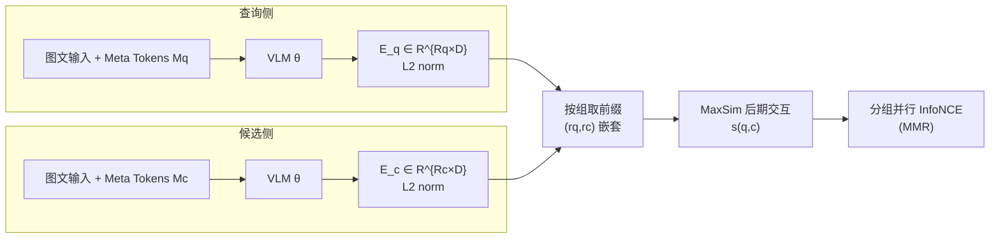

# MetaEmbed: Scaling Multimodal Retrieval at Test-Time with Flexible Late Interaction

**会议**: ICLR 2026  
**OpenReview**: [https://openreview.net/forum?id=yKDqg9HwZX](https://openreview.net/forum?id=yKDqg9HwZX)  
**代码**: [https://github.com/facebookresearch/MetaEmbed](https://github.com/facebookresearch/MetaEmbed)  
**领域**: 多模态检索 / 多向量后期交互 / 表示学习  
**关键词**: Multimodal Retrieval, Late Interaction, Multi-Vector, Matryoshka Representation, Test-Time Scaling, VLM Embedding  

## 一句话总结
通过给 VLM 输入序列追加少量可学习的 Meta Token，并用 Matryoshka 嵌套式多向量对比训练把信息按粒度组织进这些 token，MetaEmbed 让用户在测试时自由选用 1~64 个向量来权衡检索精度与索引/延迟开销，从而在 MMEB、ViDoRe 上以紧凑的多向量表示取得 SOTA，并稳定扩展到 32B 规模。

## 研究背景与动机
**领域现状**：基于 VLM 的通用多模态嵌入模型（VLM2Vec、GME、mmE5、MoCa 等）通过对最后一层隐状态做对比学习，已经能很好地捕捉查询与候选间的语义相关性。主流做法是把整个查询/候选压成**单一向量**，索引和打分都很轻量。

**现有痛点**：单向量在跨模态场景下会丢失细粒度信息，且存在理论表达上限。文本检索里 ColBERT 提出的**多向量后期交互（late interaction）**保留 token 级嵌入、用 MaxSim 做轻量打分，信息保留远多于单向量，催生了 ColPali、ColQwen 等多模态变体。但这类方法把每张图编码成几百个 patch 向量，索引体积、检索延迟都急剧膨胀。

**核心矛盾**：单向量太"瘦"、表达力不足；ColBERT 式多向量太"胖"、存不下也算不动——尤其当查询和候选**两侧都含图像**时，几千 token × 几千 token 的交互让训练和推理直接不可行。检索系统缺一个能**在精度与成本之间自由滑动**的旋钮。

**本文目标**：设计一个既保留多向量表达力、又能把向量数压到个位数～几十量级，且支持测试时按预算灵活伸缩的多模态检索框架。

**核心 idea**：**用少量可学习 Meta Token 充当"信息压缩器"**——它们的最后一层上下文表示就是紧凑而富表达的多向量嵌入；再用 **Matryoshka 式嵌套训练**让这些向量按粒度从粗到细排序，于是测试时只取前 $r$ 个向量就能在不重训的情况下换取不同的精度-效率折中。

## 方法详解

### 整体框架
MetaEmbed 在查询和候选的输入序列末尾各追加一组可学习的 Meta Token，与原始图文 token 一起过同一个 VLM，取 Meta Token 位置的末层隐状态（经 L2 归一化）作为 **Meta Embeddings**——一组数量固定的多向量表示。训练时用 **Matryoshka Multi-Vector Retrieval (MMR)** 把多个嵌套前缀分组并行做对比学习，使前几个向量构成"粗摘要"、后续向量逐步"精修"；测试时只需选不同的前缀长度 $(r_q, r_c)$ 即可调节检索粒度与预算。

### 关键设计

**1. Meta Token 作为压缩的上下文多向量：把"几百 patch"换成"几个 token"。** 与直接保留 patch/token 级嵌入不同，MetaEmbed 给输入拼上可学习的查询 Meta Token $M_q\in\mathbb{R}^{R_q\times D}$ 和候选 Meta Token $M_c\in\mathbb{R}^{R_c\times D}$，让 transformer 把 $z^{(0)}=[v;t;M_q;M_c]$（$v$ 为视觉 patch、$t$ 为文本）整体过一遍，再从末层隐状态 $H=F_\theta(z^{(0)})$ 中**只抽 Meta Token 位置**得到 $E^{(q)}_{\text{meta}}$、$E^{(c)}_{\text{meta}}$。这些向量是经过全序列上下文化的"信息汇聚点"，因此向量数极少（个位数～几十）却仍保留细粒度语义。查询与候选各自独立前向编码，可像 ColBERT 一样离线建索引，打分仍用 MaxSim 后期交互 $s(q,c)=\sum_{i}\max_{j}\langle E^{(i)}_q, E^{(j)}_c\rangle$。这一步把多向量检索从"几千向量交互"压到可负担的规模，关键解决了多模态↔多模态检索此前不可行的瓶颈。

**2. Matryoshka 多向量检索（MMR）：让向量按重要性嵌套排序，前缀即可独立检索。** 单纯用全部向量并不"灵活"——索引随 $O(N\cdot R_c\cdot D)$、打分随 $O(R_q\cdot R_c\cdot D)$ 增长。受 Matryoshka 表示学习启发，作者对 Meta Embeddings 施加**前缀嵌套结构**：固定 $G$ 组递增的组大小 $1\le r^{(1)}_q<\dots<r^{(G)}_q=R_q$（候选侧同理），第 $g$ 组只取前缀 $E^{(q,g)}=E^{(q)}_{\text{meta}}[1{:}r^{(g)}_q]$，并计算组内后期交互分 $s^{(g)}(q,c)=\sum_{i=1}^{r^{(g)}_q}\max_{j\le r^{(g)}_c}\langle E^{(g,i)}_q,E^{(g,j)}_c\rangle$。这样前几个向量必须自己就有判别力（充当粗摘要），后续向量负责精修，天然形成由粗到细的层级。论文实测 $G=5$、组大小取 $\{(1,1),(2,4),(4,8),(8,16),(16,64)\}$。

**3. 分组并行对比目标：所有粒度同时优化，一次训练支持任意预算。** 训练时对**每一组 $g$ 并行**做对比学习，使每个前缀既独立可判别又与更大前缀保持一致。对一个含正样本 $c^{(b)}$ 与一个显式难负样本 $c^{(b,-)}$ 的 minibatch，定义相似度 $S^{(g)}_{u,v}=\frac{1}{\tau}s^{(g)}(q^{(u)},c^{(v)})$，组 $g$ 的 InfoNCE 为

$$\mathcal{L}^{(g)}_{\text{NCE}}=-\frac{1}{B}\sum_{u=1}^{B}\log\frac{\exp(S^{(g)}_{u,u})}{\exp(S^{(g)}_{u,u})+\sum_{v\ne u}\exp(S^{(g)}_{u,v})+\exp(\tfrac{1}{\tau}s^{(g)}(q^{(u)},c^{(u,-)}))}$$

总损失按组加权求和 $\mathcal{L}_{\text{final}}=\sum_{g=1}^{G}w_g\,\mathcal{L}^{(g)}_{\text{NCE}}$（实验中 $w_g=1$，$\tau=0.03$）。因为各粒度被并行优化，**测试时无需重训**即可切换组大小。

**4. 测试时缩放旋钮：精度-索引-延迟三者一键平衡。** 嵌套设计给出一个简单的精度-效率旋钮：建索引时每个候选只存前 $r^{(g)}_c$ 个向量，查询时按延迟约束选 $(r^{(g)}_q,r^{(g)}_c)$ 计算 $s^{(g)}(q,c)$。粗前缀（$g$ 小）适合快速召回，大前缀（$g$ 大）换更高精度。用更多 Meta Embeddings 做索引就提升质量、代价是更大索引与更高延迟——这正是多模态检索中此前缺失的"test-time scaling"能力。

## 实验关键数据

### 主实验表格
MMEB（36 任务，Precision@1，%）与 ViDoRe v2（7 任务，NDCG@5，%），均以 $(r_q,r_c)=(16,64)$ 报告：

| 模型 | 规模 | MMEB Overall | ViDoRe v2 Avg |
|------|------|--------------|---------------|
| mmE5 | 11B | 69.8 | 50.5 |
| MoCa-7B | 7B | 71.5 | 58.8 |
| B3-7B | 7B | 72.0 | — |
| ColPali（多向量） | 3B | — | 54.5 |
| **MetaEmbed-3B** | 3B | **69.1** | **60.3** |
| **MetaEmbed-7B** | 7B | **76.6** | **61.3** |
| **MetaEmbed-32B** | 32B | **78.7** | — |

7B 比 MoCa-7B 高 5.1 分、比 mmE5 高 6.8 分；32B 进一步推到 78.7。ViDoRe v2 上即便 3B 也超过更大的单/多向量基线，且**未用多语数据训练**却在多语、生物医学子集增益最大，说明继承了 backbone 的跨语言能力。

### 消融实验表格
**测试时缩放（MMEB Precision@1，随预算变化）**：增大预算从 (1,1) 到 (16,64) 对所有规模都单调提升，且模型越大增益越大：

| 模型 | (1,1) | (16,64) | 相对单向量增益 |
|------|-------|---------|----------------|
| MetaEmbed-3B | 65.4 | 69.1 | +3.3 |
| MetaEmbed-7B | 71.3 | 76.6 | +5.0 |
| MetaEmbed-32B | 72.4 | 78.7 | +6.6 |

**MMR 有效性（ViDoRe v1，MetaEmbed-3B）**：关闭 MMR 后低预算严重退化——单向量 (1,1) 设置下掉 9.0 分；即便满预算 (16,64)，带 MMR 仍略优，说明嵌套训练没牺牲全尺度的多向量能力。

**效率（MetaEmbed-7B，A100，10万候选/查询）**：

| 预算 | Scoring FLOPs (G) | 延迟 (ms) | 索引 (GiB) | MMEB Acc |
|------|-------------------|-----------|------------|----------|
| (1,1) | 0.71 | 1.67 | 0.68 | 71.3 |
| (8,16) | 91.75 | 1.92 | 10.68 | 74.3 |
| (16,64) | 733.89 | 6.25 | 42.72 | 76.6 |

### 关键发现
- **打分阶段在中等预算下几乎不增延迟**：FLOPs 涨百倍，延迟在 (1,1)→(8,16) 间几乎持平，GPU 吞吐能吃下额外计算。
- **瓶颈在查询编码而非打分**：编码一张 1024-token 图像查询需 42.72 TFLOPs、788ms，比打分成本高几个数量级——效率优化应聚焦编码。
- **backbone 选择决定上限**：Llama-3.2-Vision 的 MetaEmbed-11B 因底座 VQA 弱（42.1，比 Qwen2.5-VL-7B 低 32 分）拖累整体到 65.1；底座生成能力的短板会直接传导到嵌入模型。
- **缩放更优**：单向量基线从 7B 到 32B 的提升已不显著，而 MetaEmbed 仍有明显增益。

## 亮点与洞察
- **把"test-time scaling"思想首次带进多模态多向量检索**：训练一次、推理时按预算自由滑动精度-延迟-索引，无需为不同部署场景分别训模型。
- **Meta Token 是一个优雅的"可学习信息瓶颈"**：用注意力让模型自己学会把全序列信息汇聚到固定几个 token，避免了 patch 级多向量的存储爆炸，也比单向量保留更多细粒度。
- **MMR = Matryoshka 思想从"维度嵌套"到"向量嵌套"的迁移**：MRL 在单向量里嵌套维度，MetaEmbed 在多向量里嵌套向量数，迁移自然且首次在多向量检索上验证成功。
- **打通多模态↔多模态检索**：把两侧图文压成少量向量，使此前因 token 爆炸而不可行的"图查图"检索变得可训练、可推理。

## 局限与展望
- **索引内存随预算线性增长**：满预算 (16,64) 下 10 万候选需 42.72 GiB，大规模部署仍有压力，作者只能靠"选平衡预算"或"CPU offload"缓解，缺乏算法级压缩。
- **强依赖 backbone 质量**：底座在某域（如 VQA）弱，嵌入模型直接继承该短板，方法本身不能弥补生成能力缺陷。
- **Meta Token 数量与组大小靠经验设定**：$G=5$、$\{(1,1)\dots(16,64)\}$ 是 empirical 选择，缺乏关于最优嵌套结构的理论或自适应方法。
- **未训练多语却"白嫖"了 backbone 跨语言能力**，但这也意味着多语表现受限于底座，未做针对性优化。
- **可拓展方向**：与近似最近邻/向量压缩（如 PLAID、量化）结合压缩索引；自适应预算选择（按查询难度动态选 $r$）；把 Meta Token 思路用到检索之外的可伸缩表示任务。

## 相关工作与启发
- **多模态嵌入**：CLIP/BLIP/SigLIP 独立编码各模态做对比；VLM2Vec、GME、mmE5、MoCa、UniME、B3 等转向更强 VLM 底座与数据/训练策略创新——但大多停在单向量，规模化受嵌入尺寸瓶颈。
- **多向量检索**：ColBERT 开创后期交互，ColPali/ColQwen 把它带到图文检索，但 patch 级向量带来索引与延迟问题，且不支持多模态↔多模态。MetaEmbed 用少量 Meta Token 直击此痛点。
- **Matryoshka 表示学习（MRL）**：在单向量中嵌套多粒度特征；本文首次将其用于**多向量**检索并实现 test-time scaling，是方法核心灵感。
- **启发**：这种"少量可学习查询/汇聚 token + 嵌套粒度训练"的范式，可推广到任何需要在质量与成本间灵活权衡的表示学习场景（如检索、压缩、缓存友好的向量库）。

## 评分
- **新颖性**: ⭐⭐⭐⭐⭐ Meta Token 压缩 + Matryoshka 多向量嵌套两者结合，首次在多模态多向量检索上实现 test-time scaling，思路清晰且填补真实空白。
- **实验充分度**: ⭐⭐⭐⭐ 覆盖 MMEB/ViDoRe 双 benchmark、3B~32B 四种规模、两类 VLM 架构、完整的预算-效率消融，仅索引压缩与更大规模部署的实测略缺。
- **写作质量**: ⭐⭐⭐⭐ 动机-方法-实验逻辑顺畅，图 1/2/3 把"嵌套多向量"和"预算滑块"讲得直观，公式记号统一。
- **价值**: ⭐⭐⭐⭐⭐ 直接给出工业可部署的"一训多用、按需伸缩"多模态检索方案，代码开源（Meta 官方），对检索系统落地价值高。

<!-- RELATED:START -->

## 相关论文

- [\[ICLR 2026\] Reusing Pre-training Data at Test Time is a Compute Multiplier](reusing_pre-training_data_at_test_time_is_a_compute_multiplier.md)
- [\[ICLR 2026\] Robust Test-Time Video-Text Retrieval: Benchmarking and Adapting for Query Shifts](robust_test-time_video-text_retrieval_benchmarking_and_adapting_for_query_shifts.md)
- [\[AAAI 2026\] Towards Inference-Time Scaling for Continuous Space Reasoning](../../AAAI2026/information_retrieval/towards_inference-time_scaling_for_continuous_space_reasoning.md)
- [\[ACL 2026\] Test-Time Training for Zero-Resource Dense Retrieval Reranking](../../ACL2026/information_retrieval/test-time_training_for_zero-resource_dense_retrieval_reranking.md)
- [\[ICLR 2026\] MRMR: A Realistic and Expert-Level Multidisciplinary Benchmark for Reasoning-Intensive Multimodal Retrieval](mrmr_a_realistic_and_expert-level_multidisciplinary_benchmark_for_reasoning-inte.md)

<!-- RELATED:END -->
