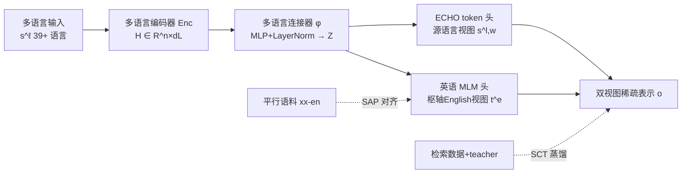

# MILCO: Learned Sparse Retrieval Across Languages via a Multilingual Connector

**会议**: ICLR 2026  
**OpenReview**: [https://openreview.net/forum?id=Z6dVYEqurT](https://openreview.net/forum?id=Z6dVYEqurT)  
**代码**: [https://github.com/thongnt99/milco](https://github.com/thongnt99/milco)  
**领域**: 信息检索 / 学习稀疏检索 / 多语言与跨语言检索  
**关键词**: Learned Sparse Retrieval, 多语言连接器, 英语词表枢轴, 稀疏对齐预训练, LexEcho 双视图

## 一句话总结
MILCO 用一个"多语言连接器 + 英语 MLM 头"把 39 种语言的文本统一投影到共享的英语词表稀疏空间，配合"稀疏对齐预训练"防止语义坍塌、用 LexEcho 双视图找回被翻译丢失的稀有实体，让单个 560M 稀疏模型在多语言与跨语言检索上同时超过 BGE-M3、Qwen3-Embed 等稠密/稀疏/多向量基线。

## 研究背景与动机
- **领域现状**：学习稀疏检索（LSR，如 SPLADE）兼具双编码器的检索效率和词法匹配的可解释性——表示直接对齐到自然语言词表，便于错误追踪、偏见检查，还天然支持推理时 post-hoc 剪枝做 Matryoshka 式延迟控制。但 LSR 的进展几乎全在英语上。
- **现有痛点**：多语言扩展支离破碎。BGE-M3 把稠密/稀疏/多向量头塞进同一骨干，但稀疏分量效果差且缺跨语言能力；SPLADE-X、BLADE 只做跨语言检索，且每个语言对要单独训练一个模型，难以规模化。
- **核心矛盾**：最直接的多语言 LSR 做法是给多语言编码器接一个多语言 MLM 头、投影到完整多语言词表，但直接对比训练会引发严重的**语义坍塌**（semantic collapse）——表示退化成与输入毫无关系的随机潜在 token，可解释性和效果同时崩盘。
- **本文目标**：用单个稀疏模型同时支撑多语言检索（query 与 doc 同语言）和跨语言检索（query 与 doc 跨语言），既保留词法透明性又达到 SOTA 效果。
- **核心 idea**：**【枢轴词表统一】** 不去对齐到庞大的多语言词表，而是把所有语言折叠（collapse）进英语这一枢轴词表，用一个轻量连接器把多语言隐状态映射到英语 MLM 头的输入空间；**【对齐先于对比】** 先用海量平行语料做稀疏对齐预训练把表示"锚"在英语词表上，再上对比训练，避免坍塌；**【源语言回声】** 额外保留一路源 token 视图，专门捞回英语视图翻译不出来的稀有实体。

## 方法详解

### 整体框架
MILCO 由三个串联组件构成：多语言编码器 → 多语言连接器 → LexEcho 头，最终对每条文本输出一个落在英语词表上的稀疏向量（外加一路源语言视图）。训练采用两阶段：先用平行语料做稀疏对齐预训练（SAP）把英语视图锚定到英语词表，再用检索数据做稀疏对比训练（SCT）提升效果，全程用 ℓ1 正则维持稀疏性。

### 关键设计

**1. 多语言连接器：把所有语言折叠进英语词表。** 编码器输出多语言隐状态 $H \in \mathbb{R}^{n \times d_L}$ 后，连接器 $\phi$（一个 MLP）配合 $\mathrm{LayerNorm}(\mathrm{Linear}(\phi(H)))$ 把它投影到枢轴语言（英语）的嵌入空间 $Z \in \mathbb{R}^{n \times d_e}$。这一步是 MILCO 与"多语言 MLM 头"路线的根本区别：与其让模型在巨大的多语言词表里分配权重，不如统一收敛到英语这一信息丰富、又有现成 LSR teacher 可对齐的枢轴上。这样不仅得到跨语言通用的表示，还顺带压缩了训练时的显存和算力——并且单个模型即可同时服务多语言与跨语言两种场景。

**2. LexEcho 双视图头：英语视图负责语义、源视图找回实体。** 投影后的 $Z$ 经英语 MLM 头解码到英语词表 $V_e$，用 log-饱和激活 $\mathrm{LogSat}(x)=\log(1+\mathrm{ReLU}(x))$ 得到非负 logits $T^{(e)}=\mathrm{LogSat}(\mathrm{Dec}(Z)) \in \mathbb{R}^{n \times |V_e|}$，再沿源 token 维做 max-pooling 得到英语稀疏向量 $t^{(e)}_j=\max_i T^{(e)}_{ij}$——这一路不仅给出直译词（live, music, phone），还会扩展出语义相关词（song, stream, step）支撑语义检索。但连接器在稀有/未见实体（尤其非拉丁字符，如"陌陌 Momo"）上会失手，因此 MILCO 用一个专门的 $\mathrm{[ECHO]}$ token 头算出源 token 权重 $w=\mathrm{LogSat}(\mathrm{Dec}_{[\text{ECHO}]}(Z)) \in \mathbb{R}^n_{\ge 0}$，选择性地"回声"出关键源 token。最终表示 $o=\{t^{(e)}, s^{(l)}, w\}$ 把英语语义视图和加权源视图拼起来，让模型能表示从未见过、无法翻译的实体。

**3. 稀疏对齐预训练（SAP）：先锚定再优化。** 直接对比训练会语义坍塌，所以第一阶段先用现成英语 LSR teacher（如 SPLADE-v3）对平行句对 $(s^{(\ell)}, s^{(e)})$ 中的英语句产出目标稀疏向量 $t^*$，再把非英语句的英语视图 $t^{(e)}$ 对齐到它。关键是一个**稀疏感知 MSE（SMSE）**损失：由于稀疏向量绝大多数坐标为 0、且 LogSat 对负 pre-activation 梯度为零，损失直接定义在解码 logits $\mathrm{Dec}(Z)$ 上，并只在"至少一侧为正"的坐标上计算——
$$L_{\text{SMSE}}(t^{(e)},t^*)=\frac{\sum_j \mathbb{1}(\tilde t^{(e)}_j>0 \lor \tilde t^*_j>0)\,(\tilde t^{(e)}_j-\tilde t^*_j)^2}{\sum_j \mathbb{1}(\tilde t^{(e)}_j>0 \lor \tilde t^*_j>0)}$$
这样把学习信号集中到少数有信息的词法坐标上，缓解梯度稀释、稳定对齐。SAP 用的是海量易得的双语平行语料（594M 句对），绕开了稀缺的多语言相关性标注。

**4. 稀疏对比训练（SCT）：蒸馏提效果、ℓ1 保稀疏。** 对齐只锚定了词表却没为检索优化，第二阶段在检索数据上用 KL 蒸馏从 cross-encoder teacher 迁移知识，并加 query/doc 的 ℓ1 正则促稀疏：$L_{\text{contrastive}}=L_{\text{KLD}}+\alpha_q\|q\|_1+\alpha_d\|p\|_1$。论文强调 SAP 是 SCT 的**前置条件**——没有对齐直接对比训练会坍塌，效果反而崩。

## 实验关键数据

### 主实验表格（MIRACL dev, nDCG@10, 18 语言均值）

| 模型 | 规模 | Avg | 备注 |
|---|---|---|---|
| BM25 | - | 31.9 | 无监督稀疏 |
| M3-Sparse | 560M | 53.9 | BGE-M3 稀疏分量 |
| T-Splade | 3.4B | 54.5 | 翻译成英语再 SPLADE |
| Qwen3-Embed-0.6B | 596M | 60.5 | 稠密 |
| M3-Dense | 560M | 69.2 | 稠密 |
| Qwen3-Embed-8B | 7.57B | 69.8 | 稠密大模型 |
| M3-Dense+Sparse+Multivec | 560M | 71.5 | 混合三头 |
| **MILCO ① (SAP+SCT_KD+LexEcho)** | **560M** | **72.3** | **本文最强** |

MILCO 比 M3-Sparse +34.1%、比 T-Splade +32.7%、比同尺寸 Qwen3-0.6B +19.5%、比 M3-Dense +4.5%；体量小约 14× 仍超过 E5-Mistral 7B 与 Qwen3-8B。在 MLDR 长文档（13 语言）达 74.4，比 M3-All 混合集成高 14%；在 MTEBv2（39 语言）小模型组以 66.83 居首。

### 消融实验表格（MIRACL Avg nDCG@10）

| 配置 | Avg | 结论 |
|---|---|---|
| ① SAP + SCT_KD + LexEcho | 72.3 | 完整体 |
| ② SAP + SCT_KD + 仅英语视图 | 69.4 | 去源视图 −4.17% |
| ③ SAP + SCT(InfoNCE) + LexEcho | 70.1 | 去蒸馏 |
| ④ SAP + 仅英语 MLM（只对齐） | 54.5 | 缺对比训练 |
| ⑤ SCT_KD + 英语 MLM（只对比） | 59.2 | 缺对齐 |
| ⑥ noMILCO（无连接器，多语言 MLM 头） | 50.7 | 去连接器最惨 |

### 关键发现
- **对齐是地基**：缺 SAP（⑤）或无连接器（⑥）均坍塌；只对齐（④）也只有 54.5，需对比训练接力（→ ③ 70.1，再加蒸馏 → ① 72.3）。
- **LexEcho 对非拉丁语种增益最大**：相对仅英语视图（②），中文 +8.09%、泰卢固 +6.8%、波斯 +6.5%、韩 +6.5%、日 +6.04%，正因这些语言实体难映射到英语。
- **可解释 + 动态效率**：稀疏词法表示让错误可追踪（如发现"Momo"被英语视图漏掉、LexEcho 给"陌"高权重补回）；mass-based 剪枝把文档表示压到平均仅 30 个活跃维度时，MILCO-560M 仍超过 1024 维的 Qwen3-0.6B，检索延迟低 3×、索引小 10×。
- **零样本跨语言**：连接器把各语言投到统一英语视图，让 MILCO 能做 M3-Sparse 等"仅源视图"稀疏模型做不到的零样本跨语言检索（MKQA R@100）。

## 亮点与洞察
- **"枢轴词表 + 先对齐后对比"是治语义坍塌的关键组合**：把多语言折叠到英语词表本身既统一了表示又省算力，而 SMSE 损失只在稀疏激活坐标上计算、直接作用于 LogSat 前的 logits，是让稀疏对齐真正稳定的工程巧思。
- **LexEcho 用一个 [ECHO] token 优雅地补上枢轴范式的天然短板**：枢轴英语丢实体是结构性问题（扩大模型也救不了，新实体源源不断），双视图把"语义靠英语、实体靠源语言"显式解耦，且哪一路重要由权重自适应决定。
- **稀疏 LSR 在多语言场景反超稠密/混合**：用 1/14 的参数压过 Qwen3-8B，同时保留透明性与剪枝可控延迟，重新证明词法稀疏检索的代表能力上限。

## 局限与展望
- **依赖英语作枢轴和英语 LSR teacher**：方法虽不限制枢轴语言，但实际选英语是因为资源/teacher 现成；对低资源枢轴或缺 teacher 的设定可行性未验证。
- **训练上下文仅 512 token**：长文档靠切片打分（取最佳 passage），并非原生长上下文，可能在跨段落语义上有损失。
- **SAP 重度依赖大规模平行语料**（594M 双语对），对平行资源稀缺的语言对覆盖如何尚不明确。
- **源视图的语言特定词表**仍带来一定异构性，跨语言完全统一只在英语视图层面实现。

## 相关工作与启发
- **LSR 谱系**：从 SNRM（潜在稀疏）到 SPLADE（MLM 头、可微 query 加权与扩展），MILCO 属于 MLM Encoder 一支，并首次系统解决其多语言化。
- **跨语言检索**：相对 SPLADE-X / BLADE 的"每语言对一个模型"和 BGE-M3 稀疏分量的弱跨语言，MILCO 用单模型统一多语言与跨语言。
- **对齐预训练**：把 Reimers & Gurevych 等稠密对齐思路迁移到稀疏词表空间，是"多语言稀疏对齐"的首次探索。
- **启发**：枢轴语言折叠 + 双视图回声的思路，可推广到其他需要"统一表示但保留稀有 token"的多模态/多语言稀疏建模任务。

## 评分
- **新颖性**: ⭐⭐⭐⭐⭐ 多语言连接器折叠词表、SMSE 稀疏对齐、LexEcho 双视图三点组合是稀疏检索多语言化的原创且自洽的解法。
- **实验充分度**: ⭐⭐⭐⭐⭐ 覆盖 39 语言、4 个主基准 + 附录 BEIR/NeuCLIR/LIMIT，消融把 6 个配置拆得很清楚，剪枝/延迟/索引大小都有量化。
- **写作质量**: ⭐⭐⭐⭐ 动机—方法—消融逻辑顺畅，RQ 组织清晰；公式与符号略密集，需配图理解。
- **价值**: ⭐⭐⭐⭐⭐ 单个 560M 稀疏模型在多语言+跨语言同时 SOTA，兼顾透明性与可控效率，代码开源，对生产级多语言检索有直接落地价值。

<!-- RELATED:START -->

## 相关论文

- [\[ICLR 2026\] Learning Retrieval Models with Sparse Autoencoders](learning_retrieval_models_with_sparse_autoencoders.md)
- [\[ACL 2026\] All Languages Matter: Understanding and Mitigating Language Bias in Multilingual RAG](../../ACL2026/information_retrieval/all_languages_matter_understanding_and_mitigating_language_bias_in_multilingual_.md)
- [\[ICML 2026\] LEMUR: Learned Multi-Vector Retrieval](../../ICML2026/information_retrieval/lemur_learned_multi-vector_retrieval.md)
- [\[ICLR 2026\] ELViS: Efficient Visual Similarity from Local Descriptors that Generalizes Across Domains](elvis_efficient_visual_similarity_from_local_descriptors_that_generalizes_across.md)
- [\[ICLR 2026\] Let LLMs Speak Embedding Languages: Generative Text Embeddings via Iterative Contrastive Refinement](let_llms_speak_embedding_languages_generative_text_embeddings_via_iterative_cont.md)

<!-- RELATED:END -->
