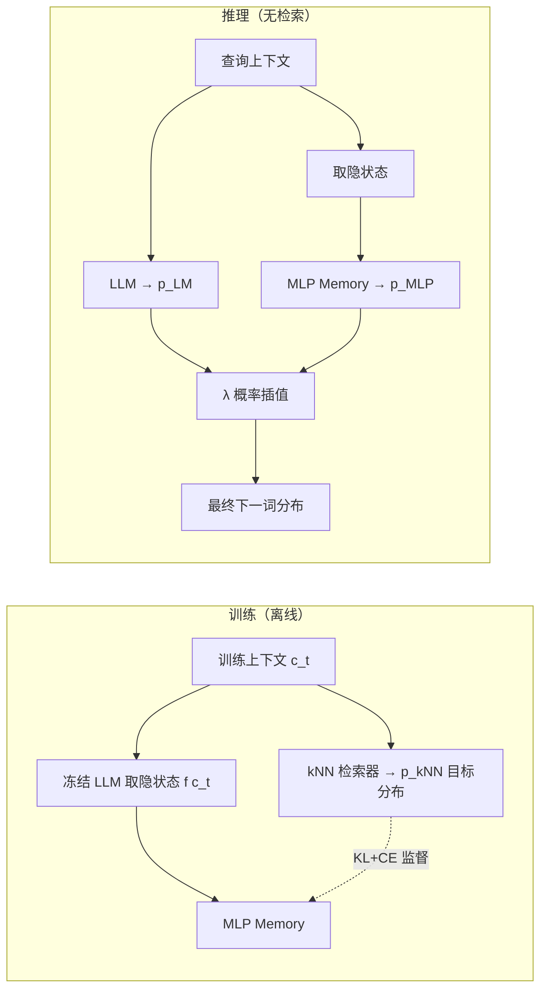

# MLP Memory: A Retriever-Pretrained Memory for Large Language Models

**会议**: ICLR 2026  
**OpenReview**: [https://openreview.net/forum?id=1SMdxRtLBp](https://openreview.net/forum?id=1SMdxRtLBp)  
**代码**: [https://github.com/LUMIA-Group/MLPMemory](https://github.com/LUMIA-Group/MLPMemory)  
**领域**: 信息检索 / 参数化记忆 / 检索增强  
**关键词**: kNN-LM, 参数化记忆, 检索蒸馏, MLP, 幻觉抑制  

## 一句话总结
把"在整个预训练语料上跑 kNN 检索得到的下一词分布"蒸馏进一个轻量全 MLP 模块，让 LLM 在推理时用一次前向就拿到"检索式知识"，从而以 2.5× 于 RAG 的速度获得更高 QA 准确率并降低幻觉。

## 研究背景与动机
- **领域现状**: 给 LLM 补知识有两条主流路线。非参数化的 RAG 在推理时检索外部文档拼进上下文，知识灵活可更新；参数化的持续预训练（CPT）/ LoRA 直接改权重把知识写进模型。
- **现有痛点**: RAG 的代价是高延迟（近邻搜索 + 长上下文）和"浅融合"——检索器游离在 LLM 计算图之外；而 CPT/LoRA 会灾难性遗忘、拉垮通用能力，本文实验里 CPT 在五个 QA 上平均掉了 9.6 个点。此外 kNN-LM 这类显式记忆动辄要几百 GB 数据存储（Wikitext-103 上 GPT2-small 就要近 500GB）。
- **核心矛盾**: "高效推理"和"有效知识访问"二者难以兼得——检索灵活但慢，改权重快但伤身。
- **本文目标**: 造一个**全参数化、可微、压缩、低延迟、且覆盖整个预训练语料的长期记忆**，同时拿到检索的好处和参数化的速度。
- **核心 idea**: **把检索行为本身蒸馏成参数**——用一个 MLP 去拟合 kNN 检索器在全语料上输出的下一词分布，推理时只做概率插值，彻底甩掉文档检索与近邻搜索（**Retriever-Pretrained Memory**）。

## 方法详解

### 整体框架
系统由两个分开预训练的部件组成：冻结的 Transformer 解码器（base LM）和一个外挂的全 MLP 记忆。训练阶段（离线）先在语料上构建 kNN-LM 式 datastore，对每个上下文算出非参数化的检索分布 $p_{kNN}$，然后训练 MLP 把 LM 隐状态映射到这个分布；推理阶段 MLP 输出与 LM 输出做概率插值得到最终分布，全程不碰文档库。

### 关键设计

**1. 全 MLP 记忆架构：用无 token-mixing 的堆叠 MLP 充当可微检索器。** 作者观察到"模仿检索器"这件事处理的是单个查询向量、不需要序列上的 token-mixing（注意力），而既有研究又指出 FFN 层本就扮演键值记忆角色，所以记忆模块干脆设计成一摞纯 MLP，把离散检索 $M:\mathbb{R}^d \to \mathbb{R}^{|V|}$ 变成可微映射：输入 base LM 的隐状态 $f(c)$，直接吐出近似 $p_{kNN}(y\mid c)$ 的词表分布，省掉近邻搜索。默认 8 层、1B 参数，就把 kNN-LM 里 5B token 对应的 40TB datastore 压成约 4GB 的参数。

**2. 检索分布蒸馏 + KL/CE 混合目标：既学分布形状又保 token 准确。** 监督信号来自离线预算好的 $\{(f(c_t), p_{kNN}(\cdot\mid c_t))\}$，构建时把查询自身从近邻集里剔除以防平凡的自检索污染。kNN 分布天然是"多个合理续词按相似度加权"的软分布，因此主损失用 KL 散度让 MLP 匹配整条分布而非只猜最可能词：$L_{KL}(c_t)=\mathrm{KL}(p_{kNN}(\cdot\mid c_t)\,\Vert\,p_{MLP}(\cdot\mid c_t))$；再补一项交叉熵 $L_{CE}(c_t)=-\log p_{MLP}(w_t\mid c_t)$ 把分布钉在真实语料的 ground-truth 上、防止只学 LM 目标导致的偏移。两者用 $L=\alpha L_{KL}+(1-\alpha)L_{CE}$ 平衡，消融显示 $\alpha=0.4$ 最优——纯 CE 会过拟合语言建模、纯 KL 又学不到 token 级准确性。

**3. 概率插值推理：一次前向、延迟与语料规模解耦。** 沿用 kNN-LM 的插值式但去掉检索，最终分布为 $p_{final}(w_t\mid c_t)=\lambda\, p_{MLP}(w_t\mid c_t)+(1-\lambda)\, p_{LM}(w_t\mid c_t)$，$\lambda$ 在各任务验证集上调。由于 MLP 只是一次轻量前向，推理速度与 datastore 大小**无关**（RAG/kNN-LM 的延迟却随语料增长），实测 TTFT 比 RAG(top-5) 快 2.5×、比 kNN-LM 快 5.6×，吞吐相对 base LM 仅 1.2× 开销。

**4. 层选择：取约 70% 网络深度的表示作记忆输入。** 与 kNN-LM 习惯用最后一层不同，本文发现把 MLP Memory 挂在解码器约 70% 深度处的隐状态上，在 GPT2 small/medium/large 三个规模上都一致最优，这与 Memorizing Transformers 选 ~75% 深度的经验吻合，说明中后层表示更适合作长期知识检索键。

## 实验关键数据

### 主实验表格（五个 QA 基准，Exact-Match 类指标，括号为相对基线提升）

| 方法 | NQ | WebQA | TriviaQA | TruthfulQA | HotpotQA | 平均 |
|---|---|---|---|---|---|---|
| Mistral-7B-v0.3 | 20.63 | 29.28 | 57.65 | 32.09 | 20.96 | 32.12 |
| +RAG | 22.56 | 24.90 | 54.21 | 35.47 | 29.77 | 33.38 (+3.9%) |
| +kNN-LM | 21.05 | 30.51 | 57.77 | 32.33 | 21.20 | 32.57 (+1.4%) |
| +CPT | 12.16 | 34.06 | 61.21 | 29.18 | 16.04 | 30.53 (−5.0%) |
| +LoRA | 18.17 | 34.50 | 61.60 | 30.91 | 16.23 | 32.28 (+0.5%) |
| **+MLP Mem** | **25.20** | **37.45** | 60.99 | 32.54 | 24.14 | **36.06 (+12.3%)** |

Llama2-7B 上 MLP Memory 同样把平均从 32.81 提到 35.38（+7.8%），而 CPT 掉到 29.66（−9.6%）。

### 消融实验表格（损失权重 α，WikiText-103 PPL 趋势）

| α | 0.0(纯CE) | 0.4(最优) | 1.0(纯KL) |
|---|---|---|---|
| 效果 | 过拟合 LM 目标 | **最佳** | 学不到 token 级准确 |

层选择消融：在 GPT2 small/medium/large 上，~70% 深度处取表示一致最优（区别于 kNN-LM 的末层惯例）。

### 关键发现
- **通用 NLP 不退化反提升**: 九项任务（情感/蕴含/主题分类）平均从 67.86 提到 73.07，RTE（59.57→64.62）、CB（69.64→76.79）等推理任务尤为明显，而 CPT/LoRA 涨跌互现。
- **强力抑制幻觉**: HaluEval 上对话/QA/摘要分别 +9.68 / +10.08 / +2.14 点，CPT/LoRA 则普遍掉点。
- **超越同语料的显式检索**: MLP Memory 用与 RAG/kNN-LM 相同的 Wikipedia-2021 语料，效果反而更好——案例中 RAG 检到正确文档却被上下文干扰答错，MLP Memory 无检索直接答对。

## 亮点与洞察
- **"把检索蒸馏成参数"这一招很巧**: 不是去近似某份知识，而是去近似"检索这个行为/分布"，于是天然继承了 kNN 软分布里"多个合理续词"的丰富信号，比单标签语言建模监督更有料。
- **延迟与语料规模解耦**是真正的工程价值点：RAG/kNN-LM 越大越慢，MLP Memory 恒定开销，部署友好。
- **解耦记忆与推理**: 不动 base LM 权重，所以躲开了 CPT/LoRA 的灾难性遗忘，记忆模块"互补而非干扰"。
- 用 FFN=键值记忆的既有认知反推"记忆该用纯 MLP"，架构动机自洽。

## 局限与展望
- **知识更新性退化**: 蒸馏成参数后，RAG 那种"换文档即换知识"的灵活性没了，语料更新需重建 datastore + 重训 MLP，论文未讨论增量更新方案。
- **依赖一次性昂贵的离线 datastore 构建**: 仍要先在全语料跑 kNN 检索缓存目标分布，构建成本不低（虽是离线）。
- **规模与骨干有限**: 主实验只到 7B 骨干、1B 记忆，是否在更大模型/更大语料上持续有效未知。
- **λ/α 需按任务调**，插值超参的鲁棒性与自动化仍有空间。
- 案例式地说明"压缩检索模式比显式检索更抗干扰"，但缺乏对"为什么参数化反而更准"的机理性分析。

## 相关工作与启发
- **kNN-LM / 检索增强**: 直接前身，本文等于把 kNN-LM 的非参数 datastore 用 MLP 压缩并参数化，去掉存储与搜索瓶颈。
- **记忆增强 LM**（Memory Networks / Memory Transformers / LongMem / MemoRAG）: 多数把记忆当"工作记忆"做上下文扩展；本文强调覆盖整个预训练语料的"长期记忆"。
- **全 MLP 架构**（gMLP / sparse-MLP）与 "FFN 即键值记忆" 的发现，为用纯 MLP 当检索器提供了理论依据。
- 启发：检索/工具调用等"外挂行为"或许都能用"行为蒸馏"换成低延迟参数模块，值得迁移到 agent / 工具调用场景。

## 评分
- **新颖性**: ⭐⭐⭐⭐ 「把检索器行为蒸馏成可微 MLP 记忆」这个切入角度新颖，介于 RAG 与参数化之间开了第三条路。
- **实验充分度**: ⭐⭐⭐⭐ 两骨干 × 五 QA + 九 NLP + HaluEval + α/层选择消融，覆盖到位；但仅 7B、未做大模型/在线更新验证。
- **写作质量**: ⭐⭐⭐⭐ 动机—架构—损失—推理链条清晰，图示（Fig.2/4）有效，特性目标列举明确。
- **价值**: ⭐⭐⭐⭐ 延迟与语料解耦 + 抑幻觉 + 不遗忘，工程落地价值高，是 RAG/微调之外有竞争力的实用替代。

<!-- RELATED:START -->

## 相关论文

- [\[ICLR 2026\] TokMem: One-Token Procedural Memory for Large Language Models](tokmem_one-token_procedural_memory_for_large_language_models.md)
- [\[ICLR 2026\] Expert Heads: Robust Evidence Identification for Large Language Models](expert_heads_robust_evidence_identification_for_large_language_models.md)
- [\[ICML 2026\] Understand and Accelerate Memory Processing Pipeline for Large Language Model Inference](../../ICML2026/information_retrieval/understand_and_accelerate_memory_processing_pipeline_for_disaggregated_llm_infer.md)
- [\[ICLR 2026\] AMemGym: Interactive Memory Benchmarking for Assistants in Long-Horizon Conversations](amemgym_interactive_memory_benchmarking_for_assistants_in_long-horizon_conversat.md)
- [\[ICLR 2026\] Query-Level Uncertainty in Large Language Models](query-level_uncertainty_in_large_language_models.md)

<!-- RELATED:END -->
