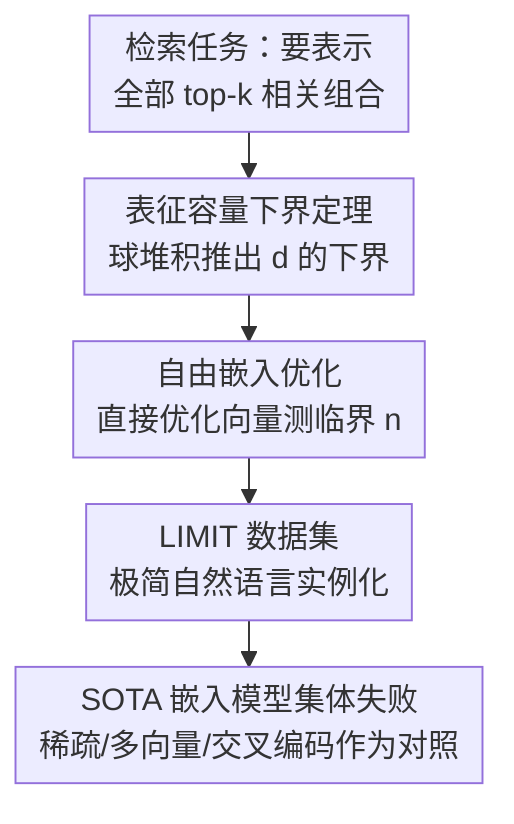

# On the Theoretical Limitations of Embedding-Based Retrieval

**会议**: ICLR 2026  
**OpenReview**: [https://openreview.net/forum?id=k9CzIvzfaA](https://openreview.net/forum?id=k9CzIvzfaA)  
**代码**: https://github.com/google-deepmind/limit  
**领域**: 信息检索 / 稠密检索 / 表征学习理论  
**关键词**: 单向量嵌入, 表征容量下界, 球堆积, top-k 检索, LIMIT 数据集

## 一句话总结
本文用高维几何里的球堆积论证给出"单向量嵌入要表示所有 top-k 文档组合所需维度"的下界定理，再用自由嵌入优化和一个极简的真实数据集 LIMIT 实证：哪怕查询简单到"谁喜欢苹果"，只要要表示的相关组合足够多，固定维度的稠密检索模型就**注定**做不到，这是单向量范式的根本瓶颈而非数据或规模问题。

## 研究背景与动机
**领域现状**：信息检索从 BM25 这类稀疏方法转向了以语言模型为骨干的神经检索，主流形态是"单向量稠密检索"——把整段文本压成一个向量，靠向量内积排序。近年指令式检索 benchmark（QUEST、BRIGHT、BrowseComp 等）进一步要求嵌入模型能表示"任意查询 + 任意相关性定义"，等于把检索的目标推到了"理论上任何能被定义的任务"。

**现有痛点**：社区普遍有一个隐含假设——嵌入模型现在解不了的难题，只是因为查询不现实，或者只要数据更好、模型更大就能解决。也就是说，大家把失败归因于"工程没做够"，而不认为存在原理性的天花板。

**核心矛盾**：单向量嵌入用的是几何空间里的向量表示，而几何空间能"切分"出多少种不同的 top-k 子集，是受维度 $d$ 严格约束的。当任务要求返回的相关文档组合数量爆炸式增长（指令、逻辑算子可以把任意两篇本不相关的文档绑成一个 top-k 集合），固定维度的容量迟早不够用。这个矛盾此前没有被定量刻画到"现实、简单"的场景里。

**本文目标**：(1) 给出表示所有 top-k 组合所需嵌入维度的**下界**；(2) 证明这个限制对任何模型、任何训练数据都成立；(3) 构造一个简单到荒谬却仍解不了的真实数据集，把抽象定理落到 SOTA 模型上。

**切入角度**：不再用"更难的 benchmark"去试探模型能力上限，而是把神经检索和线性代数/高维几何里成熟的结论（Voronoi、球堆积、符号秩、JL 引理）接起来，从**表征容量**这个根上问"嵌入维度到底能编码多少种检索结果"。

**核心 idea**：用经典球堆积体积论证，把"要以 margin $\omega$ 实现全部 $\binom{n}{k}$ 个 top-k 子集"翻译成对维度 $d$ 的硬性下界，再用自由嵌入和 LIMIT 把这个下界从纸面推到实测。

## 方法详解

### 整体框架
本文不是提出一个新模型，而是搭起一条"三段递进"的论证链，从最抽象的理论一路逼近最真实的模型，层层确认同一个结论：单向量嵌入的表征容量被维度卡死。三段分别是——先证一个不依赖任何具体模型的维度下界（定理 1），再用"上帝视角"的自由嵌入实测最理想情况下到底要多少维（best-case），最后造一个自然语言数据集 LIMIT 让真实 SOTA 模型现形。三段的结论一致：维度 $d$ 是天花板，而且现实模型离这个天花板还差得远。

### 关键设计

**1. 表征容量下界定理：把"实现所有 top-k 组合"翻译成维度的硬约束**

针对"大家以为只要堆数据堆参数就能解决"这一痛点，本文给出一个与模型无关的下界。设 $n$ 个单位文档向量 $v_1,\dots,v_n\in\mathbb{R}^d$，查询也是单位向量。称一个 $k$-子集 $S$ 被以 margin $\omega$ 实现，若存在单位查询 $u_S$ 使得集合内最低分仍比集合外最高分高出 $2\omega$：

$$\min_{i\in S}\langle u_S, v_i\rangle \;\ge\; \max_{j\notin S}\langle u_S, v_j\rangle + 2\omega.$$

定理 1 断言：若全部 $\binom{n}{k}$ 个 $k$-子集都能被以 margin $\omega$ 实现，则

$$\binom{n}{k}\;\le\;\Big(1+\tfrac{1}{\omega}\Big)^{d},\qquad\text{即}\qquad d\;\ge\;\frac{\log\binom{n}{k}}{\log(1+1/\omega)}.$$

证明思路是球堆积体积论证：任取两个不同子集 $S\neq T$，把实现约束分别代入并相加，可得对应查询满足 $\lVert u_S-u_T\rVert\ge 2\omega$，于是这 $\binom{n}{k}$ 个查询两两相距至少 $2\omega$，它们各自的半径-$\omega$ 开球互不相交且都被包在半径 $1+\omega$ 的大球里，比较体积 $M\cdot\omega^d \le (1+\omega)^d$ 即得。渐近地，当 $n\gg k$ 时 $d=\Omega\!\big(k\log(en/k)/\log(1+1/\omega)\big)$。它和 JL 引理是镜像关系：JL 给的是"保距所需的**充分**维度"，本文给的是"实现所有检索集所需的**必要**维度"；margin $\omega$ 越大（要求越严），分母 $\log(1+1/\omega)$ 越小，所需维度越高。代入 $\omega=0.1$ 的标准取值，$n=10^6$、$k=100$ 就要 425 维，而 $k=1000$ 时直冲数千维——已经超过 web 级检索实际使用的维度（多数被量化/截断到 1k 以下）。

**2. 自由嵌入优化：用"上帝视角"实测理论下界有多保守**

定理 1 是极松的下界，它没考虑梯度学习、tokenization、泛化这些现实约束。为了量出"最理想情况下"真实需要多少维，本文设计了**自由嵌入**实验：不要任何语言模型，直接把每个 query/doc 当作可学习向量，用 Adam + InfoNCE 在**测试集 qrel 矩阵上直接优化**（全量 batch、其余文档作负例、投影梯度保持单位范数），目标是 100% 命中所有约束。这是任何嵌入模型的能力上界——自由嵌入都解不了的，真实模型更不可能。

实验固定 $k=2$，逐一增大 $n$ 直到某维度 $d$ 再也无法达到 100%，记下这个**临界 $n$（critical-n）**。把不同 $d$ 的临界 $n$ 拟合成三次多项式：

$$y = -10.5322 + 4.0309\,d + 0.0520\,d^2 + 0.0037\,d^3,\quad (r^2=0.999).$$

外推得到各维度的临界 $n$：512 维约 50 万、768 维 170 万、1024 维 400 万、3072 维 1.07 亿、4096 维 2.5 亿。关键结论是：理论下界**严重低估**了现实需求——$n=100$ 时定理 1 只要 4 维，自由嵌入却要 $d>18$（约 4.5 倍乘子），而这还是没有自然语言、没有泛化压力的最乐观情形。

**3. LIMIT 数据集：把抽象定理实例化成"简单到荒谬却解不了"的真实任务**

针对"自由嵌入太抽象、对真实模型意味着什么不清楚"的问题，本文构造了自然语言数据集 LIMIT。映射方式刻意选最朴素的"喜好"属性：文档是"某人喜欢 X、Y……"，查询是"谁喜欢 X"，每个查询恰好 2 篇相关文档（$k=2$）。属性表用 Gemini 2.5 Pro 生成并迭代清洗到 1850 个互不重叠的项（还用 BM25 检查 top 失败项防止词面泄漏）。语料用 50k 文档、1000 查询。最关键的是 qrel 矩阵的选取——作者据"互连越稠密越难表示"的直觉，挑了使全部 top-2 组合刚好略超 1000 个查询的最大文档数：$\binom{46}{2}=1035$，故用 **46 篇**核心文档承载全部 1000 个查询，再补随机姓名和属性使文档等长。除全量版外还做了只含这 46 篇的 **small 版**，以及把属性全换成同义词、降低词面重叠的 **synonym 版**用于拆解稀疏模型的优劣。这个设计的精妙在于：small 版理论上 12 维就能嵌入（自由嵌入已验证），但真实 SOTA 模型用 64 维都解不了，干净地把"瓶颈来自单向量范式本身"和"领域漂移/数据不足"这些借口隔离开。

### 损失函数 / 训练策略
自由嵌入用 InfoNCE 对比损失（全量 batch、in-batch 负例、投影梯度保持单位范数、Adam、loss 连续 1000 步无改善则早停）。LIMIT 的域漂移消融用 lightonai/modernbert-embed-large 在 train 集或 test 集上用 SentenceTransformers 微调，并通过把隐层投影到指定维度来扫不同 $d$。

## 实验关键数据

### 主实验
被测模型涵盖 GritLM、Qwen3 Embedding、Promptriever、Gemini Embedding、Arctic Embed Large v2.0、E5-Mistral（单向量，维度 1024–4096），外加三个非单向量对照：BM25、GTE-ModernColBERT（多向量）、token 级 TF-IDF。

| 设置 | 任务规模 | 单向量 SOTA 表现 | 对照 |
|------|---------|-----------------|------|
| LIMIT 全量 | 50k 文档 / 1000 查询 / k=2 | recall@100 难以超过 20% | BM25 接近满分（维度高） |
| LIMIT small | 46 文档 | recall@20 都无法解出 | GTE-ModernColBERT 远超单向量但未解出 |
| 交叉编码对照 | small，46 文档全喂入 | — | Gemini-2.5-Pro 一次前向 100% 解出 |

### 消融实验

| 配置 | 关键现象 | 说明 |
|------|---------|------|
| 在 LIMIT-train 上微调 | recall@10 从近 0 仅升到 ~2.8 | 同域训练几乎无用 → 不是领域漂移 |
| 在 LIMIT-test 上微调 | 能学会任务（过拟合 token） | 与自由嵌入一致：可过拟合但不泛化 |
| LIMIT-small → synonym 版 | BM25 跌 >89%、Qwen3 跌 38.9% | 稀疏模型靠词面匹配，去重叠后崩塌 |
| 维度从小到大（MRL 截断到 32） | 维度越大召回越高 | 维度是决定性变量，实证呼应定理 |

### 关键发现
- **维度是决定性因素**：所有单向量模型的表现随嵌入维度单调上升，直接印证了理论里 $d$ 卡容量的论断。
- **不是领域漂移**：同域训练只带来微乎其微的提升，而测试集过拟合却能学会，说明失败源于表征容量而非分布差异。
- **架构对比揭示出路也揭示坑**：交叉编码器（Gemini-2.5-Pro）不受嵌入维度限制可 100% 解出，多向量（MaxSim）显著优于单向量，稀疏/BM25 因维度极高而接近满分；但 BM25 在同义词版暴跌、证明它只是换了一种局限（纯词面匹配），并非万能解。

## 亮点与洞察
- **把神经检索接到经典几何上**：用球堆积体积比这一行高中也能懂的论证，给出与任何训练细节无关的维度下界——优雅且无法被"更大模型"反驳。
- **best-case 实验的设计哲学很妙**：直接在测试集上优化自由向量，故意制造"作弊上界"，从而把"理论太松"这个反驳也堵死——连作弊都需要远超下界的维度。
- **LIMIT 的"简单悖论"极具冲击力**："谁喜欢苹果"这种问题 12 维就够装，SOTA 大模型却挂掉，这个反差比任何复杂 benchmark 更能说服人。
- **可迁移的方法论**：用"自由参数实例化 + 临界点拟合"来量化某个表示范式的容量天花板，这套思路可搬到知识图谱嵌入、多模态对齐等任何"用固定维度向量编码组合关系"的场景。

## 局限与展望
- 作者承认：理论只针对单向量模型，对多向量等架构不成立（仅给了初步实证，未给定理）。
- 未刻画"允许少量错误（只覆盖多数组合）"这一更宽松场景的下界。
- 只证明了"存在某些组合无法表示"，但无法事先指出模型具体会在哪类组合/指令上失败——可能仍有一些推理/指令任务恰好能解。
- 我的观察：LIMIT 用"喜好属性"实例化属于一种特定映射，作者也强调框架允许任意实例化；不同实例化的难度排序、qrel 稠密度与难度的精确关系仍是开放问题。展望上，交叉编码器、多向量、稀疏/稠密混合、hyperencoder 等更具表达力的检索架构是绕过维度瓶颈的候选方向。

## 相关工作与启发
- **vs JL 引理**：JL 给"保两两距离的充分维度"，本文给"实现所有 top-k 检索集的必要维度"，二者方向互补，本文把焦点从"保距"换到"可分性 + margin"。
- **vs 高阶 Voronoi / order-k 区域计数**：经典工作问"给定配置能实现多少 $k$-子集"且难以紧界，本文反过来问"实现**全部** $k$-子集需要多大维度"，绕开了紧界难题，得到干净的下界。
- **vs 既有经验性维度研究（Reimers & Gurevych 2020、Yin & Shen 2018 等）**：他们经验性地观察小维度更易假阳性、维度与 bias-variance 权衡，本文则首次给出维度与可检索 top-k 集合之间的**理论**连接并配实证。
- **vs 指令/推理检索 benchmark（QUEST、BRIGHT、BrowseComp）**：这些工作不断加难任务推模型上限，本文指出它们只采样了组合空间的极小一隅（QUEST 的 $\binom{325k}{20}\approx 7\times10^{91}$ 远超 3k 查询），从而掩盖了根本限制。

## 评分
- 新颖性: ⭐⭐⭐⭐⭐ 把球堆积下界引入稠密检索，给出范式级的容量天花板，视角罕见。
- 实验充分度: ⭐⭐⭐⭐ 理论+自由嵌入+真实数据集三段闭环，覆盖单/多向量/稀疏/交叉编码对照，唯多向量缺定理。
- 写作质量: ⭐⭐⭐⭐⭐ 论证链清晰、定理与实证环环相扣，LIMIT 的反差叙事极有说服力。
- 价值: ⭐⭐⭐⭐⭐ 直接挑战"大模型万能"的隐含假设，对评测设计与下一代检索架构都有实际指导意义。

<!-- RELATED:START -->

## 相关论文

- [\[ICLR 2026\] Embedding-Based Context-Aware Reranker](embedding-based_context-aware_reranker.md)
- [\[ICLR 2026\] Think Then Embed: Generative Context Improves Multimodal Embedding](think_then_embed_generative_context_improves_multimodal_embedding.md)
- [\[ICLR 2026\] HUME: Measuring the Human-Model Performance Gap in Text Embedding Tasks](hume_measuring_the_human-model_performance_gap_in_text_embedding_tasks.md)
- [\[ICLR 2026\] Let LLMs Speak Embedding Languages: Generative Text Embeddings via Iterative Contrastive Refinement](let_llms_speak_embedding_languages_generative_text_embeddings_via_iterative_cont.md)
- [\[ACL 2026\] More Than Efficiency: Embedding Compression Improves Domain Adaptation in Dense Retrieval](../../ACL2026/information_retrieval/more_than_efficiency_embedding_compression_improves_domain_adaptation_in_dense_r.md)

<!-- RELATED:END -->
