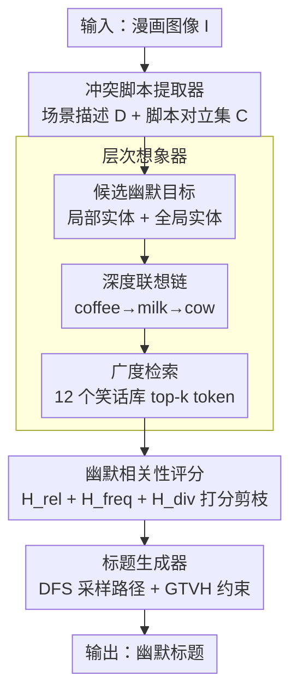

# On the Wings of Imagination: Conflicting Script-based Multi-role Framework for Humor Caption Generation

**会议**: ICLR 2026  
**arXiv**: [2602.06423](https://arxiv.org/abs/2602.06423)  
**代码**: 无  
**领域**: 信息检索  
**关键词**: 幽默生成, GTVH理论, 脚本对立, 想象树, LLM协作, 多角色框架

## 一句话总结

提出 HOMER 框架，基于 GTVH 幽默理论构建三角色 LLM 协作机制（冲突脚本提取器 + 层次想象器 + 标题生成器），通过显式建模脚本对立、多视角联想链与笑话数据库检索构建想象树来扩展创意空间，在 New Yorker 漫画基准上以 GPT-4o 为底座平均提升 ~7%，人类评估也显著优于所有基线。

## 研究背景与动机

**领域现状**：多模态幽默生成是探索 LLM 是否具备人类级语言认知复杂性的重要任务。典型任务"看图说笑话"（funny caption generation）需同时具备视觉理解、幽默推理、创意想象与语言风格表达能力，对人类而言也具有挑战性。

**现有方法局限**：已有方法主要依赖 (a) 通用 prompt（HumorousAI、Phunny）、(b) 多跳推理自改进（CLoT）、(c) 任务微调（LoL），但这些方法仅依赖 LLM 固有的幽默机制，只能捕捉表面幽默语言模式，无法进行深层幽默逻辑推理和创造性想象。

**核心痛点**：(a) LLM 内在幽默生成能力弱，已被多项研究验证；(b) 现有方法缺乏创造力——生成的"幽默"标题往往只是描述性语句；(c) 不可解释——不知道笑点在哪里、为什么好笑。

**切入角度**：借助经典语言学幽默理论 GTVH（General Theory of Verbal Humor），将幽默创建建模为多个知识资源的交互——核心是**脚本对立**（script opposition），即两个语义框架的冲突产生笑点（期望建立→期望违反→惊喜/荒谬）。

**理论基础**：GTVH 将幽默分解为五个知识资源——脚本对立（Script Opposition）、情境（Situation）、目标（Target）、叙述策略（Narrative Strategy）和语言（Language），为幽默标题生成提供了天然的结构化指导框架。

**动机示例**：以办公会议+巨大咖啡杯的漫画为例，GPT-4o 和 CLoT 只能描述"会议+咖啡因"，而 HOMER 通过识别"巨大杯 vs 正常杯"的脚本对立，沿"coffee→milk→cow"的想象链，生成"HR says we can expense a cow now"这样具有深层荒谬感的幽默标题。

## 方法详解

### 整体框架

HOMER（Humor-theory-driven multi-role LLM collaboration framework augmented with humor Retrieval）要解决的是"LLM 直接看图搞笑只会写描述句、不知道笑点在哪、也无法解释为什么好笑"这个核心难题。它的思路是把幽默生成按 GTVH 幽默理论拆成一条"有配方"的三角色流水线：先抠出笑点的逻辑前提，再围绕它把创意空间撑开、打分剪枝，最后落成标题——每一步都对应理论里的某个知识资源，而不是让 LLM 自由发挥。

具体地，冲突脚本提取器 $\mathrm{Extract}(\cdot)$ 先从图像里读出场景描述 $D$ 和脚本对立集合 $\mathcal{C}$；层次想象器 $\mathrm{Imagine}(\cdot)$ 以 $\mathcal{C}$、$D$ 为锚点，把候选幽默目标用"深度联想链 + 笑话库广度检索"展开成想象树 $\mathcal{T}_{\mathrm{im}}$，并用幽默相关性分数对叶节点打分剪枝去噪；标题生成器 $\mathrm{Gen}(\cdot)$ 最后从树里采样一条创意路径写出标题。整条链路可写成 $\mathrm{Cap}(I) = \mathrm{Gen}(\Phi(\mathcal{C}, D, \mathcal{T}_{\mathrm{im}}, \Omega))$，其中 $\Omega \in NS \times LA$ 对应 GTVH 中叙述策略与语言风格两个知识资源，让生成在结构化约束下进行。

### 关键设计

**1. 冲突脚本提取器：先把"笑点的逻辑前提"显式抠出来**

现有方法的通病是直接让 LLM 看图搞笑，模型既不知道笑点在哪也无从推理，结果往往只是描述句。HOMER 把这一步前置成结构化抽取：先让 LLM 分析画面生成包含位置、人物、表情、动作的场景描述 $D = \mathrm{Extract}(I)$，再按 GTVH 对脚本对立的定义（两个冲突或对比的语义框架之间的关系）设计 prompt，引导模型穷举所有相关冲突脚本 $\mathcal{C} = \mathrm{Extract}(\Phi_{\mathrm{script}}(I, D))$。比如办公会议配一只巨大咖啡杯的漫画，这里被抽出的对立就是"巨大杯 vs 正常杯"。之所以把它放在最前面，是因为脚本对立是幽默成立的逻辑基石——没有冲突就没有笑点；消融实验里去掉 $\mathcal{C}$ 带来的下降最大，印证了 $D$ 与 $\mathcal{C}$ 共同撑起后续全部生成。

**2. 层次想象器：用深度联想 + 广度检索把创意空间撑大**

纯靠 LLM 联想容易反复绕圈、不够发散，单纯检索笑话又会引入大量噪声，这一模块用"先扩后剪"同时拿到创意深度和幽默广度。它先从局部（描述 $D$ 里的细粒度实体）和全局（图像 $I$ 的粗粒度实体）两个视角挑出候选幽默目标 $\{t_i\}$ 作为想象树根节点；对每个目标用一阶联想函数沿骨干链递归深入，$e_{\tau+1}^{(i)} = f_{\mathrm{chain}}(e_{\tau}^{(i)})$（$\tau = 0,\ldots,n-1$，平均链长 $\mathbb{E}[\tau]\approx 4$），这正是"coffee→milk→cow"那种逐层跳跃，构成想象树的骨干；再对链上每个实体 $e_{\tau}^{(i)}$ 构造查询嵌入 $\mathbf{z}_q = f_{\mathrm{emb}}(D, \mathcal{C}, e_{\tau}^{(i)})$，从整合的 12 个笑话数据集里检索 top-$k$ 笑话、提取 token 当叶节点做广度扩展，把日常生活里的幽默关联补进来。展开出的想象树再交给下一步打分剪枝去噪。

**3. 幽默相关性评分：用"相关但出乎意料"把幽默量化进 WordNet**

想象树扩展出来的叶节点 token 良莠不齐，需要一个能对齐幽默直觉的打分函数来剪枝。HOMER 用幽默相关性分数 $\mathbf{H}(e_{\tau}^{(i)}, \varepsilon) = \mathbf{H}_{\mathrm{rel}} + \mathbf{H}_{\mathrm{freq}} + \mathbf{H}_{\mathrm{div}}$ 给每个叶节点打分，三项分别衡量"相关且对立"的程度、token 与笑话频率的几何均值、以及词性多样性（多词性意味着更多双关机会）。其中最关键的相关-对立项 $\mathbf{H}_{\mathrm{rel}}$ 借 WordNet 的结构化语义关系拆成两部分：目标语义相似度 TSS 用 Wu-Palmer 相似度衡量语义关联，$\mathrm{TSS}(s_{e_\tau}, s_\varepsilon) = \max_{s_{e_\tau}\in S_{e_\tau}, s_\varepsilon\in S_\varepsilon}\mathrm{Sim}_{\mathrm{wup}}(s_{e_\tau}, s_\varepsilon)$；概念对立度 CO 用 Jaccard 不相似度衡量概念冲突，$\mathrm{CO}(s_{e_\tau}, s_\varepsilon) = 1 - \max_{s_{e_\tau}, s_\varepsilon}\frac{|\mathcal{R}(s_{e_\tau})\cap\mathcal{R}(s_\varepsilon)|}{|\mathcal{R}(s_{e_\tau})\cup\mathcal{R}(s_\varepsilon)|}$。两者经塑形函数 $f(x)=x\exp(-x)$ 合成

$$\mathbf{H}_{\mathrm{rel}} = \mathrm{TSS} + f(\mathrm{TSS})\cdot\mathrm{CO}$$

这条设计精准对应幽默的本质——语义上有关联（高 TSS）、概念上却对立（高 CO）才好笑；塑形函数保证语义相似度主导、对立性只作有界加成，使两者自然平衡而不会被极端值带偏。消融显示三项缺一不可，其中相关-对立项最关键。

**4. 标题生成器：从想象树里采样路径，在结构约束下产出多样标题**

有了脚本对立和剪枝后的想象树，最后一步要把它们落成一句真正好笑的话，并且能批量产出不同候选。生成器随机选定一个关键冲突脚本 $C\in\mathcal{C}$ 和一个幽默目标 $t_i$，对对应子树 $T_i$ 做 DFS 枚举所有根到叶路径 $\mathcal{P}_i$，采样其中一条 $P_i$，再连同叙述策略一起拼成 prompt：$\mathrm{Cap}(I) = \mathrm{Gen}(\Phi(\mathcal{C}, D, P_i, \Omega))$。每次采样落在不同路径、不同目标上，自然得到多样的标题，而 GTVH 的五个知识资源又作为结构化约束兜住幽默质量，避免发散成无关内容。

## 实验关键数据

### 主实验：GPT-4o 底座的幽默标题生成（pass@k，%）

| 方法 | #Top10 @1 | #Top10 @3 | #200-209 @1 | #200-209 @3 | #1000-1009 @1 | #1000-1009 @3 |
|------|-----------|-----------|-------------|-------------|---------------|---------------|
| CoT | 45.79 | 70.59 | 57.28 | 82.85 | 61.58 | 86.90 |
| Few-shot | 58.07 | 78.91 | 65.12 | 81.14 | 65.59 | 88.39 |
| Self-consistency | 62.03 | 77.96 | 68.09 | 84.45 | 69.42 | 85.51 |
| HumorousAI | 62.11 | 81.24 | 69.38 | 85.32 | 73.46 | 85.42 |
| CLoT | 61.17 | 75.29 | 59.52 | 72.47 | 68.70 | 78.00 |
| **HOMER** | **66.41** | **83.70** | **73.40** | **88.38** | **76.32** | **90.50** |
| 提升 | +6.92% | +3.03% | +5.79% | +3.59% | +3.89% | +2.39% |

### 消融实验：各模块贡献（GPT-4o，Humor in AI #Top10）

| 配置 | pass@1 | pass@3 | pass@5 |
|------|--------|--------|--------|
| Image-Only | 20.20 | 38.30 | 51.00 |
| I+D | 50.60 | 69.49 | 78.00 |
| I+$\mathcal{C}$ | 41.80 | 59.70 | 67.00 |
| I+$\mathcal{T}_{\mathrm{im}}$ | 20.00 | 35.90 | 43.00 |
| I+D+$\mathcal{C}$ | 57.40 | 75.50 | 80.00 |
| I+D+$\mathcal{C}$+$\mathcal{T}_{\mathrm{im}}$（完整） | **66.41** | **83.70** | **89.18** |

### 人类评估（5 分制幽默评分）

| 方法 | Humor in AI | Electronic Sheep |
|------|-------------|-----------------|
| CoT | 2.47 ± 0.67 | 2.20 ± 0.78 |
| CLoT | 2.95 ± 0.77 | 2.53 ± 0.73 |
| HumorousAI | 3.01 ± 0.73 | 2.24 ± 0.81 |
| LoL | 3.16 ± 0.84 | 2.40 ± 0.82 |
| **HOMER** | **3.54 ± 0.59** | **3.31 ± 0.85** |

### 评估器可靠性

| 评估器 | Humor in AI 排序准确率 | Electronic Sheep 排序准确率 |
|--------|----------------------|---------------------------|
| LLaMa 3 | 53.5% | 52.0% |
| Humor-tuned LLaMa3 | 60.0% | 58.0% |
| GPT-4.1 | 68.5% | 67.0% |
| GPT-5 | 73.5% | 70.0% |

## 关键发现

- **脚本对立是最关键的基础组件**：消融实验中去掉冲突脚本 $\mathcal{C}$ 后性能下降最大（I+D+$\mathcal{T}_{\mathrm{im}}$ 的 pass@1 仅 34.40 vs 完整的 66.41），证明脚本对立是幽默生成的逻辑基石。

- **想象树需要正确的引导才有效**：单独加入想象树（I+$\mathcal{T}_{\mathrm{im}}$）反而不如仅用图像（Image-Only），因为没有脚本对立和情境描述引导的想象会产生无关和荒谬的内容。只有在 $D$ 和 $\mathcal{C}$ 的引导下，$\mathcal{T}_{\mathrm{im}}$ 才能发挥作用。

- **跨模型普适性强**：HOMER 在 GPT-4o、Claude-4、Qwen-VL (7B)、LLaVA-1.5 (7B) 四个底座模型上均一致提升，尤其在弱模型（Qwen-VL、LLaVA）上提升幅度更大（pass@1 最高提升 24.4%），说明框架设计而非底座能力是关键。

- **跨视觉域泛化能力好**：在 ImgFlip Meme 数据集（包含写实/漫画/合成等多种图像）上，HOMER 也以 83.33% pass@1 领先 CLoT (76.67%) 约 5.4%。

- **人类评估与自动指标一致**：20 位评价者的 5 分制评分中 HOMER 为唯一均分超 3.0 的方法（Humor in AI 3.54，Electric Sheep 3.31），Cohen's $\kappa = 0.49$ 表明评价者间具有中等一致性，考虑到幽默的主观性这是合理的。

- **幽默相关性评分三项均重要**：消融实验中去掉任一项（相关-对立、频率、多样性）都导致显著下降，其中去掉相关-对立分数影响最大。

## 亮点与洞察

- **理论驱动 vs 数据驱动**：HOMER 不是让 LLM"试着搞笑"，而是用语言学幽默理论（GTVH）系统性地分解幽默生成过程→每一步都有理论依据→可解释且有原理。这是本文最核心的创新思路。

- **想象树的创造性扩展机制**：从"coffee cups"联想到"cow"需要多步跳跃→LLM 联想链（深度）+ 笑话库检索（广度）的组合实现了这种创造性。深度联想形成骨干，广度检索补充日常生活中的幽默关联。

- **幽默评估的可靠性探索**：系统对比了 5 种评估器的排序准确率，选择 GPT-5（73.5%）作为主评估器，比随机猜测高 23.5%。这对幽默 NLG 评估领域有参考价值。

- **有害内容检测**：在 Detoxify 的 7 个维度上毒性总分均 < 0.03，说明理论驱动的幽默生成不会导致有害内容——相比粗暴的"搞笑 prompt"更安全。

## 局限性

1. **依赖 GTVH 理论覆盖范围**：GTVH 主要针对言语幽默（verbal humor），对非言语幽默（如视觉双关）的覆盖可能不足。某些类型的幽默（如黑色幽默、冷幽默）是否适用于该框架未被探讨。

2. **多轮 LLM 调用成本高**：三个角色的串行调用（提取→想象→生成）+ 笑话检索，推理开销远大于单次 prompt，实际部署成本较高。

3. **笑话数据库的覆盖与偏见**：12 个英文笑话数据集的覆盖面有限，可能存在文化偏见。跨语言/跨文化的幽默生成未被验证。

4. **评估的主观性**：尽管 Cohen's $\kappa = 0.49$ 在幽默评估中可接受，但人类评价的一致性仍然有限。pass@k 指标依赖 GPT-5 评估器，而 GPT-5 的排序准确率也仅 73.5%。

## 相关工作与启发

### vs CLoT（多跳推理自改进）
CLoT 依赖 LLM 的推理链（chain-of-thought）进行自改进，但缺乏对幽默本质的结构化理解。HOMER 通过 GTVH 理论提供了幽默生成的"配方"，而不仅仅是"让 LLM 多想几步"。实验中 HOMER 在 GPT-4o 上 pass@1 比 CLoT 高 5.24%（66.41 vs 61.17），差距在弱模型上更大。

### vs HumorousAI（通用幽默 prompt）
HumorousAI 使用精心设计的 prompt 引导 GPT-4o 生成幽默标题，但仍依赖 LLM 固有幽默能力。HOMER 的优势在于想象树机制——通过外部笑话数据库引入 LLM 训练数据之外的幽默关联，扩展了创意空间。

### vs LoL（任务微调）
LoL 通过微调提升幽默生成能力，但受限于微调数据的规模和多样性。HOMER 作为无需微调的即插即用框架，在 GPT-4o 上 pass@1 比 LoL 高 10.11%（66.41 vs 56.30），且具有更好的可解释性。

## 评分

| 维度 | 评分 | 理由 |
|------|------|------|
| 新颖性 | ⭐⭐⭐⭐ | 首次将 GTVH 幽默理论系统性融入 LLM 多角色协作框架；想象树 + 笑话检索剪枝机制设计精巧 |
| 有效性 | ⭐⭐⭐⭐ | 在 4 个底座模型、2 个数据集上一致显著提升；人类评估 + 自动指标 + 消融实验完整充分 |
| 实用性 | ⭐⭐⭐ | 多轮 LLM 调用 + 笑话检索的推理成本较高；笑话数据库需要维护；但框架即插即用无需微调 |
| 写作质量 | ⭐⭐⭐⭐ | 论文结构清晰，GTVH 理论介绍自然，消融实验详尽；Case Study 生动有说服力 |

<!-- RELATED:START -->

## 相关论文

- [\[ACL 2026\] Domain-Specific Data Generation Framework for RAG Adaptation](../../ACL2026/information_retrieval/domain-specific_data_generation_framework_for_rag_adaptation.md)
- [\[ICLR 2026\] GRO-RAG: Gradient-aware Re-rank Optimization for Multi-source Retrieval-Augmented Generation](gro-rag_gradient-aware_re-rank_optimization_for_multi-source_retrieval-augmented.md)
- [\[ICML 2025\] FedRAG: A Framework for Fine-Tuning Retrieval-Augmented Generation Systems](../../ICML2025/information_retrieval/fedrag_a_framework_for_fine-tuning_retrieval-augmented_generation_systems.md)
- [\[ICLR 2026\] ZeroGR: A Generalizable and Scalable Framework for Zero-Shot Generative Retrieval](zerogr_a_generalizable_and_scalable_framework_for_zero-shot_generative_retrieval.md)
- [\[ACL 2025\] FlexRAG: A Flexible and Comprehensive Framework for Retrieval-Augmented Generation](../../ACL2025/information_retrieval/flexrag_a_flexible_and_comprehensive_framework_for_retrieval-augmented_generatio.md)

<!-- RELATED:END -->
