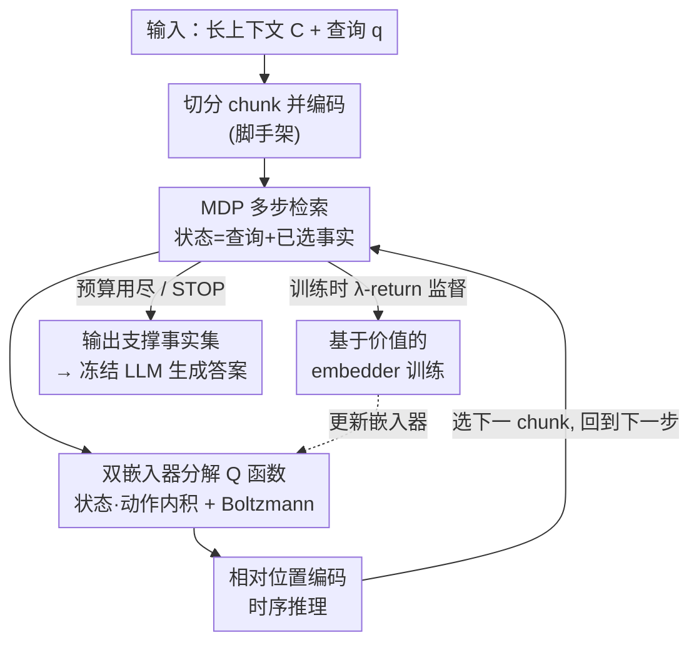

# Q-RAG: Long Context Multi‑Step Retrieval via Value‑Based Embedder Training

**会议**: ICLR2026  
**OpenReview**: [https://openreview.net/forum?id=MS9nWFY7LG](https://openreview.net/forum?id=MS9nWFY7LG)  
**代码**: https://github.com/griver/Q-RAG  
**领域**: 信息检索 / RAG  
**关键词**: 多步检索, RAG, 强化学习, 嵌入器微调, 长上下文

## 一句话总结
Q-RAG 把多步检索建模成一个 MDP，用基于价值的强化学习只微调嵌入器（不动 LLM），让检索智能体直接在 chunk 嵌入的潜空间里一步步挑选支撑事实，在 BabiLong、RULER 等长上下文基准（最长 1000 万 token）上拿到 SOTA，且只用单张 A100 就能训练。

## 研究背景与动机
**领域现状**：RAG 是缓解 LLM 长上下文低效、幻觉、静态知识等问题的主流手段——只把语料里最相关的片段喂给 LLM，从而缩短输入、提升效率与质量。但绝大多数 RAG 是**单步检索**：一次查询拿回 top-k 片段。这在 Needle-in-a-Haystack 这类"找一根针"的简单任务上够用。

**现有痛点**：复杂问题需要**多步检索**——它本质是一种"基于搜索的推理"，要先找到事实 A，才知道该去找事实 B。现有的多步检索路线各有硬伤：① 构建知识图谱（GraphReader、HippoRAG）推理时极慢，因为 LLM 要先把整段上下文读完才能建图；② LLM agent 路线（把 RAG 查询和 LLM 生成的指令交替进行）对噪声/错误片段很敏感，一个坏片段会污染后续查询的生成；③ 最近主流是**微调 LLM**让它学会调用检索工具（Search-R1、R1-Searcher、ReSearcher），效果好但训练极贵——动辄要 8×A100，且无法套用闭源大模型。

**核心矛盾**：要做好多步检索，就得**联合优化检索和生成**；但联合优化目前只能靠微调 LLM 本体，而微调 LLM 既贵又把方法锁死在小模型上。检索能力被绑在了 LLM 参数里，无法和"任意大小、甚至闭源"的生成模型解耦。

**本文目标**：在不微调 LLM 的前提下，做出一个资源高效的多步检索智能体，既能在超长上下文（10M token）上做常识/时序推理，又能在 HotPotQA、MuSiQue 这类多跳 QA 上有竞争力。

**切入角度**：作者的关键观察是——**多步检索完全可以在 chunk 嵌入的潜空间里进行，不需要 LLM 参与决策**。如果把"当前已检索到的事实"当作状态、"下一个该选哪个 chunk"当作动作，那这就是一个标准的有限时域 MDP，可以用紧凑、廉价的 value-based RL 来学。

**核心 idea**：用强化学习只微调**嵌入器**（state/action 两个 embedder），让 Q 值 = 状态嵌入与动作嵌入的内积，从而在潜空间里用价值函数驱动多步检索，把检索能力和任意 LLM 彻底解耦。

## 方法详解

### 整体框架
Q-RAG 把"在长文档里多步找证据"重新表述成一个**有限时域 MDP**：给定三元组 $(C, q, y)$——长上下文 $C$（预切成 $m$ 个不重叠 chunk $\{c^{(i)}\}_{i=1}^m$）、初始查询 $q$、金标答案 $y$，智能体要找出 $C$ 中"$q$ 里缺失、但产生正确答案所必需"的信息。episode 开始时先把所有 chunk 编码好；状态 $s_t = \mathrm{ord}([q, a_0, \dots, a_{t-1}])$ 是"查询 + 已选 chunk"按文档原序排好的列表（$\mathrm{ord}(\cdot)$ 排序是为了消除排列歧义），动作集 $A_t = C \setminus \{a_0,\dots,a_{t-1}\}$ 是还没选的 chunk。每步从可选 chunk 里挑一个加进状态，直到步数预算 $T$ 用尽或触发 STOP 动作。奖励是稀疏的终局奖励：当监督给出支撑事实集 $F^\star$ 时，只有最终状态包含全部支撑事实才给 1，否则 0。

整个决策由一个 **value-based 智能体**完成：用两个嵌入器分别编码状态和候选动作，Q 值取二者内积，再用 Boltzmann 策略按 Q 值挑下一个 chunk；嵌入器本身用 TD 强化学习训练。检索完成后，把选出的支撑事实集喂给一个**冻结的** LLM 生成最终答案。

### 关键设计

**1. 多步检索建模成潜空间 MDP：把"决策"从 LLM 搬到嵌入空间**

针对"做多步检索就得微调昂贵 LLM"这一核心矛盾，Q-RAG 的根本动作是**换掉决策主体**：不再让 LLM 生成搜索查询，而是让一个轻量智能体直接在 chunk 嵌入的潜空间里做选择。形式上，动作 $a_t \in A_t$ 选一个 chunk，转移是确定性的 $p(s_t, a_t) = \mathrm{ord}([q, a_0,\dots,a_{t-1}, a_t])$，已选 chunk 从动作集移除，episode 终止于预算 $T$ 或 STOP。奖励只在终局给：包含全部支撑事实 $F^\star$ 得 1，否则 0（论文也提到可用 LLM 生成答案、按 EM/F1 给奖励，但本文所有实验都只用支撑事实信号，把 LLM-based reward 留作未来工作）。这样建模的好处是决策完全发生在向量空间，单次决策只是算内积 + softmax，不需要 LLM 前向，因此既快又便宜，还能和任意大小（包括闭源）的生成模型即插即用。

**2. 双嵌入器分解的 Q 函数 + Boltzmann 策略：让 Q 值变成一次向量内积**

为了让潜空间决策可扩展到上百万 token 的海量候选 chunk，Q-RAG 把 Q 函数**分解成两个嵌入器的内积**：状态嵌入器 $E_s(s_t; \theta_1) \in \mathbb{R}^d$ 编码当前状态，动作嵌入器 $E_a(a^i, i; \theta_2) \in \mathbb{R}^d$ 编码候选 chunk 内容及其文档位置 $i$（用 rotary position embedding），于是
$$Q_\theta(s, a^i) = \langle E_s(s; \theta_1),\ E_a(a^i, i; \theta_2)\rangle.$$
这个分解是有理论支撑的（论文附录 A 给了收敛性保证和速率）。它的价值在于：所有候选 chunk 的动作嵌入可以一次性预先算好缓存，每步只需重算一个状态嵌入再做内积，于是"为每个候选评估 Q 值"退化成一次高效的向量相似度查询——这正是 Q-RAG 能扩展到 10M token 而 BeamRetriever 那种基于 transformer 给整条轨迹打分的方法扩不上去的原因。给定 Q 后，下一 chunk 用 Boltzmann 策略采样：
$$\pi(a_t|s_t) = \frac{\exp\frac{1}{\alpha}(Q_\theta(s_t,a_t) - q)}{\sum_{a\in A_t}\exp\frac{1}{\alpha}(Q_\theta(s_t,a) - q)},$$
其中 $q = \max_{a\in A_t} Q_\theta(s_t, a)$ 做数值稳定，温度 $\alpha$ 在训练中按学习率比例退火到 0。

**3. 基于价值的 embedder 训练：用 soft-Q + PQN + λ-return 把检索质量灌进嵌入器**

光有 Q 函数结构还不够，关键是怎么把"检索得好不好"训进嵌入器参数。Q-RAG 采用最大熵（soft）强化学习，定义软 $Q^\pi$ 与 $V^\pi$：
$$Q^\pi(s,a) = r(s,a) + \gamma V^\pi(p(s,a)),\quad V^\pi(s) = \mathbb{E}_{a\sim\pi}[Q^\pi(s,a) - \alpha\log\pi(a|s)].$$
温度 $\alpha>0$ 控制探索强度——这对长上下文里"候选 chunk 极多、奖励极稀疏"的环境格外重要。底层 TD 算法选用 PQN（而非 DQN），因为 PQN **不需要 replay buffer**：在动作数巨大的检索场景里，replay buffer 会逼着你为每个采样重新编码所有 chunk 来估计后继状态的 V/Q，极慢且耗内存；PQN 的 on-policy 训练绕开了这笔开销。相对原版 PQN，Q-RAG 的两处关键改动是**用软价值函数**和**加 target network**——消融显示这两点都重要，尤其去掉 target network 后训练方差爆炸（见实验）。训练目标用 **λ-return** $G^\lambda_t$ 替代单步回报以提升稳定性与速度，其中离散动作下状态价值由 $V_{\theta'}(s_t) = \alpha\log\sum_{a\in A_t}\exp(Q_{\theta'}(s_t,a)/\alpha)$ 从 Q 值算出（$\theta'$ 是 EMA 慢更新的 target 参数），最终最小化均方误差 $L_Q = \mathbb{E}[(Q_\theta(s_t,a_t) - G^\lambda_t)^2]$。整套流程只更新两个嵌入器，单张 80GB A100 即可训练。

**4. 相对位置编码做时序推理：让检索器知道候选 chunk 落在"已知事实之间的哪一段"**

叙事文本里，一个 chunk 自身的内容往往不足以判断它是否有助于回答问题——比如要回答"某事件之前发生了什么"，标准检索器能找出多个写到角色位置的 chunk，但不结合**时序信息**就没法挑对那一个。Q-RAG 为此设计了一种**相对位置编码** $\rho_t$：在第 $t$ 步，已选 chunk 的文档下标 $S_t = \{i_1 < \dots < i_k\}$ 把文档切成 $k{+}1$ 个区间（"最早事实之前""相邻两事实之间""最晚事实之后"），$\rho_t$ 给每个原始 chunk 下标映射一个实数，既标明它落在哪个区间、又保留区间内的相对顺序。具体地，区间边界 $b_0{=}1,\ b_j{=}i_j,\ b_{k+1}{=}m{+}1$，对 chunk $c^i$ 找到唯一满足 $b_j\le i < b_{j+1}$ 的 $j$，令
$$\rho_t(i) = j\delta + \ell\,\frac{i - b_j}{b_{j+1} - b_j},$$
其中 $\delta>0$ 是区间间步长、$\ell\in(0,\delta)$ 控制区间内分辨率（实验取 $\delta{=}10,\ \ell{=}9$）。然后在动作嵌入器里**用相对位置替换绝对位置**：$E_a(a^i, i; \theta_2) \Rightarrow E_a(a^i, \rho_t(i); \theta_2)$。这让 Q 函数能利用候选相对于已检索证据的空间关系，同时对全局位置平移保持不变——正是这一点让 Q-RAG 不仅能在离散事实检索上表现好，还能在长篇叙事任务上和 RMT、ARMT 等循环 transformer 掰手腕。

### 一个完整示例
以论文 Figure 1 的设定为例：问题"John 把钥匙忘在哪了？"，长文档里散落着 John 一天的行踪片段（"在办公室加班""顺路回了趟家""在药店买了东西""在咖啡馆待了二十分钟""在邻居家过夜"……）。episode 开始，智能体先把所有 chunk 编码好；初始状态 $s_0 = [q]$ 只含问题。第 1 步算 $s_0$ 的状态嵌入，对每个候选 chunk 算 $Q_\theta(s_0, c^i) = \langle E_s(s_0), E_a(c^i, \rho_0(i))\rangle$，按 Boltzmann 策略采样选出最相关的一段（比如"咖啡馆"）；选中后它从动作集移除、并进入状态 $s_1$。第 2 步状态变成 $[q, \text{咖啡馆}]$，此时相对位置编码 $\rho_1$ 已把文档按"咖啡馆"这条事实重新切区间——这让智能体能判断"药店"是发生在咖啡馆之前还是之后，从而挑出正确的下一个支撑事实。如此多步收缩，直到收集齐支撑事实集（如 {咖啡馆, 药店}）或用尽预算，最后把这几段事实交给冻结 LLM 生成答案。

### 损失函数 / 训练策略
训练目标为 λ-return 的均方误差 $L_Q = \mathbb{E}[(Q_\theta(s_t,a_t) - G^\lambda_t)^2]$（式 5）；并行跑 $K$ 个环境，每个环境 reset 出查询和上下文后预算 $T+1$ 步采样轨迹，按 Algorithm 1 反向计算 λ-return，再对全 batch 求梯度更新 $\theta$，target 参数按 $\theta' \leftarrow \tau\theta + (1-\tau)\theta'$ 做 EMA 慢更新。关键设置：soft 价值函数 + target network（两者都经消融验证有效）、温度 $\alpha$ 按学习率退火到 0、可微调的公开嵌入器有 multilingual-e5-large、gte-multilingual-base、contriever。全部训练在单张 A100-80GB 上完成。

## 实验关键数据

### 主实验
RULER 长上下文检索（NIAH 各子任务平均 + 多跳/单跳 QA），Q-RAG 仅在 4K 文档上训练却能泛化到 1M token：

| 长度 | 方法 | NIAH Avg. | SH QA | MH QA |
|------|------|-----------|-------|-------|
| 4K | LongRoPE2-8B | 99.7 | 99 | 60 |
| 4K | Beam Retriever | 98.5 | 29.0 | 39.0 |
| 4K | **Q-RAG** | **100** | **62** | **67** |
| 128K | LongRoPE2-8B | 97 | 56 | 50 |
| 128K | **Q-RAG** | **100** | 55 | **65** |
| 1M | **Q-RAG** | 99.7 | 52 | 61 |

开放域多跳 QA（HotPotQA 训练，MuSiQue 为 OOD），Q-RAG 用 QwQ-32B 做生成：

| 方法 | HotPotQA Fact F1 | HotPotQA Ans F1 | MuSiQue(OOD) Fact F1 | MuSiQue Ans F1 | Avg Ans F1 |
|------|------------------|------------------|----------------------|----------------|------------|
| Beam Retriever | **0.97** | 0.77 | 0.61 | 0.40 | 0.59 |
| Search-R1（全 LLM 微调） | 0.81 | 0.65 | 0.71 | 0.51 | 0.58 |
| **Q-RAG** | 0.93 | 0.76 | **0.71** | **0.52** | **0.64** |
| **Plan Q-RAG** | 0.95 | 0.76 | 0.69 | 0.51 | **0.64** |

Q-RAG 在 HotPotQA 上事实检索接近 Beam Retriever，在 OOD 的 MuSiQue 上全面领先，综合 Ans F1 最高；而它只微调嵌入器、单卡训练，Search-R1 却要微调整个 LLM、约 8×A100。

### 消融实验
BabiLong-QA3（最难、需≥3 个事实的多步搜索 + 时序推理），报告支撑事实检索 F1（3 seed 平均）：

| 配置 | 1K | 32K | 1M | 说明 |
|------|------|------|------|------|
| Q-RAG（完整） | 97.8 | 97.1 | 96.5 | 几乎不随上下文增长退化 |
| w/o Soft-Q | 95.9 | 94.5 | 93.3 | 去掉最大熵 soft 价值，掉 ~2-3 分 |
| w/o Target | 79.2±26 | 77.6±27 | 75.9±28 | 去掉 target network，方差爆炸 |
| Multi-Step RAG w. SFT | 20.3 | 20.1 | — | 同样监督信号用 SFT 取代 RL，几乎失效 |
| Multi-Step RAG w.o. FT | 15.5 | 15.5 | — | 不微调嵌入器，基本不可用 |

### 关键发现
- **RL 微调嵌入器是胜负手**：不微调（w.o. FT）只有 ~15 分、改用 SFT 也只有 ~20 分，而 RL 微调到 ~97 分——证明把检索质量"训"进嵌入器、且必须用 RL 而非监督学习。
- **target network 比 soft-Q 更关键**：去掉 soft-Q 掉 2-3 分尚可，去掉 target network 直接 ~76 分且 ±27 的巨大方差，说明它对稳定性至关重要。
- **最难子任务上优势最大**：BabiLong QA3 需要最长推理链 + 时序推理，其它长上下文方法随长度增加急剧退化，Q-RAG 几乎零退化，差距在这里被拉到最大——印证了相对位置时序编码的作用。
- **检索预算 2→3 步收益明显**：HotPotQA 上把检索步数从 2 加到 3，正确事实数和三种 Qwen3 生成器的答案质量都提升；且在合理范围内最终准确率主要取决于"是否检索到正确 chunk"，对噪声 chunk 不敏感。

## 亮点与洞察
- **把检索决策从 LLM 参数里解耦出来**：核心洞察是多步检索的"该选哪个 chunk"完全可以在嵌入潜空间里用价值函数决定，不必让 LLM 生成查询——于是检索能力可与任意（含闭源）LLM 即插即用，这是相对 Search-R1 路线最实用的差异点。
- **Q = 内积的分解既有理论又有工程价值**：把 Q 函数写成状态/动作嵌入内积，让"评估所有候选 chunk"退化成可缓存的向量相似度查询，这是它能扩到 10M token 而轨迹打分类方法扩不上去的根因。
- **PQN 而非 DQN 的选择很务实**：在候选海量的检索场景，replay buffer 会逼着反复重编码所有 chunk，作者直接换成无 buffer 的 on-policy PQN，是把 RL 落到大规模检索上的关键工程取舍。
- **相对位置编码可迁移**：用"已选事实把文档切区间、给候选编相对位置"来注入时序/结构信息，这个思路可迁移到任何"决策依赖已检索证据相对位置"的迭代检索/推理任务。

## 局限与展望
- **奖励依赖支撑事实标注**：所有实验都用 $F^\star$ 这种 oracle 支撑事实做稀疏奖励，现实中很多数据集没有逐 chunk 的支撑事实标注；作者把 LLM-based reward（用生成答案的 EM/F1 当奖励）明确留作未来工作，目前没验证。
- **检索质量 ≠ 答案质量**：Q-RAG 优化的是"挑对支撑事实"，最终答案还要靠冻结 LLM 生成；表里 NIAH/事实检索近满分，但 MH QA 的答案 F1（~61-67）仍有明显差距，检索与生成之间没有联合优化。
- **chunk 预切是前提**：方法假设上下文已被切成不重叠 chunk，切分粒度/边界对结果的影响、以及重叠 chunk 的情形论文只一句带过，未系统评估。
- **基线口径不齐**：作者坦言不同基准的基线设置不统一（部分 reported、部分 reproduced），跨方法的横向比较需谨慎，不能简单按表里数字大小下定论。

## 相关工作与启发
- **vs Search-R1 / R1-Searcher / ReSearcher（微调 LLM 路线）**: 它们冻结嵌入器、微调 LLM 本体用 GRPO 学多步检索，效果好但要约 8×A100 且锁死在可微调的模型上；Q-RAG 反过来只微调嵌入器、冻结 LLM，单卡可训且能配任意大小/闭源 LLM。
- **vs RePlug**: RePlug 也用 LLM 反馈微调检索器，思路最接近，但它不处理多步推理、也不在此设定下用 RL；Q-RAG 用 RL 训嵌入器并显式支持多步。
- **vs BeamRetriever**: BeamRetriever 训练 reranker 做 beam-search 式规划，在短上下文 QA 上是 SOTA，但用 transformer 给整条轨迹打分，推理慢、扩不到长上下文；Q-RAG 用嵌入内积做相似度检索，推理更快、长上下文扩展性更好（QA3 上 BeamRetriever 甚至训不出来）。
- **vs 循环记忆 transformer（RMT / Titans / ATLAS / ARMT）与 Mamba2 / LongRoPE2**: 这些是"修改模型架构处理超长序列"的另一类方法；Q-RAG 属于完全不同的检索类方法，却在 >1M token 上全面超过它们，说明"检索 + 冻结 LLM"在超长上下文上可比"硬扩上下文窗口"更划算。

## 评分
- 新颖性: ⭐⭐⭐⭐⭐ 把多步检索重述为潜空间 MDP、用 value-based RL 只微调嵌入器，是和主流"微调 LLM"路线正交的清晰新角度。
- 实验充分度: ⭐⭐⭐⭐ 覆盖 4K-10M token、多基准 + 完整消融 + 预算敏感性，但基线口径不齐、奖励依赖支撑事实标注。
- 写作质量: ⭐⭐⭐⭐ MDP 形式化、算法伪代码、相对位置编码都讲得清楚，部分图表信息密度偏高。
- 价值: ⭐⭐⭐⭐⭐ 单卡可训 + 即插任意 LLM + 超长上下文 SOTA，对资源有限的研究者和实际部署都很实用。

<!-- RELATED:START -->

## 相关论文

- [\[ICLR 2026\] Beyond RAG vs. Long-Context: Learning Distraction-Aware Retrieval for Efficient Knowledge Grounding](beyond_rag_vs_long-context_learning_distraction-aware_retrieval_for_efficient_kn.md)
- [\[ICLR 2026\] DeepRAG: Thinking to Retrieve Step by Step for Large Language Models](deeprag_thinking_to_retrieve_step_by_step_for_large_language_models.md)
- [\[ICML 2026\] HGMem: Hypergraph-based Working Memory to Improve Multi-step RAG for Long-Context Complex Relational Modeling](../../ICML2026/information_retrieval/hgmem_hypergraph-based_working_memory_to_improve_multi-step_rag_for_long-context.md)
- [\[ACL 2026\] BRIEF-Pro: Universal Context Compression with Short-to-Long Synthesis for Fast and Accurate Multi-Hop Reasoning](../../ACL2026/information_retrieval/brief-pro_universal_context_compression_with_short-to-long_synthesis_for_fast_an.md)
- [\[ACL 2025\] Hierarchical Document Refinement for Long-context Retrieval-augmented Generation](../../ACL2025/information_retrieval/hierarchical_document_refinement_for_long-context_retrieval-augmented_generation.md)

<!-- RELATED:END -->
