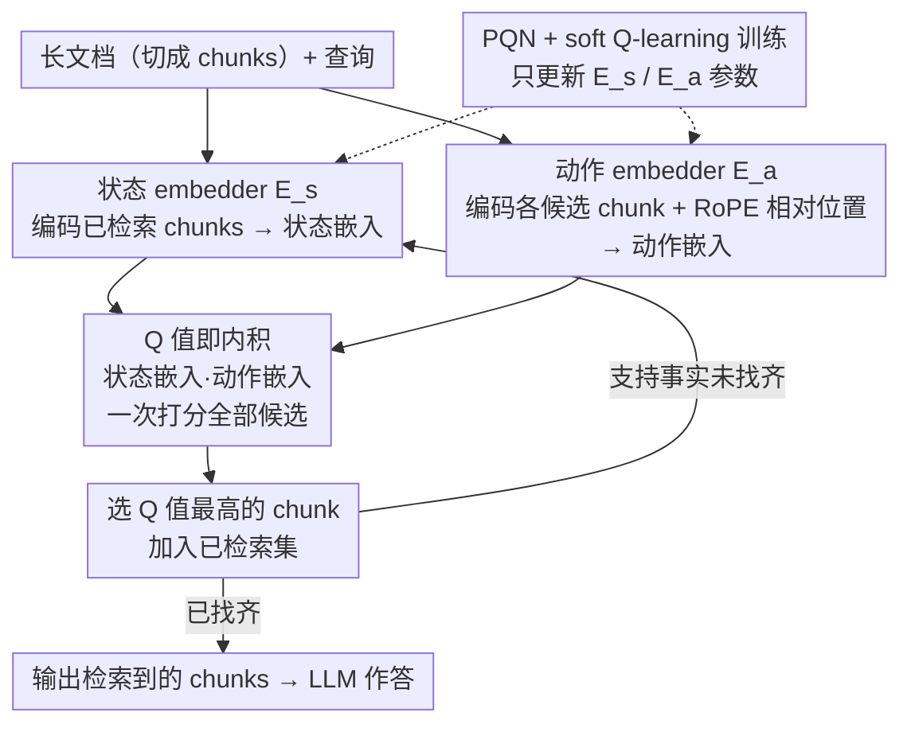

# Q-RAG: Long Context Multi-Step Retrieval via Value-Based Embedder Training

**会议**: ICLR 2026 Oral  
**arXiv**: [2511.07328](https://arxiv.org/abs/2511.07328)  
**代码**: 有  
**领域**: LLM / 检索增强生成  
**关键词**: multi-step retrieval, value-based RL, embedder training, long context, RAG

## 一句话总结
将多步检索建模为 MDP，用基于值的 RL（soft Q-learning）微调 **embedder 而非 LLM**，Q 函数设计为状态嵌入和动作嵌入的内积（理论证明为万能近似器），结合 RoPE 相对位置编码实现时序推理，在单卡 A100 上训练 12 小时，4K 训练泛化到 1M+ token 上下文，RULER 基准达到近乎完美的 NIAH 性能。

## 研究背景与动机

**领域现状**：长上下文多步检索是 RAG 的核心挑战。现有方法分两类：(a) 微调 LLM 生成搜索查询（Search-R1, R1-Searcher），需要 8×A100 且只能用开源 LLM；(b) 微调检索器（Beam-Retriever），用监督学习但泛化性差。

**现有痛点**：(a) LLM 微调方法计算成本极高且不能用于闭源 LLM；(b) Beam-Retriever 用 SFT 训练，在 OOD 数据和超长上下文上泛化差；(c) 现有检索器无法做时序推理（如"事件 X 之前发生了什么？"）。

**核心矛盾**：多步检索需要根据已检索内容动态决策下一步检索什么，本质上是序贯决策问题，但现有方法要么用昂贵的 LLM 做决策，要么用简单的 SFT 缺乏探索能力。

**本文目标** 设计一个轻量、通用、可泛化的多步检索 agent：(a) 只改 embedder 不改 LLM；(b) 用 RL 而非 SFT 训练；(c) 支持时序推理；(d) 短训练长泛化。

**切入角度**：将 Q 函数设计为嵌入空间的内积——这既符合检索的 similarity search 范式，又被证明是万能近似器，且支持高效推理（无需对每个候选做 transformer forward pass）。

**核心 idea**：用 RL 微调 embedder 学习"在检索空间中做序贯决策"，Q 函数为内积形式保证计算效率和理论正确性。

## 方法详解

### 整体框架
这篇论文要解决的是长上下文里的多步检索：给一段（预切分成 chunks 的）长文档和一个查询，需要分几步把散落在不同位置的支持事实逐个找齐。它和主流做法的根本分歧在于"改谁"——既不去微调 LLM 让它生成搜索查询（贵、且用不了闭源模型），也不用监督学习训练一个检索器（泛化差），而是把检索本身建模成一个序贯决策问题，只微调 embedder 让它学会"在检索空间里一步步做决策"。

具体把整个过程写成 MDP：状态是当前已检索 chunks 的有序列表，动作是从剩余候选里挑下一个 chunk，奖励是稀疏的终端奖励（把所有支持事实都找到才得 1 分）。训练用 soft Q-learning 配合 PQN，全程只更新 embedder 的参数。推理时则是一个迭代回环：状态 embedder 编码已检索内容、动作 embedder 编码每个候选 chunk，两者内积打分后选出下一个 chunk 加入集合，循环到支持事实找齐再交给 LLM 作答。

### 关键设计

**1. Q 函数即内积：让强化学习的价值函数直接落在检索的相似度空间里**

这一步同时回应了两个痛点——LLM 微调太贵、Beam-Retriever 给每个候选打分都要跑一遍 transformer。做法是把 Q 函数参数化成状态嵌入和动作嵌入的内积：

$$Q_\theta(s, a_i) = \langle E_s(s; \theta_1), E_a(a_i, i; \theta_2) \rangle$$

其中状态 embedder $E_s$ 编码已检索的内容，动作 embedder $E_a$ 编码候选 chunk 及它在文档中的位置。这么设计有两层好处：一是表达力不打折，**Theorem 1** 借 Stone-Weierstrass 定理证明这种内积形式仍是万能近似器；二是推理极快，给所有候选打分只需一次 dot product，不必像 Beam-Retriever 那样对每个候选做 transformer forward pass，长上下文下速度领先数量级。而且内积形式本就和检索的 similarity search 范式天然一致。

**2. RoPE 相对位置编码：让检索器能做"谁在谁之前"的时序推理**

现有检索器答不了"事件 X 之前发生了什么"这类时序问题，根子在于绝对位置编码一旦外推到长上下文就失效。这里改用相对位置：已检索到的事实把文档切成若干区间，每个候选 chunk 拿到的是它相对最近区间的位置编码

$$\rho_t(i) = j \cdot \delta + \ell \cdot \frac{i - b_j}{b_{j+1} - b_j}$$

动作 embedder 随之改用 $E_a(a_i, \rho_t(i); \theta_2)$。这样模型看的不再是候选的绝对坐标，而是它落在已知事实的"前 / 后 / 之间"，时序关系被显式编码进位置里，所以 4K 训练能一路泛化到 1M+ token。

**3. PQN + Soft Q-Learning：在数千 chunk 的检索场景里把值基 RL 训练真正跑起来**

检索场景的 chunk 动辄数千，传统 replay buffer 每次采样都要把所有 chunk 重新嵌入、重算一遍 Q 值，这是个绕不开的瓶颈。所以这里用 PQN（Periodic Q-Network）做在线训练，直接免掉 replay buffer。在此之上加 soft value function 和 target network 稳住训练：

$$V_{\theta'}(s_t) = \alpha \log \sum_{a} \exp(Q_{\theta'}(s_t, a)/\alpha)$$

并用 $\lambda$-return 替代单步 TD target 来压低偏差。

### 损失函数 / 训练策略
$\mathcal{L}_Q = \mathbb{E}[(Q_\theta(s_t, a_t) - G_t^\lambda)^2]$，AdamW 优化器，lr=1.5e-5，温度 $\alpha=0.05$ 退火到 0，$\lambda=0.5$，单卡 A100-80GB 训练 <12 小时。

## 实验关键数据

### 主实验 (RULER NIAH)

| 上下文长度 | Q-RAG NIAH Avg | LongRoPe2-8B | Beam-Retriever |
|-----------|---------------|-------------|----------------|
| 4K | **100** | 99.7 | 98.5 |
| 16K | **100** | 98.8 | 95.3 |
| 32K | **100** | 98.9 | — |
| 128K | **100** | 96.7 | — |
| 1M | **99.7** | — | — |

### Open-Domain QA (HotPotQA → Musique OOD)

| 方法 | HotPotQA Ans F1 | Musique Ans F1 (OOD) | 平均 | 训练资源 |
|------|-----------------|---------------------|------|---------|
| **Q-RAG** | 0.76 | **0.52** | **0.64** | 1×A100 |
| Beam-Retriever | 0.77 | 0.40 | 0.59 | — |
| Search-R1 | 0.65 | 0.51 | 0.58 | 8×A100 |

### 消融实验

| 配置 | 关键发现 |
|------|---------|
| 无 Soft-Q | 性能下降，探索不足 |
| 无 Target Network | 训练不稳定 |
| SFT 替代 RL | 短上下文可以但长上下文泛化失败 |
| 无微调 | 性能显著下降 |

### 关键发现
- **4K 训练→1M 泛化**：NIAH 性能从 4K 完美保持到 1M（2500× 外推），归功于相对位置编码
- **RL > SFT**：在相同监督信号下 RL 训练显著优于 SFT，特别是 OOD 和超长上下文
- **QA3（最难子任务）**：需要 3+ 事实 + 时序推理，Q-RAG 几乎无退化，Beam-Retriever 完全失败
- **效率对比**：推理时 dot product vs transformer forward pass，Q-RAG 在长上下文下速度优势巨大

## 亮点与洞察
- **Embedder-only 的范式转变**：不动 LLM 只改 embedder，使方法可适配任意 LLM（包括闭源），训练成本降 8×
- **Q 函数即检索**：将 RL 的 Q 函数和检索的 similarity score 统一为内积形式，同时满足理论保证和计算效率
- **与 LoongRL 形成互补**：LoongRL 教会 LLM 内部推理模式（plan-retrieve-reason），Q-RAG 教会 embedder 外部检索策略，两者可结合使用

## 局限与展望
- **仅用支持事实监督**：未探索用 LLM 回答质量作为奖励信号（retriever-generator 联合优化）
- **需要预切分 chunks**：依赖预定义的文档分段策略
- **需要支持事实标签**：训练数据需要标注哪些 chunks 是支持事实

## 评分
- 新颖性: ⭐⭐⭐⭐⭐ 将 RL Q-function 与检索相似度统一为内积，RoPE 相对位置用于时序检索均属首创
- 实验充分度: ⭐⭐⭐⭐⭐ RULER/BabiLong/Open-QA 全面覆盖，4K→10M 泛化惊人
- 写作质量: ⭐⭐⭐⭐ 方法描述清晰，但符号较多需要仔细阅读
- 价值: ⭐⭐⭐⭐⭐ 轻量可部署，适配任意 LLM，有望成为 RAG 标准检索组件

<!-- RELATED:START -->

## 相关论文

- [\[ICLR 2026\] Q-RAG: Long Context Multi‑Step Retrieval via Value‑Based Embedder Training](q-rag_long_context_multistep_retrieval_via_valuebased_embedder_training.md)
- [\[ICLR 2026\] Beyond RAG vs. Long-Context: Learning Distraction-Aware Retrieval for Efficient Knowledge Grounding](beyond_rag_vs_long-context_learning_distraction-aware_retrieval_for_efficient_kn.md)
- [\[ICLR 2026\] Embedding-Based Context-Aware Reranker](embedding-based_context-aware_reranker.md)
- [\[ICML 2026\] HGMem: Hypergraph-based Working Memory to Improve Multi-step RAG for Long-Context Complex Relational Modeling](../../ICML2026/information_retrieval/hgmem_hypergraph-based_working_memory_to_improve_multi-step_rag_for_long-context.md)
- [\[ICLR 2026\] Attributing Response to Context: A Jensen-Shannon Divergence Driven Mechanistic Study of Context Attribution in Retrieval-Augmented Generation](attributing_response_to_context_a_jensen-shannon_divergence_driven_mechanistic_s.md)

<!-- RELATED:END -->
