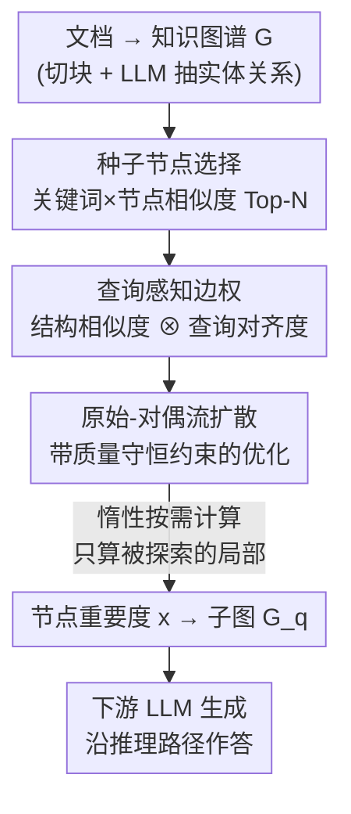

# Query-Aware Flow Diffusion for Graph-Based RAG with Retrieval Guarantees

**会议**: ICLR 2026  
**OpenReview**: [https://openreview.net/forum?id=n28wnc2QTc](https://openreview.net/forum?id=n28wnc2QTc)  
**代码**: 待确认（仅提供 Project Page）  
**领域**: 信息检索 / 图上学习 / Graph RAG  
**关键词**: Graph-based RAG、流扩散、查询感知遍历、子图检索保证、Text-to-SQL

## 一句话总结
QAFD-RAG 把"流扩散（flow diffusion）"引入图式 RAG，用查询语义动态给图中每条边重新加权，让信息流只沿着与查询对齐的路径扩散，从而免训练地抽出紧凑、可解释的推理子图，并首次给出了"以高概率召回相关子图"的统计保证，在问答与 Text-to-SQL 上稳定超过 GraphRAG / LightRAG 等基线。

## 研究背景与动机

**领域现状**：现实知识常是图结构（数据库 schema、社交网络、生物医学库），图式 RAG 通过在知识图谱（KG）上做检索来捕捉多跳依赖与层次关系，是当前增强 LLM 多跳推理的主流方向。代表方法 GraphRAG 用社区检测（Leiden 聚类）把文档聚成层级社区，LightRAG 则围绕种子节点抽 1-hop 自我网络（ego-net）。

**现有痛点**：作者指出现有图式 RAG 有两类硬伤：（i）**启发式设计、缺理论保证**——没人能说清抽出来的子图质量好不好、是否真和查询相关；（ii）**静态遍历策略忽略查询的整体语义**——不管你问什么，社区/邻域都长一个样。论文图 1 给了个直观例子：问"介绍 Steve Jobs 在 Apple 的产品"，GraphRAG 会把整个社区都拉进来（Mac、macOS 相关，但也混进 Amazon River、Apple 水果），LightRAG 则把结构上挨着、语义上无关的节点（如 Fuji 苹果品种）也带进来。

**核心矛盾**：图的"结构连通性"和查询的"语义相关性"并不一致——两个节点在图上是邻居，不代表它们和当前查询相关。静态遍历只看结构，于是把"结构上近但语义无关"的区域也检索进来，既稀释了上下文又破坏了推理链的连贯性，而且没有理论刻画到底召回得对不对。

**本文目标**：在什么条件下，能为"自适应查询整体语义的子图检索"建立**召回保证**？即既要让检索动态随查询变化，又要能证明"相关子图被高概率召回、无关泄漏可控"。

**切入角度**：作者转向图扩散理论中的 **flow diffusion**——从种子节点出发，把"质量（mass）"沿边按权重扩散到邻居。谱扩散方法在聚类/社区检测里有很强的保证和效率，但从没人在"带查询"的场景下研究过它。作者的洞察是：只要把边权变成查询感知的"语义闸门"，就能把扩散变成一个语义过滤器，并把谱扩散那套理论保证迁移过来。

**核心 idea**：用"查询感知的边权"代替"静态边权"来做 flow diffusion——边 $(u,v)$ 的权重同时融合"结构相似度"和"两端节点各自与查询的对齐度"，让流只往与查询对齐的路径走，从而得到紧凑子图 + 可证明的召回保证。

## 方法详解

### 整体框架
QAFD-RAG 是一个**免训练**的两阶段框架。**索引阶段（Indexing Stage）**把原始文档切块、用 LLM 抽取实体与关系，构建知识图谱 $G=(V,E,R)$——这一步沿用已有图式 RAG 的常规做法。真正的创新在**查询阶段（Query Stage）**：给定查询 $q$，先用 LLM 抽出关键词，按"节点与关键词的语义相似度"选出若干**种子节点** $S_V$ 作为注入质量的起点；然后在遍历中**对每条边动态重新加权**（融合结构相似度与查询对齐度），把流扩散建模成一个带质量守恒约束的优化问题，用 push-relabel（推-重标号）式的坐标下降算法求解；解出的节点重要度 $x$ 就是"每个实体与查询的相关性"，据此抽出推理子图 $G_q$ 喂给下游 LLM 生成答案。整套流程因为采用**惰性按需计算**（边权、嵌入、容量都只在质量真正流到时才算），复杂度随被探索子图大小而非全图规模增长。

### 关键设计

**1. 种子节点选择：把查询锚定到图上的起点**

流扩散需要"从哪里开始扩散"，传统扩散方法默认种子先验已知，但在 RAG 里必须从查询出发自己找。作者先用 LLM 从查询 $q$ 抽出关键词集合 $K_q=\{w_1,\dots,w_{|K_q|}\}$（同时抽 high-level 概念词和 low-level 表面词以兼顾广度），把每个关键词和每个节点都映射到 $d$ 维嵌入空间，然后把节点 $v$ 对查询的相关性打分定义为它与所有关键词的**最大相似度** $\text{score}(v,q)=\max_{i}H_{\text{sim}}(e_{q,i},e_v)$，取 Top-$N$ 作为种子 $S_V$。相似度 $H_{\text{sim}}$ 可选余弦、点积或 RBF 核。这一步在大图上的复杂度是 $O(|V|\,|K_q|\,d+|V|\log N)$，把"哪些实体值得作为推理起点"以可控代价确定下来。

**2. 动态查询感知边权：把每条边变成"语义闸门"**

这是全文的核心。传统扩散用静态边权（多数情况下甚至就是单位矩阵），导致"均匀探索"，不分查询。作者让边权同时编码"结构连通性"和"查询对齐度"：对边 $(u,v)$，

$$\bar{w}(q,u,v) = c\cdot H_{\text{sim}}(h(u),h(v))\circ\big(a+b\cdot(H_{\text{sim}}(h(u),h(q))\circ H_{\text{sim}}(h(v),h(q)))\big)$$

其中 $H_{\text{sim}}(h(u),h(v))$ 是节点-节点的**结构相似度**，$H_{\text{sim}}(h(u),h(q))\circ H_{\text{sim}}(h(v),h(q))$ 是两端节点对查询的**语义相关度**，$\circ$ 可取加法或乘法，$a,b,c\ge0$ 是超参。论文给出三种变体：Mean（三项相似度取平均）、Product（三项相乘）、Hybrid（结构相似度乘上 $a+b(\cdot+\cdot)$）。**乘性交互**（Product / Hybrid）的妙处在于：当两端都与查询相关时边权被放大，而只要一端无关，权重就被**指数级压制**——这就把扩散变成了一个语义过滤器，从根上挡住"Apple → Amazon River / 水果"这类结构上相邻、语义上无关的扩张。实验里 Hybrid 略优（取 $a=1,b=1/4$）。边权全程**在线、按需**计算：查询到来时先算它的嵌入，再只更新遍历中实际遇到的边权。

**3. 原始-对偶流扩散优化：把"扩散"写成带保证的凸优化**

有了边权后，作者把 flow diffusion 形式化为一个**最小化总流代价、同时在每个节点满足质量守恒**的约束优化问题：

$$\min_{f\in\mathbb{R}^{|E|}}\ \tfrac{1}{2}f^\top\bar{W}(q)f\quad\text{s.t.}\quad \Delta+B\bar{W}(q)f\le T$$

其中 $f$ 是边流，$\bar{W}(q)$ 是查询感知边权的对角矩阵，$B$ 是关联矩阵，$\Delta$ 编码源点质量注入（种子节点 $\Delta_v=\alpha\sum_u T_u$，其余为 0），$T$ 是各节点的汇容量（常取 $T_v=\deg(v)$）。引入拉格朗日乘子 $x\in\mathbb{R}^{|V|}_+$ 后得到原始-对偶关系 $f=-B^\top x$，进而把问题转成只关于 $x$ 的**对偶问题** $\min_x \tfrac12 x^\top L(q)x + x^\top(T-\Delta)$，其中 $L(q)=B\bar{W}(q)B^\top$ 是加权拉普拉斯。求解用 Algorithm 2 的坐标下降：每次随机挑一个"超载"节点（$m_v>T_v$，等价于 $\partial F/\partial x_v<0$），把它的多余质量按边权比例推给邻居并抬高 $x_v$，直到所有节点不再超载。解出的 $x$ 就是节点重要度（颜色越绿越相关），$f$ 是边流强度。这个对偶视角让整个扩散过程既可证明收敛，又能直接读出节点-查询相关性。

**4. 惰性局部计算 + 多子查询分解：可扩展到百万级图与复杂多跳**

Algorithm 2 天然保持**局部性**：每次迭代只触碰一个节点及其邻居，被探索的节点数最多是注入总质量 $\|\Delta\|_1$（Lemma 2），所以只要 $\|\Delta\|_1$ 不大、最大度 $\bar{d}$ 不随 $n$ 线性增长，算法就是局部的。配合**惰性求值**——边权、嵌入、汇容量都只在质量真正流到该节点时才计算——复杂度随被探索子图规模而非全图增长，相比 $O(|V|^2)$ 的穷举式图 RAG 大幅提速。对于需要多跳推理的复杂查询，单一嵌入可能不够，作者再加一层**多子查询分解**：用 LLM 把复杂查询拆成 $K$ 个子查询 $\{q_1,\dots,q_K\}$（如 Spider 2.0 那种"先筛城市→关联地址客户→找租赁→映射到影片→找品类"的查询），对每个 $q_k$ 独立做一遍查询感知流扩散，取支撑集 $V^{(k)}_{\text{support}}=\{v:x^{(k)}_v>\epsilon\}$，最后把各子图并起来 $G_q=\bigcup_k G_{q_k}$，让不同推理面分头处理再聚合。

### 损失函数 / 训练策略
QAFD-RAG **完全免训练**：没有任何参数学习，全靠预训练嵌入 + 上述凸优化在推理时在线求解。关键超参为种子数 $N=40$、扩散质量 $\alpha=50$、Hybrid 边权 $a=1,b=1/4$；嵌入用 text-embedding-3-small（1536 维），实体/关系抽取与关键词/聚类摘要用 GPT-4o-mini。理论上 Algorithm 2 在 $O(\bar{d}\cdot\|\Delta\|_1\cdot\log(1/\epsilon))$ 次迭代内收敛到对偶最优解（Corollary 4），到达 $\epsilon$-精度的运行时间为 $O(\bar{d}\|\Delta\|_1\tfrac{\alpha}{\beta}\log\tfrac1\epsilon)$，在 $\bar{d},\|\Delta\|_1,\alpha/\beta$ 关于 $n$ 次线性时即达到次线性时间。

## 实验关键数据

### 主实验

通用 QA 用 UltraDomain 十个子集（Agriculture、Biology、Cooking 等），由 GPT-4o 在 0–100 上沿五个维度打分（综合性、多样性、逻辑性、相关性、连贯性），每个回答评 5 次。下表节选三个子集：

| 数据集 | 方法 | 综合性 | 逻辑性 | 相关性 | 连贯性 |
|--------|------|--------|--------|--------|--------|
| Agriculture | GraphRAG | 87.30 | 90.80 | 94.01 | 90.08 |
| Agriculture | LightRAG | 83.65 | 88.85 | 93.55 | 88.67 |
| Agriculture | **QAFD-RAG** | **89.93** | **92.10** | **95.67** | **92.00** |
| Biology | GraphRAG | 85.76 | 88.94 | 93.00 | 88.57 |
| Biology | **QAFD-RAG** | **89.44** | **91.19** | **95.05** | **91.33** |
| Cooking | GraphRAG | 86.23 | 90.79 | 95.14 | 90.63 |
| Cooking | **QAFD-RAG** | **89.25** | **91.35** | **95.45** | **91.58** |

多跳 QA（HotpotQA / 2WikiMultiHopQA / MuSiQue，报告 F1 / EM）：

| 方法 | HotpotQA F1 | HotpotQA EM | 2Wiki F1 | MuSiQue F1 | MuSiQue EM |
|------|-------------|-------------|----------|------------|------------|
| GraphRAG | 33.40 | 14.00 | 15.20 | 39.40 | 17.60 |
| RAPTOR | 52.30 | 25.00 | 38.80 | 28.10 | 10.50 |
| HippoRAG | 58.67 | 45.27 | **70.33** | 38.33 | 27.55 |
| **QAFD-RAG** | **73.42** | **58.10** | 69.41 | **47.99** | **33.50** |

Text-to-SQL（Spider 2.0 Local，135 个 SQLite/Snowflake 实例，执行准确率）：

| 方法 | SQLite (%) | Snowflake (%) |
|------|-----------|---------------|
| CHASE-SQL | 11.85 | 5.92 |
| Spider-Agent | 21.50 | 16.30 |
| **QAFD-RAG + SQL-Agent** | **26.70** | **23.70** |

### 消融与变体

| 配置 | 现象 | 说明 |
|------|------|------|
| Hybrid 边权（默认） | 略优 | $a=1,b=1/4$，结构相似度 × $(a+b(\text{两端查询对齐}))$ |
| Product 边权 | 次之 | 三项相乘，乘性交互指数压制无关边，理论分析采用此变体 |
| Mean 边权 | 较弱 | 三项相似度取平均，结构/语义信号不被乘性放大 |
| 长文摘要 SQuALITY | BLEU-1/2、ROUGE-2、METEOR 最高 | ROUGE-1 上 LightRAG 略高，但整体指标谱更稳 |

### 关键发现
- **查询感知边权是涨点核心**：把"语义闸门"装到每条边后，无关邻域（Amazon River、Fuji）被指数级压制，子图更紧凑连贯，多跳 QA 上 HotpotQA F1 从 HippoRAG 的 58.67 跳到 73.42。
- **多跳上不是全面碾压而是更稳**：QAFD-RAG 在 HotpotQA / MuSiQue 上最强，2WikiMultiHopQA 上略低于 HippoRAG（69.41 vs 70.33）——HippoRAG 的 Personalized PageRank 在这类数据集上也很能打，但 QAFD 的查询对齐剪枝给出更紧的证据链和更稳的 precision-recall 平衡。
- **乘性交互优于加性平均**：Product / Hybrid 因为"只要一端无关就指数压制"，比 Mean 更能把扩散变成过滤器；这也是理论分析（Lemma 6 的边权分离）选用 Product 的原因。
- **模块化可即插即用**：可替换 GraphRAG 的静态 Leiden 聚类、给 HippoRAG 的 PPR 加查询感知边权、把 LightRAG 的单跳扩成多跳流扩散，全程无需重训。

## 亮点与洞察
- **把"边权"当成查询的函数，是整篇论文最巧的一刀**：传统扩散的边权要么是单位阵要么只看结构，作者把"两端节点各自与查询的对齐度"乘进边权，乘性交互让"一端无关即指数衰减"，把一个原本与查询无关的扩散过程改造成语义过滤器——机制简单但效果直接。
- **首次给图式 RAG 检索上理论保证**：通过一个带结构化随机嵌入的图模型（相关节点 $R_k$ 内边概率 $\rho_1$、跨界 $\rho_2$，嵌入 = 确定均值 + 亚高斯噪声），在信噪比 $\hat\mu/\hat\sigma=\omega(\sqrt{d\log|V|})$ 下证明了**边权分离**（Lemma 6：$R_k$ 内边权 $\ge 1-o(1)$，跨界边权 $\le\exp(-\omega(\log|V|))$）与**子图召回**（Theorem 7：完整召回 $R_k\subseteq\text{supp}(x^{(k)})$ + 泄漏受控 $\sum_{u\notin R_k}T_u\le\beta\sum_{u\in R_k}T_u$）。这把"启发式图 RAG"第一次拉到了"可证明"的层面。
- **复杂度随子图而非全图**：惰性按需 + 局部性（Lemma 2 探索节点数 $\le\|\Delta\|_1$）让方法对百万级 KG 可扩展，相比 $O(|V|^2)$ 的穷举式方法是质的提升。
- **可迁移的设计**："用任务/查询语义动态调整图遍历的边权"这一思路，可迁移到任何需要在大图上做查询相关检索的场景（推荐、知识库问答、schema linking）。

## 局限与展望
- **依赖预训练嵌入**：作者承认在领域特定场景下通用嵌入可能失准，导致边权分离失效。
- **难处理显式逻辑否定**：嵌入捕捉的是语义相关性而非逻辑算子，对"不包含 X"这类否定查询，相关与无关在嵌入空间难以区分；当前只能靠 LLM 关键词抽取和响应过滤部分缓解。
- **理论假设较强**：召回保证建立在结构化随机图模型 + 亚高斯嵌入 + 信噪比条件之上，真实 KG 与嵌入未必满足；定理只对 Product 变体证明，实际用的是 Hybrid（⚠️ 理论-实践之间存在 gap，以原文为准）。
- **改进思路**：作者提出从查询-答案对中**学习边权**、扩展到时序/多模态图、以及探索对比嵌入或符号-神经混合来编码逻辑区分。

## 相关工作与启发
- **vs GraphRAG**：GraphRAG 用社区检测（Leiden 聚类）建层级上下文，遍历与查询无关、把整个社区拉进来；QAFD-RAG 按查询动态加权、只沿对齐路径扩散，子图更紧凑且有召回保证。可直接替换 GraphRAG 的静态聚类组件。
- **vs LightRAG**：LightRAG 在索引图上做双层检索、抽种子节点的 1-hop 自我网络，缺语义对齐；QAFD-RAG 把单跳扩成多跳流扩散并按查询对齐剪枝，避免把结构近但语义无关的节点带进来。
- **vs HippoRAG**：HippoRAG 用 Personalized PageRank 做单步多跳检索，是 QAFD 最强的多跳对手（2Wiki 上还略胜）；区别在 QAFD 把"查询感知"显式写进边权并给出理论保证，PPR 的转移概率则是查询无关的。可用 QAFD 的查询感知边权增强 HippoRAG 的 PPR。
- **vs 传统 flow diffusion（Spielman-Teng、Fountoulakis 等）**：经典流扩散用查询无关的静态边权（常为单位阵），只服务聚类/社区检测；本文把查询语义注入边权，是"带查询的流扩散"这一新设定的首次系统研究。

## 评分
- 新颖性: ⭐⭐⭐⭐⭐ 首次把查询感知 flow diffusion 引入图式 RAG，并给出子图召回的统计保证，机制与理论都新。
- 实验充分度: ⭐⭐⭐⭐ 覆盖通用 QA、多跳 QA、长文摘要、Text-to-SQL 四类任务与多个强基线，但 2Wiki 上未全面领先、边权变体消融偏简。
- 写作质量: ⭐⭐⭐⭐ 动机图示清晰、理论与算法衔接好；理论假设较重、Hybrid 与 Product 的理论-实践 gap 稍显含糊。
- 价值: ⭐⭐⭐⭐⭐ 免训练、可即插即用替换主流图 RAG 组件，又带理论保证，落地与研究价值兼具。

<!-- RELATED:START -->

## 相关论文

- [\[ICLR 2026\] Flow of Spans: Generalizing Language Models to Dynamic Span-Vocabulary via GFlowNets](flow_of_spans_generalizing_language_models_to_dynamic_span-vocabulary_via_gflown.md)
- [\[ICML 2026\] Self-Augmenting Retrieval for Diffusion Language Models](../../ICML2026/information_retrieval/self-augmenting_retrieval_for_diffusion_language_models.md)
- [\[ICLR 2026\] Beyond RAG vs. Long-Context: Learning Distraction-Aware Retrieval for Efficient Knowledge Grounding](beyond_rag_vs_long-context_learning_distraction-aware_retrieval_for_efficient_kn.md)
- [\[ICLR 2026\] GRO-RAG: Gradient-aware Re-rank Optimization for Multi-source Retrieval-Augmented Generation](gro-rag_gradient-aware_re-rank_optimization_for_multi-source_retrieval-augmented.md)
- [\[AAAI 2026\] ReFeed: Retrieval Feedback-Guided Dataset Construction for Style-Aware Query Rewriting](../../AAAI2026/information_retrieval/refeed_retrieval_feedback-guided_dataset_construction_for_style-aware_query_rewr.md)

<!-- RELATED:END -->
