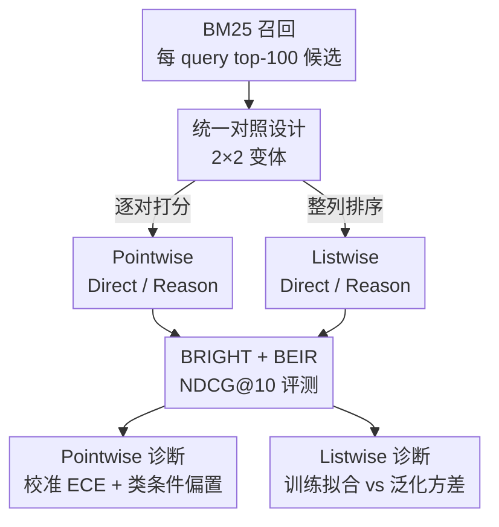

# Rethinking Reasoning in Document Ranking: Why Chain-of-Thought Falls Short

**会议**: ICLR 2026  
**OpenReview**: [https://openreview.net/forum?id=txmqENuRcc](https://openreview.net/forum?id=txmqENuRcc)  
**代码**: https://github.com/EIT-NLP/Direct-Rank  
**领域**: 信息检索 / LLM 推理  
**关键词**: 文档重排, 链式思维, 校准, Pointwise/Listwise, 强化学习

## 一句话总结
这篇论文做了首个系统、公平的对照实验，证明在 LLM 文档重排（reranking）任务里，显式的链式思维（CoT）推理**并不会带来收益**——无论 pointwise 还是 listwise、无论 SFT 还是 RL，直接输出排序的 direct reranker 都稳定地优于加了推理的 reasoning reranker，而且推理还要多花一大笔推理算力。

## 研究背景与动机
**领域现状**：文档重排是信息检索（IR）两阶段架构里的关键一环——先用 BM25 等召回器粗筛出候选集，再用更强的 reranker 精排，把最相关的文档顶到前面，直接决定 RAG、推荐等下游应用的质量。主流有两条范式：pointwise（独立给每个 query–文档对打相关性分数再排序，可并行、高效）和 listwise（把整个候选集一起喂进去、让模型直接输出排序，靠跨文档比较通常更准但更贵）。

**现有痛点**：随着 DeepSeek-R1、OpenAI o1 这类大推理模型（LRM）走红，一批工作想当然地把"先生成一段 CoT 推理、再给排序"的范式搬到 reranking 上，并默认推理能提升排序质量。但这些工作几乎从来没有跟**不带推理的强 baseline** 做过公平比较，所谓"推理有用"的结论大多站不住脚。

**核心矛盾**：CoT 在数学、代码这类任务上确实管用，它能拉近输入和输出的距离、平滑 token 间的跳变；但 reranking 的本质是要么输出一个**校准良好的标量分数**（pointwise），要么输出一个**排列顺序**（listwise），这和"逐步推理"的收益机制未必对得上。已有的零星证据也提示推理会带来"过度思考"、冗长的推理链注入噪声——但这些分析只覆盖了 pointwise + SFT 一个角落，缺乏系统结论。

**本文目标**：在统一、可比的实验设计下，回答一个根本问题——**显式推理到底有没有让 reranking 变好？** 并进一步剖析"如果没用，是哪里出了问题"。

**切入角度**：作者把所有 reranker 统一在 MS MARCO 上训练，reasoning 版本统一用 DeepSeek-R1 生成 CoT，把"pointwise vs listwise × direct vs reasoning × SFT vs RL"全部拉成一张可控对照表，再在推理密集型基准 BRIGHT 和标准 IR 基准 BEIR 上评测，做真正的 apples-to-apples 比较。

**核心 idea**：与其再造一个"会推理的 reranker"，不如用一组严格对照实验**证伪"推理普遍有益"这个假设**，并定位失败的真正根因——pointwise 是分数校准被破坏、listwise 是过拟合训练集而泛化变差。

## 方法详解

### 整体框架
本文不是提出一个新模型，而是搭了一套**控制变量的对照评测框架**来审视"推理对重排是否有用"。整条管线是：固定用 BM25 召回每个 query 的 top-100 候选 → 在统一的 MS MARCO 衍生数据上训练四个 reranker 变体（Direct-Point、Reason-Point、Direct-List、Reason-List），覆盖 SFT 与 SFT+GRPO 两种训练机制、Qwen3-4B/8B 两种规模 → 在 BRIGHT 和 BEIR 上用 NDCG@10 评测 → 最后用三套诊断分析（校准曲线/ECE、类条件 TPR/TNR、训练集拟合 vs 泛化方差）解剖推理为什么会拖后腿。四个变体的唯一区别就是"输出前要不要先生成一段 CoT"，从而把推理的净效果干净地剥离出来。

### 关键设计

**1. 2×2 统一对照设计：把"推理的净效果"干净剥离出来**

以往工作"推理有用"的结论之所以不可信，是因为 reasoning 模型和被比较的 baseline 在 backbone、训练数据、prompt 上都不一致，混淆了变量。本文的核心方法贡献就是消除这些不一致：所有模型都用 Qwen3-4B/8B 作 backbone，统一在 MS MARCO 衍生语料上训练（pointwise 用 RANK1 的约 386k 个 query–passage 对，listwise 用 ReasonRank 的约 13k 个 query–候选集），reasoning 版本的 CoT 一律由 DeepSeek-R1 生成。四个变体只在一处不同：Direct 直接出答案/排列，Reason 先生成推理链 $z_i$ / $Z$ 再出结果。对 pointwise，相关性分数取答案 token 的两路 softmax：$s_i = \frac{\exp(\ell_i[\tau_{\text{TRUE}}])}{\exp(\ell_i[\tau_{\text{TRUE}}]) + \exp(\ell_i[\tau_{\text{FALSE}}])}$；Reason-Point 只是在打分前多生成一段 rationale $z_i$，分数同样从答案 token 的 logits 读出。这样"推理"成了唯一自变量，比较才真正公平。

**2. Pointwise 校准诊断：用 ECE 揭示推理打碎了分数校准**

pointwise reranking 的分数会被当作"模型认为该文档相关的置信度"，因此分数是否**校准良好**（预测 0.9 就该约 90% 真相关）直接决定排序质量。作者用期望校准误差（ECE）来量化偏离：$\text{ECE} = \sum_{m=1}^{M} \frac{|B_m|}{N}\,\bigl|\text{acc}(B_m) - \text{conf}(B_m)\bigr|$，即把样本按预测置信度分桶、统计每桶经验准确率与平均置信度的加权差距，越小越好。结果显示 direct pointwise 虽不完美但置信度与准确率保持清晰的单调关系（ECE = 0.105），而加了推理后系统性过度自信、明显偏离对角线（ECE = 0.151）。也就是说推理并没有提升相关性预测，反而破坏了分数校准，这正是 NDCG 下降的直接原因。

**3. 类条件 TPR/TNR 分析：推理制造了偏向"相关"的假阳性**

为什么校准变差会伤排序？作者做了类条件分析，把训练集 1:2 的正负比例复现到评测池（每 query 100 正 + 200 负），用 TPR（正例召回）和 TNR（特异度 = 1−FPR）拆解错误结构。发现 Reason 模型虽然宏二分类准确率（TPR、TNR 均值）常更高，但收益**全来自 TPR 上升、TNR 下降**——也就是更敢把文档判成"相关"。在负样本占绝大多数的重排场景里，这恰恰是灾难：FPR 升高会把不相关文档顶进排序头部，加上前面的校准失效，二分类准确率的提升根本无法转化成排序指标的提升。这把"推理偏向正类"这个抽象现象落实成了具体的失败机制。

**4. Listwise 拟合-泛化分析：推理只是过拟合训练集，GRPO 能压缩但替代不了直接优化**

listwise 不打标量分、直接优化排列，作者据此追问推理在 listwise 下的真实作用。在 100 条训练样本上比较四个 8B 变体，发现 Reason-List 的训练集 NDCG@10 均值确实更高，但方差也明显更大（Reason-List SFT $82.57 \pm 3.2$ vs Direct-List SFT $80.41 \pm 2.1$；GRPO 下 $87.55 \pm 2.7$ vs $86.93 \pm 1.6$）——CoT 能更好地拟合训练时见过的排列，却带来实例级的不稳定。一到域内（MS MARCO DL19/20）和域外（BRIGHT/BEIR）评测，Direct-List 就全面反超，说明 Reason-List 的训练集优势是"记住了样本"而非真泛化。listwise 用两阶段训练（SFT 学会输出 `<think>…</think>` 与 `<answer>[·]>[·]…</answer>` 结构，再用 GRPO 精炼），其 GRPO 复合奖励 $R_m = \text{NDCG@10} + \phi\cdot\text{Recall@10} + \gamma\cdot\text{RBO}$ 并用格式校验门控（格式有效才给 $R_m$，否则 0 或 −1）。GRPO 把推理链从 397.7 token 压到 172.3 token、既降本又涨点，证明冗长 CoT 并非好排序的前提；但即便缩短了推理，Direct-List 仍泛化更强——短 CoT 只能缓解"过度思考"，替代不了对排列的直接优化。

## 实验关键数据

### 主实验
在 BRIGHT（推理密集型 IR）和 BEIR（标准 IR）上，direct reranker 在各训练设置、各规模下都稳定优于 reasoning 变体（NDCG@10）：

| 基准 | 变体对比 | Direct | Reason | 差距 |
|------|----------|--------|--------|------|
| BRIGHT | Point-4B (SFT) | 25.5 | 16.5 | +9.0 |
| BRIGHT | Point-8B (SFT) | 26.8 | 20.7 | +6.1 |
| BRIGHT | List-8B (SFT+GRPO) | 27.1 | 25.9 | +1.2 |
| BEIR | Point-4B (SFT) | 45.4 | 40.1 | +5.3 |
| BEIR | List-8B (SFT+GRPO) | 41.8 | 39.9 | +1.9 |

而且这些 direct 变体还直接打过了现有 reasoning-enhanced SOTA：BRIGHT 上 Direct-List-8B（27.1）、Direct-Point-8B（26.8）均超过 ReasonRank-7B（26.4）、TFRank-8B（22.6）、Rank-R1-14B（20.5）；BEIR 上 Direct-Point-4B（45.4）超过更大的 Rank-R1-14B（43.8）和 ReasonRank-7B（41.7）。

### 诊断分析

| 诊断 | 关键指标 | 结论 |
|------|---------|------|
| Pointwise 校准 | ECE：Direct 0.105 vs Reason 0.151 | 推理破坏分数校准、系统性过度自信 |
| Pointwise 类条件 | Reason 高 TPR、低 TNR | 偏向正类、抬高 FPR，把不相关文档顶上去 |
| Listwise 训练拟合 | Reason 训练 NDCG 高但方差大（±3.2 vs ±2.1） | 过拟合训练集、实例级不稳定 |
| Listwise 域内泛化 | Direct-List-4B DL19 73.77 vs Reason 70.76（+3.01） | 训练集优势不迁移到域内/域外 |
| GRPO 效果 | 推理链 397.7 → 172.3 token，且涨点 | 长 CoT 非必要，但短 CoT 仍替代不了直接优化 |

### 关键发现
- 推理在 pointwise 上的危害**不是推理能力不够，而是分数校准被打碎**——所以未来的解法该是校准感知的训练目标，而非更长更复杂的推理。
- listwise 上 Reason 的"训练集更高分"是**过拟合假象**：方差更大、域内域外全面落后于 Direct。
- GRPO 一举两得：既提升性能又把过长推理链砍掉一半还涨点，说明"过度思考"是可被奖励设计直接抑制的。
- pointwise gap（最高 +9.0）远大于 listwise gap（约 +0.3~+1.9），暗示标量打分对"推理引入的噪声/校准偏移"更敏感。

## 亮点与洞察
- **把"推理有没有用"做成可证伪的对照实验**：唯一自变量是"要不要 CoT"，其余全部对齐，这种严谨设计本身就是最有说服力的贡献，比再造一个模型更有价值。
- **失败根因定位得很具体**：不止说"推理没用"，而是给出 pointwise=校准失效+True 偏置、listwise=过拟合+高方差两条清晰机制，可直接指导后续改进方向（校准感知打分 / 目标对齐的简洁推理）。
- **"GRPO 缩短推理链反而涨点"** 这个反直觉结果很有迁移价值：在排序这类有明确度量的任务上，奖励设计可以同时治"过度思考"和"效果"，提示其他 RL+CoT 任务也该审视推理长度是不是冗余。

## 局限与展望
- 结论限定在"当前 logits-based pointwise 与生成式 listwise 的设置"下；作者也明确说这不否定推理在别的 reranking 形式（如 token-based scoring）里可能有用，存在范式依赖。
- backbone 只覆盖 Qwen3-4B/8B，未验证更大模型或非 Qwen 家族是否会改变趋势。
- listwise 的训练集拟合方差分析只用了 100 条样本，规模偏小；推理链长度与方差的因果关系还可以更细地拆。
- 作者给出的两条出路——pointwise 的校准感知打分、listwise 的简洁/目标对齐推理——目前只是方向，尚无落地方案。

## 相关工作与启发
- **vs Rank1 / TF-Rank（reasoning pointwise）**：它们默认 CoT 提升 pointwise 重排，本文用同源数据公平复现后发现 Direct-Point 反而稳定更强，把"推理有益"证伪。
- **vs ReasonRank / Rank-R1 / REARank（reasoning listwise）**：这些是 reasoning-enhanced listwise SOTA，本文的 Direct-List 在去掉推理的情况下就追平甚至超过它们，说明显式推理对达到 SOTA 并非必要。
- **vs 过度思考（overthinking）相关研究**：以往观察限于 pointwise+SFT，本文把分析系统性扩展到 pointwise/listwise × SFT/RL，并用 GRPO 把推理链压缩量化，给"长 CoT 是噪声"提供了更完整的证据。

## 评分
- 新颖性: ⭐⭐⭐⭐ 不是新模型而是高质量的"反共识"系统研究，视角和结论都很有价值
- 实验充分度: ⭐⭐⭐⭐⭐ 2×2 变体 × 两训练机制 × 两规模 × 两基准 + 三套诊断，覆盖全面
- 写作质量: ⭐⭐⭐⭐ 逻辑清晰、失败机制讲得透，公式与表格自洽
- 价值: ⭐⭐⭐⭐⭐ 直接纠偏"推理普遍有益"的流行假设，并指明校准/目标对齐这两个真瓶颈

<!-- RELATED:START -->

## 相关论文

- [\[ICLR 2026\] Long-Document QA with Chain-of-Structured-Thought and Fine-Tuned SLMs](long-document_qa_with_chain-of-structured-thought_and_fine-tuned_slms.md)
- [\[ICLR 2026\] Retro*: Optimizing LLMs for Reasoning-Intensive Document Retrieval](retro_optimizing_llms_for_reasoning-intensive_document_retrieval.md)
- [\[ICLR 2026\] Tools Are Under-Documented: Simple Document Expansion Boosts Tool Retrieval](tools_are_under-documented_simple_document_expansion_boosts_tool_retrieval.md)
- [\[ICLR 2026\] G-reasoner: Foundation Models for Unified Reasoning over Graph-structured Knowledge](g-reasoner_foundation_models_for_unified_reasoning_over_graph-structured_knowled.md)
- [\[ICLR 2026\] RefTool: Reference-Guided Tool Creation for Knowledge-Intensive Reasoning](reftool_reference-guided_tool_creation_for_knowledge-intensive_reasoning.md)

<!-- RELATED:END -->
