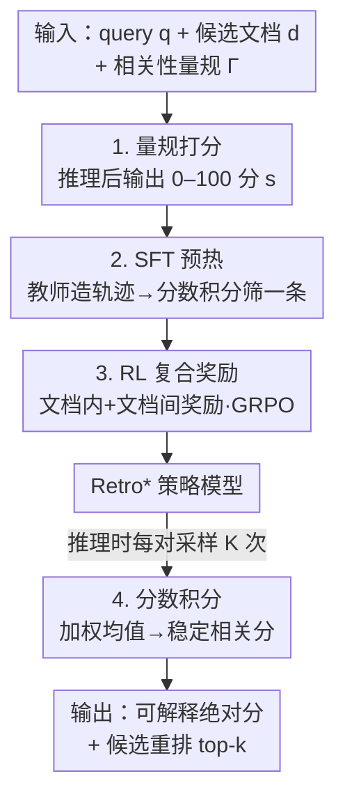

# Retro*: Optimizing LLMs for Reasoning-Intensive Document Retrieval

**会议**: ICLR 2026  
**OpenReview**: [https://openreview.net/forum?id=0WGl8PNMSA](https://openreview.net/forum?id=0WGl8PNMSA)  
**代码**: https://github.com/VectorSpaceLab/agentic-search/tree/main/Retro-star  
**领域**: 信息检索 / 推理增强 IR / LLM 重排  
**关键词**: 推理密集检索, 评分量规, 测试时扩展, 强化学习, 复合奖励

## 一句话总结
Retro* 把"判断 query 和文档是否相关"重写成一个 **逐文档（pointwise）、依据明确量规打 0–100 分的推理任务**，再用测试时多次采样取分数积分、以及一套专为分数机制定制的 SFT + RL 训练策略，在推理密集检索基准 BRIGHT 上做到 SOTA，同时因为 pointwise 天生可并行而比 listwise/setwise 方法快很多。

## 研究背景与动机

**领域现状**：在 LLM agent 和 RAG 场景里，检索越来越需要找到"对完成任务有用"的文档——即使文档和任务的关联是间接、隐含的。比如软件工程里要找设计模式相似的程序、数学里要找基于同一定理的不同证明。这类"推理密集型检索"要求模型对 query–文档关系做细粒度推理，而不是简单的语义匹配。

**现有痛点**：近期已有不少推理增强的 IR 方法（zero-shot prompting、从强推理 LLM 蒸馏轨迹、带重排奖励的 RL），但作者指出它们存在三个结构性短板。其一，**缺少相关性度量功能**：大多数方法只给出相对排序，给不出"到底有多相关"的绝对分数，而很多 RAG 下游需要一个可解释、可设阈值过滤的绝对相关度。其二，**测试时扩展僵硬**：现有方法多是生成单条长推理就给答案，没有利用"探索并融合多条推理路径"来提升可靠性。其三，**并行能力受限**：listwise/setwise 方法必须顺序处理整个候选集，候选一多延迟就爆炸。

**核心矛盾**：推理密集检索同时要求"细粒度推理"和"可度量、可扩展、可并行"，但现有的 listwise/setwise 排序范式把这三者绑死了——为了做相对排序就得序列化处理，既给不出绝对分，也难以并行和叠加多轨迹。

**本文目标**：设计一个既能输出可解释绝对相关分、又支持灵活测试时扩展、还天然高并行的推理检索模型。

**切入角度**：作者把问题从"对候选集排序"换成"对每个 query–文档对独立打一个有明确含义的相关分"。一旦相关性变成 pointwise 的打分任务，绝对度量、并行、以及"多次采样融合"就都自然成立了。

**核心 idea**：引入**基于量规（rubric）的相关性打分**——用显式定义的评分准则引导 LLM 推理后输出 0–100 的整数分，配合分数积分做测试时扩展，并用一套针对打分机制定制的复合奖励 RL 来优化。

## 方法详解

### 整体框架

Retro* 的运行单元是一个三元组输入：query $q$、候选文档 $d$、以及相关性量规 $\Gamma$；模型 $\text{Retro}^*(\Gamma, q, d) \to (y, s)$ 输出一条推理轨迹 $y$ 和一个 0–100 的相关分 $s$。整个方法可分成"打分机制 + 测试时扩展"两个推理侧设计，和"SFT 预热 + RL 优化"两个训练侧设计：量规打分是贯穿训练与推理的底座；训练阶段先用强教师模型造数据做 SFT 预热，再用复合奖励（文档内 + 文档间）做 GRPO 强化；推理阶段对每个 query–文档对多次采样、用分数积分得到更稳的最终分，再据此重排。

### 关键设计

**1. 量规打分：把相关性判断变成有明确含义的 0–100 打分**

现有方法只能给相对排序、给不出"有多相关"，Retro* 用一套相关性量规 $\Gamma$ 来补这个缺口。$\Gamma$ 由两部分组成：一是 **Relevance Definition**，用一个 `[Relevance Placeholder]` 让用户声明本次检索的具体意图（例如"文档相关当且仅当它用到的定理能为解 query 的数学题提供有用启发"）；二是 **Scoring Criteria**，把 0–100 分划成五个可解释区间（80–100 高度相关 / 60–80 相关 / 40–60 中等 / 20–40 略相关 / 0–20 不相关）。模型按固定流程推理——先做 Query Analysis（这个 query 需要什么信息）、再做 Document Analysis（文档提供了什么）、最后给出 Relevance Annotation，把整数分包在 `<score>...</score>` 里。这样每个 query–文档对都得到一个**绝对、可解释、可设阈值过滤**的相关分，而不是只能比大小的排序位次；并且因为是逐对（pointwise）独立打分，候选之间互不依赖，为后面的高并行和多轨迹融合打下基础。

**2. 分数积分：用多条推理轨迹的加权均值做测试时扩展**

单条推理给出的分数会抖动。Retro* 对每个 query–文档对采样 $K$ 次，得到一组轨迹与分数 $\{(y_1, s_1), \dots, (y_K, s_K)\}$，然后做分数积分而不是多数投票。作者指出多数投票只适合高度离散的输出，在 0–100 连续分上要稳就得采样到天文数字、不实际。于是用一个简单有效的加权均值：

$$\bar{s} \leftarrow \frac{\sum_K w_i \cdot s_i}{\sum_K w_i}$$

权重 $w_i$ 可取轨迹的生成似然；似然不可得或为简单起见就用均匀权重 $w_i = 1/K$（论文记为 mean-score@k）。多条轨迹融合后得到更可靠稳定的相关度估计——这就是"测试时扩展"在打分机制下的自然形态：不靠单条长思维一锤定音，而靠多条独立推理取平均。

**3. SFT 预热：用强教师 + 分数积分筛选造出简洁高质的冷启动数据**

直接上 RL 不稳，模型也缺基本推理能力，所以先做 SFT 预热，关键在 Training Data Curation 两步。**Data Sourcing**：拿一批 $(q,d)$ 对，让强教师模型 $T$（Qwen3-235B-A22B）按量规推理 $T(\Gamma, q, d) \to (y, s)$，并显式要求把思维控制在 512 token 以内，逼出简洁结构化的推理。**Data Filtering**：对每个对从教师采样 $K$ 次，先用分数积分算出参考分 $\bar{s}$，再**只保留分数离 $\bar{s}$ 最近的那一条轨迹**作为该对的训练样本，得到 $\{(q,d,\hat{y},\hat{s})\}$。这一步用积分分数当"自洽参考"来挑最具代表性的轨迹，让 SFT 既学到基本打分推理能力，又把模型塑造成"先输出简洁规整的思维再打分"的风格，为 RL 稳定收敛铺路。

**4. RL 复合奖励：文档内奖准、文档间奖序，一份样本两头压榨**

Retro* 要同时做好两件事——给单个文档打准绝对分、给一组候选排对相对序——所以 RL 用一个复合奖励把这两件事一起优化，并充分利用每个样本 rollout 出的全部轨迹。**文档内奖励（Intra-Document）**针对打分准确性：对同一 $(q,d)$ rollout $N$ 条轨迹，以积分分 $\bar{s}$ 为参考，离 $\bar{s}$ 最近的轨迹给 $+1$、最远的给 $-1$、其余给 $0$，并加阈值 $\tau$ 约束（要求 $\bar{s}$ 与最远偏离分之间有最小间隔），把"所有轨迹本就高度一致"的平凡样本剪掉：

$$R_{\text{intra}}(y, s) = \begin{cases} +1 & s\ \text{离}\ \bar{s}\ \text{最近且}\ \tau\ \text{约束成立} \\ -1 & s\ \text{离}\ \bar{s}\ \text{最远且}\ \tau\ \text{约束成立} \\ 0 & \text{其他} \end{cases}$$

**文档间奖励（Inter-Document）**针对排序正确性：对每个 query 各取一个正样本 $d^+$、一个负样本 $d^-$，各 rollout $N$ 条轨迹；正样本某轨迹的奖励是"它的分数压过多少比例的负样本分数"，负样本某轨迹的奖励是"有多少比例的正样本分数压过它"：

$$R_{\text{inter}}(y_i^+, s_i^+) = \frac{1}{N}\sum_{j=1}^{N} \mathbb{I}(s_i^+ > s_j^-), \quad R_{\text{inter}}(y_j^-, s_j^-) = \frac{1}{N}\sum_{i=1}^{N} \mathbb{I}(s_j^- < s_i^+)$$

两者用 $\alpha \in (0,1)$ 线性组合成最终奖励 $R(y, s) = \alpha \cdot R_{\text{intra}}(y, s) + (1-\alpha)\cdot R_{\text{inter}}(y, s)$，再用 GRPO 优化。这套奖励的巧妙处在于：它不需要外部标注的"标准分"，而是用模型自己多轨迹的积分分当锚（intra）、用正负样本的相对压制关系当信号（inter），把绝对打分和相对排序两个目标统一进同一份 rollout 里。

### 损失函数 / 训练策略
两阶段：① SFT 预热，每个训练样本从教师采 8 条轨迹、按分数积分筛 1 条训练，BRIGHT 各数据集采 500 query（共 12,000 SFT 样本）；② RL 用复合奖励 + GRPO，各数据集采 1,000 query（共 24,000 样本），每 query 配一正一负文档。骨干模型用 Qwen2.5-7B/32B-Instruct。

## 实验关键数据

### 主实验
BRIGHT 基准（12 个数据集，覆盖科学/数学/编程），所有方法对 BGE-Reasoner-Embed 召回的 top-100 重排，指标 nDCG@10：

| 方法 | 类型 | Avg. nDCG@10 |
|------|------|------|
| BGE-Reasoner-Embed（一阶段召回） | Retriever | 32.5 |
| ReasonRank (7B) | Listwise | 33.5 |
| ReasonRank (32B) | Listwise | 36.6 |
| **Retro* (7B)** | Pointwise | **36.6** |
| **Retro* (32B)** | Pointwise | **38.5** |
| **Retro* (7B), mean-score@16** | Pointwise | **38.7** |
| **Retro* (32B), mean-score@16** | Pointwise | **40.6** |

Retro* (7B) 36.6 超 ReasonRank (7B) 3.1 分；32B 达 38.5、超 ReasonRank (32B) 1.9 分。最亮眼的是：**测试时扩展后的 7B（38.7）反超了未扩展的自家 32B（38.5）**，说明多轨迹积分确实能用算力换性能。换用 BM25 / ReasonIR 作一阶段召回，结论一致（鲁棒）。

### 消融实验
Table 3，训练策略各组件对 Retro* (7B) Avg. nDCG@10 的贡献：

| 配置 | Avg. nDCG@10 | 说明 |
|------|------|------|
| Qwen2.5-7B-Instruct（裸骨干） | 22.9 | 起点 |
| **SFT + RL（复合奖励）** | **36.6** | 完整方法 |
| only-SFT | 30.1 | 只 SFT，掉 6.5 |
| only-RL（复合奖励） | 35.1 | 不预热直接 RL，掉 1.5 |
| SFT + RL（仅 Intra 奖励） | 33.2 | 去掉文档间奖励，掉 3.4 |
| SFT + RL（仅 Inter 奖励） | 30.8 | 去掉文档内奖励，掉 5.8 |

### 关键发现
- **复合奖励缺一不可**：只用 Intra（33.2）或只用 Inter（30.8）都明显弱于复合（36.6），且仅 Inter 比仅 Intra 更差，说明"打准绝对分"的文档内奖励是更基础的信号。
- **SFT 预热与 RL 互补**：only-SFT 30.1、only-RL 35.1，组合后 36.6——RL 是涨点主力，但 SFT 预热仍带来约 1.5 分的稳定增益。
- **双重可扩展性**：模型从 3B→7B→32B（单样本）为 32.4→36.6→38.5；测试时采样 1→16 让 7B 从 36.6 升到 38.7，两条扩展曲线在各规模上都成立。
- **并行高效**：pointwise 让 Retro* 在候选数增长时推理时间增长远慢于 setwise 的 Rank-R1 和 listwise 的 ReasonRank。
- **分数可分性**：相比 RankLLaMA（正负文档分数严重混叠）和 Rank1（仍有大量负文档拿高分），Retro* 的正负文档分数分布有清晰可分的间隔，可设阈值过滤。

## 亮点与洞察
- **范式切换最值钱**：把"对候选集排序"换成"逐对按量规打绝对分"，一举解锁可解释绝对度量、高并行、多轨迹融合三件事——一个设计同时解决了三个痛点。
- **用模型自己的多轨迹积分当奖励锚**：Intra 奖励不需要人工标注标准分，而是拿同一对多次 rollout 的积分分当参考，离它近的奖、远的罚，是一种自监督式的"自洽奖励"，可迁移到其他需要稳定数值输出的打分任务。
- **测试时扩展能换规模**：7B + 16 采样反超 32B 单样本，给出了"小模型 + 多采样"对"大模型 + 单采样"的实用替代路径。

## 局限与展望
- 量规需要用户为每个检索意图显式声明 Relevance Definition，跨任务迁移时这部分要人工设计，自动化程度有限。
- 测试时扩展靠多次采样换性能，会增加推理成本；虽然 pointwise 可并行缓解延迟，但总算力开销随 $K$ 线性上升。
- 训练数据来自 BGE-Reasoner-Data 的合成 query，域外泛化（如 R2MED 生物医学、BEIR 传统 IR）作者放在附录验证，正文主结论主要在 BRIGHT 上，泛化边界仍需更多场景检验。
- 奖励里的阈值 $\tau$、组合系数 $\alpha$ 等超参对训练稳定性的影响在正文只略述（附录分析），实际复现可能需要调参。

## 相关工作与启发
- **vs listwise/setwise 方法（RankZephyr / Rank-R1 / ReasonRank）**：它们做相对排序、必须序列处理整个候选集，给不出绝对分且并行差；Retro* 用 pointwise 量规打分，绝对可解释 + 高并行，候选多时效率优势明显。
- **vs pointwise 打分基线（RankLLaMA / Rank1 / JudgeRank）**：RankLLaMA/Rank1 虽也出绝对分，但基于 logit/概率、缺可解释含义且正负分布混叠；Retro* 用显式量规 + 推理输出 0–100 分，分布可分、可设阈值。
- **vs 推理增强 IR 的单轨迹范式**：现有方法多生成单条长思维即给答案；Retro* 把"探索并融合多条推理路径"通过分数积分落到打分机制上，既提稳定性又提供了测试时扩展的旋钮。

## 评分
- 新颖性: ⭐⭐⭐⭐⭐ 把推理检索重构为 pointwise 量规打分，一个设计同时拿下可度量/可扩展/可并行三个痛点
- 实验充分度: ⭐⭐⭐⭐⭐ BRIGHT 12 数据集 SOTA + 多骨干/多召回器/双重扩展/并行/分数分布消融完整
- 写作质量: ⭐⭐⭐⭐ 动机三短板与设计一一对应，公式清晰；部分泛化结论压在附录
- 价值: ⭐⭐⭐⭐⭐ 给 RAG/agent 检索提供了可解释绝对相关分 + 小模型多采样换性能的实用范式

<!-- RELATED:START -->

## 相关论文

- [\[ACL 2026\] ReasonEmbed: Enhanced Text Embeddings for Reasoning-Intensive Document Retrieval](../../ACL2026/information_retrieval/reasonembed_enhanced_text_embeddings_for_reasoning-intensive_document_retrieval.md)
- [\[ICLR 2026\] MRMR: A Realistic and Expert-Level Multidisciplinary Benchmark for Reasoning-Intensive Multimodal Retrieval](mrmr_a_realistic_and_expert-level_multidisciplinary_benchmark_for_reasoning-inte.md)
- [\[ICLR 2026\] Rethinking Reasoning in Document Ranking: Why Chain-of-Thought Falls Short](rethinking_reasoning_in_document_ranking_why_chain-of-thought_falls_short.md)
- [\[ICLR 2026\] Frustratingly Simple Retrieval Improves Challenging, Reasoning-Intensive Benchmarks](frustratingly_simple_retrieval_improves_challenging_reasoning-intensive_benchmar.md)
- [\[ICLR 2026\] RefTool: Reference-Guided Tool Creation for Knowledge-Intensive Reasoning](reftool_reference-guided_tool_creation_for_knowledge-intensive_reasoning.md)

<!-- RELATED:END -->
