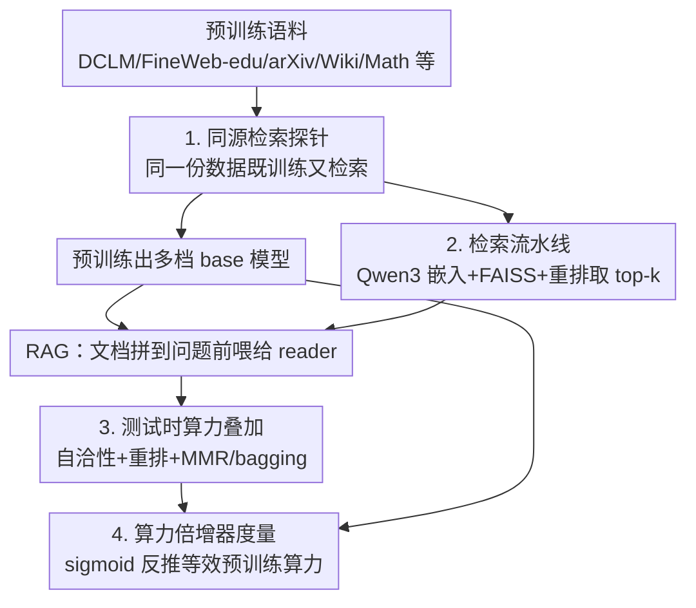

# Reusing Pre-training Data at Test Time is a Compute Multiplier

**会议**: ICLR 2026  
**OpenReview**: [https://openreview.net/forum?id=xUS8SBL5iM](https://openreview.net/forum?id=xUS8SBL5iM)  
**代码**: 无  
**领域**: 信息检索 / 检索增强 / 测试时算力  
**关键词**: 检索增强生成, 预训练数据复用, 测试时算力, 算力倍增器, 自洽性

## 一句话总结
作者把"预训练用过的同一份语料"在测试时再拿来做检索增强，发现这能让 MMLU 上的等效预训练算力翻约 5 倍，说明今天的预训练根本没把数据里的知识榨干；再叠加自洽性、重排、方差缩减等测试时算力，LLaMA 3.1 8B 在 MMLU 上能再涨 10 个点。

## 研究背景与动机
**领域现状**：LLM 的能力主要靠堆预训练算力（scaling law）来涨，研究者也在不断改进架构和数据集质量。但有一个被忽略的问题：预训练这套"机器"到底从数据里提取了多少知识？

**现有痛点**：模型在长尾知识、反转诅咒（"A is B" 学不会 "B is A"）等问题上一直吃力，而且性能随算力呈对数线性增长——越往后，同样的提升要花越来越多的算力。这些瓶颈到底是数据本身不行，还是预训练这种"学习方式"没把数据用足，一直没人量化过。

**核心矛盾**：预训练把语料"压"进参数里是有损的——很多在数据里明明存在的知识，模型并没有真正吸收。但我们缺一个工具去测量"被预训练丢掉的那部分数据价值有多大"。

**本文目标**：① 量化预训练遗漏的数据价值有多少；② 看这个遗漏量如何随模型规模变化；③ 找出哪些测试时算力技术最能把这部分价值捞回来。

**切入角度**：作者的关键观察是——如果用**完全相同的语料**先预训练、再在测试时检索，那么检索带来的任何额外收益，本质上就是"预训练当初没学到、但数据里确实有"的知识。这把"检索增益"变成了一把度量预训练效率的尺子。

**核心 idea**：用"在同源语料上做检索增强 + 测试时算力"作为探针，把检索收益折算成"等效预训练算力倍数"（compute multiplier），从而量化预训练对数据的浪费程度。

## 方法详解

### 整体框架
这篇论文不是提出一个新模型，而是设计了一套**测量实验框架**：同一份预训练语料，既用来训练 base 模型，又用来构建检索库；测试时把检索到的文档拼进上下文做 RAG，并逐步叠加测试时算力技术；最后用一条拟合的 sigmoid 曲线把检索带来的准确率提升，反推成"base 模型要达到同样准确率需要多少倍的预训练算力"。

整条管线分三段：**训练侧**（在语料上预训练出不同算力档位的 base 模型）、**检索侧**（Qwen3 embedding + FAISS 索引 + Qwen3 reranker 取回并排序文档）、**测试时算力侧**（在 RAG 之上叠 self-consistency、重排、MMR/bagging 方差缩减）。三段产出的准确率统一喂给"算力倍增器"分析框架去解读。

### 关键设计

**1. 同源检索探针：用相同语料量化预训练遗漏的知识**

这一步直击"预训练到底浪费了多少数据"这个没人测过的问题。做法极其克制：训练和检索用**完全同一份语料**（DCLM-baseline、FineWeb-edu，加上 arXiv、peS2o、PubMed、Stack Exchange、Wikipedia，以及一批数学源）。逻辑是——既然模型预训练时已经"见过"这些数据，那检索再把它们取回来还能涨分，就只能说明预训练没把这部分知识真正内化进参数。

为了排除"检索其实是偷看了测试集"这种平庸解释，作者做了两件事。其一是**去污染**：对 MMLU 和 Math-500 用 n-gram 重叠把和测试题撞车的文档剔掉，结果去污染后的检索曲线（图 1 红线）仍紧贴全量检索曲线（深蓝线），说明增益不来自污染——顺带量出 14.1% 的 MMLU、32.0% 的 Math-500 题面能在公开预训练语料里找到，警示了"严格去污染评测集"的必要性。其二是控制**数据量**：全量检索让模型见到的数据比预训练多，于是作者额外构造一个"约等于未重复预训练量"的子集来检索；在 MMLU 和 Math-500 上子集检索几乎追平全量检索，说明增益不是靠"多喂数据"堆出来的。SimpleQA 是个例外——它高度依赖 Wikipedia，小模型只见过 Wiki 的一小部分，所以曲线呈分段函数。

**2. 检索流水线：嵌入 + FAISS + 重排的极简取回**

为了让"探针"本身尽量朴素、不引入花哨的检索技巧污染结论，流水线刻意做得很标准。用 Qwen3 Embedding 0.6B 做向量化，FAISS FlatIP 建索引，每个数据集（或分片）各取 top-100，再按相似度分数归并到全局 top-100（等价于把所有数据放同一个索引取 top-100，只是出于算力约束分片处理）。随后用 Qwen3 Reranker 0.6B 对这 100 篇做重排得到最终顺序，最后把相关文档拼接、前置到问题前面，做检索增强生成。

这里"重排"是个独立可叠加的旋钮：实验显示在纯检索之上加 reranker，几乎对所有任务都有稳定增益（如 MMLU All 从 76.6 → 77.7），因为它把真正相关的文档顶到 top-1 附近，让 reader 在有限上下文里读到更对口的材料。

**3. 测试时算力叠加：把检索当工具，再花算力把工具本身磨利**

光检索还不够，作者想知道"如果允许在测试时多花算力，能从同一份数据里再捞出多少知识"。关键洞察是：检索天然适配并行式测试时算力——可以**跨不同检索文档跑多次 trial**，再用自洽性（self-consistency，多次采样取多数投票）聚合答案。在此之上再加两招老技术做**方差缩减（VR）**：MMR（最大边际相关，提升取回文档的多样性）和 bagging（在文档子集上随机化以降低方差）。

这套叠加是层层累加且大体可加性的。以 MMLU All 为例（reader 为 LLaMA 3.1 8B instruct）：baseline 71.6 → 自洽性 75.3 → 检索 76.6 → 重排 77.7 → 重排+自洽 81.0 → 重排+自洽+VR 82.1，合计涨 10.5 个点；Math-500 涨 15.7、GPQA 涨 6.2、SimpleQA 靠重排做到 74.0。作者特意区分了自己和"Deep Research"的不同：自洽性只是并行复制模型而不增强工具；Deep Research 是花算力让模型"用工具用更久"；而本文是花算力去**升级工具本身**（让检索取回的文档更好），是一种数据驱动地投入算力的方式。

**4. 算力倍增器度量：把检索增益翻译成等效预训练算力**

前三步产出一堆准确率，这一步给它们一个可解释的统一标尺。作者对 base 模型的 MMLU 准确率关于 FLOPs 拟合一条有界 sigmoid：

$$y = 0.25 + \frac{0.6907}{1 + \exp\left(-0.7968 \cdot (\log_{10}(x) - \log_{10}(2.48 \times 10^{22}))\right)}$$

其中 $0.25$ 是随机基线、$0.9407$ 是 MMLU 可达上限。给定某个加了检索的模型准确率，就用这条曲线反查"要让纯 base 模型达到这个准确率，得花多少预训练算力"，两者之比即 compute multiplier。结论是：检索平均相当于 **4.86 倍**算力倍增器（几何均值 4.66、中位数 4.74），但这个倍数随规模**递减**——最大档位只剩 2.88x，说明 base 越强、检索的边际收益越被压缩。有趣的是倍数不是单调下降，初期还略有上升，暗示检索也"吃"更好的 base 模型。叠满测试时算力后，整套方法对 baseline 提供至少 11x 的算力倍增。

## 实验关键数据

### 主实验
reader 用 LLaMA 3.1 8B instruct，全部用 CoT 推理，逐步叠加测试时算力：

| 方法 | MMLU All | Math-500 | GPQA All | SimpleQA |
|------|----------|----------|----------|----------|
| Baseline | 71.6 | 48.7 | 30.6 | 1.5 |
| + 自洽性 | 75.3 | 55.9 | 31.4 | N/A |
| + 检索 | 76.6 | 56.7 | 33.2 | 65.7 |
| + 重排 | 77.7 | 56.8 | 34.8 | 74.0 |
| + 重排 + 自洽 | 81.0 | 64.3 | 36.1 | N/A |
| + 重排 + 自洽 + VR | **82.1** | **64.4** | **36.8** | — |

检索与自洽性的收益在几乎所有任务上可加；SimpleQA 是纯事实性基准，自洽性帮不上忙（故标 N/A），但检索+重排把它从 1.5 拉到 74.0。

### 消融实验
算力倍增器随规模递减（MMLU，检索 vs 纯预训练）：

| 预训练算力 (FLOPs) | base MMLU | 检索 MMLU | 算力倍数 |
|------|------|------|------|
| $5.64\times10^{21}$ | 0.487 | 0.606 | 5.28x |
| $1.90\times10^{22}$ | 0.602 | 0.694 | 7.17x |
| $7.04\times10^{22}$ | 0.662 | 0.741 | 4.74x |
| $1.74\times10^{23}$ | 0.711 | 0.778 | 4.23x |
| $7.34\times10^{23}$ | 0.763 | 0.819 | 2.88x |

测试时算力相对 baseline 的等效算力倍数（MMLU All）：自洽 2.10x → 检索 2.78x → 重排 3.56x → 重排+自洽 8.14x → 重排+自洽+VR **11.10x**。

### 关键发现
- **检索对 STEM 比对人文更划算**：MMLU 分类目看，STEM 平均 6.16x、其他 9.27x，而人文只有 2.52x。这反直觉——检索本以为只帮"记忆型"题目，但 STEM（如物理）也大涨（高中物理 +16.9），暗示扩展上下文可能起到"额外计算/处理"的作用，而不只是当存储。
- **检索改变行为弱于扩大模型**：扩大模型规模改变了 39.7% 的 MMLU 答案，加检索只改了 28.1%；说明在检索帮不上的地方，问题更多是"模型忽略了额外上下文"，而非上下文误导——未来可用 prompt 工程或注意力加权让模型更好利用检索内容。
- **更好的预训练数据集 ≠ 更好的检索数据集**：FineWeb-edu 预训练 MMLU（42.9）远逊 DCLM（53.4），但做检索时（75.2 vs 74.5）反而略好，说明"适合预训练"和"适合检索"是两套不同的数据质量标准。
- **抽取与爬取阶段被严重低估**：SimpleQA 上仅仅换一个更好抽取的 Wikipedia 版本（自定义抽取保留了表格/信息框/项目符号）就带来高达 13.6 个点的差距（55.4 → 69.0）；再加 SimpleQA 提供的非 Wiki golden links 又涨 11.5 点到 85.2，说明开源数据集在网页爬取阶段仍有大量可改进空间。
- **文档间自洽性是更强的重排器**：用 self-consistency 给每篇文档单独打分来重排（inter-doc consistency），top-1 质量优于标准 reranker（MMLU All 77.6 vs 73.7），但代价是要对每篇文档多次调用 reader，算力不划算，留待未来蒸馏成高效重排器。

## 亮点与洞察
- **把"检索增益"重新定义成"预训练效率的测量尺"**：最妙的不是用了检索，而是用同源语料把检索收益解释为"预训练丢掉的数据价值"，再用 sigmoid 拟合折算成算力倍数——一个原本工程味的 RAG 实验被升华成对预训练科学的诊断工具。
- **去污染 + 数据量双重对照堵住了平庸解释**：先证明增益不是偷看测试集，再证明不是靠多喂数据，最后才敢说"这是预训练没学透"，论证链条很扎实。
- **测试时算力的可加性与可叠加旋钮设计**：自洽性、重排、MMR、bagging 像积木一样层层叠加且大体可加，每一层都给出独立增益，可直接迁移到任意 RAG 系统当性能调优清单。
- **"花算力升级工具 vs 用工具更久"的区分**很有启发：把测试时算力投到"让检索取回更好文档"，而不是单纯多采样或多轮工具调用，是一个数据驱动、性价比更高的算力投入方向。

## 局限与展望
- 作者承认只探索了**有限的简单测试时技术**和**有限的评测集**；query rewriting、test-time training、检索的强化学习等高级技术很可能进一步提升同一份数据上的表现。
- 算力倍增器的 sigmoid 拟合来自作者自己的预训练设置，套到 LLaMA 3.1 8B（训练 token/参数比高得多、严重 overtrained）上是个近似——作者也说这只能当下界，结论需谨慎外推。
- 不同任务、不同算力档位的倍数不可直接横向比大小（难度与预算不同），文中的 4.86x、11x 等数字都依赖特定拟合与基准，换设置可能漂移。
- SimpleQA 的鲁棒性结论（加无用数据只略微干扰）只在事实性任务上验证过，推理类任务的 scaling 行为可能不同。
- 改进方向具体：让模型更主动利用检索上下文（prompt/注意力加权）、把文档间自洽性蒸馏成高效重排器、以及把检索的算力倍增器与 MoE 的数据利用方式做对比分析。

## 相关工作与启发
- **vs 经典预训练 scaling law（Kaplan / Hoffmann）**: 它们刻画 loss 随算力/数据/参数下降；本文反过来固定同一份数据，刻画"预训练 + 简单检索"的联合 scaling，并把检索折成算力当量，视角从"怎么训得更好"转向"现有数据还剩多少没榨出来"。
- **vs Shao et al. (2024) 扩大 datastore / Lyu et al. (2025) 紧凑子集检索**: 他们关注扩大或精选检索库来提升知识密集任务；本文刻意用"和预训练完全同源"的库，目的不是刷分而是量化预训练的遗漏。
- **vs 测试时算力（Brown / Snell / self-consistency）**: 他们并行采样或顺序迭代模型输出；本文把测试时算力专门投到"升级检索工具本身"（让取回文档更好），并指出这与单纯并行采样、与 Deep Research"用工具更久"是三条不同路线。

## 评分
- 新颖性: ⭐⭐⭐⭐⭐ 把 RAG 重新框定为测量预训练效率的探针，并给出 compute multiplier 这一可解释标尺，视角独到。
- 实验充分度: ⭐⭐⭐⭐⭐ 跨多档算力、多任务、去污染、数据量对照、数据集消融、抽取/爬取案例研究都覆盖到了。
- 写作质量: ⭐⭐⭐⭐ 论证链条清晰、对照设计严谨，少数结论依赖特定 sigmoid 拟合需读者自行甄别。
- 价值: ⭐⭐⭐⭐⭐ 给"预训练没把数据用足"提供了量化证据，对数据集构建（爬取/抽取）和测试时算力两个方向都给出可操作启示。

<!-- RELATED:START -->

## 相关论文

- [\[ACL 2026\] Test-Time Training for Zero-Resource Dense Retrieval Reranking](../../ACL2026/information_retrieval/test-time_training_for_zero-resource_dense_retrieval_reranking.md)
- [\[ICLR 2026\] MetaEmbed: Scaling Multimodal Retrieval at Test-Time with Flexible Late Interaction](metaembed_scaling_multimodal_retrieval_at_test-time_with_flexible_late_interacti.md)
- [\[ICLR 2026\] Robust Test-Time Video-Text Retrieval: Benchmarking and Adapting for Query Shifts](robust_test-time_video-text_retrieval_benchmarking_and_adapting_for_query_shifts.md)
- [\[CVPR 2025\] Advancing Myopia To Holism: Fully Contrastive Language-Image Pre-training](../../CVPR2025/information_retrieval/advancing_myopia_to_holism_fully_contrastive_language-image_pre-training.md)
- [\[ICLR 2026\] Leveraging Data to Say No: Memory Augmented Plug-and-Play Selective Prediction](leveraging_data_to_say_no_memory_augmented_plug-and-play_selective_prediction.md)

<!-- RELATED:END -->
