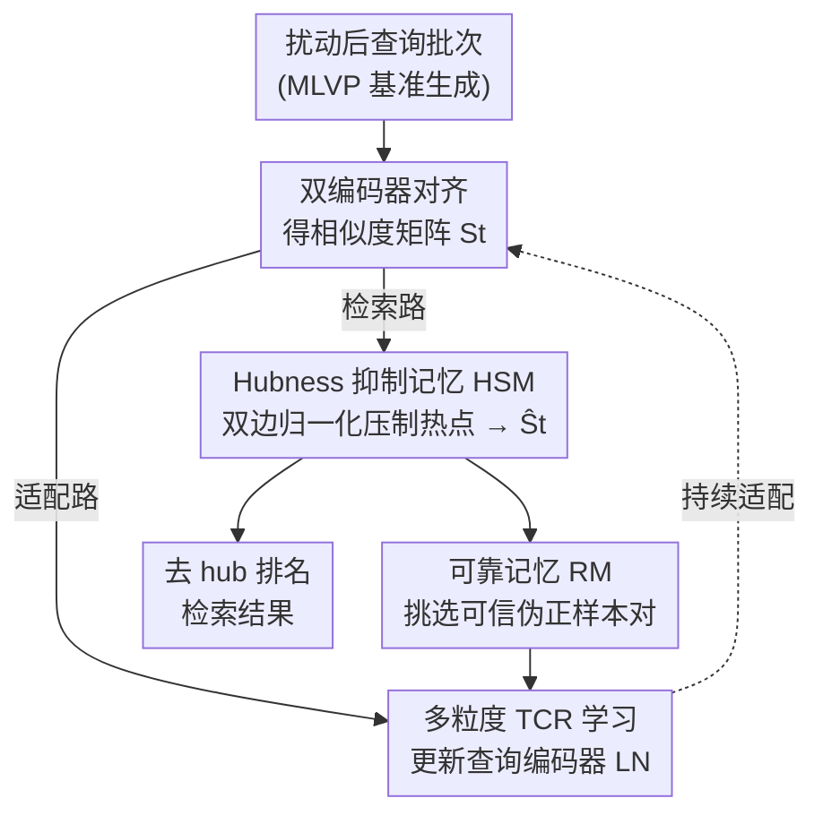

# Robust Test-Time Video-Text Retrieval: Benchmarking and Adapting for Query Shifts

**会议**: ICLR 2026  
**OpenReview**: [https://openreview.net/forum?id=FRkJ3ehpNN](https://openreview.net/forum?id=FRkJ3ehpNN)  
**代码**: https://github.com/bingqingzhang/vtr_tta.git  
**领域**: 视频理解 / 信息检索 / 测试时自适应  
**关键词**: 视频文本检索, 查询偏移, hubness, 测试时自适应, 鲁棒性基准

## 一句话总结
针对视频文本检索（VTR）模型在真实世界查询扰动下急剧崩溃的问题，本文先建了一个含 12 类时空扰动、5 个强度等级的 MLVP 基准，诊断出扰动会放大「hubness」（少数 gallery 视频霸占检索排名）这一根因，再提出测试时自适应框架 HAT-VTR——用 Hubness 抑制记忆（HSM）在相似度层面压制热点、用多粒度损失适配视频时序，在多种查询偏移场景下 Recall@1 平均大幅超过现有 TTA 方法。

## 研究背景与动机
**领域现状**：现代视频文本检索的主流是双编码器架构（CLIP4Clip、X-Pool 等），把视频和文本映射到共享嵌入空间，靠余弦相似度或跨注意力做对齐，在分布内（in-distribution）benchmark 上表现亮眼。

**现有痛点**：这套范式建立在一个脆弱假设上——推理数据与训练数据同分布。现实中这个假设频繁被打破：大雾天驾驶、物体被部分遮挡、网络丢包导致帧错序……这些「查询偏移（query shift）」会让检索精度断崖式下跌。已有的鲁棒性研究全部停留在图文（image-text）领域，比如 TCR 首次为图文查询偏移引入测试时自适应（TTA），但它们只处理静态、帧级的伪影，无法应对视频独有的时空动态扰动。

**核心矛盾**：视频扰动不只破坏单帧外观，还破坏跨帧的时序一致性，这是图像方法的盲区。更关键的是，作者发现查询被扰动后会**放大 hubness 现象**——少数 gallery 视频变成「hub」，被异常多的查询当成最近邻，导致排名被它们垄断。现有 TTA（如 TCR）只能部分缓解这种放大，并非对症下药。

**本文目标**：拆成两个子问题——(1) 缺少一个针对视频时空特性的鲁棒性评测基准；(2) 缺少一个直接对抗放大 hubness 的视频 TTA 方法。

**切入角度**：作者通过 k-occurrence 分布（一个 gallery 项被检索进 top-15 的次数）量化 hubness：干净数据上分布相对均衡，扰动后变成重尾，TCR 只能部分压平。既然 hubness 是失败的根因，那就**直接在相似度分数层面去抑制热点**，而不是泛泛地做表征均匀化。

**核心 idea**：用「Hubness 抑制记忆 + 多粒度时序损失」在测试时双管齐下——一边在相似度空间实时压制被过度命中的 gallery 项，一边把 TCR 的监督信号升级到视频的时序层级，恢复均衡的近邻分布。

## 方法详解

### 整体框架
HAT-VTR 是一个严格在线（online）TTA 框架：模型只在干净数据上训练过，测试时面对未知扰动的查询流，只用无标注的测试数据边推理边适配，且不能回看源训练数据。对每个到来的查询批次，先用双编码器算出查询嵌入 $Z^{Q_b}$ 与离线预存的 gallery 嵌入 $Z^G$，得到相似度矩阵 $S_t = g_\theta(Z^{Q_b}_t, Z^G)$。这个矩阵随即兵分两路并行：

- **适配路**：用多粒度损失 $\mathcal{L}_{total}$（公式 12）只更新查询编码器的 Layer Norm 参数，让表征适配目标域；
- **检索路**：用 HSM 把 $S_t$ 实时精炼成「去 hub」的矩阵 $\hat{S}_t$，再据此排名输出最终结果。

两路之间还有一个可靠记忆 RM（Reliable Memory）做粘合：HSM 精炼后的分数被用来挑选可信的查询-gallery 伪正样本对存入 RM，为适配损失提供稳定的历史目标，防止误差累积与灾难性遗忘。整套方法的评测则建立在新提出的 MLVP 基准之上。

### 关键设计

**1. MLVP 基准与 hubness 诊断：先量化扰动到底破坏了什么**

要研究视频 TTA，先得有一个能逼出视频时空脆弱性的基准。已有的图像鲁棒性基准（如 ImageNet-C）和早期 VTR-C 只是把图像伪影逐帧套上去，没碰到帧间动态。本文的 MLVP（Multi-Level Video Perturbations）把 12 类扰动按三个层级组织、每类 5 个强度，在 MSRVTT、ActivityNet、LSMDC、MSVD、DiDeMo 五个数据集上实例化出 60 个受控场景、8500+ 个扰动视频。三个层级分别针对不同的失败模式：**低层（像素）**——高斯/脉冲噪声、雾、雪、弹性形变、H.264 压缩，关键是跨帧用同一份噪声实现以保持时序一致，区别于独立的图像腐蚀；**中层（物体/运动）**——运动模糊与散焦用帧间运动向量做空间可变的模糊（运动越快的区域越糊），主物体遮挡则先用 Qwen2.5-VL-7B 生成视频描述、再把关键名词喂给 OWLv2 定位并跟踪主物体来遮挡，比随机遮挡更逼真也更难；**高层（语义/时序）**——风格迁移（AdaIN，固定风格图与参数保证时序一致）、事件插入（检索一段语义相近的视频片段拼接进去）、时序打乱（裁剪并重排视频块，模拟丢包乱序）。

基于这个基准，作者用 k-occurrence 分布做诊断：干净数据上分布相对均衡，加噪后骤变为重尾——证实查询偏移会**放大 hubness**，少数视频垄断最近邻排名，这正是性能崩溃的根因，也直接为后面两个组件指明了攻击目标。

**2. Hubness 抑制记忆 HSM：在相似度分数层面直接拆掉热点**

既然 hubness 表现为相似度矩阵里某些 gallery 列被异常多的查询命中，那就在分数上做自适应的双边归一化。HSM 维护一个 FIFO 记忆库 $M_{t-1}$，存最近 $K-1$ 个相似度矩阵，与当前 $S_t$ 拼成聚合矩阵 $\bar{S} = \text{Concat}(S_t, S_{t-1}, \dots, S_{t-K+1})$。在这段历史上算两个权重：gallery 中心权重 $W_{gallery} = \text{softmax}_{col}(\alpha\bar{S})$ 刻画每个 gallery 项在近期查询中的「受欢迎程度」，查询中心权重 $W_{query} = \text{softmax}_{row}(\beta\bar{S})$ 刻画每个查询往少数项扎堆的倾向。最终去 hub 矩阵按平衡系数 $m$ 加权融合：

$$\hat{S} = m(\bar{S} \odot W_{gallery}) + (1-m)(\bar{S} \odot W_{query})$$

其中 $\odot$ 是逐元素积，当前批次的精炼分数 $\hat{S}_t$ 取 $\hat{S}$ 前 $B$ 行。FIFO 队列保证统计始终基于最新数据，便于快速适配。HSM 在 pipeline 里嵌两处：一是 **Hubness 感知的目标选择**——用 $\hat{S}_t$ 而非原始有偏相似度来挑伪正样本、构建 RM，稳住学习不让误差滚雪球；二是 **后验相似度重排**——把 HSM 作用到适配后的分数上产出最终排名，双边重加权压掉 hub 吸引的低共识虚高分、保留高共识匹配，直接提升精度。设计灵感来自 DSL 的分数归一化，但 HSM 是动态、在线、记忆驱动的版本。

**3. 多粒度 TCR 学习：把图文的均匀化监督升级到视频时序层级**

TCR 原本为图文设计，只在全局帧级做表征均匀化，丢了视频的时序结构。本文把它的监督信号拆成三块多粒度损失。**多粒度均匀性损失** $\mathcal{L}_{MGUNI} = \mathcal{L}_{inter} + \mathcal{L}_{intra}$：inter 项把每个查询的全局表征从批均值推开防止坍缩（$\mathcal{L}_{inter} = \frac{1}{B}\sum_i \exp(-\|Z^{Q_b}_i - \bar{Z}^{Q_b}\|^2 / t)$），intra 项把一个视频的帧级特征从其全局表征推开以保留时序多样性。**多粒度跨模态损失** $\mathcal{L}_{MGCM} = \mathcal{L}_{global} + \mathcal{L}_{frame}$：global 把当前批的模态间隙对齐到 RM 里算出的稳定目标间隙（$\mathcal{L}_{global} = (\|\bar{Z}^{Q_b} - \bar{Z}^{G_b}\|^2 - \|\bar{Z}^Q_{RM} - \bar{Z}^G_{RM}\|^2)^2$），frame 则把帧级查询与 gallery 伪正样本的跨协方差对齐到 RM 目标，做到粗细两个粒度都对齐。**噪声鲁棒适配** $\mathcal{L}_{NA}$ 沿用 TCR 的加权熵最小化，自适应权重 $S(p_i) = \max(1 - \eta(p_i)/E_m, 0)$ 把预测熵超过 RM 导出阈值 $E_m$ 的不可靠查询权重清零。总目标 $\mathcal{L}_{total} = \mathcal{L}_{MGUNI} + \mathcal{L}_{MGCM} + \mathcal{L}_{NA}$。对反向的 t2v 任务，均匀性损失省掉 intra-video 项即可。这套损失只更新查询编码器的 LN 参数，开销小但把适配从「帧级均匀」推进到「跨帧时序一致 + 跨模态多粒度对齐」。

### 损失函数 / 训练策略
最终适配目标为 $\mathcal{L}_{total} = \mathcal{L}_{MGUNI} + \mathcal{L}_{MGCM} + \mathcal{L}_{NA}$（公式 12），用 AdamW 只优化查询编码器的 Layer Norm 参数，batch size 16，单张 RTX 4090 即可在线运行。关键超参 $\tau = 0.02$、$t = 10$ 沿用 TCR 以保证公平对比，HSM 的 $(\alpha, \beta, m)$ 设为 $(100, 10, 0.5)$。

## 实验关键数据

### 主实验
评测基于 CLIP4Clip（粗粒度对齐）与 X-Pool（细粒度对齐）两个 VTR 模型，对比 TENT、READ、SAR、EATA 和最相关的 TCR 五个 TTA 基线，覆盖 v2t / t2v 双任务与 QS / QGS 两类偏移。下表为 MSRVTT-1kA、强度等级 5、v2t Recall@1 的平均值（12 类扰动均值）：

| 数据集 / 骨干 | 指标 | HAT-VTR | TCR（次优） | 原始骨干 |
|--------|------|------|----------|------|
| MSRVTT-1kA / CLIP4Clip | v2t R@1 平均 | **26.2** | 21.4 | 17.0 |
| MSRVTT-1kA / X-Pool | v2t R@1 平均 | **30.3** | 24.0 | 20.0 |
| ActivityNet / CLIP4Clip | v2t R@1 平均 | **22.28** | 12.86 | 12.41 |
| MSRVTT-1kA / X-Pool | t2v R@1 平均 | **36.5** | 35.0 | 35.2 |

在更难的 QGS 场景，跨数据集自适应（MSRVTT→ActivityNet，CLIP4Clip）v2t R@1 达 **36.10**（TCR 仅 19.28，甚至低于原始 32.64，说明现有 TTA 会反伤）；零样本自适应（CLIP 直接适配 ActivityNet）v2t R@1 达 **28.92**，远超 TCR 的 18.65。

### 消融实验

| 配置 | v2t / t2v / Avg | 说明 |
|------|---------|------|
| Baseline（无 HSM） | 23.3 / 32.6 / 28.0 | 不用 HSM |
| + 仅目标选择 | 23.6 / 32.8 / 28.2 | HSM 只用于挑伪正样本 |
| + 仅后验重排 | 25.5 / 34.3 / 29.9 | HSM 只用于重排，提升更大 |
| + 两处都用 | **25.8 / 34.5 / 30.1** | 两机制互补 |

| 损失组合 | v2t / t2v / Avg | 说明 |
|------|---------|------|
| 仅 $\mathcal{L}_{inter}$ | 22.6 / 34.1 / 28.3 | 单项均匀性 |
| + $\mathcal{L}_{intra}$ | 23.9 / 34.1 / 29.0 | 加帧级时序多样性 |
| + $\mathcal{L}_{global}+\mathcal{L}_{frame}$ | 25.3 / 34.4 / 29.8 | 加多粒度跨模态对齐 |
| 全部（含 $\mathcal{L}_{NA}$） | **25.8 / 34.5 / 30.1** | 完整损失 |

### 关键发现
- **HSM 的后验重排比目标选择贡献更大**（单用重排 +1.9 Avg，单用目标选择仅 +0.2），但两者互补，合用达最优——直接在输出分数上压 hub 见效最快，而目标选择主要起稳定学习的作用。
- **多粒度损失逐项有效**：从帧级均匀（inter）逐步加到时序多样（intra）、多粒度跨模态对齐、噪声鲁棒熵，Avg 从 28.3 单调升到 30.1，验证「把图文监督升级到视频时序」确有必要。
- **效率代价可接受**：HAT-VTR 每查询 32.27 ms，与 TCR（26.37 ms）、EATA（26.58 ms）同量级；其中反向传播占 65.7%，而核心创新 HSM 仅占 13.0%（4.2 ms），说明鲁棒性增益几乎是「白捡」。
- **方法优势在 hubness 本就不严重的扰动上变小**（如 v2t 的时序打乱、t2v 的回译），反而印证 MLVP 基准足够全面，能暴露这些特定失败模式。

## 亮点与洞察
- **把「性能崩溃」归因到一个可量化的具体现象**：用 k-occurrence 分布把抽象的「鲁棒性差」落地成「hubness 被放大」，再对症设计 HSM——诊断与方法一一对应，是很干净的研究叙事。
- **在分数空间动手而非只动表征**：HSM 直接在相似度矩阵上做双边归一化压热点，几乎零额外训练、可即插即用到任意双编码器 VTR 上，这个「后验重排」思路可迁移到任何受 hubness 困扰的检索系统。
- **基准构建里的工程巧思**：主物体遮挡用 VLM 生成 caption→抽名词→开放词表检测器定位跟踪，造出语义关键的遮挡而非随机遮挡；低层扰动跨帧共享同一份噪声实现以保时序一致——这些细节让基准真正贴合「视频」而非「逐帧图像」。

## 局限与展望
- 作者承认在 hubness 本身较弱的扰动（时序打乱、回译）上优势收窄，说明方法的收益强依赖于「扰动确实放大了 hubness」这一前提，对其他类型的退化（如纯语义漂移）未必同样有效。
- 评测虽覆盖五个数据集，但 HSM 的双边归一化引入 $\alpha,\beta,m$ 三个超参，论文靠两数据集趋势一致来论证稳定性，跨更多域时是否需重调仍是开放问题。
- 框架只适配查询编码器的 LN 参数、gallery 假定离线预存，对 gallery 也实时变化或资源极受限的边缘部署场景，HSM 的记忆库维护成本与实时性还需进一步验证。

## 相关工作与启发
- **vs TCR（最相关）**：TCR 首创图文查询偏移的 TTA，靠表征均匀化，但只处理静态帧级伪影。本文把它的监督升级为多粒度时序损失，并额外加 HSM 在分数层面压 hub；在跨数据集 QGS 上 TCR 甚至反伤性能（19.28 < 原始 32.64），HAT-VTR 则稳定提升。
- **vs TENT / SAR / EATA 等通用 TTA**：这些方法靠熵最小化适配分类模型，未针对跨模态检索与 hubness，迁到 VTR 后收益有限甚至负向；本文证明检索任务的失败模式（hubness）需要专门的分数级干预。
- **vs VTR-C 等鲁棒性基准**：早期 VTR-C 只是逐帧套图像伪影，MLVP 则显式针对帧间动态属性，且首次为「系统比较 TTA 方法」而设计。
- **vs 数据驱动的风格鲁棒（多风格训练）**：那类方法需预建风格数据集、对已知风格集鲁棒；本文是纯在线 TTA，只在干净数据上训练、靠无标注测试流即时适配未知偏移，无需任何预建数据。

## 评分
- 新颖性: ⭐⭐⭐⭐⭐ 首个视频 VTR 时空鲁棒性基准 + 把崩溃归因到 hubness 放大并对症设计 HSM，诊断与方法闭环漂亮。
- 实验充分度: ⭐⭐⭐⭐⭐ 两骨干、五数据集、QS/QGS 双场景、v2t/t2v 双任务、完整消融与效率分析，覆盖全面。
- 写作质量: ⭐⭐⭐⭐ 叙事清晰、动机与方法对应紧密，公式与 pipeline 表述到位，符号略密集。
- 价值: ⭐⭐⭐⭐ 提供可复用的鲁棒性基准与即插即用的分数级去 hub 模块，对真实世界 VTR 部署有直接意义。

<!-- RELATED:START -->

## 相关论文

- [\[ICLR 2026\] MetaEmbed: Scaling Multimodal Retrieval at Test-Time with Flexible Late Interaction](metaembed_scaling_multimodal_retrieval_at_test-time_with_flexible_late_interacti.md)
- [\[ICLR 2026\] Reusing Pre-training Data at Test Time is a Compute Multiplier](reusing_pre-training_data_at_test_time_is_a_compute_multiplier.md)
- [\[ACL 2026\] Test-Time Training for Zero-Resource Dense Retrieval Reranking](../../ACL2026/information_retrieval/test-time_training_for_zero-resource_dense_retrieval_reranking.md)
- [\[ICLR 2026\] LightRetriever: A LLM-based Text Retrieval Architecture with Extremely Faster Query Inference](lightretriever_a_llm-based_text_retrieval_architecture_with_extremely_faster_que.md)
- [\[ICLR 2026\] RAEE: A Robust Retrieval-Augmented Early Exit Framework for Efficient Inference](raee_a_robust_retrieval-augmented_early_exit_framework_for_efficient_inference.md)

<!-- RELATED:END -->
