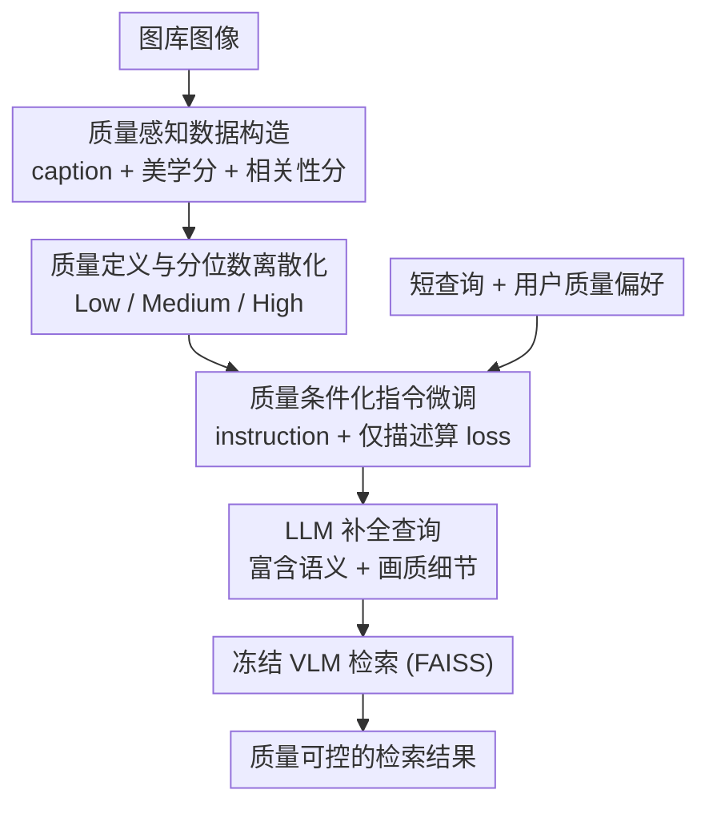

# Seeing Through Words: Controlling Visual Retrieval Quality with Language Models

**会议**: ICLR 2026  
**OpenReview**: [https://openreview.net/forum?id=yOEmEXmbV8](https://openreview.net/forum?id=yOEmEXmbV8)  
**代码**: https://github.com/Jianglin954/QCQC  
**领域**: 信息检索 / 多模态VLM  
**关键词**: 文本到图像检索, 查询补全, 质量可控检索, 语言模型, 美学评分

## 一句话总结
针对短查询（如「a dog」）在文本到图像检索里语义模糊、无法控制画质的问题，本文提出 QCQC：用一个生成式语言模型把短查询补全成富含细节的描述，并以离散化的「相关性 + 美学」质量等级作为条件，让用户能把检索结果朝指定质量档位（低/中/高）引导，且对任意冻结 VLM 即插即用。

## 研究背景与动机
**领域现状**：文本到图像检索（T2IR）目前主流靠 VLM（CLIP/CoCa/BLIP 等）把文本和图像编码到同一空间，按余弦相似度取 top-k。大规模图文预训练让跨模态对齐越来越强，benchmark 成绩亮眼。

**现有痛点**：真实场景里用户查询往往只有一两个词，极短且欠规约。这带来三个具体毛病——① **语义模糊**：几个词能对应一大片图像，搜索子空间又大又散，结果不够区分；② **语义碰撞**：短查询会让视觉差异巨大的图像拿到相近的相似度，排序被搅乱，图库越大越严重；③ **无法控制画质**：系统只按相似度排序，完全忽略美学、相关程度等用户真正在意的维度，最多事后做一遍过滤。

**核心矛盾**：现代 VLM 的表达能力很强，但短查询的信息量根本喂不满它——「VLM 能表达的细粒度」和「用户输入的粗糙程度」之间存在鸿沟。同时，检索质量本身是上下文相关的（艺术生想要有美感的、设计师想要有创意的、买家想要好看且热门的），而传统系统没有任何「朝某个质量维度引导」的旋钮。

**本文目标**：① 把短查询补全成能区分图像细粒度属性（姿态、场景、动作、美感）的长描述；② 让补全过程「质量可控」，用户能指定要低/中/高质量的结果。

**切入角度**：作者发现短查询占据嵌入空间里一片很宽的区域，这片区域里其实混着各种画质的图像；只要给合适的条件，就能把这片区域切成一个个「感知上不同」的子集，从而做到细粒度的质量感知检索。关键观察是：把短查询「补长」等价于在相似度矩阵上做一次结构化扰动，理论上能提高得分矩阵的秩，让排序具备更精细的区分能力。

**核心 idea**：把生成式 LLM 当作「查询补全函数」，并用从相关性/美学评分模型导出的离散质量等级作为生成条件——用一句话说就是「让语言模型按用户指定的质量档位，把短查询写成带画质偏好的长描述，再丢给冻结 VLM 检索」。

## 方法详解

### 整体框架
QCQC（Quality-Conditioned Query Completion）把「质量可控检索」拆成一条离线建库 + 在线补全检索的流水线。核心要解决的是：短查询信息太少、又没有控制画质的入口。方法的整体转法是——先在离线阶段为图库每张图打上「描述 + 美学分 + 相关性分」三件套，把连续分数按分位数离散成「低/中/高」质量等级，拼成带质量条件的指令数据；再用这套数据微调一个小语言模型，让它学会「给定质量条件 → 生成对应画质的查询补全」；在线阶段，用户的短查询加上偏好的质量条件喂给这个 LLM，补全成长描述，最后交给**完全冻结**的 VLM 用 FAISS 检索。整条链路里只训练 LLM，caption 模型、美学评分器、检索 VLM 全部沿用预训练权重不动，因此对任意 VLM 即插即用。

### 关键设计

**1. 质量感知的数据构造：给每张图配齐「描述 + 美学分 + 相关性分」三件套**

要让补全函数「了解这个图库」，光给它喂图像描述不够——它必须知道哪些描述对应高/低质量的图。本文为图库 $I$ 的每张图 $I_i$ 离线构造三个互补标注：用 caption 模型生成一句简短描述 $T_i = \mathrm{CAP}(I_i)$；用预训练美学评分器打美学分 $s^a_i = \mathrm{EVA}(I_i)$，分越高视觉越好看；以及一个相关性分 $s^r_i = \cos(f(I_i), g(T_i))$，即图像特征和它自己描述的特征之间的余弦相似度，衡量「图文语义是否一致」。这三件套把「这张图长什么样、好不好看、和描述贴不贴」全部显式化，构成后续把质量信号注入语言模型的原料。质量维度是开放的——只要有可靠的评分模型，interestingness、热门度等都能照此接入，本文先落地相关性与美学两维。

**2. 分位数离散化：把连续质量分切成用户友好的「低/中/高」档位**

连续的美学/相关性分数对用户不直观，也没法直接当生成条件。本文把每一维分数向量按分位数离散成三个等级：

$$l(r_i) = \begin{cases} \text{Low}, & r_i \le \mathrm{perc}(r, p_1) \\ \text{High}, & r_i > \mathrm{perc}(r, p_2) \\ \text{Medium}, & \text{otherwise} \end{cases}$$

其中 $\mathrm{perc}(r, p)$ 是分数分布的第 $p$ 百分位，实验取 $p_1=33, p_2=66$ 把分布三等分。这一步是「可控」的关键：连续分被切成感知上互不重叠的区间后，每条描述就和一个明确的质量条件绑定，语言模型才有可学的「不同质量档位 → 不同措辞」的映射。框架天然支持任意档数，论文在消融里给了五档（VL/L/M/H/VH）的更细粒度版本。值得注意的是，图库里高质量和低质量图都偏少，导致任意两个随机子集的平均分非常接近——这正说明「按分位数显式切档」比「指望模型自己感知质量差异」更靠谱。

**3. 质量条件化的指令微调：用一句模板指令把画质偏好注入生成**

有了离散质量标签，本文为每张图设计一条极轻量的指令：

`"Relevance: l(s^r_i), Aesthetic: l(s^a_i), Query: "`

把这条携带质量条件的指令 $P_i$ 和图像描述 $T_i$ 拼接，用标准自回归 next-token 预测损失训练 LLM，且**损失只在描述（和结束符）的 token 上计算，指令 token 不计 loss**——这样模型被逼着学「读到给定的相关性/美学档位后，该续写出什么样画质的描述」，而不是去记忆指令本身。推理时把同样格式的指令拼到测试查询后面，填入用户想要的质量组合（如「high relevance, high aesthetic」），模型就生成对应档位的补全查询，再交给冻结 VLM 检索。这套做法相比直接拿通用 LLM（LLaMA-3、GPT-4o）补全的好处是：通用模型不了解这个图库的质量分布，容易生成无关词反而拖累检索，而 QCQC 在图库专属数据上学到了「画质 ↔ 措辞」的对应，既贴库又可控。整套方案保留三个实用优点——**灵活**（不改任何 VLM）、**透明**（补全后的查询人类可读、可挑选）、**可控**（换质量条件即可朝不同画质引导）。

### 损失函数 / 训练策略
仅训练查询补全 LLM（GPT2-1.5B 或 Qwen2.5-0.5B），目标是描述 token 上的自回归 next-token 交叉熵；caption 模型（CoCa / BLIP2）、美学评分器、检索 VLM（OpenCLIP ViT-H-14）全程冻结。训练前对指令加起始符、对描述加结束符，并清洗 caption 偶发的非英文字符。GPT2-1.5B 用 lr=2e-3、warmup=100、50 epoch、batch=150；Qwen2.5-0.5B 用 lr=2e-5、30 epoch、batch=80。理论上，作者把查询补全建模为对文本嵌入矩阵的结构化扰动 $\Delta = B - A$，在一定条件下证明补全后得分矩阵的秩严格增大 $\mathrm{rank}(S_B) > \mathrm{rank}(S_A)$（命题 1），意味着补全能表达更多独立的打分模式、做更细粒度区分。

## 实验关键数据

### 主实验
两个数据集：自建的 **Flickr2.4M**（从 Openverse 抓的 240 万张 CC0 图，无真实描述）和 **MS-COCO**（11.8 万图、约 60 万人工描述）。评测用 MS-COCO 的 80 个类名当查询，报告检索图像的**平均美学分（Ave Aes）**和**平均相关性分（Ave Rel）**。下表节选 Flickr2.4M 上「美学条件 = High」时不同方法的表现（Qwen2.5 为骨干）：

| 方法 | 可控? | Aes(美学条件=H, 相关条件 L/M/H) | Rel(相关条件 L/M/H) |
|------|:----:|------|------|
| Prefix（仅短查询） | ✗ | 4.735 / 4.735 / 4.735 | 0.350 |
| GPT-4o 补全 | ✗ | 4.791 / 4.816 / 5.056 | 0.361 / 0.357 / 0.361 |
| FT（随机质量分微调，CoCa） | ✗ | 4.821 / 4.905 / 4.770 | 0.365 / 0.364 / 0.365 |
| **Ours（CoCa）** | **✓** | **5.222 / 5.170 / 5.270** | 0.353 / 0.368 / **0.390** |
| **Ours（Blip2）** | **✓** | **5.309 / 5.222 / 5.191** | 0.355 / 0.372 / **0.390** |

关键结论：仅本文方法在「Ctrl?」一列为 √——当把美学条件从 L 调到 H，Ave Aes 单调上升（如 CoCa 版 L≈4.46 → H≈5.27）；把相关条件从 L 调到 H，Ave Rel 也单调上升（0.353 → 0.390）。其它 baseline 各档位分数几乎不动，说明它们补全了查询但**无法按条件控制质量**。

### 消融实验
| 配置 | 现象 | 说明 |
|------|------|------|
| Prefix | 各档位质量都偏低、且恒定 | 不补全 → 短查询信息不足，无控制力 |
| PT（预训练 LLM 不微调） | 多数情况比 Prefix 还差 | 通用模型生成无关词，反而拖累检索 |
| FT（随机质量分微调） | 整体相关/美学有提升，但**不随条件变化** | 微调有用，但随机标签学不到可控性 |
| 五质量档（VL/L/M/H/VH） | 美学分随档位细粒度单调递增（VL≈4.45→VH≈5.28 区间） | 支持更细粒度控制 |
| 后处理重排（先按相关检索 top-k 再按美学重排） | 提 k 能提美学但相关性下降（k=10: Aes 5.31, Rel 0.341） | 两阶段对短查询不可靠，存在相关↔美学 trade-off |

### 关键发现
- **「随机质量标签」是判别可控性的关键对照**：FT 用随机分微调后，相关性/美学的绝对值确实涨了，但完全无法按条件引导——证明可控性来自「真实质量标签 + 离散条件」，而非单纯的微调或查询变长。
- **查询阶段控制 > 检索后过滤**：后处理重排（Table 6）随 k 增大虽能捞到更美的图，却以牺牲相关性为代价（k=1→10，Rel 0.387→0.366）；本文在查询生成阶段就注入质量偏好，能同时守住相关性（k=1 时 Rel 0.387 显著高于 GPT-4o 的 0.361），因为它「知道」图库的质量分布而后处理不知道。
- **跨数据集会掉相关性**：用 Flickr2.4M 微调的模型去补全再在 MS-COCO 检索，美学分仍随条件上升（说明美学线索在自然图像间较通用），但相关性各档都偏低——质量控制模型需要针对目标图库定制。

## 亮点与洞察
- **把「质量」做成查询的可控条件**，而不是检索后的过滤步骤——这是最巧妙的视角转换：短查询的模糊性恰恰留出了可被质量条件切分的嵌入子空间，作者顺势把控制旋钮前移到查询生成阶段。
- **指令模板极简但有效**：一行 `"Relevance:…, Aesthetic:…, Query:"` + 仅在描述上算 loss，就把画质偏好注入了生成，几乎零额外结构成本，且补全结果人类可读可审查。
- **理论支撑接地气**：用「查询补全 = 对得分矩阵做结构化扰动 → 秩增大」解释为什么补长查询能提升区分度，给经验做法一个可证的骨架。
- **即插即用思路可迁移**：只训练一个小补全 LLM、冻结所有 VLM/评分器，这种「在查询侧做条件控制、检索侧完全复用」的范式可推广到其它可控检索维度（热门度、多样性、个性化）。

## 局限与展望
- 作者承认质量维度目前只做了相关性 + 美学，interestingness、多样性、个性化等留作未来工作。
- **数据集依赖性强**：补全模型必须针对目标图库定制，跨库迁移时相关性显著下降，难以做成通用即用的补全器。
- 评测指标本身就是训练所用的美学/相关性评分模型，存在「自我评估」嫌疑——质量分上升一定程度上是在迎合同一个打分器，缺少独立的人类满意度评测来佐证「用户真的更满意」。
- 查询集仅用 MS-COCO 80 类名模拟，真实用户查询更杂乱，泛化性待验证；离散档位用固定分位数（33/66）切，不同图库分布下阈值是否最优也未深究。

## 相关工作与启发
- **vs 通用 LLM 补全（GPT-4o / LLaMA-3）**：它们也能把短查询写长，但不了解目标图库的质量分布，容易生成无关词、无法按质量条件引导；本文在图库专属数据上微调小模型，既贴库又可控，且推理成本远低。
- **vs 检索后处理重排**：重排先按相关性取 top-k 再按美学重排，对短查询不可靠（初始候选集语义太宽、美学偏低，留给重排的空间有限），且提 k 会牺牲相关性；本文把质量控制前移到查询生成，规避了这个 trade-off。
- **vs 朴素 VLM 检索**：朴素方法只取相似度 top-k，忽略美学/相关等用户满意度维度；本文在不改 VLM 的前提下补上了「质量可控」这一缺失能力。

## 评分
- 新颖性: ⭐⭐⭐⭐ 把「质量可控检索」立成新任务，并用质量条件化查询补全优雅落地，视角新。
- 实验充分度: ⭐⭐⭐⭐ 两数据集、多 VLM/LLM/caption 组合、五档与后处理对照齐全；但缺独立人类评测、跨库泛化较弱。
- 写作质量: ⭐⭐⭐⭐ 动机—方法—理论—实验链条清晰，理论分析与定性示例都到位。
- 价值: ⭐⭐⭐⭐ 即插即用、对任意冻结 VLM 友好，对真实检索产品中「短查询 + 画质偏好」场景实用性强。

<!-- RELATED:START -->

## 相关论文

- [\[ICML 2026\] Seeing to Generalize: How Visual Data Corrects Binding Shortcuts](../../ICML2026/information_retrieval/seeing_to_generalize_how_visual_data_corrects_binding_shortcuts.md)
- [\[ACL 2026\] A Picture is Worth a Thousand Words? An Empirical Study of Aggregation Strategies for Visual Financial Document Retrieval](../../ACL2026/information_retrieval/a_picture_is_worth_a_thousand_words_an_empirical_study_of_aggregation_strategies.md)
- [\[ICLR 2026\] Expert Heads: Robust Evidence Identification for Large Language Models](expert_heads_robust_evidence_identification_for_large_language_models.md)
- [\[ICLR 2026\] MLP Memory: A Retriever-Pretrained Memory for Large Language Models](mlp_memory_a_retriever-pretrained_memory_for_large_language_models.md)
- [\[ICLR 2026\] TokMem: One-Token Procedural Memory for Large Language Models](tokmem_one-token_procedural_memory_for_large_language_models.md)

<!-- RELATED:END -->
