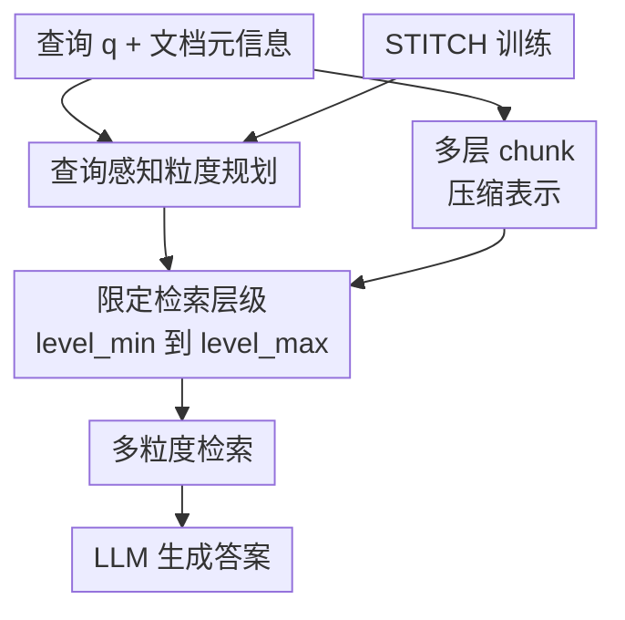

# SmartChunk Retrieval: Query-Aware Chunk Compression with Planning for Efficient Document RAG

**会议**: ICLR 2026  
**OpenReview**: [https://openreview.net/forum?id=Myti1QwL2t](https://openreview.net/forum?id=Myti1QwL2t)  
**代码**: 无  
**领域**: 信息检索 / 文档 RAG / LLM 效率  
**关键词**: 查询自适应检索, chunk 压缩, 文档 RAG, 强化学习规划器, 长文档问答  

## 一句话总结
SmartChunk Retrieval 用一个低延迟 planner 为每个查询选择合适的 chunk 粒度范围，并用轻量压缩编码器直接生成高层 chunk embedding，从而在长文档 RAG 中以更低成本获得接近甚至超过树/图式 RAG 的问答效果。

## 研究背景与动机
**领域现状**：长文档问答里的主流 RAG 系统通常先把文档切成固定长度或固定语义边界的 chunk，再用向量检索取 top-k，最后把这些证据交给 LLM 生成答案。近两年的改进大致分成两条线：一条线优化静态切分，比如 sentence chunk、512-token chunk、sliding window、semantic chunking、late chunking；另一条线构建多层树或图，比如 RAPTOR、MAL RAG、GraphRAG，用更粗粒度的节点承载跨段落或跨章节语义。

**现有痛点**：固定切分的最大问题不是某个 chunk size 不够好，而是没有一个 size 对所有问题都好。抽取式问题可能只需要一句话或一个段落，chunk 太大反而会把答案埋进噪声里；叙事理解、综述型问题或多跳问题需要跨很长的上下文，chunk 太小又会把证据打碎。树/图式 RAG 能缓解这个问题，但往往要对整篇文档递归聚类、摘要、建索引，尤其依赖 GPT 级 summarizer 时，成本和延迟都很高。

**核心矛盾**：长文档 RAG 同时需要细粒度 grounding 和高层语义概括，但这两种需求不是静态属性，而是由 query、文档结构和答案形式共同决定。现有系统要么提前把所有层级都建好，花钱买覆盖率；要么只选一个固定粒度，便宜但容易错过合适证据。

**本文目标**：作者把问题拆成两个子目标：第一，给定查询和文档元信息，预测这次检索应该覆盖的最小与最大 chunk 粒度，避免盲目建完整层级；第二，在确实需要高层 chunk 时，不再每次用大模型生成摘要文本，而是直接从底层 chunk embedding 压缩出高层语义 embedding。

**切入角度**：论文的关键观察是，RAG 的 chunk 粒度选择本身可以被看作一个低成本规划问题。planner 不必回答问题，也不必读完整语料，只要根据 query 和文档元信息判断应该查 sentence、paragraph、section 还是 document 级别的证据；同时，高层 chunk 的主要作用是给 retriever 一个概括语义表示，不一定非要生成可读摘要文本。

**核心 idea**：SmartChunk 用 query-aware planner 控制检索粒度范围，再用 embedding-level compressor 替代昂贵的 LLM 摘要，把“按需多粒度检索”从重型树式 RAG 变成一个更轻的可部署模块。

## 方法详解

### 整体框架
SmartChunk 保留 vanilla RAG 的 retriever 和 generator，只在检索前增加两个模块：planner $P$ 和 Chunk Compression Encoder $E$。给定查询 $q$ 与文档集合 $D$，planner 先预测需要考虑的 chunk level 下界和上界 $(level_{min}, level_{max})$；与此同时，压缩编码器把底层 chunk 聚合成多层 embedding 表示；随后 retriever 只在 planner 选中的层级范围内检索，generator 用检索到的证据生成答案。

这个流程的重点是“先计划再检索”。系统不是为每个 query 都构建完整 chunk 树，也不是把所有层级一股脑丢给 retriever，而是把候选空间限制在“足够回答问题、又不过度膨胀”的粒度区间里。

形式上，文档被表示成多层 chunk hierarchy $H(D)$，每个 chunk 都有一个 level，例如 sentence、paragraph、section、document，或按 token span 的 128、256、512、1024 等粒度。planner 输出 $P(q, MetaData(D)) = (level_{min}, level_{max})$，候选集合被限制为 $C = \{c \in H(D) \mid level(c) \in [level_{min}, level_{max}]\}$。这样，检索策略 $\pi$ 的目标不只是提高答案正确率，也要降低 token、API 费用和延迟。

### 关键设计
**1. 查询感知粒度规划：把 chunk size 从静态超参变成每个问题的决策**

SmartChunk 的 planner 解决的是固定 chunking 最核心的失配问题：不同查询真正需要的上下文尺度不同。比如 QASPER 里问“embedding quality 如何评估”这类问题，答案可能集中在一句话或一段方法描述里；NarrativeQA 里问角色为何改变想法，则需要跨越整篇故事整合线索。planner 因此不直接输出一个 chunk size，而是输出“最小可用粒度”和“最大有用粒度”，让 retriever 可以同时保留细粒度定位与粗粒度语义。

这个设计比简单分类更细。作者强调 planner 不是只在五个标签里挑一个，而是在准确率、成本和延迟之间做结构化决策：太细会碎片化，太粗会引入噪声，范围太宽又会增加检索与生成成本。论文用轻量 SLM 作为 planner，并要求推理 trace 小于约 128 tokens，使其在交互式系统中可以保持约 1 秒级延迟。

**2. STITCH：用“先 RL 尝试，失败再模仿”的循环训练低成本 planner**

planner 的难点在于没有真实标签。论文无法直接知道某个问题的最优 $level_{min}$ 和 $level_{max}$，而用大模型生成全量监督 trace 又贵且有噪声。STITCH（Solve with RL, Then Imitate To Close Holes）把训练分成三步：先做 vanilla RL rollout，如果 planner 自己能找到正确且低延迟的计划，就用这些成功样本做策略更新；如果失败，就从专家 trace 中抽取短 hint，再做 hinted RL rollout；如果带 hint 仍失败，才把完整专家 trace 放进 imitation learning buffer，用 SFT 补洞。

这个循环的好处是，容易样本尽量交给 RL 自己探索，减少对伪标签的死记硬背；难样本才用专家轨迹降低学习难度。奖励函数也不是单一答案正确率，而是综合 $R = R_{QA} + R_{Cost} + R_{Format} + R_{Length}$，其中 $R_{QA}$ 奖励答案正确，$R_{Cost}$ 惩罚过多 chunk 构建，$R_{Length}$ 惩罚过长 reasoning trace，$R_{Format}$ 保证输出格式可解析。早期训练还可以加入 pseudo-label alignment reward，让模型在还不会稳定探索时先靠伪标签站稳。

**3. Chunk Compression Encoder：绕开昂贵摘要，直接学习高层 chunk embedding**

多层 RAG 的高成本主要来自高层节点构建。直接做法是先用 LLM summarizer $S$ 把若干底层 chunk $\{c_1,\ldots,c_m\}$ 摘成文本 $\hat{s}$，再用 embedding encoder $\epsilon$ 得到高层 embedding $e_{gt}=\epsilon(\hat{s})$。这能获得不错的高层语义，但每个高层 chunk 都要调用大模型摘要，放到大语料里成本会快速膨胀。

SmartChunk 训练一个轻量压缩模型，让它直接从底层 embedding 预测高层摘要 embedding：$e_{comp}=S(\epsilon(c_1),\ldots,\epsilon(c_m))$，训练目标是最小化 $L_{comp}=\|e_{comp}-e_{gt}\|_2^2$。这里 $e_{gt}$ 仍然来自“LLM 摘要后再编码”的 teacher pipeline，但只在训练阶段使用；部署时不再生成中间摘要文本。换句话说，compressor 学到的是“如果这些 chunk 被摘要，摘要 embedding 大概长什么样”，从而保留多层语义检索的优势，同时避免反复调用 GPT 级 summarizer。

**4. 合成监督管线：用可扩展伪标签把规划问题落到可训练样本上**

为了给 STITCH 提供初始信号，作者设计了四阶段 synthetic data pipeline。第一步先从 sentence 到 document 构建完整 chunk hierarchy；第二步对每个 query 做 top-k retrieval，并用 backbone generator 生成答案；第三步如果答案正确，就记录被检索 chunk 的最小和最大 level 作为 pseudo-label，如果不正确，则扩展检索检查是否能恢复正确答案；第四步基于这些伪标签生成 reasoning trace，并从多个大模型家族采样，覆盖 1.5B 到 671B 参数规模，以增加 trace 风格多样性。

这一步解决的是“planner 要学会讲理由，但理由不能只来自单一老师”的问题。附录实验显示，单一小模型或单一大模型的 SFT trace 都不够好：2000 个样本下，单模型小 trace 只有 53.1% planning accuracy，单模型大 trace 甚至只有 45.6%，而 6 个模型混合 trace 达到 74.3%；STITCH 在约 421k tokens 下达到 81.8%，说明多样 trace 与 RL/SFT 交替都在起作用。

### 一个完整示例
假设系统面对两类问题。第一类是论文问答：“How is embedding quality assessed?” 文档开头已经提到 embedding quality 通过若干 semantic benchmark 任务评估。planner 看到 query 是一个局部事实型问题，就可能输出 smallest chunk size = sentence，largest chunk size = section。retriever 因此优先在 sentence/paragraph/section 范围内找证据，不需要把整篇论文级节点加入候选。

第二类是叙事理解：“What motivates the main character's change of heart by the end?” 这类答案往往分散在故事前后多个事件中。planner 会把可用范围推向更粗的 level，例如 section 到 document，使 retriever 能拿到更长跨度的语义概括。压缩编码器负责为这些高层跨度提供 embedding，而不是临时让 GPT 把每个跨度都摘要一遍。两个问题走的是同一个 RAG 后端，但 chunk 粒度完全不同，这正是 SmartChunk 相比静态 chunking 的核心差异。

### 损失函数 / 训练策略
planner 使用 GRPO 风格目标。给定旧策略采样的一组输出 $\{o_i\}_{i=1}^{G}$，STITCH 最大化相对优势更新，并加入与 reference policy 的 KL 正则：

$$
J_{STITCH}(\theta)=\mathbb{E}\left[\frac{1}{G}\sum_{i=1}^{G}\frac{1}{|o_i|}\sum_{t=1}^{|o_i|}\left(\min(r_{i,t}(\theta)\hat{A}_{i,t}, clip(r_{i,t}(\theta),1-\epsilon,1+\epsilon)\hat{A}_{i,t})-\beta D_{KL}(\pi_\theta||\pi_{ref})\right)\right].
$$

其中 $r_{i,t}(\theta)=\frac{\pi_\theta(o_{i,t}|q,\rho,o_{i,<t})}{\pi_{old}(o_{i,t}|q,\rho,o_{i,<t})}$，优势 $\hat{A}_{i,t}$ 来自同一组 rollout 内 reward 的标准化。实验中 planner 从 Qwen2.5-1.5B-Instruct 微调，rollout prompt batch size 为 256，每个 prompt 采样 8 个 response，mini-batch size 为 64，优化器使用 Adam，学习率 $1\times10^{-6}$。

compressor 则以 SBERT baseline encoder 初始化，学习把底层 chunk embedding 聚合成高层摘要 embedding。训练时仍用 GPT-4o 作为 summarizer 生成 teacher summary，再由 encoder 得到目标 embedding；测试时 compressor 直接输出高层 embedding。最终答案生成与基线保持一致，使用 GPT-4o 作为 generator。

## 实验关键数据

### 主实验
论文在 NarrativeQA、QASPER、QuALITY、Natural Questions 和 NewsQA 上评估，覆盖故事、论文、长文章、Wikipedia 和新闻等不同文档类型。主表比较了单层 chunking、多层结构化 RAG 和 SmartChunk。

| 方法 | QA Acc | Retrieval recall | Monetary cost($) | Latency(s) |
|------|--------|------------------|------------------|------------|
| Fixed-size chunking (sentence) | 0.251 | 0.517 | 0.007 | 1.16 |
| Fixed-size chunking (512) | 0.285 | 0.648 | 0.006 | 1.09 |
| Late chunking | 0.363 | 0.661 | 0.007 | 1.26 |
| RAPTOR | 0.526 | 0.714 | 0.398 | 3.21 |
| MAL RAG | 0.561 | 0.842 | 0.301 | 4.14 |
| GRAG | 0.547 | 0.806 | 0.269 | 4.20 |
| SMARTCHUNK | 0.564 | 0.829 | 0.078 | 3.62 |

这张表最关键的结论不是 SmartChunk 在准确率上大幅碾压所有结构化方法，而是它在接近最强准确率的同时把成本压低很多。相对 MAL RAG，SmartChunk 的 QA Acc 从 0.561 小幅升到 0.564，retrieval recall 略低于 MAL RAG 的 0.842，但 monetary cost 从 0.301 降到 0.078，约为其 26%；相对 RAPTOR 和 GRAG，SmartChunk 同时取得更高 QA Acc 与更低成本。

按数据集拆分，SmartChunk 在四个 in-domain 数据集上的平均准确率最高，并且在 NarrativeQA、QASPER、Natural Questions 上都具有竞争力。

| 方法 | NarrativeQA(ROUGE) | QASPER(F1) | QuALITY(Acc) | Natural Questions(F1) | Avg(Accuracy) |
|------|--------------------|------------|--------------|------------------------|---------------|
| Fixed-size chunking (512) | 0.409 | 0.496 | 0.695 | 0.727 | 0.285 |
| Late chunking | 0.421 | 0.503 | 0.738 | 0.756 | 0.363 |
| RAPTOR | 0.442 | 0.584 | 0.824 | 0.758 | 0.526 |
| MAL RAG | 0.468 | 0.582 | 0.810 | 0.809 | 0.561 |
| GRAG | 0.396 | 0.578 | 0.827 | 0.742 | 0.547 |
| SMARTCHUNK | 0.474 | 0.583 | 0.819 | 0.806 | 0.564 |

### 消融实验
模块消融显示，planner 和 compressor 分别对应两类成本来源：不使用 planner 会构建完整 chunk tree，成本和延迟上升；不使用 compressor 且用 GPT 摘要会更贵；如果完全不做摘要语义、直接 encode 聚合 chunk，则准确率明显下降。

| 配置 | QA Acc | Retrieval recall | Monetary cost($) | Latency(s) | 说明 |
|------|--------|------------------|------------------|------------|------|
| SMARTCHUNK | 0.564 | 0.829 | 0.078 | 3.62 | 完整模型 |
| w/o P | 0.539 | 0.773 | 0.096 | 1.94 | 不做查询规划，候选层级更泛 |
| w/o E (directly encode) | 0.427 | 0.723 | 0.079 | 2.00 | 直接编码大 chunk，缺少摘要语义瓶颈 |
| w/o E (summarize) | 0.582 | 0.861 | 0.204 | 3.85 | 用 LLM 摘要替代 compressor，效果强但成本高 |

planner 训练消融进一步说明，单纯分类或冻结 LLM 都不够。冻结 LLM few-shot 的 planning accuracy 只有 0.426 且延迟 4.036s；不带 reasoning 的 SLM 分类式模型达到 0.724、延迟很低；加入 finetuning + reasoning 的本文 planner 达到 0.820，延迟 0.848s。训练策略上，STITCH 用 418k supervised tokens 达到 0.820 planning accuracy 和 0.564 QA Acc，而 SFT+RL 用 795k tokens 也只有 0.763 planning accuracy 和 0.538 QA Acc。

| 训练方式 | # Training Tokens | Planning Acc | Planning Latency | QA Acc | Monetary cost($) |
|----------|-------------------|--------------|------------------|--------|------------------|
| SFT | 795k | 0.740 | 1.162 | 0.491 | 0.085 |
| RL | / | 0.356 | 0.365 | 0.427 | 0.066 |
| SFT+RL | 795k | 0.763 | 0.831 | 0.538 | 0.073 |
| SFT+RL | 418k | 0.544 | 0.693 | 0.467 | 0.081 |
| STITCH | 418k | 0.820 | 0.848 | 0.564 | 0.078 |

### 关键发现
- SmartChunk 的优势主要来自“按 query 选粒度”。NarrativeQA 平均选择更大的 chunk，约 1725 tokens，用于捕捉叙事弧线；QASPER 平均只选约 230 tokens，更偏向精确事实定位。这说明 planner 没有学成固定偏好，而是在不同数据集上真的改变粒度。
- compressor 的作用不是单纯省钱。`w/o E (directly encode)` 成本接近完整模型，但 QA Acc 从 0.564 降到 0.427，说明高层 chunk 需要摘要式语义瓶颈；直接把长文本或聚合块编码成 embedding 会损失检索质量。
- 在 NewsQA 这个 out-of-domain 数据集上，SmartChunk 零微调 F1 为 0.875，高于 fixed-size chunking 的 0.846，成本 0.026；加 3-shot 后 F1 到 0.906，接近 MAL RAG 的 0.907，但成本只有 0.032，而 MAL RAG 为 0.147。
- 总成本分析显示，SmartChunk 有一次性训练成本，但当查询量超过约 2000 后，总成本曲线低于 MAL RAG；在真实 RAG 服务中，训练成本会被大量在线查询摊薄。
- SmartChunk 可以和 late chunking、hybrid search 叠加。论文的组合实验显示，加入 SmartChunk 后这两类检索改进还能继续涨 QA accuracy，说明它主要解决粒度规划和高层表示成本问题，与底层检索器优化并不冲突。

## 亮点与洞察
- 把 chunk size 从“离线工程超参”变成“在线查询规划输出”很有启发。很多 RAG 系统调参时会为 chunk size、overlap、top-k 反复试验，SmartChunk 的思路是承认不存在全局最优，把这个选择交给一个便宜的小模型动态做。
- compressor 的定位很巧妙：它不试图生成可读摘要，而是学习“摘要 embedding”。这绕开了高层 chunk 必须可解释的假设，也让树式 RAG 的语义概括能力变得更像一个 embedding 模块，可以缓存、部署和摊销。
- STITCH 的训练策略比直接 SFT 更贴近 planner 的本质。planner 的标签有噪声、目标多重且存在成本权衡，强行模仿伪标签容易把系统锁在次优计划上；RL 负责探索更优 trade-off，imitation learning 只在 RL 解不开时补足难例。
- 这篇论文的一个可迁移思想是“资源感知 planner”。类似机制可以用到 agent tool selection、长上下文压缩、代码检索、医学文档检索等场景：先用小模型判断需要多大证据范围，再决定是否调用昂贵模块。
- 论文没有把效率只定义为 latency，而是同时报告 monetary cost、planner latency、retrieval recall 和 answer quality，这对真实 RAG 部署更有参考价值。很多结构化 RAG 在 benchmark 上好看，但如果每次都要递归摘要整库，线上成本会很难接受。

## 局限与展望
- SmartChunk 不是所有数据集上都压过结构化 RAG。作者在局限中提到，GRAG 在 QuALITY 这类偏事实实体检索的数据集上可以更强，因为这类问题未必需要层级推理，图结构的局部事实关系可能更直接。
- 训练仍有门槛。虽然测试时省钱，但论文实验使用 8 张 80G H100，并依赖 GPT-4o 生成 teacher summary、答案判断和部分监督信号。对于小团队来说，复现完整训练管线仍不算轻量。
- planner 依赖文档元信息和前 1000 tokens 的 prompt 示例，面对结构极不规则、元信息缺失或 query 表达很短的场景，可能会误判粒度范围。若 planner 排除了真正需要的层级，后续 retriever 和 generator 很难补救。
- compressor 学的是摘要 embedding 的近似，而不是高层文本本身。它适合提高检索，但当用户或系统需要展示可解释证据摘要时，仍可能需要额外的文本生成模块。
- 未来方向可以扩展到 deep research、开放式多文档 QA，以及多模态文档检索。作者也提到可探索在共享 embedding 空间中用 STITCH 做图文理解，这会把“chunk 粒度规划”从文本段落推广到页面、图表和图像区域。

## 相关工作与启发
- **vs 固定 chunking / semantic chunking**: 固定策略在预处理阶段决定粒度，部署简单但不能适配 query。SmartChunk 则把粒度选择推迟到查询时，用 planner 决定检索范围，因此能同时服务局部事实问答和全局理解问题。
- **vs Late Chunking**: Late chunking 通过长上下文 embedding 后再切 chunk 来保留上下文，仍然是单层检索。SmartChunk 关注多层粒度选择与高层 embedding 压缩，两者可以叠加，论文也展示了组合后继续提升。
- **vs RAPTOR / MAL RAG**: RAPTOR 和 MAL RAG 通过树式摘要构建高层节点，效果强但依赖完整层级构建和大量 summarization。SmartChunk 保留多层检索的语义优势，但通过 planner 减少需要访问的层级，用 compressor 降低高层节点构建成本。
- **vs GraphRAG / GRAG**: 图式方法把文本组织成实体或关系图，更适合知识密集型事实推理；SmartChunk 不显式构图，而是仍在 plain text chunk hierarchy 上工作，因此结构假设更弱，部署复杂度也更低。
- **vs planner / router 类 RAG agent**: 一些系统用 LLM router 决定检索工具或数据源，SmartChunk 的 planner 更窄也更可控，只负责 chunk granularity。这个窄任务让小模型有机会在低延迟下稳定工作，也便于用 STITCH 做专门训练。

## 评分
- 新颖性: ⭐⭐⭐⭐☆ 把 query-aware chunk 粒度规划、STITCH 训练和 embedding-level 压缩组合得很完整，单个部件不算凭空出现，但系统问题抓得准。
- 实验充分度: ⭐⭐⭐⭐☆ 覆盖多个 QA 数据集、OOD、模块消融、训练策略消融和成本分析；如果能补更大规模真实企业语料和人工错误分析会更强。
- 写作质量: ⭐⭐⭐⭐☆ 主线清晰，图和表支撑充分；少数符号和 compressor 记号复用略混乱，例如 summarizer 与 compression model 都写成 $S$，需要读者自行区分。
- 价值: ⭐⭐⭐⭐⭐ 对实际 RAG 系统很有参考价值，尤其适合那些既想用多粒度检索、又无法承受全量树式摘要成本的长文档问答场景。

<!-- RELATED:START -->

## 相关论文

- [\[ICLR 2026\] Query-Aware Flow Diffusion for Graph-Based RAG with Retrieval Guarantees](query-aware_flow_diffusion_for_graph-based_rag_with_retrieval_guarantees.md)
- [\[ICLR 2026\] Beyond RAG vs. Long-Context: Learning Distraction-Aware Retrieval for Efficient Knowledge Grounding](beyond_rag_vs_long-context_learning_distraction-aware_retrieval_for_efficient_kn.md)
- [\[ICLR 2026\] OSCAR: Online Soft Compression for RAG](oscar_online_soft_compression_for_rag.md)
- [\[ICLR 2026\] GRO-RAG: Gradient-aware Re-rank Optimization for Multi-source Retrieval-Augmented Generation](gro-rag_gradient-aware_re-rank_optimization_for_multi-source_retrieval-augmented.md)
- [\[ICLR 2026\] Retro*: Optimizing LLMs for Reasoning-Intensive Document Retrieval](retro_optimizing_llms_for_reasoning-intensive_document_retrieval.md)

<!-- RELATED:END -->
