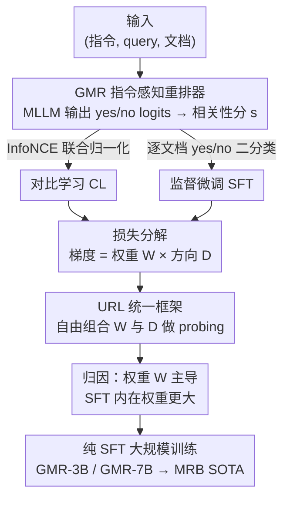

# Supervised Fine-Tuning or Contrastive Learning? Towards Better Multimodal LLM Reranking

**会议**: ICLR 2026  
**OpenReview**: [https://openreview.net/forum?id=1Mh2q7L0eY](https://openreview.net/forum?id=1Mh2q7L0eY)  
**代码**: https://hf.co/vec-ai/lychee-rerank-mm (模型已开源)  
**领域**: 信息检索 / 多模态重排  
**关键词**: 重排序, 对比学习, 监督微调, 多模态检索, 损失分解

## 一句话总结
这篇论文系统比较了训练 LLM 重排器的两条主流路线——对比学习（CL）和监督微调（SFT），把两者的梯度拆成"权重 × 方向"两个分量，证明 SFT 之所以更强主要赢在**权重**项（给难样本更大的更新步长），并据此用纯 SFT 训出 GMR-3B / GMR-7B，在自建的 40 数据集 MRB 基准上刷到通用多模态重排 SOTA。

## 研究背景与动机
**领域现状**：重排（reranking）是检索流水线里给候选重新打分排序的关键一环。如今主流是 pointwise 设定——独立地给每个 query-候选对打一个相关性分。训练这种重排器历史上有两条路：一是沿用 BERT 时代的**对比学习**（CL，对相关/不相关对算 InfoNCE 损失），二是把它当成**二分类的监督微调**（SFT，让模型对相关对预测 "yes" token、不相关对预测 "no"，取 "yes" 概率当分数）。

**现有痛点**：在 BERT-style encoder 上，大量研究表明 CL 比判别式分类更有效；可一旦换成生成式 LLM，SFT 反而显得更顺手——因为预测下一个 token 本就贴合 LLM 的生成本性。两套结论各说各话，社区里没有共识：到底哪种目标"内在地"更适合 LLM 重排？更要命的是没人说清**为什么**有差别。

**核心矛盾**：CL 和 SFT 的损失形式看起来很不一样（一个跨所有负样本联合归一化，一个对每个文档独立算交叉熵），但它们对模型参数的更新到底差在哪，从未被拆开比较过。如果只看端到端性能高低，永远说不清是优化信号的"力度"不同、还是"方向"不同。

**本文目标**：把"谁更好"拆成两个可控的子问题——**权重（更新幅度）**和**方向（更新朝向）**各自贡献了多少差距；并以更难、更综合的**通用多模态检索（UMR）**作为试验场，顺带补上多模态重排长期缺位的问题。

**切入角度**：作者注意到 CL 和 SFT 的损失对隐状态的梯度都能写成 `权重标量 × 方向向量` 的形式。既然形式同构，就可以搭一个统一框架，把任意一方的权重配另一方的方向，做受控的 probing 实验，从而把性能差精确归因。

**核心 idea**：把重排损失分解为 weight 和 direction 两个分量，发现 **SFT 的优势几乎全来自更大的权重项**（方向上两者没有明显赢家），用一句话概括就是"赢在给难样本更大的更新步，而不是更新方向"。

## 方法详解

### 整体框架
论文要回答"CL 还是 SFT 更适合 LLM 重排，为什么"。整体思路是：先搭一个标准的多模态 pointwise 重排器 GMR，把同一个 backbone 分别用 CL 和 SFT 训练；再把两种损失对隐状态的梯度**拆成权重 W 和方向 D 两个分量**，并实现一个统一损失框架 URL（Unified Reranking Loss），允许把某一方的权重和另一方的方向自由组合；最后通过一系列 probing 实验把性能差精确归因到权重，并据此用纯 SFT 大规模训练出 SOTA 重排器。

### 关键设计

**1. GMR：指令感知的 pointwise 多模态重排器与 yes/no 打分**

要在统一框架下比较 CL 和 SFT，首先得有一个对两者都公平的重排器载体。GMR 以一个强多模态 LLM（Qwen2.5-VL-Instruct）为骨干，输入统一组织成 `(指令 ins., query q, 文档 d)` 三元组——指令用一句任务描述（如视觉文档检索里"找一张和用户问题相关的截图"）来引导模型理解当前任务，这在 MLLM 检索里已被验证很有效。

打分方式则随训练目标而变，这正是后续分析能对齐的关键。SFT 设定下取 "yes" 与 "no" 两个 LM-head logit 归一化后的概率作为相关性分：$s(\text{ins.}, q, d) = \frac{\exp(z_y)}{\exp(z_y)+\exp(z_n)}$，其中 $z_y, z_n$ 是 "yes"/"no" token 的 logit；CL 设定下则直接取 "yes" token 的 logit $s = z_y$。这样两种范式共用同一个骨干和输入模板，差别只落在损失和打分公式上，为公平归因打底。

**2. 损失分解为"权重 × 方向"并落地为 URL 统一框架**

这是全文的方法核心，针对的痛点是"CL 和 SFT 损失形式差太大、无法直接对比"。作者对每个样本（一个正例 $d_0^+$、N 个负例 $d_i^-$）算出损失对隐状态的偏导，发现 CL 和 SFT 的梯度都能写成 `权重 × 方向` 的同构形式。把它们整理出来：CL 的正例权重 $W^+_{CL}=\frac{\sum_i \exp(z_y(h_i^-))}{\exp(z_y(h_0^+))+\sum_i \exp(z_y(h_i^-))}$，分母里聚合了**所有负例**；而 SFT 的正例权重 $W^+_{SFT}=\frac{\exp(z_n(h_0^+))}{\exp(z_y(h_0^+))+\exp(z_n(h_0^+))}$，只跟**当前这一个文档**有关。方向上，CL 的正例方向是 $D^+_{CL}=M_y$，SFT 是 $D^+_{SFT}=M_y-M_n$（$M_y, M_n$ 是 "yes"/"no" token 的嵌入投影），正负例方向恰好相反。

基于这个分解，作者实现了统一重排损失框架 URL，损失统一写成 $L = \text{mean}(W^+D^+ + \sum_i W_i^- D_i^-)$，并把"权重用 CL 还是 SFT""方向用 CL 还是 SFT"做成两个可独立切换的开关。这样就能把 $W_{SFT}+D_{CL}$、$W_{CL}+D_{SFT}$ 等组合都跑一遍，从而把性能差**干净地归因**到某一个分量。实验先验证 URL 复现原始实现的性能（统计上不可区分），保证后续分析可信。

**3. 权重主导性能，且其本质是"实例自适应"的更新调度**

把四种组合跑出来（见表 1），作者发现**换权重带来的性能变化（ΔW≈1.1–1.5）远大于换方向（ΔD≈0.2–0.6）**，权重才是 SFT 胜 CL 的主因。为什么 SFT 的权重更好？从公式看 $W_{CL}$ 的分母要加上所有负例，天然被压得很小；而 $W_{SFT}$ 只归一化单个文档，数值更大。结合 Chen et al. (2021) 的观察——小 batch 下 InfoNCE 梯度会缩到接近数值精度误差、丧失有效学习信号，而重排恰恰因输入 token 长、负例数受限（只能 $k+1$）而常处小 batch，所以 CL 的小权重问题在重排里尤其严重。训练曲线也证实 $W_{CL}$ 一直偏小，SFT 给出更大（更好）的权重。

更进一步，权重不能简单"越大越好"。作者把正负权重都固定为常数 1 当 baseline（$W_{base}$），性能反而崩到 49.47；加一条"已学好就停更"的掩码规则（正例分够高 $s(h_0)>1-\tau$ 或负例分够低 $s(h_j)<\tau$ 时把权重置 0）后直接涨到 56.57。这说明权重的真正功能是**实例自适应的引导**：对已经掌握的样本少更新、对没学透的难样本多更新——SFT 的权重内在地实现了这一点。

**4. 方向：原生 SFT 方向已近最优，CL 方向才有可调空间**

方向虽不主导，但也贡献了部分差距，作者做了两组探针。其一，SFT 本质是 "yes/no" 二分类，那多加几个 token（"true"/"false"/"maybe" 等）会不会让方向更好？实验把 token 数从 2 增到 16，性能几乎不动（57.9 上下），说明只用 "yes/no" 两个 token 就够。其二，方向分量本质对应 LLM 预训练并冻结的 token 嵌入；CL 时代常从头学一个打分投影矩阵，这套还管用吗？把方向换成随机初始化的可学投影 $D_{Rand}$ 后，CL 模型涨了 1.32（但仍不及 SFT），SFT 模型反而掉了 1.34。直觉一致：SFT 就是奔着预测 "yes/no" token 去训的，换成随机投影会丢掉预训练 token 嵌入里的语义信号，所以原生 SFT 方向已近最优、不必再学。

### 损失函数 / 训练策略
最终 GMR 系列采用纯 SFT（每个三元组算 "yes"/"no" 的交叉熵 $L^{SFT}_i = -\log p(l \mid z(\{\text{yes,no}\} \mid \text{ins.}, q, d_i))$，正例标签为 "yes"、负例为 "no"）。骨干为 Qwen2.5-VL-Instruct 3B / 7B，用 LoRA（rank 16，学习率 1e-4），最大输入长度 3200 token，bf16 精度，8×A100-80G。每个样本配 16 个负例（§4 的分析实验用 4 个），负例按"随机选 : 难例挖掘 = 1:1"采样。全量约 150 万训练样本（§4 用约 27 万的均衡子集做公平对比）。

## 实验关键数据

### 主实验
MRB 基准含 40 个测试集，覆盖单模态、跨模态、融合模态共 9 类任务，统一以 GME-2B 作检索骨干、对 top-100 候选重排。

| 模型 | 规模 | 单模态 T→T(14) | 跨模态 T→VD(5) | 融合 IT→IT(3) | ALL(40) |
|------|------|------|------|------|------|
| GME-2B（检索基线） | 2.21B | 49.59 | 66.39 | 66.89 | 52.54 |
| Jina-rerank-m0 | 2.21B | 55.36 | 73.13 | 51.54 | 54.36 |
| MonoQwen2-VL | 2.21B | 48.89 | 71.29 | 35.83 | 44.20 |
| **GMR-3B** | 3.75B | 59.22 | 72.38 | 79.08 | **61.40** |
| **GMR-7B** | 8.29B | 61.08 | 72.94 | 82.19 | **63.85** |

GMR-3B 已超过融合模态重排器 Jina-m0（61.40 vs 54.36），GMR-7B 进一步拉开；在 T→T 上 GMR-7B 还反超约 40 亿参数、专为文本重排优化的 Qwen3-Reranker。多图场景的 MRMR Knowledge 子集（NDCG@10）上 GMR-7B 达 74.22，同样领先所有重排基线。

### 消融实验
损失分量组合（MRB 平均分，表 1）与权重功能探针（表 2）：

| 配置 | 关键指标 | 说明 |
|------|---------|------|
| $W_{SFT}+D_{SFT}$ | 58.09 | 完整 SFT，最佳 |
| $W_{SFT}+D_{CL}$ | 57.88 | 换 CL 方向，仅降 0.21 |
| $W_{CL}+D_{SFT}$ | 56.99 | 换 CL 权重，降 1.10 |
| $W_{CL}+D_{CL}$ | 56.40 | 完整 CL |
| $W_{base}$（权重恒为 1） | 49.47 | 常数权重严重失效 |
| $W_{base}$ + τ 掩码 | 56.57 | 加"已学好停更"规则 ▲7.10 |
| $W_{base}$ + $W_{SFT}$ | 58.19 | SFT 权重 ▲8.72 |

### 关键发现
- **权重是主因**：换权重的性能落差（1.10–1.48）数倍于换方向（0.21–0.59），SFT 赢在权重而非方向。
- **常数权重必败、实例自适应才行**：固定权重为 1 崩到 49.47；加一条"已掌握样本停更"的简单掩码就能逼近 CL，印证权重的本质是按样本难度调度更新幅度。
- **SFT 方向已近最优**：加 token、换随机可学投影都帮不到 SFT（甚至掉点），但能帮 CL——说明 SFT 充分利用了预训练 "yes/no" token 嵌入的语义。
- **负例越多越好 + 重排深度鲁棒**：SFT 负例从 2 增到 16 单调涨到 58.68；从 top-25 加深到 top-100 时 GMR 持续涨（+1.47% / +2.39%），而 Jina-m0 反而掉 0.08%。

## 亮点与洞察
- **把"谁更好"变成"哪个分量更好"**：用权重×方向的统一分解 + URL 框架做受控 probing，是把模糊的端到端对比变成可归因实验的漂亮范式，这套方法论可迁移到任何两种损失的对比分析（如不同对比损失、不同蒸馏目标）。
- **重排小 batch 是 CL 的天然短板**：作者把 CL 在重排上吃亏的根因落到"小 batch + 长输入 → InfoNCE 梯度缩到精度误差"，给出了具体而非泛泛的解释，对实践选型很有指导性。
- **权重=难度感知的学习率**：把权重重新诠释为"对已学好的样本少更新、对难样本多更新"，这个视角让人想到 focal loss / hard example mining，可启发设计显式的实例级权重调度。

## 局限与展望
- 全文只针对 **pointwise** 重排，listwise/pairwise 设定下 CL 与 SFT 的权重-方向结论是否成立未验证。
- 结论建立在"小 batch、负例数受限"的重排场景；若负例规模能像 dense retrieval 那样放大，CL 的小权重问题或许缓解，SFT 优势可能收窄。
- 分析以多模态检索为试验场，但权重主导的结论主要来自数值与梯度论证，跨任务（纯文本大 batch 重排、推荐排序等）的普适性仍需更多实证。
- 方向探针只试了"加 token"和"随机可学投影"两种，是否存在介于二者之间、对 SFT 也有增益的方向参数化方式，留有探索空间。

## 相关工作与启发
- **vs CL-based reranker（Nogueira 2019 / Zhang 2024）**: 它们沿用 BERT 时代的 InfoNCE 对比训练；本文证明在 LLM 重排上 CL 的权重项被所有负例联合归一化压得过小，从而系统性弱于 SFT，并给出 URL 框架定量归因。
- **vs SFT-based reranker（Nogueira 2020 / Qwen3-Reranker）**: 它们经验性地用 yes/no 二分类微调 LLM 重排器但没解释为何有效；本文补上机制——SFT 的逐文档权重天然更大且实例自适应，是其优势来源。
- **vs 通用多模态检索 GME / UMR（Zhang 2025b）**: 这些工作聚焦检索（retriever）阶段且重排在 UMR 里长期缺位；本文专攻重排阶段，并自建 40 数据集的 MRB 基准填补多模态重排评测空白。

## 评分
- 新颖性: ⭐⭐⭐⭐⭐ 把损失分解为权重×方向并做受控归因，回答了"SFT vs CL 为什么"这个长期悬而未决的问题。
- 实验充分度: ⭐⭐⭐⭐⭐ 40 数据集 MRB + 多图 MRMR + 分量组合/权重/方向/负例数/重排深度全套消融。
- 写作质量: ⭐⭐⭐⭐ 分析链条清晰，但公式与符号密集，初读需对照附录。
- 价值: ⭐⭐⭐⭐⭐ 既给出可复用的归因方法论，又交付开源 SOTA 多模态重排器与新基准。

<!-- RELATED:START -->

## 相关论文

- [\[ICML 2025\] FedRAG: A Framework for Fine-Tuning Retrieval-Augmented Generation Systems](../../ICML2025/information_retrieval/fedrag_a_framework_for_fine-tuning_retrieval-augmented_generation_systems.md)
- [\[ACL 2026\] GIFT: Guided Fine-Tuning and Transfer for Enhancing Instruction-Tuned Language Models](../../ACL2026/information_retrieval/gift_guided_fine-tuning_and_transfer_for_enhancing_instruction-tuned_language_mo.md)
- [\[ICLR 2026\] Let LLMs Speak Embedding Languages: Generative Text Embeddings via Iterative Contrastive Refinement](let_llms_speak_embedding_languages_generative_text_embeddings_via_iterative_cont.md)
- [\[ICLR 2026\] MRMR: A Realistic and Expert-Level Multidisciplinary Benchmark for Reasoning-Intensive Multimodal Retrieval](mrmr_a_realistic_and_expert-level_multidisciplinary_benchmark_for_reasoning-inte.md)
- [\[ICLR 2026\] Think Then Embed: Generative Context Improves Multimodal Embedding](think_then_embed_generative_context_improves_multimodal_embedding.md)

<!-- RELATED:END -->
