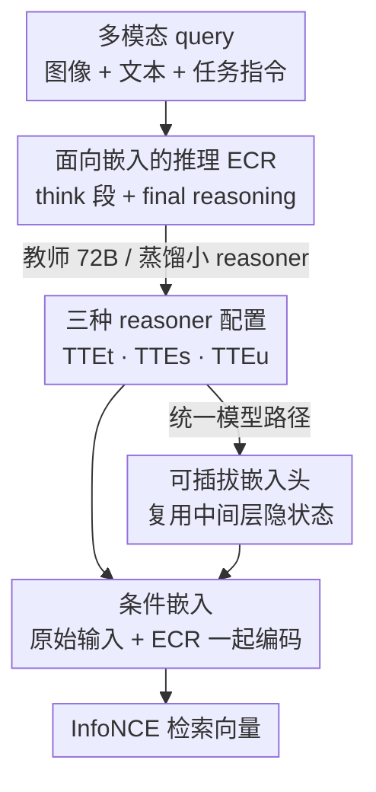

# Think Then Embed: Generative Context Improves Multimodal Embedding

**会议**: ICLR 2026  
**OpenReview**: [https://openreview.net/forum?id=AKXXMK5YTI](https://openreview.net/forum?id=AKXXMK5YTI)  
**代码**: 无  
**领域**: 多模态VLM / 多模态检索 / 表示学习  
**关键词**: 通用多模态嵌入, Think-Then-Embed, 链式推理, 检索, MMEB

## 一句话总结
针对复杂指令下"直接把多模态大模型当编码器"会失效的问题，本文提出 Think-Then-Embed（TTE）框架：先让一个 reasoner 生成"面向嵌入的推理轨迹"（ECR），再让 embedder 在原始输入与该推理轨迹的双重条件下产出向量，从而在 MMEB-V2 上取得 SOTA（TTE$_t$-7B 71.5%），并在开源模型中以约 7% 的绝对优势领先。

## 研究背景与动机
**领域现状**：通用多模态嵌入（Universal Multimodal Embedding, UME）是当下检索的热点——同一张图、同一段文本，会因为附带的任务指令不同而被编码成不同的向量。主流做法是把多模态大模型（MLLM）直接当作编码器：query 和 target 各自走一遍 MLLM，取最后一个 token 的隐状态做嵌入，再用 InfoNCE 对比损失拉近正样本对。围绕这条路线，社区主要在堆"训练侧技巧"——hard negative 挖掘、额外训练阶段、外部数据、更好的池化方式。

**现有痛点**：这些工作都把 MLLM 当成纯编码器，**完全浪费了它在预训练中学到的生成/推理能力**。而 MMEB-V2 里很多任务（VQA、分类、视觉 grounding、composed retrieval）本质上需要多步推理。比如 RefCOCO 的 query "离相机第二近的车辆"，直接编码这句话再去匹配图像区域是很难的——模型得先想清楚"它指的是那辆上半截亮黄、下半截深蓝的老式双层巴士"，才能精准定位。指令越复杂、越需要组合推理，纯编码范式就越力不从心。

**核心矛盾**：嵌入质量受限于模型对指令的"理解深度"，而单次前向编码没有给模型留出"想一想"的空间——它只能把复杂指令一次性压进向量里，无法像生成任务那样通过中间步骤逐步澄清语义。

**本文目标**：(1) 在嵌入之前显式插入一个推理阶段；(2) 让推理这件事在不依赖巨型外部 reasoner 的情况下也能落地；(3) 把 reasoner 和 embedder 融进一个模型以省参数省算力。

**切入角度**：作者借鉴 Chain-of-Thought（CoT）的成功经验。既然 MLLM 产出的嵌入本来就是在"前面所有 token 序列"的条件下生成的，那么在 query 前面拼一段高质量的推理文本，理论上就能把嵌入"条件"到一个更利于检索的语义空间上。

**核心 idea**：用"先思考、后嵌入"（Think-Then-Embed）代替"直接编码"——先生成面向嵌入的推理轨迹，再让嵌入同时条件于原始输入和这段轨迹。

## 方法详解

### 整体框架
TTE 把传统的"单步编码"拆成两步：一个 **reasoner** $g_\omega$ 先读入多模态 query $\langle V, T, [\text{Ins}]\rangle$，生成一段面向嵌入的推理轨迹 $\psi$（Embedding-Centric Reasoning, ECR）；随后 **embedder** $f_\theta$ 把原始输入和这段轨迹拼在一起编码，取最后 token 的隐状态做最终嵌入：

$$h = \text{Pooling}\big(f_\theta(V, [\text{Ins}], T, \psi)\big), \qquad \psi = g_\omega(V, [\text{Ins}], T).$$

embedder 的训练仍是标准的单向 $q \to t$ InfoNCE 对比损失，区别只在于 query/target 的隐状态此时都额外条件于 ECR。围绕"reasoner 从哪来"，本文给出三种实例化：用巨型教师模型直接生成（TTE$_t$）、把同规模 backbone 蒸馏成小 reasoner（TTE$_s$）、以及把 reasoner 和 embedder 合并成单模型靠一个嵌入头一次前向出结果（TTE$_u$）。

### 关键设计

**1. 面向嵌入的推理 ECR：让"想"这一步直接服务于"嵌"**

这是 TTE 的灵魂。普通 CoT 是为"答对题"服务的，而 ECR 是专门为"产出好嵌入"服务的中间推理。形式上，对一对 $(q,t)$，理想的 ECR 是让对比目标最大的那段文本：$\psi^\star_i \in \arg\max_\psi \log \frac{\phi(h^i_q, h^i_t)}{\sum_j \phi(h^i_q, h^j_t)}$。直接按这个目标优化 reasoner（比如 RL）很难，本文做了简化：用人工设计的任务提示与格式，让 reasoner 按 `<think> … </think> Final Reasoning` 的模板生成——先吐一段中间 CoT，再给一段最终 reasoning。内容随任务类型而变：QA 类 query 的 CoT 就是标准的逐步推理；视觉文档这种简单嵌入任务，CoT 是对视觉输入的详细描述，final reasoning 则是其摘要；grounding 类则是被指物体及其周边视觉上下文的细致描述。把 embedder 条件在这种"任务对齐"的推理上，它就能构造出语义更对齐、更懂任务意图的向量。值得注意的是，实验表明 ECR 文本本身并不能直接拿去做文本检索（T2T baseline 显著更差），它的价值在于给 embedder 提供信号，而非替代 embedder。

**2. 三档 reasoner 配置：在性能与算力之间铺出一条可调谱系**

ECR 从哪生成，决定了整套系统的成本与天花板，本文把它做成三个可选档位。**TTE$_t$（教师 reasoner）**用一个强力大模型（Qwen2.5-VL-72B）当 reasoner，embedder 保持轻量（Qwen2VL-2B/7B）。看似昂贵，但作者指出很多真实检索任务里 ECR 只需对索引侧做一次离线生成（比如给视觉文档写详细描述），新数据点才需要跑 reasoner，在线检索老数据完全不触发它——这其实是一种"检索的测试时扩展"，想更强随时换更猛的外部 reasoner。**TTE$_s$（蒸馏小 reasoner）**为了摆脱对 72B 的依赖，用教师生成的 ECR 当训练数据，把一个与 embedder 同规模（2B/7B）的 backbone 微调成专职 reasoner，目标是标准的 NLL 似然 $L_{\text{SFT}}(\omega) = -\frac{1}{T}\sum_t \log p_\omega(\psi_t \mid V, [\text{Ins}], T, \psi_{t'<t})$。蒸馏后小 reasoner 在整个 MMEB-V2 上都很能打，成为开源模型里的最强档。作者还发现：哪怕只用 backbone 自己 zero-shot 生成 ECR，性能也能普涨，但会被零样本 ECR 的质量卡住瓶颈，所以才进一步做 SFT 蒸馏。

**3. 统一模型的可插拔嵌入头：复用推理隐状态，一次前向出向量**

TTE$_t$/TTE$_s$ 都得跑两遍模型，开销大。**TTE$_u$**把 reasoner 和 embedder 合进同一 backbone：reasoner 生成完 ECR 后，它产生的全部隐状态被送进一个预训练好的嵌入头，单次前向就出向量。作者先试了"联合 SFT+对比"的多任务训练，但因训练课程难调而稳定掉点（细节见附录），于是改用**两阶段策略**——第一阶段在 ECR 数据上全量微调 backbone 当 reasoner，第二阶段冻结 backbone、只训练顶上的嵌入头；这样对比目标和生成目标互不串梯度，互不干扰。关于嵌入头本身，本文做了首个系统比较：简单的 attention pooler、NV-Embed 式 latent pooler、QFormer 式头、以及用 backbone 末 $n$ 层"自初始化"的 MHSA 头。结论是简单 depth=1 池化器远不够（增加 query 数也无明显改善），而把目光从最后一层移到**靠前的中间层**（如倒数第 8 层）、再叠多层 MHSA 头效果最好——当用末 8 层自初始化时，TTE$_u$ 能逼平单独微调的 embedder（TTE$_s$）。背后的洞察是：MLLM 最后一层是为 token 级判别（预测下一个词）特化的，对检索表示未必最优，中间层反而保留了更丰富的语义结构。

### 损失函数 / 训练策略
embedder 用温度 $\tau=0.02$ 的单向 InfoNCE 对比损失，backbone 走 LoRA（rank 16 / alpha 64），全局 batch 8192，配合 GradCache 扩大单卡 batch；MMEB-V1 训 1 epoch，MMEB-V2 训 2.3 epoch 并沿用 VLM2Vec-V2 的数据加权与交错采样。ECR reasoner 的 SFT 为全参微调（冻结视觉编码器），lr 2e-5、batch 128、1 epoch，用 DeepSpeed ZeRO-1 做 optimizer offloading。

## 实验关键数据

### 主实验
评测覆盖 MMEB-V1（36 任务，分类/VQA/检索/grounding 四大元任务）与 MMEB-V2（78 任务，新增视频与视觉文档 visdoc）。图像/视频报 Precision@1，visdoc 报 NDCG@5。

| 基准 | 模型 | 指标 | 本文 | 之前最好 | 提升 |
|------|------|------|------|----------|------|
| MMEB-V1（7B） | TTE$_t$ | Overall | 78.5 | 72.5（QQMM） | +6.0 |
| MMEB-V1（7B） | TTE$_s$ | Overall | 73.3 | 72.5（QQMM） | +0.8（开源最佳） |
| MMEB-V1（7B） | TTE$_t$ vs VLM2Vec-V1 | Overall | 78.5 | 65.8 | +12.7 |
| MMEB-V2（7B） | TTE$_t$ | All | 71.5 | 71.3（seed-1.6，闭源+大数据） | +0.2（榜首） |
| MMEB-V2（7B） | TTE$_s$ | All | 68.6 | 61.2（VLM2Vec-V2） | +7.4（开源最佳） |
| MMEB-V2（2B） | TTE$_t$ vs VLM2Vec-V2 | All | 68.6 | 58.0 | +10.6 |

TTE$_t$-7B 在 MMEB-V2 上以 71.5% 登顶，超过用海量内部数据训练的闭源模型 seed-1.6-embedding；不依赖教师时，TTE$_s$ 在 2B/7B 两档都是开源最强。提升主要来自 VQA、分类，以及更难的视频检索（+5%，明显高于图像检索约 +2%），印证了越难的任务越吃 ECR 的红利。

### 消融实验

| 配置 | MMEB-V1 Overall（7B） | 说明 |
|------|----------------------|------|
| Baseline（直接编码） | 65.8 | VLM2Vec-V1 |
| + zero-shot ECR（不 SFT reasoner） | 68.3 | 仅靠 backbone 自生成推理就涨 |
| + SFT-ed reasoner（TTE$_s$） | 73.3 | 蒸馏后再涨 ~6%（绝对） |
| TTE$_t$ w/o CoT（只留 final reasoning） | 76.6 | 去掉中间 CoT |
| TTE$_t$ w/ CoT（完整 ECR） | 78.1 | 完整 ECR |

嵌入头消融（MMEB-V1，TTE$_s$=68.7）：简单 attention pooler 仅 47–49（query 数 1→16 几乎不动），NV-Embed 式 latent pooler 44.4，QFormer 头 65.7–67.1，而末 8 层自初始化 MHSA 头达 68.8，逼平单独微调的 embedder。

### 关键发现
- **CoT 不是可有可无**：去掉中间 CoT 后分类/检索/grounding 一致掉点（VQA 掉得最少，因为 VQA 主要看最终答案），且 7B 比 2B 受益更大——更强的语言能力能更好地利用中间推理。
- **embedder 对噪声 ECR 鲁棒**：即使 ECR 本身不完美、单独拿去检索精度很低，embedder 也能从中抽取有用信号而不盲信它；但"鲁棒"不等于"对 ECR 质量无所谓"——换不同 reasoner（如 TTE$_s$ vs TTE$_t$）仍会显著影响最终表现。
- **中间层 > 最后一层**：冻结 backbone 时，倒数第 8 层附近的隐状态比最后一层更适合做检索表示；但这点增益不大，多数提升其实来自嵌入头本身的可训练容量。LoRA+last token 设置下趋势相反——选越多底层反而越差，因为 LoRA 可适配的 block 变少了。
- **教师模型不是越大越好**：Qwen2.5-VL-32B 与 72B 表现相当；而 Gemini2.5-Pro 在视频/视频时刻检索上猛涨（最高 +14% 绝对），但在图像/visdoc 上略逊 72B——教师的优势高度依赖任务类型。

## 亮点与洞察
- **把生成能力"接回"嵌入**：这篇最大的"啊哈"在于指出整个 UME 社区都把 MLLM 当哑编码器，而 TTE 用一段推理文本作为"软条件"重新激活了它的生成先验——思路简单却补上了被忽视的能力维度。
- **ECR 的离线性质让成本可控**：把昂贵的 reasoner 限定在"建索引时一次性离线生成"，在线检索完全不碰它，相当于把测试时算力前置到索引侧，工程上非常务实，也天然支持"换更强 reasoner 即涨点"的 test-time scaling。
- **中间层做嵌入的发现可迁移**："最后一层是为 token 判别特化的、检索该用中间层"这个观察对所有 LLM-based embedding 都有参考价值，可直接搬到纯文本嵌入模型上试。
- **两阶段解耦优于联合训练**：先训 reasoner、再冻结只训嵌入头，避免对比梯度污染生成能力——这种"目标隔离"的训练课程设计可复用到任何"一模型干两活"的统一架构。

## 局限与展望
- **ECR 靠人工提示模板而非端到端学习**：作者明确把"用检索信号直接优化 reasoner（如 RL）"留作未来工作，当前 ECR 质量受限于手写 prompt 与格式。
- **教师档（TTE$_t$）仍需巨型 reasoner**：虽然论证了离线一次性的合理性，但对全新分布、海量新数据点的场景，72B reasoner 的生成开销依然不可忽视。
- **联合训练失败的根因未充分展开**："joint SFT+对比"为何稳定掉点只归因于"训练课程难调"，缺乏更细的机理分析，留在附录。
- **改进方向**：把 ECR 生成做成 RL/对比信号驱动的可学习目标，或让 reasoner 针对不同任务自适应决定"想多长"，有望在保住精度的同时进一步压低推理成本。

## 相关工作与启发
- **vs VLM2Vec / UniME / LLaVE / B3（纯编码 MLLM 嵌入）**：它们都在训练侧堆技巧（hard negative、额外阶段、外部数据），把 MLLM 当编码器；本文走正交路线，引入显式推理阶段，在同 backbone 下 7B 较 VLM2Vec-V1 提升 12.7%。
- **vs LLM 查询改写（query rewriting）**：传统查询改写面向纯文本检索、用外部检索器、不涉及学习到的嵌入；TTE 的推理同时作用于 query 和 target，且产出的是学习型多模态嵌入。最接近的 Bai et al.(2025b) 把查询改写用于单模态 CLIP 的文到视频检索以补信息不对称，但仍是编码器路线、不含生成式推理条件。
- **vs 生成+对比统一模型（如 Yu et al. 2025）**：前者把生成与嵌入当成两个互不相关的任务并行训练；本文的统一模型强调"先生成、再用生成产物增强嵌入"，二者是因果串联而非并列。

## 评分
- 新颖性: ⭐⭐⭐⭐⭐ 把被忽视的 MLLM 生成能力以"think-then-embed"形式接回嵌入，视角正交且自洽。
- 实验充分度: ⭐⭐⭐⭐⭐ MMEB-V1/V2 双榜 SOTA，三档 reasoner、嵌入头设计、教师容量、层选择消融齐全。
- 写作质量: ⭐⭐⭐⭐ 主线清晰、图表到位；联合训练失败等部分被压进附录略显仓促。
- 价值: ⭐⭐⭐⭐⭐ 给 UME 开了一条可即插即用、可 test-time scaling 的新范式，工程落地性强。

<!-- RELATED:START -->

## 相关论文

- [\[ICLR 2026\] Embedding-Based Context-Aware Reranker](embedding-based_context-aware_reranker.md)
- [\[ICLR 2026\] Let LLMs Speak Embedding Languages: Generative Text Embeddings via Iterative Contrastive Refinement](let_llms_speak_embedding_languages_generative_text_embeddings_via_iterative_cont.md)
- [\[ACL 2026\] More Than Efficiency: Embedding Compression Improves Domain Adaptation in Dense Retrieval](../../ACL2026/information_retrieval/more_than_efficiency_embedding_compression_improves_domain_adaptation_in_dense_r.md)
- [\[ICLR 2026\] Frustratingly Simple Retrieval Improves Challenging, Reasoning-Intensive Benchmarks](frustratingly_simple_retrieval_improves_challenging_reasoning-intensive_benchmar.md)
- [\[ICLR 2026\] Supervised Fine-Tuning or Contrastive Learning? Towards Better Multimodal LLM Reranking](supervised_fine-tuning_or_contrastive_learning_towards_better_multimodal_llm_rer.md)

<!-- RELATED:END -->
